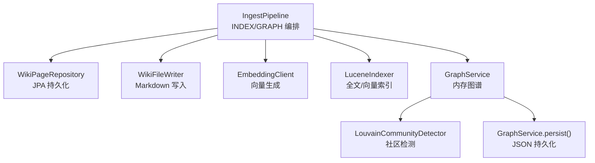
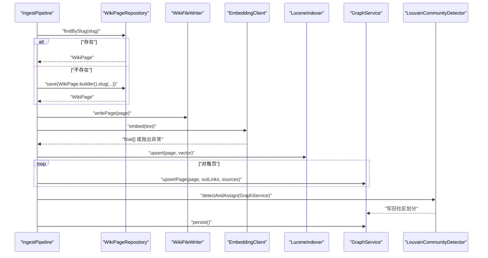
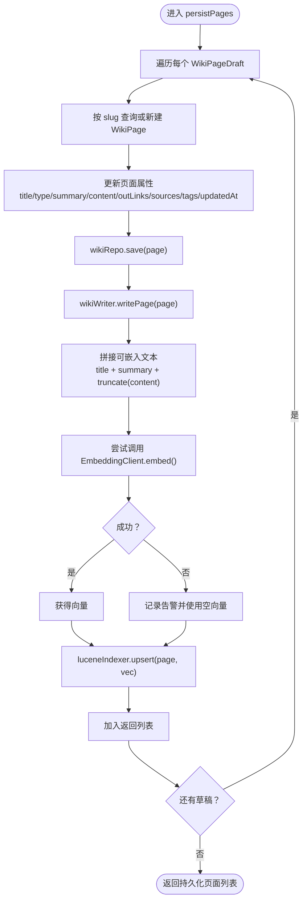
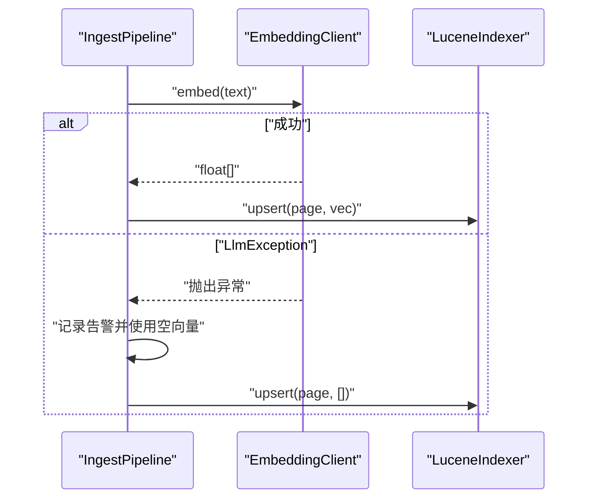
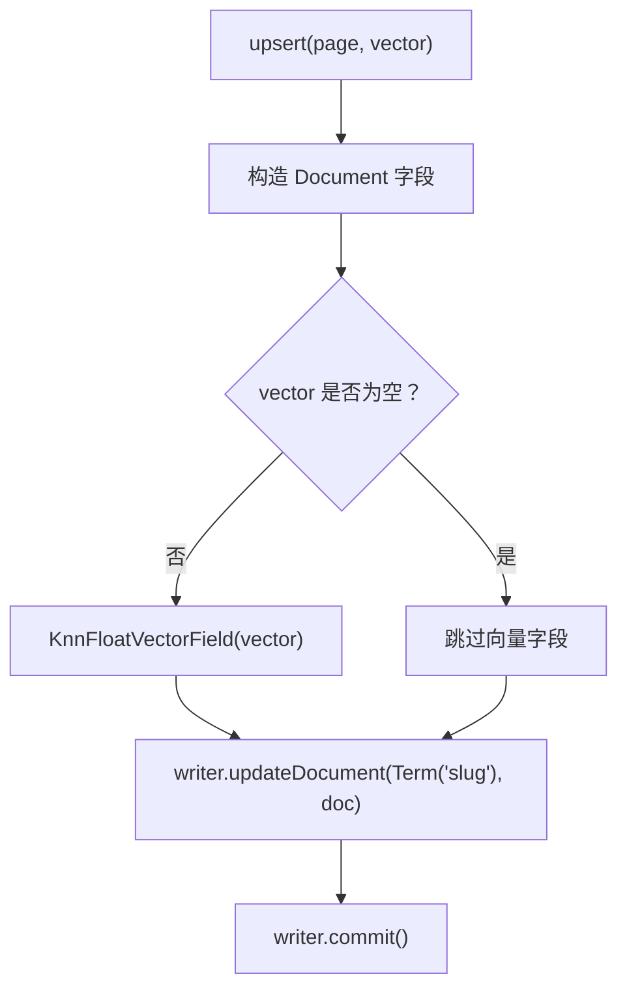
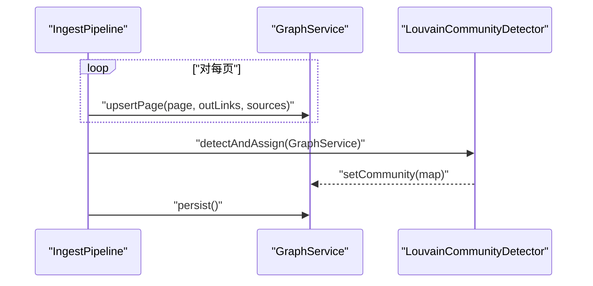
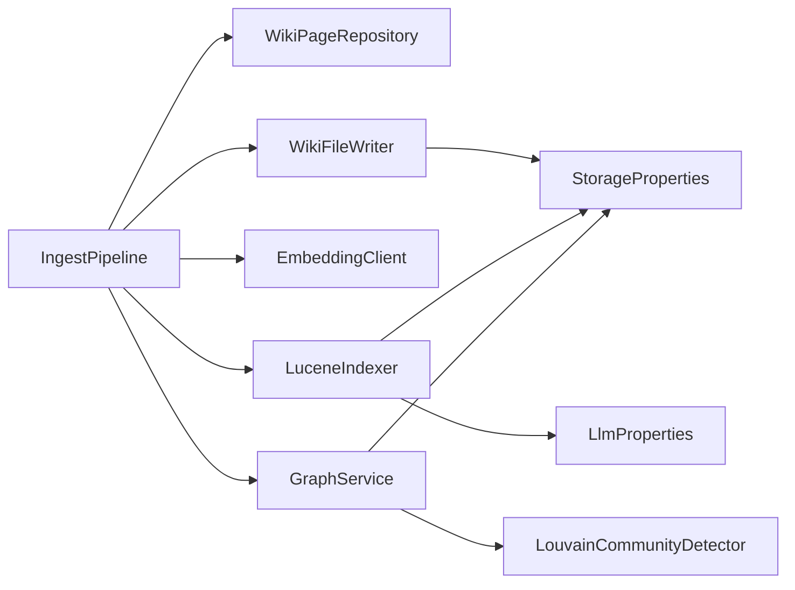

# 索引图谱阶段

<cite>
**本文引用的文件**
- [IngestPipeline.java](file://src/main/java/com/example/llmwiki/ingest/IngestPipeline.java)
- [WikiFileWriter.java](file://src/main/java/com/example/llmwiki/ingest/WikiFileWriter.java)
- [GraphService.java](file://src/main/java/com/example/llmwiki/graph/GraphService.java)
- [LouvainCommunityDetector.java](file://src/main/java/com/example/llmwiki/graph/LouvainCommunityDetector.java)
- [LuceneIndexer.java](file://src/main/java/com/example/llmwiki/retrieval/LuceneIndexer.java)
- [EmbeddingClient.java](file://src/main/java/com/example/llmwiki/llm/EmbeddingClient.java)
- [WikiPage.java](file://src/main/java/com/example/llmwiki/domain/WikiPage.java)
- [WikiPageRepository.java](file://src/main/java/com/example/llmwiki/repository/WikiPageRepository.java)
- [application.yml](file://src/main/resources/application.yml)
- [StorageProperties.java](file://src/main/java/com/example/llmwiki/config/StorageProperties.java)
- [LlmProperties.java](file://src/main/java/com/example/llmwiki/config/LlmProperties.java)
</cite>

## 目录
1. [简介](#简介)
2. [项目结构](#项目结构)
3. [核心组件](#核心组件)
4. [架构总览](#架构总览)
5. [详细组件分析](#详细组件分析)
6. [依赖关系分析](#依赖关系分析)
7. [性能考量](#性能考量)
8. [故障排查指南](#故障排查指南)
9. [结论](#结论)

## 简介
本章节聚焦“索引图谱”阶段（INDEX/GRAPH），即摄取流水线的最后一步，负责：
- 将生成的页面草稿持久化为 WikiPage，并写入本地 Markdown 文件；
- 为每页内容生成嵌入向量，同步更新 Lucene 全文索引（支持 BM25 与向量检索）；
- 构建并更新知识图谱，执行 Louvain 社区检测，最终持久化图谱数据。

该阶段贯穿了数据库持久化、文件系统写入、向量检索索引与图谱计算等多个子系统，是知识库从“内容生成”到“可检索、可洞察”的关键桥梁。

## 项目结构
围绕 INDEX/GRAPH 阶段的关键文件组织如下：
- 流水线入口与编排：IngestPipeline.run(...) 与 persistPages(...)
- 数据持久化与文件写入：WikiPageRepository、WikiFileWriter
- 向量与索引：EmbeddingClient、LuceneIndexer
- 图谱与社区检测：GraphService、LouvainCommunityDetector
- 配置：StorageProperties、LlmProperties
- 实体模型：WikiPage

图表来源
- [IngestPipeline.java:65-109](file://src/main/java/com/example/llmwiki/ingest/IngestPipeline.java#L65-L109)
- [WikiPageRepository.java:13-18](file://src/main/java/com/example/llmwiki/repository/WikiPageRepository.java#L13-L18)
- [WikiFileWriter.java:32-43](file://src/main/java/com/example/llmwiki/ingest/WikiFileWriter.java#L32-L43)
- [EmbeddingClient.java:34-81](file://src/main/java/com/example/llmwiki/llm/EmbeddingClient.java#L34-L81)
- [LuceneIndexer.java:78-99](file://src/main/java/com/example/llmwiki/retrieval/LuceneIndexer.java#L78-L99)
- [GraphService.java:71-104](file://src/main/java/com/example/llmwiki/graph/GraphService.java#L71-L104)
- [LouvainCommunityDetector.java:34-113](file://src/main/java/com/example/llmwiki/graph/LouvainCommunityDetector.java#L34-L113)

章节来源
- [IngestPipeline.java:65-109](file://src/main/java/com/example/llmwiki/ingest/IngestPipeline.java#L65-L109)
- [application.yml:31-57](file://src/main/resources/application.yml#L31-L57)

## 核心组件
- IngestPipeline：负责编排 INDEX/GRAPH 阶段，包括持久化、文件写入、向量生成与索引更新、图谱更新与社区检测。
- WikiPageRepository：基于 JPA 的页面持久化接口，提供按 slug 查询与保存。
- WikiFileWriter：将 WikiPage 写为 Markdown 文件，兼容 Obsidian 目录结构。
- EmbeddingClient：调用外部 Embedding 服务生成向量，支持批量与单条。
- LuceneIndexer：基于 Lucene 的全文索引器，支持 BM25 与 KNN 向量检索。
- GraphService：内存中的图谱服务，维护节点、邻接表、社区划分，并提供持久化能力。
- LouvainCommunityDetector：简化版 Louvain 社区检测算法，将社区结果写回 GraphService。
- WikiPage：页面实体，包含 slug、title、type、summary、content、sources、tags、outLinks 等字段。

章节来源
- [IngestPipeline.java:52-63](file://src/main/java/com/example/llmwiki/ingest/IngestPipeline.java#L52-L63)
- [WikiPageRepository.java:13-18](file://src/main/java/com/example/llmwiki/repository/WikiPageRepository.java#L13-L18)
- [WikiFileWriter.java:28-43](file://src/main/java/com/example/llmwiki/ingest/WikiFileWriter.java#L28-L43)
- [EmbeddingClient.java:25-81](file://src/main/java/com/example/llmwiki/llm/EmbeddingClient.java#L25-L81)
- [LuceneIndexer.java:39-117](file://src/main/java/com/example/llmwiki/retrieval/LuceneIndexer.java#L39-L117)
- [GraphService.java:37-197](file://src/main/java/com/example/llmwiki/graph/GraphService.java#L37-L197)
- [LouvainCommunityDetector.java:27-143](file://src/main/java/com/example/llmwiki/graph/LouvainCommunityDetector.java#L27-L143)
- [WikiPage.java:29-71](file://src/main/java/com/example/llmwiki/domain/WikiPage.java#L29-L71)

## 架构总览
下图展示了 INDEX/GRAPH 阶段在摄取流水线中的位置与数据流：

图表来源
- [IngestPipeline.java:88-99](file://src/main/java/com/example/llmwiki/ingest/IngestPipeline.java#L88-L99)
- [IngestPipeline.java:179-209](file://src/main/java/com/example/llmwiki/ingest/IngestPipeline.java#L179-L209)
- [WikiPageRepository.java:15](file://src/main/java/com/example/llmwiki/repository/WikiPageRepository.java#L15)
- [WikiFileWriter.java:32-43](file://src/main/java/com/example/llmwiki/ingest/WikiFileWriter.java#L32-L43)
- [EmbeddingClient.java:34-81](file://src/main/java/com/example/llmwiki/llm/EmbeddingClient.java#L34-L81)
- [LuceneIndexer.java:78-99](file://src/main/java/com/example/llmwiki/retrieval/LuceneIndexer.java#L78-L99)
- [GraphService.java:71-104](file://src/main/java/com/example/llmwiki/graph/GraphService.java#L71-L104)
- [LouvainCommunityDetector.java:34-113](file://src/main/java/com/example/llmwiki/graph/LouvainCommunityDetector.java#L34-L113)

## 详细组件分析

### persistPages 方法实现详解
该方法是 INDEX 阶段的核心，负责：
- 根据 slug 查找或创建 WikiPage；
- 更新页面属性（title、type、summary、content、outLinks、sources、tags、updatedAt）；
- 调用 wikiRepo.save() 持久化；
- 使用 WikiFileWriter.writePage() 写入 Markdown 文件；
- 生成嵌入向量并调用 luceneIndexer.upsert() 建立全文索引；
- 返回持久化的页面列表。

图表来源
- [IngestPipeline.java:179-209](file://src/main/java/com/example/llmwiki/ingest/IngestPipeline.java#L179-L209)
- [EmbeddingClient.java:34-81](file://src/main/java/com/example/llmwiki/llm/EmbeddingClient.java#L34-L81)
- [LuceneIndexer.java:78-99](file://src/main/java/com/example/llmwiki/retrieval/LuceneIndexer.java#L78-L99)
- [WikiFileWriter.java:32-43](file://src/main/java/com/example/llmwiki/ingest/WikiFileWriter.java#L32-L43)
- [WikiPageRepository.java:15](file://src/main/java/com/example/llmwiki/repository/WikiPageRepository.java#L15)

章节来源
- [IngestPipeline.java:179-209](file://src/main/java/com/example/llmwiki/ingest/IngestPipeline.java#L179-L209)

### 嵌入向量生成与降级策略
- 文本拼接：标题 + 摘要 + 截断正文，形成可嵌入文本。
- 调用 EmbeddingClient.embed() 生成向量数组。
- 异常处理：当 LlmException 发生时，记录告警并使用空向量（仅做 BM25 索引）。
- 向量维度校验：LuceneIndexer 在 upsert 时会确保向量维度与配置一致，不一致则进行截断补齐。

图表来源
- [IngestPipeline.java:196-205](file://src/main/java/com/example/llmwiki/ingest/IngestPipeline.java#L196-L205)
- [EmbeddingClient.java:34-81](file://src/main/java/com/example/llmwiki/llm/EmbeddingClient.java#L34-L81)
- [LuceneIndexer.java:87-95](file://src/main/java/com/example/llmwiki/retrieval/LuceneIndexer.java#L87-L95)

章节来源
- [IngestPipeline.java:196-205](file://src/main/java/com/example/llmwiki/ingest/IngestPipeline.java#L196-L205)
- [EmbeddingClient.java:44-46](file://src/main/java/com/example/llmwiki/llm/EmbeddingClient.java#L44-L46)
- [LuceneIndexer.java:87-95](file://src/main/java/com/example/llmwiki/retrieval/LuceneIndexer.java#L87-L95)

### Lucene 索引更新
- 字段映射：slug、type、title、summary、content、tags；当向量非空时添加 KnnFloatVectorField。
- 维度对齐：若向量长度与配置不一致，按维度截断或补齐。
- 更新策略：以 slug 为 Term 删除旧文档并插入新文档，随后 commit 提交。

图表来源
- [LuceneIndexer.java:78-99](file://src/main/java/com/example/llmwiki/retrieval/LuceneIndexer.java#L78-L99)
- [LlmProperties.java:45-52](file://src/main/java/com/example/llmwiki/config/LlmProperties.java#L45-L52)

章节来源
- [LuceneIndexer.java:78-99](file://src/main/java/com/example/llmwiki/retrieval/LuceneIndexer.java#L78-L99)
- [LlmProperties.java:45-52](file://src/main/java/com/example/llmwiki/config/LlmProperties.java#L45-L52)

### 图谱更新与社区检测
- GraphService.upsertPage：根据页面与出链重建邻接表，同时基于来源重叠计算边权重；节点信息按需更新。
- LouvainCommunityDetector.detectAndAssign：执行社区检测并将结果写回 GraphService。
- GraphService.persist：将 nodes、adjacency、community 序列化为 graph.json。

图表来源
- [IngestPipeline.java:92-98](file://src/main/java/com/example/llmwiki/ingest/IngestPipeline.java#L92-L98)
- [GraphService.java:71-104](file://src/main/java/com/example/llmwiki/graph/GraphService.java#L71-L104)
- [LouvainCommunityDetector.java:34-113](file://src/main/java/com/example/llmwiki/graph/LouvainCommunityDetector.java#L34-L113)
- [GraphService.java:106-118](file://src/main/java/com/example/llmwiki/graph/GraphService.java#L106-L118)

章节来源
- [IngestPipeline.java:92-98](file://src/main/java/com/example/llmwiki/ingest/IngestPipeline.java#L92-L98)
- [GraphService.java:71-104](file://src/main/java/com/example/llmwiki/graph/GraphService.java#L71-L104)
- [LouvainCommunityDetector.java:34-113](file://src/main/java/com/example/llmwiki/graph/LouvainCommunityDetector.java#L34-L113)
- [GraphService.java:106-118](file://src/main/java/com/example/llmwiki/graph/GraphService.java#L106-L118)

### 并发处理与事务管理策略
- 并发控制：
  - GraphService 的 upsertPage/persist/neighbors/degree 等方法均使用 synchronized，保证内存图操作的原子性。
  - LuceneIndexer 的 upsert/delete/openSearcher 等方法也使用 synchronized，避免多线程并发写入导致的索引损坏。
- 事务管理：
  - WikiPageRepository.save() 由 Spring Data JPA 提供事务语义，默认在同一个事务上下文中提交。
  - IngestPipeline.run() 本身未显式声明事务，但持久化与索引更新在单次 run 中顺序执行，遵循“要么都成功，要么都失败”的原则。
- 建议：
  - 若需要跨多个页面的强一致性，可在 IngestPipeline.run() 上增加 @Transactional(propagation = Propagation.REQUIRED)。
  - 对于高并发场景，可考虑将 INDEX/GRAPH 阶段拆分为异步任务队列，结合重试与幂等设计。

章节来源
- [GraphService.java:71-104](file://src/main/java/com/example/llmwiki/graph/GraphService.java#L71-L104)
- [GraphService.java:106-118](file://src/main/java/com/example/llmwiki/graph/GraphService.java#L106-L118)
- [LuceneIndexer.java:78-99](file://src/main/java/com/example/llmwiki/retrieval/LuceneIndexer.java#L78-L99)
- [WikiPageRepository.java:13-18](file://src/main/java/com/example/llmwiki/repository/WikiPageRepository.java#L13-L18)

## 依赖关系分析
- IngestPipeline 依赖：
  - WikiPageRepository：按 slug 查询与保存；
  - WikiFileWriter：写入 Markdown；
  - EmbeddingClient：生成向量；
  - LuceneIndexer：建立全文与向量索引；
  - GraphService：更新内存图；
  - LouvainCommunityDetector：社区检测；
  - StorageProperties/LlmProperties：存储与模型配置。
- GraphService 依赖：
  - StorageProperties：graph.json 持久化路径；
  - ObjectMapper：序列化/反序列化。
- LuceneIndexer 依赖：
  - StorageProperties：索引目录；
  - LlmProperties：向量维度配置。

图表来源
- [IngestPipeline.java:52-63](file://src/main/java/com/example/llmwiki/ingest/IngestPipeline.java#L52-L63)
- [WikiFileWriter.java:30](file://src/main/java/com/example/llmwiki/ingest/WikiFileWriter.java#L30)
- [LuceneIndexer.java:41-42](file://src/main/java/com/example/llmwiki/retrieval/LuceneIndexer.java#L41-L42)
- [GraphService.java:39](file://src/main/java/com/example/llmwiki/graph/GraphService.java#L39)
- [StorageProperties.java:16-28](file://src/main/java/com/example/llmwiki/config/StorageProperties.java#L16-L28)
- [LlmProperties.java:18-52](file://src/main/java/com/example/llmwiki/config/LlmProperties.java#L18-L52)

章节来源
- [IngestPipeline.java:52-63](file://src/main/java/com/example/llmwiki/ingest/IngestPipeline.java#L52-L63)
- [application.yml:31-57](file://src/main/resources/application.yml#L31-L57)

## 性能考量
- 向量生成批量化：EmbeddingClient 支持批量输入，建议在生成阶段合并多页文本进行批量嵌入，减少网络往返。
- 索引写入批量化：LuceneIndexer 已在 upsert 中 commit，若页面数量较多，可考虑在上层聚合后再统一提交，降低磁盘 IO。
- 图谱更新：GraphService 的邻接表与社区检测均为内存操作，节点规模较大时注意内存占用与 GC 影响。
- I/O 优化：WikiFileWriter 写入 Markdown 与日志文件，建议在高并发场景下使用文件锁或异步写入队列。

## 故障排查指南
- 嵌入失败（BM25 降级）：
  - 现象：日志出现 Embedding 失败告警，但仍建立 BM25 索引。
  - 排查：检查 LLM 配置（baseUrl、apiKey、model、dimensions）是否正确；确认网络可达性。
- 索引维度不匹配：
  - 现象：向量长度与配置不一致被截断/补齐。
  - 排查：确认 LlmProperties.embedding.dimensions 与远端模型一致。
- 图谱持久化失败：
  - 现象：日志出现“持久化图谱失败”告警。
  - 排查：检查 graph.json 写入权限与磁盘空间。
- 文件写入失败：
  - 现象：日志出现“写出 wiki 文件失败”告警。
  - 排查：检查 wiki 目录权限与磁盘空间。

章节来源
- [IngestPipeline.java:201-204](file://src/main/java/com/example/llmwiki/ingest/IngestPipeline.java#L201-L204)
- [LuceneIndexer.java:89-94](file://src/main/java/com/example/llmwiki/retrieval/LuceneIndexer.java#L89-L94)
- [GraphService.java:115-117](file://src/main/java/com/example/llmwiki/graph/GraphService.java#L115-L117)
- [WikiFileWriter.java:39-41](file://src/main/java/com/example/llmwiki/ingest/WikiFileWriter.java#L39-L41)

## 结论
INDEX/GRAPH 阶段通过“持久化 + 文件写入 + 向量索引 + 图谱构建”的组合，实现了从生成内容到可检索、可洞察的知识库闭环。其关键特性包括：
- 嵌入失败的稳健降级（BM25 索引）；
- 内存图谱的实时更新与持久化；
- 同步向量与全文索引的一致性；
- 明确的并发控制与错误处理。

在实际部署中，建议结合业务规模评估批量化策略、I/O 优化与事务边界，以获得更稳定的吞吐与更低的延迟。