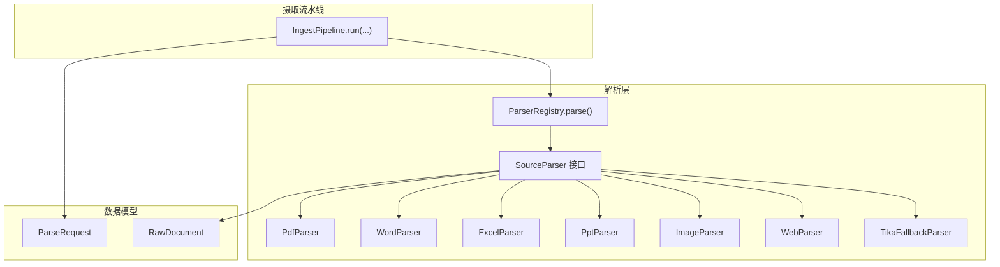
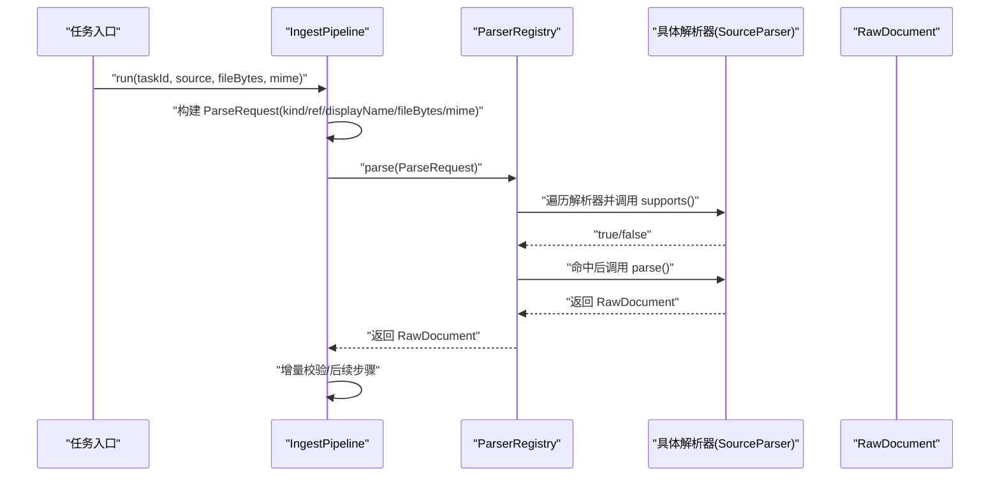
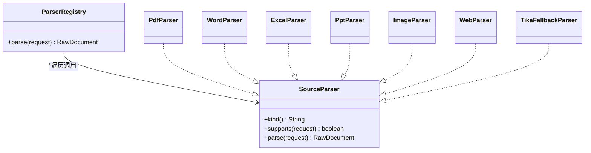

# 解析阶段

<cite>
**本文引用的文件**
- [IngestPipeline.java](file://src/main/java/com/example/llmwiki/ingest/IngestPipeline.java)
- [ParserRegistry.java](file://src/main/java/com/example/llmwiki/parser/ParserRegistry.java)
- [ParseRequest.java](file://src/main/java/com/example/llmwiki/parser/ParseRequest.java)
- [SourceParser.java](file://src/main/java/com/example/llmwiki/parser/SourceParser.java)
- [RawDocument.java](file://src/main/java/com/example/llmwiki/domain/RawDocument.java)
- [PdfParser.java](file://src/main/java/com/example/llmwiki/parser/impl/PdfParser.java)
- [WordParser.java](file://src/main/java/com/example/llmwiki/parser/impl/WordParser.java)
- [ExcelParser.java](file://src/main/java/com/example/llmwiki/parser/impl/ExcelParser.java)
- [PptParser.java](file://src/main/java/com/example/llmwiki/parser/impl/PptParser.java)
- [ImageParser.java](file://src/main/java/com/example/llmwiki/parser/impl/ImageParser.java)
- [WebParser.java](file://src/main/java/com/example/llmwiki/parser/impl/WebParser.java)
- [TikaFallbackParser.java](file://src/main/java/com/example/llmwiki/parser/impl/TikaFallbackParser.java)
- [ParserException.java](file://src/main/java/com/example/llmwiki/parser/ParserException.java)
- [ParserProperties.java](file://src/main/java/com/example/llmwiki/config/ParserProperties.java)
- [application.yml](file://src/main/resources/application.yml)
</cite>

## 目录
1. [简介](#简介)
2. [项目结构](#项目结构)
3. [核心组件](#核心组件)
4. [架构总览](#架构总览)
5. [详细组件分析](#详细组件分析)
6. [依赖分析](#依赖分析)
7. [性能考虑](#性能考虑)
8. [故障排查指南](#故障排查指南)
9. [结论](#结论)
10. [附录](#附录)

## 简介
本章节聚焦摄取流水线的“解析”阶段（PARSE）。目标是说明解析阶段如何通过 ParserRegistry.parse() 获取标准化的 RawDocument，以及 ParseRequest 请求对象的构建与参数含义。同时覆盖不同文档格式（PDF、Word、Excel、PPT、图片、网页等）的解析流程差异，解析器注册与插件化机制，失败处理与异常恢复策略，以及性能优化与内存管理最佳实践。

## 项目结构
解析阶段位于 parser 子包，核心接口为 SourceParser，具体实现按格式划分在 impl 子包中；入口由 IngestPipeline 在 run() 中构造 ParseRequest 并委托给 ParserRegistry 完成解析。

图表来源
- [IngestPipeline.java:65-74](file://src/main/java/com/example/llmwiki/ingest/IngestPipeline.java#L65-L74)
- [ParserRegistry.java:27-35](file://src/main/java/com/example/llmwiki/parser/ParserRegistry.java#L27-L35)
- [SourceParser.java:11-21](file://src/main/java/com/example/llmwiki/parser/SourceParser.java#L11-L21)
- [PdfParser.java:38](file://src/main/java/com/example/llmwiki/parser/impl/PdfParser.java#L38)
- [WordParser.java:27](file://src/main/java/com/example/llmwiki/parser/impl/WordParser.java#L27)
- [ExcelParser.java:29](file://src/main/java/com/example/llmwiki/parser/impl/ExcelParser.java#L29)
- [PptParser.java:30](file://src/main/java/com/example/llmwiki/parser/impl/PptParser.java#L30)
- [ImageParser.java:27](file://src/main/java/com/example/llmwiki/parser/impl/ImageParser.java#L27)
- [WebParser.java:27](file://src/main/java/com/example/llmwiki/parser/impl/WebParser.java#L27)
- [TikaFallbackParser.java:23](file://src/main/java/com/example/llmwiki/parser/impl/TikaFallbackParser.java#L23)
- [ParseRequest.java:18-34](file://src/main/java/com/example/llmwiki/parser/ParseRequest.java#L18-L34)
- [RawDocument.java:20-51](file://src/main/java/com/example/llmwiki/domain/RawDocument.java#L20-L51)

章节来源
- [IngestPipeline.java:65-74](file://src/main/java/com/example/llmwiki/ingest/IngestPipeline.java#L65-L74)
- [ParserRegistry.java:27-35](file://src/main/java/com/example/llmwiki/parser/ParserRegistry.java#L27-L35)
- [ParseRequest.java:18-34](file://src/main/java/com/example/llmwiki/parser/ParseRequest.java#L18-L34)
- [RawDocument.java:20-51](file://src/main/java/com/example/llmwiki/domain/RawDocument.java#L20-L51)

## 核心组件
- ParseRequest：统一封装解析输入，包含来源类型、引用、显示名、文件字节、MIME 等字段，用于驱动解析器选择与执行。
- SourceParser：解析器接口，定义 kind()/supports()/parse() 三要素，实现按来源类型与能力进行匹配。
- ParserRegistry：按顺序遍历已注入的解析器，首个 supports(request) 返回 true 的解析器即被调用，否则抛出解析异常。
- RawDocument：标准化输出，包含来源信息、文本正文、内容指纹、语言、嵌入图像描述、元信息与抓取时间等。

章节来源
- [ParseRequest.java:18-34](file://src/main/java/com/example/llmwiki/parser/ParseRequest.java#L18-L34)
- [SourceParser.java:11-21](file://src/main/java/com/example/llmwiki/parser/SourceParser.java#L11-L21)
- [ParserRegistry.java:27-35](file://src/main/java/com/example/llmwiki/parser/ParserRegistry.java#L27-L35)
- [RawDocument.java:20-51](file://src/main/java/com/example/llmwiki/domain/RawDocument.java#L20-L51)

## 架构总览
下图展示了从摄取任务到解析输出的关键调用序列，重点体现 IngestPipeline 如何构建 ParseRequest 并交由 ParserRegistry 选择解析器，最终得到 RawDocument。

图表来源
- [IngestPipeline.java:65-74](file://src/main/java/com/example/llmwiki/ingest/IngestPipeline.java#L65-L74)
- [ParserRegistry.java:27-35](file://src/main/java/com/example/llmwiki/parser/ParserRegistry.java#L27-L35)
- [SourceParser.java:19-20](file://src/main/java/com/example/llmwiki/parser/SourceParser.java#L19-L20)
- [RawDocument.java:20-51](file://src/main/java/com/example/llmwiki/domain/RawDocument.java#L20-L51)

## 详细组件分析

### ParseRequest 请求对象与参数语义
- kind：来源类型，如 FILE、URL、FEISHU、DINGTALK。用于驱动解析器选择。
- ref：来源引用，本地文件路径、URL 或文档 token，作为唯一标识与回链展示依据。
- displayName：显示名，通常为文件名或网页标题，便于用户识别与溯源。
- fileBytes：当来源为 FILE 时，承载二进制内容，供解析器直接读取。
- mime：MIME 类型（可选），辅助解析器判断媒体类型或进行内容嗅探。

章节来源
- [ParseRequest.java:20-33](file://src/main/java/com/example/llmwiki/parser/ParseRequest.java#L20-L33)

### ParserRegistry 解析器选择与调用
- 注册机制：通过 Spring 注入 List<SourceParser>，按声明顺序依次尝试。
- 选择策略：对每个解析器调用 supports(request)，返回 true 即停止并调用其 parse()。
- 异常处理：若无解析器匹配，抛出 ParserException，提示找不到匹配解析器及对应 ref。

章节来源
- [ParserRegistry.java:22-35](file://src/main/java/com/example/llmwiki/parser/ParserRegistry.java#L22-L35)
- [ParserException.java:9-18](file://src/main/java/com/example/llmwiki/parser/ParserException.java#L9-L18)

### 不同文档格式的解析流程

#### PDF 解析（PdfParser）
- 能力与触发：仅 FILE 类型且文件扩展名为 .pdf 时生效。
- 流程要点：
  - 使用 PDFBox 提取纯文本。
  - 可选地对前若干页嵌入图片进行 OCR 描述生成（受 VisionClient 启用状态影响）。
  - 输出 RawDocument，包含文本正文、图片描述列表与内容指纹。
- 性能注意：限制最大扫描页数以控制成本。

章节来源
- [PdfParser.java:48-54](file://src/main/java/com/example/llmwiki/parser/impl/PdfParser.java#L48-L54)
- [PdfParser.java:57-77](file://src/main/java/com/example/llmwiki/parser/impl/PdfParser.java#L57-L77)
- [PdfParser.java:79-111](file://src/main/java/com/example/llmwiki/parser/impl/PdfParser.java#L79-L111)

#### Word 文档（WordParser）
- 能力与触发：FILE 类型，扩展名为 .doc 或 .docx。
- 流程要点：
  - 根据扩展名选择 XWPFDocument 或 HWPFDocument 进行文本抽取。
  - 规范化空白字符后写入 RawDocument。
- 性能注意：流式读取，及时关闭资源。

章节来源
- [WordParser.java:34-41](file://src/main/java/com/example/llmwiki/parser/impl/WordParser.java#L34-L41)
- [WordParser.java:44-65](file://src/main/java/com/example/llmwiki/parser/impl/WordParser.java#L44-L65)

#### Excel 电子表格（ExcelParser）
- 能力与触发：FILE 类型，扩展名为 .xls 或 .xlsx。
- 流程要点：
  - 遍历所有工作表，按行展开为 Markdown 表格形式。
  - 限制最大行数以避免超大数据集导致内存压力。
- 性能注意：合理设置行上限，避免一次性加载过多单元格。

章节来源
- [ExcelParser.java:36-43](file://src/main/java/com/example/llmwiki/parser/impl/ExcelParser.java#L36-L43)
- [ExcelParser.java:45-77](file://src/main/java/com/example/llmwiki/parser/impl/ExcelParser.java#L45-L77)

#### PowerPoint 演示文稿（PptParser）
- 能力与触发：FILE 类型，扩展名为 .ppt 或 .pptx。
- 流程要点：
  - .pptx 使用 XMLSlideShow，.ppt 使用 HSLFSlideShow。
  - 遍历幻灯片与形状，提取文本内容并组织为分节文本。
- 性能注意：按需读取，避免全量加载大文件。

章节来源
- [PptParser.java:37-44](file://src/main/java/com/example/llmwiki/parser/impl/PptParser.java#L37-L44)
- [PptParser.java:46-81](file://src/main/java/com/example/llmwiki/parser/impl/PptParser.java#L46-L81)

#### 图片（ImageParser）
- 能力与触发：FILE 类型，扩展名属于常见图片格式集合。
- 流程要点：
  - 若 VisionClient 启用，则调用视觉模型生成图片描述；否则仅记录元信息。
  - 输出 RawDocument，包含文本摘要与图片描述列表。
- 性能注意：控制输入尺寸与并发调用频率。

章节来源
- [ImageParser.java:38-45](file://src/main/java/com/example/llmwiki/parser/impl/ImageParser.java#L38-L45)
- [ImageParser.java:47-69](file://src/main/java/com/example/llmwiki/parser/impl/ImageParser.java#L47-L69)

#### 网页（WebParser）
- 能力与触发：URL 类型。
- 流程要点：
  - 使用 Jsoup 连接并抓取 HTML，再用 Readability4J 抽取主体内容。
  - 组装标题与正文，写入 RawDocument，并附加元信息。
- 性能注意：设置合理的超时与重定向策略，避免慢响应拖垮吞吐。

章节来源
- [WebParser.java:34-37](file://src/main/java/com/example/llmwiki/parser/impl/WebParser.java#L34-L37)
- [WebParser.java:39-68](file://src/main/java/com/example/llmwiki/parser/impl/WebParser.java#L39-L68)

#### 兜底解析（TikaFallbackParser）
- 能力与触发：FILE 类型兜底，覆盖 Tika 能识别的文本类格式。
- 流程要点：
  - 使用 Tika 将字节流解析为纯文本，写入 RawDocument。
- 性能注意：适用于未知格式的快速解析，但可能丢失结构化信息。

章节来源
- [TikaFallbackParser.java:32-35](file://src/main/java/com/example/llmwiki/parser/impl/TikaFallbackParser.java#L32-L35)
- [TikaFallbackParser.java:37-47](file://src/main/java/com/example/llmwiki/parser/impl/TikaFallbackParser.java#L37-L47)

### 解析器注册与插件化架构
- 接口契约：所有解析器实现 SourceParser，统一暴露 kind()/supports()/parse()。
- 选择顺序：通过 @Order 控制优先级，较低数值优先；ParserRegistry 按注入顺序遍历。
- 扩展方式：新增解析器只需实现 SourceParser 并标注 @Component，即可自动纳入注册表。
- 配置开关：ParserProperties 提供飞书、钉钉、OCR 等能力开关，影响解析器行为（例如是否启用 Vision）。

章节来源
- [SourceParser.java:11-21](file://src/main/java/com/example/llmwiki/parser/SourceParser.java#L11-L21)
- [ParserRegistry.java:22-35](file://src/main/java/com/example/llmwiki/parser/ParserRegistry.java#L22-L35)
- [ParserProperties.java:16-44](file://src/main/java/com/example/llmwiki/config/ParserProperties.java#L16-L44)

### 错误处理与异常恢复
- 解析器缺失：当无解析器 supports(request) 为真时，抛出 ParserException，包含 kind 与 ref 信息，便于定位问题来源。
- 解析器内部异常：各解析器内部捕获并记录日志，避免中断整体流程；上层由 ParserRegistry 抛出明确异常。
- 摄取阶段异常：IngestPipeline 在 Step1/Step2 解析 LLM JSON 失败时抛出 IngestException，确保任务可观测性与可恢复性。
- 增量缓存：若内容指纹一致则跳过后续步骤，减少重复计算与资源消耗。

章节来源
- [ParserRegistry.java:34](file://src/main/java/com/example/llmwiki/parser/ParserRegistry.java#L34)
- [ParserException.java:9-18](file://src/main/java/com/example/llmwiki/parser/ParserException.java#L9-L18)
- [IngestPipeline.java:77-80](file://src/main/java/com/example/llmwiki/ingest/IngestPipeline.java#L77-L80)
- [IngestPipeline.java:136-138](file://src/main/java/com/example/llmwiki/ingest/IngestPipeline.java#L136-L138)
- [IngestPipeline.java:170-175](file://src/main/java/com/example/llmwiki/ingest/IngestPipeline.java#L170-L175)

## 依赖分析
- ParserRegistry 依赖于 Spring 注入的 List<SourceParser>，体现“按接口编程”的解耦。
- 各解析器实现依赖第三方库（PDFBox、Apache POI、Jsoup、Readability4J、Tika）与可选的 VisionClient。
- IngestPipeline 依赖 ParserRegistry 与下游服务（LLM、Embedding、存储与索引），形成端到端的摄取管线。

图表来源
- [ParserRegistry.java:22-35](file://src/main/java/com/example/llmwiki/parser/ParserRegistry.java#L22-L35)
- [SourceParser.java:11-21](file://src/main/java/com/example/llmwiki/parser/SourceParser.java#L11-L21)
- [PdfParser.java:38](file://src/main/java/com/example/llmwiki/parser/impl/PdfParser.java#L38)
- [WordParser.java:27](file://src/main/java/com/example/llmwiki/parser/impl/WordParser.java#L27)
- [ExcelParser.java:29](file://src/main/java/com/example/llmwiki/parser/impl/ExcelParser.java#L29)
- [PptParser.java:30](file://src/main/java/com/example/llmwiki/parser/impl/PptParser.java#L30)
- [ImageParser.java:27](file://src/main/java/com/example/llmwiki/parser/impl/ImageParser.java#L27)
- [WebParser.java:27](file://src/main/java/com/example/llmwiki/parser/impl/WebParser.java#L27)
- [TikaFallbackParser.java:23](file://src/main/java/com/example/llmwiki/parser/impl/TikaFallbackParser.java#L23)

## 性能考虑
- 选择合适的解析器：通过 kind/ref/displayName 精确匹配，避免不必要的解析尝试。
- 控制资源占用：
  - PDF：限制扫描页数，避免对整份长文档进行图片 OCR。
  - Excel：设置行上限，减少内存与字符串拼接开销。
  - PPT：按需读取，避免全量加载。
- 增量缓存：利用 contentHash 快速跳过未变更内容，降低重复解析成本。
- 并发与限流：结合应用配置与外部 LLM/Embedding 服务的超时与重试策略，避免资源争抢。
- 内存管理：使用 try-with-resources 确保流与文档句柄及时释放；对大文本进行分段处理与规范化。

章节来源
- [PdfParser.java:84](file://src/main/java/com/example/llmwiki/parser/impl/PdfParser.java#L84)
- [ExcelParser.java:53](file://src/main/java/com/example/llmwiki/parser/impl/ExcelParser.java#L53)
- [IngestPipeline.java:77-80](file://src/main/java/com/example/llmwiki/ingest/IngestPipeline.java#L77-L80)

## 故障排查指南
- 无法找到匹配解析器
  - 现象：抛出 ParserException，消息包含 kind 与 ref。
  - 排查：确认 ParseRequest.kind/ref/displayName 是否正确；检查解析器 supports() 判定逻辑与扩展名大小写。
- PDF/图片解析异常
  - 现象：日志出现警告或异常堆栈。
  - 排查：确认文件完整性；检查 VisionClient 启用状态与网络连通性；适当放宽或收紧页数/行数限制。
- 网页抓取失败
  - 现象：连接超时或返回非预期内容。
  - 排查：调整超时、User-Agent、重定向策略；确认 URL 可达性。
- LLM JSON 解析失败
  - 现象：Step1/Step2 抛出 IngestException。
  - 排查：检查提示词模板与 LLM 输出稳定性；必要时开启日志打印中间结果。

章节来源
- [ParserRegistry.java:34](file://src/main/java/com/example/llmwiki/parser/ParserRegistry.java#L34)
- [ParserException.java:9-18](file://src/main/java/com/example/llmwiki/parser/ParserException.java#L9-L18)
- [PdfParser.java:107-109](file://src/main/java/com/example/llmwiki/parser/impl/PdfParser.java#L107-L109)
- [WebParser.java:42-46](file://src/main/java/com/example/llmwiki/parser/impl/WebParser.java#L42-L46)
- [IngestPipeline.java:136-138](file://src/main/java/com/example/llmwiki/ingest/IngestPipeline.java#L136-L138)
- [IngestPipeline.java:170-175](file://src/main/java/com/example/llmwiki/ingest/IngestPipeline.java#L170-L175)

## 结论
解析阶段通过统一的 ParseRequest 与 SourceParser 接口，配合 ParserRegistry 的顺序匹配机制，实现了对多来源、多格式文档的插件化解析。结合增量缓存与资源限制策略，可在保证质量的同时提升整体吞吐与稳定性。遇到异常时，清晰的错误信息与逐步回退（如 Tika 兜底）有助于快速定位与恢复。

## 附录

### ParseRequest 参数一览
- kind：来源类型（FILE/URL/FEISHU/DINGTALK）
- ref：来源引用（本地路径/URL/文档 token）
- displayName：显示名（文件名/网页标题）
- fileBytes：文件字节（FILE 场景）
- mime：MIME 类型（可选）

章节来源
- [ParseRequest.java:20-33](file://src/main/java/com/example/llmwiki/parser/ParseRequest.java#L20-L33)

### 配置项参考
- llm-wiki.parser.feishu.enabled/dingtalk.enabled：启用飞书/钉钉解析能力
- llm-wiki.parser.ocr.enabled/dataPath/lang：OCR 能力与语言配置
- spring.servlet.multipart.max-file-size/max-request-size：上传限制
- logging.level.*：日志级别（建议在调试期适度降低）

章节来源
- [ParserProperties.java:18-44](file://src/main/java/com/example/llmwiki/config/ParserProperties.java#L18-L44)
- [application.yml:8-10](file://src/main/resources/application.yml#L8-L10)
- [application.yml:78-84](file://src/main/resources/application.yml#L78-L84)