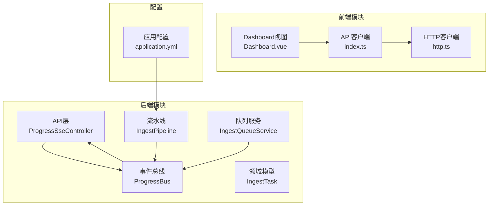
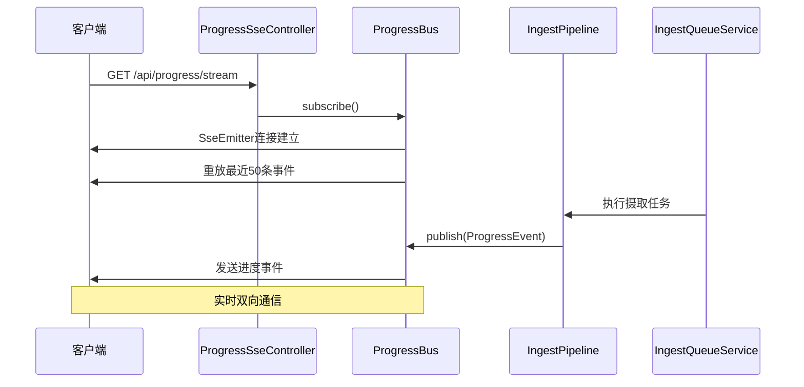
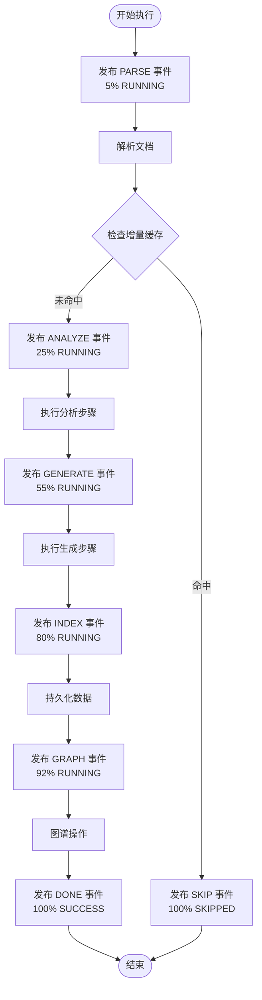
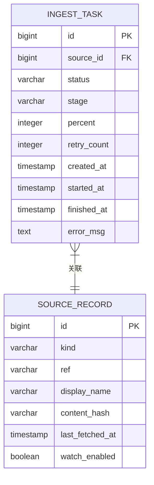
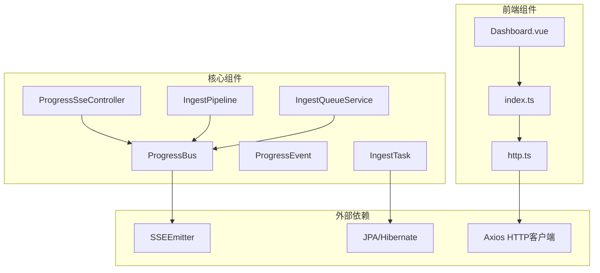

# 进度跟踪系统

<cite>
**本文档引用的文件**
- [ProgressBus.java](file://src/main/java/com/example/llmwiki/progress/ProgressBus.java)
- [ProgressEvent.java](file://src/main/java/com/example/llmwiki/progress/ProgressEvent.java)
- [ProgressSseController.java](file://src/main/java/com/example/llmwiki/api/ProgressSseController.java)
- [IngestPipeline.java](file://src/main/java/com/example/llmwiki/ingest/IngestPipeline.java)
- [IngestQueueService.java](file://src/main/java/com/example/llmwiki/queue/IngestQueueService.java)
- [IngestTask.java](file://src/main/java/com/example/llmwiki/domain/IngestTask.java)
- [IngestException.java](file://src/main/java/com/example/llmwiki/ingest/IngestException.java)
- [Dashboard.vue](file://web/src/views/Dashboard.vue)
- [index.ts](file://web/src/api/index.ts)
- [http.ts](file://web/src/api/http.ts)
- [application.yml](file://src/main/resources/application.yml)
</cite>

## 目录
1. [简介](#简介)
2. [项目结构](#项目结构)
3. [核心组件](#核心组件)
4. [架构概览](#架构概览)
5. [详细组件分析](#详细组件分析)
6. [依赖关系分析](#依赖关系分析)
7. [性能考虑](#性能考虑)
8. [故障排除指南](#故障排除指南)
9. [前端集成指南](#前端集成指南)
10. [结论](#结论)

## 简介

进度跟踪系统是摄取流水线的核心组件，负责实时监控和展示数据摄取过程的进度状态。该系统采用事件驱动架构，通过SSE（Server-Sent Events）实现实时推送，为用户提供直观的进度可视化体验。

系统主要功能包括：
- 实时进度事件发布和订阅
- 任务生命周期管理
- 多阶段进度跟踪（PARSE、ANALYZE、GENERATE、INDEX、GRAPH、DONE）
- 前端SSE连接管理和事件格式规范
- 错误处理和重试机制

## 项目结构

进度跟踪系统在项目中的组织结构如下：



**图表来源**
- [ProgressSseController.java:1-37](file://src/main/java/com/example/llmwiki/api/ProgressSseController.java#L1-L37)
- [ProgressBus.java:1-61](file://src/main/java/com/example/llmwiki/progress/ProgressBus.java#L1-L61)
- [IngestPipeline.java:1-251](file://src/main/java/com/example/llmwiki/ingest/IngestPipeline.java#L1-L251)
- [IngestQueueService.java:1-214](file://src/main/java/com/example/llmwiki/queue/IngestQueueService.java#L1-L214)
- [Dashboard.vue:1-119](file://web/src/views/Dashboard.vue#L1-L119)

**章节来源**
- [ProgressBus.java:1-61](file://src/main/java/com/example/llmwiki/progress/ProgressBus.java#L1-L61)
- [ProgressSseController.java:1-37](file://src/main/java/com/example/llmwiki/api/ProgressSseController.java#L1-L37)
- [IngestPipeline.java:1-251](file://src/main/java/com/example/llmwiki/ingest/IngestPipeline.java#L1-L251)
- [IngestQueueService.java:1-214](file://src/main/java/com/example/llmwiki/queue/IngestQueueService.java#L1-L214)

## 核心组件

### ProgressEvent 数据模型

ProgressEvent 是进度跟踪系统的核心数据结构，定义了单个任务进度事件的所有必要信息：

| 字段名 | 类型 | 描述 | 范围/约束 |
|--------|------|------|-----------|
| taskId | Long | 任务唯一标识符 | 主键，自增 |
| displayName | String | 来源展示名称 | 非空字符串 |
| stage | String | 处理阶段 | 枚举值：QUEUED/PARSE/ANALYZE/GENERATE/INDEX/GRAPH/DONE/FAIL/SKIP |
| percent | Integer | 进度百分比 | 0-100整数 |
| message | String | 状态描述信息 | 非空字符串 |
| status | String | 任务状态 | 枚举值：PENDING/RUNNING/SUCCESS/FAILED/SKIPPED |
| timestamp | Instant | 事件时间戳 | 默认当前时间 |

### ProgressBus 事件总线

ProgressBus 是事件发布和订阅的核心组件，负责维护订阅者列表并广播进度事件：

- **订阅管理**：使用CopyOnWriteArrayList维护SSE连接
- **事件存储**：使用ConcurrentLinkedDeque保存最近50条事件用于重放
- **广播机制**：向所有活跃的SSE连接发送进度事件
- **连接清理**：自动处理连接断开、超时和错误情况

**章节来源**
- [ProgressEvent.java:1-43](file://src/main/java/com/example/llmwiki/progress/ProgressEvent.java#L1-L43)
- [ProgressBus.java:1-61](file://src/main/java/com/example/llmwiki/progress/ProgressBus.java#L1-L61)

## 架构概览

进度跟踪系统的整体架构采用分层设计，实现了清晰的关注点分离：



**图表来源**
- [ProgressSseController.java:27-30](file://src/main/java/com/example/llmwiki/api/ProgressSseController.java#L27-L30)
- [ProgressBus.java:26-41](file://src/main/java/com/example/llmwiki/progress/ProgressBus.java#L26-L41)
- [IngestPipeline.java:245-249](file://src/main/java/com/example/llmwiki/ingest/IngestPipeline.java#L245-L249)

## 详细组件分析

### ProgressSseController 控制器

ProgressSseController 提供了两个关键接口：

1. **SSE流接口** (`/api/progress/stream`)
   - 返回SseEmitter实例，建立持久连接
   - 自动处理连接生命周期事件
   - 支持事件重放功能

2. **最近事件查询接口** (`/api/progress/recent`)
   - 返回最近50条进度事件
   - 用于新客户端快速获取上下文

**章节来源**
- [ProgressSseController.java:1-37](file://src/main/java/com/example/llmwiki/api/ProgressSseController.java#L1-L37)

### IngestPipeline 流水线执行

IngestPipeline 是进度跟踪的核心执行引擎，定义了完整的六阶段处理流程：

#### 阶段进度分配原则

每个阶段的进度分配基于以下原则：
- **PARSE (5%)**：解析原始文档，建立基础结构
- **ANALYZE (25%)**：LLM结构化分析，提取实体和概念
- **GENERATE (55%)**：LLM内容生成，创建维基页面草稿
- **INDEX (80%)**：数据库持久化和全文索引
- **GRAPH (92%)**：图谱构建和社区检测
- **DONE (100%)**：任务完成，清理收尾工作

#### 进度事件发布流程



**图表来源**
- [IngestPipeline.java:66-109](file://src/main/java/com/example/llmwiki/ingest/IngestPipeline.java#L66-L109)

**章节来源**
- [IngestPipeline.java:65-109](file://src/main/java/com/example/llmwiki/ingest/IngestPipeline.java#L65-L109)

### IngestQueueService 队列管理

IngestQueueService 负责任务的调度和执行管理：

- **单线程串行执行**：确保任务按顺序执行，避免资源竞争
- **任务恢复机制**：应用启动时自动恢复RUNNING状态的任务
- **取消和重试支持**：提供任务取消和失败重试功能
- **进度事件发布**：在任务状态变化时发布相应的进度事件

**章节来源**
- [IngestQueueService.java:1-214](file://src/main/java/com/example/llmwiki/queue/IngestQueueService.java#L1-L214)

### IngestTask 领域模型

IngestTask 是持久化的任务状态模型，用于记录任务的完整生命周期：



**图表来源**
- [IngestTask.java:29-61](file://src/main/java/com/example/llmwiki/domain/IngestTask.java#L29-L61)

**章节来源**
- [IngestTask.java:1-62](file://src/main/java/com/example/llmwiki/domain/IngestTask.java#L1-L62)

## 依赖关系分析

进度跟踪系统的组件依赖关系如下：



**图表来源**
- [ProgressBus.java:1-61](file://src/main/java/com/example/llmwiki/progress/ProgressBus.java#L1-L61)
- [ProgressSseController.java:1-37](file://src/main/java/com/example/llmwiki/api/ProgressSseController.java#L1-L37)
- [IngestPipeline.java:1-251](file://src/main/java/com/example/llmwiki/ingest/IngestPipeline.java#L1-L251)
- [IngestQueueService.java:1-214](file://src/main/java/com/example/llmwiki/queue/IngestQueueService.java#L1-L214)

**章节来源**
- [ProgressBus.java:1-61](file://src/main/java/com/example/llmwiki/progress/ProgressBus.java#L1-L61)
- [ProgressSseController.java:1-37](file://src/main/java/com/example/llmwiki/api/ProgressSseController.java#L1-L37)

## 性能考虑

### 内存管理策略

1. **事件缓冲限制**
   - 最近事件队列限制为50条，防止内存无限增长
   - 使用ConcurrentLinkedDeque实现线程安全的双端队列

2. **连接池管理**
   - 使用CopyOnWriteArrayList存储活跃连接
   - 自动清理断开的连接，避免内存泄漏

3. **对象复用**
   - 复用SseEmitter实例，减少GC压力
   - 合理使用Builder模式创建ProgressEvent对象

### 并发性能优化

1. **读写分离**
   - 订阅者列表使用CopyOnWriteArrayList，读操作无锁
   - 写操作（添加/删除连接）在副本上进行

2. **异步处理**
   - SSE事件发送采用异步方式，不阻塞主线程
   - 任务执行使用单线程串行队列，避免并发冲突

3. **连接超时控制**
   - 设置SSE连接超时时间为0（永不超时）
   - 通过onCompletion、onTimeout回调自动清理连接

### 网络传输优化

1. **事件压缩**
   - 使用JSON格式传输事件数据
   - 事件数据结构简洁，传输开销小

2. **批量处理**
   - 同步广播多个事件，减少网络往返
   - 合并相似的进度更新

**章节来源**
- [ProgressBus.java:21-24](file://src/main/java/com/example/llmwiki/progress/ProgressBus.java#L21-L24)
- [ProgressBus.java:43-55](file://src/main/java/com/example/llmwiki/progress/ProgressBus.java#L43-L55)

## 故障排除指南

### 常见问题及解决方案

#### SSE连接问题

**问题现象**：前端无法接收进度事件
**可能原因**：
- 网络连接中断
- CORS跨域问题
- 服务器负载过高

**解决步骤**：
1. 检查浏览器开发者工具的Network标签
2. 验证CORS配置是否正确
3. 查看服务器日志中的连接错误

#### 事件丢失问题

**问题现象**：新连接无法获取历史进度
**可能原因**：
- 最近事件队列溢出
- 连接建立时机过晚

**解决步骤**：
1. 检查recent队列大小限制
2. 在连接建立后调用recent接口获取历史事件
3. 实现重放逻辑

#### 性能问题

**问题现象**：系统响应缓慢或内存占用过高
**可能原因**：
- 连接数量过多
- 事件发布频率过高
- 内存泄漏

**解决步骤**：
1. 监控活跃连接数量
2. 调整事件发布间隔
3. 检查连接清理机制

**章节来源**
- [IngestException.java:1-18](file://src/main/java/com/example/llmwiki/ingest/IngestException.java#L1-L18)
- [IngestQueueService.java:194-211](file://src/main/java/com/example/llmwiki/queue/IngestQueueService.java#L194-L211)

### 错误处理机制

系统实现了多层次的错误处理：

1. **任务级错误处理**
   - 捕获IngestException并转换为FAILED状态
   - 支持最大重试次数配置

2. **连接级错误处理**
   - 自动检测连接断开并清理
   - 防止异常传播影响其他连接

3. **事件级错误处理**
   - 单个事件发送失败不影响其他事件
   - 异常事件会被忽略但不影响系统稳定性

**章节来源**
- [IngestQueueService.java:194-211](file://src/main/java/com/example/llmwiki/queue/IngestQueueService.java#L194-L211)
- [ProgressBus.java:48-54](file://src/main/java/com/example/llmwiki/progress/ProgressBus.java#L48-L54)

## 前端集成指南

### SSE连接实现

前端使用EventSource API实现SSE连接：

```javascript
// 建立SSE连接
const es = new EventSource('/api/progress/stream');

// 处理进度事件
es.addEventListener('progress', (event) => {
    const eventData = JSON.parse(event.data);
    updateProgressUI(eventData);
});

// 连接状态监控
es.onopen = () => console.log('连接已建立');
es.onerror = () => console.log('连接已断开');
```

### 进度显示组件

Dashboard.vue实现了完整的进度显示功能：

1. **实时进度表格**：显示所有活跃任务的最新状态
2. **连接状态指示**：显示SSE连接的健康状况
3. **进度条显示**：使用Element Plus的进度条组件
4. **状态标签**：根据阶段和状态显示不同颜色

### API客户端封装

前端通过统一的API客户端访问进度服务：

```typescript
// 获取最近事件
export const recentProgress = () => http.get('/progress/recent').then(r => r.data);

// 上传文件触发摄取
export const uploadSourceFile = (file: File) => {
    const formData = new FormData();
    formData.append('file', file);
    return http.post('/sources/file', formData, {
        headers: { 'Content-Type': 'multipart/form-data' }
    }).then(r => r.data);
};
```

### 最佳实践建议

1. **连接管理**
   - 在组件卸载时及时关闭SSE连接
   - 实现自动重连机制
   - 监控连接状态并提供用户反馈

2. **事件处理**
   - 实现事件去重和合并逻辑
   - 处理事件乱序问题
   - 实现本地事件缓存

3. **用户体验**
   - 提供加载状态指示
   - 实现错误提示和重试按钮
   - 支持手动刷新进度

**章节来源**
- [Dashboard.vue:95-108](file://web/src/views/Dashboard.vue#L95-L108)
- [index.ts:68-70](file://web/src/api/index.ts#L68-L70)
- [http.ts:1-17](file://web/src/api/http.ts#L1-L17)

## 结论

进度跟踪系统通过事件驱动架构实现了高效、可靠的实时进度监控。系统的主要优势包括：

1. **架构清晰**：分层设计使得各组件职责明确，易于维护
2. **性能优异**：采用异步处理和连接池管理，支持高并发场景
3. **用户体验好**：实时进度反馈和友好的错误处理机制
4. **扩展性强**：模块化设计便于功能扩展和定制

系统的关键成功因素在于：
- 合理的事件生命周期管理
- 有效的内存和连接资源管理
- 完善的错误处理和恢复机制
- 用户友好的前端集成方案

未来可以考虑的改进方向：
- 增加事件过滤和订阅机制
- 实现更精细的进度统计和分析
- 支持多租户和权限控制
- 添加进度事件的持久化存储