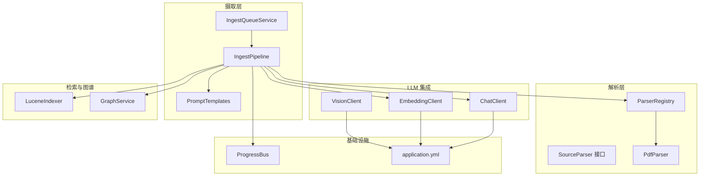
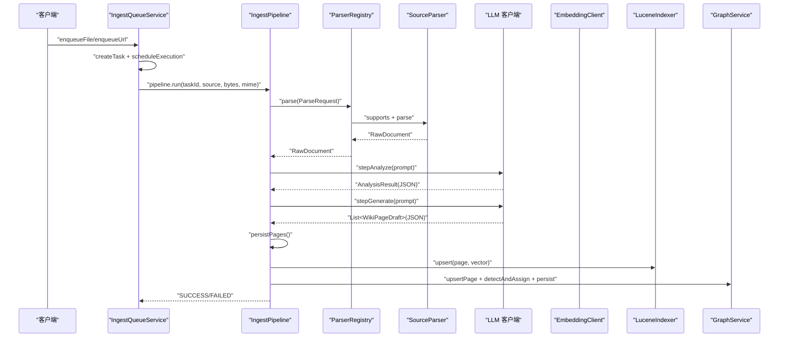
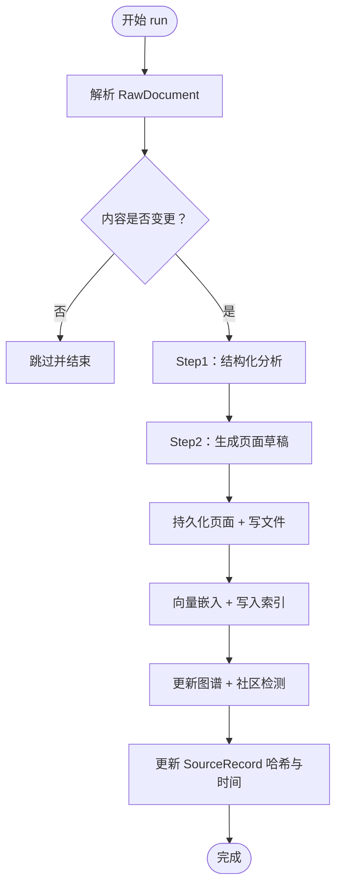
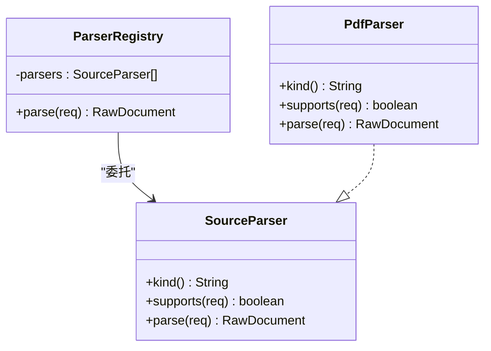
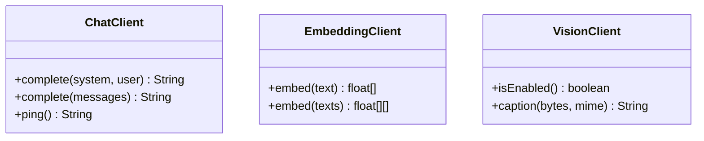
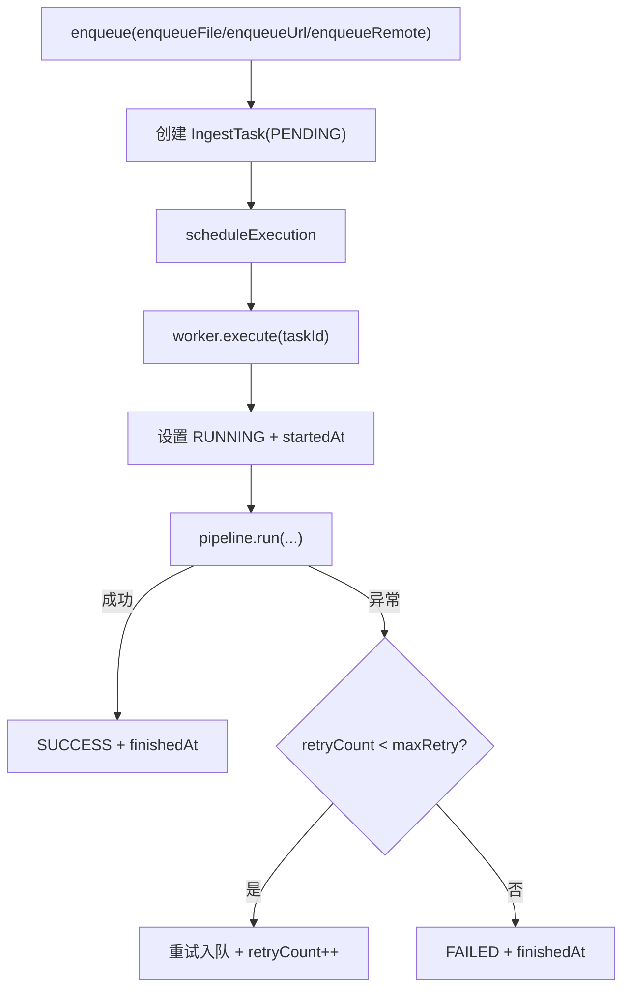
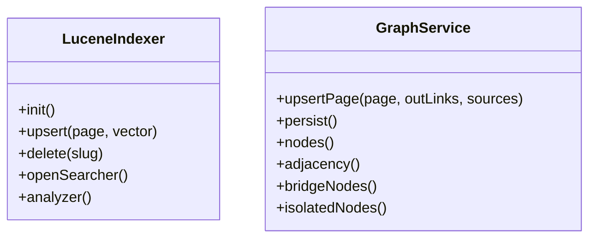
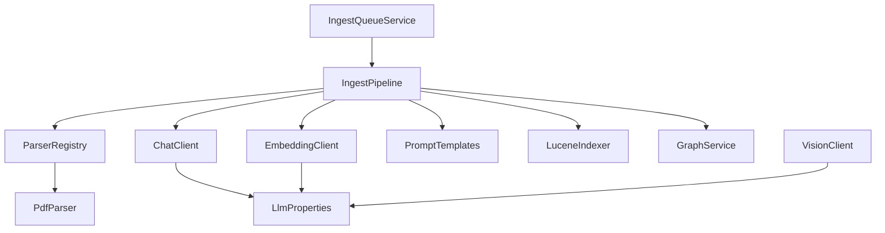

# 文档处理系统

<cite>
**本文引用的文件**
- [IngestPipeline.java](file://src/main/java/com/example/llmwiki/ingest/IngestPipeline.java)
- [ParserRegistry.java](file://src/main/java/com/example/llmwiki/parser/ParserRegistry.java)
- [SourceParser.java](file://src/main/java/com/example/llmwiki/parser/SourceParser.java)
- [PdfParser.java](file://src/main/java/com/example/llmwiki/parser/impl/PdfParser.java)
- [ChatClient.java](file://src/main/java/com/example/llmwiki/llm/ChatClient.java)
- [EmbeddingClient.java](file://src/main/java/com/example/llmwiki/llm/EmbeddingClient.java)
- [VisionClient.java](file://src/main/java/com/example/llmwiki/llm/VisionClient.java)
- [IngestQueueService.java](file://src/main/java/com/example/llmwiki/queue/IngestQueueService.java)
- [PromptTemplates.java](file://src/main/java/com/example/llmwiki/ingest/PromptTemplates.java)
- [LuceneIndexer.java](file://src/main/java/com/example/llmwiki/retrieval/LuceneIndexer.java)
- [GraphService.java](file://src/main/java/com/example/llmwiki/graph/GraphService.java)
- [IngestException.java](file://src/main/java/com/example/llmwiki/ingest/IngestException.java)
- [application.yml](file://src/main/resources/application.yml)
- [analyze.md](file://src/main/resources/prompts/analyze.md)
- [generate.md](file://src/main/resources/prompts/generate.md)
</cite>

## 目录
1. [简介](#简介)
2. [项目结构](#项目结构)
3. [核心组件](#核心组件)
4. [架构总览](#架构总览)
5. [详细组件分析](#详细组件分析)
6. [依赖关系分析](#依赖关系分析)
7. [性能考虑](#性能考虑)
8. [故障排查指南](#故障排查指南)
9. [结论](#结论)
10. [附录](#附录)

## 简介
本项目是一个面向知识库的 LLM 驱动文档处理系统，提供从多源文档摄取、解析、结构化分析、内容生成到索引与图谱构建的完整流水线。系统采用两步式链式处理（解析→分析→生成→索引/图谱），支持增量缓存、进度跟踪、错误处理与重试，具备良好的扩展性与稳定性。前端通过 Vue 应用提供可视化界面，后端以 Spring Boot 提供 REST API 与后台任务。

## 项目结构
后端采用按领域分层的包结构，核心模块包括：
- ingest：摄取流水线与提示模板
- parser：多源解析器与注册表
- llm：聊天、嵌入、视觉客户端
- queue：任务队列与调度
- retrieval：全文检索与向量索引
- graph：知识图谱构建与持久化
- progress：进度事件总线
- scheduler：定时扫描任务
- api：REST 控制器
- domain/repository：数据模型与仓库
- config：配置类
- util：工具类

**图表来源**
- [IngestPipeline.java:48-109](file://src/main/java/com/example/llmwiki/ingest/IngestPipeline.java#L48-L109)
- [IngestQueueService.java:36-91](file://src/main/java/com/example/llmwiki/queue/IngestQueueService.java#L36-L91)
- [ParserRegistry.java:19-36](file://src/main/java/com/example/llmwiki/parser/ParserRegistry.java#L19-L36)
- [PdfParser.java:38-77](file://src/main/java/com/example/llmwiki/parser/impl/PdfParser.java#L38-L77)
- [ChatClient.java:28-86](file://src/main/java/com/example/llmwiki/llm/ChatClient.java#L28-L86)
- [EmbeddingClient.java:25-81](file://src/main/java/com/example/llmwiki/llm/EmbeddingClient.java#L25-L81)
- [VisionClient.java:25-86](file://src/main/java/com/example/llmwiki/llm/VisionClient.java#L25-L86)
- [PromptTemplates.java:20-42](file://src/main/java/com/example/llmwiki/ingest/PromptTemplates.java#L20-L42)
- [LuceneIndexer.java:39-99](file://src/main/java/com/example/llmwiki/retrieval/LuceneIndexer.java#L39-L99)
- [GraphService.java:37-118](file://src/main/java/com/example/llmwiki/graph/GraphService.java#L37-L118)
- [application.yml:31-77](file://src/main/resources/application.yml#L31-L77)

**章节来源**
- [application.yml:1-84](file://src/main/resources/application.yml#L1-L84)

## 核心组件
- 摄取流水线 IngestPipeline：实现两步式链式处理，包含解析、分析、生成、索引/图谱四个阶段，并内置进度发布与增量缓存。
- 解析器系统 ParserRegistry：统一管理多种 SourceParser 实现，按 supports 匹配首个可用解析器。
- LLM 集成：ChatClient 支持多轮对话；EmbeddingClient 支持单条与批量嵌入；VisionClient 支持图片 caption。
- 任务队列 IngestQueueService：单线程串行 worker、取消标志、失败重试与状态恢复。
- 提示模板 PromptTemplates：加载并渲染 analyze.md、generate.md 等模板。
- 检索与图谱：LuceneIndexer 支持 BM25 与向量检索；GraphService 维护节点、邻接表与社区划分。

**章节来源**
- [IngestPipeline.java:33-109](file://src/main/java/com/example/llmwiki/ingest/IngestPipeline.java#L33-L109)
- [ParserRegistry.java:10-36](file://src/main/java/com/example/llmwiki/parser/ParserRegistry.java#L10-L36)
- [ChatClient.java:16-86](file://src/main/java/com/example/llmwiki/llm/ChatClient.java#L16-L86)
- [EmbeddingClient.java:16-81](file://src/main/java/com/example/llmwiki/llm/EmbeddingClient.java#L16-L81)
- [VisionClient.java:16-86](file://src/main/java/com/example/llmwiki/llm/VisionClient.java#L16-L86)
- [IngestQueueService.java:27-91](file://src/main/java/com/example/llmwiki/queue/IngestQueueService.java#L27-L91)
- [PromptTemplates.java:12-42](file://src/main/java/com/example/llmwiki/ingest/PromptTemplates.java#L12-L42)
- [LuceneIndexer.java:30-99](file://src/main/java/com/example/llmwiki/retrieval/LuceneIndexer.java#L30-L99)
- [GraphService.java:24-118](file://src/main/java/com/example/llmwiki/graph/GraphService.java#L24-L118)

## 架构总览
系统整体采用“队列驱动 + 流水线执行”的架构。外部来源（文件、URL、远程）经由 IngestQueueService 入队，单线程 worker 串行执行 IngestPipeline。流水线内部通过 ParserRegistry 选择解析器，调用 ChatClient/EmbeddingClient/VisionClient 获取结构化分析与向量表示，最终写入数据库、文件系统、Lucene 索引与图谱。

**图表来源**
- [IngestQueueService.java:151-212](file://src/main/java/com/example/llmwiki/queue/IngestQueueService.java#L151-L212)
- [IngestPipeline.java:65-109](file://src/main/java/com/example/llmwiki/ingest/IngestPipeline.java#L65-L109)
- [ParserRegistry.java:27-35](file://src/main/java/com/example/llmwiki/parser/ParserRegistry.java#L27-L35)
- [ChatClient.java:50-86](file://src/main/java/com/example/llmwiki/llm/ChatClient.java#L50-L86)
- [EmbeddingClient.java:42-81](file://src/main/java/com/example/llmwiki/llm/EmbeddingClient.java#L42-L81)
- [LuceneIndexer.java:78-99](file://src/main/java/com/example/llmwiki/retrieval/LuceneIndexer.java#L78-L99)
- [GraphService.java:71-118](file://src/main/java/com/example/llmwiki/graph/GraphService.java#L71-L118)

## 详细组件分析

### 摄取流水线 IngestPipeline
- 两步式链式处理：解析 → 分析 → 生成 → 索引/图谱。
- 增量缓存：比较 SourceRecord 的 contentHash 与 RawDocument 的 contentHash，相同则跳过。
- 进度跟踪：通过 ProgressBus 发布阶段性事件，前端可通过 SSE 实时查看。
- 错误处理：步骤间捕获 IngestException 并上报；JSON 解析失败时抛出明确异常。
- 结构化输出：Step1 产出 AnalysisResult；Step2 产出 WikiPageDraft 列表；最终持久化并写入文件。

**图表来源**
- [IngestPipeline.java:65-109](file://src/main/java/com/example/llmwiki/ingest/IngestPipeline.java#L65-L109)

**章节来源**
- [IngestPipeline.java:33-109](file://src/main/java/com/example/llmwiki/ingest/IngestPipeline.java#L33-L109)

### 解析器系统 ParserRegistry 与 SourceParser
- 统一接口 SourceParser：定义 kind、supports、parse。
- 注册表 ParserRegistry：遍历已注入的解析器，按 supports 返回首个匹配实现。
- 示例实现 PdfParser：基于 PDFBox 抽取文本与图片，可选调用 VisionClient 为图片打 caption，生成 RawDocument 并计算 contentHash。

**图表来源**
- [SourceParser.java:11-21](file://src/main/java/com/example/llmwiki/parser/SourceParser.java#L11-L21)
- [ParserRegistry.java:19-36](file://src/main/java/com/example/llmwiki/parser/ParserRegistry.java#L19-L36)
- [PdfParser.java:38-77](file://src/main/java/com/example/llmwiki/parser/impl/PdfParser.java#L38-L77)

**章节来源**
- [ParserRegistry.java:10-36](file://src/main/java/com/example/llmwiki/parser/ParserRegistry.java#L10-L36)
- [SourceParser.java:5-21](file://src/main/java/com/example/llmwiki/parser/SourceParser.java#L5-L21)
- [PdfParser.java:28-77](file://src/main/java/com/example/llmwiki/parser/impl/PdfParser.java#L28-L77)

### LLM 集成：ChatClient、EmbeddingClient、VisionClient
- ChatClient：支持单轮与多轮对话，构造 OpenAI 兼容的 chat/completions 请求，返回 assistant 内容；提供健康检查 ping。
- EmbeddingClient：构造 OpenAI 兼容的 embeddings 请求，支持批量输入，返回 float[] 向量列表。
- VisionClient：在启用状态下，将图片编码为 data URL，调用多模态模型生成事实性描述；失败时返回空串并记录告警。

**图表来源**
- [ChatClient.java:28-106](file://src/main/java/com/example/llmwiki/llm/ChatClient.java#L28-L106)
- [EmbeddingClient.java:25-89](file://src/main/java/com/example/llmwiki/llm/EmbeddingClient.java#L25-L89)
- [VisionClient.java:25-94](file://src/main/java/com/example/llmwiki/llm/VisionClient.java#L25-L94)

**章节来源**
- [ChatClient.java:16-106](file://src/main/java/com/example/llmwiki/llm/ChatClient.java#L16-L106)
- [EmbeddingClient.java:16-89](file://src/main/java/com/example/llmwiki/llm/EmbeddingClient.java#L16-L89)
- [VisionClient.java:16-94](file://src/main/java/com/example/llmwiki/llm/VisionClient.java#L16-L94)

### 任务队列 IngestQueueService
- 单线程串行 worker：保证任务有序执行，避免并发冲突。
- 恢复机制：启动时将 RUNNING 任务置为 PENDING 并重新入队。
- 取消与重试：支持取消标志、最大重试次数、失败状态回退与进度事件发布。
- 文件持久化：将原始文件写入 storage.raw-dir，便于离线重放与调试。

**图表来源**
- [IngestQueueService.java:151-212](file://src/main/java/com/example/llmwiki/queue/IngestQueueService.java#L151-L212)

**章节来源**
- [IngestQueueService.java:27-212](file://src/main/java/com/example/llmwiki/queue/IngestQueueService.java#L27-L212)

### 提示模板系统 PromptTemplates 与模板
- PromptTemplates：从 classpath 加载 prompts/*.md，缓存到内存，支持 {{var}} 占位符渲染。
- analyze.md：指导 LLM 产出结构化 JSON，包含 summary、entities、concepts、connections、contradictions、recommended。
- generate.md：指导 LLM 基于分析结果与原文生成多页 Wiki JSON，包含 pages 与 log。

**图表来源**
- [PromptTemplates.java:20-42](file://src/main/java/com/example/llmwiki/ingest/PromptTemplates.java#L20-L42)
- [analyze.md:1-27](file://src/main/resources/prompts/analyze.md#L1-L27)
- [generate.md:1-34](file://src/main/resources/prompts/generate.md#L1-L34)

**章节来源**
- [PromptTemplates.java:12-42](file://src/main/java/com/example/llmwiki/ingest/PromptTemplates.java#L12-L42)
- [analyze.md:1-27](file://src/main/resources/prompts/analyze.md#L1-L27)
- [generate.md:1-34](file://src/main/resources/prompts/generate.md#L1-L34)

### 检索与图谱：LuceneIndexer 与 GraphService
- LuceneIndexer：支持中文分词、BM25 全文检索与 KNN 向量检索；提供 upsert/delete/openSearcher/analyzer。
- GraphService：内存维护节点、邻接表与社区映射，支持桥节点识别、孤立节点检测、持久化为 JSON。

**图表来源**
- [LuceneIndexer.java:39-117](file://src/main/java/com/example/llmwiki/retrieval/LuceneIndexer.java#L39-L117)
- [GraphService.java:37-196](file://src/main/java/com/example/llmwiki/graph/GraphService.java#L37-L196)

**章节来源**
- [LuceneIndexer.java:30-117](file://src/main/java/com/example/llmwiki/retrieval/LuceneIndexer.java#L30-L117)
- [GraphService.java:24-196](file://src/main/java/com/example/llmwiki/graph/GraphService.java#L24-L196)

## 依赖关系分析
- 组件耦合：IngestPipeline 依赖解析器、LLM 客户端、索引器、图谱服务与进度总线；ParserRegistry 依赖 Spring 注入的 SourceParser 列表；各 LLM 客户端依赖 LlmProperties。
- 外部依赖：RestClient 用于 HTTP 调用；PDFBox 用于 PDF 解析；Lucene 用于全文与向量检索；H2/JPA 用于持久化；Quartz 用于定时任务。
- 配置中心：application.yml 提供存储目录、LLM 参数、解析器开关、调度与摄取重试策略。

**图表来源**
- [IngestPipeline.java:52-63](file://src/main/java/com/example/llmwiki/ingest/IngestPipeline.java#L52-L63)
- [ParserRegistry.java:21-22](file://src/main/java/com/example/llmwiki/parser/ParserRegistry.java#L21-L22)
- [ChatClient.java:30-32](file://src/main/java/com/example/llmwiki/llm/ChatClient.java#L30-L32)
- [EmbeddingClient.java:27-29](file://src/main/java/com/example/llmwiki/llm/EmbeddingClient.java#L27-L29)
- [VisionClient.java:27-29](file://src/main/java/com/example/llmwiki/llm/VisionClient.java#L27-L29)
- [IngestQueueService.java:38-43](file://src/main/java/com/example/llmwiki/queue/IngestQueueService.java#L38-L43)
- [application.yml:31-77](file://src/main/resources/application.yml#L31-L77)

**章节来源**
- [application.yml:31-77](file://src/main/resources/application.yml#L31-L77)

## 性能考虑
- 批量处理：EmbeddingClient 支持批量嵌入，减少网络往返；IngestPipeline 在持久化阶段逐页处理，避免大事务。
- 缓存机制：PromptTemplates 内存缓存模板；ParserRegistry 通过 contentHash 实现增量跳过；LuceneIndexer 使用同步 upsert 并 commit。
- 资源管理：LuceneIndexer 初始化与销毁时正确释放 Directory/IndexWriter；IngestQueueService 单线程 worker 降低并发复杂度。
- 成本控制：PdfParser 限制最多抽取 20 页图片进行 caption；文本截断避免超长 prompt；生成页数量上限与实体/概念数量上限约束。

**章节来源**
- [EmbeddingClient.java:42-81](file://src/main/java/com/example/llmwiki/llm/EmbeddingClient.java#L42-L81)
- [IngestPipeline.java:50-50](file://src/main/java/com/example/llmwiki/ingest/IngestPipeline.java#L50-L50)
- [PdfParser.java:84-84](file://src/main/java/com/example/llmwiki/parser/impl/PdfParser.java#L84-L84)
- [LuceneIndexer.java:78-99](file://src/main/java/com/example/llmwiki/retrieval/LuceneIndexer.java#L78-L99)

## 故障排查指南
- 摄取异常 IngestException：当 LLM JSON 解析失败或未生成页面时抛出，需检查模板渲染与 LLM 输出格式。
- LLM 调用失败：ChatClient/EmbeddingClient/VisionClient 捕获非 LlmException 并包装为 LlmException，检查 API Key、Base URL、Model 与超时配置。
- 任务失败与重试：IngestQueueService 记录错误信息并在达到最大重试次数后标记 FAILED；可在前端重试或取消任务。
- 增量跳过：确认 SourceRecord.contentHash 与 RawDocument.contentHash 是否一致；如不一致但期望跳过，检查哈希计算逻辑。

**章节来源**
- [IngestException.java:9-17](file://src/main/java/com/example/llmwiki/ingest/IngestException.java#L9-L17)
- [ChatClient.java:76-85](file://src/main/java/com/example/llmwiki/llm/ChatClient.java#L76-L85)
- [EmbeddingClient.java:63-80](file://src/main/java/com/example/llmwiki/llm/EmbeddingClient.java#L63-L80)
- [VisionClient.java:78-86](file://src/main/java/com/example/llmwiki/llm/VisionClient.java#L78-L86)
- [IngestQueueService.java:194-211](file://src/main/java/com/example/llmwiki/queue/IngestQueueService.java#L194-L211)

## 结论
本系统通过清晰的模块划分与稳健的错误处理机制，实现了从多源文档到知识库的自动化摄取与增强。两步式链式处理与增量缓存显著提升了吞吐与稳定性；任务队列与进度总线提供了可观测性与可运维性；提示模板与 LLM 客户端的统一抽象便于扩展与替换。建议在生产环境中结合监控与日志完善告警策略，并根据业务规模调整重试与并发参数。

## 附录
- 配置要点：storage.root-dir、llm.chat/embedding/vision、ingest.max-retry、scheduler.enabled/cron。
- 模板定制：修改 analyze.md/generate.md 中的 JSON 结构与约束，确保与 IngestPipeline 的解析逻辑一致。

**章节来源**
- [application.yml:31-77](file://src/main/resources/application.yml#L31-L77)
- [analyze.md:1-27](file://src/main/resources/prompts/analyze.md#L1-L27)
- [generate.md:1-34](file://src/main/resources/prompts/generate.md#L1-L34)