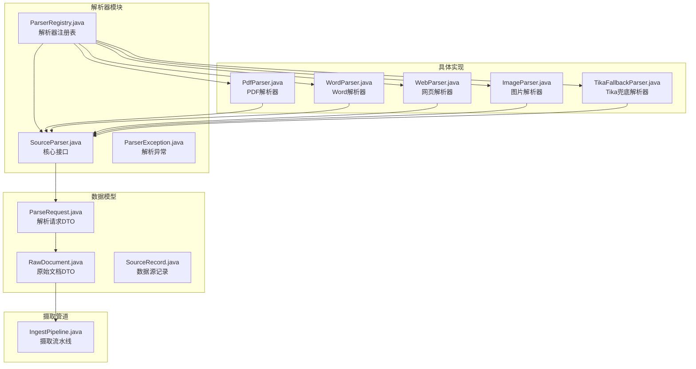
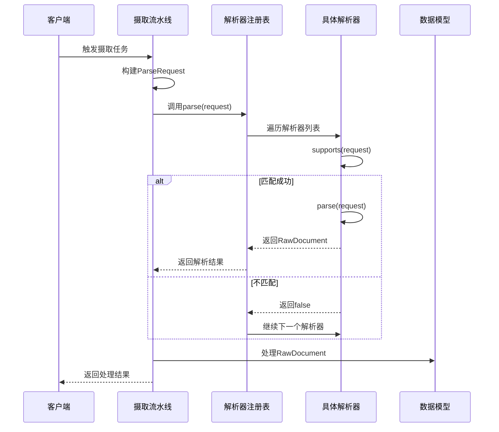
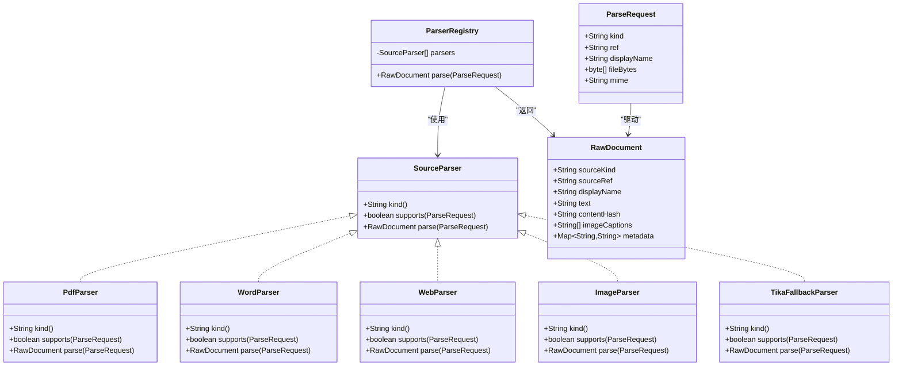

# SourceParser核心接口

<cite>
**本文档引用的文件**
- [SourceParser.java](file://src/main/java/com/example/llmwiki/parser/SourceParser.java)
- [ParseRequest.java](file://src/main/java/com/example/llmwiki/parser/ParseRequest.java)
- [ParserRegistry.java](file://src/main/java/com/example/llmwiki/parser/ParserRegistry.java)
- [ParserException.java](file://src/main/java/com/example/llmwiki/parser/ParserException.java)
- [RawDocument.java](file://src/main/java/com/example/llmwiki/domain/RawDocument.java)
- [SourceRecord.java](file://src/main/java/com/example/llmwiki/domain/SourceRecord.java)
- [PdfParser.java](file://src/main/java/com/example/llmwiki/parser/impl/PdfParser.java)
- [WordParser.java](file://src/main/java/com/example/llmwiki/parser/impl/WordParser.java)
- [WebParser.java](file://src/main/java/com/example/llmwiki/parser/impl/WebParser.java)
- [ImageParser.java](file://src/main/java/com/example/llmwiki/parser/impl/ImageParser.java)
- [TikaFallbackParser.java](file://src/main/java/com/example/llmwiki/parser/impl/TikaFallbackParser.java)
- [IngestPipeline.java](file://src/main/java/com/example/llmwiki/ingest/IngestPipeline.java)
- [application.yml](file://src/main/resources/application.yml)
</cite>

## 目录
1. [简介](#简介)
2. [项目结构](#项目结构)
3. [核心组件](#核心组件)
4. [架构概览](#架构概览)
5. [详细组件分析](#详细组件分析)
6. [依赖分析](#依赖分析)
7. [性能考虑](#性能考虑)
8. [故障排除指南](#故障排除指南)
9. [结论](#结论)

## 简介

SourceParser是LLM Wiki项目中多源文档解析器的统一抽象接口，旨在为各种文档格式提供标准化的解析能力。该接口设计的核心目标是：

- **标准化文档解析器的抽象层**：通过统一的接口定义，屏蔽不同文档格式的差异
- **统一的解析流程接口**：提供一致的解析方法调用模式
- **可扩展的解析器架构**：支持新增各种文档格式的解析器

SourceParser接口通过三个核心方法实现了完整的解析生命周期管理：
- `kind()`方法：标识解析器类型
- `supports()`方法：判断是否能够处理特定请求
- `parse()`方法：执行实际的文档解析

## 项目结构

LLM Wiki项目的解析器相关文件组织结构如下：

**图表来源**
- [SourceParser.java:1-22](file://src/main/java/com/example/llmwiki/parser/SourceParser.java#L1-L22)
- [ParserRegistry.java:1-37](file://src/main/java/com/example/llmwiki/parser/ParserRegistry.java#L1-L37)
- [ParseRequest.java:1-35](file://src/main/java/com/example/llmwiki/parser/ParseRequest.java#L1-L35)
- [RawDocument.java:1-52](file://src/main/java/com/example/llmwiki/domain/RawDocument.java#L1-L52)

**章节来源**
- [SourceParser.java:1-22](file://src/main/java/com/example/llmwiki/parser/SourceParser.java#L1-L22)
- [ParserRegistry.java:1-37](file://src/main/java/com/example/llmwiki/parser/ParserRegistry.java#L1-L37)
- [ParseRequest.java:1-35](file://src/main/java/com/example/llmwiki/parser/ParseRequest.java#L1-L35)
- [RawDocument.java:1-52](file://src/main/java/com/example/llmwiki/domain/RawDocument.java#L1-L52)

## 核心组件

### SourceParser接口设计

SourceParser接口定义了文档解析器的标准契约，具有以下设计理念：

**接口职责分离**
- `kind()`：提供解析器类型的标识符
- `supports()`：实现格式识别和能力判断
- `parse()`：执行具体的解析逻辑

**设计原则**
- **单一职责**：每个解析器专注于特定的文档格式
- **开闭原则**：对扩展开放，对修改关闭
- **依赖倒置**：高层模块不依赖低层模块的具体实现

**接口约束**
- 所有实现必须提供稳定的`kind()`返回值
- `supports()`方法必须准确判断请求格式
- `parse()`方法需要处理异常情况并返回标准化结果

### ParseRequest数据结构

ParseRequest作为解析请求的统一数据传输对象，封装了各种来源的信息：

**核心字段定义**
- `kind`：来源类型（FILE/URL/FEISHU/DINGTALK）
- `ref`：引用标识（本地路径/URL/文档token）
- `displayName`：显示名称
- `fileBytes`：文件字节数组（FILE来源时使用）
- `mime`：MIME类型（可选）

**设计特点**
- 使用Lombok注解简化代码
- 支持多种来源类型的一致化处理
- 提供可选的MIME类型信息

### ParserRegistry注册表

ParserRegistry实现了解析器的自动发现和选择机制：

**核心功能**
- 自动注入所有SourceParser实现
- 按顺序遍历解析器进行格式匹配
- 提供统一的解析入口点

**工作流程**
1. 接收ParseRequest请求
2. 遍历注册表中的所有解析器
3. 调用每个解析器的`supports()`方法
4. 返回第一个匹配的解析器结果
5. 如果没有匹配解析器，抛出ParserException

**章节来源**
- [SourceParser.java:11-21](file://src/main/java/com/example/llmwiki/parser/SourceParser.java#L11-L21)
- [ParseRequest.java:18-34](file://src/main/java/com/example/llmwiki/parser/ParseRequest.java#L18-L34)
- [ParserRegistry.java:19-36](file://src/main/java/com/example/llmwiki/parser/ParserRegistry.java#L19-L36)

## 架构概览

LLM Wiki的解析器架构采用插件化设计，通过Spring框架实现自动装配和依赖注入：

**图表来源**
- [IngestPipeline.java:65-74](file://src/main/java/com/example/llmwiki/ingest/IngestPipeline.java#L65-L74)
- [ParserRegistry.java:27-35](file://src/main/java/com/example/llmwiki/parser/ParserRegistry.java#L27-L35)

**章节来源**
- [IngestPipeline.java:45-109](file://src/main/java/com/example/llmwiki/ingest/IngestPipeline.java#L45-L109)
- [ParserRegistry.java:16-36](file://src/main/java/com/example/llmwiki/parser/ParserRegistry.java#L16-L36)

## 详细组件分析

### 接口方法详解

#### kind()方法
- **作用**：返回解析器的类型标识符
- **命名约定**：通常采用"SOURCE_TYPE/FORMAT"的格式
- **用途**：与SourceRecord的kind字段对应，或作为MIME标签使用

#### supports()方法
- **输入**：ParseRequest请求对象
- **判断逻辑**：基于请求的kind、ref、displayName等属性
- **返回值**：boolean类型，true表示支持该请求

#### parse()方法
- **输入**：ParseRequest请求对象
- **输出**：RawDocument标准化文档对象
- **异常处理**：需要捕获并处理解析过程中的异常

### 具体解析器实现分析

#### PDF解析器（PdfParser）
PDF解析器展示了复杂文档解析的最佳实践：

**核心特性**
- 使用Apache PDFBox进行文本提取
- 支持嵌入图片的OCR识别
- 可选的Vision LLM图片描述生成
- 性能优化：限制最大处理页数

**实现要点**
- 通过displayName或ref判断文件扩展名
- 使用流式处理避免内存溢出
- 图片提取后进行异步描述生成

#### Word解析器（WordParser）
Word解析器体现了格式兼容性的处理策略：

**技术实现**
- 同时支持.doc和.docx两种格式
- 使用Apache POI库进行文档解析
- 统一文本输出格式

**格式处理**
- .doc格式使用HWPFDocument
- .docx格式使用XWPFDocument
- 统一的文本提取和规范化处理

#### 网页解析器（WebParser）
网页解析器展示了网络内容抓取的完整流程：

**技术栈**
- 使用Jsoup进行HTML解析
- 结合Readability4J进行内容抽取
- 支持重定向和超时控制

**内容处理**
- 优先使用Readability4J提取主要内容
- 回退到DOM解析确保内容完整性
- 生成结构化的标题和正文

#### 图片解析器（ImageParser）
图片解析器体现了多模态内容处理的策略：

**核心逻辑**
- 基于文件扩展名判断图片格式
- 支持Vision LLM的图片描述生成
- 未启用Vision时仅记录元信息

**实现策略**
- 通过VisionClient的isEnabled()方法判断功能状态
- 统一的图片描述生成和文本构建逻辑

#### Tika兜底解析器（TikaFallbackParser）
Tika解析器作为通用解析器提供了广泛的格式支持：

**设计目的**
- 作为最后的解析器保障
- 支持txt、md、html、csv等多种文本格式
- 使用Apache Tika进行智能格式识别

**应用场景**
- 新增格式的快速支持
- 解析失败时的备用方案
- 简单文本内容的高效处理

### 数据模型设计

#### RawDocument标准化输出
RawDocument作为所有解析器的统一输出格式，确保了后续处理的一致性：

**核心字段**
- `sourceKind/sourceRef/displayName`：来源信息
- `text`：标准化后的文本内容
- `contentHash`：内容指纹，用于增量缓存
- `imageCaptions`：图片描述列表
- `metadata`：元信息映射

**设计优势**
- 统一的数据结构便于后续处理
- 内容指纹支持高效的变更检测
- 元信息保留原始文档的关键属性

**章节来源**
- [PdfParser.java:38-77](file://src/main/java/com/example/llmwiki/parser/impl/PdfParser.java#L38-L77)
- [WordParser.java:27-66](file://src/main/java/com/example/llmwiki/parser/impl/WordParser.java#L27-L66)
- [WebParser.java:27-68](file://src/main/java/com/example/llmwiki/parser/impl/WebParser.java#L27-L68)
- [ImageParser.java:27-69](file://src/main/java/com/example/llmwiki/parser/impl/ImageParser.java#L27-L69)
- [TikaFallbackParser.java:23-48](file://src/main/java/com/example/llmwiki/parser/impl/TikaFallbackParser.java#L23-L48)
- [RawDocument.java:20-51](file://src/main/java/com/example/llmwiki/domain/RawDocument.java#L20-L51)

## 依赖分析

### 组件耦合关系

**图表来源**
- [SourceParser.java:11-21](file://src/main/java/com/example/llmwiki/parser/SourceParser.java#L11-L21)
- [ParserRegistry.java:22-35](file://src/main/java/com/example/llmwiki/parser/ParserRegistry.java#L22-L35)
- [ParseRequest.java:18-34](file://src/main/java/com/example/llmwiki/parser/ParseRequest.java#L18-L34)
- [RawDocument.java:20-51](file://src/main/java/com/example/llmwiki/domain/RawDocument.java#L20-L51)

### 依赖关系分析

**内聚性评估**
- 每个解析器高度内聚，专注于特定格式
- ParserRegistry提供统一的外部接口
- 数据模型保持稳定不变

**耦合度分析**
- 解析器之间无直接依赖，松耦合设计
- 与外部库的依赖通过接口隔离
- Spring框架提供依赖注入支持

**潜在循环依赖**
- 不存在循环依赖问题
- 解析器注册表依赖解析器接口
- 解析器实现依赖接口而非具体类

**章节来源**
- [ParserRegistry.java:21-35](file://src/main/java/com/example/llmwiki/parser/ParserRegistry.java#L21-L35)
- [SourceParser.java:11-21](file://src/main/java/com/example/llmwiki/parser/SourceParser.java#L11-L21)

## 性能考虑

### 解析器性能优化策略

**内存管理**
- 流式处理大文件，避免内存溢出
- 及时释放PDFBox等库的资源
- 控制图片处理的数量和大小

**并发处理**
- 单线程解析器设计，避免并发问题
- 可通过配置调整worker线程数量
- 建议在上层实现并发控制

**缓存机制**
- 使用contentHash实现增量缓存
- 避免重复处理相同内容
- 支持定时刷新和手动触发

### 性能监控

**日志记录**
- 关键操作添加详细的日志信息
- 记录解析耗时和成功率
- 支持调试和性能分析

**资源限制**
- PDF图片处理限制在20页以内
- 文本内容长度限制在12000字符
- 超时设置确保系统稳定性

## 故障排除指南

### 常见问题及解决方案

**解析器选择问题**
- 确认ParseRequest的kind字段正确设置
- 检查文件扩展名是否符合预期
- 验证supports()方法的判断逻辑

**异常处理策略**
- ParserException用于解析器不可用场景
- 具体解析器内部捕获并转换异常
- 保持异常信息的完整性和可读性

**性能问题诊断**
- 监控解析耗时和内存使用
- 检查文件大小和格式复杂度
- 优化图片处理和OCR调用

### 调试技巧

**日志分析**
- 查看ParserRegistry的日志输出
- 监控具体解析器的执行状态
- 分析异常堆栈信息

**配置检查**
- 验证application.yml中的相关配置
- 检查Vision LLM的启用状态
- 确认文件存储路径的可访问性

**章节来源**
- [ParserException.java:9-18](file://src/main/java/com/example/llmwiki/parser/ParserException.java#L9-L18)
- [ParserRegistry.java:27-35](file://src/main/java/com/example/llmwiki/parser/ParserRegistry.java#L27-L35)
- [application.yml:58-76](file://src/main/resources/application.yml#L58-L76)

## 结论

SourceParser核心接口为LLM Wiki项目提供了强大而灵活的文档解析能力。通过标准化的接口设计、可扩展的架构模式和完善的异常处理机制，该接口成功实现了：

**技术优势**
- 统一的解析接口，简化了使用复杂度
- 插件化的解析器架构，支持持续扩展
- 标准化的数据输出，保证了后续处理的一致性

**设计亮点**
- 清晰的职责分离和接口契约
- 完善的错误处理和异常管理
- 良好的性能优化和资源管理

**未来发展方向**
- 支持更多文档格式的解析器扩展
- 优化并发处理能力和性能表现
- 增强解析质量的评估和改进机制

该接口设计充分体现了现代软件工程的最佳实践，为构建可维护、可扩展的企业级文档处理系统奠定了坚实基础。