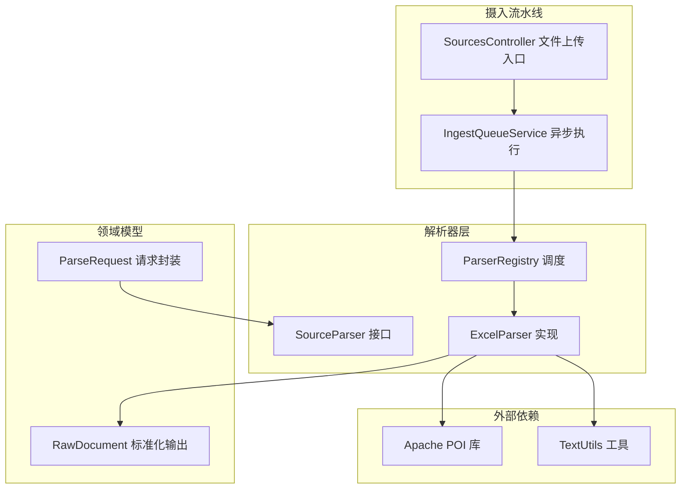
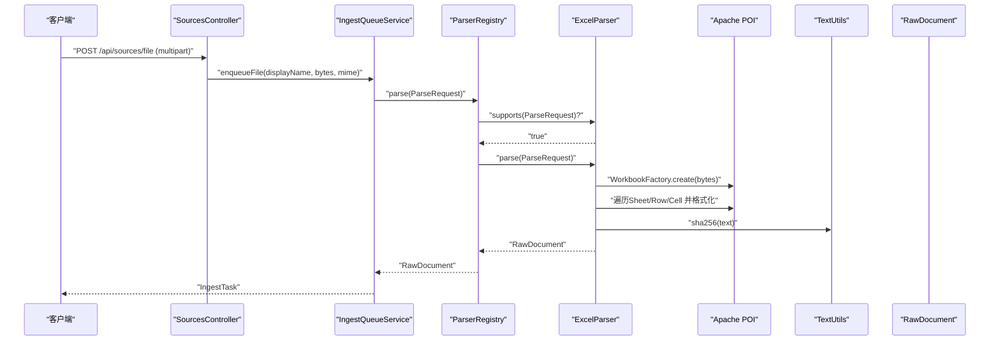
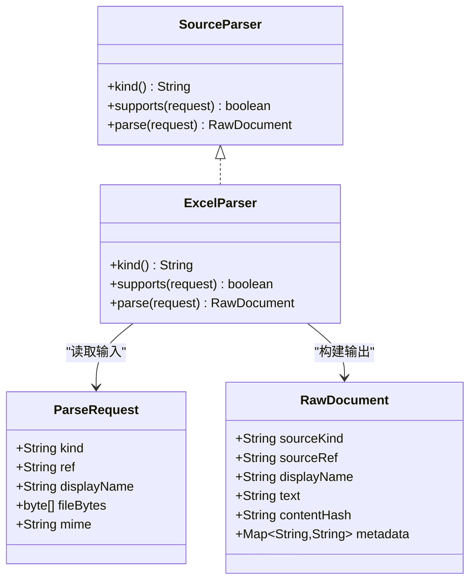
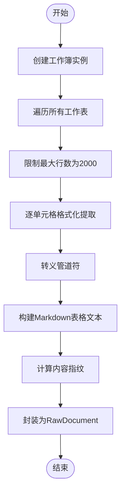
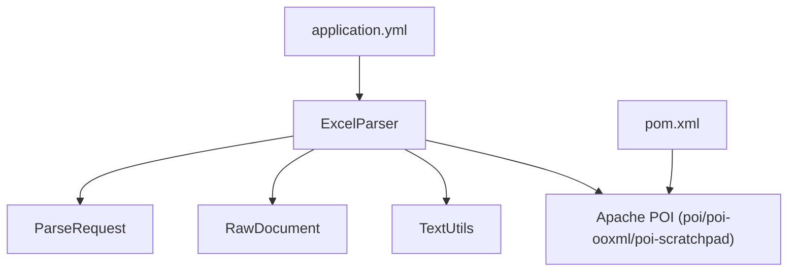

# Excel电子表格解析器

<cite>
**本文引用的文件**
- [ExcelParser.java](file://src/main/java/com/example/llmwiki/parser/impl/ExcelParser.java)
- [SourceParser.java](file://src/main/java/com/example/llmwiki/parser/SourceParser.java)
- [ParseRequest.java](file://src/main/java/com/example/llmwiki/parser/ParseRequest.java)
- [ParserRegistry.java](file://src/main/java/com/example/llmwiki/parser/ParserRegistry.java)
- [RawDocument.java](file://src/main/java/com/example/llmwiki/domain/RawDocument.java)
- [TextUtils.java](file://src/main/java/com/example/llmwiki/util/TextUtils.java)
- [pom.xml](file://pom.xml)
- [application.yml](file://src/main/resources/application.yml)
- [IngestQueueService.java](file://src/main/java/com/example/llmwiki/queue/IngestQueueService.java)
- [SourcesController.java](file://src/main/java/com/example/llmwiki/api/SourcesController.java)
</cite>

## 目录
1. [简介](#简介)
2. [项目结构](#项目结构)
3. [核心组件](#核心组件)
4. [架构总览](#架构总览)
5. [详细组件分析](#详细组件分析)
6. [依赖关系分析](#依赖关系分析)
7. [性能考虑](#性能考虑)
8. [故障排除指南](#故障排除指南)
9. [结论](#结论)
10. [附录](#附录)

## 简介
本技术文档围绕Excel电子表格解析器展开，系统性阐述其在项目中的实现原理与集成方式。解析器基于Apache POI库，支持XLS与XLSX格式，采用“按行展开为Markdown表格”的策略，完成工作簿加载、工作表遍历、单元格数据提取、数据类型识别与格式转换，并将结果封装为标准化的原始文档对象，供后续摄入流水线使用。

## 项目结构
Excel解析器位于解析器子系统中，遵循统一的SourceParser接口规范，通过ParserRegistry进行注册与调度；在摄入流水线中，由IngestQueueService负责异步执行与重试控制；前端通过SourcesController提供文件上传入口，将文件字节流交由解析器处理。

**图表来源**
- [ExcelParser.java:29-78](file://src/main/java/com/example/llmwiki/parser/impl/ExcelParser.java#L29-L78)
- [ParserRegistry.java:27-35](file://src/main/java/com/example/llmwiki/parser/ParserRegistry.java#L27-L35)
- [IngestQueueService.java:159-212](file://src/main/java/com/example/llmwiki/queue/IngestQueueService.java#L159-L212)
- [SourcesController.java:45-48](file://src/main/java/com/example/llmwiki/api/SourcesController.java#L45-L48)

**章节来源**
- [ExcelParser.java:29-78](file://src/main/java/com/example/llmwiki/parser/impl/ExcelParser.java#L29-L78)
- [ParserRegistry.java:27-35](file://src/main/java/com/example/llmwiki/parser/ParserRegistry.java#L27-L35)
- [IngestQueueService.java:159-212](file://src/main/java/com/example/llmwiki/queue/IngestQueueService.java#L159-L212)
- [SourcesController.java:45-48](file://src/main/java/com/example/llmwiki/api/SourcesController.java#L45-L48)

## 核心组件
- ExcelParser：实现SourceParser接口，负责Excel文件的格式识别、工作簿加载、工作表遍历、单元格数据提取与Markdown表格输出。
- SourceParser：解析器统一接口，定义kind、supports与parse三个核心方法。
- ParseRequest：解析请求的数据传输对象，封装来源类型、引用、显示名与文件字节等。
- ParserRegistry：解析器注册表，按顺序选择首个满足条件的解析器实现。
- RawDocument：标准化原始文档输出，包含文本正文、内容指纹、元信息等。
- TextUtils：通用字符串与哈希工具，用于内容指纹计算。
- IngestQueueService：摄入队列服务，负责任务调度、执行与重试控制。
- SourcesController：文件上传入口，接收multipart文件并入队处理。

**章节来源**
- [SourceParser.java:11-21](file://src/main/java/com/example/llmwiki/parser/SourceParser.java#L11-L21)
- [ParseRequest.java:18-34](file://src/main/java/com/example/llmwiki/parser/ParseRequest.java#L18-L34)
- [ParserRegistry.java:27-35](file://src/main/java/com/example/llmwiki/parser/ParserRegistry.java#L27-L35)
- [RawDocument.java:20-51](file://src/main/java/com/example/llmwiki/domain/RawDocument.java#L20-L51)
- [TextUtils.java:26-41](file://src/main/java/com/example/llmwiki/util/TextUtils.java#L26-L41)
- [IngestQueueService.java:159-212](file://src/main/java/com/example/llmwiki/queue/IngestQueueService.java#L159-L212)
- [SourcesController.java:45-48](file://src/main/java/com/example/llmwiki/api/SourcesController.java#L45-L48)

## 架构总览
Excel解析器在系统中的位置与交互如下：

**图表来源**
- [SourcesController.java:45-48](file://src/main/java/com/example/llmwiki/api/SourcesController.java#L45-L48)
- [IngestQueueService.java:159-212](file://src/main/java/com/example/llmwiki/queue/IngestQueueService.java#L159-L212)
- [ParserRegistry.java:27-35](file://src/main/java/com/example/llmwiki/parser/ParserRegistry.java#L27-L35)
- [ExcelParser.java:46-77](file://src/main/java/com/example/llmwiki/parser/impl/ExcelParser.java#L46-L77)

## 详细组件分析

### ExcelParser实现分析
- 角色与职责
  - 实现SourceParser接口，提供Excel文件的kind标识、格式支持判断与解析逻辑。
  - 使用Apache POI加载XLS/XLSX工作簿，遍历所有工作表，逐行逐列提取单元格内容。
  - 通过DataFormatter进行数据类型识别与格式转换，最终拼接为Markdown表格文本。
  - 将结果封装为RawDocument，计算内容指纹，便于增量缓存。

- 关键实现要点
  - 支持判定：仅当来源类型为FILE且文件扩展名为.xls或.xlsx时返回true。
  - 工作簿加载：使用WorkbookFactory从字节数组创建工作簿实例，自动识别XLS与XLSX。
  - 工作表遍历：循环所有sheet，追加工作表标题。
  - 行列遍历：限制最大行数为2000，避免超大数据集导致内存压力；跳过空行。
  - 单元格处理：使用DataFormatter.formatCellValue获取格式化后的字符串；对管道符进行转义。
  - 输出构建：生成Markdown表格文本，计算SHA256指纹，构建RawDocument。

- 错误处理策略
  - 解析过程中抛出的异常向上抛出，由上层IngestQueueService捕获并进行重试或标记失败。

**图表来源**
- [SourceParser.java:11-21](file://src/main/java/com/example/llmwiki/parser/SourceParser.java#L11-L21)
- [ExcelParser.java:29-78](file://src/main/java/com/example/llmwiki/parser/impl/ExcelParser.java#L29-L78)
- [ParseRequest.java:18-34](file://src/main/java/com/example/llmwiki/parser/ParseRequest.java#L18-L34)
- [RawDocument.java:20-51](file://src/main/java/com/example/llmwiki/domain/RawDocument.java#L20-L51)

**章节来源**
- [ExcelParser.java:31-77](file://src/main/java/com/example/llmwiki/parser/impl/ExcelParser.java#L31-L77)

### 解析流程与数据处理
- 工作簿加载
  - 通过WorkbookFactory.create从字节数组创建工作簿，自动识别XLS与XLSX。
- 工作表遍历
  - 获取工作簿中所有sheet数量，依次访问每个sheet。
- 单元格数据提取
  - 逐行遍历，限制最大行数为2000；跳过空行。
  - 逐列提取单元格，使用DataFormatter.formatCellValue进行格式化。
  - 对管道符进行转义，确保Markdown表格正确渲染。
- 输出构建
  - 拼接为Markdown表格文本，计算SHA256指纹，封装为RawDocument。

**图表来源**
- [ExcelParser.java:49-68](file://src/main/java/com/example/llmwiki/parser/impl/ExcelParser.java#L49-L68)

**章节来源**
- [ExcelParser.java:49-68](file://src/main/java/com/example/llmwiki/parser/impl/ExcelParser.java#L49-L68)

### 关键特性说明
- 复杂数据结构处理
  - 通过DataFormatter统一处理数值、日期、百分比、货币等格式，保证输出为可读字符串。
- 公式解析
  - 当前实现使用DataFormatter获取单元格“显示值”，未进行公式计算；若需公式结果，请在上游准备已计算的值或引入额外的计算引擎。
- 合并单元格识别
  - 代码未显式处理合并单元格；合并区域的读取可能表现为重复值或空值，建议在业务侧结合坐标定位进行去重或合并。
- 条件格式保持
  - 条件格式信息未被解析与保留；当前仅输出单元格的显示值。
- 空值处理
  - 空单元格返回空字符串，避免破坏表格结构。
- 数据类型转换
  - 使用DataFormatter进行类型识别与格式转换，确保输出为人类可读文本。
- 日期时间格式化
  - 日期时间通过DataFormatter进行格式化，具体格式取决于单元格的区域设置与样式。
- 数字精度控制
  - 当前未进行专门的数字精度裁剪；如需控制精度，可在上游或下游进行二次处理。

**章节来源**
- [ExcelParser.java:48-62](file://src/main/java/com/example/llmwiki/parser/impl/ExcelParser.java#L48-L62)

### 配置参数
- 最大行数限制
  - 在解析逻辑中固定为2000行，避免超大数据集导致内存压力。
- 内存使用控制
  - 通过限制行数与单次处理的字节数组，降低内存峰值；建议配合应用级文件大小限制。
- 并发处理设置
  - 摄入队列采用单线程worker串行执行，避免并发解析带来的资源竞争；可通过调整线程池配置提升吞吐量。

**章节来源**
- [ExcelParser.java:53](file://src/main/java/com/example/llmwiki/parser/impl/ExcelParser.java#L53)
- [IngestQueueService.java:45-49](file://src/main/java/com/example/llmwiki/queue/IngestQueueService.java#L45-L49)
- [application.yml:76](file://src/main/resources/application.yml#L76)

### 错误处理
- 不支持的版本
  - 通过supports方法过滤非Excel文件，避免无效解析。
- 损坏文件
  - WorkbookFactory在加载损坏文件时可能抛出异常；由上层IngestQueueService捕获并记录错误，触发重试或标记失败。
- 内存溢出
  - 通过最大行数限制与单线程串行执行缓解内存压力；建议结合应用级文件大小限制与JVM堆参数优化。

**章节来源**
- [ExcelParser.java:37-43](file://src/main/java/com/example/llmwiki/parser/impl/ExcelParser.java#L37-L43)
- [IngestQueueService.java:194-211](file://src/main/java/com/example/llmwiki/queue/IngestQueueService.java#L194-L211)

## 依赖关系分析
- Apache POI依赖
  - poi、poi-ooxml、poi-scratchpad用于支持XLS与XLSX格式的读取与操作。
- Spring配置
  - application.yml中定义了文件上传大小限制与日志级别，间接影响解析器的可用性与可观测性。
- 工具类依赖
  - TextUtils用于内容指纹计算，确保输出的稳定性与可缓存性。

**图表来源**
- [ExcelParser.java:8-13](file://src/main/java/com/example/llmwiki/parser/impl/ExcelParser.java#L8-L13)
- [TextUtils.java:26-41](file://src/main/java/com/example/llmwiki/util/TextUtils.java#L26-L41)
- [RawDocument.java:20-51](file://src/main/java/com/example/llmwiki/domain/RawDocument.java#L20-L51)
- [ParseRequest.java:18-34](file://src/main/java/com/example/llmwiki/parser/ParseRequest.java#L18-L34)
- [application.yml:8-10](file://src/main/resources/application.yml#L8-L10)
- [pom.xml:63-82](file://pom.xml#L63-L82)

**章节来源**
- [pom.xml:63-82](file://pom.xml#L63-L82)
- [application.yml:8-10](file://src/main/resources/application.yml#L8-L10)

## 性能考虑
- 行数限制：固定最大行数为2000，有效控制内存占用与解析耗时。
- 单线程串行：摄入队列采用单线程worker，避免并发争用，适合中小规模批量处理。
- 字节流处理：直接从内存字节数组创建工作簿，减少磁盘IO。
- 日志级别：适当降低POI相关日志级别，减少I/O开销。

## 故障排除指南
- 无法解析Excel文件
  - 检查文件扩展名是否为.xls或.xlsx，确认supports返回true。
- 解析异常
  - 查看IngestQueueService的日志输出，定位具体异常原因并根据重试策略处理。
- 内存不足
  - 减少单次解析的行数或分批处理；检查JVM堆参数与文件大小限制。
- 输出格式异常
  - 确认DataFormatter的区域设置与单元格样式；必要时在上游预处理为纯文本或已计算值。

**章节来源**
- [IngestQueueService.java:194-211](file://src/main/java/com/example/llmwiki/queue/IngestQueueService.java#L194-L211)

## 结论
Excel解析器通过简洁的实现与明确的职责边界，实现了对XLS/XLSX文件的稳定解析与输出。其基于Apache POI的格式化能力与统一的标准化输出，为后续的摄入与检索提供了可靠基础。在实际部署中，建议结合行数限制、单线程串行与合理的日志级别，确保系统在高负载下的稳定性与可维护性。

## 附录
- 术语
  - ExcelParser：Excel文件解析器实现。
  - SourceParser：解析器统一接口。
  - ParseRequest：解析请求数据对象。
  - RawDocument：标准化原始文档输出。
  - ParserRegistry：解析器注册表。
  - IngestQueueService：摄入队列服务。
  - TextUtils：通用字符串与哈希工具。