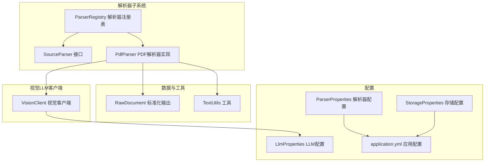
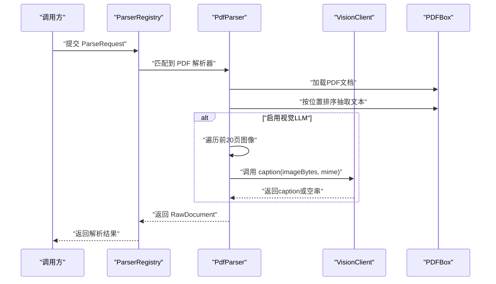
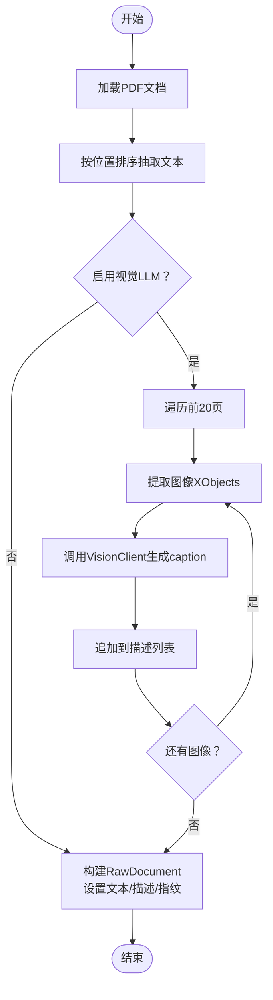
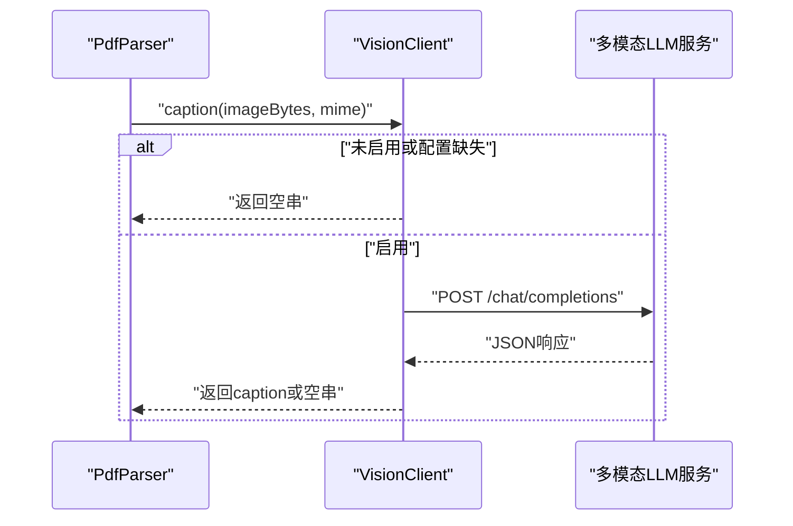
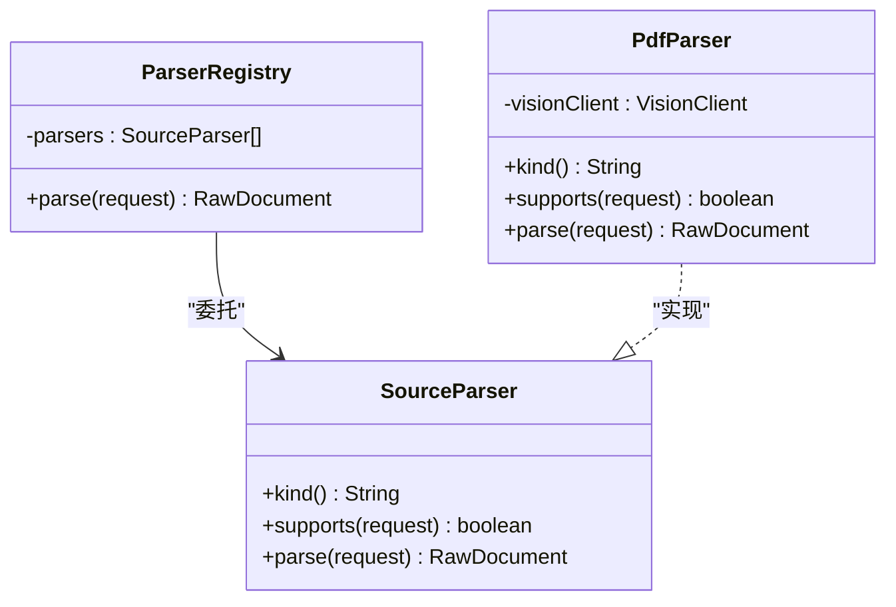
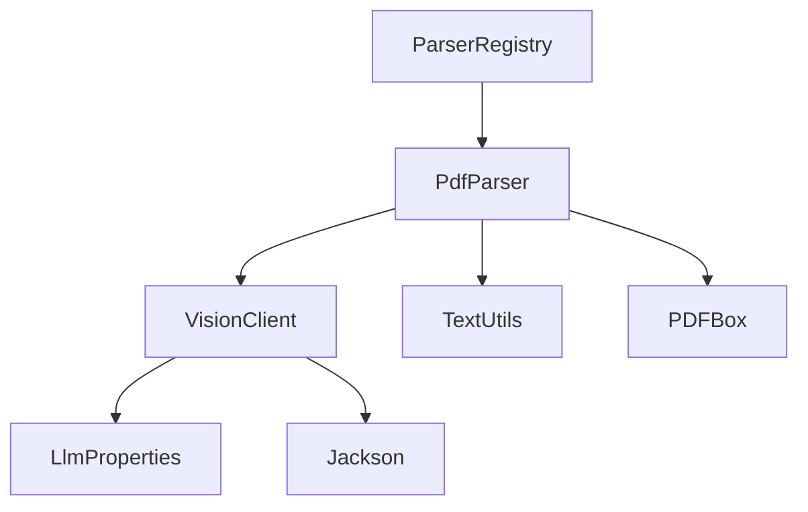

# PDF解析器

<cite>
**本文引用的文件**
- [PdfParser.java](file://src/main/java/com/example/llmwiki/parser/impl/PdfParser.java)
- [VisionClient.java](file://src/main/java/com/example/llmwiki/llm/VisionClient.java)
- [ParserRegistry.java](file://src/main/java/com/example/llmwiki/parser/ParserRegistry.java)
- [SourceParser.java](file://src/main/java/com/example/llmwiki/parser/SourceParser.java)
- [ParseRequest.java](file://src/main/java/com/example/llmwiki/parser/ParseRequest.java)
- [RawDocument.java](file://src/main/java/com/example/llmwiki/domain/RawDocument.java)
- [TextUtils.java](file://src/main/java/com/example/llmwiki/util/TextUtils.java)
- [LlmProperties.java](file://src/main/java/com/example/llmwiki/config/LlmProperties.java)
- [ParserProperties.java](file://src/main/java/com/example/llmwiki/config/ParserProperties.java)
- [StorageProperties.java](file://src/main/java/com/example/llmwiki/config/StorageProperties.java)
- [application.yml](file://src/main/resources/application.yml)
- [pom.xml](file://pom.xml)
</cite>

## 目录
1. [简介](#简介)
2. [项目结构](#项目结构)
3. [核心组件](#核心组件)
4. [架构总览](#架构总览)
5. [详细组件分析](#详细组件分析)
6. [依赖分析](#依赖分析)
7. [性能考虑](#性能考虑)
8. [故障排查指南](#故障排查指南)
9. [结论](#结论)
10. [附录](#附录)

## 简介
本文件面向PDF解析器的实现与使用，基于Apache PDFBox进行文本抽取与图像识别，并在可选启用的情况下，通过视觉多模态LLM对图片进行事实性描述（caption）。解析器支持多页PDF的纯文本提取、页面布局保持（按位置排序）、嵌入图像的识别与标注、内容规范化与去噪、以及内容指纹（SHA256）生成，用于后续的增量缓存与一致性校验。解析流程包括：文档加载、文本剥离、图像提取、视觉LLM标注、内容规范化与哈希生成。

## 项目结构
PDF解析器位于解析器子系统中，采用“统一接口 + 注册表分发”的架构设计，便于扩展其他格式解析器。核心文件组织如下：
- 解析器接口与注册表：定义统一解析契约与解析器选择逻辑
- PDF解析器实现：基于PDFBox完成文本与图像抽取，并可选调用视觉LLM
- 视觉LLM客户端：封装OpenAI兼容的多模态接口，负责图片caption
- 数据模型与工具：标准化输出结构、文本规范化与哈希计算
- 配置体系：LLM/Vision配置、解析器配置、存储路径配置、应用配置

**图表来源**
- [ParserRegistry.java:27-35](file://src/main/java/com/example/llmwiki/parser/ParserRegistry.java#L27-L35)
- [SourceParser.java:11-21](file://src/main/java/com/example/llmwiki/parser/SourceParser.java#L11-L21)
- [PdfParser.java:38-77](file://src/main/java/com/example/llmwiki/parser/impl/PdfParser.java#L38-L77)
- [VisionClient.java:25-86](file://src/main/java/com/example/llmwiki/llm/VisionClient.java#L25-L86)
- [RawDocument.java:18-51](file://src/main/java/com/example/llmwiki/domain/RawDocument.java#L18-L51)
- [TextUtils.java:15-80](file://src/main/java/com/example/llmwiki/util/TextUtils.java#L15-L80)
- [LlmProperties.java:16-62](file://src/main/java/com/example/llmwiki/config/LlmProperties.java#L16-L62)
- [ParserProperties.java:13-45](file://src/main/java/com/example/llmwiki/config/ParserProperties.java#L13-L45)
- [StorageProperties.java:13-28](file://src/main/java/com/example/llmwiki/config/StorageProperties.java#L13-L28)
- [application.yml:31-84](file://src/main/resources/application.yml#L31-L84)

**章节来源**
- [ParserRegistry.java:16-36](file://src/main/java/com/example/llmwiki/parser/ParserRegistry.java#L16-L36)
- [SourceParser.java:11-21](file://src/main/java/com/example/llmwiki/parser/SourceParser.java#L11-L21)
- [PdfParser.java:38-113](file://src/main/java/com/example/llmwiki/parser/impl/PdfParser.java#L38-L113)
- [VisionClient.java:25-95](file://src/main/java/com/example/llmwiki/llm/VisionClient.java#L25-L95)
- [RawDocument.java:18-51](file://src/main/java/com/example/llmwiki/domain/RawDocument.java#L18-L51)
- [TextUtils.java:15-80](file://src/main/java/com/example/llmwiki/util/TextUtils.java#L15-L80)
- [LlmProperties.java:16-62](file://src/main/java/com/example/llmwiki/config/LlmProperties.java#L16-L62)
- [ParserProperties.java:13-45](file://src/main/java/com/example/llmwiki/config/ParserProperties.java#L13-L45)
- [StorageProperties.java:13-28](file://src/main/java/com/example/llmwiki/config/StorageProperties.java#L13-L28)
- [application.yml:31-84](file://src/main/resources/application.yml#L31-L84)

## 核心组件
- 解析器接口与注册表
  - SourceParser：统一的解析器契约，定义kind、supports与parse方法
  - ParserRegistry：遍历已注册解析器，选择首个满足条件的实现执行解析
- PDF解析器实现
  - 基于PDFBox加载PDF文档，使用PDFTextStripper按位置排序抽取文本
  - 遍历前20页（含）的页面资源，提取嵌入图像并调用视觉LLM生成caption
  - 构造RawDocument，包含文本、图像描述列表与内容指纹
- 视觉LLM客户端
  - 判断是否启用（配置开关与API Key存在）
  - 将图片编码为data URL，构造OpenAI兼容的消息结构，调用/chat/completions
  - 返回第一条回复内容作为caption，异常时记录日志并返回空串
- 数据模型与工具
  - RawDocument：标准化输出，包含来源、文本、元信息、图像描述、内容指纹等
  - TextUtils：提供SHA256哈希、空白符规范化、slug生成等工具方法
- 配置体系
  - LlmProperties：统一管理Chat/Embedding/Vision的base-url、API Key、模型、超时等
  - ParserProperties：解析器相关配置（当前包含飞书、钉钉、OCR）
  - StorageProperties：存储根目录与各子目录路径
  - application.yml：应用层配置，包含文件上传大小、数据库、调度、解析器与LLM默认值

**章节来源**
- [SourceParser.java:11-21](file://src/main/java/com/example/llmwiki/parser/SourceParser.java#L11-L21)
- [ParserRegistry.java:27-35](file://src/main/java/com/example/llmwiki/parser/ParserRegistry.java#L27-L35)
- [PdfParser.java:56-77](file://src/main/java/com/example/llmwiki/parser/impl/PdfParser.java#L56-L77)
- [VisionClient.java:34-86](file://src/main/java/com/example/llmwiki/llm/VisionClient.java#L34-L86)
- [RawDocument.java:18-51](file://src/main/java/com/example/llmwiki/domain/RawDocument.java#L18-L51)
- [TextUtils.java:26-41](file://src/main/java/com/example/llmwiki/util/TextUtils.java#L26-L41)
- [LlmProperties.java:54-61](file://src/main/java/com/example/llmwiki/config/LlmProperties.java#L54-L61)
- [ParserProperties.java:18-44](file://src/main/java/com/example/llmwiki/config/ParserProperties.java#L18-L44)
- [StorageProperties.java:16-28](file://src/main/java/com/example/llmwiki/config/StorageProperties.java#L16-L28)
- [application.yml:39-77](file://src/main/resources/application.yml#L39-L77)

## 架构总览
PDF解析器在统一的解析器框架下工作，遵循以下交互流程：
- ParserRegistry根据ParseRequest的kind/ref/displayName选择PdfParser
- PdfParser加载PDF文档，抽取文本；若启用视觉LLM，则提取前20页内嵌图像并生成caption
- 构建RawDocument并返回给上层摄入流水线

**图表来源**
- [ParserRegistry.java:27-35](file://src/main/java/com/example/llmwiki/parser/ParserRegistry.java#L27-L35)
- [PdfParser.java:56-77](file://src/main/java/com/example/llmwiki/parser/impl/PdfParser.java#L56-L77)
- [VisionClient.java:47-86](file://src/main/java/com/example/llmwiki/llm/VisionClient.java#L47-L86)

## 详细组件分析

### PDF解析器实现（PdfParser）
- 支持判定
  - 仅当请求类型为FILE且文件名为“.pdf”结尾时才处理
- 文本抽取
  - 使用PDFTextStripper并开启按位置排序，确保文本布局接近原排版
- 图像提取与标注
  - 限定最多20页，避免高成本的视觉标注
  - 遍历页面资源中的XObjects，过滤出图像对象并写入PNG流
  - 调用VisionClient生成caption，拼接页码与序号后加入列表
  - 异常时记录调试日志并跳过该图像
- 结果构建
  - 构造RawDocument，设置来源、显示名、文本、图像描述列表
  - 使用TextUtils对文本进行空白符规范化
  - 内容指纹由文本与图像描述拼接后的SHA256生成

**图表来源**
- [PdfParser.java:56-111](file://src/main/java/com/example/llmwiki/parser/impl/PdfParser.java#L56-L111)
- [TextUtils.java:66-71](file://src/main/java/com/example/llmwiki/util/TextUtils.java#L66-L71)

**章节来源**
- [PdfParser.java:47-111](file://src/main/java/com/example/llmwiki/parser/impl/PdfParser.java#L47-L111)
- [TextUtils.java:26-41](file://src/main/java/com/example/llmwiki/util/TextUtils.java#L26-L41)

### 视觉LLM客户端（VisionClient）
- 启用判断
  - 需要配置开启开关与有效的API Key
- 请求构造
  - 将图像字节编码为data URL，构造消息数组，包含提示词与图片URL
  - 使用配置的base-url/model/timeout等参数
- 响应处理
  - 解析JSON响应，取第一条回复内容作为caption
  - 异常时记录警告日志并返回空串，保证解析流程不中断
- 与PDF解析器协作
  - PdfParser在图像提取阶段逐个调用，将有效caption合并到描述列表

**图表来源**
- [VisionClient.java:34-86](file://src/main/java/com/example/llmwiki/llm/VisionClient.java#L34-L86)
- [LlmProperties.java:54-61](file://src/main/java/com/example/llmwiki/config/LlmProperties.java#L54-L61)

**章节来源**
- [VisionClient.java:34-86](file://src/main/java/com/example/llmwiki/llm/VisionClient.java#L34-L86)
- [LlmProperties.java:54-61](file://src/main/java/com/example/llmwiki/config/LlmProperties.java#L54-L61)

### 解析器注册表与统一接口（ParserRegistry、SourceParser）
- SourceParser定义了kind/supported/parse三个核心方法
- ParserRegistry遍历所有SourceParser实现，选择首个supports返回true的解析器执行parse
- PdfParser通过@Order(10)参与排序，确保在注册表中的优先级

**图表来源**
- [SourceParser.java:11-21](file://src/main/java/com/example/llmwiki/parser/SourceParser.java#L11-L21)
- [ParserRegistry.java:21-35](file://src/main/java/com/example/llmwiki/parser/ParserRegistry.java#L21-L35)
- [PdfParser.java:38-54](file://src/main/java/com/example/llmwiki/parser/impl/PdfParser.java#L38-L54)

**章节来源**
- [SourceParser.java:11-21](file://src/main/java/com/example/llmwiki/parser/SourceParser.java#L11-L21)
- [ParserRegistry.java:27-35](file://src/main/java/com/example/llmwiki/parser/ParserRegistry.java#L27-L35)
- [PdfParser.java:38-54](file://src/main/java/com/example/llmwiki/parser/impl/PdfParser.java#L38-L54)

### 数据模型与工具（RawDocument、TextUtils）
- RawDocument
  - 统一输出结构，包含来源类型/标识/显示名、文本、图像描述列表、元信息、内容指纹、抓取时间等
- TextUtils
  - 提供SHA256哈希、空白符规范化、slug生成、截断等工具方法
  - PdfParser在构建RawDocument时使用normalizeWhitespace与sha256

**章节来源**
- [RawDocument.java:18-51](file://src/main/java/com/example/llmwiki/domain/RawDocument.java#L18-L51)
- [TextUtils.java:26-71](file://src/main/java/com/example/llmwiki/util/TextUtils.java#L26-L71)

### 配置参数与应用设置
- LLM/Vision配置（LlmProperties）
  - 支持Chat/Embedding/Vision三类模型配置，包含base-url、API Key、模型名、温度、超时等
  - Vision.enabled与apiKey共同决定是否启用视觉标注
- 解析器配置（ParserProperties）
  - 当前包含飞书、钉钉、OCR相关开关与参数（本项目PDF解析器不直接使用）
- 存储配置（StorageProperties）
  - 定义数据根目录与raw/wiki/index/graph等子目录
- 应用配置（application.yml）
  - 文件上传大小限制、数据库与JPA配置、调度线程池、llm/parser/storage等默认值
  - 日志级别对PDFBox与POI做了降噪

**章节来源**
- [LlmProperties.java:16-62](file://src/main/java/com/example/llmwiki/config/LlmProperties.java#L16-L62)
- [ParserProperties.java:13-45](file://src/main/java/com/example/llmwiki/config/ParserProperties.java#L13-L45)
- [StorageProperties.java:13-28](file://src/main/java/com/example/llmwiki/config/StorageProperties.java#L13-L28)
- [application.yml:39-84](file://src/main/resources/application.yml#L39-L84)

## 依赖分析
- 外部库
  - PDFBox：PDF文档加载与文本抽取
  - Spring Web（RestClient）：视觉LLM客户端HTTP调用
  - Jackson：JSON序列化与响应解析
- 内部模块耦合
  - PdfParser依赖VisionClient与TextUtils
  - VisionClient依赖LlmProperties与RestClient
  - ParserRegistry依赖所有SourceParser实现（通过Spring注入）

**图表来源**
- [PdfParser.java:40-40](file://src/main/java/com/example/llmwiki/parser/impl/PdfParser.java#L40-L40)
- [VisionClient.java:27-29](file://src/main/java/com/example/llmwiki/llm/VisionClient.java#L27-L29)
- [LlmProperties.java:16-62](file://src/main/java/com/example/llmwiki/config/LlmProperties.java#L16-L62)
- [pom.xml:62-92](file://pom.xml#L62-L92)

**章节来源**
- [pom.xml:36-158](file://pom.xml#L36-L158)
- [PdfParser.java:10-26](file://src/main/java/com/example/llmwiki/parser/impl/PdfParser.java#L10-L26)
- [VisionClient.java:10-14](file://src/main/java/com/example/llmwiki/llm/VisionClient.java#L10-L14)

## 性能考虑
- 大文件处理
  - PDF文本抽取与图像提取均在JVM内存中进行，建议结合应用层面的文件大小限制（multipart配置）与业务阈值控制
- 内存管理
  - 使用try-with-resources确保PDDocument及时关闭
  - 图像以PNG流形式写入内存，注意控制图像数量与尺寸
- 图像数量限制
  - 默认仅处理前20页内的嵌入图像，显著降低视觉标注成本
- 缓存机制
  - 通过内容指纹（SHA256）实现内容一致性校验，可用于增量缓存与重复检测
- 并发与超时
  - Vision调用受LlmProperties.timeoutSeconds约束；应用层可通过线程池与任务队列控制并发
- I/O与存储
  - 存储路径由StorageProperties与application.yml配置，建议将raw目录与索引目录置于高性能磁盘

**章节来源**
- [application.yml:8-10](file://src/main/resources/application.yml#L8-L10)
- [PdfParser.java:84-84](file://src/main/java/com/example/llmwiki/parser/impl/PdfParser.java#L84-L84)
- [TextUtils.java:26-41](file://src/main/java/com/example/llmwiki/util/TextUtils.java#L26-L41)
- [LlmProperties.java:60-60](file://src/main/java/com/example/llmwiki/config/LlmProperties.java#L60-L60)

## 故障排查指南
- PDF加载失败
  - 现象：解析抛出异常或文本为空
  - 排查：确认输入字节为合法PDF；检查文件大小与内存限制；查看日志中PDFBox相关警告
- 图像提取异常
  - 现象：部分图像无法读取或caption为空
  - 排查：检查页面资源是否存在；确认图像XObject类型；查看解析器日志中的调试信息
- 视觉标注失败
  - 现象：caption为空或警告日志
  - 排查：确认LlmProperties.vision.enabled与apiKey配置；检查网络连通性与base-url；适当提高timeoutSeconds
- 错误降级策略
  - PdfParser在图像提取与视觉调用异常时均进行日志记录并跳过，保证整体流程继续执行
  - VisionClient在调用失败时返回空串，不影响后续文本与描述的组装

**章节来源**
- [PdfParser.java:101-109](file://src/main/java/com/example/llmwiki/parser/impl/PdfParser.java#L101-L109)
- [VisionClient.java:82-85](file://src/main/java/com/example/llmwiki/llm/VisionClient.java#L82-L85)

## 结论
PDF解析器通过PDFBox实现文本与图像的可靠抽取，并在可选启用视觉LLM的情况下，对前20页内的嵌入图像进行事实性描述，最终输出标准化的RawDocument。系统通过内容指纹、图像数量限制与超时配置实现了成本与质量的平衡，具备良好的可扩展性与稳定性。

## 附录
- 关键特性摘要
  - 多页文档处理：按页遍历，支持前20页图像标注
  - 图像识别成本控制：默认限制为20页以内
  - 视觉客户端集成：OpenAI兼容接口，可热更新配置
  - 内容规范化与指纹：空白符规范化与SHA256指纹生成
- 配置要点
  - LLM/Vision：base-url、API Key、模型、超时
  - 应用：文件上传大小、数据库、日志级别
  - 存储：raw/wiki/index/graph目录