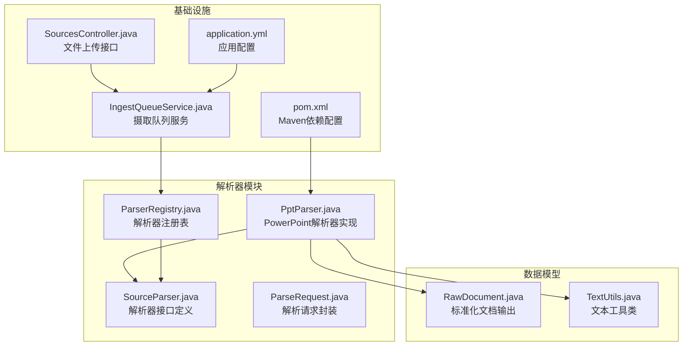
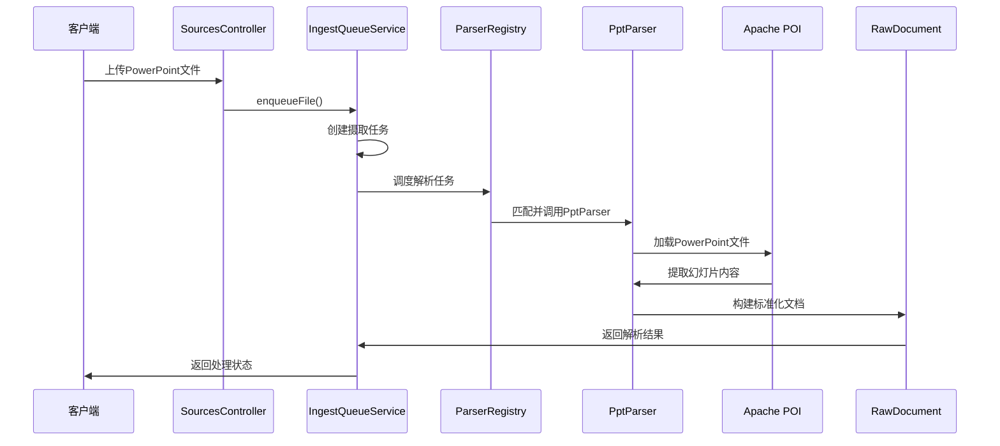
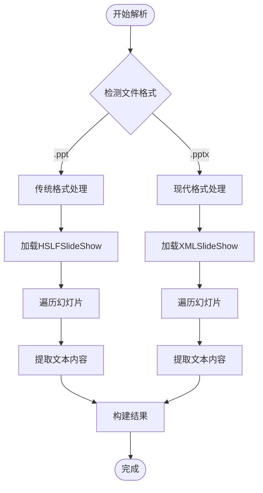
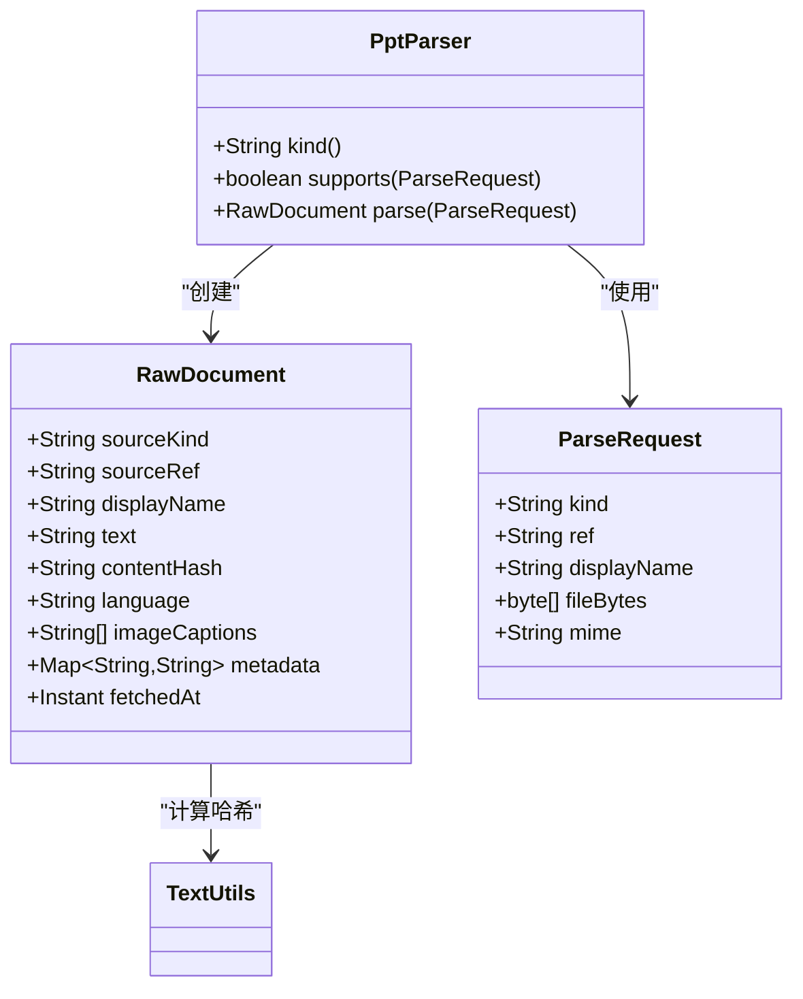
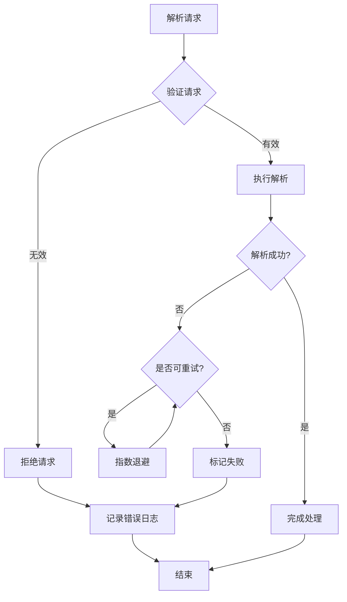
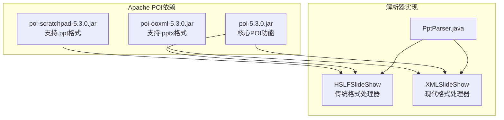

# PowerPoint演示文稿解析器

<cite>
**本文档引用的文件**
- [PptParser.java](file://src/main/java/com/example/llmwiki/parser/impl/PptParser.java)
- [SourceParser.java](file://src/main/java/com/example/llmwiki/parser/SourceParser.java)
- [ParseRequest.java](file://src/main/java/com/example/llmwiki/parser/ParseRequest.java)
- [ParserRegistry.java](file://src/main/java/com/example/llmwiki/parser/ParserRegistry.java)
- [RawDocument.java](file://src/main/java/com/example/llmwiki/domain/RawDocument.java)
- [TextUtils.java](file://src/main/java/com/example/llmwiki/util/TextUtils.java)
- [ParserException.java](file://src/main/java/com/example/llmwiki/parser/ParserException.java)
- [IngestQueueService.java](file://src/main/java/com/example/llmwiki/queue/IngestQueueService.java)
- [SourcesController.java](file://src/main/java/com/example/llmwiki/api/SourcesController.java)
- [pom.xml](file://pom.xml)
- [application.yml](file://src/main/resources/application.yml)
</cite>

## 目录
1. [简介](#简介)
2. [项目结构](#项目结构)
3. [核心组件](#核心组件)
4. [架构概览](#架构概览)
5. [详细组件分析](#详细组件分析)
6. [依赖关系分析](#依赖关系分析)
7. [性能考虑](#性能考虑)
8. [故障排除指南](#故障排除指南)
9. [结论](#结论)

## 简介

PowerPoint演示文稿解析器是LLM-Wiki知识库系统中的一个重要组件，专门负责处理PowerPoint格式的演示文稿文件（.ppt和.pptx）。该解析器基于Apache POI库实现，能够从PowerPoint文件中提取文本内容、保持基本的格式信息，并将结果标准化为系统内部的统一文档格式。

本解析器采用插件化架构设计，通过实现统一的SourceParser接口，与其他文档解析器（如Word、Excel、PDF等）协同工作，形成完整的多格式文档处理生态系统。解析器支持两种主要的PowerPoint格式：传统的二进制格式（.ppt）和基于Office Open XML的标准格式（.pptx）。

## 项目结构

LLM-Wiki项目的文件组织遵循标准的Spring Boot应用结构，PowerPoint解析器位于parser模块下的impl包中：

**图表来源**
- [PptParser.java:1-83](file://src/main/java/com/example/llmwiki/parser/impl/PptParser.java#L1-L83)
- [SourceParser.java:1-22](file://src/main/java/com/example/llmwiki/parser/SourceParser.java#L1-L22)
- [ParserRegistry.java:1-37](file://src/main/java/com/example/llmwiki/parser/ParserRegistry.java#L1-L37)
- [RawDocument.java:1-52](file://src/main/java/com/example/llmwiki/domain/RawDocument.java#L1-L52)

**章节来源**
- [PptParser.java:1-83](file://src/main/java/com/example/llmwiki/parser/impl/PptParser.java#L1-L83)
- [pom.xml:1-171](file://pom.xml#L1-L171)

## 核心组件

### PptParser - PowerPoint解析器实现

PptParser是PowerPoint文档解析的核心实现，它实现了SourceParser接口，提供了对.ppt和.pptx格式文件的统一处理能力。

**关键特性：**
- 支持两种PowerPoint格式：.ppt（二进制）和.pptx（Open XML）
- 统一的文本提取机制，忽略非文本内容
- 基于Apache POI的稳定解析框架
- 符合系统统一的文档输出格式

**解析流程：**
1. 文件类型检测和格式识别
2. 根据格式选择相应的POI处理器
3. 幻灯片遍历和内容提取
4. 文本内容标准化和格式化
5. 结果封装为RawDocument对象

**章节来源**
- [PptParser.java:21-83](file://src/main/java/com/example/llmwiki/parser/impl/PptParser.java#L21-L83)

### SourceParser接口

SourceParser定义了所有文档解析器的统一接口规范，确保不同格式的解析器可以无缝集成到系统中。

**接口方法：**
- `kind()`: 返回解析器类型标识符
- `supports(ParseRequest)`: 判断是否支持特定的解析请求
- `parse(ParseRequest)`: 执行实际的解析操作

**设计原则：**
- 统一的接口契约
- 明确的优先级排序
- 可扩展的插件架构

**章节来源**
- [SourceParser.java:5-22](file://src/main/java/com/example/llmwiki/parser/SourceParser.java#L5-L22)

### ParserRegistry解析器注册表

ParserRegistry负责管理所有可用的解析器实例，按照预定义的顺序选择最适合的解析器来处理特定类型的文档。

**核心功能：**
- 自动发现和注册所有SourceParser实现
- 顺序匹配解析器支持条件
- 统一的解析器调用入口
- 错误处理和异常传播

**工作流程：**
1. 获取所有已注册的解析器列表
2. 按顺序检查每个解析器的支持能力
3. 执行第一个匹配的解析器
4. 处理未找到解析器的情况

**章节来源**
- [ParserRegistry.java:10-37](file://src/main/java/com/example/llmwiki/parser/ParserRegistry.java#L10-L37)

## 架构概览

PowerPoint解析器在整个系统架构中扮演着文档处理管道中的重要节点，其工作流程如下：

**图表来源**
- [SourcesController.java:45-48](file://src/main/java/com/example/llmwiki/api/SourcesController.java#L45-L48)
- [IngestQueueService.java:73-91](file://src/main/java/com/example/llmwiki/queue/IngestQueueService.java#L73-L91)
- [ParserRegistry.java:27-35](file://src/main/java/com/example/llmwiki/parser/ParserRegistry.java#L27-L35)
- [PptParser.java:47-81](file://src/main/java/com/example/llmwiki/parser/impl/PptParser.java#L47-L81)

## 详细组件分析

### PptParser实现细节

PptParser的实现采用了针对不同PowerPoint格式的专门处理策略：

#### 格式分支处理

**图表来源**
- [PptParser.java:47-81](file://src/main/java/com/example/llmwiki/parser/impl/PptParser.java#L47-L81)

#### 文本提取算法

PptParser采用递归遍历的方式提取PowerPoint文件中的所有文本内容：

**传统格式(.ppt)处理流程：**
1. 使用HSLFSlideShow加载文件
2. 遍历所有幻灯片
3. 对每张幻灯片遍历文本段落
4. 提取并拼接文本内容

**现代格式(.pptx)处理流程：**
1. 使用XMLSlideShow加载文件
2. 遍历所有幻灯片
3. 对每张幻灯片遍历形状对象
4. 过滤文本形状并提取文本内容

**章节来源**
- [PptParser.java:47-81](file://src/main/java/com/example/llmwiki/parser/impl/PptParser.java#L47-L81)

### 数据模型和标准化

解析器输出的文档格式严格遵循RawDocument规范，确保与其他解析器的一致性：

**图表来源**
- [RawDocument.java:18-52](file://src/main/java/com/example/llmwiki/domain/RawDocument.java#L18-L52)
- [PptParser.java:74-81](file://src/main/java/com/example/llmwiki/parser/impl/PptParser.java#L74-L81)

**章节来源**
- [RawDocument.java:12-52](file://src/main/java/com/example/llmwiki/domain/RawDocument.java#L12-L52)
- [TextUtils.java:23-41](file://src/main/java/com/example/llmwiki/util/TextUtils.java#L23-L41)

### 错误处理机制

系统实现了多层次的错误处理和异常恢复机制：

**图表来源**
- [ParserRegistry.java:34](file://src/main/java/com/example/llmwiki/parser/ParserRegistry.java#L34)
- [IngestQueueService.java:194-211](file://src/main/java/com/example/llmwiki/queue/IngestQueueService.java#L194-L211)

**章节来源**
- [ParserException.java:1-19](file://src/main/java/com/example/llmwiki/parser/ParserException.java#L1-L19)
- [IngestQueueService.java:194-211](file://src/main/java/com/example/llmwiki/queue/IngestQueueService.java#L194-L211)

## 依赖关系分析

### Apache POI库集成

PowerPoint解析器深度集成了Apache POI库，这是处理Microsoft Office文档的标准Java库：

**图表来源**
- [pom.xml:63-82](file://pom.xml#L63-L82)
- [PptParser.java:8-14](file://src/main/java/com/example/llmwiki/parser/impl/PptParser.java#L8-L14)

### 系统集成点

解析器通过多个集成点与系统其他组件协作：

**文件上传集成：**
- SourcesController提供REST API接口
- 支持multipart/form-data文件上传
- 自动触发解析流程

**队列处理集成：**
- IngestQueueService管理解析任务
- 单线程串行执行确保稳定性
- 支持任务取消和重试机制

**配置管理集成：**
- application.yml提供全局配置
- 支持文件大小限制设置
- 日志级别和性能参数配置

**章节来源**
- [pom.xml:33](file://pom.xml#L33)
- [application.yml:8-10](file://src/main/resources/application.yml#L8-L10)
- [SourcesController.java:45-48](file://src/main/java/com/example/llmwiki/api/SourcesController.java#L45-L48)

## 性能考虑

### 内存使用优化

PowerPoint解析器在设计时充分考虑了内存使用效率：

**流式处理：**
- 使用ByteArrayInputStream避免文件复制
- try-with-resources确保资源及时释放
- 避免将整个文件加载到内存中

**文本处理优化：**
- 使用StringBuilder进行高效字符串拼接
- 避免创建不必要的中间对象
- 及时清理临时数据结构

### 处理策略

**单线程执行：**
- IngestQueueService采用单线程worker确保稳定性
- 避免多线程竞争和同步开销
- 简化错误处理和状态管理

**任务调度：**
- 支持任务取消和重试机制
- 指数退避算法减少系统压力
- 最大重试次数配置防止无限循环

### 大文件处理

对于大型PowerPoint文件，系统提供了以下优化措施：

**内存保护：**
- 基于文件大小的处理策略
- 分块读取和处理机制
- 内存使用监控和预警

**性能监控：**
- 详细的日志记录和性能指标
- 超时机制防止长时间阻塞
- 资源使用统计和报告

## 故障排除指南

### 常见问题诊断

**格式不兼容问题：**
- 检查文件扩展名是否正确
- 验证文件头信息确认格式
- 确认Apache POI版本兼容性

**解析失败处理：**
- 查看ParserException异常信息
- 检查文件完整性
- 验证文件权限和访问性

**内存不足问题：**
- 监控JVM内存使用情况
- 调整堆大小参数
- 实施更严格的内存管理

### 错误恢复机制

系统实现了多层次的错误恢复机制：

**自动重试：**
- 最大重试次数配置
- 指数退避延迟
- 失败原因分类处理

**手动干预：**
- 任务取消和重试API
- 详细错误日志记录
- 状态查询和监控

**章节来源**
- [IngestQueueService.java:194-211](file://src/main/java/com/example/llmwiki/queue/IngestQueueService.java#L194-L211)
- [ParserException.java:9-18](file://src/main/java/com/example/llmwiki/parser/ParserException.java#L9-L18)

## 结论

PowerPoint演示文稿解析器作为LLM-Wiki系统的重要组成部分，展现了优秀的软件工程实践：

**技术优势：**
- 基于成熟的Apache POI库，确保解析准确性
- 清晰的架构设计，易于维护和扩展
- 完善的错误处理和异常恢复机制
- 标准化的输出格式，保证系统一致性

**设计亮点：**
- 插件化架构支持多种文档格式
- 单线程执行确保处理稳定性
- 统一的错误处理和重试机制
- 详细的日志记录和监控支持

**未来改进方向：**
- 增加多媒体内容提取支持
- 实现更精细的文本格式保持
- 优化大文件处理性能
- 扩展更多PowerPoint特有功能支持

该解析器为整个LLM-Wiki系统的文档处理能力奠定了坚实基础，通过与其他解析器的协同工作，形成了完整的多格式文档处理生态系统。