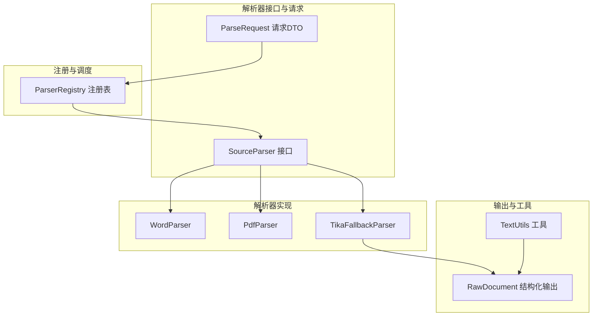
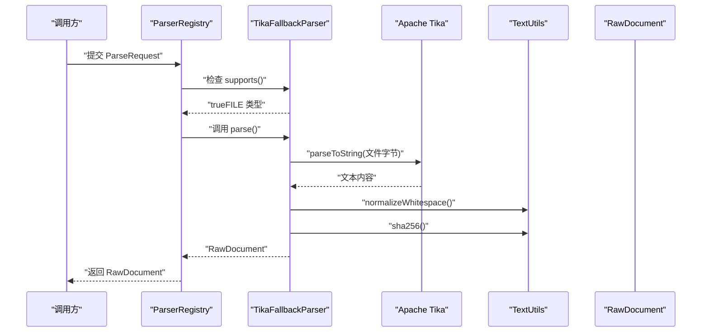
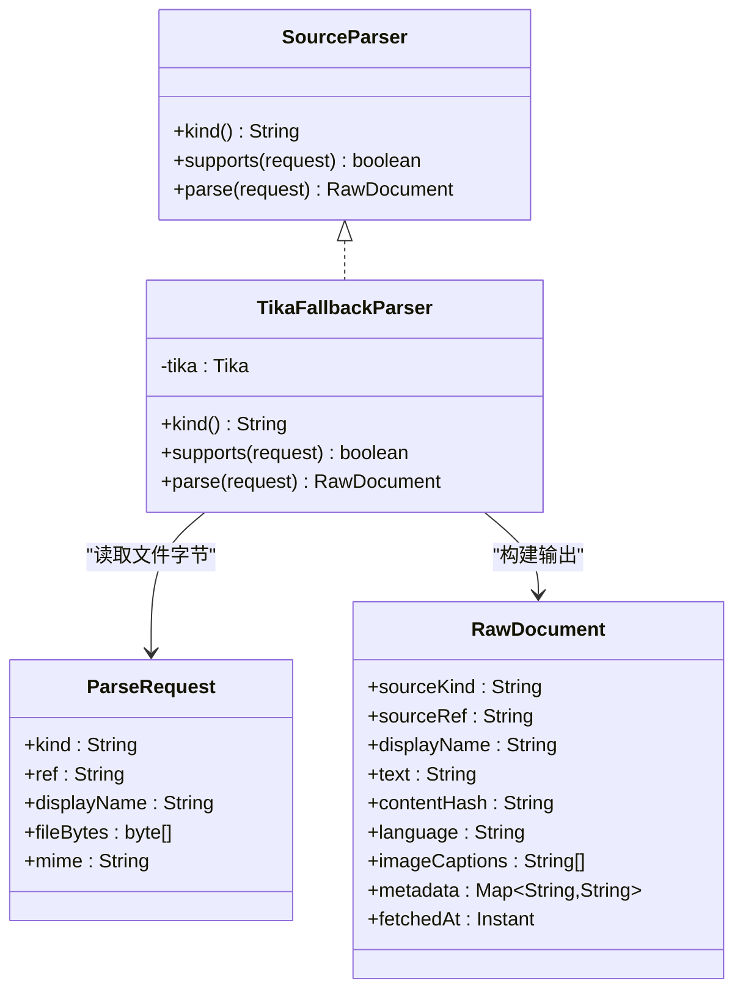
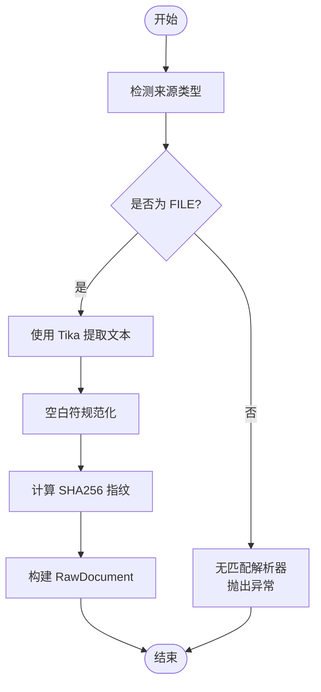
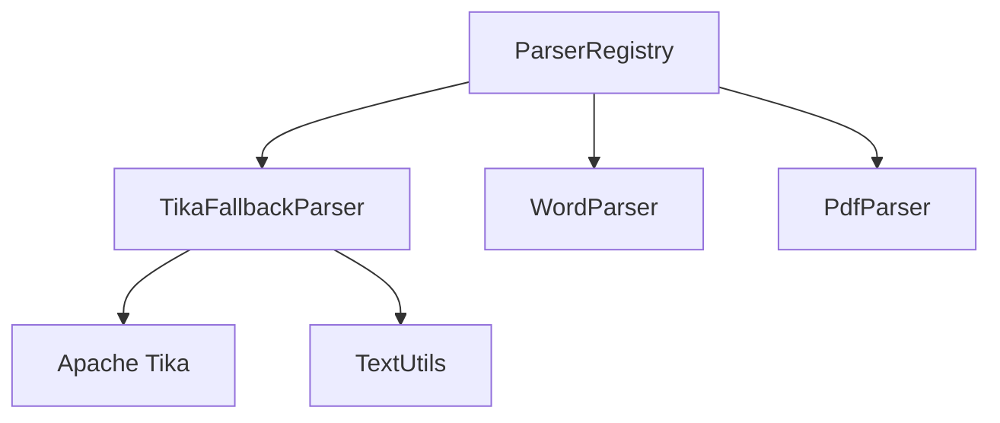

# Tika回退解析器

<cite>
**本文引用的文件**
- [TikaFallbackParser.java](file://src/main/java/com/example/llmwiki/parser/impl/TikaFallbackParser.java)
- [SourceParser.java](file://src/main/java/com/example/llmwiki/parser/SourceParser.java)
- [ParseRequest.java](file://src/main/java/com/example/llmwiki/parser/ParseRequest.java)
- [ParserRegistry.java](file://src/main/java/com/example/llmwiki/parser/ParserRegistry.java)
- [RawDocument.java](file://src/main/java/com/example/llmwiki/domain/RawDocument.java)
- [TextUtils.java](file://src/main/java/com/example/llmwiki/util/TextUtils.java)
- [ParserException.java](file://src/main/java/com/example/llmwiki/parser/ParserException.java)
- [WordParser.java](file://src/main/java/com/example/llmwiki/parser/impl/WordParser.java)
- [PdfParser.java](file://src/main/java/com/example/llmwiki/parser/impl/PdfParser.java)
- [ParserProperties.java](file://src/main/java/com/example/llmwiki/config/ParserProperties.java)
- [application.yml](file://src/main/resources/application.yml)
- [pom.xml](file://pom.xml)
</cite>

## 目录
1. [简介](#简介)
2. [项目结构](#项目结构)
3. [核心组件](#核心组件)
4. [架构总览](#架构总览)
5. [详细组件分析](#详细组件分析)
6. [依赖分析](#依赖分析)
7. [性能考虑](#性能考虑)
8. [故障排查指南](#故障排查指南)
9. [结论](#结论)
10. [附录](#附录)

## 简介
本文件为Tika回退解析器的技术文档，聚焦于基于Apache Tika库的通用文档解析能力。该解析器作为系统内多种专用解析器（如Word、PDF、Excel、飞书、钉钉、网页等）的兜底方案，负责处理未被专用解析器覆盖的文件类型，支持数百种文档格式的自动识别与解析，涵盖文件类型检测、MIME类型识别、内容提取、元数据解析与格式转换等关键流程，并提供统一的结构化输出，便于后续的索引与检索。

## 项目结构
围绕解析器体系的关键模块包括：
- 接口层：统一的解析器接口定义与请求封装
- 实现层：专用解析器与回退解析器
- 注册与调度：解析器注册表按优先级选择首个匹配的实现
- 输出模型：标准化的原始文档结构
- 工具与配置：文本处理工具与应用配置

图表来源
- [SourceParser.java:11-21](file://src/main/java/com/example/llmwiki/parser/SourceParser.java#L11-L21)
- [ParseRequest.java:18-34](file://src/main/java/com/example/llmwiki/parser/ParseRequest.java#L18-L34)
- [ParserRegistry.java:19-36](file://src/main/java/com/example/llmwiki/parser/ParserRegistry.java#L19-L36)
- [WordParser.java:27-66](file://src/main/java/com/example/llmwiki/parser/impl/WordParser.java#L27-L66)
- [PdfParser.java:38-112](file://src/main/java/com/example/llmwiki/parser/impl/PdfParser.java#L38-L112)
- [TikaFallbackParser.java:23-48](file://src/main/java/com/example/llmwiki/parser/impl/TikaFallbackParser.java#L23-L48)
- [RawDocument.java:20-51](file://src/main/java/com/example/llmwiki/domain/RawDocument.java#L20-L51)
- [TextUtils.java:15-79](file://src/main/java/com/example/llmwiki/util/TextUtils.java#L15-L79)

章节来源
- [SourceParser.java:11-21](file://src/main/java/com/example/llmwiki/parser/SourceParser.java#L11-L21)
- [ParseRequest.java:18-34](file://src/main/java/com/example/llmwiki/parser/ParseRequest.java#L18-L34)
- [ParserRegistry.java:19-36](file://src/main/java/com/example/llmwiki/parser/ParserRegistry.java#L19-L36)
- [RawDocument.java:20-51](file://src/main/java/com/example/llmwiki/domain/RawDocument.java#L20-L51)

## 核心组件
- 解析器接口：定义kind、supports、parse三个核心方法，统一不同来源的解析行为
- 解析请求：封装来源类型、引用标识、显示名称、文件字节与MIME类型
- 回退解析器：基于Apache Tika对文件进行内容提取，返回标准化的原始文档
- 注册表：按顺序遍历已注入的解析器，选择首个满足条件的实现
- 输出模型：统一的原始文档结构，包含文本正文、内容指纹、语言、嵌入图像描述、元信息与抓取时间
- 文本工具：提供SHA256指纹计算、空白符规范化、字符串截断等实用功能

章节来源
- [SourceParser.java:11-21](file://src/main/java/com/example/llmwiki/parser/SourceParser.java#L11-L21)
- [ParseRequest.java:18-34](file://src/main/java/com/example/llmwiki/parser/ParseRequest.java#L18-L34)
- [TikaFallbackParser.java:23-48](file://src/main/java/com/example/llmwiki/parser/impl/TikaFallbackParser.java#L23-L48)
- [ParserRegistry.java:19-36](file://src/main/java/com/example/llmwiki/parser/ParserRegistry.java#L19-L36)
- [RawDocument.java:20-51](file://src/main/java/com/example/llmwiki/domain/RawDocument.java#L20-L51)
- [TextUtils.java:15-79](file://src/main/java/com/example/llmwiki/util/TextUtils.java#L15-L79)

## 架构总览
Tika回退解析器在解析器体系中的定位是“兜底解析器”，当请求来源为文件且未被任何专用解析器覆盖时，由其统一处理。其工作流程如下：
- 输入：文件字节与可选的MIME类型
- 处理：通过Apache Tika进行内容提取
- 输出：标准化的原始文档对象，包含文本正文与内容指纹

图表来源
- [ParserRegistry.java:27-35](file://src/main/java/com/example/llmwiki/parser/ParserRegistry.java#L27-L35)
- [TikaFallbackParser.java:37-47](file://src/main/java/com/example/llmwiki/parser/impl/TikaFallbackParser.java#L37-L47)
- [TextUtils.java:66-71](file://src/main/java/com/example/llmwiki/util/TextUtils.java#L66-L71)
- [RawDocument.java:20-51](file://src/main/java/com/example/llmwiki/domain/RawDocument.java#L20-L51)

## 详细组件分析

### Tika回退解析器实现
- 角色与职责
  - 作为FILE类型的兜底解析器，处理未被专用解析器覆盖的文件
  - 使用Apache Tika进行内容提取，返回标准化的原始文档
- 关键实现要点
  - kind返回固定标识，用于与请求来源类型匹配
  - supports仅接受FILE来源
  - parse通过Tika将文件字节转换为文本，随后进行空白符规范化与内容指纹计算
- 与其他解析器的关系
  - 优先级较低（Order较大），确保专用解析器优先被选择
  - 与WordParser、PdfParser等形成互补，覆盖更广泛的文件类型

图表来源
- [SourceParser.java:11-21](file://src/main/java/com/example/llmwiki/parser/SourceParser.java#L11-L21)
- [TikaFallbackParser.java:23-48](file://src/main/java/com/example/llmwiki/parser/impl/TikaFallbackParser.java#L23-L48)
- [ParseRequest.java:18-34](file://src/main/java/com/example/llmwiki/parser/ParseRequest.java#L18-L34)
- [RawDocument.java:20-51](file://src/main/java/com/example/llmwiki/domain/RawDocument.java#L20-L51)

章节来源
- [TikaFallbackParser.java:23-48](file://src/main/java/com/example/llmwiki/parser/impl/TikaFallbackParser.java#L23-L48)
- [WordParser.java:27-66](file://src/main/java/com/example/llmwiki/parser/impl/WordParser.java#L27-L66)
- [PdfParser.java:38-112](file://src/main/java/com/example/llmwiki/parser/impl/PdfParser.java#L38-L112)

### 解析流程与处理逻辑
- 文件类型检测与MIME识别
  - 专用解析器通过文件扩展名判断是否支持（如WordParser、PdfParser）
  - 回退解析器接受所有FILE来源，交由Tika自动识别
- 内容提取与标准化
  - Tika解析后得到文本内容
  - 通过TextUtils进行空白符规范化与内容指纹计算
- 结构化输出
  - 返回RawDocument，包含文本正文、内容指纹、来源标识与抓取时间等字段

图表来源
- [TikaFallbackParser.java:33-47](file://src/main/java/com/example/llmwiki/parser/impl/TikaFallbackParser.java#L33-L47)
- [TextUtils.java:66-71](file://src/main/java/com/example/llmwiki/util/TextUtils.java#L66-L71)
- [RawDocument.java:20-51](file://src/main/java/com/example/llmwiki/domain/RawDocument.java#L20-L51)

章节来源
- [TikaFallbackParser.java:37-47](file://src/main/java/com/example/llmwiki/parser/impl/TikaFallbackParser.java#L37-L47)
- [TextUtils.java:26-41](file://src/main/java/com/example/llmwiki/util/TextUtils.java#L26-L41)

### 关键特性与能力
- 自动格式识别：回退解析器通过Tika自动识别文件类型，无需显式指定MIME
- 多格式支持：依托Tika标准包，支持数百种文档格式的解析
- 元数据提取：当前实现主要提取文本内容；若需要元数据，可在扩展中集成Tika的元数据提取能力
- 内容标准化：统一空白符与内容指纹，便于去重与缓存
- 格式转换：Tika可将多种格式转换为纯文本，便于后续处理

章节来源
- [TikaFallbackParser.java:25-25](file://src/main/java/com/example/llmwiki/parser/impl/TikaFallbackParser.java#L25-L25)
- [pom.xml:84-92](file://pom.xml#L84-L92)

### 配置参数与外部依赖
- 应用配置
  - 文件上传大小限制：multipart.max-file-size与max-request-size
  - 存储路径：llm-wiki.storage.*（raw、wiki、index、graph目录）
  - 解析器相关配置：llm-wiki.parser.*（飞书、钉钉、OCR等）
- Maven依赖
  - Apache Tika核心与标准解析器包
  - PDFBox、Apache POI等用于专用解析器
  - Lucene、JGraphT等用于检索与图谱

章节来源
- [application.yml:8-10](file://src/main/resources/application.yml#L8-L10)
- [application.yml:32-38](file://src/main/resources/application.yml#L32-L38)
- [application.yml:58-70](file://src/main/resources/application.yml#L58-L70)
- [pom.xml:84-92](file://pom.xml#L84-L92)

### 错误处理与降级策略
- 解析失败
  - 当无解析器匹配或解析过程中出现异常时，抛出ParserException
  - ParserRegistry在遍历解析器后仍无法匹配时抛出异常
- 降级策略
  - 回退解析器作为兜底，确保即使专用解析器失败也能获得基本文本内容
  - 对于图片内容，可通过VisionClient进行可选的图像描述生成（在PDF解析器中体现）

章节来源
- [ParserException.java:9-18](file://src/main/java/com/example/llmwiki/parser/ParserException.java#L9-L18)
- [ParserRegistry.java:34-34](file://src/main/java/com/example/llmwiki/parser/ParserRegistry.java#L34-L34)
- [PdfParser.java:64-76](file://src/main/java/com/example/llmwiki/parser/impl/PdfParser.java#L64-L76)

## 依赖分析
- 组件耦合
  - TikaFallbackParser依赖Tika与TextUtils，耦合度低，职责单一
  - ParserRegistry聚合多个SourceParser实现，通过接口解耦具体解析逻辑
- 外部依赖
  - Apache Tika：提供通用文档解析能力
  - Spring注解：通过@Component与@Order实现自动装配与优先级排序
- 可能的循环依赖
  - 当前结构无循环依赖，各模块职责清晰

图表来源
- [TikaFallbackParser.java:25-25](file://src/main/java/com/example/llmwiki/parser/impl/TikaFallbackParser.java#L25-L25)
- [TextUtils.java:15-79](file://src/main/java/com/example/llmwiki/util/TextUtils.java#L15-L79)
- [ParserRegistry.java:22-22](file://src/main/java/com/example/llmwiki/parser/ParserRegistry.java#L22-L22)

章节来源
- [TikaFallbackParser.java:23-48](file://src/main/java/com/example/llmwiki/parser/impl/TikaFallbackParser.java#L23-L48)
- [ParserRegistry.java:19-36](file://src/main/java/com/example/llmwiki/parser/ParserRegistry.java#L19-L36)

## 性能考虑
- 内存使用
  - 回退解析器直接从内存中的文件字节进行解析，避免额外磁盘IO
  - 对于大文件，建议结合应用层面的文件大小限制（multipart配置）
- 并发与吞吐
  - 解析器注册表按顺序遍历，建议合理设置@Order以减少不必要的尝试
  - 可通过调整工作线程数量与重试次数优化整体吞吐
- 超时设置
  - 应用配置中未见针对Tika解析的超时设置，可在扩展中引入超时控制或在上层调用处增加超时管理

章节来源
- [application.yml:8-10](file://src/main/resources/application.yml#L8-L10)
- [application.yml:75-76](file://src/main/resources/application.yml#L75-L76)

## 故障排查指南
- 常见问题
  - 无匹配解析器：检查请求来源类型与文件扩展名是否正确
  - 解析失败：确认文件字节是否完整、文件格式是否受支持
  - 内存不足：检查文件大小限制与可用内存，必要时分块处理或降低并发
- 定位手段
  - 查看日志输出，关注ParserRegistry的解析器选择与异常信息
  - 在回退解析器中增加必要的日志记录点，便于追踪

章节来源
- [ParserRegistry.java:34-34](file://src/main/java/com/example/llmwiki/parser/ParserRegistry.java#L34-L34)
- [ParserException.java:9-18](file://src/main/java/com/example/llmwiki/parser/ParserException.java#L9-L18)

## 结论
Tika回退解析器通过Apache Tika实现了对广泛文档格式的自动识别与解析，作为专用解析器的兜底方案，显著提升了系统的鲁棒性与覆盖率。其简洁的实现与清晰的接口设计，使其易于维护与扩展。未来可在元数据提取、超时控制与格式转换等方面进一步增强，以满足更复杂的业务需求。

## 附录
- 相关实现参考
  - 专用解析器示例：WordParser、PdfParser
  - 配置示例：application.yml中的存储与解析器配置
  - 依赖声明：pom.xml中的Tika与相关库版本

章节来源
- [WordParser.java:27-66](file://src/main/java/com/example/llmwiki/parser/impl/WordParser.java#L27-L66)
- [PdfParser.java:38-112](file://src/main/java/com/example/llmwiki/parser/impl/PdfParser.java#L38-L112)
- [application.yml:32-76](file://src/main/resources/application.yml#L32-L76)
- [pom.xml:84-92](file://pom.xml#L84-L92)