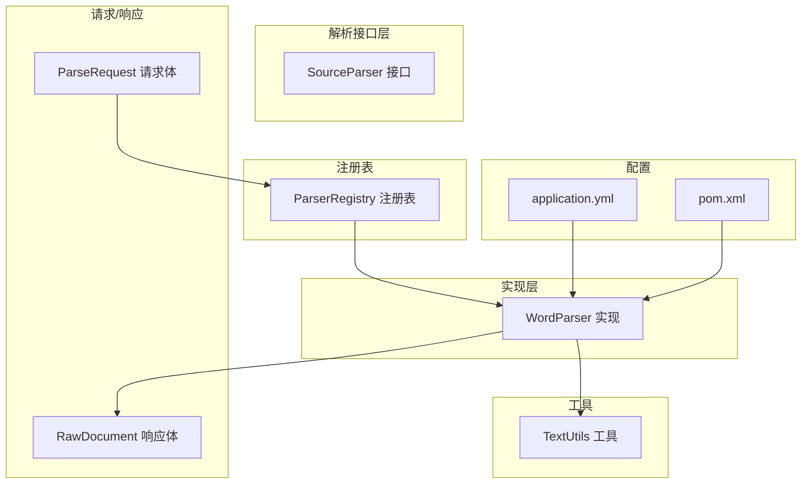
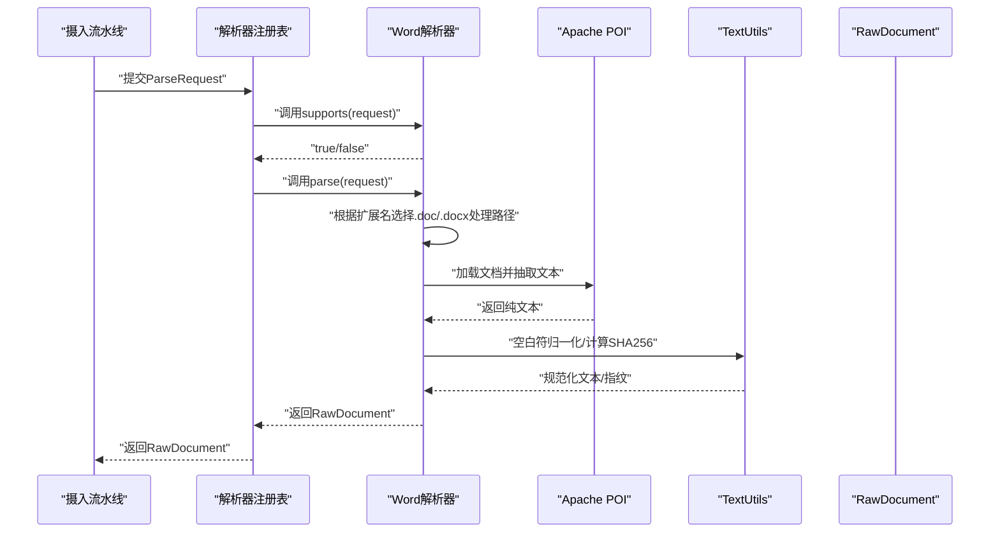
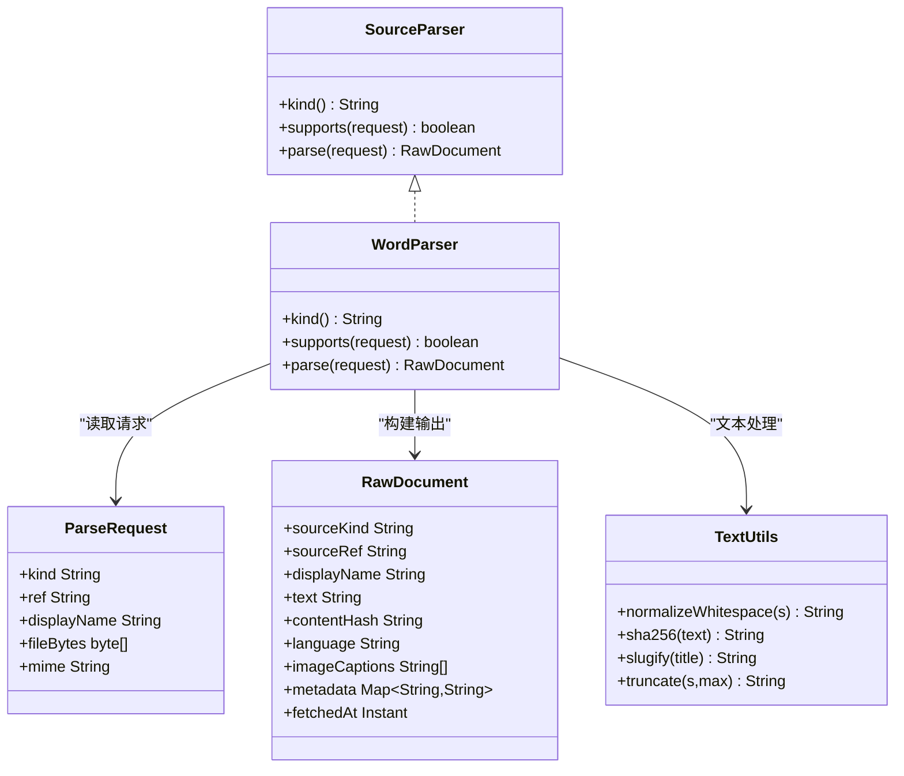
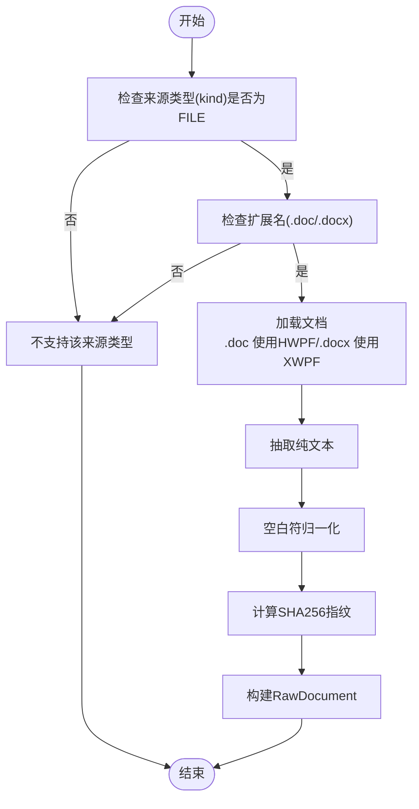
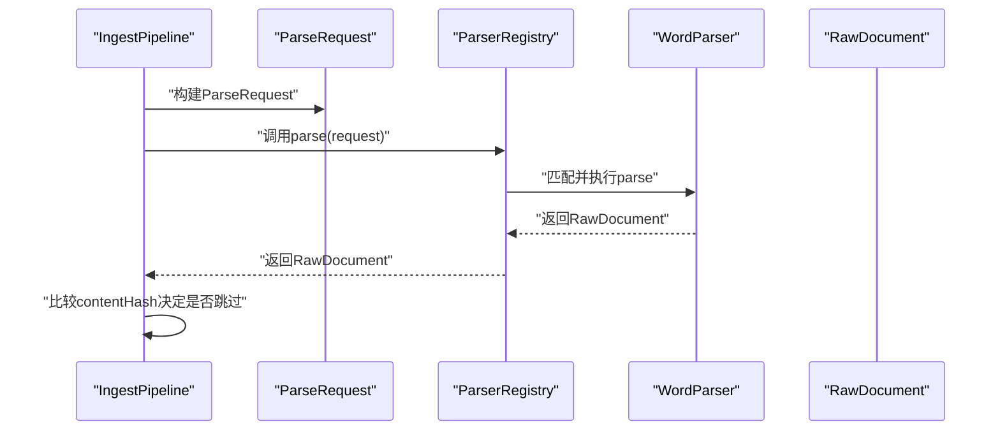
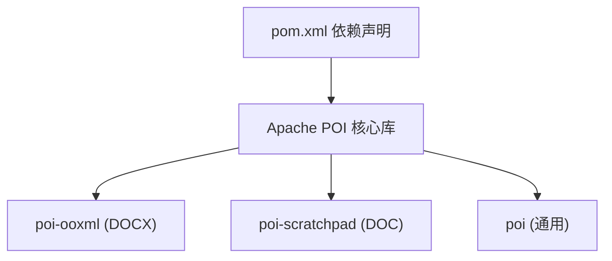

# Word文档解析器

<cite>
**本文引用的文件**
- [WordParser.java](file://src/main/java/com/example/llmwiki/parser/impl/WordParser.java)
- [SourceParser.java](file://src/main/java/com/example/llmwiki/parser/SourceParser.java)
- [ParseRequest.java](file://src/main/java/com/example/llmwiki/parser/ParseRequest.java)
- [RawDocument.java](file://src/main/java/com/example/llmwiki/domain/RawDocument.java)
- [ParserRegistry.java](file://src/main/java/com/example/llmwiki/parser/ParserRegistry.java)
- [ParserException.java](file://src/main/java/com/example/llmwiki/parser/ParserException.java)
- [TextUtils.java](file://src/main/java/com/example/llmwiki/util/TextUtils.java)
- [IngestPipeline.java](file://src/main/java/com/example/llmwiki/ingest/IngestPipeline.java)
- [application.yml](file://src/main/resources/application.yml)
- [pom.xml](file://pom.xml)
</cite>

## 目录
1. [简介](#简介)
2. [项目结构](#项目结构)
3. [核心组件](#核心组件)
4. [架构总览](#架构总览)
5. [详细组件分析](#详细组件分析)
6. [依赖分析](#依赖分析)
7. [性能考虑](#性能考虑)
8. [故障排查指南](#故障排查指南)
9. [结论](#结论)
10. [附录](#附录)

## 简介
本技术文档面向Word文档解析器，系统性阐述其在本项目中的实现与集成方式。解析器基于Apache POI库，支持DOC与DOCX两种格式，提供文件格式检测、文档加载、文本提取、规范化与内容指纹计算等能力，并通过统一的解析器接口接入到摄入流水线中，最终产出标准化的原始文档对象，供后续分析与生成阶段使用。

## 项目结构
Word解析器位于解析模块的实现层，遵循“统一接口 + 注册表匹配 + 统一输出”的设计模式：
- 接口层：定义SourceParser统一规范
- 实现层：WordParser具体实现
- 请求/响应模型：ParseRequest与RawDocument
- 注册表：ParserRegistry按顺序匹配并执行
- 工具类：TextUtils提供文本规范化与哈希
- 配置：application.yml与pom.xml提供运行时参数与依赖版本

**图表来源**
- [WordParser.java:27-66](file://src/main/java/com/example/llmwiki/parser/impl/WordParser.java#L27-L66)
- [SourceParser.java:11-21](file://src/main/java/com/example/llmwiki/parser/SourceParser.java#L11-L21)
- [ParseRequest.java:18-34](file://src/main/java/com/example/llmwiki/parser/ParseRequest.java#L18-L34)
- [RawDocument.java:20-51](file://src/main/java/com/example/llmwiki/domain/RawDocument.java#L20-L51)
- [ParserRegistry.java:27-35](file://src/main/java/com/example/llmwiki/parser/ParserRegistry.java#L27-L35)
- [TextUtils.java:15-80](file://src/main/java/com/example/llmwiki/util/TextUtils.java#L15-L80)
- [application.yml:58-84](file://src/main/resources/application/application.yml#L58-L84)
- [pom.xml:62-82](file://pom.xml#L62-L82)

**章节来源**
- [WordParser.java:27-66](file://src/main/java/com/example/llmwiki/parser/impl/WordParser.java#L27-L66)
- [SourceParser.java:11-21](file://src/main/java/com/example/llmwiki/parser/SourceParser.java#L11-L21)
- [ParseRequest.java:18-34](file://src/main/java/com/example/llmwiki/parser/ParseRequest.java#L18-L34)
- [RawDocument.java:20-51](file://src/main/java/com/example/llmwiki/domain/RawDocument.java#L20-L51)
- [ParserRegistry.java:27-35](file://src/main/java/com/example/llmwiki/parser/ParserRegistry.java#L27-L35)
- [TextUtils.java:15-80](file://src/main/java/com/example/llmwiki/util/TextUtils.java#L15-L80)
- [application.yml:58-84](file://src/main/resources/application.yml#L58-L84)
- [pom.xml:62-82](file://pom.xml#L62-L82)

## 核心组件
- WordParser：实现SourceParser接口，负责DOC/DOCX文件的格式识别与文本抽取，返回标准化的RawDocument。
- SourceParser：解析器统一接口，定义kind、supports与parse三个方法。
- ParseRequest：解析请求载体，封装来源类型、引用、显示名与文件字节等。
- RawDocument：标准化输出，包含来源信息、文本正文、内容指纹、元信息与抓取时间等。
- ParserRegistry：解析器注册表，按顺序遍历已注入的解析器并执行首个匹配者。
- TextUtils：提供SHA256哈希、空白符归一化、slug生成等工具方法。
- application.yml与pom.xml：提供运行时配置与POI依赖版本管理。

**章节来源**
- [WordParser.java:27-66](file://src/main/java/com/example/llmwiki/parser/impl/WordParser.java#L27-L66)
- [SourceParser.java:11-21](file://src/main/java/com/example/llmwiki/parser/SourceParser.java#L11-L21)
- [ParseRequest.java:18-34](file://src/main/java/com/example/llmwiki/parser/ParseRequest.java#L18-L34)
- [RawDocument.java:20-51](file://src/main/java/com/example/llmwiki/domain/RawDocument.java#L20-L51)
- [ParserRegistry.java:27-35](file://src/main/java/com/example/llmwiki/parser/ParserRegistry.java#L27-L35)
- [TextUtils.java:15-80](file://src/main/java/com/example/llmwiki/util/TextUtils.java#L15-L80)
- [application.yml:58-84](file://src/main/resources/application.yml#L58-L84)
- [pom.xml:62-82](file://pom.xml#L62-L82)

## 架构总览
Word解析器在摄入流水线中的位置如下：
- IngestPipeline接收任务后构造ParseRequest，交由ParserRegistry进行解析器匹配与执行；
- ParserRegistry遍历已注入的解析器，调用WordParser的supports与parse；
- WordParser根据文件扩展名判断格式，使用Apache POI加载文档并抽取文本；
- TextUtils对文本进行空白符归一化与SHA256指纹计算；
- 最终生成RawDocument，供后续分析与生成阶段使用。

**图表来源**
- [IngestPipeline.java:67-74](file://src/main/java/com/example/llmwiki/ingest/IngestPipeline.java#L67-L74)
- [ParserRegistry.java:27-35](file://src/main/java/com/example/llmwiki/parser/ParserRegistry.java#L27-L35)
- [WordParser.java:35-66](file://src/main/java/com/example/llmwiki/parser/impl/WordParser.java#L35-L66)
- [TextUtils.java:66-71](file://src/main/java/com/example/llmwiki/util/TextUtils.java#L66-L71)
- [RawDocument.java:20-51](file://src/main/java/com/example/llmwiki/domain/RawDocument.java#L20-L51)

## 详细组件分析

### WordParser组件
- 角色定位：实现SourceParser接口，专门处理FILE类型的DOC/DOCX文档。
- 支持判定：通过ParseRequest的kind与displayName/ref的扩展名判断是否支持。
- 文档加载与抽取：
  - DOCX：使用XWPFDocument与XWPFWordExtractor加载并抽取文本。
  - DOC：使用HWPFDocument与WordExtractor加载并抽取文本。
- 输出标准化：使用TextUtils进行空白符归一化与SHA256指纹计算，构建RawDocument。

**图表来源**
- [SourceParser.java:11-21](file://src/main/java/com/example/llmwiki/parser/SourceParser.java#L11-L21)
- [WordParser.java:27-66](file://src/main/java/com/example/llmwiki/parser/impl/WordParser.java#L27-L66)
- [ParseRequest.java:18-34](file://src/main/java/com/example/llmwiki/parser/ParseRequest.java#L18-L34)
- [RawDocument.java:20-51](file://src/main/java/com/example/llmwiki/domain/RawDocument.java#L20-L51)
- [TextUtils.java:15-80](file://src/main/java/com/example/llmwiki/util/TextUtils.java#L15-L80)

**章节来源**
- [WordParser.java:27-66](file://src/main/java/com/example/llmwiki/parser/impl/WordParser.java#L27-L66)
- [ParseRequest.java:18-34](file://src/main/java/com/example/llmwiki/parser/ParseRequest.java#L18-L34)
- [RawDocument.java:20-51](file://src/main/java/com/example/llmwiki/domain/RawDocument.java#L20-L51)
- [TextUtils.java:66-71](file://src/main/java/com/example/llmwiki/util/TextUtils.java#L66-L71)

### 解析流程与算法
- 文件格式检测：基于displayName/ref的扩展名判断是否为“.doc”或“.docx”。
- 文档加载：根据扩展名选择对应的POI文档类进行加载。
- 文本抽取：使用对应Extractor获取纯文本。
- 文本处理：空白符归一化，去除多余换行与多余空格。
- 内容指纹：对抽取文本计算SHA256，用于增量缓存判断。
- 结果封装：构建RawDocument并返回。

**图表来源**
- [WordParser.java:35-66](file://src/main/java/com/example/llmwiki/parser/impl/WordParser.java#L35-L66)
- [TextUtils.java:66-71](file://src/main/java/com/example/llmwiki/util/TextUtils.java#L66-L71)
- [RawDocument.java:20-51](file://src/main/java/com/example/llmwiki/domain/RawDocument.java#L20-L51)

**章节来源**
- [WordParser.java:35-66](file://src/main/java/com/example/llmwiki/parser/impl/WordParser.java#L35-L66)
- [TextUtils.java:66-71](file://src/main/java/com/example/llmwiki/util/TextUtils.java#L66-L71)
- [RawDocument.java:20-51](file://src/main/java/com/example/llmwiki/domain/RawDocument.java#L20-L51)

### 与摄入流水线的集成
- IngestPipeline在执行阶段构造ParseRequest并调用ParserRegistry.parse；
- 若解析器返回的RawDocument与历史内容指纹一致，则直接跳过后续步骤；
- 否则进入分析、生成、索引与图谱更新流程。

**图表来源**
- [IngestPipeline.java:67-109](file://src/main/java/com/example/llmwiki/ingest/IngestPipeline.java#L67-L109)
- [ParserRegistry.java:27-35](file://src/main/java/com/example/llmwiki/parser/ParserRegistry.java#L27-L35)
- [WordParser.java:44-66](file://src/main/java/com/example/llmwiki/parser/impl/WordParser.java#L44-L66)

**章节来源**
- [IngestPipeline.java:67-109](file://src/main/java/com/example/llmwiki/ingest/IngestPipeline.java#L67-L109)
- [ParserRegistry.java:27-35](file://src/main/java/com/example/llmwiki/parser/ParserRegistry.java#L27-L35)
- [WordParser.java:44-66](file://src/main/java/com/example/llmwiki/parser/impl/WordParser.java#L44-L66)

## 依赖分析
- Apache POI依赖：poi、poi-ooxml、poi-scratchpad分别对应二进制DOC、OOXML DOCX与部分旧版功能支持。
- 版本管理：在pom.xml中集中声明POI版本，确保兼容性与一致性。
- 运行时日志级别：application.yml中对org.apache.poi设置WARN级别，减少解析过程中的噪声日志。

**图表来源**
- [pom.xml:62-82](file://pom.xml#L62-L82)

**章节来源**
- [pom.xml:62-82](file://pom.xml#L62-L82)
- [application.yml:82-84](file://src/main/resources/application.yml#L82-L84)

## 性能考虑
- 大文档处理建议
  - 当前实现一次性加载并抽取文本，适合中小文档；对于超大文档，建议采用分块读取与流式处理策略，避免单次内存峰值过高。
  - 可结合应用层面的分片策略（例如按段落或页面分批处理）降低内存占用。
- 内存优化
  - 使用try-with-resources确保POI资源及时释放，避免句柄泄漏。
  - 文本处理阶段尽量避免重复拷贝，优先使用StringBuilder等可变容器。
- 缓存策略
  - 利用RawDocument.contentHash进行增量缓存，避免重复解析相同内容。
  - 在入库与索引阶段，可结合业务场景引入LRU或基于时间的缓存以减少重复计算。
- 并发与超时
  - 当前配置中未见针对Word解析器的显式并发与超时设置；可在应用层面通过线程池与超时控制提升吞吐与稳定性。
  - 建议在任务调度与执行层面对解析阶段增加超时保护，防止长时间阻塞。

[本节为通用性能指导，不直接分析特定文件，故无章节来源]

## 故障排查指南
- 不支持的格式
  - 症状：WordParser的supports返回false，ParserRegistry抛出“找不到匹配的解析器”异常。
  - 排查：确认ParseRequest.kind为FILE且displayName/ref包含“.doc”或“.docx”扩展名。
- 损坏或不受支持的文档
  - 症状：POI加载文档时抛出异常。
  - 排查：检查文件字节是否完整、编码是否正确；必要时在上层捕获异常并降级处理。
- 内存不足
  - 症状：解析超大文档时出现内存溢出。
  - 排查：拆分文档、限制并发、增加JVM堆内存；在代码中确保资源及时关闭。
- 增量缓存未生效
  - 症状：contentHash未变化导致跳过后续步骤。
  - 排查：确认文本归一化与哈希计算逻辑一致，避免无关差异影响指纹。

**章节来源**
- [ParserRegistry.java:34](file://src/main/java/com/example/llmwiki/parser/ParserRegistry.java#L34)
- [ParserException.java:9-18](file://src/main/java/com/example/llmwiki/parser/ParserException.java#L9-L18)
- [WordParser.java:44-66](file://src/main/java/com/example/llmwiki/parser/impl/WordParser.java#L44-L66)
- [IngestPipeline.java:77-80](file://src/main/java/com/example/llmwiki/ingest/IngestPipeline.java#L77-L80)

## 结论
本Word文档解析器通过简洁的接口与实现，结合Apache POI对DOC/DOCX格式的良好支持，实现了从文件到标准化文本的高效转换。配合统一的解析器注册表与摄入流水线，能够稳定地融入整体知识库构建流程。未来可在大文档分块处理、并发控制与超时保护等方面进一步优化，以提升稳定性与吞吐能力。

## 附录

### 配置项与参数
- 应用配置（application.yml）
  - 文件上传大小限制：max-file-size与max-request-size
  - 日志级别：对org.apache.poi设置为WARN
- 解析器配置（ParserProperties）
  - 当前未提供针对Word解析器的专用配置项，若需扩展可新增相应字段与默认值。

**章节来源**
- [application.yml:8-10](file://src/main/resources/application.yml#L8-L10)
- [application.yml:82-84](file://src/main/resources/application.yml#L82-L84)
- [ParserProperties.java:16-45](file://src/main/java/com/example/llmwiki/config/ParserProperties.java#L16-L45)

### 依赖版本与范围
- POI版本在pom.xml中集中声明，确保poi、poi-ooxml与poi-scratchpad版本一致，避免兼容性问题。

**章节来源**
- [pom.xml:33](file://pom.xml#L33)