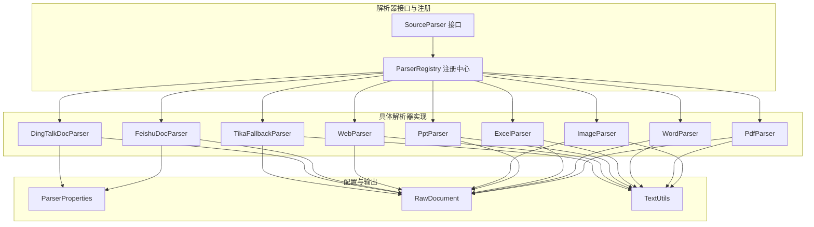
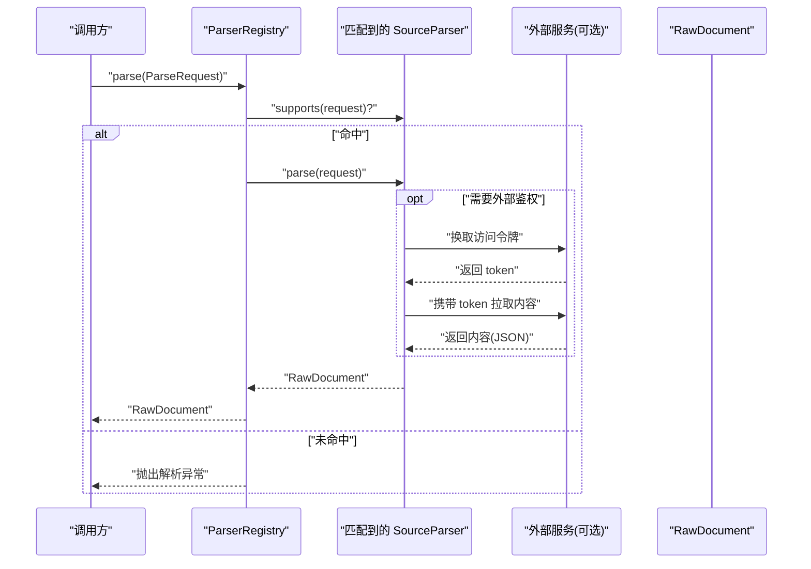
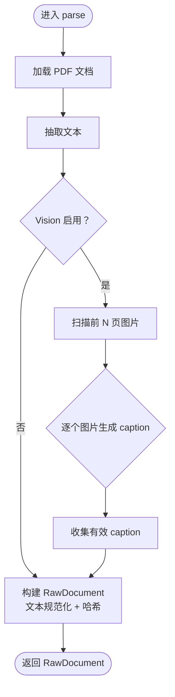
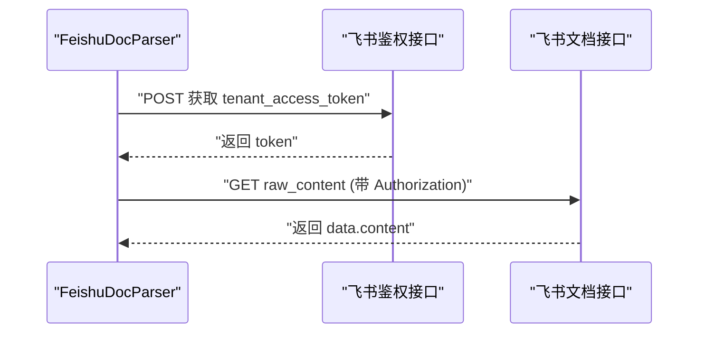
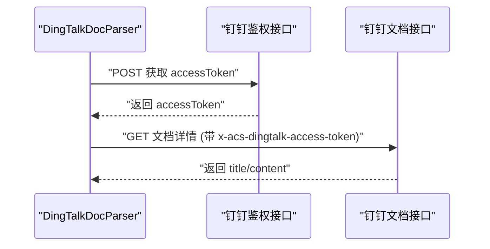
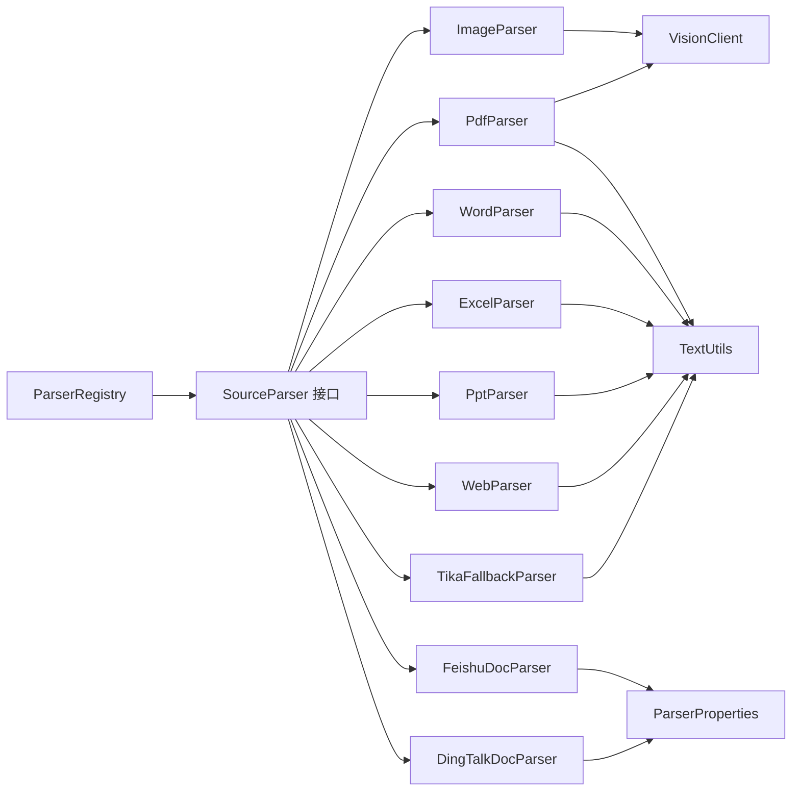

# 具体文档解析器实现

<cite>
**本文引用的文件**
- [PdfParser.java](file://src/main/java/com/example/llmwiki/parser/impl/PdfParser.java)
- [WordParser.java](file://src/main/java/com/example/llmwiki/parser/impl/WordParser.java)
- [ExcelParser.java](file://src/main/java/com/example/llmwiki/parser/impl/ExcelParser.java)
- [PptParser.java](file://src/main/java/com/example/llmwiki/parser/impl/PptParser.java)
- [ImageParser.java](file://src/main/java/com/example/llmwiki/parser/impl/ImageParser.java)
- [WebParser.java](file://src/main/java/com/example/llmwiki/parser/impl/WebParser.java)
- [FeishuDocParser.java](file://src/main/java/com/example/llmwiki/parser/impl/FeishuDocParser.java)
- [DingTalkDocParser.java](file://src/main/java/com/example/llmwiki/parser/impl/DingTalkDocParser.java)
- [TikaFallbackParser.java](file://src/main/java/com/example/llmwiki/parser/impl/TikaFallbackParser.java)
- [SourceParser.java](file://src/main/java/com/example/llmwiki/parser/SourceParser.java)
- [ParseRequest.java](file://src/main/java/com/example/llmwiki/parser/ParseRequest.java)
- [ParserRegistry.java](file://src/main/java/com/example/llmwiki/parser/ParserRegistry.java)
- [ParserException.java](file://src/main/java/com/example/llmwiki/parser/ParserException.java)
- [ParserProperties.java](file://src/main/java/com/example/llmwiki/config/ParserProperties.java)
- [RawDocument.java](file://src/main/java/com/example/llmwiki/domain/RawDocument.java)
- [TextUtils.java](file://src/main/java/com/example/llmwiki/util/TextUtils.java)
- [application.yml](file://src/main/resources/application.yml)
</cite>

## 目录
1. [简介](#简介)
2. [项目结构](#项目结构)
3. [核心组件](#核心组件)
4. [架构总览](#架构总览)
5. [详细组件分析](#详细组件分析)
6. [依赖分析](#依赖分析)
7. [性能考虑](#性能考虑)
8. [故障排查指南](#故障排查指南)
9. [结论](#结论)
10. [附录](#附录)

## 简介
本文件面向 LLM Wiki 的“具体文档解析器实现”，系统性梳理并说明各类解析器的职责、实现细节、特殊处理逻辑、配置参数、性能优化策略以及错误处理与异常恢复机制。解析器体系以统一接口 SourceParser 为核心，通过 ParserRegistry 按优先级顺序匹配并执行解析，最终产出标准化的 RawDocument 结构，供后续摄入与检索流程使用。

## 项目结构
解析器相关代码集中在 parser 包下，采用“按功能分包 + 按类型分实现”的组织方式：
- 接口层：SourceParser 定义统一解析协议
- 请求封装：ParseRequest 封装 FILE/URL/FEISHU/DINGTALK 的输入
- 注册中心：ParserRegistry 负责按顺序选择首个支持的解析器
- 实现层：各格式解析器（PDF/Word/Excel/PPT/图片/网页/飞书/钉钉/Tika 回退）
- 配置层：ParserProperties 提供飞书/钉钉/OCR 配置项
- 输出层：RawDocument 标准化输出结构
- 工具层：TextUtils 提供规范化与哈希计算

图表来源
- [SourceParser.java:1-22](file://src/main/java/com/example/llmwiki/parser/SourceParser.java#L1-L22)
- [ParserRegistry.java:1-37](file://src/main/java/com/example/llmwiki/parser/ParserRegistry.java#L1-L37)
- [PdfParser.java:1-113](file://src/main/java/com/example/llmwiki/parser/impl/PdfParser.java#L1-L113)
- [WordParser.java:1-67](file://src/main/java/com/example/llmwiki/parser/impl/WordParser.java#L1-L67)
- [ExcelParser.java:1-79](file://src/main/java/com/example/llmwiki/parser/impl/ExcelParser.java#L1-L79)
- [PptParser.java:1-83](file://src/main/java/com/example/llmwiki/parser/impl/PptParser.java#L1-L83)
- [ImageParser.java:1-71](file://src/main/java/com/example/llmwiki/parser/impl/ImageParser.java#L1-L71)
- [WebParser.java:1-70](file://src/main/java/com/example/llmwiki/parser/impl/WebParser.java#L1-L70)
- [FeishuDocParser.java:1-101](file://src/main/java/com/example/llmwiki/parser/impl/FeishuDocParser.java#L1-L101)
- [DingTalkDocParser.java:1-101](file://src/main/java/com/example/llmwiki/parser/impl/DingTalkDocParser.java#L1-L101)
- [TikaFallbackParser.java:1-49](file://src/main/java/com/example/llmwiki/parser/impl/TikaFallbackParser.java#L1-L49)
- [ParserProperties.java:1-46](file://src/main/java/com/example/llmwiki/config/ParserProperties.java#L1-L46)
- [RawDocument.java:1-52](file://src/main/java/com/example/llmwiki/domain/RawDocument.java#L1-L52)
- [TextUtils.java:1-80](file://src/main/java/com/example/llmwiki/util/TextUtils.java#L1-L80)

章节来源
- [SourceParser.java:1-22](file://src/main/java/com/example/llmwiki/parser/SourceParser.java#L1-L22)
- [ParserRegistry.java:1-37](file://src/main/java/com/example/llmwiki/parser/ParserRegistry.java#L1-L37)
- [ParseRequest.java:1-35](file://src/main/java/com/example/llmwiki/parser/ParseRequest.java#L1-L35)
- [ParserProperties.java:1-46](file://src/main/java/com/example/llmwiki/config/ParserProperties.java#L1-L46)
- [RawDocument.java:1-52](file://src/main/java/com/example/llmwiki/domain/RawDocument.java#L1-L52)
- [TextUtils.java:1-80](file://src/main/java/com/example/llmwiki/util/TextUtils.java#L1-L80)

## 核心组件
- SourceParser：定义 kind()/supports()/parse() 三要素，统一多源解析协议
- ParserRegistry：遍历已注入的解析器，按顺序选择首个 supports(request) 的实现
- ParseRequest：统一封装 FILE/URL/FEISHU/DINGTALK 的输入参数
- ParserProperties：集中管理飞书/钉钉/OCR 的开关与凭据
- RawDocument：标准化输出，包含文本、哈希、图像描述、元信息等
- TextUtils：提供规范化空白、SHA256 哈希、slug 化等工具方法

章节来源
- [SourceParser.java:1-22](file://src/main/java/com/example/llmwiki/parser/SourceParser.java#L1-L22)
- [ParserRegistry.java:1-37](file://src/main/java/com/example/llmwiki/parser/ParserRegistry.java#L1-L37)
- [ParseRequest.java:1-35](file://src/main/java/com/example/llmwiki/parser/ParseRequest.java#L1-L35)
- [ParserProperties.java:1-46](file://src/main/java/com/example/llmwiki/config/ParserProperties.java#L1-L46)
- [RawDocument.java:1-52](file://src/main/java/com/example/llmwiki/domain/RawDocument.java#L1-L52)
- [TextUtils.java:1-80](file://src/main/java/com/example/llmwiki/util/TextUtils.java#L1-L80)

## 架构总览
解析器工作流从 ParserRegistry 开始，依据 ParseRequest 的 kind/ref/displayName 等字段，依次调用各解析器的 supports 判断是否匹配，一旦命中即执行 parse 并返回 RawDocument。对于外部 API 解析器（飞书/钉钉），会先向各自鉴权服务换取访问令牌，再拉取目标内容。

图表来源
- [ParserRegistry.java:27-35](file://src/main/java/com/example/llmwiki/parser/ParserRegistry.java#L27-L35)
- [FeishuDocParser.java:52-82](file://src/main/java/com/example/llmwiki/parser/impl/FeishuDocParser.java#L52-L82)
- [DingTalkDocParser.java:51-82](file://src/main/java/com/example/llmwiki/parser/impl/DingTalkDocParser.java#L51-L82)
- [RawDocument.java:18-51](file://src/main/java/com/example/llmwiki/domain/RawDocument.java#L18-L51)

## 详细组件分析

### PDF 解析器（PdfParser）
- 职责与能力
  - 使用 Apache PDFBox 从 PDF 中抽取纯文本
  - 可选地对嵌入图片进行 OCR 或视觉理解（Vision LLM），生成图片 caption
  - 支持的来源：kind=FILE 且文件名为 .pdf
- 特殊处理逻辑
  - 文件格式检测：通过文件名后缀判断
  - 图片识别：遍历前若干页（默认最多 20 页）的资源对象，提取图片并调用 VisionClient 生成 caption
  - 编码处理：通过 PDFTextStripper 获取文本，随后交由 TextUtils 规范化空白
  - 内容去重：使用 contentHash（文本 + 图片 caption 拼接后的 SHA256）作为指纹
- 性能与限制
  - 限制扫描页数以控制成本（最多 20 页）
  - 图片转 PNG 并调用 Vision LLM，存在额外开销
- 错误处理
  - 图片 caption 失败时记录 debug 日志并继续
  - 提取图片失败时记录 warn 日志并继续

图表来源
- [PdfParser.java:56-77](file://src/main/java/com/example/llmwiki/parser/impl/PdfParser.java#L56-L77)
- [PdfParser.java:79-111](file://src/main/java/com/example/llmwiki/parser/impl/PdfParser.java#L79-L111)
- [TextUtils.java:66-71](file://src/main/java/com/example/llmwiki/util/TextUtils.java#L66-L71)

章节来源
- [PdfParser.java:1-113](file://src/main/java/com/example/llmwiki/parser/impl/PdfParser.java#L1-L113)
- [TextUtils.java:1-80](file://src/main/java/com/example/llmwiki/util/TextUtils.java#L1-L80)

### Word 解析器（WordParser）
- 职责与能力
  - 支持 .doc 与 .docx 两种格式
  - 使用 Apache POI 的对应提取器读取文本
  - 支持的来源：kind=FILE 且文件名为 .doc/.docx
- 特殊处理逻辑
  - 文件格式检测：通过文件名后缀判断
  - 文本规范化：交由 TextUtils.normalizeWhitespace 规范化空白
  - 内容去重：使用文本 SHA256 作为 contentHash
- 性能与限制
  - 采用流式读取与 try-with-resources，避免内存泄漏
- 错误处理
  - 未见显式异常捕获，遵循调用方兜底

章节来源
- [WordParser.java:1-67](file://src/main/java/com/example/llmwiki/parser/impl/WordParser.java#L1-L67)
- [TextUtils.java:66-71](file://src/main/java/com/example/llmwiki/util/TextUtils.java#L66-L71)

### Excel 解析器（ExcelParser）
- 职责与能力
  - 支持 .xls 与 .xlsx，按 sheet/行/列展开为 Markdown 表格
  - 支持的来源：kind=FILE 且文件名为 .xls/.xlsx
- 特殊处理逻辑
  - 文件格式检测：通过文件名后缀判断
  - 数据格式化：使用 DataFormatter 格式化单元格值，转义管道符
  - 行数限制：单表最多处理 2000 行，避免超大数据集导致内存压力
  - 文本规范化：交由 TextUtils.normalizeWhitespace 规范化空白
  - 内容去重：使用文本 SHA256 作为 contentHash
- 性致与限制
  - 行数上限控制，防止大表内存溢出
- 错误处理
  - 未见显式异常捕获，遵循调用方兜底

章节来源
- [ExcelParser.java:1-79](file://src/main/java/com/example/llmwiki/parser/impl/ExcelParser.java#L1-L79)
- [TextUtils.java:66-71](file://src/main/java/com/example/llmwiki/util/TextUtils.java#L66-L71)

### PPT 解析器（PptParser）
- 职责与能力
  - 支持 .ppt 与 .pptx，抽取幻灯片中的文本内容
  - 支持的来源：kind=FILE 且文件名为 .ppt/.pptx
- 特殊处理逻辑
  - 文件格式检测：通过文件名后缀判断
  - 文本抽取：遍历幻灯片与形状，拼接文本内容
  - 文本规范化：交由 TextUtils.normalizeWhitespace 规范化空白
  - 内容去重：使用文本 SHA256 作为 contentHash
- 性能与限制
  - 未见显式行数/页数限制，建议在上游控制文件大小
- 错误处理
  - 未见显式异常捕获，遵循调用方兜底

章节来源
- [PptParser.java:1-83](file://src/main/java/com/example/llmwiki/parser/impl/PptParser.java#L1-L83)
- [TextUtils.java:66-71](file://src/main/java/com/example/llmwiki/util/TextUtils.java#L66-L71)

### 图片解析器（ImageParser）
- 职责与能力
  - 支持常见图片格式（PNG/JPG/JPEG/WEBP/BMP/GIF）
  - 若启用 Vision，则调用 VisionClient 生成 caption；否则仅记录元信息
  - 支持的来源：kind=FILE 且文件名为上述图片后缀之一
- 特殊处理逻辑
  - 文件格式检测：通过后缀列表判断
  - OCR/Vision 选择：根据 VisionClient 是否启用决定行为
  - 文本构造：启用 Vision 时拼接 caption，未启用时仅记录文件名
  - 内容去重：使用文本 SHA256 作为 contentHash
- 性能与限制
  - 仅做元信息或简单 caption，避免复杂 OCR 开销
- 错误处理
  - 未启用 Vision 时记录 info 日志提示

章节来源
- [ImageParser.java:1-71](file://src/main/java/com/example/llmwiki/parser/impl/ImageParser.java#L1-L71)

### 网页解析器（WebParser）
- 职责与能力
  - 抓取 URL 的 HTML，使用 Jsoup 连接并设置超时，再用 Readability4J 抽取主体内容
  - 支持的来源：kind=URL
- 特殊处理逻辑
  - 链接解析：使用 Jsoup 连接指定 URL，设置 User-Agent、超时、重定向
  - 主体抽取：优先使用 Readability4J 的文章主体，否则回退到页面 body 文本
  - 标题与正文：标题为空时回退到页面 title，正文为空时回退到 body.text
  - 元信息：记录 url 与 title
  - 文本规范化：交由 TextUtils.normalizeWhitespace 规范化空白
  - 内容去重：使用文本 SHA256 作为 contentHash
- 性能与限制
  - 默认超时 20 秒，可根据网络环境调整
- 错误处理
  - 未见显式异常捕获，遵循调用方兜底

章节来源
- [WebParser.java:1-70](file://src/main/java/com/example/llmwiki/parser/impl/WebParser.java#L1-L70)
- [TextUtils.java:66-71](file://src/main/java/com/example/llmwiki/util/TextUtils.java#L66-L71)

### 飞书文档解析器（FeishuDocParser）
- 职责与能力
  - 通过飞书 OpenAPI v1 拉取文档 raw_content
  - 需在配置中启用并填写 app_id/app_secret
  - 支持的来源：kind=FEISHU
- 特殊处理逻辑
  - 配置校验：检查 enabled 与 app_id 是否有效
  - 鉴权流程：POST 获取 tenant_access_token，再以 Bearer 方式请求文档 raw_content
  - 内容处理：读取 data.content，交由 TextUtils.normalizeWhitespace 规范化空白
  - 内容去重：使用文本 SHA256 作为 contentHash
- 性能与限制
  - 依赖外部 API，受网络与第三方限流影响
- 错误处理
  - 未启用或配置缺失时抛 ParserException
  - 获取 token 或拉取文档失败时抛 ParserException

图表来源
- [FeishuDocParser.java:52-82](file://src/main/java/com/example/llmwiki/parser/impl/FeishuDocParser.java#L52-L82)
- [ParserProperties.java:18-27](file://src/main/java/com/example/llmwiki/config/ParserProperties.java#L18-L27)

章节来源
- [FeishuDocParser.java:1-101](file://src/main/java/com/example/llmwiki/parser/impl/FeishuDocParser.java#L1-L101)
- [ParserProperties.java:1-46](file://src/main/java/com/example/llmwiki/config/ParserProperties.java#L1-L46)

### 钉钉文档解析器（DingTalkDocParser）
- 职责与能力
  - 通过钉钉 OpenAPI 拉取文档内容
  - 需在配置中启用并填写 app_key/app_secret
  - 支持的来源：kind=DINGTALK
- 特殊处理逻辑
  - 配置校验：检查 enabled 与 app_key 是否有效
  - 鉴权流程：POST 获取 accessToken，再以 x-acs-dingtalk-access-token 请求文档详情
  - 内容处理：读取 title 与 content，拼接为 Markdown 标题 + 正文，交由 TextUtils.normalizeWhitespace 规范化空白
  - 内容去重：使用文本 SHA256 作为 contentHash
- 性能与限制
  - 依赖外部 API，受网络与第三方限流影响
- 错误处理
  - 未启用或配置缺失时抛 ParserException
  - 获取 token 或拉取文档失败时抛 ParserException

图表来源
- [DingTalkDocParser.java:51-82](file://src/main/java/com/example/llmwiki/parser/impl/DingTalkDocParser.java#L51-L82)
- [ParserProperties.java:29-34](file://src/main/java/com/example/llmwiki/config/ParserProperties.java#L29-L34)

章节来源
- [DingTalkDocParser.java:1-101](file://src/main/java/com/example/llmwiki/parser/impl/DingTalkDocParser.java#L1-L101)
- [ParserProperties.java:1-46](file://src/main/java/com/example/llmwiki/config/ParserProperties.java#L1-L46)

### Tika 回退解析器（TikaFallbackParser）
- 职责与能力
  - 作为兜底解析器，使用 Apache Tika 处理多种文本类格式（txt/md/html/csv 等）
  - 支持的来源：kind=FILE
- 特殊处理逻辑
  - 文件格式检测：对所有 FILE 类型生效（优先级最低）
  - 文本抽取：直接使用 Tika.parseToString
  - 文本规范化：交由 TextUtils.normalizeWhitespace 规范化空白
  - 内容去重：使用文本 SHA256 作为 contentHash
- 性能与限制
  - 作为兜底，不针对特定格式优化
- 错误处理
  - 未见显式异常捕获，遵循调用方兜底

章节来源
- [TikaFallbackParser.java:1-49](file://src/main/java/com/example/llmwiki/parser/impl/TikaFallbackParser.java#L1-L49)
- [TextUtils.java:66-71](file://src/main/java/com/example/llmwiki/util/TextUtils.java#L66-L71)

## 依赖分析
- 组件耦合
  - ParserRegistry 与各 SourceParser 通过 Spring 自动注入形成松耦合
  - 外部 API 解析器（飞书/钉钉）依赖 ParserProperties 与共享 RestClient
  - 图像解析器依赖 VisionClient（可禁用）
  - 所有解析器均依赖 TextUtils 进行文本规范化与哈希
- 依赖关系可视化

图表来源
- [ParserRegistry.java:21-22](file://src/main/java/com/example/llmwiki/parser/ParserRegistry.java#L21-L22)
- [FeishuDocParser.java:38-39](file://src/main/java/com/example/llmwiki/parser/impl/FeishuDocParser.java#L38-L39)
- [DingTalkDocParser.java:37-39](file://src/main/java/com/example/llmwiki/parser/impl/DingTalkDocParser.java#L37-L39)
- [ImageParser.java](file://src/main/java/com/example/llmwiki/parser/impl/ImageParser.java#L31)
- [PdfParser.java](file://src/main/java/com/example/llmwiki/parser/impl/PdfParser.java#L40)
- [TextUtils.java:1-80](file://src/main/java/com/example/llmwiki/util/TextUtils.java#L1-L80)

章节来源
- [ParserRegistry.java:1-37](file://src/main/java/com/example/llmwiki/parser/ParserRegistry.java#L1-L37)
- [ParserProperties.java:1-46](file://src/main/java/com/example/llmwiki/config/ParserProperties.java#L1-L46)

## 性能考虑
- 大文件与大数据处理
  - PDF：限制扫描页数（默认最多 20 页），避免图片 OCR 成本过高
  - Excel：限制单表行数（最多 2000 行），防止内存溢出
  - PPT：未设置行/页数限制，建议在上游控制文件规模
- 内存管理
  - 所有解析器均使用 try-with-resources 管理流资源，避免内存泄漏
  - 图片解析器仅在启用 Vision 时进行图片转码与调用，减少不必要的 IO
- 并发与吞吐
  - application.yml 中配置了摄取线程数（worker-threads），可在系统资源允许时提升吞吐
  - 建议将外部 API 解析器（飞书/钉钉）与图片解析器的 Vision 调用置于独立线程池或异步队列，避免阻塞主摄取线程
- 缓存与去重
  - 使用 contentHash（SHA256）作为内容指纹，便于增量缓存与去重
- 超时与重试
  - 网页解析器默认超时 20 秒；外部 API 解析器依赖底层 RestClient 的默认超时策略
  - application.yml 中配置了摄取最大重试次数（max-retry），可用于失败场景的自动重试

章节来源
- [PdfParser.java:84-84](file://src/main/java/com/example/llmwiki/parser/impl/PdfParser.java#L84-L84)
- [ExcelParser.java:53-53](file://src/main/java/com/example/llmwiki/parser/impl/ExcelParser.java#L53-L53)
- [WebParser.java:42-46](file://src/main/java/com/example/llmwiki/parser/impl/WebParser.java#L42-L46)
- [application.yml:75-76](file://src/main/resources/application.yml#L75-L76)

## 故障排查指南
- 常见解析错误
  - 找不到匹配的解析器：当 ParseRequest.kind/ref 不满足任何解析器的 supports 条件时抛出异常
  - 飞书/钉钉未启用或未配置：解析器会抛出 ParserException，提示缺少 app_id/app_key 或未启用
  - 外部 API 返回异常：如 token 获取失败、文档内容为空或返回结构异常
  - 图片 caption 失败：PDF 图片提取或 Vision 调用失败时记录 debug/warn 日志并跳过
- 降级策略
  - 图片解析器：未启用 Vision 时仅记录元信息，避免因外部服务不可用导致失败
  - Tika 回退解析器：在未被更具体解析器覆盖时自动生效
- 日志记录
  - 解析器注册中心会在命中解析器时打印日志，便于追踪
  - PDF 图片提取与 caption 失败时分别记录 debug/warn 日志
  - 图片解析器在未启用 Vision 时记录 info 日志
- 排查步骤
  - 确认 ParseRequest.kind/ref/displayName 是否正确
  - 检查 ParserProperties 中对应平台的 enabled 与凭据是否完整
  - 查看应用日志级别与外部依赖日志级别（如 PDFBox/POI）

章节来源
- [ParserRegistry.java:27-35](file://src/main/java/com/example/llmwiki/parser/ParserRegistry.java#L27-L35)
- [FeishuDocParser.java:55-58](file://src/main/java/com/example/llmwiki/parser/impl/FeishuDocParser.java#L55-L58)
- [DingTalkDocParser.java:54-57](file://src/main/java/com/example/llmwiki/parser/impl/DingTalkDocParser.java#L54-L57)
- [PdfParser.java:101-109](file://src/main/java/com/example/llmwiki/parser/impl/PdfParser.java#L101-L109)
- [ImageParser.java:59-59](file://src/main/java/com/example/llmwiki/parser/impl/ImageParser.java#L59-L59)
- [application.yml:82-83](file://src/main/resources/application.yml#L82-L83)

## 结论
本解析器体系以统一接口与注册机制为核心，结合各格式的特殊处理逻辑，实现了对 PDF/Word/Excel/PPT/图片/网页及两类云文档平台的全面覆盖。通过规范化文本、生成内容指纹、提供回退解析器与严格的资源管理，系统在保证稳定性的同时兼顾性能与可扩展性。建议在生产环境中配合合理的超时/重试/并发与缓存策略，确保大规模文档摄取的可靠性与效率。

## 附录
- 配置参数清单（来自 application.yml 与 ParserProperties）
  - 飞书配置：enabled、app-id、app-secret
  - 钉钉配置：enabled、app-key、app-secret
  - OCR 配置：enabled、data-path、lang
  - LLM 配置：chat/embedding/vision 的基础地址、模型、超时等
  - 摄取配置：max-retry、worker-threads
  - 上传限制：multipart.max-file-size/max-request-size
- 输出结构字段说明（RawDocument）
  - sourceKind/sourceRef/displayName：来源类型/标识/显示名
  - text：标准化后的文本
  - contentHash：文本 SHA256 指纹
  - language：文档语言
  - imageCaptions：图像描述列表
  - metadata：元信息（如网页的 url/title）
  - fetchedAt：抓取时间戳

章节来源
- [ParserProperties.java:1-46](file://src/main/java/com/example/llmwiki/config/ParserProperties.java#L1-L46)
- [application.yml:58-76](file://src/main/resources/application.yml#L58-L76)
- [RawDocument.java:18-51](file://src/main/java/com/example/llmwiki/domain/RawDocument.java#L18-L51)