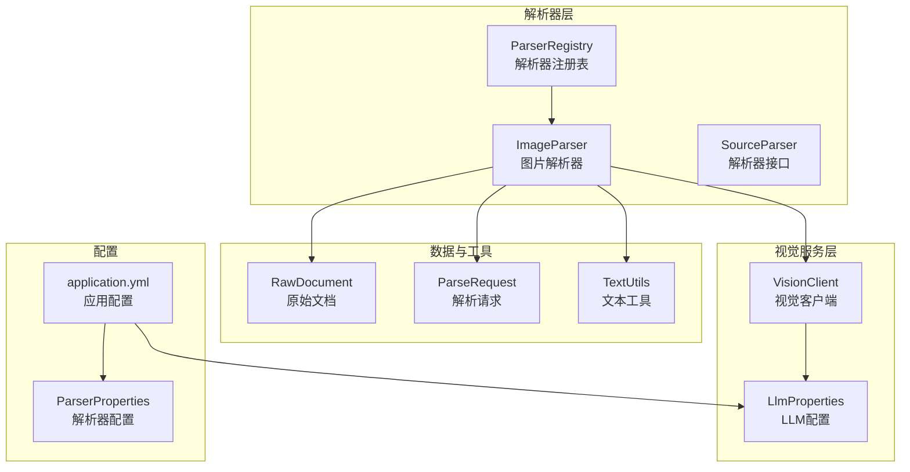
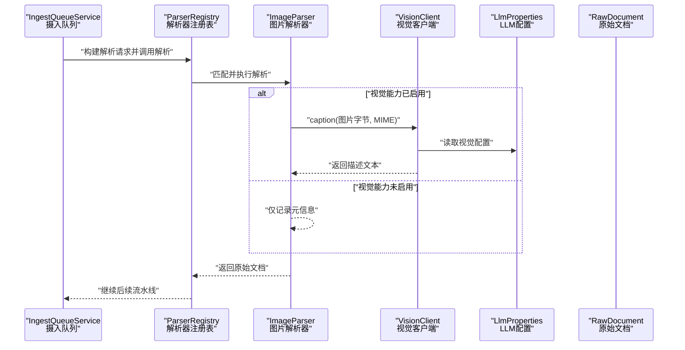
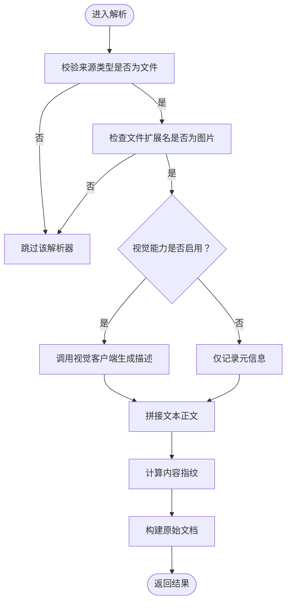
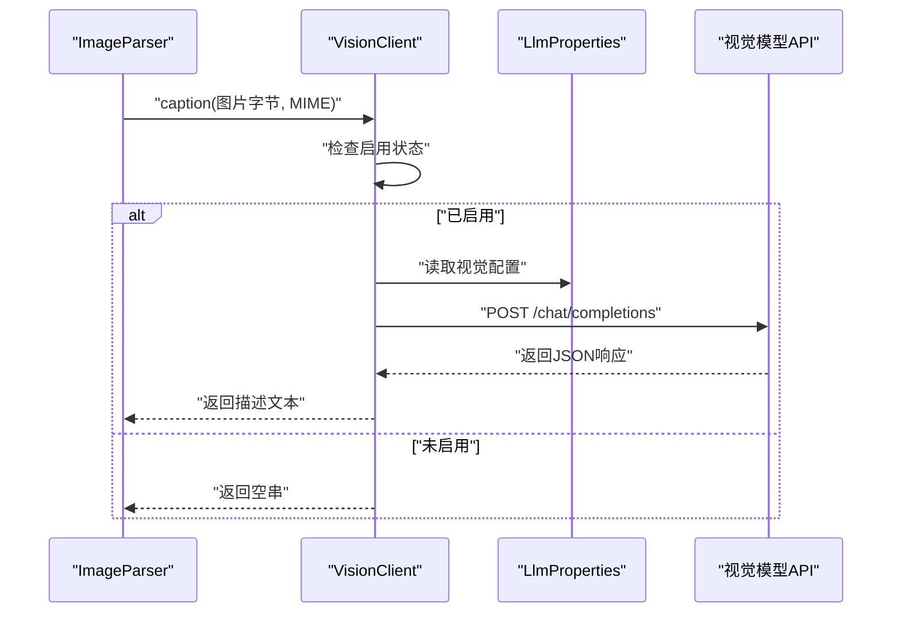
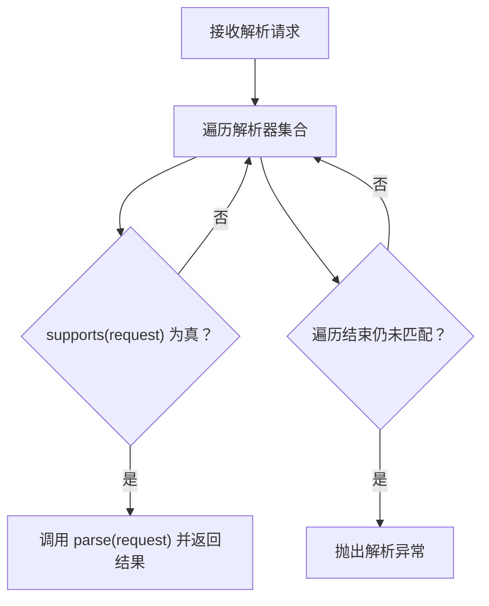
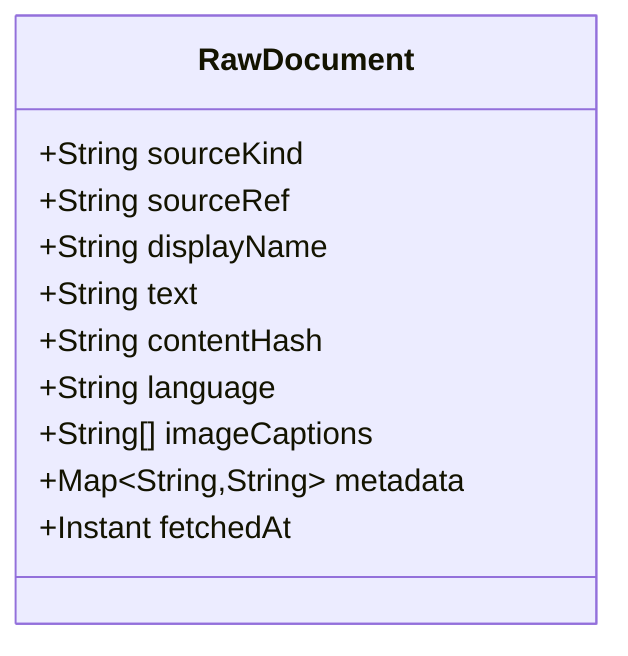
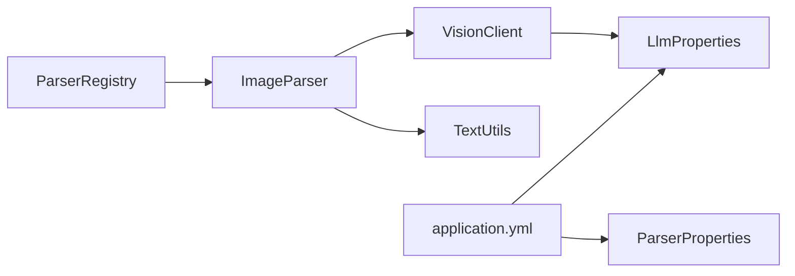
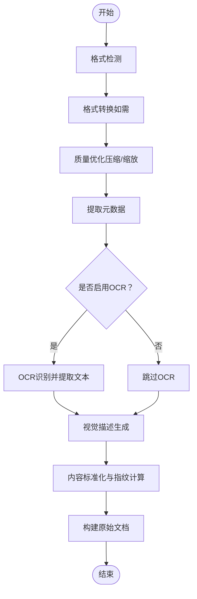

# 图片解析器

<cite>
**本文引用的文件**
- [ImageParser.java](file://src/main/java/com/example/llmwiki/parser/impl/ImageParser.java)
- [VisionClient.java](file://src/main/java/com/example/llmwiki/llm/VisionClient.java)
- [ParseRequest.java](file://src/main/java/com/example/llmwiki/parser/ParseRequest.java)
- [SourceParser.java](file://src/main/java/com/example/llmwiki/parser/SourceParser.java)
- [ParserRegistry.java](file://src/main/java/com/example/llmwiki/parser/ParserRegistry.java)
- [ParserProperties.java](file://src/main/java/com/example/llmwiki/config/ParserProperties.java)
- [LlmProperties.java](file://src/main/java/com/example/llmwiki/config/LlmProperties.java)
- [RawDocument.java](file://src/main/java/com/example/llmwiki/domain/RawDocument.java)
- [TextUtils.java](file://src/main/java/com/example/llmwiki/util/TextUtils.java)
- [application.yml](file://src/main/resources/application.yml)
- [IngestPipeline.java](file://src/main/java/com/example/llmwiki/ingest/IngestPipeline.java)
- [IngestQueueService.java](file://src/main/java/com/example/llmwiki/queue/IngestQueueService.java)
- [ParserException.java](file://src/main/java/com/example/llmwiki/parser/ParserException.java)
</cite>

## 目录
1. [简介](#简介)
2. [项目结构](#项目结构)
3. [核心组件](#核心组件)
4. [架构总览](#架构总览)
5. [详细组件分析](#详细组件分析)
6. [依赖分析](#依赖分析)
7. [性能考虑](#性能考虑)
8. [故障排查指南](#故障排查指南)
9. [结论](#结论)
10. [附录](#附录)

## 简介
本文件面向“图片解析器”的技术文档，聚焦于图片内容识别与描述生成的实现细节。当前系统通过视觉大模型（Vision LLM）对图片进行事实性描述生成，并在未启用视觉能力时以元信息为主进行收录。解析流程包括：图片格式检测、是否启用视觉能力判断、调用视觉模型生成描述、内容标准化与指纹计算、最终输出统一的原始文档结构。

需要特别说明的是：当前仓库中的图片解析器并未集成OCR模块，也未实现图片格式转换、压缩优化、元数据提取与内容分类等处理逻辑。本文将基于现有代码进行准确描述，并在“概念性概述”部分给出扩展建议，帮助读者理解如何在现有架构上进行增强。

## 项目结构
图片解析器位于解析器子系统中，遵循统一的解析器接口规范，与其他解析器（如PDF解析器）共同由解析器注册表调度。视觉能力通过独立的视觉客户端进行调用，配置项集中于应用配置文件与属性类中。

**图示来源**
- [ImageParser.java:27-70](file://src/main/java/com/example/llmwiki/parser/impl/ImageParser.java#L27-L70)
- [ParserRegistry.java:19-36](file://src/main/java/com/example/llmwiki/parser/ParserRegistry.java#L19-L36)
- [SourceParser.java:11-21](file://src/main/java/com/example/llmwiki/parser/SourceParser.java#L11-L21)
- [VisionClient.java:25-94](file://src/main/java/com/example/llmwiki/llm/VisionClient.java#L25-L94)
- [LlmProperties.java:19-61](file://src/main/java/com/example/llmwiki/config/LlmProperties.java#L19-L61)
- [RawDocument.java:20-51](file://src/main/java/com/example/llmwiki/domain/RawDocument.java#L20-L51)
- [ParseRequest.java:18-34](file://src/main/java/com/example/llmwiki/parser/ParseRequest.java#L18-L34)
- [TextUtils.java:15-80](file://src/main/java/com/example/llmwiki/util/TextUtils.java#L15-L80)
- [application.yml:31-77](file://src/main/resources/application.yml#L31-L77)
- [ParserProperties.java:13-45](file://src/main/java/com/example/llmwiki/config/ParserProperties.java#L13-L45)

**章节来源**
- [ImageParser.java:27-70](file://src/main/java/com/example/llmwiki/parser/impl/ImageParser.java#L27-L70)
- [ParserRegistry.java:19-36](file://src/main/java/com/example/llmwiki/parser/ParserRegistry.java#L19-L36)
- [VisionClient.java:25-94](file://src/main/java/com/example/llmwiki/llm/VisionClient.java#L25-L94)
- [application.yml:31-77](file://src/main/resources/application.yml#L31-L77)

## 核心组件
- 图片解析器（ImageParser）
  - 功能：根据文件扩展名判断是否为图片，若启用视觉能力则调用视觉客户端生成描述；否则仅记录元信息。
  - 关键点：支持的图片扩展名列表、是否启用视觉能力的判断、构建统一的原始文档对象。
- 视觉客户端（VisionClient）
  - 功能：封装OpenAI兼容的视觉接口，负责将图片编码为data URL并发起请求，解析响应得到描述文本。
  - 关键点：启用条件检查、请求构造、异常降级返回空串。
- 解析器注册表（ParserRegistry）
  - 功能：遍历所有解析器，选择首个满足条件的实现执行解析。
  - 关键点：按顺序匹配、抛出解析异常。
- 原始文档（RawDocument）
  - 功能：统一的解析输出结构，承载文本正文、内容指纹、图片描述、元信息等。
  - 关键点：内容指纹用于增量缓存、图片描述列表用于后续分析与生成。
- 解析请求（ParseRequest）
  - 功能：统一封装文件/链接/第三方来源的输入参数。
  - 关键点：包含文件字节、MIME类型等。
- 文本工具（TextUtils）
  - 功能：提供SHA256指纹计算、slug生成、空白符规范化、截断等工具方法。
  - 关键点：用于内容指纹与标题安全化处理。

**章节来源**
- [ImageParser.java:27-70](file://src/main/java/com/example/llmwiki/parser/impl/ImageParser.java#L27-L70)
- [VisionClient.java:25-94](file://src/main/java/com/example/llmwiki/llm/VisionClient.java#L25-L94)
- [ParserRegistry.java:19-36](file://src/main/java/com/example/llmwiki/parser/ParserRegistry.java#L19-L36)
- [RawDocument.java:20-51](file://src/main/java/com/example/llmwiki/domain/RawDocument.java#L20-L51)
- [ParseRequest.java:18-34](file://src/main/java/com/example/llmwiki/parser/ParseRequest.java#L18-L34)
- [TextUtils.java:15-80](file://src/main/java/com/example/llmwiki/util/TextUtils.java#L15-L80)

## 架构总览
图片解析器在整体摄入流水线中承担“解析阶段”的职责，其输出作为后续“分析与生成阶段”的输入之一。下图展示了从队列到解析再到流水线的整体调用关系。

**图示来源**
- [IngestQueueService.java:159-181](file://src/main/java/com/example/llmwiki/queue/IngestQueueService.java#L159-L181)
- [ParserRegistry.java:27-35](file://src/main/java/com/example/llmwiki/parser/ParserRegistry.java#L27-L35)
- [ImageParser.java:47-69](file://src/main/java/com/example/llmwiki/parser/impl/ImageParser.java#L47-L69)
- [VisionClient.java:47-86](file://src/main/java/com/example/llmwiki/llm/VisionClient.java#L47-L86)
- [LlmProperties.java:54-61](file://src/main/java/com/example/llmwiki/config/LlmProperties.java#L54-L61)
- [RawDocument.java:20-51](file://src/main/java/com/example/llmwiki/domain/RawDocument.java#L20-L51)

## 详细组件分析

### 图片解析器（ImageParser）
- 支持的图片格式
  - 列表包含：png、jpg、jpeg、webp、bmp、gif。
- 解析流程
  - 若启用视觉能力：调用视觉客户端生成描述，拼接为文本正文；否则仅记录元信息。
  - 计算内容指纹，构建原始文档对象。
- 关键实现要点
  - 使用扩展名后缀判断是否为图片。
  - 通过视觉客户端的启用状态决定是否生成描述。
  - 将图片描述放入原始文档的图片描述列表，便于后续分析与生成阶段使用。

**图示来源**
- [ImageParser.java:38-69](file://src/main/java/com/example/llmwiki/parser/impl/ImageParser.java#L38-L69)

**章节来源**
- [ImageParser.java:27-70](file://src/main/java/com/example/llmwiki/parser/impl/ImageParser.java#L27-L70)

### 视觉客户端（VisionClient）
- 启用条件
  - 配置中视觉开关开启且API Key非空。
- 请求构造
  - 将图片字节编码为data URL，构造消息数组，包含文本提示与图片URL。
- 响应解析
  - 从响应中提取第一条消息的内容作为描述文本；失败时返回空串并记录告警日志。
- 降级策略
  - 当视觉能力未启用或调用失败时，返回空串，保证流程继续执行。

**图示来源**
- [VisionClient.java:34-86](file://src/main/java/com/example/llmwiki/llm/VisionClient.java#L34-L86)
- [LlmProperties.java:54-61](file://src/main/java/com/example/llmwiki/config/LlmProperties.java#L54-L61)

**章节来源**
- [VisionClient.java:25-94](file://src/main/java/com/example/llmwiki/llm/VisionClient.java#L25-L94)

### 解析器注册表（ParserRegistry）
- 作用
  - 遍历所有解析器，选择首个满足条件的实现执行解析。
- 错误处理
  - 若无解析器匹配，抛出解析异常。

**图示来源**
- [ParserRegistry.java:27-35](file://src/main/java/com/example/llmwiki/parser/ParserRegistry.java#L27-L35)
- [SourceParser.java:16-20](file://src/main/java/com/example/llmwiki/parser/SourceParser.java#L16-L20)

**章节来源**
- [ParserRegistry.java:19-36](file://src/main/java/com/example/llmwiki/parser/ParserRegistry.java#L19-L36)
- [SourceParser.java:11-21](file://src/main/java/com/example/llmwiki/parser/SourceParser.java#L11-L21)

### 原始文档（RawDocument）
- 结构
  - 包含来源类型、来源标识、显示名、文本正文、内容指纹、语言、图片描述列表、元信息、抓取时间等字段。
- 用途
  - 作为解析器统一输出，供摄入流水线后续阶段使用。

**图示来源**
- [RawDocument.java:20-51](file://src/main/java/com/example/llmwiki/domain/RawDocument.java#L20-L51)

**章节来源**
- [RawDocument.java:12-51](file://src/main/java/com/example/llmwiki/domain/RawDocument.java#L12-L51)

### 文本工具（TextUtils）
- 功能
  - 提供SHA256指纹计算、slug生成、空白符规范化、截断等工具方法。
- 应用
  - 图片解析器使用SHA256计算内容指纹，确保增量缓存可用。

**章节来源**
- [TextUtils.java:15-80](file://src/main/java/com/example/llmwiki/util/TextUtils.java#L15-L80)

## 依赖分析
- 组件耦合
  - ImageParser依赖VisionClient与TextUtils；VisionClient依赖LlmProperties与Rest客户端；ParserRegistry聚合多个SourceParser实现。
- 外部依赖
  - 视觉模型API（OpenAI兼容）；应用配置（application.yml）。
- 配置依赖
  - 视觉能力开关、API Key、模型名称、超时时间等均来自配置。

**图示来源**
- [ImageParser.java:31-31](file://src/main/java/com/example/llmwiki/parser/impl/ImageParser.java#L31-L31)
- [VisionClient.java:27-28](file://src/main/java/com/example/llmwiki/llm/VisionClient.java#L27-L28)
- [LlmProperties.java:19-61](file://src/main/java/com/example/llmwiki/config/LlmProperties.java#L19-L61)
- [ParserRegistry.java:22-22](file://src/main/java/com/example/llmwiki/parser/ParserRegistry.java#L22-L22)
- [application.yml:31-77](file://src/main/resources/application.yml#L31-L77)
- [ParserProperties.java:13-45](file://src/main/java/com/example/llmwiki/config/ParserProperties.java#L13-L45)

**章节来源**
- [ImageParser.java:27-70](file://src/main/java/com/example/llmwiki/parser/impl/ImageParser.java#L27-L70)
- [VisionClient.java:25-94](file://src/main/java/com/example/llmwiki/llm/VisionClient.java#L25-L94)
- [ParserRegistry.java:19-36](file://src/main/java/com/example/llmwiki/parser/ParserRegistry.java#L19-L36)
- [application.yml:31-77](file://src/main/resources/application.yml#L31-L77)

## 性能考虑
- 视觉调用成本控制
  - 当前视觉调用为单次请求，建议在上游控制并发与请求频率，避免触发外部服务限流。
- 增量缓存
  - 通过内容指纹（SHA251）判断内容是否变化，避免重复解析与生成。
- 内存与I/O
  - 图片字节直接传入视觉客户端，注意控制单次图片大小与并发数量，防止内存峰值过高。

**章节来源**
- [ImageParser.java:67-67](file://src/main/java/com/example/llmwiki/parser/impl/ImageParser.java#L67-L67)
- [TextUtils.java:26-41](file://src/main/java/com/example/llmwiki/util/TextUtils.java#L26-L41)
- [IngestPipeline.java:77-80](file://src/main/java/com/example/llmwiki/ingest/IngestPipeline.java#L77-L80)

## 故障排查指南
- 不支持的格式
  - 现有图片解析器仅支持特定扩展名，若扩展名不在列表内将被跳过。可通过扩展支持列表解决。
- 视觉能力未启用
  - 当视觉开关关闭或API Key为空时，解析器仅记录元信息。请检查配置项并正确填写。
- 视觉调用失败
  - 视觉客户端在调用失败时会记录告警并返回空串，不影响整体流程。请检查网络、鉴权与模型可用性。
- 解析器未匹配
  - 若无解析器支持当前请求，将抛出解析异常。请确认来源类型与扩展名是否符合任一解析器的条件。

**章节来源**
- [ImageParser.java:38-45](file://src/main/java/com/example/llmwiki/parser/impl/ImageParser.java#L38-L45)
- [VisionClient.java:34-38](file://src/main/java/com/example/llmwiki/llm/VisionClient.java#L34-L38)
- [ParserRegistry.java:34-34](file://src/main/java/com/example/llmwiki/parser/ParserRegistry.java#L34-L34)
- [ParserException.java:9-18](file://src/main/java/com/example/llmwiki/parser/ParserException.java#L9-L18)

## 结论
当前图片解析器实现了基于视觉大模型的事实性图片描述生成，并在未启用视觉能力时以元信息为主进行收录。解析流程简洁明确，依赖统一的原始文档结构，便于接入后续的分析与生成阶段。若需进一步增强，可在现有基础上集成OCR、格式转换、压缩优化、元数据提取与内容分类等功能，以提升对多格式图片的处理能力与成本控制水平。

## 附录

### 配置参数说明
- 视觉能力配置（llm-wiki.llm.vision）
  - enabled：是否启用视觉能力
  - base-url：视觉模型API基础地址
  - api-key：访问密钥
  - model：模型名称
  - timeout-seconds：请求超时（秒）
- 解析器配置（llm-wiki.parser）
  - ocr.enabled：是否启用OCR（当前图片解析器未使用）
  - ocr.data-path：OCR数据路径（当前图片解析器未使用）
  - ocr.lang：OCR识别语言（当前图片解析器未使用）

**章节来源**
- [application.yml:52-57](file://src/main/resources/application.yml#L52-L57)
- [application.yml:67-70](file://src/main/resources/application.yml#L67-L70)
- [LlmProperties.java:54-61](file://src/main/java/com/example/llmwiki/config/LlmProperties.java#L54-L61)
- [ParserProperties.java:36-44](file://src/main/java/com/example/llmwiki/config/ParserProperties.java#L36-L44)

### 概念性处理逻辑（扩展建议）
以下为概念性流程，用于指导未来在现有架构上增强图片解析器的能力。这些内容不对应当前仓库中的具体实现，仅作为设计参考。

[本图为概念性流程，无需图示来源]