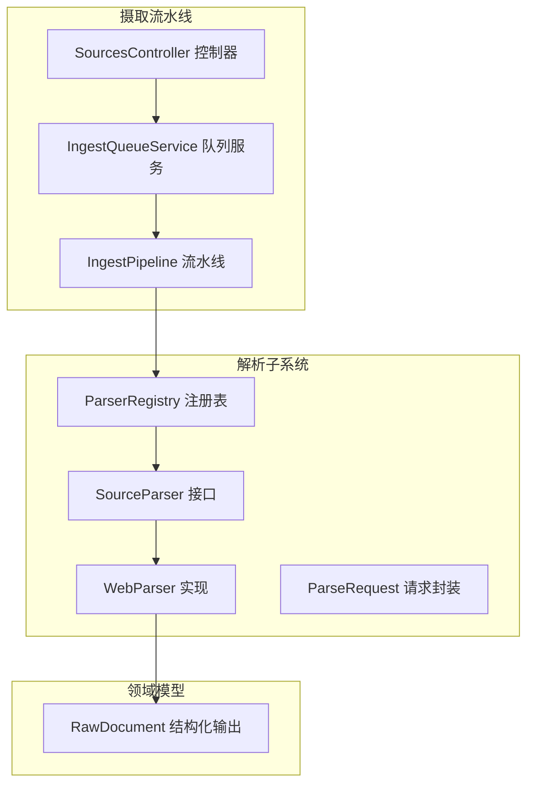
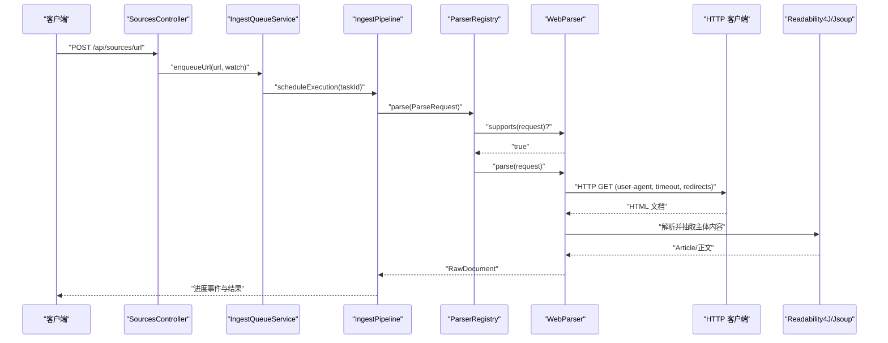
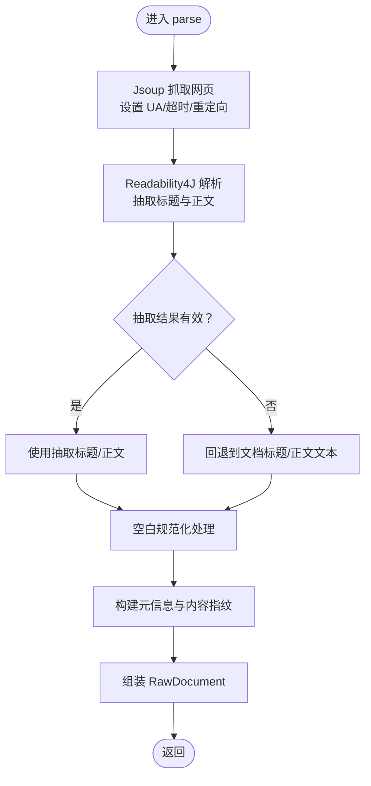
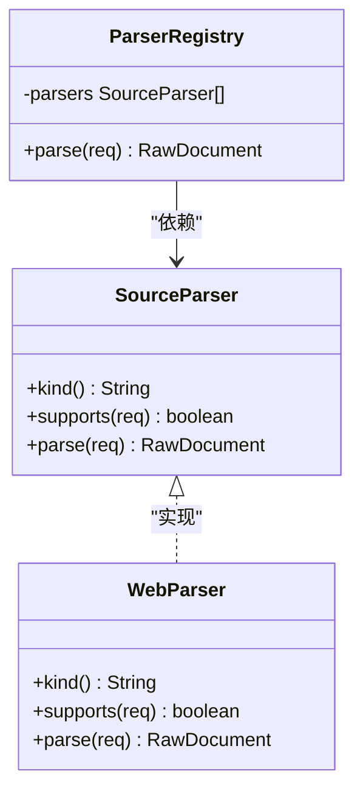
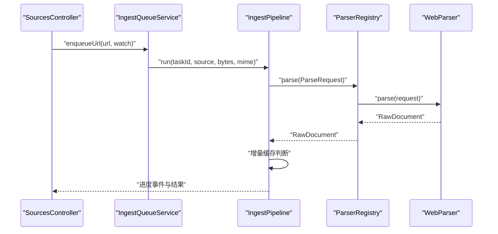
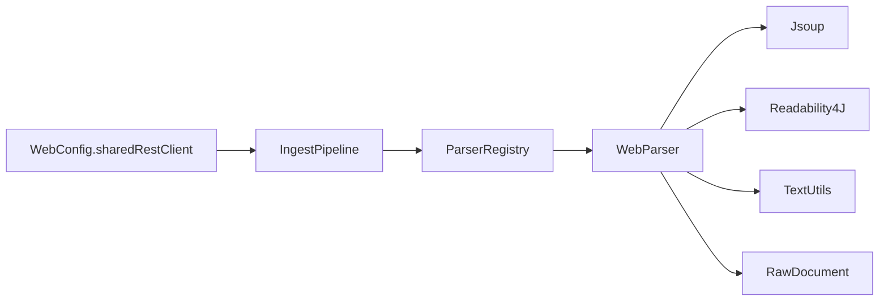

# 网页解析器

<cite>
**本文引用的文件**
- [WebParser.java](file://src/main/java/com/example/llmwiki/parser/impl/WebParser.java)
- [SourceParser.java](file://src/main/java/com/example/llmwiki/parser/SourceParser.java)
- [ParseRequest.java](file://src/main/java/com/example/llmwiki/parser/ParseRequest.java)
- [ParserRegistry.java](file://src/main/java/com/example/llmwiki/parser/ParserRegistry.java)
- [RawDocument.java](file://src/main/java/com/example/llmwiki/domain/RawDocument.java)
- [IngestPipeline.java](file://src/main/java/com/example/llmwiki/ingest/IngestPipeline.java)
- [SourcesController.java](file://src/main/java/com/example/llmwiki/api/SourcesController.java)
- [IngestQueueService.java](file://src/main/java/com/example/llmwiki/queue/IngestQueueService.java)
- [TextUtils.java](file://src/main/java/com/example/llmwiki/util/TextUtils.java)
- [ParserProperties.java](file://src/main/java/com/example/llmwiki/config/ParserProperties.java)
- [application.yml](file://src/main/resources/application.yml)
- [WebConfig.java](file://src/main/java/com/example/llmwiki/config/WebConfig.java)
- [ParserException.java](file://src/main/java/com/example/llmwiki/parser/ParserException.java)
- [IngestException.java](file://src/main/java/com/example/llmwiki/ingest/IngestException.java)
</cite>

## 目录
1. [简介](#简介)
2. [项目结构](#项目结构)
3. [核心组件](#核心组件)
4. [架构总览](#架构总览)
5. [详细组件分析](#详细组件分析)
6. [依赖分析](#依赖分析)
7. [性能考虑](#性能考虑)
8. [故障排查指南](#故障排查指南)
9. [结论](#结论)
10. [附录](#附录)

## 简介
本技术文档围绕“网页解析器”展开，系统性阐述其在知识库摄取流水线中的职责与实现细节。网页解析器负责抓取网页内容并提取结构化信息，包括 HTML 解析、主体内容抽取、标题与正文清洗、元数据标准化以及内容指纹计算。文档还覆盖了与之配套的解析注册表、统一请求封装、流水线集成、错误处理与异常恢复策略，并对配置项进行说明。

## 项目结构
网页解析器位于解析子系统中，采用“接口 + 实现 + 注册表”的分层设计，配合统一的摄取流水线完成从 URL 提交到最终索引与图谱更新的全链路处理。

**图表来源**
- [WebParser.java:27-68](file://src/main/java/com/example/llmwiki/parser/impl/WebParser.java#L27-L68)
- [SourceParser.java:11-21](file://src/main/java/com/example/llmwiki/parser/SourceParser.java#L11-L21)
- [ParserRegistry.java:27-35](file://src/main/java/com/example/llmwiki/parser/ParserRegistry.java#L27-L35)
- [ParseRequest.java:18-34](file://src/main/java/com/example/llmwiki/parser/ParseRequest.java#L18-L34)
- [IngestPipeline.java:65-109](file://src/main/java/com/example/llmwiki/ingest/IngestPipeline.java#L65-L109)
- [SourcesController.java:50-61](file://src/main/java/com/example/llmwiki/api/SourcesController.java#L50-L61)
- [RawDocument.java:20-51](file://src/main/java/com/example/llmwiki/domain/RawDocument.java#L20-L51)

**章节来源**
- [WebParser.java:27-68](file://src/main/java/com/example/llmwiki/parser/impl/WebParser.java#L27-L68)
- [ParserRegistry.java:27-35](file://src/main/java/com/example/llmwiki/parser/ParserRegistry.java#L27-L35)
- [IngestPipeline.java:65-109](file://src/main/java/com/example/llmwiki/ingest/IngestPipeline.java#L65-L109)
- [SourcesController.java:50-61](file://src/main/java/com/example/llmwiki/api/SourcesController.java#L50-L61)

## 核心组件
- SourceParser 接口：定义解析器类型、能力判定与解析执行三要素，确保多源解析器的统一契约。
- WebParser 实现：针对 URL 类型的网页解析器，基于 Jsoup 抓取 HTML 并使用 Readability4J 抽取主体内容，随后进行标题与正文的二次清洗与标准化。
- ParserRegistry 注册表：遍历已注入的解析器，按 supports 判定选择首个匹配实现并执行解析。
- ParseRequest 请求封装：统一封装来源类型、引用、显示名、文件字节与 MIME 等字段，便于解析器与流水线使用。
- RawDocument 结构化输出：统一的原始文档结构，承载来源标识、显示名、文本正文、内容指纹、元信息与抓取时间等，作为后续分析与生成的输入。

**章节来源**
- [SourceParser.java:11-21](file://src/main/java/com/example/llmwiki/parser/SourceParser.java#L11-L21)
- [WebParser.java:27-68](file://src/main/java/com/example/llmwiki/parser/impl/WebParser.java#L27-L68)
- [ParserRegistry.java:27-35](file://src/main/java/com/example/llmwiki/parser/ParserRegistry.java#L27-L35)
- [ParseRequest.java:18-34](file://src/main/java/com/example/llmwiki/parser/ParseRequest.java#L18-L34)
- [RawDocument.java:20-51](file://src/main/java/com/example/llmwiki/domain/RawDocument.java#L20-L51)

## 架构总览
网页解析器在摄取流水线中的位置如下：

**图表来源**
- [SourcesController.java:50-61](file://src/main/java/com/example/llmwiki/api/SourcesController.java#L50-L61)
- [IngestQueueService.java:93-102](file://src/main/java/com/example/llmwiki/queue/IngestQueueService.java#L93-L102)
- [IngestPipeline.java:65-74](file://src/main/java/com/example/llmwiki/ingest/IngestPipeline.java#L65-L74)
- [ParserRegistry.java:27-35](file://src/main/java/com/example/llmwiki/parser/ParserRegistry.java#L27-L35)
- [WebParser.java:40-68](file://src/main/java/com/example/llmwiki/parser/impl/WebParser.java#L40-L68)

## 详细组件分析

### WebParser 组件分析
- 角色定位：URL 类型网页解析器，负责抓取网页、抽取主体内容、清洗与标准化、构建元信息与内容指纹。
- 关键流程：
  - URL 校验与抓取：通过 Jsoup 发起 HTTP 请求，设置用户代理、超时与重定向策略。
  - 主体抽取：使用 Readability4J 基于 URL 与 HTML 文档解析文章对象，优先使用抽取后的标题与正文。
  - 标题与正文清洗：若抽取结果为空或空白，则回退到文档标题与正文文本；随后进行空白规范化处理。
  - 元信息与内容指纹：记录 URL 与标题，计算文本 SHA256 作为内容指纹，构建 RawDocument 返回。
- 特殊处理：
  - 动态内容：当前实现不包含 JavaScript 渲染或动态内容处理逻辑。
  - 广告过滤与导航链接识别：未见专门的广告过滤与导航链接识别逻辑，主要依赖 Readability4J 的主体抽取。
- 错误处理：解析异常由上层捕获并转换为摄取异常，避免中断流水线。

**图表来源**
- [WebParser.java:40-68](file://src/main/java/com/example/llmwiki/parser/impl/WebParser.java#L40-L68)
- [TextUtils.java:66-71](file://src/main/java/com/example/llmwiki/util/TextUtils.java#L66-L71)

**章节来源**
- [WebParser.java:27-68](file://src/main/java/com/example/llmwiki/parser/impl/WebParser.java#L27-L68)
- [TextUtils.java:25-41](file://src/main/java/com/example/llmwiki/util/TextUtils.java#L25-L41)

### SourceParser 接口与 ParserRegistry 分析
- SourceParser：定义 kind()、supports()、parse() 三个方法，确保解析器具备类型标识、能力判定与执行入口。
- ParserRegistry：维护解析器列表，按顺序遍历并调用 supports 判定，命中后立即执行 parse 并返回结果；若无匹配则抛出解析异常。

**图表来源**
- [SourceParser.java:11-21](file://src/main/java/com/example/llmwiki/parser/SourceParser.java#L11-L21)
- [WebParser.java:27-68](file://src/main/java/com/example/llmwiki/parser/impl/WebParser.java#L27-L68)
- [ParserRegistry.java:21-35](file://src/main/java/com/example/llmwiki/parser/ParserRegistry.java#L21-L35)

**章节来源**
- [SourceParser.java:11-21](file://src/main/java/com/example/llmwiki/parser/SourceParser.java#L11-L21)
- [ParserRegistry.java:27-35](file://src/main/java/com/example/llmwiki/parser/ParserRegistry.java#L27-L35)

### 摄取流水线与网页解析器集成
- SourcesController：接收 URL 提交，创建 SourceRecord 并入队，触发摄取流程。
- IngestQueueService：将 URL 入队，调度执行。
- IngestPipeline.run：构建 ParseRequest，调用 ParserRegistry.parse 获取 RawDocument；若内容指纹未变化则跳过；否则继续 Step1/Step2/索引/图谱更新。
- 增量缓存：比较 SourceRecord.contentHash 与 RawDocument.contentHash，一致则直接跳过。

**图表来源**
- [SourcesController.java:50-61](file://src/main/java/com/example/llmwiki/api/SourcesController.java#L50-L61)
- [IngestQueueService.java:93-102](file://src/main/java/com/example/llmwiki/queue/IngestQueueService.java#L93-L102)
- [IngestPipeline.java:65-109](file://src/main/java/com/example/llmwiki/ingest/IngestPipeline.java#L65-L109)
- [ParserRegistry.java:27-35](file://src/main/java/com/example/llmwiki/parser/ParserRegistry.java#L27-L35)
- [WebParser.java:40-68](file://src/main/java/com/example/llmwiki/parser/impl/WebParser.java#L40-L68)

**章节来源**
- [SourcesController.java:50-61](file://src/main/java/com/example/llmwiki/api/SourcesController.java#L50-L61)
- [IngestQueueService.java:93-102](file://src/main/java/com/example/llmwiki/queue/IngestQueueService.java#L93-L102)
- [IngestPipeline.java:65-109](file://src/main/java/com/example/llmwiki/ingest/IngestPipeline.java#L65-L109)

### 数据模型：RawDocument
- 字段说明：来源类型、来源引用、显示名、文本正文、内容指纹、语言、图像描述、元信息、抓取时间等。
- 用途：作为解析器统一输出，供后续分析与生成阶段消费。

**章节来源**
- [RawDocument.java:20-51](file://src/main/java/com/example/llmwiki/domain/RawDocument.java#L20-L51)

## 依赖分析
- 外部依赖：
  - Jsoup：用于 HTTP 抓取与 HTML 解析。
  - Readability4J：用于网页主体内容抽取。
  - Spring WebClient RestClient：共享客户端实例，供 HTTP 交互复用。
- 内部依赖：
  - TextUtils：提供 SHA256、slugify、空白规范化等通用工具。
  - ParserRegistry：解析器选择与执行。
  - IngestPipeline：解析结果的后续处理与索引更新。

**图表来源**
- [WebParser.java:42-46](file://src/main/java/com/example/llmwiki/parser/impl/WebParser.java#L42-L46)
- [TextUtils.java:25-41](file://src/main/java/com/example/llmwiki/util/TextUtils.java#L25-L41)
- [WebConfig.java:30-33](file://src/main/java/com/example/llmwiki/config/WebConfig.java#L30-L33)

**章节来源**
- [WebParser.java:42-46](file://src/main/java/com/example/llmwiki/parser/impl/WebParser.java#L42-L46)
- [WebConfig.java:30-33](file://src/main/java/com/example/llmwiki/config/WebConfig.java#L30-L33)

## 性能考虑
- 抓取超时与重定向：默认超时 20 秒，自动跟随重定向，有助于提升成功率与稳定性。
- 内容清洗与标准化：通过空白规范化减少冗余空格，有利于下游嵌入与检索。
- 增量缓存：基于内容指纹跳过重复内容，显著降低重复摄取成本。
- 并发与队列：摄取队列采用单线程串行执行，避免资源争用；可通过配置调整工作线程数与最大重试次数。

[本节为通用性能建议，无需特定文件引用]

## 故障排查指南
- 网络异常与超时：
  - 现象：抓取失败或超时。
  - 排查：检查目标站点可达性、防火墙与代理设置；适当增大超时时间。
  - 参考：抓取超时参数与重定向行为。
- 内容解析失败：
  - 现象：Readability4J 抽取结果为空或空白。
  - 排查：确认页面是否为纯图片或需要登录；回退逻辑会使用文档标题与正文文本。
- 编码问题：
  - 现象：中文乱码或解析异常。
  - 排查：确认页面编码与响应头；必要时在上游统一编码处理。
- 增量跳过：
  - 现象：内容未变但未重新生成。
  - 排查：确认内容指纹计算与 SourceRecord.contentHash 是否正确更新。
- 异常传播：
  - 现象：解析器无法匹配或 JSON 解析失败。
  - 排查：ParserRegistry 抛出解析异常；IngestPipeline 在 Step1/Step2 JSON 解析失败时抛出摄取异常。

**章节来源**
- [WebParser.java:42-46](file://src/main/java/com/example/llmwiki/parser/impl/WebParser.java#L42-L46)
- [IngestPipeline.java:76-80](file://src/main/java/com/example/llmwiki/ingest/IngestPipeline.java#L76-L80)
- [ParserRegistry.java:34](file://src/main/java/com/example/llmwiki/parser/ParserRegistry.java#L34)
- [ParserException.java:9-17](file://src/main/java/com/example/llmwiki/parser/ParserException.java#L9-L17)
- [IngestException.java:9-17](file://src/main/java/com/example/llmwiki/ingest/IngestException.java#L9-L17)

## 结论
网页解析器以“Jsoup + Readability4J”为核心，实现了对网页内容的稳定抓取与主体抽取，并通过统一的结构化输出与增量缓存机制融入整体摄取流水线。当前实现聚焦静态内容解析，未包含 JavaScript 渲染与动态内容处理；对于广告过滤与导航链接识别，亦未提供专门逻辑。建议在后续版本中引入可配置的超时与重试策略、代理支持、以及可插拔的动态内容渲染方案，以进一步增强鲁棒性与适用范围。

## 附录

### 配置选项
- 应用级配置（application.yml）
  - 存储目录：raw、wiki、index、graph 目录根路径。
  - LLM 基础配置：聊天、嵌入、视觉模型的基础地址、密钥、模型与超时。
  - 解析器配置：飞书、钉钉、OCR 开关与参数（当前网页解析器不依赖这些配置）。
  - 摄取：最大重试次数、工作线程数。
- 解析器配置（ParserProperties）
  - 飞书、钉钉、OCR 的开关与参数（网页解析器不使用）。
- Web 层配置（WebConfig）
  - 跨域配置与共享 RestClient Bean。

**章节来源**
- [application.yml:31-77](file://src/main/resources/application.yml#L31-L77)
- [ParserProperties.java:16-44](file://src/main/java/com/example/llmwiki/config/ParserProperties.java#L16-L44)
- [WebConfig.java:19-33](file://src/main/java/com/example/llmwiki/config/WebConfig.java#L19-L33)