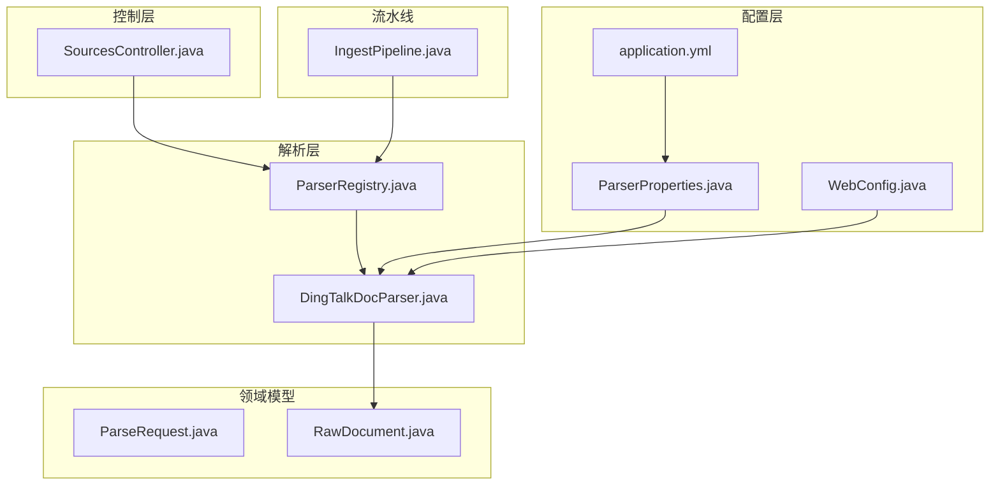
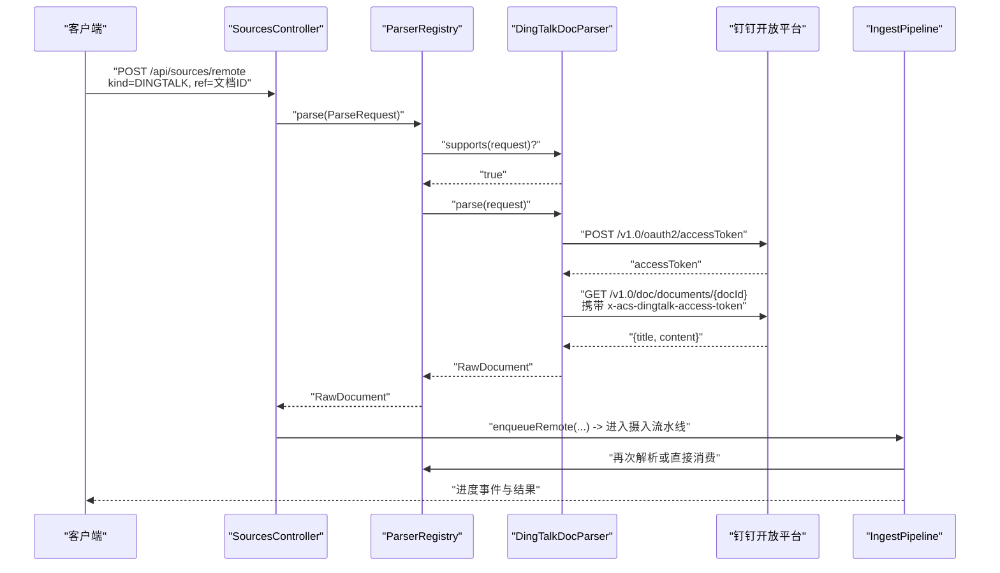
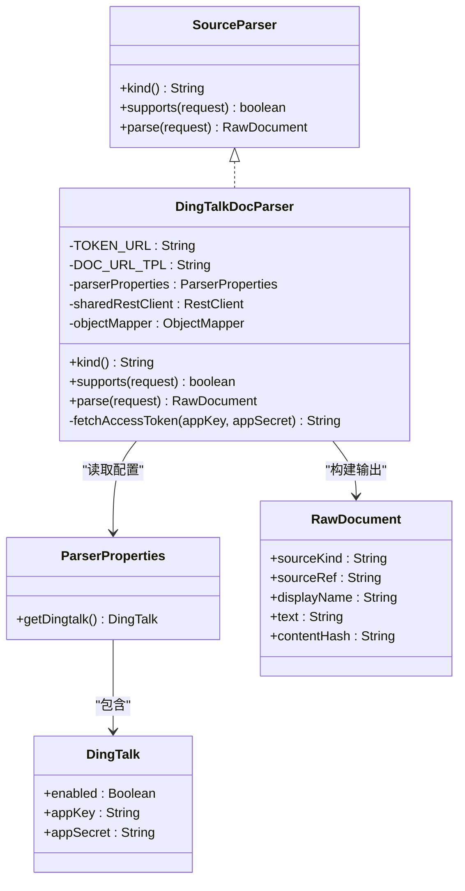
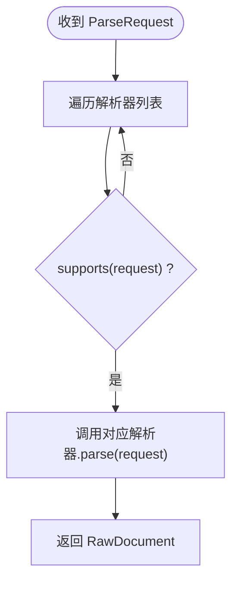
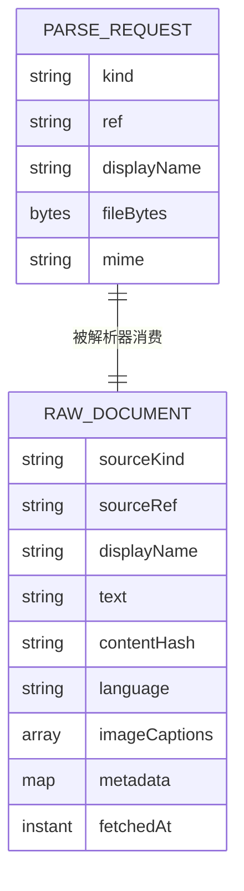
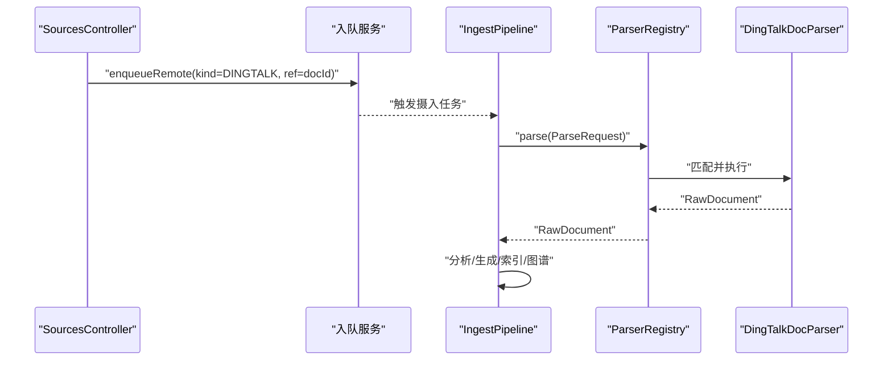
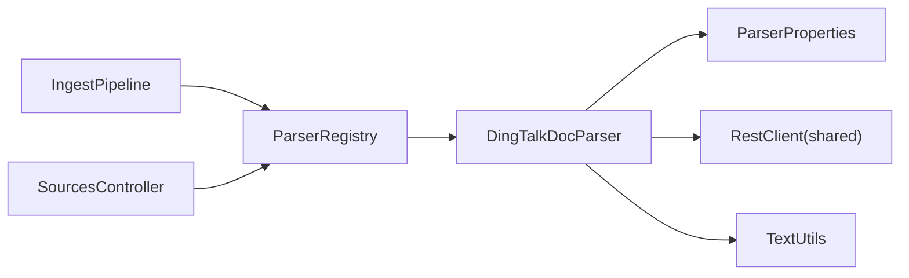

# 钉钉文档解析器

<cite>
**本文引用的文件**
- [DingTalkDocParser.java](file://src/main/java/com/example/llmwiki/parser/impl/DingTalkDocParser.java)
- [ParserProperties.java](file://src/main/java/com/example/llmwiki/config/ParserProperties.java)
- [application.yml](file://src/main/resources/application.yml)
- [WebConfig.java](file://src/main/java/com/example/llmwiki/config/WebConfig.java)
- [ParserRegistry.java](file://src/main/java/com/example/llmwiki/parser/ParserRegistry.java)
- [ParseRequest.java](file://src/main/java/com/example/llmwiki/parser/ParseRequest.java)
- [RawDocument.java](file://src/main/java/com/example/llmwiki/domain/RawDocument.java)
- [TextUtils.java](file://src/main/java/com/example/llmwiki/util/TextUtils.java)
- [SourcesController.java](file://src/main/java/com/example/llmwiki/api/SourcesController.java)
- [IngestPipeline.java](file://src/main/java/com/example/llmwiki/ingest/IngestPipeline.java)
- [ParserException.java](file://src/main/java/com/example/llmwiki/parser/ParserException.java)
</cite>

## 目录
1. [简介](#简介)
2. [项目结构](#项目结构)
3. [核心组件](#核心组件)
4. [架构总览](#架构总览)
5. [详细组件分析](#详细组件分析)
6. [依赖分析](#依赖分析)
7. [性能考虑](#性能考虑)
8. [故障排查指南](#故障排查指南)
9. [结论](#结论)
10. [附录](#附录)

## 简介
本文件面向“钉钉文档解析器”的技术实现，系统性阐述其在知识库摄入流水线中的角色与工作方式。该解析器通过钉钉开放平台的 OAuth2 授权与文档查询接口，获取文档标题与正文内容，并将其标准化为统一的原始文档结构，供后续分析与生成阶段使用。

- 支持来源类型：DINGTALK
- 关键能力：OAuth2 获取访问令牌、调用文档查询接口、内容清洗与结构化输出
- 特殊处理：内容去空白、内容指纹计算、统一异常包装

## 项目结构
围绕“解析器”主题，相关模块分布如下：
- 配置层：解析器配置类与全局 REST 客户端
- 解析层：统一接口与具体实现（钉钉）
- 领域模型：解析请求与原始文档
- 控制层：数据源提交入口，支持远程来源（含 DINGTALK）
- 流水线：解析后的内容进入两阶段 LLM 分析与生成

图表来源
- [ParserProperties.java:1-46](file://src/main/java/com/example/llmwiki/config/ParserProperties.java#L1-L46)
- [WebConfig.java:1-34](file://src/main/java/com/example/llmwiki/config/WebConfig.java#L1-L34)
- [application.yml:58-70](file://src/main/resources/application.yml#L58-L70)
- [ParserRegistry.java:1-37](file://src/main/java/com/example/llmwiki/parser/ParserRegistry.java#L1-L37)
- [DingTalkDocParser.java:1-101](file://src/main/java/com/example/llmwiki/parser/impl/DingTalkDocParser.java#L1-L101)
- [ParseRequest.java:1-35](file://src/main/java/com/example/llmwiki/parser/ParseRequest.java#L1-L35)
- [RawDocument.java:1-52](file://src/main/java/com/example/llmwiki/domain/RawDocument.java#L1-L52)
- [SourcesController.java:1-102](file://src/main/java/com/example/llmwiki/api/SourcesController.java#L1-L102)
- [IngestPipeline.java:1-251](file://src/main/java/com/example/llmwiki/ingest/IngestPipeline.java#L1-L251)

章节来源
- [application.yml:58-70](file://src/main/resources/application.yml#L58-L70)
- [ParserProperties.java:13-46](file://src/main/java/com/example/llmwiki/config/ParserProperties.java#L13-L46)
- [WebConfig.java:27-33](file://src/main/java/com/example/llmwiki/config/WebConfig.java#L27-L33)
- [ParserRegistry.java:16-36](file://src/main/java/com/example/llmwiki/parser/ParserRegistry.java#L16-L36)
- [DingTalkDocParser.java:19-100](file://src/main/java/com/example/llmwiki/parser/impl/DingTalkDocParser.java#L19-L100)
- [ParseRequest.java:14-35](file://src/main/java/com/example/llmwiki/parser/ParseRequest.java#L14-L35)
- [RawDocument.java:18-52](file://src/main/java/com/example/llmwiki/domain/RawDocument.java#L18-L52)
- [SourcesController.java:55-61](file://src/main/java/com/example/llmwiki/api/SourcesController.java#L55-L61)
- [IngestPipeline.java:65-109](file://src/main/java/com/example/llmwiki/ingest/IngestPipeline.java#L65-L109)

## 核心组件
- 钉钉解析器实现：负责 OAuth2 获取访问令牌、调用文档查询接口、内容清洗与结构化输出
- 解析器注册表：按顺序匹配并执行解析
- 解析器配置：集中管理各解析器的开关与凭据
- 全局 REST 客户端：共享 HTTP 客户端实例
- 解析请求与原始文档：统一输入输出结构
- 控制器与流水线：从提交到解析、分析、生成、索引的完整链路

章节来源
- [DingTalkDocParser.java:32-100](file://src/main/java/com/example/llmwiki/parser/impl/DingTalkDocParser.java#L32-L100)
- [ParserRegistry.java:19-36](file://src/main/java/com/example/llmwiki/parser/ParserRegistry.java#L19-L36)
- [ParserProperties.java:16-44](file://src/main/java/com/example/llmwiki/config/ParserProperties.java#L16-L44)
- [WebConfig.java:30-33](file://src/main/java/com/example/llmwiki/config/WebConfig.java#L30-L33)
- [ParseRequest.java:18-35](file://src/main/java/com/example/llmwiki/parser/ParseRequest.java#L18-L35)
- [RawDocument.java:20-52](file://src/main/java/com/example/llmwiki/domain/RawDocument.java#L20-L52)
- [SourcesController.java:55-61](file://src/main/java/com/example/llmwiki/api/SourcesController.java#L55-L61)
- [IngestPipeline.java:65-109](file://src/main/java/com/example/llmwiki/ingest/IngestPipeline.java#L65-L109)

## 架构总览
下图展示了从“提交远程来源”到“解析与摄入”的端到端流程，重点体现钉钉解析器在整体流水线中的位置与职责。

图表来源
- [SourcesController.java:55-61](file://src/main/java/com/example/llmwiki/api/SourcesController.java#L55-L61)
- [ParserRegistry.java:27-35](file://src/main/java/com/example/llmwiki/parser/ParserRegistry.java#L27-L35)
- [DingTalkDocParser.java:52-83](file://src/main/java/com/example/llmwiki/parser/impl/DingTalkDocParser.java#L52-L83)
- [IngestPipeline.java:65-109](file://src/main/java/com/example/llmwiki/ingest/IngestPipeline.java#L65-L109)

## 详细组件分析

### 钉钉解析器实现
- 实现接口：SourceParser
- 关键方法：
  - kind：返回标识 DINGTALK
  - supports：根据 ParseRequest.kind 判断是否处理
  - parse：执行 OAuth2 获取令牌、调用文档接口、构造 RawDocument
- 认证流程：POST 获取 accessToken，随后以请求头携带访问令牌访问文档接口
- 内容处理：读取标题与正文，进行空白规范化，构建 Markdown 文本并计算内容指纹

图表来源
- [DingTalkDocParser.java:32-100](file://src/main/java/com/example/llmwiki/parser/impl/DingTalkDocParser.java#L32-L100)
- [ParserProperties.java:16-34](file://src/main/java/com/example/llmwiki/config/ParserProperties.java#L16-L34)
- [RawDocument.java:20-52](file://src/main/java/com/example/llmwiki/domain/RawDocument.java#L20-L52)

章节来源
- [DingTalkDocParser.java:41-83](file://src/main/java/com/example/llmwiki/parser/impl/DingTalkDocParser.java#L41-L83)
- [DingTalkDocParser.java:85-99](file://src/main/java/com/example/llmwiki/parser/impl/DingTalkDocParser.java#L85-L99)

### 解析器注册表与统一入口
- 职责：遍历已注入的解析器，按 supports(request) 返回的第一个实现执行 parse(request)
- 作用：屏蔽不同来源的具体差异，统一由注册表分发

图表来源
- [ParserRegistry.java:27-35](file://src/main/java/com/example/llmwiki/parser/ParserRegistry.java#L27-L35)

章节来源
- [ParserRegistry.java:27-35](file://src/main/java/com/example/llmwiki/parser/ParserRegistry.java#L27-L35)

### 解析请求与原始文档
- 解析请求：封装来源类型、引用、显示名、文件字节、MIME 等
- 原始文档：标准化输出，包含来源类型、引用、显示名、文本正文、内容指纹、元信息等

图表来源
- [ParseRequest.java:18-35](file://src/main/java/com/example/llmwiki/parser/ParseRequest.java#L18-L35)
- [RawDocument.java:20-52](file://src/main/java/com/example/llmwiki/domain/RawDocument.java#L20-L52)

章节来源
- [ParseRequest.java:18-35](file://src/main/java/com/example/llmwiki/parser/ParseRequest.java#L18-L35)
- [RawDocument.java:20-52](file://src/main/java/com/example/llmwiki/domain/RawDocument.java#L20-L52)

### 控制器与摄入流水线
- 控制器：接收远程来源（含 DINGTALK）并入队
- 摄入流水线：解析 -> 分析 -> 生成 -> 索引/图谱 -> 更新来源指纹

图表来源
- [SourcesController.java:55-61](file://src/main/java/com/example/llmwiki/api/SourcesController.java#L55-L61)
- [IngestPipeline.java:65-109](file://src/main/java/com/example/llmwiki/ingest/IngestPipeline.java#L65-L109)
- [ParserRegistry.java:27-35](file://src/main/java/com/example/llmwiki/parser/ParserRegistry.java#L27-L35)
- [DingTalkDocParser.java:52-83](file://src/main/java/com/example/llmwiki/parser/impl/DingTalkDocParser.java#L52-L83)

章节来源
- [SourcesController.java:55-61](file://src/main/java/com/example/llmwiki/api/SourcesController.java#L55-L61)
- [IngestPipeline.java:65-109](file://src/main/java/com/example/llmwiki/ingest/IngestPipeline.java#L65-L109)

## 依赖分析
- 组件耦合
  - DingTalkDocParser 依赖 ParserProperties 读取配置、依赖 RestClient 发起 HTTP 请求、依赖 TextUtils 进行内容处理
  - ParserRegistry 依赖 Spring 注入的 SourceParser 列表，实现动态分发
  - IngestPipeline 依赖 ParserRegistry 获取 RawDocument，并驱动后续分析与生成
- 外部依赖
  - 钉钉开放平台：OAuth2 令牌接口与文档查询接口
  - Spring WebClient（通过 RestClient 封装）：HTTP 客户端

图表来源
- [DingTalkDocParser.java:37-39](file://src/main/java/com/example/llmwiki/parser/impl/DingTalkDocParser.java#L37-L39)
- [ParserProperties.java:16-34](file://src/main/java/com/example/llmwiki/config/ParserProperties.java#L16-L34)
- [ParserRegistry.java:22](file://src/main/java/com/example/llmwiki/parser/ParserRegistry.java#L22)
- [IngestPipeline.java:52](file://src/main/java/com/example/llmwiki/ingest/IngestPipeline.java#L52)
- [SourcesController.java:55-61](file://src/main/java/com/example/llmwiki/api/SourcesController.java#L55-L61)

章节来源
- [DingTalkDocParser.java:37-39](file://src/main/java/com/example/llmwiki/parser/impl/DingTalkDocParser.java#L37-L39)
- [ParserRegistry.java:22](file://src/main/java/com/example/llmwiki/parser/ParserRegistry.java#L22)
- [IngestPipeline.java:52](file://src/main/java/com/example/llmwiki/ingest/IngestPipeline.java#L52)

## 性能考虑
- 并发与重试
  - 入口处的并发与重试参数位于配置文件中，可据此调整吞吐与稳定性
- 内容截断
  - 流水线对内容长度进行限制，避免大文本影响 LLM 性能
- HTTP 客户端复用
  - 使用共享 RestClient，降低连接开销

章节来源
- [application.yml:75-77](file://src/main/resources/application.yml#L75-L77)
- [IngestPipeline.java:50](file://src/main/java/com/example/llmwiki/ingest/IngestPipeline.java#L50)
- [WebConfig.java:30-33](file://src/main/java/com/example/llmwiki/config/WebConfig.java#L30-L33)

## 故障排查指南
- 常见异常与恢复
  - 未启用或未配置 app_key/app_secret：解析器会抛出解析异常，提示检查配置
  - 获取访问令牌失败：解析器会抛出解析异常，包含响应体信息
  - 文档接口返回为空：解析器会抛出解析异常
  - 找不到匹配解析器：注册表会抛出解析异常
- 建议排查步骤
  - 确认配置文件中钉钉解析器已启用且 appKey/appSecret 正确
  - 检查网络连通性与外部接口可用性
  - 查看日志中异常堆栈与消息
  - 如为重复摄入，确认内容指纹是否一致导致跳过

章节来源
- [DingTalkDocParser.java:54-57](file://src/main/java/com/example/llmwiki/parser/impl/DingTalkDocParser.java#L54-L57)
- [DingTalkDocParser.java:95-97](file://src/main/java/com/example/llmwiki/parser/impl/DingTalkDocParser.java#L95-L97)
- [DingTalkDocParser.java:67-69](file://src/main/java/com/example/llmwiki/parser/impl/DingTalkDocParser.java#L67-L69)
- [ParserRegistry.java:34](file://src/main/java/com/example/llmwiki/parser/ParserRegistry.java#L34)
- [ParserException.java:9-18](file://src/main/java/com/example/llmwiki/parser/ParserException.java#L9-L18)

## 结论
钉钉文档解析器以最小实现满足企业内部文档的接入需求：通过 OAuth2 获取访问令牌，调用文档查询接口，将标题与正文标准化为统一的原始文档结构。结合注册表与摄入流水线，可无缝融入整体知识库构建流程。建议在生产环境关注配置正确性、网络稳定性与内容指纹一致性，以获得稳定可靠的摄入体验。

## 附录

### 配置项说明（与钉钉解析器相关）
- llm-wiki.parser.dingtalk.enabled：是否启用钉钉解析器
- llm-wiki.parser.dingtalk.app-key：企业应用 appKey
- llm-wiki.parser.dingtalk.app-secret：企业应用 appSecret

章节来源
- [application.yml:63-66](file://src/main/resources/application.yml#L63-L66)
- [ParserProperties.java:29-34](file://src/main/java/com/example/llmwiki/config/ParserProperties.java#L29-L34)