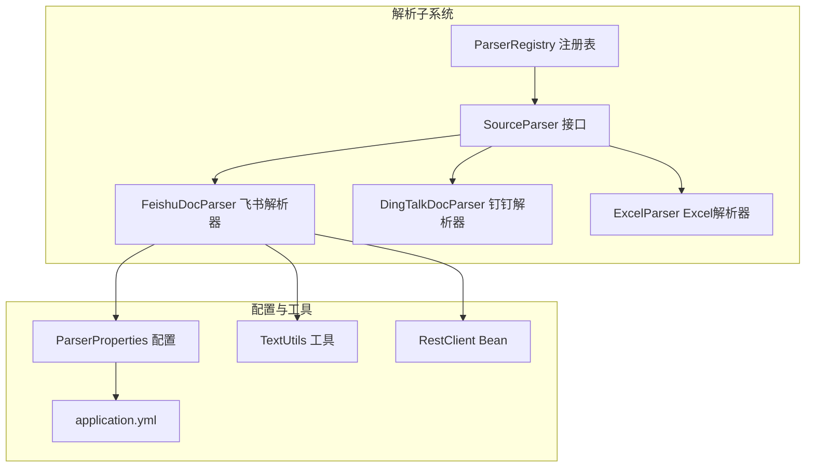
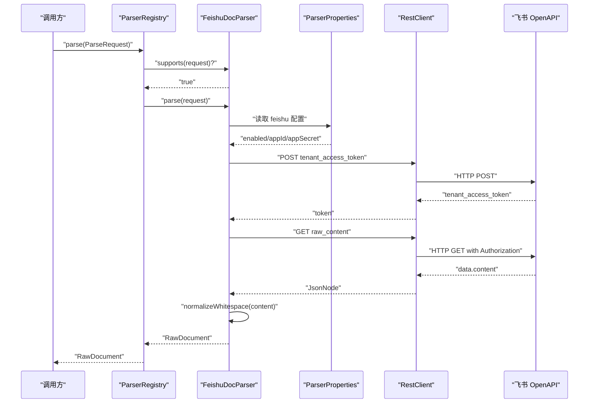
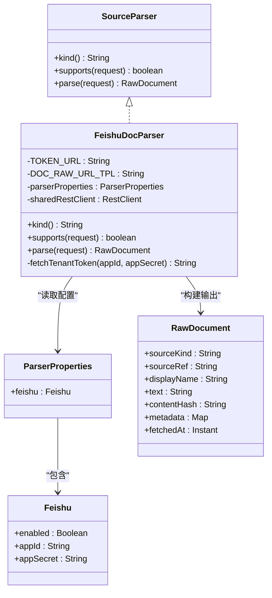
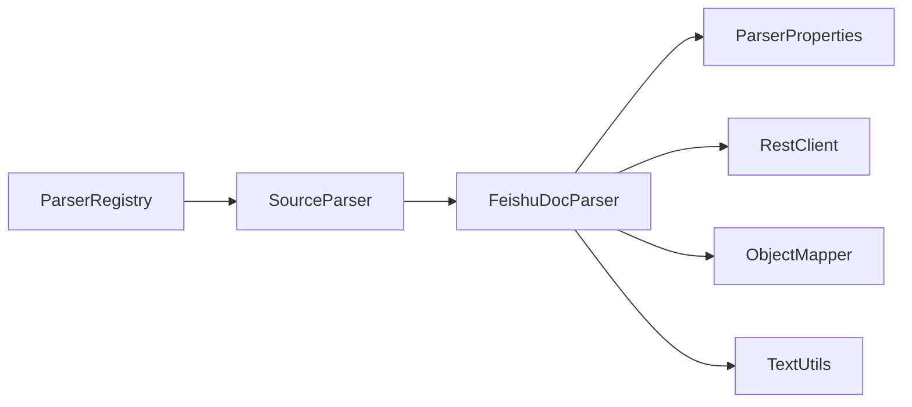
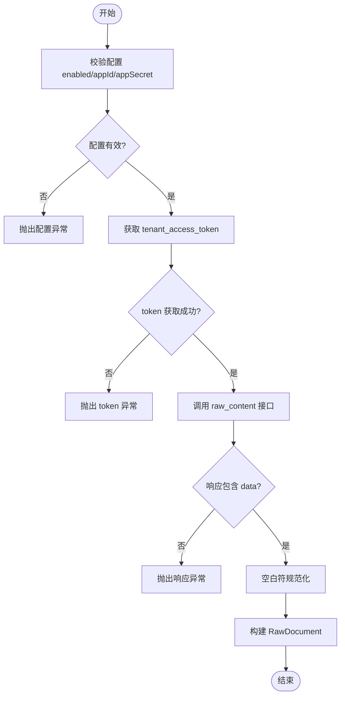

# 飞书文档解析器

<cite>
**本文引用的文件**
- [FeishuDocParser.java](file://src/main/java/com/example/llmwiki/parser/impl/FeishuDocParser.java)
- [ParserProperties.java](file://src/main/java/com/example/llmwiki/config/ParserProperties.java)
- [application.yml](file://src/main/resources/application.yml)
- [SourceParser.java](file://src/main/java/com/example/llmwiki/parser/SourceParser.java)
- [ParseRequest.java](file://src/main/java/com/example/llmwiki/parser/ParseRequest.java)
- [ParserRegistry.java](file://src/main/java/com/example/llmwiki/parser/ParserRegistry.java)
- [RawDocument.java](file://src/main/java/com/example/llmwiki/domain/RawDocument.java)
- [TextUtils.java](file://src/main/java/com/example/llmwiki/util/TextUtils.java)
- [WebConfig.java](file://src/main/java/com/example/llmwiki/config/WebConfig.java)
- [ParserException.java](file://src/main/java/com/example/llmwiki/parser/ParserException.java)
</cite>

## 目录
1. [简介](#简介)
2. [项目结构](#项目结构)
3. [核心组件](#核心组件)
4. [架构总览](#架构总览)
5. [详细组件分析](#详细组件分析)
6. [依赖分析](#依赖分析)
7. [性能考虑](#性能考虑)
8. [故障排查指南](#故障排查指南)
9. [结论](#结论)
10. [附录](#附录)

## 简介
本文件面向飞书文档解析器的技术文档，系统性阐述其设计与实现：如何通过飞书官方 OpenAPI 获取文档内容，支持飞书多维表格、文档、知识库等内容类型的统一接入；详细说明集成流程（API 认证、权限验证、文档 ID 解析、内容拉取、格式转换）、关键特性（实时同步、权限控制、版本管理、增量更新）、处理逻辑（API 调用、数据转换、内容标准化、元数据保留）、配置参数（API 密钥管理、请求频率限制、超时设置、重试策略）以及错误处理（API 限流、认证失败、权限不足、网络异常）。

## 项目结构
飞书解析器位于解析子系统中，采用“统一接口 + 注册表 + 具体实现”的分层架构：
- 接口层：定义统一的解析器接口，约束类型标识、能力判定与解析行为
- 实现层：具体解析器实现（如飞书、钉钉、Excel 等）
- 配置层：解析器相关配置（含飞书 app_id/app_secret 等）
- 工具层：通用文本处理与哈希计算
- 运行时：注册表按优先级选择解析器并执行

图表来源
- [FeishuDocParser.java:33-100](file://src/main/java/com/example/llmwiki/parser/impl/FeishuDocParser.java#L33-L100)
- [ParserRegistry.java:27-35](file://src/main/java/com/example/llmwiki/parser/ParserRegistry.java#L27-L35)
- [ParserProperties.java:16-27](file://src/main/java/com/example/llmwiki/config/ParserProperties.java#L16-L27)
- [application.yml:58-62](file://src/main/resources/application.yml#L58-L62)
- [TextUtils.java:26-41](file://src/main/java/com/example/llmwiki/util/TextUtils.java#L26-L41)
- [WebConfig.java:30-33](file://src/main/java/com/example/llmwiki/config/WebConfig.java#L30-L33)

章节来源
- [FeishuDocParser.java:19-28](file://src/main/java/com/example/llmwiki/parser/impl/FeishuDocParser.java#L19-L28)
- [ParserRegistry.java:10-15](file://src/main/java/com/example/llmwiki/parser/ParserRegistry.java#L10-L15)
- [ParserProperties.java:7-12](file://src/main/java/com/example/llmwiki/config/ParserProperties.java#L7-L12)

## 核心组件
- 飞书解析器（FeishuDocParser）
  - 实现 SourceParser 接口，负责飞书文档内容的获取与标准化
  - 通过配置中心读取 app_id/app_secret，调用飞书 OpenAPI 获取 tenant_access_token，并据此访问文档 raw_content 接口
  - 将响应内容进行空白符规范化，生成标准化的 RawDocument 输出
- 解析器注册表（ParserRegistry）
  - 维护所有 SourceParser 实例，按 supports 判定选择首个匹配的解析器执行
- 配置属性（ParserProperties）
  - 提供 llm-wiki.parser.feishu.enabled、app-id、app-secret 等配置项
- 请求模型（ParseRequest）
  - 统一封装 kind/ref/displayName/mime 等字段，作为解析输入
- 原始文档模型（RawDocument）
  - 标准化输出结构，包含 sourceKind/sourceRef/displayName/text/contentHash/metadata/fetchedAt 等
- 工具类（TextUtils）
  - 提供 SHA256 哈希、空白符规范化、slugify 等通用方法
- REST 客户端（WebConfig.sharedRestClient）
  - 提供共享的 RestClient Bean，供解析器与外部 API 通信

章节来源
- [FeishuDocParser.java:42-83](file://src/main/java/com/example/llmwiki/parser/impl/FeishuDocParser.java#L42-L83)
- [ParserRegistry.java:27-35](file://src/main/java/com/example/llmwiki/parser/ParserRegistry.java#L27-L35)
- [ParserProperties.java:22-27](file://src/main/java/com/example/llmwiki/config/ParserProperties.java#L22-L27)
- [ParseRequest.java:18-34](file://src/main/java/com/example/llmwiki/parser/ParseRequest.java#L18-L34)
- [RawDocument.java:20-51](file://src/main/java/com/example/llmwiki/domain/RawDocument.java#L20-L51)
- [TextUtils.java:26-71](file://src/main/java/com/example/llmwiki/util/TextUtils.java#L26-L71)
- [WebConfig.java:30-33](file://src/main/java/com/example/llmwiki/config/WebConfig.java#L30-L33)

## 架构总览
飞书解析器的调用链路如下：
- 应用启动时，WebConfig 注入共享 RestClient
- ParserRegistry 根据 ParseRequest.kind 选择 FeishuDocParser
- FeishuDocParser 从 ParserProperties 读取飞书配置，校验启用状态与凭证
- 通过飞书 OpenAPI 获取 tenant_access_token
- 使用 token 调用文档 raw_content 接口，提取 content 字段
- 使用 TextUtils 规范化空白符，生成 RawDocument 返回

图表来源
- [ParserRegistry.java:27-35](file://src/main/java/com/example/llmwiki/parser/ParserRegistry.java#L27-L35)
- [FeishuDocParser.java:53-83](file://src/main/java/com/example/llmwiki/parser/impl/FeishuDocParser.java#L53-L83)
- [ParserProperties.java:54-58](file://src/main/java/com/example/llmwiki/config/ParserProperties.java#L54-L58)
- [WebConfig.java:30-33](file://src/main/java/com/example/llmwiki/config/WebConfig.java#L30-L33)

## 详细组件分析

### 飞书解析器（FeishuDocParser）
- 类职责
  - 实现 SourceParser 接口，提供飞书文档解析能力
  - 通过 tenant_access_token 访问飞书 docx raw_content 接口
  - 将响应内容标准化为 RawDocument
- 关键实现要点
  - 配置校验：enabled 且 app_id 非空才允许解析
  - Token 获取：构造 JSON 请求体，POST 至飞书 token 接口
  - 文档内容获取：GET raw_content，解析 data.content
  - 内容标准化：空白符规范化，计算 contentHash
- 错误处理
  - 配置缺失、token 获取失败、API 返回异常、解析异常均包装为 ParserException 抛出

图表来源
- [SourceParser.java:11-21](file://src/main/java/com/example/llmwiki/parser/SourceParser.java#L11-L21)
- [FeishuDocParser.java:33-100](file://src/main/java/com/example/llmwiki/parser/impl/FeishuDocParser.java#L33-L100)
- [ParserProperties.java:16-27](file://src/main/java/com/example/llmwiki/config/ParserProperties.java#L16-L27)
- [RawDocument.java:20-51](file://src/main/java/com/example/llmwiki/domain/RawDocument.java#L20-L51)

章节来源
- [FeishuDocParser.java:42-83](file://src/main/java/com/example/llmwiki/parser/impl/FeishuDocParser.java#L42-L83)
- [FeishuDocParser.java:85-99](file://src/main/java/com/example/llmwiki/parser/impl/FeishuDocParser.java#L85-L99)

### 解析器注册表（ParserRegistry）
- 职责
  - 维护 SourceParser 列表，按 supports(request) 匹配首个实现并执行 parse
  - 若无匹配解析器，抛出 ParserException
- 设计意义
  - 保证解析器扩展性与统一入口，便于新增第三方来源

章节来源
- [ParserRegistry.java:27-35](file://src/main/java/com/example/llmwiki/parser/ParserRegistry.java#L27-L35)

### 配置与运行时
- 配置项（application.yml）
  - llm-wiki.parser.feishu.enabled：是否启用飞书解析
  - llm-wiki.parser.feishu.app-id：飞书应用 app_id
  - llm-wiki.parser.feishu.app-secret：飞书应用 app_secret
- 运行时客户端
  - WebConfig.sharedRestClient：全局共享的 RestClient Bean，供解析器复用

章节来源
- [application.yml:58-62](file://src/main/resources/application.yml#L58-L62)
- [WebConfig.java:30-33](file://src/main/java/com/example/llmwiki/config/WebConfig.java#L30-L33)

## 依赖分析
- 组件耦合
  - FeishuDocParser 依赖 ParserProperties、RestClient、ObjectMapper、TextUtils
  - ParserRegistry 依赖 Spring 注入的 SourceParser 列表
- 外部依赖
  - 飞书 OpenAPI：tenant_access_token 与 docx raw_content 接口
- 可能的循环依赖
  - 当前模块未见循环依赖迹象

图表来源
- [FeishuDocParser.java:38-40](file://src/main/java/com/example/llmwiki/parser/impl/FeishuDocParser.java#L38-L40)
- [ParserRegistry.java:22](file://src/main/java/com/example/llmwiki/parser/ParserRegistry.java#L22)

章节来源
- [FeishuDocParser.java:38-40](file://src/main/java/com/example/llmwiki/parser/impl/FeishuDocParser.java#L38-L40)
- [ParserRegistry.java:22](file://src/main/java/com/example/llmwiki/parser/ParserRegistry.java#L22)

## 性能考虑
- 并发与线程
  - 当前解析工作线程数由 ingest.worker-threads 控制，默认为 1，建议根据吞吐需求调整
- 请求频率限制
  - 未内置显式限流策略，建议结合业务场景在上游服务或网关层实施限流
- 超时与重试
  - RestClient 默认超时未在代码中显式设置，可在 WebConfig 中统一配置
  - 未实现自动重试，建议在上层调用处增加幂等与重试策略
- 增量更新
  - 已通过 contentHash 支持内容指纹比对，可用于增量缓存与去重

章节来源
- [application.yml:76](file://src/main/resources/application.yml#L76)
- [RawDocument.java:34](file://src/main/java/com/example/llmwiki/domain/RawDocument.java#L34)

## 故障排查指南
- 飞书未启用或未配置 app_id/app_secret
  - 现象：解析直接抛出 ParserException
  - 处理：检查 application.yml 中 llm-wiki.parser.feishu.enabled、app-id、app-secret
- 获取飞书 token 失败
  - 现象：响应缺少 tenant_access_token 或为空
  - 处理：核对 app_id/app_secret 正确性与网络可达性
- 飞书返回异常
  - 现象：raw_content 接口响应缺少 data 字段
  - 处理：确认文档 token 正确、用户具备访问权限
- 网络异常或超时
  - 现象：HTTP 请求失败或超时
  - 处理：检查网络连通性、代理设置、防火墙策略
- 权限不足
  - 现象：飞书返回 403/401
  - 处理：确认应用权限范围与文档可见性设置

章节来源
- [FeishuDocParser.java:55-58](file://src/main/java/com/example/llmwiki/parser/impl/FeishuDocParser.java#L55-L58)
- [FeishuDocParser.java:95-97](file://src/main/java/com/example/llmwiki/parser/impl/FeishuDocParser.java#L95-L97)
- [FeishuDocParser.java:68-70](file://src/main/java/com/example/llmwiki/parser/impl/FeishuDocParser.java#L68-L70)
- [ParserException.java:9-18](file://src/main/java/com/example/llmwiki/parser/ParserException.java#L9-L18)

## 结论
飞书文档解析器以简洁的实现完成飞书 OpenAPI 的集成，具备明确的配置入口、统一的解析输出与完善的错误处理。通过 contentHash 支持增量更新，配合注册表机制可平滑扩展更多内容来源。建议在生产环境中补充超时与重试策略、在上游实施限流与鉴权，并持续监控 API 响应与权限状态以保障稳定性。

## 附录

### 集成流程与处理逻辑
- 集成流程
  - 配置启用与凭证校验 → 获取 tenant_access_token → 调用 raw_content → 解析 content → 标准化输出
- 处理逻辑
  - API 调用：使用共享 RestClient 发起 HTTP 请求
  - 数据转换：JSON 解析、空白符规范化
  - 内容标准化：统一 RawDocument 结构
  - 元数据保留：当前实现主要保留文本与指纹，可扩展至作者、创建时间等

图表来源
- [FeishuDocParser.java:55-58](file://src/main/java/com/example/llmwiki/parser/impl/FeishuDocParser.java#L55-L58)
- [FeishuDocParser.java:95-97](file://src/main/java/com/example/llmwiki/parser/impl/FeishuDocParser.java#L95-L97)
- [FeishuDocParser.java:68-70](file://src/main/java/com/example/llmwiki/parser/impl/FeishuDocParser.java#L68-L70)
- [TextUtils.java:66-71](file://src/main/java/com/example/llmwiki/util/TextUtils.java#L66-L71)

### 配置参数清单
- 飞书解析器配置（application.yml）
  - llm-wiki.parser.feishu.enabled：是否启用飞书解析
  - llm-wiki.parser.feishu.app-id：飞书应用 app_id
  - llm-wiki.parser.feishu.app-secret：飞书应用 app_secret
- 全局解析器配置
  - llm-wiki.ingest.max-retry：最大重试次数
  - llm-wiki.ingest.worker-threads：解析工作线程数
- 运行时客户端
  - WebConfig.sharedRestClient：共享 RestClient Bean

章节来源
- [application.yml:58-62](file://src/main/resources/application.yml#L58-L62)
- [application.yml:75-76](file://src/main/resources/application.yml#L75-L76)
- [WebConfig.java:30-33](file://src/main/java/com/example/llmwiki/config/WebConfig.java#L30-L33)