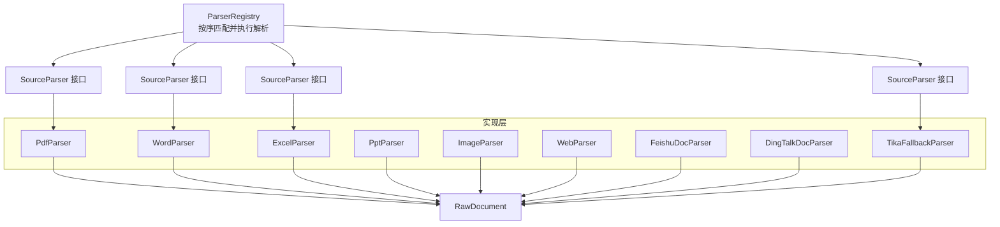
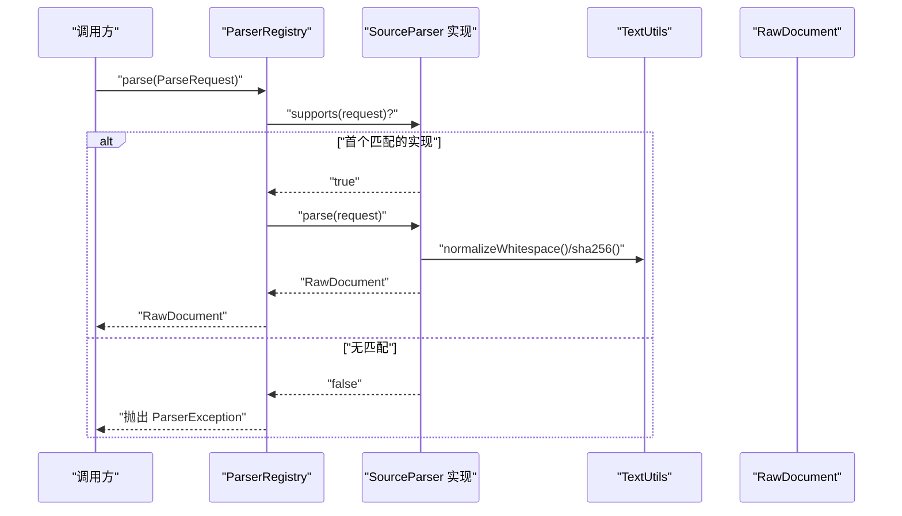
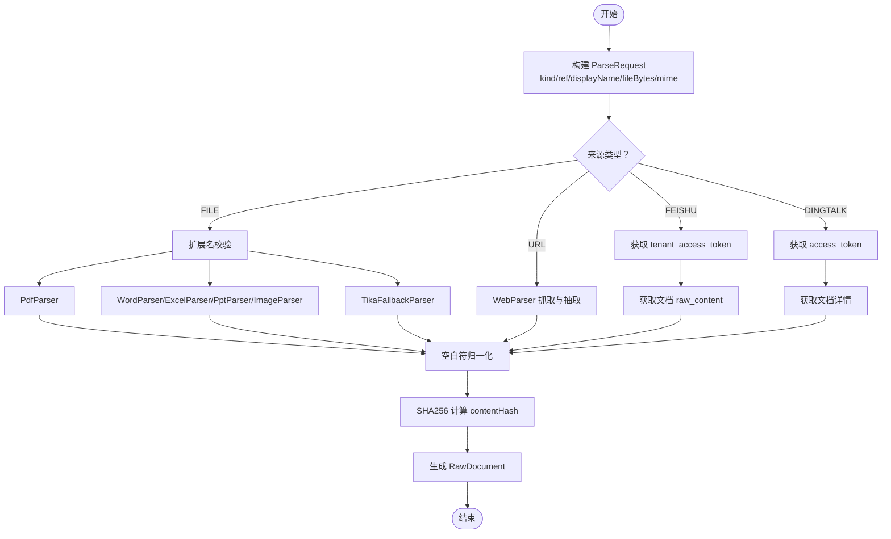
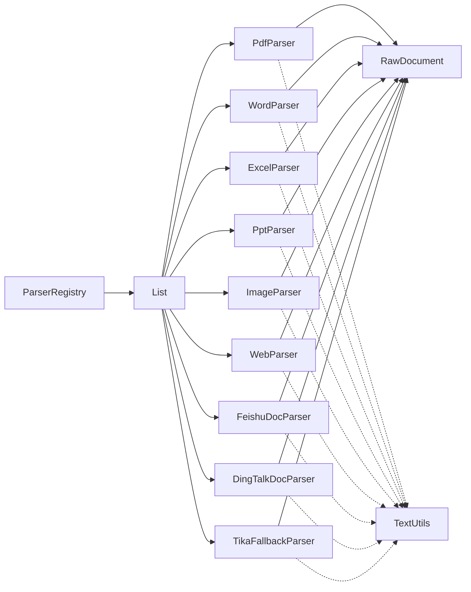

# 文档解析器系统

<cite>
**本文引用的文件**
- [ParserRegistry.java](file://src/main/java/com/example/llmwiki/parser/ParserRegistry.java)
- [SourceParser.java](file://src/main/java/com/example/llmwiki/parser/SourceParser.java)
- [ParseRequest.java](file://src/main/java/com/example/llmwiki/parser/ParseRequest.java)
- [ParserException.java](file://src/main/java/com/example/llmwiki/parser/ParserException.java)
- [PdfParser.java](file://src/main/java/com/example/llmwiki/parser/impl/PdfParser.java)
- [WordParser.java](file://src/main/java/com/example/llmwiki/parser/impl/WordParser.java)
- [ExcelParser.java](file://src/main/java/com/example/llmwiki/parser/impl/ExcelParser.java)
- [PptParser.java](file://src/main/java/com/example/llmwiki/parser/impl/PptParser.java)
- [ImageParser.java](file://src/main/java/com/example/llmwiki/parser/impl/ImageParser.java)
- [WebParser.java](file://src/main/java/com/example/llmwiki/parser/impl/WebParser.java)
- [FeishuDocParser.java](file://src/main/java/com/example/llmwiki/parser/impl/FeishuDocParser.java)
- [DingTalkDocParser.java](file://src/main/java/com/example/llmwiki/parser/impl/DingTalkDocParser.java)
- [TikaFallbackParser.java](file://src/main/java/com/example/llmwiki/parser/impl/TikaFallbackParser.java)
- [RawDocument.java](file://src/main/java/com/example/llmwiki/domain/RawDocument.java)
- [TextUtils.java](file://src/main/java/com/example/llmwiki/util/TextUtils.java)
</cite>

## 目录
1. [简介](#简介)
2. [项目结构](#项目结构)
3. [核心组件](#核心组件)
4. [架构总览](#架构总览)
5. [详细组件分析](#详细组件分析)
6. [依赖分析](#依赖分析)
7. [性能考虑](#性能考虑)
8. [故障排查指南](#故障排查指南)
9. [结论](#结论)
10. [附录：扩展开发指南](#附录扩展开发指南)

## 简介
本文件面向“LLM Wiki 文档解析器系统”，聚焦以下目标：
- 解释 ParserRegistry 的设计原理：统一管理多种文档格式解析器的注册与调用机制。
- 阐述 SourceParser 接口的设计：标准化的解析器抽象，支持不同格式文档的统一处理。
- 梳理支持的文档格式及其实现：PDF、Word、Excel、PPT、图片、网页、飞书文档、钉钉文档等。
- 说明解析请求 ParseRequest 的数据结构、参数校验与格式转换要点。
- 提供扩展开发指南：如何实现新的 SourceParser 接口以支持新格式。
- 解析性能优化建议：内存管理、并发处理、缓存策略。

## 项目结构
解析器子系统位于 parser 包下，采用“接口 + 多实现 + 注册表”的分层设计：
- 接口层：SourceParser 定义统一抽象。
- 实现层：各格式解析器实现 SourceParser。
- 调度层：ParserRegistry 按顺序匹配首个 supports 成功的实现并执行 parse。
- 输出层：所有解析器统一输出 RawDocument，供后续摄入流水线使用。

图表来源
- [ParserRegistry.java:27-35](file://src/main/java/com/example/llmwiki/parser/ParserRegistry.java#L27-L35)
- [SourceParser.java:11-21](file://src/main/java/com/example/llmwiki/parser/SourceParser.java#L11-L21)
- [PdfParser.java:38](file://src/main/java/com/example/llmwiki/parser/impl/PdfParser.java#L38)
- [WordParser.java:27](file://src/main/java/com/example/llmwiki/parser/impl/WordParser.java#L27)
- [ExcelParser.java:29](file://src/main/java/com/example/llmwiki/parser/impl/ExcelParser.java#L29)
- [PptParser.java:30](file://src/main/java/com/example/llmwiki/parser/impl/PptParser.java#L30)
- [ImageParser.java:27](file://src/main/java/com/example/llmwiki/parser/impl/ImageParser.java#L27)
- [WebParser.java:27](file://src/main/java/com/example/llmwiki/parser/impl/WebParser.java#L27)
- [FeishuDocParser.java:33](file://src/main/java/com/example/llmwiki/parser/impl/FeishuDocParser.java#L33)
- [DingTalkDocParser.java:32](file://src/main/java/com/example/llmwiki/parser/impl/DingTalkDocParser.java#L32)
- [TikaFallbackParser.java:23](file://src/main/java/com/example/llmwiki/parser/impl/TikaFallbackParser.java#L23)
- [RawDocument.java:18-51](file://src/main/java/com/example/llmwiki/domain/RawDocument.java#L18-L51)

章节来源
- [ParserRegistry.java:16-36](file://src/main/java/com/example/llmwiki/parser/ParserRegistry.java#L16-L36)
- [SourceParser.java:5-21](file://src/main/java/com/example/llmwiki/parser/SourceParser.java#L5-L21)

## 核心组件
- ParserRegistry：遍历已注入的 SourceParser 列表，按顺序调用 supports 判断是否匹配，命中后立即执行 parse 并返回 RawDocument；若无匹配，则抛出 ParserException。
- SourceParser：定义 kind()/supports()/parse() 三要素，确保所有解析器具备统一的“类型标识 + 能力判定 + 解析执行”接口。
- ParseRequest：封装解析输入，包括 kind/ref/displayName/fileBytes/mime 等字段，覆盖 FILE/URL/FEISHU/DINGTALK 四类来源。
- ParserException：统一的解析异常类型，便于上层捕获与提示。
- RawDocument：标准化输出结构，包含 sourceKind/sourceRef/displayName/text/contentHash/language/imageCaptions/metadata/fetchedAt 等字段。

章节来源
- [ParserRegistry.java:27-35](file://src/main/java/com/example/llmwiki/parser/ParserRegistry.java#L27-L35)
- [SourceParser.java:11-21](file://src/main/java/com/example/llmwiki/parser/SourceParser.java#L11-L21)
- [ParseRequest.java:18-34](file://src/main/java/com/example/llmwiki/parser/ParseRequest.java#L18-L34)
- [ParserException.java:9-18](file://src/main/java/com/example/llmwiki/parser/ParserException.java#L9-L18)
- [RawDocument.java:18-51](file://src/main/java/com/example/llmwiki/domain/RawDocument.java#L18-L51)

## 架构总览
解析流程从 ParserRegistry 开始，依据 ParseRequest 的 kind/ref 选择对应 SourceParser 实现，完成文本抽取与可选的图像 caption 后，统一产出 RawDocument。

图表来源
- [ParserRegistry.java:27-35](file://src/main/java/com/example/llmwiki/parser/ParserRegistry.java#L27-L35)
- [SourceParser.java:16-20](file://src/main/java/com/example/llmwiki/parser/SourceParser.java#L16-L20)
- [TextUtils.java:26-41](file://src/main/java/com/example/llmwiki/util/TextUtils.java#L26-L41)
- [RawDocument.java:18-51](file://src/main/java/com/example/llmwiki/domain/RawDocument.java#L18-L51)

## 详细组件分析

### ParserRegistry 设计与行为
- 通过构造注入 List<SourceParser>，利用 Spring 的自动装配收集所有实现。
- parse() 方法按顺序遍历，遇到第一个 supports(request) 返回 true 的实现即停止并执行 parse()。
- 若遍历结束仍未找到匹配实现，抛出 ParserException，包含 kind/ref 信息以便定位问题。

章节来源
- [ParserRegistry.java:21-35](file://src/main/java/com/example/llmwiki/parser/ParserRegistry.java#L21-L35)

### SourceParser 接口
- kind()：返回解析器类型标识，通常与 SourceRecord.getKind() 对应或为 MIME 标签。
- supports(ParseRequest)：根据请求内容判断是否能处理该来源。
- parse(ParseRequest)：执行解析并返回 RawDocument。

章节来源
- [SourceParser.java:11-21](file://src/main/java/com/example/llmwiki/parser/SourceParser.java#L11-L21)

### ParseRequest 数据结构与用途
- 字段：kind/ref/displayName/fileBytes/mime。
- 支持来源：
  - FILE：本地文件，可通过 displayName 或 ref 推断扩展名，必要时使用 fileBytes。
  - URL：网页链接，由 WebParser 抓取。
  - FEISHU：飞书文档 token，由 FeishuDocParser 通过 OpenAPI 获取。
  - DINGTALK：钉钉文档 token，由 DingTalkDocParser 通过 OpenAPI 获取。
- 参数校验：部分实现会在 supports 中进行扩展名/来源类型校验；网络解析器会进行配置可用性检查。

章节来源
- [ParseRequest.java:18-34](file://src/main/java/com/example/llmwiki/parser/ParseRequest.java#L18-L34)

### 解析器实现概览与特性

#### PDF 解析器（PdfParser）
- 能力：基于 PDFBox 抽取文本，可选调用 VisionClient 为嵌入图片生成 caption。
- 特殊处理：
  - 限制最多处理前 20 页图片，避免高成本。
  - 使用 try-with-resources 确保 PDDocument 正确关闭。
- 错误处理：图片 caption 失败被记录为 debug 日志；提取图片失败记录 warn 日志。
- 输出：text 经过空白符归一化；contentHash 基于文本与 caption 拼接结果计算。

章节来源
- [PdfParser.java:38-113](file://src/main/java/com/example/llmwiki/parser/impl/PdfParser.java#L38-L113)
- [TextUtils.java:66-71](file://src/main/java/com/example/llmwiki/util/TextUtils.java#L66-L71)

#### Word 解析器（WordParser）
- 能力：支持 .doc 与 .docx，分别使用 HWPFDocument/XWPFDocument。
- 特殊处理：根据扩展名选择不同读取器；使用 try-with-resources 确保资源释放。
- 输出：text 经空白符归一化；contentHash 基于纯文本计算。

章节来源
- [WordParser.java:27-67](file://src/main/java/com/example/llmwiki/parser/impl/WordParser.java#L27-L67)

#### Excel 解析器（ExcelParser）
- 能力：支持 .xls 与 .xlsx，按 sheet/row/cell 展开为 Markdown 表格。
- 特殊处理：限制最多处理 2000 行，避免超大数据集导致内存压力。
- 输出：拼接后的表格文本；contentHash 基于最终文本计算。

章节来源
- [ExcelParser.java:29-79](file://src/main/java/com/example/llmwiki/parser/impl/ExcelParser.java#L29-L79)

#### PPT 解析器（PptParser）
- 能力：支持 .ppt 与 .pptx，遍历幻灯片并抽取文本形状内容。
- 特殊处理：.pptx 使用 XSLF，.ppt 使用 HSLF；统一追加“Slide N”标题。
- 输出：拼接后的文本；contentHash 基于最终文本计算。

章节来源
- [PptParser.java:30-83](file://src/main/java/com/example/llmwiki/parser/impl/PptParser.java#L30-L83)

#### 图片解析器（ImageParser）
- 能力：调用 VisionClient 生成图片 caption；若未启用则仅记录元信息。
- 特殊处理：限定常见图片扩展名；当未启用 Vision 时记录日志并返回简要文本。
- 输出：包含 caption 的文本；contentHash 基于最终文本计算。

章节来源
- [ImageParser.java:27-71](file://src/main/java/com/example/llmwiki/parser/impl/ImageParser.java#L27-L71)

#### 网页解析器（WebParser）
- 能力：使用 Jsoup 抓取页面，Readability4J 抽取主体内容。
- 特殊处理：设置合理的 user-agent、超时与重定向策略；优先使用 Readability4J 的标题与正文。
- 输出：带标题的正文文本；contentHash 基于最终文本计算；附加元信息（url/title）。

章节来源
- [WebParser.java:27-70](file://src/main/java/com/example/llmwiki/parser/impl/WebParser.java#L27-L70)

#### 飞书文档解析器（FeishuDocParser）
- 能力：通过飞书 OpenAPI v1 获取 docx 原始内容。
- 特殊处理：先获取 tenant_access_token，再请求文档 raw_content；需要在配置中启用并填写凭证。
- 错误处理：配置不可用或接口返回异常时抛 ParserException。

章节来源
- [FeishuDocParser.java:33-101](file://src/main/java/com/example/llmwiki/parser/impl/FeishuDocParser.java#L33-L101)

#### 钉钉文档解析器（DingTalkDocParser）
- 能力：通过钉钉 OpenAPI 获取文档内容。
- 特殊处理：先获取 access_token，再请求文档详情；需要在配置中启用并填写凭证。
- 错误处理：配置不可用或接口返回异常时抛 ParserException。

章节来源
- [DingTalkDocParser.java:32-101](file://src/main/java/com/example/llmwiki/parser/impl/DingTalkDocParser.java#L32-L101)

#### Tika 兜底解析器（TikaFallbackParser）
- 能力：使用 Apache Tika 解析 txt/md/html/csv 等文本类格式。
- 特殊处理：作为兜底实现，通常具有最低优先级（Order 较大）。
- 输出：解析后的文本；contentHash 基于最终文本计算。

章节来源
- [TikaFallbackParser.java:23-49](file://src/main/java/com/example/llmwiki/parser/impl/TikaFallbackParser.java#L23-L49)

### 解析请求处理流程（含参数校验与格式转换）
- 参数校验：
  - FILE 来源：通过扩展名判断（如 .pdf/.doc/.xls 等）。
  - URL/FEISHU/DINGTALK：通过 kind 字段直接判定。
  - 网络解析器：检查配置开关与凭证是否有效。
- 格式转换：
  - 文本空白符归一化：统一替换为单个空格并 trim。
  - 内容指纹：使用 SHA256 计算 contentHash，用于去重与增量缓存。
  - 元信息：网页解析器附加 url/title 等键值。

图表来源
- [ParseRequest.java:18-34](file://src/main/java/com/example/llmwiki/parser/ParseRequest.java#L18-L34)
- [PdfParser.java:48-77](file://src/main/java/com/example/llmwiki/parser/impl/PdfParser.java#L48-L77)
- [WordParser.java:35-65](file://src/main/java/com/example/llmwiki/parser/impl/WordParser.java#L35-L65)
- [ExcelParser.java:37-77](file://src/main/java/com/example/llmwiki/parser/impl/ExcelParser.java#L37-L77)
- [PptParser.java:38-81](file://src/main/java/com/example/llmwiki/parser/impl/PptParser.java#L38-L81)
- [ImageParser.java:39-69](file://src/main/java/com/example/llmwiki/parser/impl/ImageParser.java#L39-L69)
- [WebParser.java:34-68](file://src/main/java/com/example/llmwiki/parser/impl/WebParser.java#L34-L68)
- [FeishuDocParser.java:54-82](file://src/main/java/com/example/llmwiki/parser/impl/FeishuDocParser.java#L54-L82)
- [DingTalkDocParser.java:54-82](file://src/main/java/com/example/llmwiki/parser/impl/DingTalkDocParser.java#L54-L82)
- [TikaFallbackParser.java:33-47](file://src/main/java/com/example/llmwiki/parser/impl/TikaFallbackParser.java#L33-L47)
- [TextUtils.java:26-71](file://src/main/java/com/example/llmwiki/util/TextUtils.java#L26-L71)
- [RawDocument.java:18-51](file://src/main/java/com/example/llmwiki/domain/RawDocument.java#L18-L51)

## 依赖分析
- ParserRegistry 依赖 List<SourceParser>，通过 Spring 自动装配注入。
- 各 SourceParser 实现依赖各自第三方库（如 PDFBox、Apache POI、Jsoup、Readability4J、Apache Tika、RestClient 等）。
- 输出统一为 RawDocument，便于后续摄入与检索模块复用。
- 文本处理依赖 TextUtils 工具类，提供空白符归一化与 SHA256 计算。

图表来源
- [ParserRegistry.java:22](file://src/main/java/com/example/llmwiki/parser/ParserRegistry.java#L22)
- [PdfParser.java:38](file://src/main/java/com/example/llmwiki/parser/impl/PdfParser.java#L38)
- [WordParser.java:27](file://src/main/java/com/example/llmwiki/parser/impl/WordParser.java#L27)
- [ExcelParser.java:29](file://src/main/java/com/example/llmwiki/parser/impl/ExcelParser.java#L29)
- [PptParser.java:30](file://src/main/java/com/example/llmwiki/parser/impl/PptParser.java#L30)
- [ImageParser.java:27](file://src/main/java/com/example/llmwiki/parser/impl/ImageParser.java#L27)
- [WebParser.java:27](file://src/main/java/com/example/llmwiki/parser/impl/WebParser.java#L27)
- [FeishuDocParser.java:33](file://src/main/java/com/example/llmwiki/parser/impl/FeishuDocParser.java#L33)
- [DingTalkDocParser.java:32](file://src/main/java/com/example/llmwiki/parser/impl/DingTalkDocParser.java#L32)
- [TikaFallbackParser.java:23](file://src/main/java/com/example/llmwiki/parser/impl/TikaFallbackParser.java#L23)
- [TextUtils.java:15-80](file://src/main/java/com/example/llmwiki/util/TextUtils.java#L15-L80)
- [RawDocument.java:18-51](file://src/main/java/com/example/llmwiki/domain/RawDocument.java#L18-L51)

章节来源
- [ParserRegistry.java:21-35](file://src/main/java/com/example/llmwiki/parser/ParserRegistry.java#L21-L35)

## 性能考虑
- 内存管理
  - 大多数实现使用 try-with-resources 确保流与文档对象及时释放，避免内存泄漏。
  - PDF 解析限制最多处理 20 页图片；Excel 解析限制最多 2000 行，防止超大数据集导致 OOM。
- 并发处理
  - 当前解析器为同步阻塞实现；建议在上层队列或调度层引入异步/并发执行，避免阻塞主线程。
- 缓存策略
  - RawDocument.contentHash 可用于去重与增量缓存；建议在摄入流水线上层基于 contentHash 进行命中判断，减少重复解析。
- I/O 与网络
  - 网页抓取设置合理超时与重定向；网络解析器在配置不可用时快速失败，避免无效重试。

章节来源
- [PdfParser.java:84-86](file://src/main/java/com/example/llmwiki/parser/impl/PdfParser.java#L84-L86)
- [ExcelParser.java:53-54](file://src/main/java/com/example/llmwiki/parser/impl/ExcelParser.java#L53-L54)
- [WebParser.java:42-46](file://src/main/java/com/example/llmwiki/parser/impl/WebParser.java#L42-L46)
- [RawDocument.java:34](file://src/main/java/com/example/llmwiki/domain/RawDocument.java#L34)

## 故障排查指南
- 找不到匹配的解析器
  - 现象：抛出 ParserException，消息包含 kind/ref。
  - 排查：确认 ParseRequest.kind/ref 是否正确；确认对应解析器是否启用且已注入。
- 配置缺失或不合法
  - 网络解析器（飞书/钉钉）：若未启用或缺少凭证，会抛 ParserException。
  - 建议：在配置中启用相应能力并填写完整凭证。
- 网页抓取失败
  - 现象：超时、无法访问或返回空。
  - 建议：检查网络连通性、代理设置、目标站点可访问性；适当调整超时参数。
- 图片解析异常
  - 现象：图片 caption 失败或图片未启用。
  - 建议：确认 VisionClient 是否启用；查看日志中的 debug/warn 提示。

章节来源
- [ParserRegistry.java:34](file://src/main/java/com/example/llmwiki/parser/ParserRegistry.java#L34)
- [FeishuDocParser.java:54-57](file://src/main/java/com/example/llmwiki/parser/impl/FeishuDocParser.java#L54-L57)
- [DingTalkDocParser.java:54-57](file://src/main/java/com/example/llmwiki/parser/impl/DingTalkDocParser.java#L54-L57)
- [PdfParser.java:101-103](file://src/main/java/com/example/llmwiki/parser/impl/PdfParser.java#L101-L103)
- [PdfParser.java:107-109](file://src/main/java/com/example/llmwiki/parser/impl/PdfParser.java#L107-L109)

## 结论
本解析器系统通过 SourceParser 接口实现了多格式文档的统一抽象，ParserRegistry 提供了简洁高效的解析器选择与执行机制。各格式解析器针对自身特点进行了资源管理、成本控制与错误处理，输出标准化的 RawDocument，便于后续摄入与检索。整体设计具备良好的可扩展性与可维护性。

## 附录：扩展开发指南
- 新增解析器步骤
  - 实现 SourceParser 接口，定义 kind()/supports()/parse()。
  - 在 supports 中根据 ParseRequest.kind/ref/displayName/fileBytes/mime 判定是否支持。
  - 在 parse 中完成格式特定的抽取逻辑，使用 TextUtils 进行空白符归一化与 SHA256 计算 contentHash。
  - 将实现类标注为 Spring 组件（如 @Component），并确保被扫描到。
  - 如需优先级控制，使用 @Order 注解指定顺序（数值越小优先级越高）。
- 集成测试建议
  - 准备典型样例文件（PDF/Word/Excel/PPT/图片/网页/飞书/钉钉 token）。
  - 验证 supports 与 parse 的行为，关注边界情况（空内容、超长文本、图片数量等）。
  - 关注日志输出，确保异常场景有明确提示。
- 性能与稳定性
  - 优先使用 try-with-resources 管理资源。
  - 对可能产生大量内容的格式设置上限（如行数/页数）。
  - 在上层引入异步/并发执行，结合 contentHash 做缓存与去重。

章节来源
- [SourceParser.java:11-21](file://src/main/java/com/example/llmwiki/parser/SourceParser.java#L11-L21)
- [TextUtils.java:26-71](file://src/main/java/com/example/llmwiki/util/TextUtils.java#L26-L71)
- [RawDocument.java:18-51](file://src/main/java/com/example/llmwiki/domain/RawDocument.java#L18-L51)