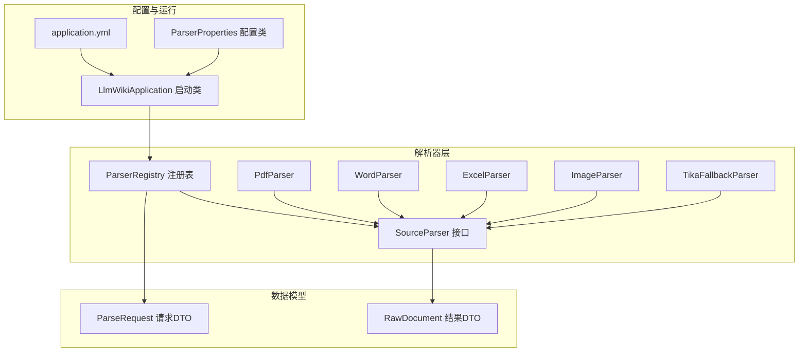
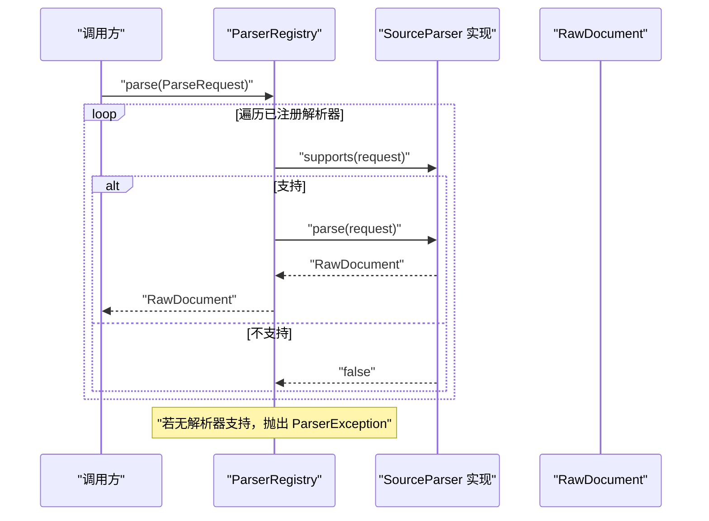
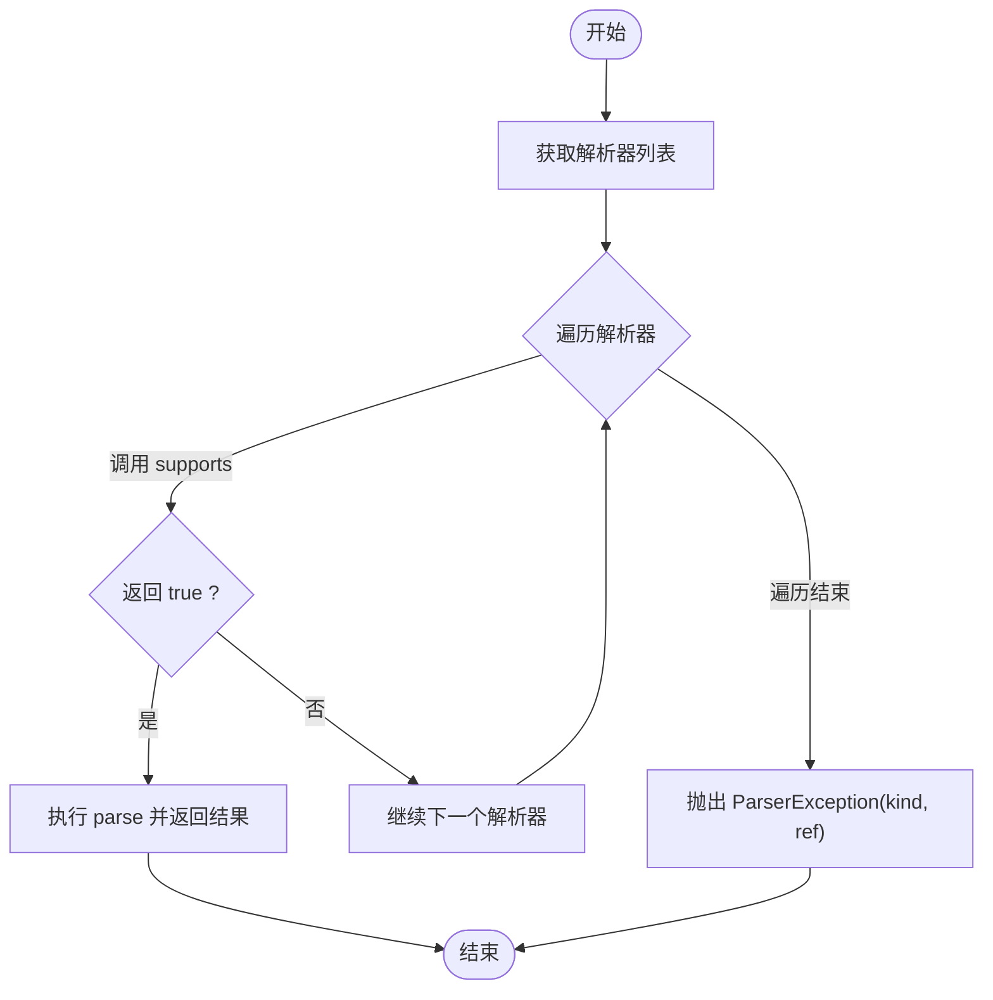
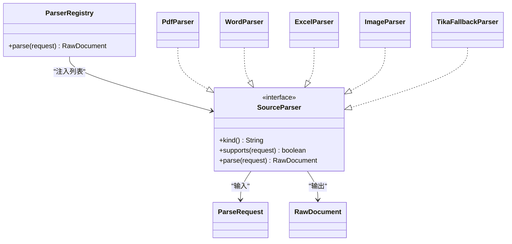

# 解析器注册表

<cite>
**本文引用的文件**
- [ParserRegistry.java](file://src/main/java/com/example/llmwiki/parser/ParserRegistry.java)
- [SourceParser.java](file://src/main/java/com/example/llmwiki/parser/SourceParser.java)
- [ParserException.java](file://src/main/java/com/example/llmwiki/parser/ParserException.java)
- [ParseRequest.java](file://src/main/java/com/example/llmwiki/parser/ParseRequest.java)
- [PdfParser.java](file://src/main/java/com/example/llmwiki/parser/impl/PdfParser.java)
- [WordParser.java](file://src/main/java/com/example/llmwiki/parser/impl/WordParser.java)
- [ExcelParser.java](file://src/main/java/com/example/llmwiki/parser/impl/ExcelParser.java)
- [ImageParser.java](file://src/main/java/com/example/llmwiki/parser/impl/ImageParser.java)
- [TikaFallbackParser.java](file://src/main/java/com/example/llmwiki/parser/impl/TikaFallbackParser.java)
- [RawDocument.java](file://src/main/java/com/example/llmwiki/domain/RawDocument.java)
- [application.yml](file://src/main/resources/application.yml)
- [ParserProperties.java](file://src/main/java/com/example/llmwiki/config/ParserProperties.java)
- [LlmWikiApplication.java](file://src/main/java/com/example/llmwiki/LlmWikiApplication.java)
</cite>

## 目录
1. [简介](#简介)
2. [项目结构](#项目结构)
3. [核心组件](#核心组件)
4. [架构总览](#架构总览)
5. [组件详解](#组件详解)
6. [依赖关系分析](#依赖关系分析)
7. [性能考量](#性能考量)
8. [故障排查指南](#故障排查指南)
9. [结论](#结论)
10. [附录](#附录)

## 简介
本文件面向“LLM Wiki 解析器注册表”的技术文档，围绕 ParserRegistry 的设计与实现进行深入说明。重点包括：
- 基于 Spring 自动注入的解析器列表管理
- 按顺序匹配解析器的策略与 supports 判断逻辑
- 解析器选择算法流程与错误处理机制
- 注册表的配置与使用（Spring 容器中的装配与生命周期）
- 性能优化建议（查找效率、内存使用、并发安全）

## 项目结构
解析器相关代码位于 parser 包及其子包 impl 下，统一接口 SourceParser 定义了 kind/supports/parse 三要素；ParserRegistry 作为注册表负责按序选择首个匹配的解析器；具体实现由多个文件类型解析器组成，并通过 Spring 的 @Order 进行排序。

图表来源
- [ParserRegistry.java:19-36](file://src/main/java/com/example/llmwiki/parser/ParserRegistry.java#L19-L36)
- [SourceParser.java:11-21](file://src/main/java/com/example/llmwiki/parser/SourceParser.java#L11-L21)
- [PdfParser.java:38-54](file://src/main/java/com/example/llmwiki/parser/impl/PdfParser.java#L38-L54)
- [WordParser.java:27-41](file://src/main/java/com/example/llmwiki/parser/impl/WordParser.java#L27-L41)
- [ExcelParser.java:29-43](file://src/main/java/com/example/llmwiki/parser/impl/ExcelParser.java#L29-L43)
- [ImageParser.java:27-45](file://src/main/java/com/example/llmwiki/parser/impl/ImageParser.java#L27-L45)
- [TikaFallbackParser.java:23-35](file://src/main/java/com/example/llmwiki/parser/impl/TikaFallbackParser.java#L23-L35)
- [ParseRequest.java:18-34](file://src/main/java/com/example/llmwiki/parser/ParseRequest.java#L18-L34)
- [RawDocument.java:20-51](file://src/main/java/com/example/llmwiki/domain/RawDocument.java#L20-L51)
- [LlmWikiApplication.java:19-28](file://src/main/java/com/example/llmwiki/LlmWikiApplication.java#L19-L28)
- [application.yml:58-76](file://src/main/resources/application.yml#L58-L76)
- [ParserProperties.java:13-44](file://src/main/java/com/example/llmwiki/config/ParserProperties.java#L13-L44)

章节来源
- [ParserRegistry.java:1-37](file://src/main/java/com/example/llmwiki/parser/ParserRegistry.java#L1-L37)
- [SourceParser.java:1-22](file://src/main/java/com/example/llmwiki/parser/SourceParser.java#L1-L22)
- [ParseRequest.java:1-35](file://src/main/java/com/example/llmwiki/parser/ParseRequest.java#L1-L35)
- [RawDocument.java:1-52](file://src/main/java/com/example/llmwiki/domain/RawDocument.java#L1-L52)
- [application.yml:1-84](file://src/main/resources/application.yml#L1-L84)
- [ParserProperties.java:1-45](file://src/main/java/com/example/llmwiki/config/ParserProperties.java#L1-L45)
- [LlmWikiApplication.java:1-29](file://src/main/java/com/example/llmwiki/LlmWikiApplication.java#L1-L29)

## 核心组件
- ParserRegistry：负责从 Spring 注入的解析器列表中按序查找并执行解析。其 parse 方法遍历解析器，调用 supports 判断是否匹配，命中后立即执行 parse 并返回结果；若无匹配则抛出 ParserException。
- SourceParser：统一接口，定义 kind（解析器类型标识）、supports（格式匹配）、parse（执行解析）三个方法。
- ParseRequest：解析请求 DTO，封装来源类型、引用、显示名、文件字节、MIME 等字段。
- RawDocument：标准化输出 DTO，统一后续摄入流水线消费的数据结构。
- ParserException：解析异常类型，用于报告“找不到匹配的解析器”等错误。
- 具体解析器实现：PdfParser、WordParser、ExcelParser、ImageParser、TikaFallbackParser 等，均实现 SourceParser 并通过 @Order 控制优先级。

章节来源
- [ParserRegistry.java:19-36](file://src/main/java/com/example/llmwiki/parser/ParserRegistry.java#L19-L36)
- [SourceParser.java:11-21](file://src/main/java/com/example/llmwiki/parser/SourceParser.java#L11-L21)
- [ParseRequest.java:18-34](file://src/main/java/com/example/llmwiki/parser/ParseRequest.java#L18-L34)
- [RawDocument.java:20-51](file://src/main/java/com/example/llmwiki/domain/RawDocument.java#L20-L51)
- [ParserException.java:9-18](file://src/main/java/com/example/llmwiki/parser/ParserException.java#L9-L18)

## 架构总览
ParserRegistry 作为门面，聚合多个 SourceParser 实现，依据请求的 kind/ref/mime 等属性选择最合适的解析器。解析器内部根据自身能力（如文件扩展名、MIME、第三方能力开关）决定是否支持该请求。

图表来源
- [ParserRegistry.java:27-35](file://src/main/java/com/example/llmwiki/parser/ParserRegistry.java#L27-L35)
- [SourceParser.java:16-20](file://src/main/java/com/example/llmwiki/parser/SourceParser.java#L16-L20)
- [RawDocument.java:20-51](file://src/main/java/com/example/llmwiki/domain/RawDocument.java#L20-L51)

## 组件详解

### ParserRegistry 设计与实现
- 自动注入：通过构造函数注入 List<SourceParser>，由 Spring 扫描到的所有 @Component 且实现 SourceParser 的 Bean 自动汇聚。
- 顺序匹配：按注入顺序依次调用 supports，首个返回 true 的解析器即被选中并执行 parse。
- 错误处理：若遍历结束仍未找到匹配解析器，则抛出 ParserException，包含 kind/ref 信息以便定位问题。
- 日志记录：命中解析器时记录日志，便于追踪处理来源。

章节来源
- [ParserRegistry.java:19-36](file://src/main/java/com/example/llmwiki/parser/ParserRegistry.java#L19-L36)

### SourceParser 接口
- kind：解析器类型标识，通常与 SourceRecord.getKind 或 MIME 标签对应，用于语义化区分。
- supports：根据 ParseRequest 的 kind/ref/displayName/mime 等字段判断是否能处理该请求。
- parse：执行实际解析，产出 RawDocument。

章节来源
- [SourceParser.java:11-21](file://src/main/java/com/example/llmwiki/parser/SourceParser.java#L11-L21)

### ParseRequest 请求 DTO
- 字段含义：kind（来源类型）、ref（引用标识）、displayName（显示名）、fileBytes（文件字节，FILE 来源时填充）、mime（MIME 类型，可选）。
- 用途：为各解析器提供统一输入，屏蔽不同来源差异。

章节来源
- [ParseRequest.java:18-34](file://src/main/java/com/example/llmwiki/parser/ParseRequest.java#L18-L34)

### RawDocument 输出 DTO
- 字段含义：sourceKind/sourceRef/displayName/text/contentHash/language/imageCaptions/metadata/fetchedAt 等。
- 作用：统一下游摄入流水线的数据结构，便于后续索引、检索与知识图谱构建。

章节来源
- [RawDocument.java:20-51](file://src/main/java/com/example/llmwiki/domain/RawDocument.java#L20-L51)

### 具体解析器实现与匹配策略

#### PdfParser（PDF 解析）
- kind：FILE/PDF
- supports：要求 kind 为 FILE，且文件名为 .pdf（不区分大小写）。
- parse：使用 PDFBox 提取文本；若启用 Vision 能力，抽取前若干页图片并生成 caption，最终构建 RawDocument。

章节来源
- [PdfParser.java:38-77](file://src/main/java/com/example/llmwiki/parser/impl/PdfParser.java#L38-L77)

#### WordParser（Word 文档）
- kind：FILE/WORD
- supports：要求 kind 为 FILE，且文件名为 .doc 或 .docx（不区分大小写）。
- parse：根据扩展名选择 XWPFDocument 或 HWPFDocument，提取文本并构建 RawDocument。

章节来源
- [WordParser.java:27-65](file://src/main/java/com/example/llmwiki/parser/impl/WordParser.java#L27-L65)

#### ExcelParser（Excel 工作簿）
- kind：FILE/EXCEL
- supports：要求 kind 为 FILE，且文件名为 .xls 或 .xlsx（不区分大小写）。
- parse：遍历工作簿前若干行（限制行数），按 Markdown 表格形式拼接文本，构建 RawDocument。

章节来源
- [ExcelParser.java:29-77](file://src/main/java/com/example/llmwiki/parser/impl/ExcelParser.java#L29-L77)

#### ImageParser（图片）
- kind：FILE/IMAGE
- supports：要求 kind 为 FILE，且文件扩展名为 png/jpg/jpeg/webp/bmp/gif。
- parse：若启用 Vision 能力则生成 caption，否则记录元信息；构建 RawDocument。

章节来源
- [ImageParser.java:27-69](file://src/main/java/com/example/llmwiki/parser/impl/ImageParser.java#L27-L69)

#### TikaFallbackParser（兜底解析器）
- kind：FILE/FALLBACK
- supports：只要求 kind 为 FILE，作为通用兜底。
- parse：使用 Apache Tika 解析文本内容，构建 RawDocument。

章节来源
- [TikaFallbackParser.java:23-47](file://src/main/java/com/example/llmwiki/parser/impl/TikaFallbackParser.java#L23-L47)

### 解析器选择算法与流程
- 遍历顺序：由 Spring 注入的解析器列表顺序决定；可通过 @Order 控制优先级。
- 匹配条件：调用每个解析器的 supports，满足条件即停止遍历并执行 parse。
- 返回值：返回首个匹配解析器的 parse 结果。
- 异常：若无解析器支持，抛出 ParserException，包含 kind/ref 信息。

图表来源
- [ParserRegistry.java:27-35](file://src/main/java/com/example/llmwiki/parser/ParserRegistry.java#L27-L35)

## 依赖关系分析
- ParserRegistry 依赖 SourceParser 接口与 Spring 容器自动装配的实现集合。
- 各解析器实现依赖 ParseRequest 输入与 RawDocument 输出，部分实现还依赖外部能力（如 PDFBox、Apache POI、Apache Tika、VisionClient）。
- 配置方面，application.yml 提供 llm-wiki.parser.* 配置项，ParserProperties 将其映射为 Java 对象，影响解析器行为（例如 Feishu/DingTalk/OCR 开关）。

图表来源
- [ParserRegistry.java:19-36](file://src/main/java/com/example/llmwiki/parser/ParserRegistry.java#L19-L36)
- [SourceParser.java:11-21](file://src/main/java/com/example/llmwiki/parser/SourceParser.java#L11-L21)
- [PdfParser.java:38-54](file://src/main/java/com/example/llmwiki/parser/impl/PdfParser.java#L38-L54)
- [WordParser.java:27-41](file://src/main/java/com/example/llmwiki/parser/impl/WordParser.java#L27-L41)
- [ExcelParser.java:29-43](file://src/main/java/com/example/llmwiki/parser/impl/ExcelParser.java#L29-L43)
- [ImageParser.java:27-45](file://src/main/java/com/example/llmwiki/parser/impl/ImageParser.java#L27-L45)
- [TikaFallbackParser.java:23-35](file://src/main/java/com/example/llmwiki/parser/impl/TikaFallbackParser.java#L23-L35)
- [ParseRequest.java:18-34](file://src/main/java/com/example/llmwiki/parser/ParseRequest.java#L18-L34)
- [RawDocument.java:20-51](file://src/main/java/com/example/llmwiki/domain/RawDocument.java#L20-L51)

章节来源
- [ParserRegistry.java:19-36](file://src/main/java/com/example/llmwiki/parser/ParserRegistry.java#L19-L36)
- [SourceParser.java:11-21](file://src/main/java/com/example/llmwiki/parser/SourceParser.java#L11-L21)
- [ParserProperties.java:13-44](file://src/main/java/com/example/llmwiki/config/ParserProperties.java#L13-L44)
- [application.yml:58-76](file://src/main/resources/application.yml#L58-L76)

## 性能考量
- 查找效率
  - 当前实现为线性遍历，复杂度 O(N)。若解析器数量较多，建议：
    - 使用 @Order 合理安排优先级，将高命中率的解析器置于前面，减少平均比较次数。
    - 在 supports 中采用快速失败策略（先做简单判断，如 kind 与扩展名检查），尽早返回 false。
- 内存使用
  - 解析大文件（PDF/Excel/Word）时注意流式处理与资源释放，避免一次性加载至内存。现有实现多处使用 try-with-resources 保证资源及时关闭。
  - 对图片 caption 等操作限制处理数量（如 PDF 最多处理若干页），防止资源耗尽。
- 并发安全
  - Spring 默认单例 Bean，解析器实现应保持无状态或线程安全。当前实现多为纯函数式逻辑与局部变量，符合线程安全要求。
  - 若引入有状态组件（如共享客户端），需确保线程安全与连接池配置合理。
- I/O 与第三方依赖
  - PDFBox、POI、Tika 等库对大文件解析存在 CPU/内存开销，建议结合业务场景设置合理的文件大小上限与超时控制。
  - VisionClient 等外部服务调用应具备重试与熔断策略，避免阻塞主线程。

## 故障排查指南
- 症状：抛出 ParserException，提示“找不到匹配的解析器”
  - 可能原因
    - 请求 kind/ref 与所有解析器的 supports 条件不匹配
    - 未正确启用或配置相关解析器（如 Feishu/DingTalk/OCR）
  - 排查步骤
    - 检查 ParseRequest 的 kind/ref/displayName/mime 是否正确
    - 确认解析器 supports 的判断逻辑（如扩展名、MIME、第三方能力开关）
    - 核对 application.yml 与 ParserProperties 的配置项
    - 查看日志中 ParserRegistry 命中的解析器信息（若存在）
- 建议
  - 在 supports 中增加更详细的日志输出，帮助定位不匹配的原因
  - 对于通用格式，确保 TikaFallbackParser 位于较低优先级，避免覆盖更精确的解析器

章节来源
- [ParserRegistry.java:27-35](file://src/main/java/com/example/llmwiki/parser/ParserRegistry.java#L27-L35)
- [ParserException.java:9-18](file://src/main/java/com/example/llmwiki/parser/ParserException.java#L9-L18)
- [application.yml:58-76](file://src/main/resources/application.yml#L58-L76)
- [ParserProperties.java:13-44](file://src/main/java/com/example/llmwiki/config/ParserProperties.java#L13-L44)

## 结论
ParserRegistry 通过“接口抽象 + Spring 自动注入 + 顺序匹配”的模式，实现了灵活、可扩展的多源解析能力。借助 @Order 控制优先级与 supports 的精准判断，系统能在多种来源与格式间高效选择最优解析器。配合完善的错误处理与配置体系，整体具备良好的可维护性与可扩展性。建议在生产环境中进一步完善性能与并发控制策略，以应对更大规模的解析负载。

## 附录

### 配置与使用要点
- Spring 容器装配
  - ParserRegistry 为 @Component，构造函数注入 List<SourceParser>，Spring 自动收集所有实现并注入。
  - 各解析器实现为 @Component，并通过 @Order 指定优先级。
- 配置项
  - application.yml 中的 llm-wiki.parser.* 项映射到 ParserProperties，影响 Feishu/DingTalk/OCR 等功能开关。
- 启动类
  - LlmWikiApplication 为 Spring Boot 启动类，启用异步与调度注解，确保解析器相关任务可正常运行。

章节来源
- [ParserRegistry.java:19-22](file://src/main/java/com/example/llmwiki/parser/ParserRegistry.java#L19-L22)
- [PdfParser.java:35-38](file://src/main/java/com/example/llmwiki/parser/impl/PdfParser.java#L35-L38)
- [WordParser.java:25-27](file://src/main/java/com/example/llmwiki/parser/impl/WordParser.java#L25-L27)
- [ExcelParser.java:27-29](file://src/main/java/com/example/llmwiki/parser/impl/ExcelParser.java#L27-L29)
- [ImageParser.java:24-27](file://src/main/java/com/example/llmwiki/parser/impl/ImageParser.java#L24-L27)
- [TikaFallbackParser.java:21-23](file://src/main/java/com/example/llmwiki/parser/impl/TikaFallbackParser.java#L21-L23)
- [ParserProperties.java:13-44](file://src/main/java/com/example/llmwiki/config/ParserProperties.java#L13-L44)
- [application.yml:58-76](file://src/main/resources/application.yml#L58-L76)
- [LlmWikiApplication.java:19-28](file://src/main/java/com/example/llmwiki/LlmWikiApplication.java#L19-L28)