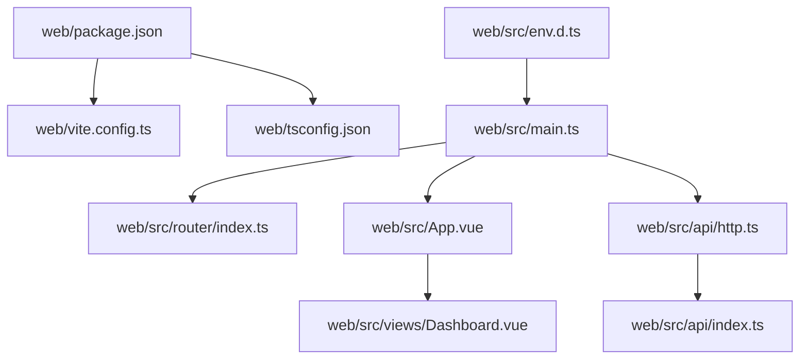
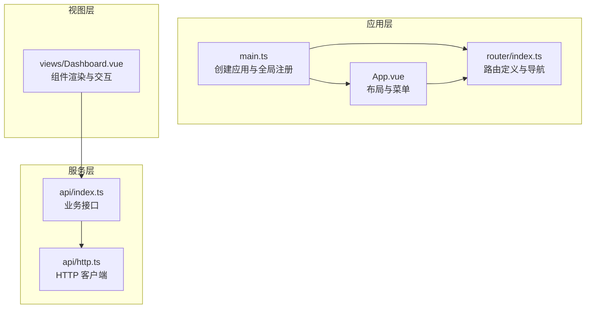
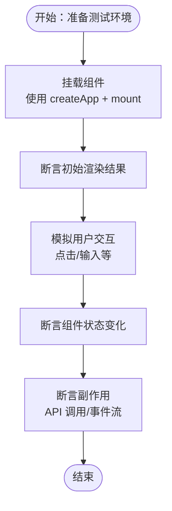
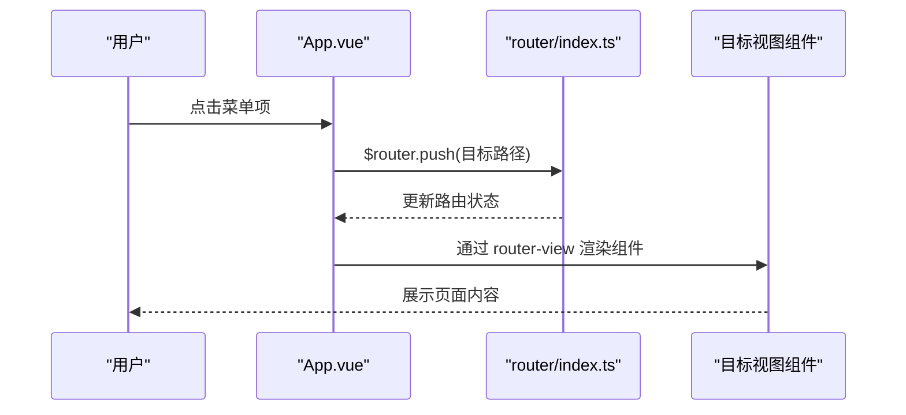
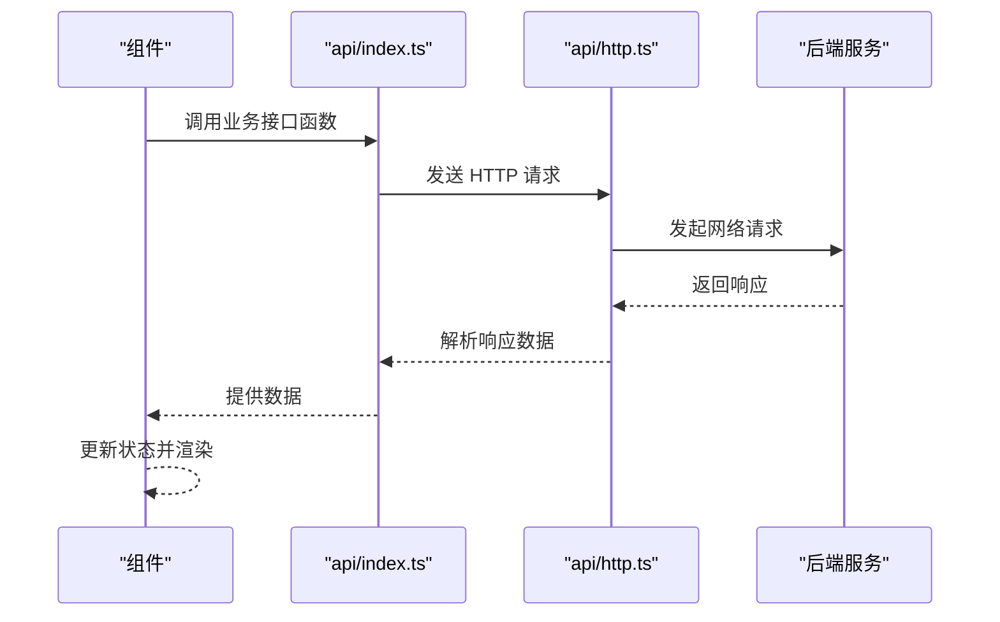
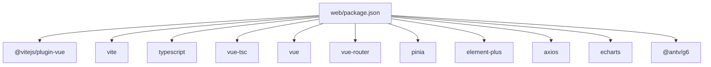

# 前端测试

<cite>
**本文引用的文件**
- [web/package.json](file://web/package.json)
- [web/vite.config.ts](file://web/vite.config.ts)
- [web/tsconfig.json](file://web/tsconfig.json)
- [web/src/env.d.ts](file://web/src/env.d.ts)
- [web/src/main.ts](file://web/src/main.ts)
- [web/src/router/index.ts](file://web/src/router/index.ts)
- [web/src/App.vue](file://web/src/App.vue)
- [web/src/api/http.ts](file://web/src/api/http.ts)
- [web/src/api/index.ts](file://web/src/api/index.ts)
- [web/src/views/Dashboard.vue](file://web/src/views/Dashboard.vue)
</cite>

## 目录
1. [引言](#引言)
2. [项目结构](#项目结构)
3. [核心组件](#核心组件)
4. [架构总览](#架构总览)
5. [详细组件分析](#详细组件分析)
6. [依赖分析](#依赖分析)
7. [性能考虑](#性能考虑)
8. [故障排查指南](#故障排查指南)
9. [结论](#结论)
10. [附录](#附录)

## 引言
本文件面向 LLM Wiki 前端系统，聚焦于 Vue.js 测试体系的设计与实施，涵盖以下主题：
- Vitest 测试框架的配置与使用：测试环境搭建、测试文件组织结构
- Vue 组件测试：使用 @vue/test-utils 的渲染、交互、props 与插槽测试
- 路由测试：Router 测试、路由守卫测试、导航测试
- 状态管理测试：Pinia Store 的 action 与 getter 测试、状态变更验证
- API 客户端测试：HTTP 请求 Mock、异步操作与错误处理验证
- E2E 测试策略：Cypress 或 Playwright 的集成与使用建议

本指南以仓库中的实际文件为依据，避免臆造信息，确保可操作性与可追溯性。

## 项目结构
前端工程位于 web 目录，采用 Vue3 + Vite + TypeScript 构建，核心入口在 main.ts 中注册 Pinia、路由与 Element Plus；路由定义在 router/index.ts；API 客户端封装在 api 目录；视图组件位于 views 目录；应用布局与菜单在 App.vue。

图表来源
- [web/package.json:1-31](file://web/package.json#L1-L31)
- [web/vite.config.ts:1-23](file://web/vite.config.ts#L1-L23)
- [web/tsconfig.json:1-20](file://web/tsconfig.json#L1-L20)
- [web/src/env.d.ts:1-7](file://web/src/env.d.ts#L1-L7)
- [web/src/main.ts:1-14](file://web/src/main.ts#L1-L14)
- [web/src/router/index.ts:1-22](file://web/src/router/index.ts#L1-L22)
- [web/src/App.vue:1-38](file://web/src/App.vue#L1-L38)
- [web/src/api/http.ts:1-17](file://web/src/api/http.ts#L1-L17)
- [web/src/api/index.ts:1-70](file://web/src/api/index.ts#L1-L70)
- [web/src/views/Dashboard.vue:1-119](file://web/src/views/Dashboard.vue#L1-L119)

章节来源
- [web/package.json:1-31](file://web/package.json#L1-L31)
- [web/vite.config.ts:1-23](file://web/vite.config.ts#L1-L23)
- [web/tsconfig.json:1-20](file://web/tsconfig.json#L1-L20)
- [web/src/env.d.ts:1-7](file://web/src/env.d.ts#L1-L7)
- [web/src/main.ts:1-14](file://web/src/main.ts#L1-L14)
- [web/src/router/index.ts:1-22](file://web/src/router/index.ts#L1-L22)
- [web/src/App.vue:1-38](file://web/src/App.vue#L1-L38)
- [web/src/api/http.ts:1-17](file://web/src/api/http.ts#L1-L17)
- [web/src/api/index.ts:1-70](file://web/src/api/index.ts#L1-L70)
- [web/src/views/Dashboard.vue:1-119](file://web/src/views/Dashboard.vue#L1-L119)

## 核心组件
- 应用入口与全局注册：在 main.ts 中创建应用实例，注册 Pinia、路由与 Element Plus，并挂载到 DOM。该文件是测试中需要模拟的最小应用上下文。
- 路由系统：router/index.ts 定义了多条路由与懒加载视图组件，包含元信息（标题、图标），用于菜单渲染与页面标题展示。
- API 客户端：api/http.ts 创建基于 axios 的实例并统一拦截器；api/index.ts 汇聚各业务接口函数，供组件调用。
- 视图组件：views/Dashboard.vue 展示核心指标、实时进度（SSE）、任务列表与统计图表，是典型的异步数据驱动与副作用较多的组件，适合进行组件测试与 API 测试。

章节来源
- [web/src/main.ts:1-14](file://web/src/main.ts#L1-L14)
- [web/src/router/index.ts:1-22](file://web/src/router/index.ts#L1-L22)
- [web/src/api/http.ts:1-17](file://web/src/api/http.ts#L1-L17)
- [web/src/api/index.ts:1-70](file://web/src/api/index.ts#L1-L70)
- [web/src/views/Dashboard.vue:1-119](file://web/src/views/Dashboard.vue#L1-L119)

## 架构总览
下图展示了前端测试相关的架构关系：应用入口负责注册全局依赖；路由负责页面导航；API 客户端负责网络请求；视图组件负责渲染与交互。

图表来源
- [web/src/main.ts:1-14](file://web/src/main.ts#L1-L14)
- [web/src/router/index.ts:1-22](file://web/src/router/index.ts#L1-L22)
- [web/src/App.vue:1-38](file://web/src/App.vue#L1-L38)
- [web/src/api/http.ts:1-17](file://web/src/api/http.ts#L1-L17)
- [web/src/api/index.ts:1-70](file://web/src/api/index.ts#L1-L70)
- [web/src/views/Dashboard.vue:1-119](file://web/src/views/Dashboard.vue#L1-L119)

## 详细组件分析

### Vitest 测试框架配置与使用
- 测试运行器与脚本：当前 package.json 中未包含 Vitest 相关脚本与依赖。建议在 devDependencies 中添加 vitest、@vitejs/plugin-vue、@vue/test-utils 等依赖，并在 scripts 中新增 test 脚本。
- 测试环境与别名：vite.config.ts 已配置 @ 别名与 Vue 插件；tsconfig.json 设置模块解析为 Bundler 并启用路径映射。这些配置对 Vitest 的模块解析与组件编译至关重要。
- 类型声明：env.d.ts 声明了 *.vue 模块，保证 TS 在测试中能识别 Vue 单文件组件。
- 测试文件组织：建议按功能分层组织测试文件，例如：
  - tests/unit/components/Dashboard.spec.ts
  - tests/unit/router/router.spec.ts
  - tests/unit/store/store.spec.ts
  - tests/unit/api/api.spec.ts
  - tests/e2e/dashboard.e2e.ts

章节来源
- [web/package.json:1-31](file://web/package.json#L1-L31)
- [web/vite.config.ts:1-23](file://web/vite.config.ts#L1-L23)
- [web/tsconfig.json:1-20](file://web/tsconfig.json#L1-L20)
- [web/src/env.d.ts:1-7](file://web/src/env.d.ts#L1-L7)

### Vue 组件测试（@vue/test-utils）
- 渲染测试：通过 createApp 与 mount 将组件挂载到虚拟 DOM，断言初始渲染结果与元素存在性。
- 事件触发测试：模拟用户交互（点击、输入等），断言组件内部状态变化与副作用（如调用 API）。
- Props 与 Slots 测试：为组件传入不同 props 与插槽内容，验证渲染差异与行为分支。
- 示例场景（Dashboard.vue）：
  - 渲染核心指标卡片与表格
  - 触发刷新逻辑并断言 API 调用
  - SSE 连接与事件处理
  - 图表初始化与数据更新

图表来源
- [web/src/views/Dashboard.vue:1-119](file://web/src/views/Dashboard.vue#L1-L119)

章节来源
- [web/src/views/Dashboard.vue:1-119](file://web/src/views/Dashboard.vue#L1-L119)

### 路由测试
- Router 测试要点：
  - 导航守卫：验证路由元信息（title、icon）是否正确传递给布局组件。
  - 导航测试：通过编程式导航或路由快照断言目标视图组件被正确加载。
  - 懒加载：确认动态导入的视图组件能够成功解析并渲染。
- 示例场景（App.vue + router/index.ts）：
  - 菜单项点击后，$router.push 跳转至对应路由
  - router-view 中渲染对应视图组件
  - 元信息 title 显示在顶部栏

图表来源
- [web/src/App.vue:1-38](file://web/src/App.vue#L1-L38)
- [web/src/router/index.ts:1-22](file://web/src/router/index.ts#L1-L22)

章节来源
- [web/src/App.vue:1-38](file://web/src/App.vue#L1-L38)
- [web/src/router/index.ts:1-22](file://web/src/router/index.ts#L1-L22)

### 状态管理测试（Pinia）
- Store 设计：在 main.ts 中通过 createPinia() 注册 Pinia；组件通过组合式 API 使用 store。
- 测试策略：
  - Action 测试：构造 store 实例，调用 action 并断言状态变更与副作用（如 API 调用）。
  - Getter 测试：断言 getter 对状态的派生结果。
  - 状态变更验证：通过重置 store 或使用测试专用的 store 实例，确保测试隔离。
- 注意事项：由于当前仓库未包含 Pinia Store 的具体实现文件，建议在 tests/unit/store 目录下补充 store 的定义与测试用例。

章节来源
- [web/src/main.ts:1-14](file://web/src/main.ts#L1-L14)

### API 客户端测试
- HTTP 请求 Mock：使用拦截器或测试框架的 HTTP Mock 能力，模拟不同响应（成功、超时、错误）。
- 异步操作测试：断言组件在异步数据到达后的渲染与状态更新。
- 错误处理验证：断言错误提示、降级显示与日志输出。
- 示例场景（api/index.ts + api/http.ts）：
  - getOverview、listSources、search 等接口的返回值断言
  - SSE 连接与事件处理（Dashboard.vue 中的 EventSource 使用）

图表来源
- [web/src/api/index.ts:1-70](file://web/src/api/index.ts#L1-L70)
- [web/src/api/http.ts:1-17](file://web/src/api/http.ts#L1-L17)
- [web/src/views/Dashboard.vue:1-119](file://web/src/views/Dashboard.vue#L1-L119)

章节来源
- [web/src/api/index.ts:1-70](file://web/src/api/index.ts#L1-L70)
- [web/src/api/http.ts:1-17](file://web/src/api/http.ts#L1-L17)
- [web/src/views/Dashboard.vue:1-119](file://web/src/views/Dashboard.vue#L1-L119)

### E2E 测试策略（Cypress/Playwright）
- 集成建议：
  - 选择 Cypress 或 Playwright 之一作为 E2E 测试框架。
  - 在 package.json 中添加相应依赖与脚本（如 e2e:cypress 或 e2e:playwright）。
  - 在 CI 中与单元测试并行执行，确保端到端流程覆盖关键用户路径（如登录、导航、数据加载、图表渲染）。
- 场景建议：
  - 路由导航与页面标题一致性
  - 侧边栏菜单跳转与高亮
  - Dashboard 页面的数据加载与 SSE 事件展示
  - API 失败时的错误提示与重试机制

章节来源
- [web/package.json:1-31](file://web/package.json#L1-L31)

## 依赖分析
- 应用依赖：Vue3、Pinia、Element Plus、vue-router、axios、echarts、@antv/g6、typescript、vite 等。
- 开发依赖：@vitejs/plugin-vue、unplugin-auto-import、unplugin-vue-components、vue-tsc 等。
- 测试依赖：建议引入 vitest、@vitejs/plugin-vue、@vue/test-utils、@testing-library/vue 等（当前仓库未包含）。

图表来源
- [web/package.json:1-31](file://web/package.json#L1-L31)

章节来源
- [web/package.json:1-31](file://web/package.json#L1-L31)

## 性能考虑
- 测试执行性能：合理拆分测试文件，避免重复挂载大型组件；使用轻量级的虚拟 DOM 替代真实浏览器环境进行单元测试。
- 异步测试优化：对 SSE 与长耗时请求使用 Mock 与定时器控制，减少测试执行时间。
- E2E 性能：在 CI 中并行执行，减少等待时间；对慢速场景使用缓存与预热。

## 故障排查指南
- 模块解析失败：检查 vite.config.ts 的 @ 别名与 tsconfig.json 的路径映射是否一致。
- 组件无法挂载：确认在测试中正确引入 Vue 插件（Pinia、Router、Element Plus）。
- API 请求失败：检查代理配置与 baseURL 是否匹配后端地址；在测试中使用 HTTP Mock 替代真实请求。
- 路由不生效：确认路由历史模式与基础路径配置；在测试中使用内存历史记录或路由快照。

章节来源
- [web/vite.config.ts:1-23](file://web/vite.config.ts#L1-L23)
- [web/tsconfig.json:1-20](file://web/tsconfig.json#L1-L20)
- [web/src/api/http.ts:1-17](file://web/src/api/http.ts#L1-L17)

## 结论
本测试文档基于仓库现有文件，给出了 Vitest、Vue 组件、路由、状态管理与 API 客户端的测试策略与实践建议。建议尽快补齐测试依赖与测试文件，结合 E2E 测试形成完整的质量保障体系，确保前端功能的稳定性与可维护性。

## 附录
- 测试文件命名规范：*.spec.ts（单元测试）、*.e2e.ts（E2E 测试）
- 测试覆盖率：建议在 CI 中收集覆盖率报告，重点关注关键组件与 API 函数
- 文档与代码同步：测试用例应与组件与 API 的变更保持同步，避免测试漂移