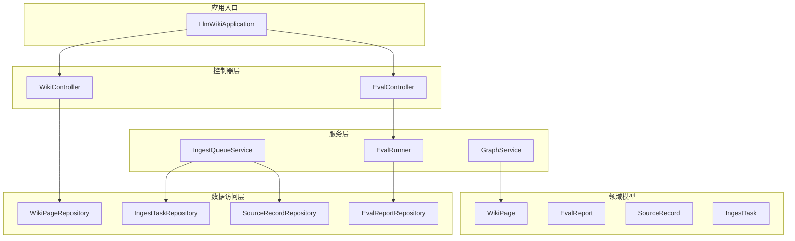
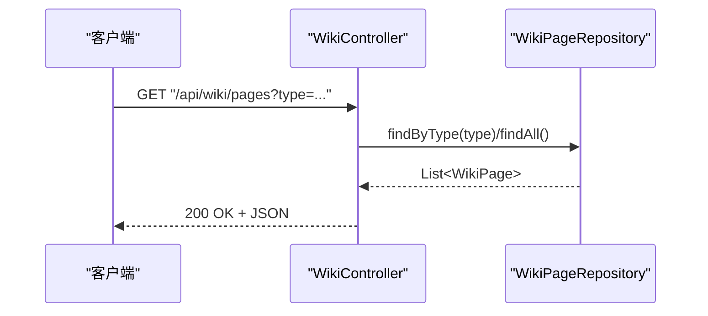
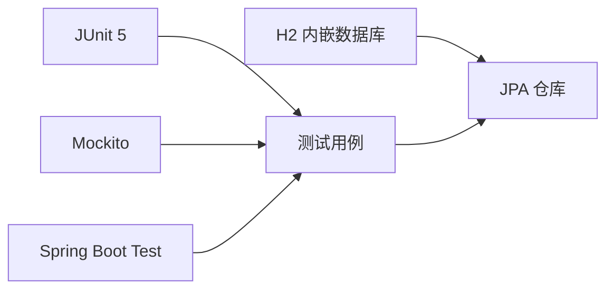

# 单元测试

<cite>
**本文引用的文件**
- [pom.xml](file://pom.xml)
- [LlmWikiApplication.java](file://src/main/java/com/example/llmwiki/LlmWikiApplication.java)
- [WikiController.java](file://src/main/java/com/example/llmwiki/api/WikiController.java)
- [EvalController.java](file://src/main/java/com/example/llmwiki/api/EvalController.java)
- [WikiPageRepository.java](file://src/main/java/com/example/llmwiki/repository/WikiPageRepository.java)
- [EvalReportRepository.java](file://src/main/java/com/example/llmwiki/repository/EvalReportRepository.java)
- [SourceRecordRepository.java](file://src/main/java/com/example/llmwiki/repository/SourceRecordRepository.java)
- [IngestTaskRepository.java](file://src/main/java/com/example/llmwiki/repository/IngestTaskRepository.java)
- [WikiPage.java](file://src/main/java/com/example/llmwiki/domain/WikiPage.java)
- [EvalReport.java](file://src/main/java/com/example/llmwiki/domain/EvalReport.java)
- [SourceRecord.java](file://src/main/java/com/example/llmwiki/domain/SourceRecord.java)
- [IngestTask.java](file://src/main/java/com/example/llmwiki/domain/IngestTask.java)
- [IngestQueueService.java](file://src/main/java/com/example/llmwiki/queue/IngestQueueService.java)
- [EvalRunner.java](file://src/main/java/com/example/llmwiki/eval/EvalRunner.java)
- [GraphService.java](file://src/main/java/com/example/llmwiki/graph/GraphService.java)
</cite>

## 目录
1. [简介](#简介)
2. [项目结构](#项目结构)
3. [核心组件](#核心组件)
4. [架构总览](#架构总览)
5. [详细组件分析](#详细组件分析)
6. [依赖分析](#依赖分析)
7. [性能考虑](#性能考虑)
8. [故障排查指南](#故障排查指南)
9. [结论](#结论)
10. [附录](#附录)

## 简介
本文件面向 LLM Wiki 项目的单元测试实践，系统讲解如何基于 JUnit 5 与 Mockito 在该代码库中编写高质量的单元测试。内容覆盖：
- 测试类组织结构与命名规范
- 断言方法与异常测试、边界条件测试、参数化测试
- Mock 对象设计与 Mockito 使用（@Mock/@Spy、when/then stubbing）
- Service 层、Repository 层、Controller 层的测试策略与示例路径
- 测试数据准备与清理（@TestInstance、@BeforeEach、@AfterEach）
- 测试覆盖率工具 JaCoCo 的集成与使用

## 项目结构
LLM Wiki 采用 Spring Boot 结构，核心模块按职责分层：
- 控制器层：api 包下的 REST 控制器
- 服务层：queue、eval、graph 等业务服务
- 数据访问层：repository 包下的 JPA Repository 接口
- 领域模型：domain 包下的实体类
- 应用入口：LlmWikiApplication

图表来源
- [LlmWikiApplication.java:1-29](file://src/main/java/com/example/llmwiki/LlmWikiApplication.java#L1-L29)
- [WikiController.java:1-51](file://src/main/java/com/example/llmwiki/api/WikiController.java#L1-L51)
- [EvalController.java:1-54](file://src/main/java/com/example/llmwiki/api/EvalController.java#L1-L54)
- [IngestQueueService.java:1-214](file://src/main/java/com/example/llmwiki/queue/IngestQueueService.java#L1-L214)
- [EvalRunner.java:1-243](file://src/main/java/com/example/llmwiki/eval/EvalRunner.java#L1-L243)
- [GraphService.java:1-197](file://src/main/java/com/example/llmwiki/graph/GraphService.java#L1-L197)
- [WikiPageRepository.java:1-19](file://src/main/java/com/example/llmwiki/repository/WikiPageRepository.java#L1-L19)
- [EvalReportRepository.java:1-12](file://src/main/java/com/example/llmwiki/repository/EvalReportRepository.java#L1-L12)
- [SourceRecordRepository.java:1-21](file://src/main/java/com/example/llmwiki/repository/SourceRecordRepository.java#L1-L21)
- [IngestTaskRepository.java:1-18](file://src/main/java/com/example/llmwiki/repository/IngestTaskRepository.java#L1-L18)
- [WikiPage.java:1-72](file://src/main/java/com/example/llmwiki/domain/WikiPage.java#L1-L72)
- [EvalReport.java:1-51](file://src/main/java/com/example/llmwiki/domain/EvalReport.java#L1-L51)
- [SourceRecord.java:1-64](file://src/main/java/com/example/llmwiki/domain/SourceRecord.java#L1-L64)
- [IngestTask.java:1-62](file://src/main/java/com/example/llmwiki/domain/IngestTask.java#L1-L62)

章节来源
- [LlmWikiApplication.java:1-29](file://src/main/java/com/example/llmwiki/LlmWikiApplication.java#L1-L29)
- [pom.xml:1-171](file://pom.xml#L1-L171)

## 核心组件
- 控制器层：提供 REST 接口，依赖仓库或服务进行数据查询与处理
- 服务层：封装业务流程，如入队、评测、图谱维护
- 仓库层：JPA Repository 接口，负责数据持久化查询
- 领域模型：对应数据库表结构，承载业务属性

章节来源
- [WikiController.java:1-51](file://src/main/java/com/example/llmwiki/api/WikiController.java#L1-L51)
- [EvalController.java:1-54](file://src/main/java/com/example/llmwiki/api/EvalController.java#L1-L54)
- [IngestQueueService.java:1-214](file://src/main/java/com/example/llmwiki/queue/IngestQueueService.java#L1-L214)
- [EvalRunner.java:1-243](file://src/main/java/com/example/llmwiki/eval/EvalRunner.java#L1-L243)
- [GraphService.java:1-197](file://src/main/java/com/example/llmwiki/graph/GraphService.java#L1-L197)
- [WikiPageRepository.java:1-19](file://src/main/java/com/example/llmwiki/repository/WikiPageRepository.java#L1-L19)
- [EvalReportRepository.java:1-12](file://src/main/java/com/example/llmwiki/repository/EvalReportRepository.java#L1-L12)
- [SourceRecordRepository.java:1-21](file://src/main/java/com/example/llmwiki/repository/SourceRecordRepository.java#L1-L21)
- [IngestTaskRepository.java:1-18](file://src/main/java/com/example/llmwiki/repository/IngestTaskRepository.java#L1-L18)
- [WikiPage.java:1-72](file://src/main/java/com/example/llmwiki/domain/WikiPage.java#L1-L72)
- [EvalReport.java:1-51](file://src/main/java/com/example/llmwiki/domain/EvalReport.java#L1-L51)
- [SourceRecord.java:1-64](file://src/main/java/com/example/llmwiki/domain/SourceRecord.java#L1-L64)
- [IngestTask.java:1-62](file://src/main/java/com/example/llmwiki/domain/IngestTask.java#L1-L62)

## 架构总览
下图展示控制器、服务与仓库之间的交互关系，便于理解测试边界与依赖注入点。

图表来源
- [WikiController.java:29-32](file://src/main/java/com/example/llmwiki/api/WikiController.java#L29-L32)
- [WikiPageRepository.java:15-17](file://src/main/java/com/example/llmwiki/repository/WikiPageRepository.java#L15-L17)

## 详细组件分析

### 控制器层测试（WikiController）
- 测试目标
  - 参数校验与默认值处理
  - 响应状态码（200/404）
  - 返回数据结构正确性
- 关键测试点
  - list(type)：type 为空时返回全部，非空时按类型过滤
  - detail(slug)：存在与不存在时的响应
  - stats()：总数与按类型计数
- Mock 对象
  - 使用 @Mock 注入 WikiPageRepository
  - 使用 @InjectMocks 注入 WikiController
- 断言建议
  - 断言 ResponseEntity 状态码
  - 断言集合大小与字段值
- 示例路径参考
  - [WikiController.list:29-32](file://src/main/java/com/example/llmwiki/api/WikiController.java#L29-L32)
  - [WikiController.detail:34-39](file://src/main/java/com/example/llmwiki/api/WikiController.java#L34-L39)
  - [WikiController.stats:41-49](file://src/main/java/com/example/llmwiki/api/WikiController.java#L41-L49)
  - [WikiPageRepository.findByType](file://src/main/java/com/example/llmwiki/repository/WikiPageRepository.java#L17)
  - [WikiPageRepository.findBySlug](file://src/main/java/com/example/llmwiki/repository/WikiPageRepository.java#L15)

章节来源
- [WikiController.java:1-51](file://src/main/java/com/example/llmwiki/api/WikiController.java#L1-L51)
- [WikiPageRepository.java:1-19](file://src/main/java/com/example/llmwiki/repository/WikiPageRepository.java#L1-L19)

### 控制器层测试（EvalController）
- 测试目标
  - 上传文件触发评测并返回报告
  - 列表与详情接口的数据一致性
- 关键测试点
  - POST /run：文件解析、参数校验、异常传播
  - GET /reports：全量查询
  - GET /reports/{id}：存在与不存在分支
- Mock 对象
  - @Mock EvalRunner、EvalReportRepository
  - @InjectMocks EvalController
- 断言建议
  - 断言返回报告字段与状态码
  - 断言 notFound 场景
- 示例路径参考
  - [EvalController.run:35-41](file://src/main/java/com/example/llmwiki/api/EvalController.java#L35-L41)
  - [EvalController.list:43-46](file://src/main/java/com/example/llmwiki/api/EvalController.java#L43-L46)
  - [EvalController.detail:48-52](file://src/main/java/com/example/llmwiki/api/EvalController.java#L48-L52)
  - [EvalReportRepository:1-12](file://src/main/java/com/example/llmwiki/repository/EvalReportRepository.java#L1-L12)

章节来源
- [EvalController.java:1-54](file://src/main/java/com/example/llmwiki/api/EvalController.java#L1-L54)
- [EvalReportRepository.java:1-12](file://src/main/java/com/example/llmwiki/repository/EvalReportRepository.java#L1-L12)

### 服务层测试（IngestQueueService）
- 测试目标
  - 入队、取消、重试、恢复流程
  - 异常重试与失败回退
  - 与仓库、存储、进度总线的协作
- 关键测试点
  - enqueueFile/enqueueUrl/enqueueRemote 的任务创建与调度
  - cancel 导致 PENDING -> CANCELLED 的状态变更
  - retry 将任务置回 PENDING 并清空错误
  - recover 将 RUNNING 任务重置为 PENDING 并重新入队
- Mock 对象
  - @Mock IngestTaskRepository、SourceRecordRepository、IngestPipeline、ProgressBus、StorageProperties、IngestProperties
  - @InjectMocks IngestQueueService
- 断言建议
  - 断言状态流转、保存调用次数与顺序
  - 断言异常分支与日志行为
- 示例路径参考
  - [IngestQueueService.enqueueFile:73-91](file://src/main/java/com/example/llmwiki/queue/IngestQueueService.java#L73-L91)
  - [IngestQueueService.enqueueUrl:93-102](file://src/main/java/com/example/llmwiki/queue/IngestQueueService.java#L93-L102)
  - [IngestQueueService.enqueueRemote:104-113](file://src/main/java/com/example/llmwiki/queue/IngestQueueService.java#L104-L113)
  - [IngestQueueService.cancel:115-124](file://src/main/java/com/example/llmwiki/queue/IngestQueueService.java#L115-L124)
  - [IngestQueueService.retry:126-134](file://src/main/java/com/example/llmwiki/queue/IngestQueueService.java#L126-L134)
  - [IngestQueueService.recover:53-63](file://src/main/java/com/example/llmwiki/queue/IngestQueueService.java#L53-L63)
  - [IngestTaskRepository:1-18](file://src/main/java/com/example/llmwiki/repository/IngestTaskRepository.java#L1-L18)
  - [SourceRecordRepository:1-21](file://src/main/java/com/example/llmwiki/repository/SourceRecordRepository.java#L1-L21)

章节来源
- [IngestQueueService.java:1-214](file://src/main/java/com/example/llmwiki/queue/IngestQueueService.java#L1-L214)
- [IngestTaskRepository.java:1-18](file://src/main/java/com/example/llmwiki/repository/IngestTaskRepository.java#L1-L18)
- [SourceRecordRepository.java:1-21](file://src/main/java/com/example/llmwiki/repository/SourceRecordRepository.java#L1-L21)

### 服务层测试（EvalRunner）
- 测试目标
  - CSV 解析、检索、指标计算、报告落库
  - LLM 评分分支与异常处理
- 关键测试点
  - run(name, csvBytes, useJudge) 主流程
  - judgeRelevance 评分与异常兜底
  - parseCsv 与 splitCsv 的边界（空行、分号/逗号分隔）
- Mock 对象
  - @Mock HybridSearcher、ChatClient、EvalReportRepository
  - @InjectMocks EvalRunner
- 断言建议
  - 断言报告指标字段（总数、命中率、平均相关性、平均延迟）
  - 断言异常场景与日志
- 示例路径参考
  - [EvalRunner.run:63-135](file://src/main/java/com/example/llmwiki/eval/EvalRunner.java#L63-L135)
  - [EvalRunner.judgeRelevance:140-163](file://src/main/java/com/example/llmwiki/eval/EvalRunner.java#L140-L163)
  - [EvalRunner.parseCsv:169-201](file://src/main/java/com/example/llmwiki/eval/EvalRunner.java#L169-L201)
  - [EvalRunner.splitCsv:203-220](file://src/main/java/com/example/llmwiki/eval/EvalRunner.java#L203-L220)
  - [EvalReportRepository:1-12](file://src/main/java/com/example/llmwiki/repository/EvalReportRepository.java#L1-L12)

章节来源
- [EvalRunner.java:1-243](file://src/main/java/com/example/llmwiki/eval/EvalRunner.java#L1-L243)
- [EvalReportRepository.java:1-12](file://src/main/java/com/example/llmwiki/repository/EvalReportRepository.java#L1-L12)

### 服务层测试（GraphService）
- 测试目标
  - upsertPage 边权合并、自环与同源重叠
  - persist 快照与文件 IO 异常
  - bridgeNodes 社区跨域桥节点识别
- 关键测试点
  - upsertPage 输入 outLinks/sourced 的合法性与去重
  - neighbors/degree/isolatedNodes 的一致性
  - setCommunity/社区映射
- Mock 对象
  - @Mock StorageProperties、ObjectMapper
  - @InjectMocks GraphService
- 断言建议
  - 断言邻接权重、节点度数、孤立节点列表
  - 断言快照序列化与异常捕获
- 示例路径参考
  - [GraphService.upsertPage:71-104](file://src/main/java/com/example/llmwiki/graph/GraphService.java#L71-L104)
  - [GraphService.persist:106-118](file://src/main/java/com/example/llmwiki/graph/GraphService.java#L106-L118)
  - [GraphService.bridgeNodes:151-167](file://src/main/java/com/example/llmwiki/graph/GraphService.java#L151-L167)
  - [GraphService.neighbors:136-138](file://src/main/java/com/example/llmwiki/graph/GraphService.java#L136-L138)
  - [GraphService.degree:140-142](file://src/main/java/com/example/llmwiki/graph/GraphService.java#L140-L142)
  - [GraphService.isolatedNodes:144-146](file://src/main/java/com/example/llmwiki/graph/GraphService.java#L144-L146)

章节来源
- [GraphService.java:1-197](file://src/main/java/com/example/llmwiki/graph/GraphService.java#L1-L197)

### 仓库层测试（WikiPageRepository、EvalReportRepository、SourceRecordRepository、IngestTaskRepository）
- 测试目标
  - 自定义查询方法的正确性与边界
  - JPA 查询语义与返回类型
- 关键测试点
  - WikiPageRepository.findBySlug、findByType
  - EvalReportRepository（空实现，关注查询语义）
  - SourceRecordRepository.findByKindAndRef、findByKindIn、findByWatchEnabledTrue
  - IngestTaskRepository.findTop50ByOrderByIdDesc、findByStatusOrderByIdAsc
- 断言建议
  - 断言 Optional/集合非空与字段匹配
- 示例路径参考
  - [WikiPageRepository.findBySlug](file://src/main/java/com/example/llmwiki/repository/WikiPageRepository.java#L15)
  - [WikiPageRepository.findByType](file://src/main/java/com/example/llmwiki/repository/WikiPageRepository.java#L17)
  - [EvalReportRepository:1-12](file://src/main/java/com/example/llmwiki/repository/EvalReportRepository.java#L1-L12)
  - [SourceRecordRepository.findByKindAndRef](file://src/main/java/com/example/llmwiki/repository/SourceRecordRepository.java#L15)
  - [SourceRecordRepository.findByKindIn](file://src/main/java/com/example/llmwiki/repository/SourceRecordRepository.java#L17)
  - [SourceRecordRepository.findByWatchEnabledTrue](file://src/main/java/com/example/llmwiki/repository/SourceRecordRepository.java#L19)
  - [IngestTaskRepository.findTop50ByOrderByIdDesc](file://src/main/java/com/example/llmwiki/repository/IngestTaskRepository.java#L14)
  - [IngestTaskRepository.findByStatusOrderByIdAsc](file://src/main/java/com/example/llmwiki/repository/IngestTaskRepository.java#L16)

章节来源
- [WikiPageRepository.java:1-19](file://src/main/java/com/example/llmwiki/repository/WikiPageRepository.java#L1-L19)
- [EvalReportRepository.java:1-12](file://src/main/java/com/example/llmwiki/repository/EvalReportRepository.java#L1-L12)
- [SourceRecordRepository.java:1-21](file://src/main/java/com/example/llmwiki/repository/SourceRecordRepository.java#L1-L21)
- [IngestTaskRepository.java:1-18](file://src/main/java/com/example/llmwiki/repository/IngestTaskRepository.java#L1-L18)

## 依赖分析
- 测试框架与工具
  - JUnit 5：测试生命周期与断言
  - Mockito：Mock 对象与桩函数
  - Spring Boot Test：集成测试支持
  - H2 内嵌数据库：测试环境数据持久化
- Maven 依赖概览
  - spring-boot-starter-test 已在依赖中声明，包含 JUnit、Mockito、Spring Boot Test 等

图表来源
- [pom.xml:154-158](file://pom.xml#L154-L158)

章节来源
- [pom.xml:1-171](file://pom.xml#L1-L171)

## 性能考虑
- 测试隔离与并发
  - 使用 @TestInstance(TestInstanceFactory.PER_METHOD) 保证每次测试独立实例
  - 避免共享可变状态，必要时使用 @BeforeEach/@AfterEach 清理
- Mock 粒度
  - 仅对关键外部依赖（IO、网络、第三方 LLM）进行 Mock
  - 对纯计算逻辑避免过度 Mock，直接调用以提升覆盖率
- 覆盖率
  - 使用 JaCoCo 插件生成覆盖率报告，重点关注分支与异常路径

## 故障排查指南
- 常见问题
  - Mock 注入失败：确认 @Mock 字段与 @InjectMocks 控制器/服务一致
  - 状态断言不通过：检查状态机流转（PENDING/RUNNING/SUCCESS/FAILED/CANCELLED）
  - CSV 解析异常：验证分号/逗号分隔符与 UTF-8 编码
- 日志与断言
  - 使用断言检查异常消息与日志级别
  - 对 IO 失败场景（如持久化失败）验证兜底逻辑

## 结论
通过合理组织测试类、使用 Mockito 构建 Mock 对象、结合 JUnit 5 的断言与参数化能力，并配合 H2 与 Spring Boot Test，可以在 LLM Wiki 中建立稳定可靠的单元测试体系。建议优先覆盖控制器与服务的关键业务路径，再逐步完善仓库层与边界条件测试。

## 附录

### JUnit 5 与 Mockito 使用要点
- 测试类组织
  - 按模块分包：例如 api、service、repository 下分别建立测试包
  - 命名规范：XxxTest 或 XxxUnitTest
- 生命周期注解
  - @TestInstance(TestTemplateInvocationContextFactory.PER_METHOD)
  - @BeforeEach/@AfterEach：准备/清理测试数据
- 断言
  - assertEquals、assertThat、assertTrue、assertNull、assertThrows
- 参数化测试
  - @ParameterizedTest + @CsvSource/@ValueSource 等
- 异常测试
  - 使用 assertThrows 验证受检异常
  - 使用 @Test(expected = ...)（JUnit 5 不推荐，建议用断言）

### Mock 对象设计与 Stubbing
- @Mock：创建被测对象依赖的 Mock 实例
- @Spy：对真实对象的部分方法进行 Mock（部分存根）
- when(...).thenReturn(...)：设置桩函数
- verify(...).times(n)：验证调用次数
- doThrow(...).when(...).method()：对 void 方法进行桩

### 测试数据准备与清理
- @BeforeEach：初始化实体、Mock 行为、插入临时数据
- @AfterEach：删除临时数据、重置 Mock
- 使用 @DirtiesContext 或 @Transactional 回滚（视测试策略而定）

### 测试覆盖率工具 JaCoCo 集成
- Maven 插件
  - 在 pom.xml 中添加 JaCoCo 插件配置，绑定 verify 生命周期
- 报告生成
  - mvn clean test jacoco:report
  - 报告输出至 target/site/jacoco/index.html
- 覆盖率指标
  - 目标：类覆盖率、方法覆盖率、分支覆盖率、行覆盖率
  - 建议：关键业务路径覆盖率不低于 80%

章节来源
- [pom.xml:161-168](file://pom.xml#L161-L168)