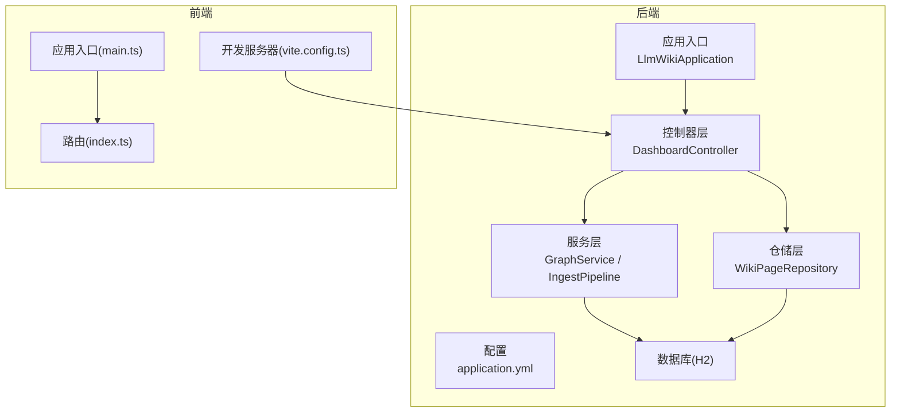
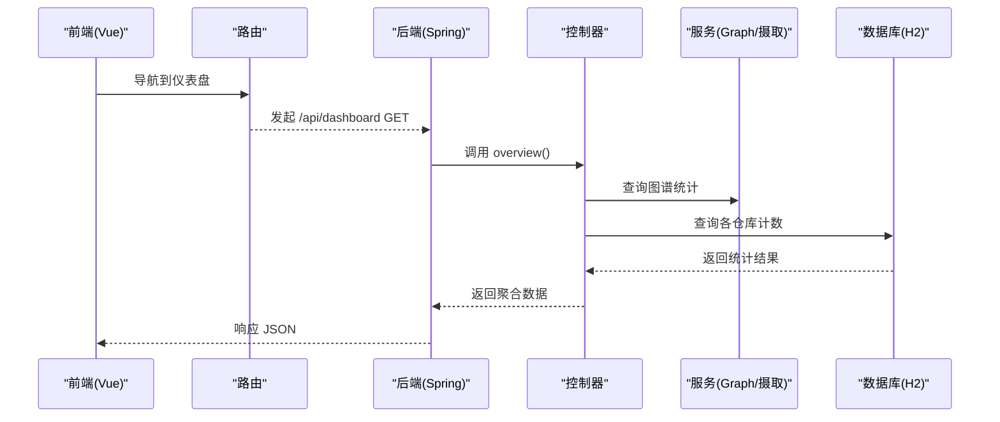
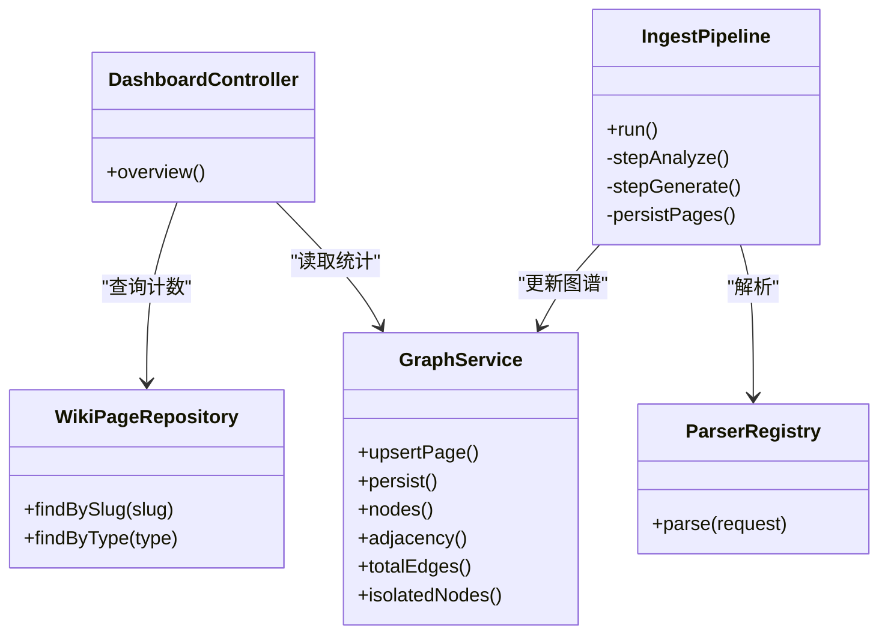

# 测试策略

<cite>
**本文引用的文件**
- [pom.xml](file://pom.xml)
- [application.yml](file://src/main/resources/application.yml)
- [LlmWikiApplication.java](file://src/main/java/com/example/llmwiki/LlmWikiApplication.java)
- [DashboardController.java](file://src/main/java/com/example/llmwiki/api/DashboardController.java)
- [WikiPageRepository.java](file://src/main/java/com/example/llmwiki/repository/WikiPageRepository.java)
- [GraphService.java](file://src/main/java/com/example/llmwiki/graph/GraphService.java)
- [IngestPipeline.java](file://src/main/java/com/example/llmwiki/ingest/IngestPipeline.java)
- [ParserRegistry.java](file://src/main/java/com/example/llmwiki/parser/ParserRegistry.java)
- [main.ts](file://web/src/main.ts)
- [index.ts](file://web/src/router/index.ts)
- [vite.config.ts](file://web/vite.config.ts)
- [package.json](file://web/package.json)
</cite>

## 目录
1. [简介](#简介)
2. [项目结构](#项目结构)
3. [核心组件](#核心组件)
4. [架构总览](#架构总览)
5. [详细组件分析](#详细组件分析)
6. [依赖分析](#依赖分析)
7. [性能考虑](#性能考虑)
8. [故障排查指南](#故障排查指南)
9. [结论](#结论)
10. [附录](#附录)

## 简介
本测试策略文档面向 LLM Wiki 项目，目标是建立覆盖单元测试、集成测试、前端测试、性能测试与测试自动化的完整测试体系。文档基于现有后端 Spring Boot 与前端 Vue3 工程结构，结合实际代码职责，提出可落地的测试方法、工具与流程建议，确保在 CI/CD 中稳定运行并持续提升质量。

## 项目结构
- 后端采用 Spring Boot，使用 JPA/H2 进行数据访问与持久化，Quartz 定时任务，Lucene 进行全文检索，OpenAI 接口进行嵌入与对话。
- 前端采用 Vue3 + Vite + Element Plus + Pinia + Vue Router，通过代理将 /api 请求转发至后端 8080 端口。
- 测试框架与工具链建议：
  - 单元测试：JUnit 5 + Mockito（或 Spring Boot Test）
  - 集成测试：Testcontainers（数据库/外部服务）、REST Assured 或 Spring WebTestClient
  - 前端测试：Vitest + @vue/test-utils（组件测试），Playwright/Cypress（端到端）
  - 性能测试：JMeter/Gatling（负载/压力），JMH（JVM 基准）
  - 覆盖率：JaCoCo（Java），Istanbul/Vitest（前端）

**图表来源**
- [LlmWikiApplication.java:19-26](file://src/main/java/com/example/llmwiki/LlmWikiApplication.java#L19-L26)
- [application.yml:11-29](file://src/main/resources/application.yml#L11-L29)
- [DashboardController.java:22-46](file://src/main/java/com/example/llmwiki/api/DashboardController.java#L22-L46)
- [GraphService.java:34-69](file://src/main/java/com/example/llmwiki/graph/GraphService.java#L34-L69)
- [IngestPipeline.java:45-109](file://src/main/java/com/example/llmwiki/ingest/IngestPipeline.java#L45-L109)
- [WikiPageRepository.java:13-18](file://src/main/java/com/example/llmwiki/repository/WikiPageRepository.java#L13-L18)
- [main.ts:1-14](file://web/src/main.ts#L1-L14)
- [index.ts:1-22](file://web/src/router/index.ts#L1-L22)
- [vite.config.ts:13-21](file://web/vite.config.ts#L13-L21)

**章节来源**
- [pom.xml:36-159](file://pom.xml#L36-L159)
- [application.yml:1-84](file://src/main/resources/application.yml#L1-L84)
- [LlmWikiApplication.java:1-29](file://src/main/java/com/example/llmwiki/LlmWikiApplication.java#L1-L29)
- [main.ts:1-14](file://web/src/main.ts#L1-L14)
- [index.ts:1-22](file://web/src/router/index.ts#L1-L22)
- [vite.config.ts:1-23](file://web/vite.config.ts#L1-L23)

## 核心组件
- 控制器层：对外暴露 REST 接口，负责参数校验、响应封装与调用服务层。
- 服务层：业务核心，如图谱构建与持久化、摄取流水线（解析-分析-生成-索引-图谱）。
- 仓储层：基于 Spring Data JPA，提供实体 CRUD 与查询扩展。
- 配置与启动：H2 数据库、JPA DDL 自动更新、Quartz 内存调度、日志级别等。
- 前端入口：应用初始化、路由注册、插件安装与开发服务器代理。

**章节来源**
- [DashboardController.java:22-46](file://src/main/java/com/example/llmwiki/api/DashboardController.java#L22-L46)
- [GraphService.java:34-197](file://src/main/java/com/example/llmwiki/graph/GraphService.java#L34-L197)
- [IngestPipeline.java:45-251](file://src/main/java/com/example/llmwiki/ingest/IngestPipeline.java#L45-L251)
- [WikiPageRepository.java:13-18](file://src/main/java/com/example/llmwiki/repository/WikiPageRepository.java#L13-L18)
- [application.yml:11-29](file://src/main/resources/application.yml#L11-L29)
- [main.ts:1-14](file://web/src/main.ts#L1-L14)
- [index.ts:1-22](file://web/src/router/index.ts#L1-L22)

## 架构总览
后端采用分层架构：控制器接收请求，服务层编排业务，仓储层访问数据库；前端通过代理访问后端 API。测试策略需覆盖各层交互与外部依赖。

**图表来源**
- [DashboardController.java:33-46](file://src/main/java/com/example/llmwiki/api/DashboardController.java#L33-L46)
- [GraphService.java:120-176](file://src/main/java/com/example/llmwiki/graph/GraphService.java#L120-L176)
- [WikiPageRepository.java:13-18](file://src/main/java/com/example/llmwiki/repository/WikiPageRepository.java#L13-L18)
- [index.ts:1-22](file://web/src/router/index.ts#L1-L22)
- [vite.config.ts:15-20](file://web/vite.config.ts#L15-L20)

## 详细组件分析

### 单元测试策略（JUnit 5 + Mock 设计）
- 测试范围
  - 控制器：验证请求参数、状态码、响应体字段与异常处理。
  - 服务：纯函数与有状态对象（如 GraphService）的边界行为。
  - 仓储：JPA 方法正确性与自定义查询。
  - 解析器注册表：解析器选择与异常路径。
- Mock 对象设计
  - 使用 @MockBean 注入依赖（仓储、客户端、存储属性等）。
  - 对外部服务（ChatClient、EmbeddingClient、ParserRegistry）进行桩/替身。
  - 对文件系统与 JSON 序列化进行隔离（使用内存文件或临时目录）。
- 测试用例编写
  - 正向路径：正常输入、边界值、空值处理。
  - 异常路径：解析失败、LLM 返回格式错误、内容无变化跳过。
  - 并发与幂等：GraphService 的并发写入与持久化一致性。
- 示例关注点（不展示代码）
  - 控制器：断言返回字段数量与类型、最近任务列表长度限制。
  - 服务：upsertPage 后度数、邻接权重、孤立节点集合。
  - 仓储：findBySlug、findByType 的查询语义与空值处理。
  - 注册表：支持匹配优先级与“无匹配解析器”异常。

**章节来源**
- [DashboardController.java:22-46](file://src/main/java/com/example/llmwiki/api/DashboardController.java#L22-L46)
- [GraphService.java:71-104](file://src/main/java/com/example/llmwiki/graph/GraphService.java#L71-L104)
- [WikiPageRepository.java:13-18](file://src/main/java/com/example/llmwiki/repository/WikiPageRepository.java#L13-L18)
- [ParserRegistry.java:24-35](file://src/main/java/com/example/llmwiki/parser/ParserRegistry.java#L24-L35)

### 集成测试策略（API/数据库/外部服务）
- API 接口测试
  - 使用 Spring Boot Test + Testcontainers 启动完整上下文或 WebTestClient。
  - 覆盖 /api/dashboard 的聚合统计、图谱节点/边/社区数。
  - 路由与静态资源：确认代理配置正确，/api 前缀转发。
- 数据库测试
  - 使用 Testcontainers 启动 H2 或 PostgreSQL，确保 DDL 自动更新与迁移兼容。
  - 验证 JPA 查询、事务边界、并发写入一致性。
- 外部服务集成测试
  - 使用 WireMock 或 Testcontainers 启动 OpenAI 兼容服务，模拟成功/失败场景。
  - 验证摄取流水线中的解析、LLM 分析/生成、嵌入与索引流程。
- 测试数据管理
  - 使用 SQL 初始化脚本或 Fixtures，保证测试可重复。
  - 使用事务回滚或容器级隔离，避免跨用例污染。

**章节来源**
- [application.yml:11-29](file://src/main/resources/application.yml#L11-L29)
- [vite.config.ts:15-20](file://web/vite.config.ts#L15-L20)
- [IngestPipeline.java:65-109](file://src/main/java/com/example/llmwiki/ingest/IngestPipeline.java#L65-L109)

### 前端测试策略（Vue 组件/路由/状态）
- 组件测试（Vitest + @vue/test-utils）
  - 测试视图组件渲染、事件触发、props 与 emits 行为。
  - 针对路由懒加载组件进行挂载测试。
- 路由测试
  - 断言路由表存在性、默认重定向、meta 字段。
  - 在测试中使用 MemoryHistory 进行导航断言。
- 状态管理测试（Pinia）
  - 测试 Store 的 actions、getters、状态变更。
  - 隔离异步副作用（如 API 调用），使用替身或拦截 HTTP。
- 端到端测试（可选 Playwright/Cypress）
  - 覆盖关键用户旅程：从仪表盘到搜索、图谱浏览。

**章节来源**
- [main.ts:1-14](file://web/src/main.ts#L1-L14)
- [index.ts:1-22](file://web/src/router/index.ts#L1-L22)
- [vite.config.ts:1-23](file://web/vite.config.ts#L1-L23)
- [package.json:1-31](file://web/package.json#L1-L31)

### 测试自动化（CI/CD、流水线、报告）
- CI/CD 集成
  - Maven：在流水线中执行 mvn test（含 JUnit 5），并收集 JaCoCo 覆盖率。
  - 前端：在流水线中执行 npm run build 与 Vitest 测试。
- 自动化测试流水线
  - 触发条件：PR/MR 触发单元/集成测试；主干推送触发端到端测试。
  - 并行策略：后端单元测试与前端测试并行执行。
- 测试报告生成
  - 后端：Surefire/JUnit XML + JaCoCo HTML/XML 报告。
  - 前端：Vitest HTML/JSON 报告，结合 LCOV 生成覆盖率报告。
- 失败处理与重试
  - 对外部服务不稳定场景增加重试与超时配置。

**章节来源**
- [pom.xml:161-169](file://pom.xml#L161-L169)
- [package.json:7-11](file://web/package.json#L7-L11)

### 测试数据管理（准备/隔离/同步）
- 测试数据准备
  - 使用 SQL/Fixtures 初始化种子数据，确保最小可测集。
  - 使用 @DirtiesContext 或 @Transactional 标记控制隔离。
- 数据隔离
  - 使用 Testcontainers 为每个测试容器化数据库实例。
  - 使用事务回滚或临时目录隔离文件系统操作。
- 环境同步
  - application.yml 中的 H2 配置适合本地与 CI，生产环境替换为 PostgreSQL。
  - 保持测试与生产配置差异最小化，必要时使用 profiles。

**章节来源**
- [application.yml:11-29](file://src/main/resources/application.yml#L11-L29)

### 性能测试策略（负载/压力/基准）
- 负载测试
  - 使用 JMeter/Gatling 对 /api/dashboard 与搜索接口施加并发请求。
  - 关注响应时间、吞吐量与错误率。
- 压力测试
  - 逐步提升并发，观察系统瓶颈（CPU、内存、数据库连接池）。
- 性能基准测试
  - 使用 JMH 对热点方法（JSON 解析、图谱权重合并、CSV 列拆分）进行微基准。
- 前端性能
  - 使用 Lighthouse/Bundle 分析工具评估包体积与首屏性能。

**章节来源**
- [IngestPipeline.java:168-203](file://src/main/java/com/example/llmwiki/ingest/IngestPipeline.java#L168-L203)
- [GraphService.java:86-103](file://src/main/java/com/example/llmwiki/graph/GraphService.java#L86-L103)

### 测试覆盖率（代码覆盖率/盲点识别/改进）
- 覆盖率指标
  - Java：JaCoCo 报告行/分支覆盖率，目标阈值（例如 80%/70%）。
  - 前端：Vitest + Istanbul，目标阈值（例如 85%/80%）。
- 盲点识别
  - 异常路径：解析器无匹配、LLM JSON 不合规、嵌入失败降级。
  - 并发路径：GraphService 的 upsert/persist 并发写入。
  - 外部依赖：网络超时、鉴权失败、限流。
- 改进策略
  - 针对低覆盖率模块补充单测与集成测试。
  - 将关键业务逻辑抽取为独立方法，便于单元测试。

**章节来源**
- [ParserRegistry.java:24-35](file://src/main/java/com/example/llmwiki/parser/ParserRegistry.java#L24-L35)
- [IngestPipeline.java:111-177](file://src/main/java/com/example/llmwiki/ingest/IngestPipeline.java#L111-L177)
- [GraphService.java:64-68](file://src/main/java/com/example/llmwiki/graph/GraphService.java#L64-L68)

### 测试工具与最佳实践
- 测试框架选择
  - 后端：JUnit 5 + Mockito/Spring Boot Test + Testcontainers。
  - 前端：Vitest + @vue/test-utils，可选 Playwright。
- 工具集成
  - Maven 插件：Surefire、JaCoCo。
  - 前端：Vite 插件生态、TypeScript 类型检查。
- 调试工具
  - 后端：远程调试 JVM 参数，IDE 断点。
  - 前端：浏览器 DevTools、Vue DevTools。
- 最佳实践
  - 测试金字塔：单元测试为主，集成测试为辅，端到端测试为尖。
  - TDD：先写失败用例，再写实现，持续重构。
  - 持续测试：每次提交都跑测试，主干保持绿色。

**章节来源**
- [pom.xml:154-158](file://pom.xml#L154-L158)
- [package.json:22-29](file://web/package.json#L22-L29)

## 依赖分析
- 组件耦合
  - 控制器依赖仓储与服务；服务依赖存储配置、外部客户端与索引/图谱组件。
  - 前端通过代理与后端解耦，路由懒加载降低首屏负担。
- 外部依赖
  - H2 数据库、OpenAI 接口、文件系统（图谱 JSON）、Lucene 索引。
- 可能的循环依赖
  - 当前结构清晰，控制器不直接依赖具体实现类，通过接口/服务层解耦。

**图表来源**
- [DashboardController.java:22-46](file://src/main/java/com/example/llmwiki/api/DashboardController.java#L22-L46)
- [WikiPageRepository.java:13-18](file://src/main/java/com/example/llmwiki/repository/WikiPageRepository.java#L13-L18)
- [GraphService.java:34-197](file://src/main/java/com/example/llmwiki/graph/GraphService.java#L34-L197)
- [IngestPipeline.java:45-251](file://src/main/java/com/example/llmwiki/ingest/IngestPipeline.java#L45-L251)
- [ParserRegistry.java:16-36](file://src/main/java/com/example/llmwiki/parser/ParserRegistry.java#L16-L36)

**章节来源**
- [DashboardController.java:22-46](file://src/main/java/com/example/llmwiki/api/DashboardController.java#L22-L46)
- [GraphService.java:34-197](file://src/main/java/com/example/llmwiki/graph/GraphService.java#L34-L197)
- [IngestPipeline.java:45-251](file://src/main/java/com/example/llmwiki/ingest/IngestPipeline.java#L45-L251)
- [WikiPageRepository.java:13-18](file://src/main/java/com/example/llmwiki/repository/WikiPageRepository.java#L13-L18)
- [ParserRegistry.java:16-36](file://src/main/java/com/example/llmwiki/parser/ParserRegistry.java#L16-L36)

## 性能考虑
- 后端
  - 控制器层尽量轻量，复杂统计在服务层缓存或延迟计算。
  - 图谱更新采用批量 upsert 与一次性持久化，避免频繁 IO。
  - 摄取流水线中对 LLM 嵌入失败进行降级（BM25 索引）。
- 前端
  - 路由懒加载与组件懒加载减少初始包体。
  - 代理配置避免跨域问题，提高开发体验。
- 性能测试
  - 以真实数据规模与并发场景驱动优化，关注 GC、连接池与磁盘 IO。

**章节来源**
- [GraphService.java:106-118](file://src/main/java/com/example/llmwiki/graph/GraphService.java#L106-L118)
- [IngestPipeline.java:195-205](file://src/main/java/com/example/llmwiki/ingest/IngestPipeline.java#L195-L205)
- [vite.config.ts:13-21](file://web/vite.config.ts#L13-L21)

## 故障排查指南
- 控制器异常
  - 检查参数绑定与校验，确认响应体字段是否符合预期。
- 服务异常
  - LLM 返回格式异常：验证 JSON 清洗逻辑与异常抛出点。
  - 图谱持久化失败：检查存储目录权限与序列化异常。
- 仓储异常
  - 查询不到数据：确认初始化脚本与实体映射。
- 外部服务异常
  - OpenAI 接口超时/限流：增加重试与熔断，记录失败原因。
- 前端联调
  - /api 代理未生效：核对 vite 代理配置与后端端口。

**章节来源**
- [IngestPipeline.java:136-139](file://src/main/java/com/example/llmwiki/ingest/IngestPipeline.java#L136-L139)
- [GraphService.java:114-117](file://src/main/java/com/example/llmwiki/graph/GraphService.java#L114-L117)
- [vite.config.ts:15-20](file://web/vite.config.ts#L15-L20)

## 结论
通过分层测试策略与自动化流水线，LLM Wiki 可在演进过程中保持高质量与高稳定性。建议优先完善单元与集成测试，逐步引入端到端测试与性能基准，配合覆盖率监控与持续改进，形成可持续的质量保障体系。

## 附录
- 测试清单
  - 控制器：/api/dashboard 聚合统计、字段完整性、异常路径。
  - 服务：GraphService upsert/persist、孤立节点/桥节点检测。
  - 仓储：findBySlug/findByType、空值与边界处理。
  - 摄取流水线：解析-分析-生成-索引-图谱全流程。
  - 前端：路由表、组件渲染、状态变更、代理连通性。
  - 性能：并发请求、响应时间、覆盖率阈值。