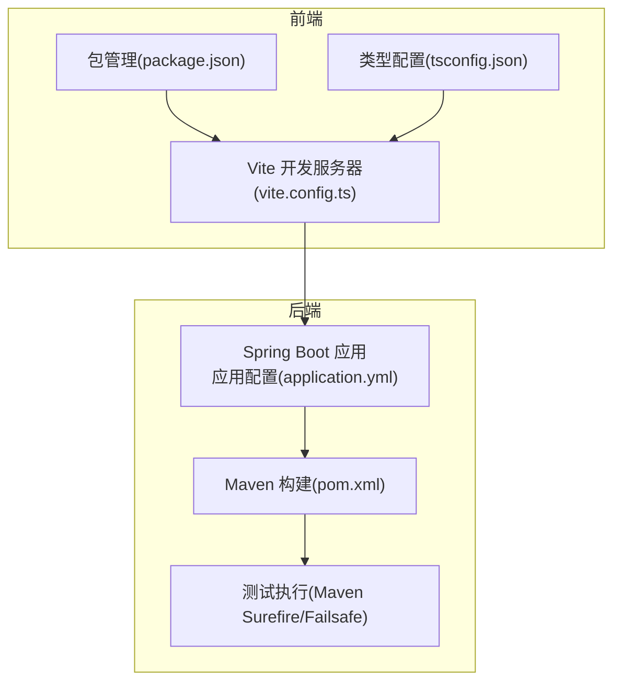
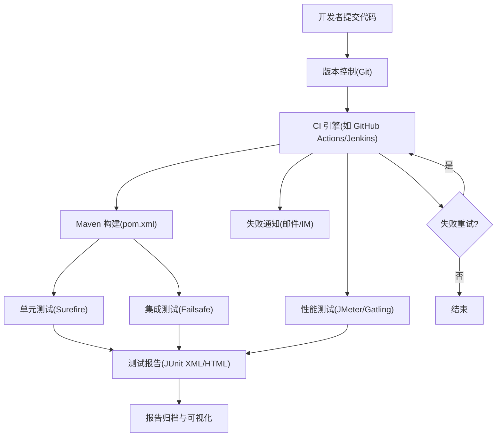
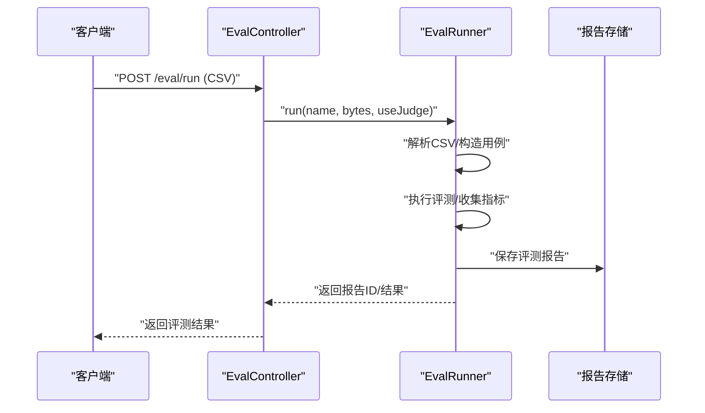
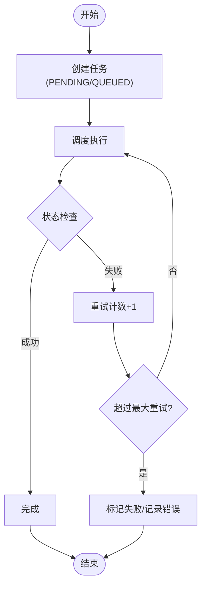
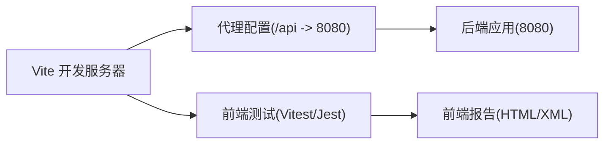
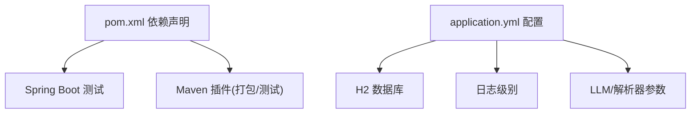

# 测试自动化

<cite>
**本文引用的文件**
- [pom.xml](file://pom.xml)
- [application.yml](file://src/main/resources/application.yml)
- [mvnw.cmd](file://mvnw.cmd)
- [package.json](file://web/package.json)
- [vite.config.ts](file://web/vite.config.ts)
- [tsconfig.json](file://web/tsconfig.json)
- [EvalController.java](file://src/main/java/com/example/llmwiki/api/EvalController.java)
- [EvalRunner.java](file://src/main/java/com/example/llmwiki/eval/EvalRunner.java)
- [IngestQueueService.java](file://src/main/java/com/example/llmwiki/queue/IngestQueueService.java)
</cite>

## 目录
1. [简介](#简介)
2. [项目结构](#项目结构)
3. [核心组件](#核心组件)
4. [架构总览](#架构总览)
5. [详细组件分析](#详细组件分析)
6. [依赖分析](#依赖分析)
7. [性能考虑](#性能考虑)
8. [故障排查指南](#故障排查指南)
9. [结论](#结论)
10. [附录](#附录)

## 简介
本文件面向 LLM Wiki 项目的测试自动化，系统化梳理 CI/CD 流水线中的测试集成方案，涵盖测试执行顺序与并行策略、测试报告生成、测试环境自动化（含 Docker 容器、数据库迁移与测试数据准备）、测试失败处理（重试、通知、诊断）、性能测试（JMeter/Gatling 集成与负载测试自动化）、以及测试监控与告警配置。文档同时提供代码级架构图与流程图，帮助开发者与运维人员快速落地。

## 项目结构
LLM Wiki 采用前后端分离架构：后端基于 Spring Boot（Java），使用 Maven 构建；前端基于 Vue3 + Vite。测试自动化应覆盖后端单元/集成测试、前端单元测试、端到端测试以及性能测试。

图表来源
- [pom.xml:161-169](file://pom.xml#L161-L169)
- [application.yml:1-84](file://src/main/resources/application.yml#L1-L84)
- [vite.config.ts:1-22](file://web/vite.config.ts#L1-L22)
- [package.json:1-31](file://web/package.json#L1-L31)
- [tsconfig.json:1-20](file://web/tsconfig.json#L1-L20)

章节来源
- [pom.xml:1-171](file://pom.xml#L1-L171)
- [application.yml:1-84](file://src/main/resources/application.yml#L1-L84)
- [mvnw.cmd:1-189](file://mvnw.cmd#L1-L189)
- [package.json:1-31](file://web/package.json#L1-L31)
- [vite.config.ts:1-22](file://web/vite.config.ts#L1-L22)
- [tsconfig.json:1-20](file://web/tsconfig.json#L1-L20)

## 核心组件
- 后端测试基础
  - 使用 Spring Boot Starter Test 提供测试依赖与运行时支持。
  - Maven 插件用于打包与测试阶段执行。
- 数据库与配置
  - 内嵌 H2 数据库用于开发与测试，DDL 自动更新，便于测试隔离与快速回滚。
- 评估与评测
  - 评估控制器与评估运行器负责评测用例解析与执行，可作为测试场景入口。
- 摄取队列与重试
  - 摄取队列服务提供任务取消与重试逻辑，便于测试异常路径与恢复能力。

章节来源
- [pom.xml:154-158](file://pom.xml#L154-L158)
- [application.yml:11-29](file://src/main/resources/application.yml#L11-L29)
- [EvalController.java:37-53](file://src/main/java/com/example/llmwiki/api/EvalController.java#L37-L53)
- [EvalRunner.java:168-203](file://src/main/java/com/example/llmwiki/eval/EvalRunner.java#L168-L203)
- [IngestQueueService.java:115-134](file://src/main/java/com/example/llmwiki/queue/IngestQueueService.java#L115-L134)

## 架构总览
下图展示测试自动化在 CI/CD 中的位置与交互关系：构建阶段触发测试，测试结果与报告输出，失败时触发重试与通知，性能测试独立于主流水线但可复用相同环境。

图表来源
- [pom.xml:161-169](file://pom.xml#L161-L169)
- [application.yml:11-29](file://src/main/resources/application.yml#L11-L29)

## 详细组件分析

### 组件一：评估评测测试(Eval)
评估控制器与评估运行器构成评测测试的核心。评测通过 CSV 输入驱动，解析用例并执行评估，返回报告。该组件适合纳入自动化测试，覆盖正常路径、边界条件与错误输入。

图表来源
- [EvalController.java:37-53](file://src/main/java/com/example/llmwiki/api/EvalController.java#L37-L53)
- [EvalRunner.java:168-203](file://src/main/java/com/example/llmwiki/eval/EvalRunner.java#L168-L203)

章节来源
- [EvalController.java:37-53](file://src/main/java/com/example/llmwiki/api/EvalController.java#L37-L53)
- [EvalRunner.java:168-203](file://src/main/java/com/example/llmwiki/eval/EvalRunner.java#L168-L203)

### 组件二：摄取任务重试测试(Ingest Queue)
摄取队列服务提供任务取消与重试能力，适合测试异常路径、并发冲突与恢复逻辑。通过模拟任务状态变更与重试计数，验证系统的健壮性。

图表来源
- [IngestQueueService.java:115-134](file://src/main/java/com/example/llmwiki/queue/IngestQueueService.java#L115-L134)
- [IngestQueueService.java:136-144](file://src/main/java/com/example/llmwiki/queue/IngestQueueService.java#L136-L144)

章节来源
- [IngestQueueService.java:105-144](file://src/main/java/com/example/llmwiki/queue/IngestQueueService.java#L105-L144)

### 组件三：前端测试与代理
前端使用 Vite 开发服务器，并通过代理将 /api 请求转发至后端 8080 端口。测试自动化可在此基础上进行端到端测试与 UI 回归测试。

图表来源
- [vite.config.ts:13-21](file://web/vite.config.ts#L13-L21)
- [package.json:7-11](file://web/package.json#L7-L11)

章节来源
- [vite.config.ts:1-22](file://web/vite.config.ts#L1-L22)
- [package.json:1-31](file://web/package.json#L1-L31)
- [tsconfig.json:1-20](file://web/tsconfig.json#L1-L20)

## 依赖分析
- 构建与测试依赖
  - Spring Boot 测试启动器提供测试框架与运行时。
  - Maven 插件负责打包与测试阶段执行。
- 运行时依赖
  - H2 数据库用于本地与 CI 环境，支持快速初始化与回滚。
  - 应用配置集中管理数据源、日志与 LLM/解析器等参数。

图表来源
- [pom.xml:36-159](file://pom.xml#L36-L159)
- [application.yml:11-84](file://src/main/resources/application.yml#L11-L84)

章节来源
- [pom.xml:1-171](file://pom.xml#L1-L171)
- [application.yml:1-84](file://src/main/resources/application.yml#L1-L84)

## 性能考虑
- 单元测试优先：聚焦纯函数与业务逻辑，避免外部依赖，提升执行速度。
- 集成测试隔离：使用内嵌 H2 与内存数据库，缩短初始化时间。
- 并行执行：Maven 可配置并行度，结合测试分层减少串行依赖。
- 性能测试独立流水线：JMeter/Gatling 与主流水线解耦，按需触发，降低对主流水线的影响。
- 资源限制：CI 节点资源有限，建议对大体量测试设置超时与重试上限。

## 故障排查指南
- 测试失败重试
  - 对瞬时性失败（网络抖动、数据库锁）启用重试策略，避免误报。
  - 结合任务重试逻辑，验证失败恢复路径。
- 通知机制
  - 在 CI 中集成通知通道（邮件、IM），失败时及时触达责任人。
- 问题诊断
  - 收集测试日志、JUnit XML 报告与覆盖率报告，定位失败根因。
  - 利用 H2 控制台路径进行数据库状态核验。
- 环境一致性
  - 使用 Maven Wrapper 保证构建环境一致，避免“本地能跑、CI 失败”。

章节来源
- [IngestQueueService.java:126-134](file://src/main/java/com/example/llmwiki/queue/IngestQueueService.java#L126-L134)
- [application.yml:17-19](file://src/main/resources/application.yml#L17-L19)
- [mvnw.cmd:1-189](file://mvnw.cmd#L1-L189)

## 结论
通过将评估评测、摄取任务与前端测试纳入统一的 CI/CD 流水线，结合 H2 数据库与内嵌配置，可实现高效率、可重复的测试自动化。建议进一步引入性能测试独立流水线与监控告警，形成从单元到端到端再到性能的全链路质量保障体系。

## 附录
- 测试报告格式
  - JUnit XML：用于 CI 平台解析与趋势分析。
  - HTML 报告：便于人工审阅与定位问题。
  - 覆盖率报告：结合 JaCoCo 或同类工具生成。
- Docker 环境建议
  - 使用多阶段构建镜像，内置 Maven Wrapper 与 Node.js，确保测试环境一致性。
  - 将 H2 数据库持久化目录映射到卷，便于报告与日志留存。
- 监控与告警
  - 将测试通过率、失败率、平均执行时长等指标接入监控面板。
  - 设置阈值告警，异常波动时自动通知。