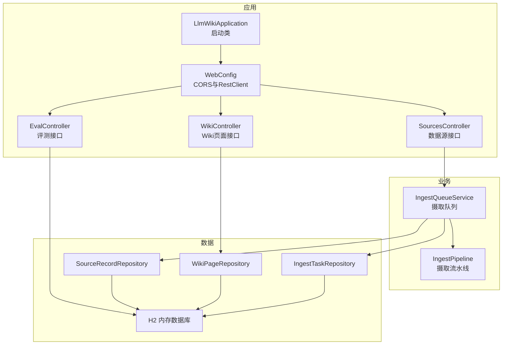
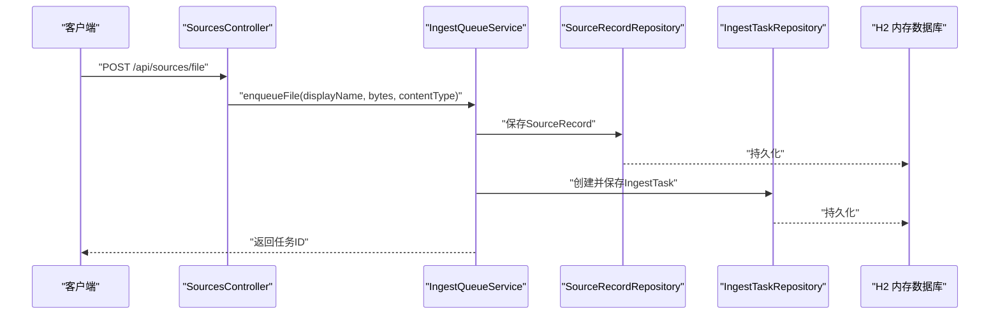
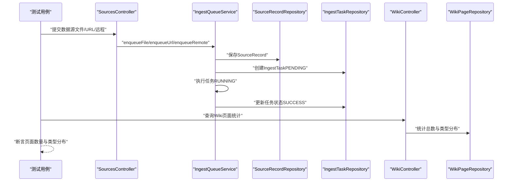
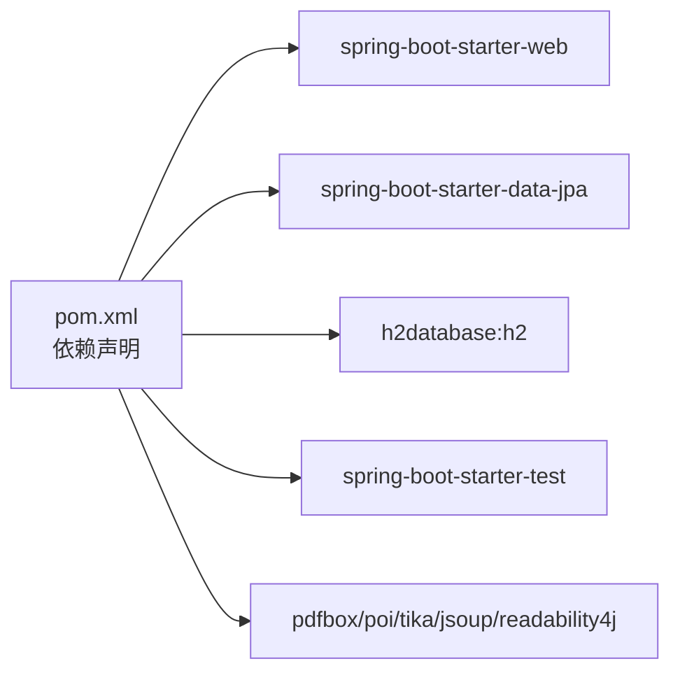

# 集成测试

<cite>
**本文引用的文件**
- [pom.xml](file://pom.xml)
- [application.yml](file://src/main/resources/application.yml)
- [LlmWikiApplication.java](file://src/main/java/com/example/llmwiki/LlmWikiApplication.java)
- [WebConfig.java](file://src/main/java/com/example/llmwiki/config/WebConfig.java)
- [SourcesController.java](file://src/main/java/com/example/llmwiki/api/SourcesController.java)
- [WikiController.java](file://src/main/java/com/example/llmwiki/api/WikiController.java)
- [EvalController.java](file://src/main/java/com/example/llmwiki/api/EvalController.java)
- [SourceRecordRepository.java](file://src/main/java/com/example/llmwiki/repository/SourceRecordRepository.java)
- [WikiPageRepository.java](file://src/main/java/com/example/llmwiki/repository/WikiPageRepository.java)
- [IngestTaskRepository.java](file://src/main/java/com/example/llmwiki/repository/IngestTaskRepository.java)
- [IngestQueueService.java](file://src/main/java/com/example/llmwiki/queue/IngestQueueService.java)
- [IngestTask.java](file://src/main/java/com/example/llmwiki/domain/IngestTask.java)
- [SourceRecord.java](file://src/main/java/com/example/llmwiki/domain/SourceRecord.java)
- [StorageProperties.java](file://src/main/java/com/example/llmwiki/config/StorageProperties.java)
</cite>

## 目录
1. [简介](#简介)
2. [项目结构](#项目结构)
3. [核心组件](#核心组件)
4. [架构总览](#架构总览)
5. [详细组件分析](#详细组件分析)
6. [依赖分析](#依赖分析)
7. [性能考虑](#性能考虑)
8. [故障排查指南](#故障排查指南)
9. [结论](#结论)
10. [附录](#附录)

## 简介
本文件面向LLM Wiki项目的集成测试实践，系统性阐述如何基于Spring Boot Test框架进行端到端测试，覆盖以下主题：
- 测试注解与策略：@SpringBootTest、@DataJpaTest、@WebMvcTest等的适用场景与组合方式
- 数据库测试：H2内存数据库配置、@AutoConfigureTestDatabase、@Sql脚本的使用
- API接口测试：REST Assured或MockMvc的使用、HTTP请求模拟、响应断言
- 外部服务集成测试：通过Mock外部API、测试桩与异步服务的测试策略
- 事务管理与数据隔离：测试事务回滚、隔离级别与清理策略
- 端到端测试场景：完整文档摄取流程（从提交数据源到生成Wiki页面）的测试设计与实现

## 项目结构
LLM Wiki采用Spring Boot标准工程结构，后端以Web层控制器为核心入口，配合JPA仓储层访问数据库，业务逻辑由队列服务驱动摄取流水线完成。测试应围绕控制器、仓储与业务服务展开，同时结合H2内存数据库与必要的外部依赖Mock。

图表来源
- [LlmWikiApplication.java:1-29](file://src/main/java/com/example/llmwiki/LlmWikiApplication.java#L1-L29)
- [WebConfig.java:1-35](file://src/main/java/com/example/llmwiki/config/WebConfig.java#L1-L35)
- [SourcesController.java:1-102](file://src/main/java/com/example/llmwiki/api/SourcesController.java#L1-L102)
- [WikiController.java:1-51](file://src/main/java/com/example/llmwiki/api/WikiController.java#L1-L51)
- [EvalController.java:37-53](file://src/main/java/com/example/llmwiki/api/EvalController.java#L37-L53)
- [IngestQueueService.java:1-214](file://src/main/java/com/example/llmwiki/queue/IngestQueueService.java#L1-L214)
- [SourceRecordRepository.java:1-20](file://src/main/java/com/example/llmwiki/repository/SourceRecordRepository.java#L1-L20)
- [WikiPageRepository.java:1-19](file://src/main/java/com/example/llmwiki/repository/WikiPageRepository.java#L1-L19)
- [IngestTaskRepository.java:1-17](file://src/main/java/com/example/llmwiki/repository/IngestTaskRepository.java#L1-L17)

章节来源
- [pom.xml:36-159](file://pom.xml#L36-L159)
- [application.yml:1-84](file://src/main/resources/application.yml#L1-L84)

## 核心组件
- 控制器层：对外提供HTTP接口，负责参数接收、调用业务服务与返回响应
- 业务服务层：封装摄取队列与任务执行逻辑，支持取消、重试与进度事件发布
- 仓储层：基于JPA访问H2内存数据库，提供数据查询与聚合
- 配置层：跨域配置与共享RestClient，便于外部HTTP调用测试

章节来源
- [SourcesController.java:1-102](file://src/main/java/com/example/llmwiki/api/SourcesController.java#L1-L102)
- [WikiController.java:1-51](file://src/main/java/com/example/llmwiki/api/WikiController.java#L1-L51)
- [IngestQueueService.java:1-214](file://src/main/java/com/example/llmwiki/queue/IngestQueueService.java#L1-L214)
- [SourceRecordRepository.java:1-20](file://src/main/java/com/example/llmwiki/repository/SourceRecordRepository.java#L1-L20)
- [WikiPageRepository.java:1-19](file://src/main/java/com/example/llmwiki/repository/WikiPageRepository.java#L1-L19)
- [WebConfig.java:1-35](file://src/main/java/com/example/llmwiki/config/WebConfig.java#L1-L35)

## 架构总览
下图展示从HTTP请求到数据库与业务服务的交互路径，以及测试中需要关注的关键节点。

图表来源
- [SourcesController.java:45-48](file://src/main/java/com/example/llmwiki/api/SourcesController.java#L45-L48)
- [IngestQueueService.java:73-91](file://src/main/java/com/example/llmwiki/queue/IngestQueueService.java#L73-L91)
- [SourceRecordRepository.java:13-15](file://src/main/java/com/example/llmwiki/repository/SourceRecordRepository.java#L13-L15)
- [IngestTaskRepository.java:12-14](file://src/main/java/com/example/llmwiki/repository/IngestTaskRepository.java#L12-L14)

## 详细组件分析

### 测试注解与策略
- @SpringBootTest：加载完整ApplicationContext，适合端到端测试，包含Web环境与数据库
- @DataJpaTest：专注JPA层测试，自动配置内存数据库与实体映射，适合仓储层单元测试
- @WebMvcTest：专注Web层测试，仅加载Web相关组件，适合控制器层测试
- 组合策略：对控制器与仓储分别使用@WebMvcTest与@DataJpaTest；对完整流程使用@SpringBootTest

章节来源
- [pom.xml:154-158](file://pom.xml#L154-L158)
- [application.yml:11-29](file://src/main/resources/application.yml#L11-L29)

### 数据库测试策略
- H2内存数据库：通过application.yml配置H2文件模式，测试时可利用内存模式提升速度
- @AutoConfigureTestDatabase：在测试中替换默认数据源为H2内存数据库
- @Sql脚本：用于初始化测试数据与清理，建议按测试用例粒度拆分SQL文件
- 事务与隔离：使用@Transactional在测试方法上开启事务并在结束后回滚，确保数据隔离与干净状态

章节来源
- [application.yml:11-29](file://src/main/resources/application.yml#L11-L29)
- [pom.xml:55-60](file://pom.xml#L55-L60)

### API接口测试（MockMvc）
- 控制器测试要点
  - SourcesController：验证文件上传、URL注册、远程来源注册、任务列表、取消与重试
  - WikiController：验证页面列表、详情查询、统计信息
  - EvalController：验证评测报告列表与详情
- 请求模拟与断言
  - 使用MockMvc发送HTTP请求，断言状态码、响应头与JSON结构
  - 对于文件上传，构造multipart请求并断言任务ID与状态
- 跨域与共享RestClient
  - WebConfig提供CORS与共享RestClient，测试中可直接注入使用

章节来源
- [SourcesController.java:40-84](file://src/main/java/com/example/llmwiki/api/SourcesController.java#L40-L84)
- [WikiController.java:29-49](file://src/main/java/com/example/llmwiki/api/WikiController.java#L29-L49)
- [EvalController.java:37-53](file://src/main/java/com/example/llmwiki/api/EvalController.java#L37-L53)
- [WebConfig.java:19-33](file://src/main/java/com/example/llmwiki/config/WebConfig.java#L19-L33)

### 外部服务集成测试
- Mock外部API
  - 使用MockWebServer或WireMock在测试中拦截外部HTTP调用，返回预设响应
  - 在测试配置中替换实际的LLM服务Base URL，指向本地Mock服务器
- 测试桩与异步服务
  - 对异步任务（摄取队列）进行Mock或短时等待，确保任务状态可预测
  - 使用ProgressBus事件进行进度验证，避免真实外部服务依赖

章节来源
- [WebConfig.java:30-33](file://src/main/java/com/example/llmwiki/config/WebConfig.java#L30-L33)
- [IngestQueueService.java:159-212](file://src/main/java/com/example/llmwiki/queue/IngestQueueService.java#L159-L212)

### 事务管理与数据隔离
- 事务回滚：在测试方法上添加@Transactional，确保每个测试用例执行后回滚
- 隔离级别：必要时设置隔离级别，避免并发测试相互影响
- 清理策略：使用@Sql在测试前后执行清理SQL，删除测试产生的数据

章节来源
- [pom.xml:154-158](file://pom.xml#L154-L158)
- [application.yml:20-25](file://src/main/resources/application.yml#L20-L25)

### 端到端测试场景：完整文档摄取流程
- 场景目标：从提交数据源（文件/URL/远程）到生成Wiki页面的完整链路验证
- 步骤分解
  1) 提交数据源：调用SourcesController的文件上传或URL注册接口
  2) 任务创建与执行：校验IngestTaskRepository中任务状态为PENDING/RUNNING/SUCCESS
  3) Wiki页面生成：调用WikiController查询页面列表与统计，验证页面数量与类型分布
  4) 评测报告：调用EvalController验证评测报告存在
- 异步处理：等待摄取队列完成或Mock外部服务响应，确保最终一致性

图表来源
- [SourcesController.java:45-61](file://src/main/java/com/example/llmwiki/api/SourcesController.java#L45-L61)
- [IngestQueueService.java:73-113](file://src/main/java/com/example/llmwiki/queue/IngestQueueService.java#L73-L113)
- [IngestTaskRepository.java:12-16](file://src/main/java/com/example/llmwiki/repository/IngestTaskRepository.java#L12-L16)
- [WikiController.java:41-49](file://src/main/java/com/example/llmwiki/api/WikiController.java#L41-L49)
- [WikiPageRepository.java:13-18](file://src/main/java/com/example/llmwiki/repository/WikiPageRepository.java#L13-L18)

## 依赖分析
- Spring Boot Starter：web、data-jpa、validation、quartz
- H2数据库：运行时依赖，用于测试与开发环境
- 文件解析与爬虫：PDFBox、POI、Tika、Jsoup、Readability4j
- Lombok：简化实体与配置类
- 测试依赖：spring-boot-starter-test（JUnit、Mockito、JsonPath等）

图表来源
- [pom.xml:36-159](file://pom.xml#L36-L159)

章节来源
- [pom.xml:36-159](file://pom.xml#L36-L159)

## 性能考虑
- 测试数据库：优先使用H2内存数据库，避免磁盘IO开销
- 事务批量：在单个测试方法内批量断言，减少重复查询
- 异步测试：对异步任务使用可控的等待或Mock，避免真实线程池阻塞
- 资源释放：测试完成后及时关闭资源，避免连接泄漏

## 故障排查指南
- 控制器测试失败
  - 检查请求路径与参数是否匹配控制器定义
  - 确认CORS配置允许测试客户端访问
- 仓储测试失败
  - 确认实体映射与表名一致
  - 检查DDL自动生成策略与字段类型
- 异步任务未完成
  - 确认摄取队列线程池正常工作
  - 使用Mock外部服务或短时等待
- 外部服务调用异常
  - 检查共享RestClient的Base URL是否指向Mock服务器
  - 校验超时与重试配置

章节来源
- [WebConfig.java:19-33](file://src/main/java/com/example/llmwiki/config/WebConfig.java#L19-L33)
- [IngestQueueService.java:53-63](file://src/main/java/com/example/llmwiki/queue/IngestQueueService.java#L53-L63)

## 结论
通过合理选择测试注解、配置H2内存数据库、结合Mock外部服务与异步处理，可以高效地构建覆盖控制器、仓储与完整业务流程的集成测试体系。建议以端到端场景为主线，逐步细化到控制器与仓储测试，确保系统稳定性与可维护性。

## 附录
- 测试最佳实践清单
  - 使用@WebMvcTest覆盖控制器行为
  - 使用@DataJpaTest覆盖仓储行为
  - 使用@SpringBootTest覆盖完整流程
  - 使用@Sql进行数据初始化与清理
  - 使用Mock外部服务降低耦合
  - 使用事务回滚保证测试隔离