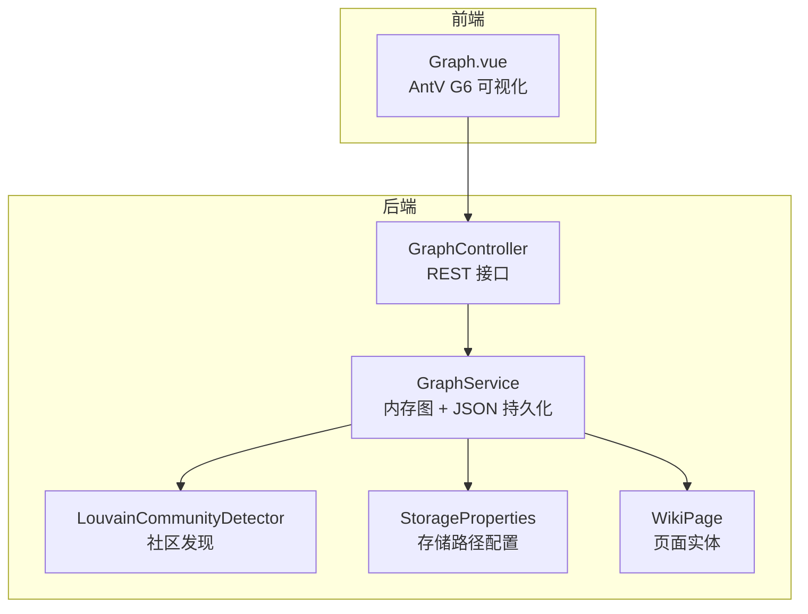
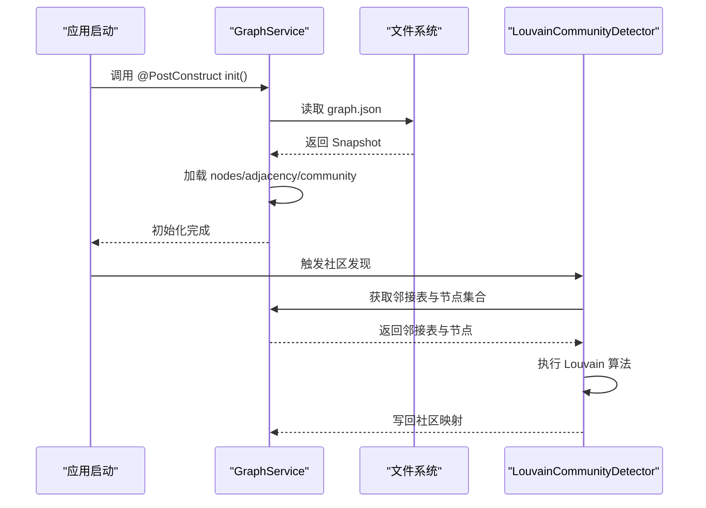
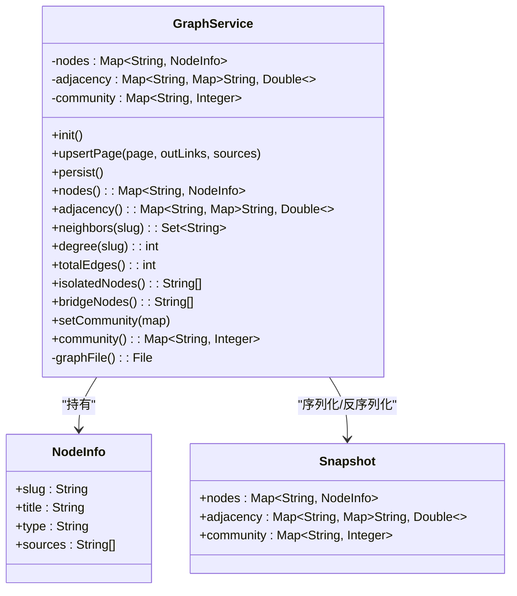
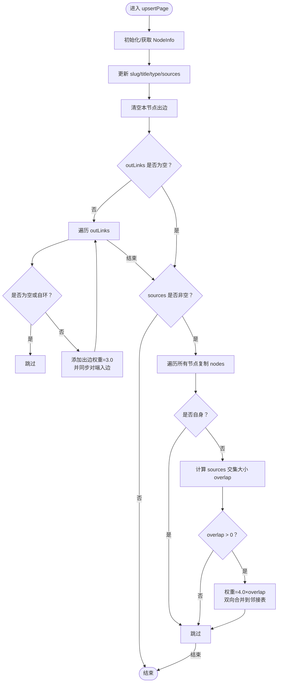
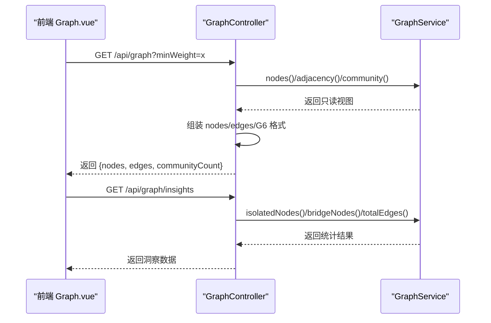
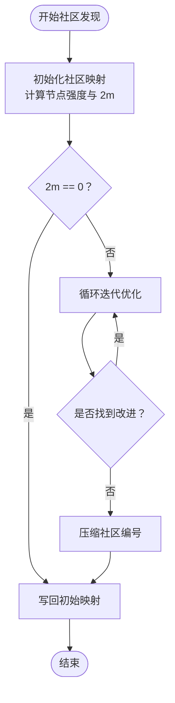
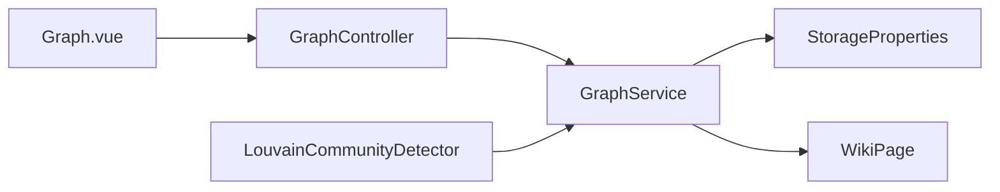

# 图谱服务架构

<cite>
**本文引用的文件**
- [GraphService.java](file://src/main/java/com/example/llmwiki/graph/GraphService.java)
- [LouvainCommunityDetector.java](file://src/main/java/com/example/llmwiki/graph/LouvainCommunityDetector.java)
- [GraphController.java](file://src/main/java/com/example/llmwiki/api/GraphController.java)
- [StorageProperties.java](file://src/main/java/com/example/llmwiki/config/StorageProperties.java)
- [WikiPage.java](file://src/main/java/com/example/llmwiki/domain/WikiPage.java)
- [application.yml](file://src/main/resources/application.yml)
- [Graph.vue](file://web/src/views/Graph.vue)
</cite>

## 目录
1. [简介](#简介)
2. [项目结构](#项目结构)
3. [核心组件](#核心组件)
4. [架构概览](#架构概览)
5. [详细组件分析](#详细组件分析)
6. [依赖关系分析](#依赖关系分析)
7. [性能考量](#性能考量)
8. [故障排查指南](#故障排查指南)
9. [结论](#结论)
10. [附录](#附录)

## 简介
本技术文档围绕 LLM Wiki 的图谱服务架构展开，重点解析 GraphService 的设计与实现，包括：
- 内存图存储模型与并发安全策略
- JSON 持久化机制与 Snapshot 设计
- 图谱初始化流程（基于 @PostConstruct 的 init 方法）
- upsertPage 的节点更新与边重建逻辑
- 图谱查询接口与统计功能
- 社区划分与图谱维护工具

## 项目结构
图谱服务位于后端 Java 模块中，采用 Spring Boot 架构，核心文件分布如下：
- graph 包：图谱核心服务与社区检测算法
- api 包：对外暴露的 REST 接口
- config 包：存储路径等配置
- domain 包：Wiki 页面实体定义
- resources：应用配置文件
- web：前端可视化展示

图表来源
- [GraphService.java:34-196](file://src/main/java/com/example/llmwiki/graph/GraphService.java#L34-L196)
- [LouvainCommunityDetector.java:24-142](file://src/main/java/com/example/llmwiki/graph/LouvainCommunityDetector.java#L24-L142)
- [GraphController.java:21-85](file://src/main/java/com/example/llmwiki/api/GraphController.java#L21-L85)
- [StorageProperties.java:13-28](file://src/main/java/com/example/llmwiki/config/StorageProperties.java#L13-L28)
- [WikiPage.java:23-71](file://src/main/java/com/example/llmwiki/domain/WikiPage.java#L23-L71)
- [Graph.vue:16-74](file://web/src/views/Graph.vue#L16-L74)

章节来源
- [GraphService.java:24-69](file://src/main/java/com/example/llmwiki/graph/GraphService.java#L24-L69)
- [GraphController.java:21-85](file://src/main/java/com/example/llmwiki/api/GraphController.java#L21-L85)
- [StorageProperties.java:13-28](file://src/main/java/com/example/llmwiki/config/StorageProperties.java#L13-L28)
- [application.yml:31-38](file://src/main/resources/application.yml#L31-L38)

## 核心组件
- GraphService：负责内存中的节点信息、邻接表与社区映射管理，并提供 JSON 持久化与查询统计能力。
- LouvainCommunityDetector：实现简化版 Louvain 社区发现算法，支持模块度优化与社区内聚度评估。
- GraphController：对外提供图谱数据与洞察的 REST 接口，适配前端可视化。
- StorageProperties：集中管理存储路径，确保图谱 JSON 文件的读写位置可控。
- WikiPage：页面实体，承载 slug、标题、类型、来源与出边等信息，用于图谱构建。

章节来源
- [GraphService.java:34-196](file://src/main/java/com/example/llmwiki/graph/GraphService.java#L34-L196)
- [LouvainCommunityDetector.java:24-142](file://src/main/java/com/example/llmwiki/graph/LouvainCommunityDetector.java#L24-L142)
- [GraphController.java:21-85](file://src/main/java/com/example/llmwiki/api/GraphController.java#L21-L85)
- [StorageProperties.java:13-28](file://src/main/java/com/example/llmwiki/config/StorageProperties.java#L13-L28)
- [WikiPage.java:23-71](file://src/main/java/com/example/llmwiki/domain/WikiPage.java#L23-L71)

## 架构概览
图谱服务采用“内存图 + JSON 持久化”的混合架构：
- 内存存储：使用并发安全的 Map 结构维护节点信息与邻接表，保证高并发下的读写一致性。
- JSON 持久化：通过 Snapshot 类序列化整个图状态，统一写入 graph.json 文件，便于重启恢复与备份。
- 初始化流程：应用启动时，@PostConstruct 注解的 init 方法自动加载 graph.json 并重建内存图。
- 查询接口：提供 nodes、adjacency、neighbors、degree 等只读查询，以及 totalEdges、isolatedNodes、bridgeNodes 等统计分析。
- 社区发现：结合 Louvain 算法进行社区划分，并提供社区内聚度评估。

图表来源
- [GraphService.java:49-69](file://src/main/java/com/example/llmwiki/graph/GraphService.java#L49-L69)
- [LouvainCommunityDetector.java:34-113](file://src/main/java/com/example/llmwiki/graph/LouvainCommunityDetector.java#L34-L113)

## 详细组件分析

### GraphService：内存图存储与 JSON 持久化
- 内存结构
  - nodes：Map<slug, NodeInfo>，存储节点元信息（slug、title、type、sources）。
  - adjacency：Map<slug, Map<neighbor, weight>>，邻接表表示无向加权图。
  - community：Map<slug, communityId>，节点到社区 ID 的映射。
- 并发安全
  - 使用 ConcurrentHashMap 保证多线程读取的安全性。
  - 关键写操作（upsertPage、persist、setCommunity）通过 synchronized 方法确保原子性。
- 初始化流程
  - @PostConstruct init() 在应用启动时执行，检查 graph.json 是否存在，若存在则反序列化 Snapshot 并填充内存结构。
- JSON 持久化
  - persist() 将 nodes、adjacency、community 序列化为 Snapshot 并写入 graph.json，使用 pretty-printer 提升可读性。
  - graph.json 文件路径由 StorageProperties.graphDir + "graph.json" 组合确定。
- 查询与统计
  - nodes()、adjacency() 返回不可变视图，避免外部修改。
  - neighbors(slug)、degree(slug) 提供邻接查询与度数统计。
  - totalEdges() 通过遍历邻接表累加并除以 2 得到无向图边数。
  - isolatedNodes() 过滤度数小于等于 1 的节点。
  - bridgeNodes() 统计连接至少 3 个不同社区的节点。
  - setCommunity()/community() 支持社区映射的写入与读取。

图表来源
- [GraphService.java:34-196](file://src/main/java/com/example/llmwiki/graph/GraphService.java#L34-L196)

章节来源
- [GraphService.java:34-196](file://src/main/java/com/example/llmwiki/graph/GraphService.java#L34-L196)
- [StorageProperties.java:13-28](file://src/main/java/com/example/llmwiki/config/StorageProperties.java#L13-L28)
- [application.yml:31-38](file://src/main/resources/application.yml#L31-L38)

### upsertPage：节点信息更新与边重建
upsertPage 是图谱更新的核心入口，负责：
- 更新节点元信息：slug、title、type、sources。
- 重建出边：清空旧出边，根据 outLinks 重建新的出边，直接链接权重固定为 3.0，并同步维护对端的入边。
- 源文件重叠计算：遍历所有节点，计算与当前节点 sources 的交集大小 overlap，若 overlap > 0，则以 4.0 × overlap 作为边权重，双向合并到邻接表中。

图表来源
- [GraphService.java:71-104](file://src/main/java/com/example/llmwiki/graph/GraphService.java#L71-L104)

章节来源
- [GraphService.java:71-104](file://src/main/java/com/example/llmwiki/graph/GraphService.java#L71-L104)
- [WikiPage.java:23-71](file://src/main/java/com/example/llmwiki/domain/WikiPage.java#L23-L71)

### 图谱查询接口与前端集成
- GraphController 提供两个主要接口：
  - GET /api/graph：返回适配 AntV G6 的 nodes/edges 格式，支持 minWeight 参数过滤低权重边。
  - GET /api/graph/insights：返回孤立节点、桥节点、总节点数、总边数等洞察信息。
- 前端 Graph.vue 通过滑块控制 minWeight，调用 getGraph/minWeight 接口渲染可视化图谱。

图表来源
- [GraphController.java:28-84](file://src/main/java/com/example/llmwiki/api/GraphController.java#L28-L84)
- [Graph.vue:30-74](file://web/src/views/Graph.vue#L30-L74)

章节来源
- [GraphController.java:28-84](file://src/main/java/com/example/llmwiki/api/GraphController.java#L28-L84)
- [Graph.vue:30-74](file://web/src/views/Graph.vue#L30-L74)

### 社区划分与维护工具
- LouvainCommunityDetector 实现了简化版 Louvain 算法：
  - 初始化：每个节点一个社区，计算节点强度与总边权重 2m。
  - 迭代优化：对每个节点尝试移动到能最大化模块度增量的邻居社区，最多迭代 30 次。
  - 压缩编号：将社区 ID 重新映射为连续编号，写回 GraphService。
  - cohesion：计算社区内聚度（实际边数/可能边数）。
- GraphService 提供 setCommunity()/community() 与 bridgeNodes() 等维护工具，辅助图谱治理。

图表来源
- [LouvainCommunityDetector.java:34-113](file://src/main/java/com/example/llmwiki/graph/LouvainCommunityDetector.java#L34-L113)

章节来源
- [LouvainCommunityDetector.java:24-142](file://src/main/java/com/example/llmwiki/graph/LouvainCommunityDetector.java#L24-L142)
- [GraphService.java:148-176](file://src/main/java/com/example/llmwiki/graph/GraphService.java#L148-L176)

## 依赖关系分析
- GraphService 依赖 StorageProperties 获取 graph.json 的存储路径，依赖 ObjectMapper 进行 JSON 序列化/反序列化。
- GraphController 依赖 GraphService 提供的数据与洞察。
- LouvainCommunityDetector 依赖 GraphService 的邻接表与节点集合，执行社区发现后写回 GraphService。
- 前端 Graph.vue 依赖 GraphController 的 /api/graph 与 /api/graph/insights 接口。

图表来源
- [GraphController.java:21-85](file://src/main/java/com/example/llmwiki/api/GraphController.java#L21-L85)
- [GraphService.java:34-196](file://src/main/java/com/example/llmwiki/graph/GraphService.java#L34-L196)
- [LouvainCommunityDetector.java:24-142](file://src/main/java/com/example/llmwiki/graph/LouvainCommunityDetector.java#L24-L142)
- [StorageProperties.java:13-28](file://src/main/java/com/example/llmwiki/config/StorageProperties.java#L13-L28)
- [WikiPage.java:23-71](file://src/main/java/com/example/llmwiki/domain/WikiPage.java#L23-L71)
- [Graph.vue:16-74](file://web/src/views/Graph.vue#L16-L74)

章节来源
- [GraphController.java:21-85](file://src/main/java/com/example/llmwiki/api/GraphController.java#L21-L85)
- [GraphService.java:34-196](file://src/main/java/com/example/llmwiki/graph/GraphService.java#L34-L196)
- [LouvainCommunityDetector.java:24-142](file://src/main/java/com/example/llmwiki/graph/LouvainCommunityDetector.java#L24-L142)
- [StorageProperties.java:13-28](file://src/main/java/com/example/llmwiki/config/StorageProperties.java#L13-L28)
- [WikiPage.java:23-71](file://src/main/java/com/example/llmwiki/domain/WikiPage.java#L23-L71)
- [Graph.vue:16-74](file://web/src/views/Graph.vue#L16-L74)

## 性能考量
- 内存图的并发读写
  - nodes/adjacency/community 使用 ConcurrentHashMap，读操作无需锁；写操作通过 synchronized 方法串行化，避免竞态条件。
- 序列化与持久化
  - 使用 Jackson ObjectMapper 进行 Snapshot 序列化，pretty-printer 提升可读性但会增加文件体积；建议在生产环境根据需要调整。
- 社区发现复杂度
  - Louvain 算法在个人规模（节点数 < 5k）下复杂度可接受；若节点数增长，可考虑分批处理或降采样策略。
- 查询与统计
  - totalEdges() 需要遍历邻接表，时间复杂度 O(V+E)；isolatedNodes()/bridgeNodes() 依赖 degree() 与 neighbors()，整体开销与图规模线性相关。

[本节为通用性能讨论，不直接分析具体文件]

## 故障排查指南
- 图谱加载失败
  - 现象：启动日志出现“加载图谱失败”警告。
  - 排查：确认 graph.json 文件是否存在且格式正确；检查 graphDir 配置路径是否可写。
  - 参考
    - [GraphService.java:49-69](file://src/main/java/com/example/llmwiki/graph/GraphService.java#L49-L69)
    - [StorageProperties.java:13-28](file://src/main/java/com/example/llmwiki/config/StorageProperties.java#L13-L28)
    - [application.yml:31-38](file://src/main/resources/application.yml#L31-L38)
- 持久化失败
  - 现象：日志出现“持久化图谱失败”警告。
  - 排查：确认 graphDir 对应目录存在且具备写权限；检查磁盘空间与文件系统状态。
  - 参考
    - [GraphService.java:106-118](file://src/main/java/com/example/llmwiki/graph/GraphService.java#L106-L118)
- 社区发现异常
  - 现象：社区数为 0 或异常波动。
  - 排查：确认邻接表是否为空或权重异常；检查 Louvain 算法迭代上限与输入数据质量。
  - 参考
    - [LouvainCommunityDetector.java:34-113](file://src/main/java/com/example/llmwiki/graph/LouvainCommunityDetector.java#L34-L113)
- 前端图谱显示异常
  - 现象：节点/边缺失或权重不正确。
  - 排查：检查 minWeight 参数是否过高导致边被过滤；确认 GraphController 返回的 nodes/edges 格式与前端期望一致。
  - 参考
    - [GraphController.java:28-84](file://src/main/java/com/example/llmwiki/api/GraphController.java#L28-L84)
    - [Graph.vue:30-74](file://web/src/views/Graph.vue#L30-L74)

章节来源
- [GraphService.java:49-69](file://src/main/java/com/example/llmwiki/graph/GraphService.java#L49-L69)
- [GraphService.java:106-118](file://src/main/java/com/example/llmwiki/graph/GraphService.java#L106-L118)
- [LouvainCommunityDetector.java:34-113](file://src/main/java/com/example/llmwiki/graph/LouvainCommunityDetector.java#L34-L113)
- [GraphController.java:28-84](file://src/main/java/com/example/llmwiki/api/GraphController.java#L28-L84)
- [Graph.vue:30-74](file://web/src/views/Graph.vue#L30-L74)
- [StorageProperties.java:13-28](file://src/main/java/com/example/llmwiki/config/StorageProperties.java#L13-L28)
- [application.yml:31-38](file://src/main/resources/application.yml#L31-L38)

## 结论
GraphService 通过“内存图 + JSON 持久化”的设计，在保证高并发读写性能的同时，提供了完整的图谱生命周期管理能力。结合 Louvain 社区发现与丰富的查询统计接口，能够支撑知识图谱的可视化展示与结构洞察。建议在生产环境中关注存储路径权限、序列化性能与社区发现参数调优，以获得更稳定的运行表现。

[本节为总结性内容，不直接分析具体文件]

## 附录

### 图谱持久化策略与 Snapshot 设计
- Snapshot 类包含 nodes、adjacency、community 三个字段，分别对应节点信息、邻接表与社区映射。
- graph.json 文件格式为标准 JSON，便于人工审阅与版本控制。
- 并发安全的写入机制：通过 synchronized 方法确保同一时刻只有一个线程写入，避免竞态。

章节来源
- [GraphService.java:106-118](file://src/main/java/com/example/llmwiki/graph/GraphService.java#L106-L118)
- [GraphService.java:190-195](file://src/main/java/com/example/llmwiki/graph/GraphService.java#L190-L195)

### 图谱查询接口清单
- nodes()：返回只读节点视图，包含 slug、title、type、sources。
- adjacency()：返回只读邻接表视图，包含边权重。
- neighbors(slug)：返回指定节点的所有邻居。
- degree(slug)：返回指定节点的度数。
- totalEdges()：返回无向图的总边数。
- isolatedNodes()：返回度数小于等于 1 的节点列表。
- bridgeNodes()：返回连接至少 3 个不同社区的节点列表。

章节来源
- [GraphService.java:120-176](file://src/main/java/com/example/llmwiki/graph/GraphService.java#L120-L176)

### 图谱统计功能说明
- totalEdges()：遍历邻接表累加边数并除以 2，得到无向图的边数。
- isolatedNodes()：筛选度数小于等于 1 的节点，排序输出。
- bridgeNodes()：基于社区映射统计连接不同社区的节点数量。

章节来源
- [GraphService.java:128-167](file://src/main/java/com/example/llmwiki/graph/GraphService.java#L128-L167)

### 图谱维护工具与建议
- 社区划分设置：通过 LouvainCommunityDetector 执行社区发现，写回 GraphService 的 community 映射。
- 图谱清理：可定期调用 persist() 将当前内存状态落盘，避免异常退出造成数据丢失。
- 数据迁移策略：graph.json 为纯文本 JSON，可进行版本化管理；迁移时建议先备份旧文件，再进行格式校验与兼容性检查。

章节来源
- [LouvainCommunityDetector.java:34-113](file://src/main/java/com/example/llmwiki/graph/LouvainCommunityDetector.java#L34-L113)
- [GraphService.java:106-118](file://src/main/java/com/example/llmwiki/graph/GraphService.java#L106-L118)