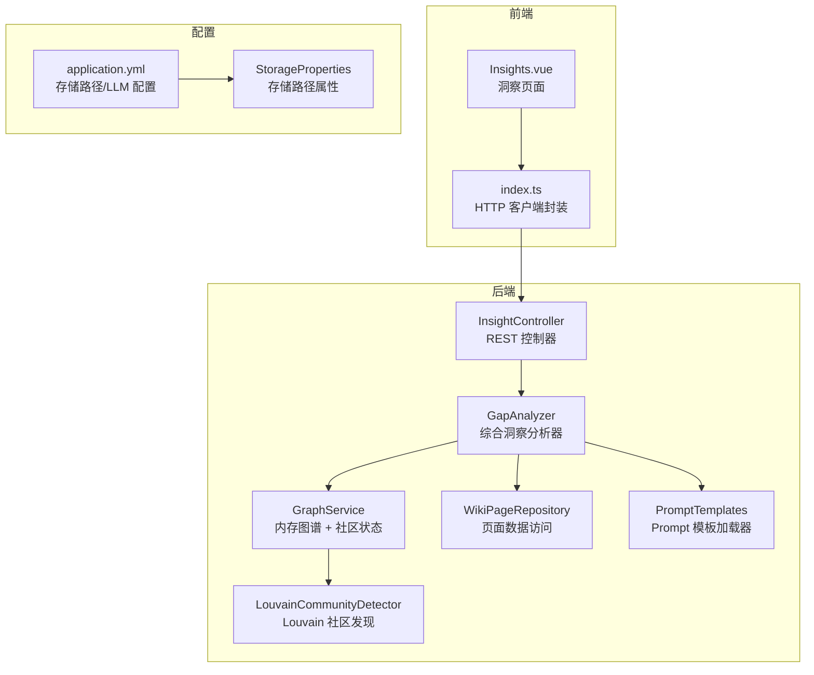
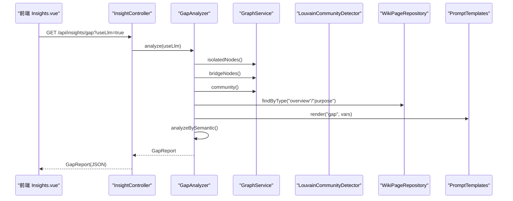
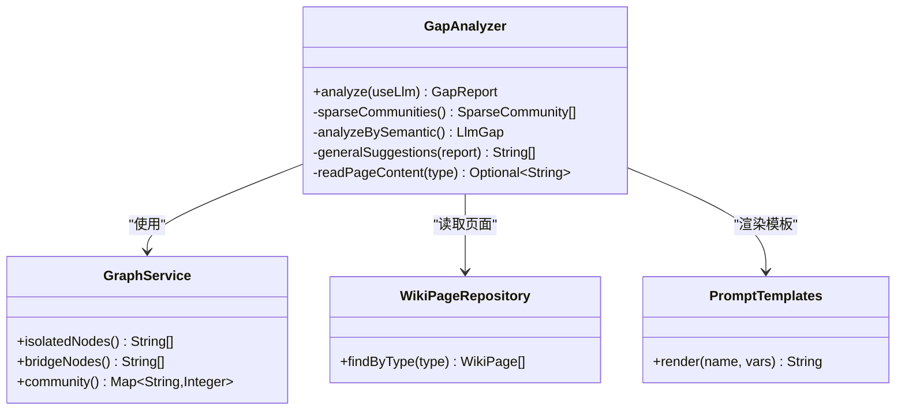
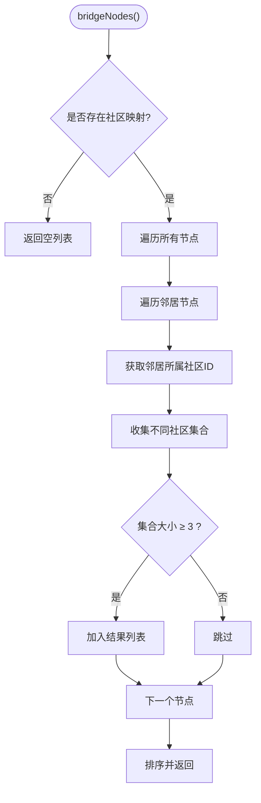
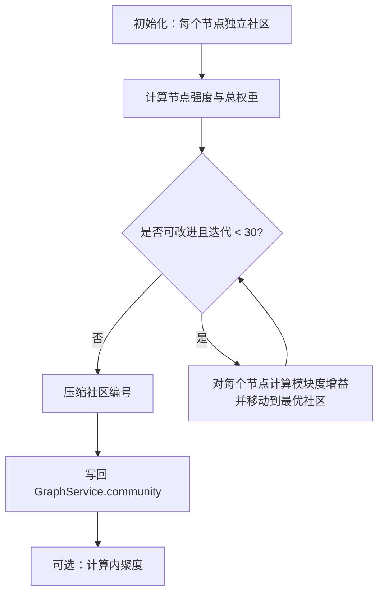
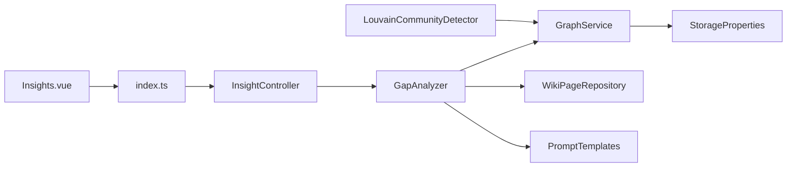

# 图谱洞察分析

<cite>
**本文引用的文件**
- [GapAnalyzer.java](file://src/main/java/com/example/llmwiki/insight/GapAnalyzer.java)
- [GraphService.java](file://src/main/java/com/example/llmwiki/graph/GraphService.java)
- [LouvainCommunityDetector.java](file://src/main/java/com/example/llmwiki/graph/LouvainCommunityDetector.java)
- [InsightController.java](file://src/main/java/com/example/llmwiki/api/InsightController.java)
- [application.yml](file://src/main/resources/application.yml)
- [Insights.vue](file://web/src/views/Insights.vue)
- [StorageProperties.java](file://src/main/java/com/example/llmwiki/config/StorageProperties.java)
- [gap.md](file://src/main/resources/prompts/gap.md)
- [index.ts](file://web/src/api/index.ts)
- [WikiPageRepository.java](file://src/main/java/com/example/llmwiki/repository/WikiPageRepository.java)
- [PromptTemplates.java](file://src/main/java/com/example/llmwiki/ingest/PromptTemplates.java)
</cite>

## 目录
1. [简介](#简介)
2. [项目结构](#项目结构)
3. [核心组件](#核心组件)
4. [架构总览](#架构总览)
5. [详细组件分析](#详细组件分析)
6. [依赖关系分析](#依赖关系分析)
7. [性能考虑](#性能考虑)
8. [故障排查指南](#故障排查指南)
9. [结论](#结论)
10. [附录](#附录)

## 简介
本技术文档围绕 LLM Wiki 的“图谱洞察分析”能力，系统阐述以下内容：
- 分析维度：孤立节点检测、桥接节点识别、稀疏社区分析
- bridgeNodes() 方法实现原理：如何识别连接至少3个不同社区的节点、社区边界检测策略
- isolatedNodes() 方法工作机制：基于度数阈值的孤立节点识别、弱连接分析
- 洞察结果应用场景：知识结构优化、内容补全建议、社区重组策略
- 业务价值：提升知识连通性、发现知识空白、优化内容组织
- 可视化呈现：图表展示、交互式分析、趋势预测
- 配置选项：分析阈值设置、结果过滤条件、报告生成策略
- 性能优化：批量处理、缓存策略、增量分析机制

## 项目结构
后端采用 Spring Boot，前端使用 Vue3 + Element Plus。洞察分析通过 REST 接口对外提供，前端页面实时渲染洞察结果。

**图表来源**
- [InsightController.java:16-30](file://src/main/java/com/example/llmwiki/api/InsightController.java#L16-L30)
- [GapAnalyzer.java:34-74](file://src/main/java/com/example/llmwiki/insight/GapAnalyzer.java#L34-L74)
- [GraphService.java:34-69](file://src/main/java/com/example/llmwiki/graph/GraphService.java#L34-L69)
- [LouvainCommunityDetector.java:24-33](file://src/main/java/com/example/llmwiki/graph/LouvainCommunityDetector.java#L24-L33)
- [WikiPageRepository.java:13-18](file://src/main/java/com/example/llmwiki/repository/WikiPageRepository.java#L13-L18)
- [PromptTemplates.java:18-42](file://src/main/java/com/example/llmwiki/ingest/PromptTemplates.java#L18-L42)
- [Insights.vue:1-60](file://web/src/views/Insights.vue#L1-L60)
- [index.ts:42-44](file://web/src/api/index.ts#L42-L44)
- [application.yml:31-38](file://src/main/resources/application.yml#L31-L38)
- [StorageProperties.java:13-28](file://src/main/java/com/example/llmwiki/config/StorageProperties.java#L13-L28)

**章节来源**
- [InsightController.java:16-30](file://src/main/java/com/example/llmwiki/api/InsightController.java#L16-L30)
- [Insights.vue:1-60](file://web/src/views/Insights.vue#L1-L60)
- [index.ts:42-44](file://web/src/api/index.ts#L42-L44)

## 核心组件
- GapAnalyzer：综合洞察入口，聚合结构信号与语义信号，生成 Gap 报告
- GraphService：内存图谱与社区状态管理，提供节点度、邻接、社区映射、持久化
- LouvainCommunityDetector：简化版 Louvain 社区发现，计算模块度增益并压缩社区编号
- InsightController：对外暴露 /api/insights/gap 接口，参数 useLlm 控制是否启用 LLM 语义审计
- 前端 Insights.vue：开关 LLM、触发分析、展示结构信号与 LLM 语义信号、通用建议
- 配置：application.yml 提供存储路径与 LLM 参数；StorageProperties 映射存储路径

**章节来源**
- [GapAnalyzer.java:34-74](file://src/main/java/com/example/llmwiki/insight/GapAnalyzer.java#L34-L74)
- [GraphService.java:34-69](file://src/main/java/com/example/llmwiki/graph/GraphService.java#L34-L69)
- [LouvainCommunityDetector.java:24-33](file://src/main/java/com/example/llmwiki/graph/LouvainCommunityDetector.java#L24-L33)
- [InsightController.java:16-30](file://src/main/java/com/example/llmwiki/api/InsightController.java#L16-L30)
- [Insights.vue:1-60](file://web/src/views/Insights.vue#L1-L60)
- [application.yml:31-38](file://src/main/resources/application.yml#L31-L38)
- [StorageProperties.java:13-28](file://src/main/java/com/example/llmwiki/config/StorageProperties.java#L13-L28)

## 架构总览
下图展示从前端到后端、再到图谱与社区检测的整体流程。

**图表来源**
- [InsightController.java:23-29](file://src/main/java/com/example/llmwiki/api/InsightController.java#L23-L29)
- [GapAnalyzer.java:51-74](file://src/main/java/com/example/llmwiki/insight/GapAnalyzer.java#L51-L74)
- [GraphService.java:144-176](file://src/main/java/com/example/llmwiki/graph/GraphService.java#L144-L176)
- [LouvainCommunityDetector.java:34-113](file://src/main/java/com/example/llmwiki/graph/LouvainCommunityDetector.java#L34-L113)
- [WikiPageRepository.java:17-18](file://src/main/java/com/example/llmwiki/repository/WikiPageRepository.java#L17-L18)
- [PromptTemplates.java:24-30](file://src/main/java/com/example/llmwiki/ingest/PromptTemplates.java#L24-L30)

## 详细组件分析

### GapAnalyzer 综合洞察分析器
- 职责
  - 结构信号：调用 GraphService 获取孤立节点、桥接节点、稀疏社区
  - 语义信号：读取 overview/purpose 页面内容，渲染 gap 模板，调用 LLM 返回未答问题与缺失主题
  - 通用建议：根据结构信号生成可执行建议
- 关键方法
  - analyze(useLlm)：主入口，组装 GapReport
  - sparseCommunities()：统计社区规模，筛选成员数 ≤3 的稀疏社区
  - analyzeBySemantic()：读取 overview/purpose，渲染模板，调用 LLM，解析 JSON 输出
  - generalSuggestions(report)：汇总结构信号生成建议
- 依赖
  - GraphService：节点度、邻接、社区映射
  - WikiPageRepository：按类型查询页面
  - PromptTemplates：模板渲染
  - ChatClient：LLM 完成调用（在本仓库中未直接出现，但 GapAnalyzer 调用）

**图表来源**
- [GapAnalyzer.java:34-74](file://src/main/java/com/example/llmwiki/insight/GapAnalyzer.java#L34-L74)
- [GraphService.java:144-176](file://src/main/java/com/example/llmwiki/graph/GraphService.java#L144-L176)
- [WikiPageRepository.java:17-18](file://src/main/java/com/example/llmwiki/repository/WikiPageRepository.java#L17-L18)
- [PromptTemplates.java:24-30](file://src/main/java/com/example/llmwiki/ingest/PromptTemplates.java#L24-L30)

**章节来源**
- [GapAnalyzer.java:46-155](file://src/main/java/com/example/llmwiki/insight/GapAnalyzer.java#L46-L155)
- [gap.md:1-22](file://src/main/resources/prompts/gap.md#L1-L22)

### GraphService 图谱服务
- 职责
  - 维护节点信息、邻接表、社区映射
  - 提供节点度、邻居、孤立节点、桥接节点、社区映射
  - 支持图谱快照持久化与加载
- 关键方法
  - upsertPage(page, outLinks, sources)：更新节点信息与边权重，基于链接与来源重叠计算权重
  - isolatedNodes()：度数 ≤1 的节点即为孤立节点
  - bridgeNodes()：遍历节点邻居，收集邻居所属的不同社区数量 ≥3 的节点
  - setCommunity()/community()：写入/读取社区映射
  - persist()/init()：JSON 快照持久化与加载
- 边权重策略
  - 直接链接权重固定为 3.0
  - 来源重叠权重为 4.0 × 重叠次数，取最大值合并

**图表来源**
- [GraphService.java:148-167](file://src/main/java/com/example/llmwiki/graph/GraphService.java#L148-L167)

**章节来源**
- [GraphService.java:71-104](file://src/main/java/com/example/llmwiki/graph/GraphService.java#L71-L104)
- [GraphService.java:144-176](file://src/main/java/com/example/llmwiki/graph/GraphService.java#L144-L176)

### LouvainCommunityDetector 社区发现
- 算法要点
  - 初始化：每个节点独立为一个社区
  - 循环：对每个节点尝试移动到能最大化模块度增益的邻居社区
  - 终止：无法进一步改进或达到最大迭代次数
  - 压缩：将社区编号重映射为连续编号
- 关键指标
  - cohesion(members)：社区内聚度 = 实际边数 / 可能的最大边数（无向图）
- 复杂度
  - 对于个人 wiki（节点数 < 5k）足够高效

**图表来源**
- [LouvainCommunityDetector.java:34-113](file://src/main/java/com/example/llmwiki/graph/LouvainCommunityDetector.java#L34-L113)
- [LouvainCommunityDetector.java:118-133](file://src/main/java/com/example/llmwiki/graph/LouvainCommunityDetector.java#L118-L133)

**章节来源**
- [LouvainCommunityDetector.java:29-113](file://src/main/java/com/example/llmwiki/graph/LouvainCommunityDetector.java#L29-L113)

### InsightController REST 接口
- 接口
  - GET /api/insights/gap?useLlm=true
- 行为
  - 将 useLlm 透传给 GapAnalyzer.analyze()

**章节来源**
- [InsightController.java:23-29](file://src/main/java/com/example/llmwiki/api/InsightController.java#L23-L29)

### 前端洞察页面与 API
- 前端
  - Insights.vue：提供开关 useLlm、触发分析、展示结构信号与 LLM 语义信号、通用建议
- API
  - index.ts：封装 getGap(useLlm)，调用 /insights/gap

**章节来源**
- [Insights.vue:1-60](file://web/src/views/Insights.vue#L1-L60)
- [index.ts:42-44](file://web/src/api/index.ts#L42-L44)

## 依赖关系分析
- 组件耦合
  - GapAnalyzer 依赖 GraphService、WikiPageRepository、PromptTemplates
  - GraphService 依赖 StorageProperties（用于持久化路径）
  - LouvainCommunityDetector 仅依赖 GraphService 的邻接与节点集
- 外部依赖
  - LLM 客户端（ChatClient）在 GapAnalyzer 中被调用（具体实现不在本仓库）
  - 前端通过 HTTP 客户端调用后端接口

**图表来源**
- [GapAnalyzer.java:40-44](file://src/main/java/com/example/llmwiki/insight/GapAnalyzer.java#L40-L44)
- [GraphService.java:39-40](file://src/main/java/com/example/llmwiki/graph/GraphService.java#L39-L40)
- [LouvainCommunityDetector.java:34-36](file://src/main/java/com/example/llmwiki/graph/LouvainCommunityDetector.java#L34-L36)
- [InsightController.java:21-21](file://src/main/java/com/example/llmwiki/api/InsightController.java#L21-L21)
- [Insights.vue:52-59](file://web/src/views/Insights.vue#L52-L59)
- [index.ts:42-44](file://web/src/api/index.ts#L42-L44)

**章节来源**
- [GapAnalyzer.java:40-44](file://src/main/java/com/example/llmwiki/insight/GapAnalyzer.java#L40-L44)
- [GraphService.java:39-40](file://src/main/java/com/example/llmwiki/graph/GraphService.java#L39-L40)
- [LouvainCommunityDetector.java:34-36](file://src/main/java/com/example/llmwiki/graph/LouvainCommunityDetector.java#L34-L36)
- [InsightController.java:21-21](file://src/main/java/com/example/llmwiki/api/InsightController.java#L21-L21)
- [Insights.vue:52-59](file://web/src/views/Insights.vue#L52-L59)
- [index.ts:42-44](file://web/src/api/index.ts#L42-L44)

## 性能考虑
- 批量处理
  - upsertPage() 一次性重建节点出边并合并入边，避免多次遍历
  - Louvain 迭代上限控制在 30 次，防止大规模图导致的长耗时
- 缓存策略
  - PromptTemplates 将模板内容缓存至内存，减少 IO
  - GraphService 的快照持久化/加载在应用启动时进行，避免频繁 IO
- 增量分析机制
  - isolatedNodes() 与 bridgeNodes() 均基于当前图状态，适合增量更新
  - sparseCommunities() 基于社区映射，可在社区更新后复用
- 存储路径
  - application.yml 中的 llm-wiki.storage.graph-dir 指定图谱 JSON 存放位置，便于持久化与迁移

**章节来源**
- [GraphService.java:71-104](file://src/main/java/com/example/llmwiki/graph/GraphService.java#L71-L104)
- [LouvainCommunityDetector.java:63-63](file://src/main/java/com/example/llmwiki/graph/LouvainCommunityDetector.java#L63-L63)
- [PromptTemplates.java:32-41](file://src/main/java/com/example/llmwiki/ingest/PromptTemplates.java#L32-L41)
- [application.yml:31-38](file://src/main/resources/application.yml#L31-L38)

## 故障排查指南
- LLM 语义审计失败
  - 现象：GapReport.llmError 字段记录错误信息
  - 处理：检查 LLM 配置（base-url、api-key、model）、网络连通性；必要时将 useLlm=false
- 图谱为空或社区映射为空
  - 现象：bridgeNodes() 返回空列表；totalEdges() 为 0
  - 处理：确认已执行社区发现；检查 upsertPage() 是否正确写入边
- 模板渲染异常
  - 现象：analyzeBySemantic() 解析 JSON 失败
  - 处理：检查 gap.md 模板格式；确保 LLM 返回严格 JSON（去除代码块）
- 前端显示异常
  - 现象：未显示 LLM 语义信号或结构信号
  - 处理：确认 /api/insights/gap 接口返回 JSON；检查 useLlm 开关

**章节来源**
- [GapAnalyzer.java:65-69](file://src/main/java/com/example/llmwiki/insight/GapAnalyzer.java#L65-L69)
- [GapAnalyzer.java:131-134](file://src/main/java/com/example/llmwiki/insight/GapAnalyzer.java#L131-L134)
- [gap.md:4-15](file://src/main/resources/prompts/gap.md#L4-L15)
- [InsightController.java:23-29](file://src/main/java/com/example/llmwiki/api/InsightController.java#L23-L29)

## 结论
本图谱洞察分析体系通过“结构信号 + 语义信号”的双通道设计，实现了对知识图谱的多维审视：
- 结构信号：孤立节点、桥接节点、稀疏社区，直观反映连通性与社区密度
- 语义信号：基于 LLM 的关键问题与缺失主题，辅助内容补全
- 应用价值：指导知识结构优化、内容补全建议、社区重组策略制定
- 可视化与配置：前端交互式展示，支持开关 LLM；后端配置灵活，便于扩展

## 附录

### 分析维度与实现要点
- 孤立节点检测
  - isolatedNodes() 基于度数阈值（≤1）识别弱连接节点
  - 适用于发现缺乏外部关联的知识点，建议补充跨主题文档
- 桥接节点识别
  - bridgeNodes() 识别连接 ≥3 个不同社区的节点
  - 社区边界检测策略：遍历邻居节点，收集其所属社区集合，集合大小即为边界数量
  - 适用于定位跨领域枢纽，强化其作为知识桥梁的作用
- 稀疏社区分析
  - sparseCommunities() 统计社区规模，筛选成员数 ≤3 的稀疏社区
  - 适用于发现知识空白与薄弱环节，建议导入更多相关资料

**章节来源**
- [GraphService.java:144-146](file://src/main/java/com/example/llmwiki/graph/GraphService.java#L144-L146)
- [GraphService.java:148-167](file://src/main/java/com/example/llmwiki/graph/GraphService.java#L148-L167)
- [GapAnalyzer.java:76-94](file://src/main/java/com/example/llmwiki/insight/GapAnalyzer.java#L76-L94)

### 洞察结果应用场景
- 知识结构优化：通过桥接节点与稀疏社区识别，优化主题间关联
- 内容补全建议：基于 LLM 未答问题与缺失主题，定向补充资料
- 社区重组策略：对低内聚社区进行再分组或内容扩充

**章节来源**
- [GapAnalyzer.java:137-155](file://src/main/java/com/example/llmwiki/insight/GapAnalyzer.java#L137-L155)

### 业务价值
- 提升知识连通性：通过孤立节点与桥接节点识别，增强跨主题连接
- 发现知识空白：稀疏社区与 LLM 语义信号共同定位缺失主题
- 优化内容组织：基于洞察结果调整 Wiki 结构与内容导入优先级

**章节来源**
- [LouvainCommunityDetector.java:118-133](file://src/main/java/com/example/llmwiki/graph/LouvainCommunityDetector.java#L118-L133)
- [GapAnalyzer.java:137-155](file://src/main/java/com/example/llmwiki/insight/GapAnalyzer.java#L137-L155)

### 可视化呈现
- 图表展示：前端 Insights.vue 展示孤立节点、桥接节点、稀疏社区标签
- 交互式分析：开关 useLlm 动态切换语义审计
- 趋势预测：结合历史洞察与社区内聚度变化，评估内容导入效果

**章节来源**
- [Insights.vue:9-48](file://web/src/views/Insights.vue#L9-L48)
- [index.ts:42-44](file://web/src/api/index.ts#L42-L44)

### 配置选项
- 分析阈值设置
  - 孤立节点阈值：degree ≤ 1
  - 桥接节点阈值：连接不同社区数量 ≥ 3
  - 稀疏社区阈值：社区成员数 ≤ 3
- 结果过滤条件
  - 前端可按需查看结构信号与 LLM 语义信号
- 报告生成策略
  - useLlm 参数控制是否启用 LLM 语义审计
- 存储路径
  - llm-wiki.storage.graph-dir 指定图谱 JSON 存放目录

**章节来源**
- [GraphService.java:144-146](file://src/main/java/com/example/llmwiki/graph/GraphService.java#L144-L146)
- [GraphService.java:148-167](file://src/main/java/com/example/llmwiki/graph/GraphService.java#L148-L167)
- [InsightController.java:23-29](file://src/main/java/com/example/llmwiki/api/InsightController.java#L23-L29)
- [application.yml:31-38](file://src/main/resources/application.yml#L31-L38)

### 性能优化建议
- 批量处理：upsertPage() 一次性重建边，减少重复计算
- 缓存策略：PromptTemplates 内存缓存模板；GraphService 快照持久化
- 增量分析：在社区更新后复用 sparseCommunities()；bridgeNodes() 与 isolatedNodes() 基于当前状态
- 迭代上限：Louvain 最大迭代次数限制为 30，平衡精度与性能

**章节来源**
- [GraphService.java:71-104](file://src/main/java/com/example/llmwiki/graph/GraphService.java#L71-L104)
- [LouvainCommunityDetector.java:63-63](file://src/main/java/com/example/llmwiki/graph/LouvainCommunityDetector.java#L63-L63)
- [PromptTemplates.java:32-41](file://src/main/java/com/example/llmwiki/ingest/PromptTemplates.java#L32-L41)