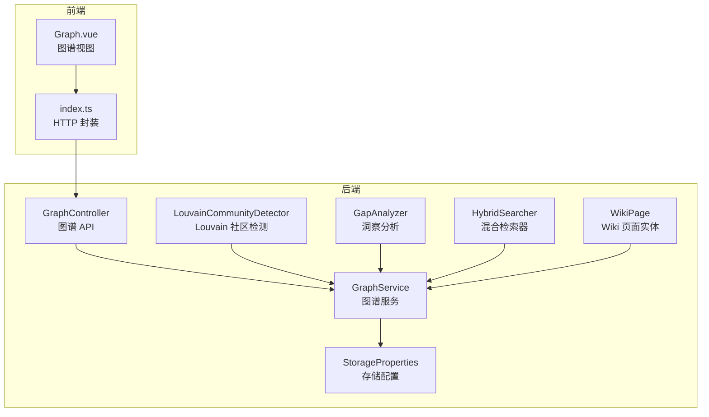
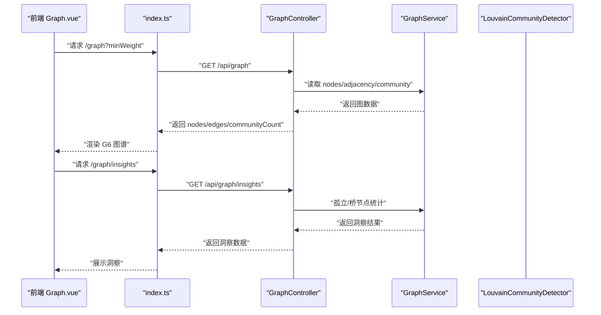
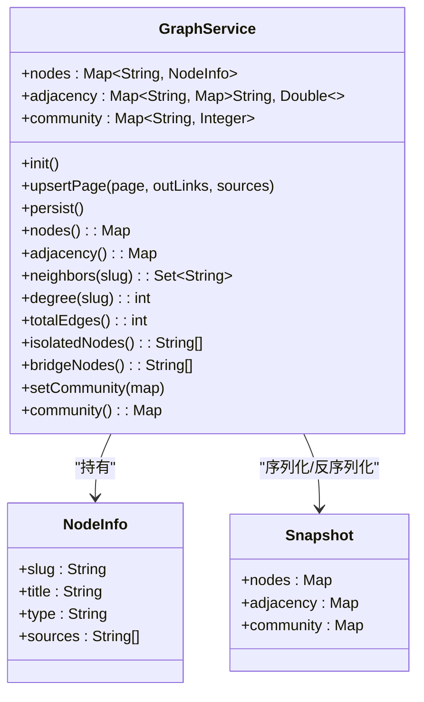
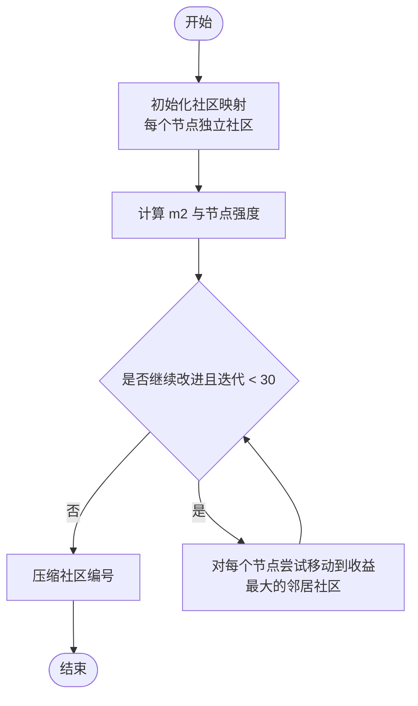
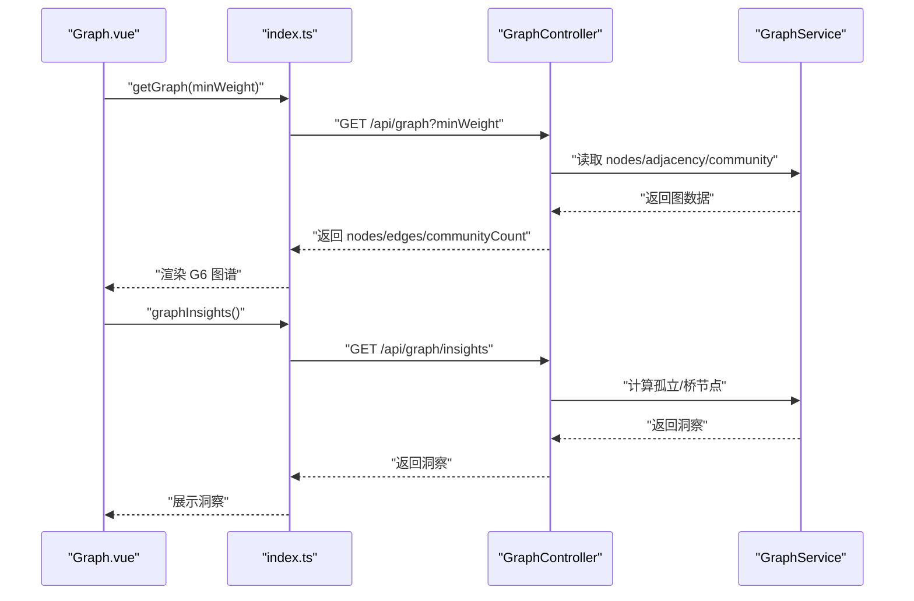
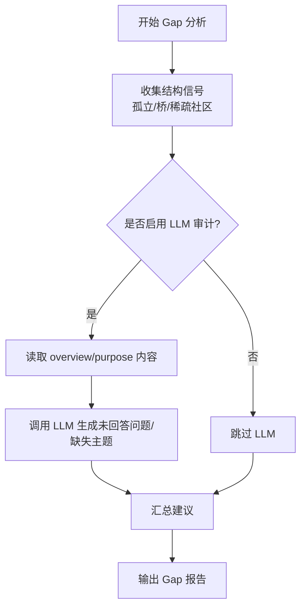
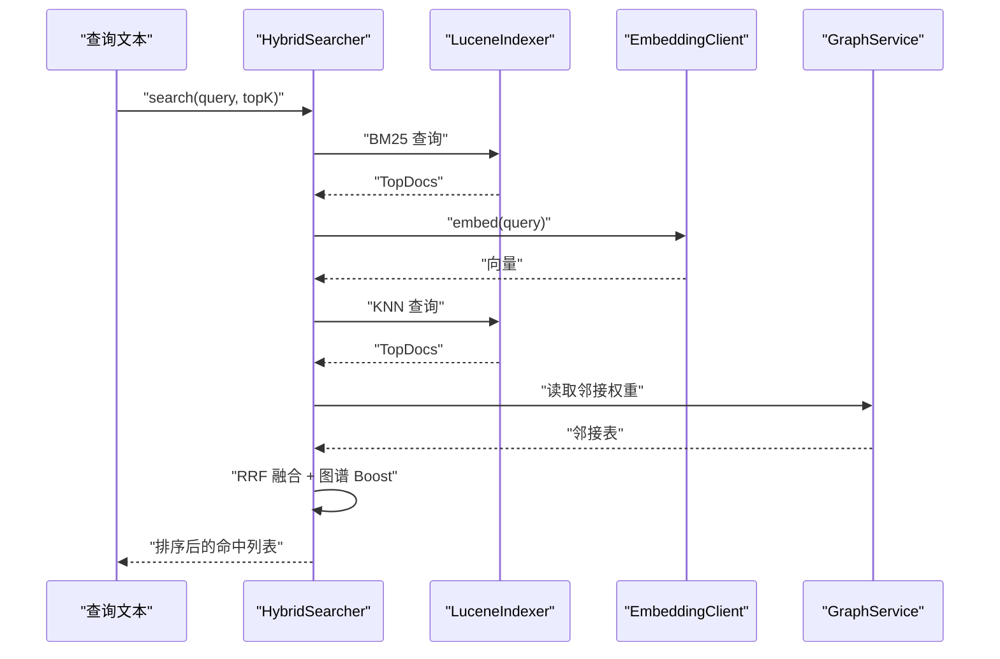
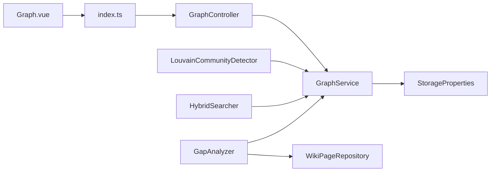

# 知识图谱系统

<cite>
**本文引用的文件**
- [GraphService.java](file://src/main/java/com/example/llmwiki/graph/GraphService.java)
- [LouvainCommunityDetector.java](file://src/main/java/com/example/llmwiki/graph/LouvainCommunityDetector.java)
- [GraphController.java](file://src/main/java/com/example/llmwiki/api/GraphController.java)
- [Graph.vue](file://web/src/views/Graph.vue)
- [index.ts](file://web/src/api/index.ts)
- [WikiPage.java](file://src/main/java/com/example/llmwiki/domain/WikiPage.java)
- [application.yml](file://src/main/resources/application.yml)
- [StorageProperties.java](file://src/main/java/com/example/llmwiki/config/StorageProperties.java)
- [HybridSearcher.java](file://src/main/java/com/example/llmwiki/retrieval/HybridSearcher.java)
- [GapAnalyzer.java](file://src/main/java/com/example/llmwiki/insight/GapAnalyzer.java)
</cite>

## 目录
1. [简介](#简介)
2. [项目结构](#项目结构)
3. [核心组件](#核心组件)
4. [架构总览](#架构总览)
5. [组件详解](#组件详解)
6. [依赖关系分析](#依赖关系分析)
7. [性能考量](#性能考量)
8. [故障排查指南](#故障排查指南)
9. [结论](#结论)
10. [附录](#附录)

## 简介
本系统围绕“LLM Wiki”构建，提供从原始资料到知识图谱的全链路能力：页面入库、实体与关系抽取、图谱构建与维护、社区发现、图谱可视化、洞察分析、检索增强与导出等。本文聚焦于图谱服务（GraphService）的架构与实现，涵盖节点与边管理、社区检测算法（Louvain）、可视化集成（AntV G6）、洞察分析（孤立节点、桥接节点、社区质量）、持久化策略、查询优化与维护工具。

## 项目结构
后端采用 Spring Boot，前端基于 Vue + TypeScript，通过 REST 接口与 AntV G6 可视化组件对接。图谱相关代码集中在 graph 包，API 控制器位于 api 包，前端视图位于 web/src/views，API 封装在 web/src/api。

图表来源
- [GraphService.java:1-197](file://src/main/java/com/example/llmwiki/graph/GraphService.java#L1-L197)
- [LouvainCommunityDetector.java:1-143](file://src/main/java/com/example/llmwiki/graph/LouvainCommunityDetector.java#L1-L143)
- [GraphController.java:1-86](file://src/main/java/com/example/llmwiki/api/GraphController.java#L1-L86)
- [Graph.vue:1-75](file://web/src/views/Graph.vue#L1-L75)
- [index.ts:1-70](file://web/src/api/index.ts#L1-L70)
- [WikiPage.java:1-72](file://src/main/java/com/example/llmwiki/domain/WikiPage.java#L1-L72)
- [StorageProperties.java:1-29](file://src/main/java/com/example/llmwiki/config/StorageProperties.java#L1-L29)
- [HybridSearcher.java:1-137](file://src/main/java/com/example/llmwiki/retrieval/HybridSearcher.java#L1-L137)
- [GapAnalyzer.java:1-229](file://src/main/java/com/example/llmwiki/insight/GapAnalyzer.java#L1-L229)

章节来源
- [application.yml:1-84](file://src/main/resources/application.yml#L1-L84)

## 核心组件
- 图谱服务（GraphService）：内存图结构（节点、邻接表、社区映射），JSON 持久化，提供节点/边/度数/孤立节点/桥节点等查询与洞察。
- 社区检测（LouvainCommunityDetector）：简化版 Louvain 贪心模块度优化，输出社区分组与社区内聚度评估。
- 图谱 API（GraphController）：对外提供 G6 适配的 nodes/edges/社区数量，以及洞察接口。
- 可视化（Graph.vue + index.ts）：前端通过 AntV G6 渲染图谱，支持滑块过滤边权重、自适应视图、力引导布局。
- 实体模型（WikiPage）：承载页面元信息、类型、来源、外部链接等，用于图谱构建。
- 存储配置（StorageProperties + application.yml）：统一管理图谱 JSON 文件路径等存储参数。
- 检索增强（HybridSearcher）：检索结果融合 BM25/KNN，并利用图谱邻接权重进行二次打分。
- 洞察分析（GapAnalyzer）：结合结构信号（孤立/桥/稀疏社区）与 LLM 语义信号生成补缺建议。

章节来源
- [GraphService.java:1-197](file://src/main/java/com/example/llmwiki/graph/GraphService.java#L1-L197)
- [LouvainCommunityDetector.java:1-143](file://src/main/java/com/example/llmwiki/graph/LouvainCommunityDetector.java#L1-L143)
- [GraphController.java:1-86](file://src/main/java/com/example/llmwiki/api/GraphController.java#L1-L86)
- [Graph.vue:1-75](file://web/src/views/Graph.vue#L1-L75)
- [index.ts:1-70](file://web/src/api/index.ts#L1-L70)
- [WikiPage.java:1-72](file://src/main/java/com/example/llmwiki/domain/WikiPage.java#L1-L72)
- [StorageProperties.java:1-29](file://src/main/java/com/example/llmwiki/config/StorageProperties.java#L1-L29)
- [application.yml:31-39](file://src/main/resources/application.yml#L31-L39)
- [HybridSearcher.java:1-137](file://src/main/java/com/example/llmwiki/retrieval/HybridSearcher.java#L1-L137)
- [GapAnalyzer.java:1-229](file://src/main/java/com/example/llmwiki/insight/GapAnalyzer.java#L1-L229)

## 架构总览
系统以“页面实体 → 图谱服务 → 可视化/检索/洞察”的链路为核心，图谱服务负责内存图与持久化，控制器提供 API，前端通过 AntV G6 展示，HybridSearcher 在检索阶段引入图谱权重增强。

图表来源
- [Graph.vue:30-74](file://web/src/views/Graph.vue#L30-L74)
- [index.ts:33-36](file://web/src/api/index.ts#L33-L36)
- [GraphController.java:31-84](file://src/main/java/com/example/llmwiki/api/GraphController.java#L31-L84)
- [GraphService.java:120-176](file://src/main/java/com/example/llmwiki/graph/GraphService.java#L120-L176)

## 组件详解

### 图谱服务（GraphService）
- 内存结构
  - 节点信息：slug → NodeInfo（标题、类型、来源、slug）
  - 邻接表：slug → {neighbor → weight}（双向边，去重合并权重）
  - 社区映射：slug → communityId
- 初始化与持久化
  - 应用启动时从 graphDir 下加载 graph.json，恢复 nodes/adjacency/community
  - 提供 persist 方法将当前状态写回 graph.json
- 图操作
  - upsertPage：根据 WikiPage 的 outLinks 与 sources 更新节点与边；直接链接权重固定，共享来源按重叠数量加权
  - neighbors/degree/totalEdges：基础图遍历与统计
  - isolatedNodes：度数 ≤ 1 的节点
  - bridgeNodes：至少连接 3 个不同社区的节点
  - setCommunity/community：写入/读取社区映射
- 复杂度与并发
  - 使用并发安全 Map，upsert/persist 加同步保证一致性
  - totalEdges 遍历邻接表，注意无向图边被重复计数一次需除以 2

图表来源
- [GraphService.java:37-196](file://src/main/java/com/example/llmwiki/graph/GraphService.java#L37-L196)

章节来源
- [GraphService.java:1-197](file://src/main/java/com/example/llmwiki/graph/GraphService.java#L1-L197)
- [StorageProperties.java:16-28](file://src/main/java/com/example/llmwiki/config/StorageProperties.java#L16-L28)
- [application.yml:31-39](file://src/main/resources/application.yml#L31-L39)

### 社区检测（LouvainCommunityDetector）
- 算法要点
  - 每个节点初始为独立社区，迭代将节点移动至能最大化模块度增益的邻居社区
  - 支持 m2（2倍边权和）预计算、节点强度（出边权重和）缓存、最多 30 次迭代
  - 最终压缩社区编号，避免稀疏编号
- 输出
  - 返回 communityId → 节点列表 的分组
  - 提供 cohesion（社区内聚度）评估：实际边数 / 可能最大边数（无向图）

图表来源
- [LouvainCommunityDetector.java:34-113](file://src/main/java/com/example/llmwiki/graph/LouvainCommunityDetector.java#L34-L113)

章节来源
- [LouvainCommunityDetector.java:1-143](file://src/main/java/com/example/llmwiki/graph/LouvainCommunityDetector.java#L1-L143)

### 图谱可视化（AntV G6 集成）
- 后端 API
  - GET /api/graph：返回 nodes（含 id/label/type/community/degree）、edges（source/target/weight，按 minWeight 过滤，去重）、communityCount
  - GET /api/graph/insights：返回孤立节点、桥节点、节点总数、边总数
- 前端渲染
  - Graph.vue 通过 index.ts 调用 /graph 与 /graph/insights
  - 使用 AntV G6，force 布局，节点大小与度数相关，边宽度与权重相关，社区决定颜色
  - 支持滑块调节 minWeight、自适应视图

图表来源
- [Graph.vue:30-74](file://web/src/views/Graph.vue#L30-L74)
- [index.ts:33-36](file://web/src/api/index.ts#L33-L36)
- [GraphController.java:31-84](file://src/main/java/com/example/llmwiki/api/GraphController.java#L31-L84)
- [GraphService.java:144-176](file://src/main/java/com/example/llmwiki/graph/GraphService.java#L144-L176)

章节来源
- [Graph.vue:1-75](file://web/src/views/Graph.vue#L1-L75)
- [index.ts:1-70](file://web/src/api/index.ts#L1-L70)
- [GraphController.java:1-86](file://src/main/java/com/example/llmwiki/api/GraphController.java#L1-L86)

### 图谱洞察分析
- 结构信号
  - 孤立节点：度数 ≤ 1
  - 桥节点：连接 ≥ 3 个不同社区
  - 稀疏社区：社区成员数 ≤ 3
- 语义信号（可选）
  - 通过 LLM 对 overview/purpose 文本进行审计，提取未回答问题与缺失主题
- 建议汇总
  - 根据上述信号生成可执行的补缺建议

图表来源
- [GapAnalyzer.java:51-74](file://src/main/java/com/example/llmwiki/insight/GapAnalyzer.java#L51-L74)
- [GapAnalyzer.java:79-94](file://src/main/java/com/example/llmwiki/insight/GapAnalyzer.java#L79-L94)
- [GapAnalyzer.java:99-135](file://src/main/java/com/example/llmwiki/insight/GapAnalyzer.java#L99-L135)
- [GapAnalyzer.java:137-155](file://src/main/java/com/example/llmwiki/insight/GapAnalyzer.java#L137-L155)
- [GraphService.java:144-176](file://src/main/java/com/example/llmwiki/graph/GraphService.java#L144-L176)

章节来源
- [GapAnalyzer.java:1-229](file://src/main/java/com/example/llmwiki/insight/GapAnalyzer.java#L1-L229)
- [GraphService.java:144-176](file://src/main/java/com/example/llmwiki/graph/GraphService.java#L144-L176)

### 图谱查询与检索增强
- 混合检索（HybridSearcher）
  - BM25：基于 Lucene 的关键词检索
  - KNN：基于嵌入向量的相似度检索（降级处理）
  - RRF 融合：将两类结果按排名 Reciprocal Rank Fusion
  - 图谱 Boost：对检索命中的节点，按其邻接权重累加到邻居，提升最终分数
- 与图谱的耦合
  - 使用 GraphService.adjacency 获取邻接权重，对邻居节点进行加权

图表来源
- [HybridSearcher.java:42-111](file://src/main/java/com/example/llmwiki/retrieval/HybridSearcher.java#L42-L111)
- [GraphService.java:124-126](file://src/main/java/com/example/llmwiki/graph/GraphService.java#L124-L126)

章节来源
- [HybridSearcher.java:1-137](file://src/main/java/com/example/llmwiki/retrieval/HybridSearcher.java#L1-L137)
- [GraphService.java:120-134](file://src/main/java/com/example/llmwiki/graph/GraphService.java#L120-L134)

### 图谱导出与 API 设计
- 当前后端导出能力
  - GraphService.persist：将 nodes/adjacency/community 写入 graph.json（JSON 格式）
  - GraphController.graph：返回适配 G6 的 nodes/edges/社区数量
- 建议扩展
  - 新增 /api/graph/export 接口，支持导出为 GEXF/CSV/TXT 等格式
  - 增加分页/过滤/多粒度导出选项
  - 前端可新增“导出”按钮，调用相应接口并触发浏览器下载

章节来源
- [GraphService.java:106-118](file://src/main/java/com/example/llmwiki/graph/GraphService.java#L106-L118)
- [GraphController.java:31-74](file://src/main/java/com/example/llmwiki/api/GraphController.java#L31-L74)

### 图谱持久化策略
- 存储位置
  - graphDir：默认 ./data/graph，graph.json 保存图谱快照
- 启动加载
  - PostConstruct 读取 graph.json 并恢复内存状态
- 增量更新
  - upsertPage 增量更新节点与边，随后 persist 写回磁盘
- 建议
  - 引入版本号或校验和，避免并发写覆盖
  - 增加备份策略与增量日志

章节来源
- [StorageProperties.java:16-28](file://src/main/java/com/example/llmwiki/config/StorageProperties.java#L16-L28)
- [application.yml:31-39](file://src/main/resources/application.yml#L31-L39)
- [GraphService.java:49-69](file://src/main/java/com/example/llmwiki/graph/GraphService.java#L49-L69)
- [GraphService.java:106-118](file://src/main/java/com/example/llmwiki/graph/GraphService.java#L106-L118)

### 图谱维护工具与数据清洗
- 孤立节点与桥节点识别：GraphService.isolatedNodes/bridgeNodes
- 稀疏社区识别：GapAnalyzer.sparseCommunities
- 建议流程
  - 定期运行 /api/graph/insights 获取洞察
  - 对孤立节点补充外部链接或交叉引用
  - 对桥节点核查跨领域内容完整性
  - 对稀疏社区补充相关主题资料
- 冲突解决
  - 同一来源的重复边按权重取最大值合并
  - 外部链接去重与自环过滤

章节来源
- [GraphService.java:144-176](file://src/main/java/com/example/llmwiki/graph/GraphService.java#L144-L176)
- [GapAnalyzer.java:79-94](file://src/main/java/com/example/llmwiki/insight/GapAnalyzer.java#L79-L94)

## 依赖关系分析
- 组件耦合
  - GraphController 依赖 GraphService 提供数据
  - LouvainCommunityDetector 依赖 GraphService 的邻接与节点集合
  - HybridSearcher 依赖 GraphService 的邻接权重进行图谱 Boost
  - GapAnalyzer 依赖 GraphService 的结构信号与 WikiPageRepository 的 overview/purpose 文本
- 外部依赖
  - AntV G6（前端）
  - Jackson（JSON 序列化）
  - Spring Boot（IoC、Web、JPA）

图表来源
- [GraphController.java:26](file://src/main/java/com/example/llmwiki/api/GraphController.java#L26)
- [GraphService.java:39](file://src/main/java/com/example/llmwiki/graph/GraphService.java#L39)
- [LouvainCommunityDetector.java:34](file://src/main/java/com/example/llmwiki/graph/LouvainCommunityDetector.java#L34)
- [HybridSearcher.java:40](file://src/main/java/com/example/llmwiki/retrieval/HybridSearcher.java#L40)
- [GapAnalyzer.java:40-44](file://src/main/java/com/example/llmwiki/insight/GapAnalyzer.java#L40-L44)
- [StorageProperties.java:16-28](file://src/main/java/com/example/llmwiki/config/StorageProperties.java#L16-L28)
- [Graph.vue:18](file://web/src/views/Graph.vue#L18)
- [index.ts:34-36](file://web/src/api/index.ts#L34-L36)

## 性能考量
- 时间复杂度
  - Louvain：每轮对所有节点尝试移动，整体约 O(N×E)，适合节点 < 5k 的个人知识库
  - totalEdges：遍历邻接表，O(V+E)
  - bridgeNodes：对每个节点检查邻居社区集合，最坏 O(V×d)，d 为平均度数
- 并发与一致性
  - upsert/persist 加同步，避免竞态
  - 使用并发安全 Map 降低锁粒度
- I/O 与存储
  - graph.json 仅在更新后写回，减少频繁 IO
  - 建议引入异步写入与批量提交
- 前端渲染
  - G6 力引导布局在大数据下可能卡顿，建议：
    - 默认高 minWeight 过滤
    - 分层/聚类显示
    - 惰性渲染与视域裁剪

## 故障排查指南
- 图谱加载失败
  - 现象：启动日志出现加载失败警告
  - 排查：确认 graph.json 存在且 JSON 格式正确；检查 graphDir 权限
- 社区为空
  - 现象：communityCount 为 0 或社区映射为空
  - 排查：确认已运行 LouvainCommunityDetector.detectAndAssign；检查是否存在边
- 边权重异常
  - 现象：边权重过大或过小
  - 排查：检查 upsertPage 中直接链接权重与来源重叠权重逻辑；确认 outLinks 与 sources 数据
- 前端渲染卡顿
  - 现象：节点/边过多导致渲染缓慢
  - 排查：提高 minWeight；切换布局；减少一次性渲染节点数

章节来源
- [GraphService.java:49-69](file://src/main/java/com/example/llmwiki/graph/GraphService.java#L49-L69)
- [GraphService.java:106-118](file://src/main/java/com/example/llmwiki/graph/GraphService.java#L106-L118)
- [LouvainCommunityDetector.java:34-113](file://src/main/java/com/example/llmwiki/graph/LouvainCommunityDetector.java#L34-L113)
- [Graph.vue:39-74](file://web/src/views/Graph.vue#L39-L74)

## 结论
本系统以 GraphService 为核心，实现了从 WikiPage 到图谱的完整闭环：节点与边的增量维护、社区发现、可视化展示、结构洞察与检索增强。通过 AntV G6 与前端交互，用户可直观地观察知识结构并进行探索。建议后续完善导出能力、引入增量日志与备份、优化大规模图谱的渲染与查询性能。

## 附录
- API 列表（与本文相关）
  - GET /api/graph：返回 nodes/edges/communityCount，支持 minWeight 过滤
  - GET /api/graph/insights：返回孤立节点、桥节点、节点/边总数
  - GET /insights/gap：返回结构与语义双信号的补缺建议
- 前端调用
  - getGraph/minWeight
  - graphInsights
  - getGap/useLlm

章节来源
- [GraphController.java:31-84](file://src/main/java/com/example/llmwiki/api/GraphController.java#L31-L84)
- [index.ts:33-44](file://web/src/api/index.ts#L33-L44)
- [GapAnalyzer.java:26-29](file://src/main/java/com/example/llmwiki/insight/GapAnalyzer.java#L26-L29)