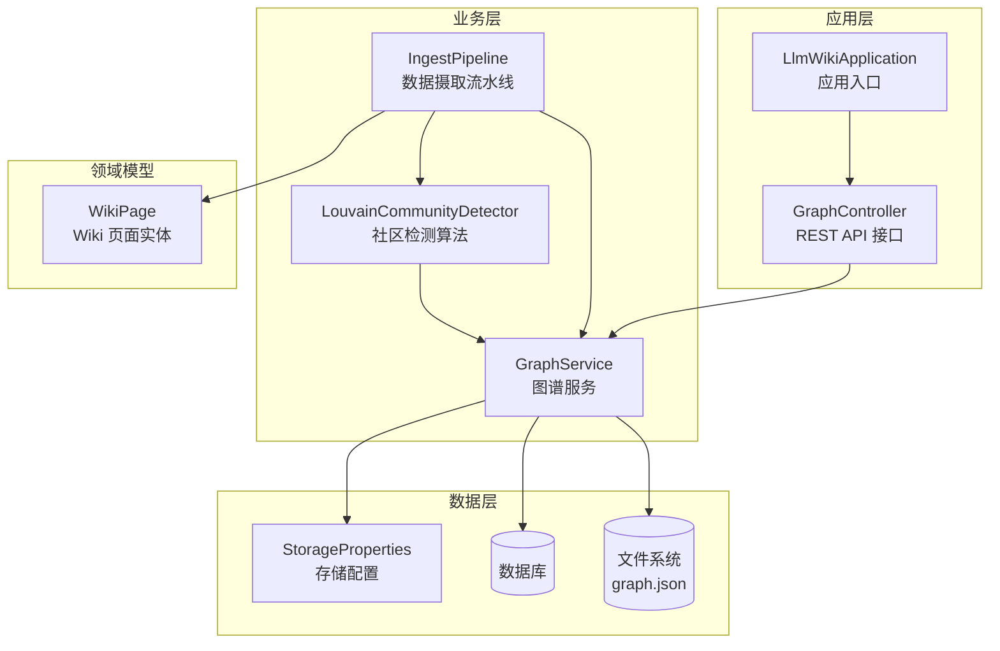
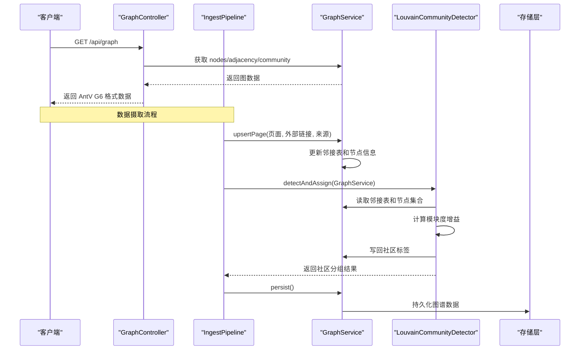
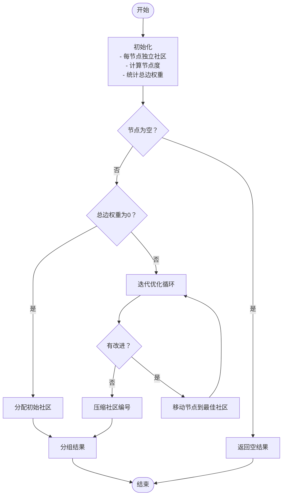
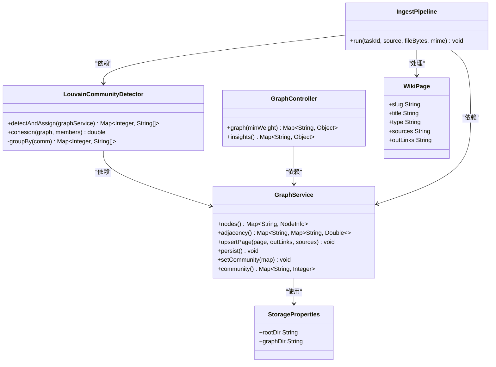

# 社区检测算法

<cite>
**本文引用的文件**
- [LouvainCommunityDetector.java](file://src/main/java/com/example/llmwiki/graph/LouvainCommunityDetector.java)
- [GraphService.java](file://src/main/java/com/example/llmwiki/graph/GraphService.java)
- [GraphController.java](file://src/main/java/com/example/llmwiki/api/GraphController.java)
- [IngestPipeline.java](file://src/main/java/com/example/llmwiki/ingest/IngestPipeline.java)
- [application.yml](file://src/main/resources/application.yml)
- [StorageProperties.java](file://src/main/java/com/example/llmwiki/config/StorageProperties.java)
- [WikiPage.java](file://src/main/java/com/example/llmwiki/domain/WikiPage.java)
- [LlmWikiApplication.java](file://src/main/java/com/example/llmwiki/LlmWikiApplication.java)
</cite>

## 目录
1. [简介](#简介)
2. [项目结构](#项目结构)
3. [核心组件](#核心组件)
4. [架构概览](#架构概览)
5. [详细组件分析](#详细组件分析)
6. [依赖关系分析](#依赖关系分析)
7. [性能考虑](#性能考虑)
8. [故障排除指南](#故障排除指南)
9. [结论](#结论)
10. [附录](#附录)

## 简介
本文件为 LLM Wiki 社区检测算法的技术文档，重点围绕 LouvainCommunityDetector 的实现进行深入分析。该组件实现了基于 Louvain 算法的社区发现机制，通过模块度优化策略实现节点的迭代聚类，并提供社区质量评估功能。文档涵盖算法输入输出、优化技术、参数调优、性能分析以及在知识图谱中的应用场景。

## 项目结构
LLM Wiki 采用 Spring Boot 架构，社区检测算法位于 graph 包中，与图服务、API 控制器、数据持久化等模块协同工作。整体结构如下：



**图表来源**
- [LlmWikiApplication.java:19-26](file://src/main/java/com/example/llmwiki/LlmWikiApplication.java#L19-L26)
- [GraphController.java:21-26](file://src/main/java/com/example/llmwiki/api/GraphController.java#L21-L26)
- [IngestPipeline.java:46-62](file://src/main/java/com/example/llmwiki/ingest/IngestPipeline.java#L46-L62)
- [LouvainCommunityDetector.java:24-27](file://src/main/java/com/example/llmwiki/graph/LouvainCommunityDetector.java#L24-L27)
- [GraphService.java:34-37](file://src/main/java/com/example/llmwiki/graph/GraphService.java#L34-L37)
- [StorageProperties.java:13-16](file://src/main/java/com/example/llmwiki/config/StorageProperties.java#L13-L16)
- [WikiPage.java:23-29](file://src/main/java/com/example/llmwiki/domain/WikiPage.java#L23-L29)

**章节来源**
- [LlmWikiApplication.java:19-26](file://src/main/java/com/example/llmwiki/LlmWikiApplication.java#L19-L26)
- [application.yml:1-84](file://src/main/resources/application.yml#L1-L84)

## 核心组件
本节详细介绍社区检测算法的核心组件及其职责。

### LouvainCommunityDetector
LouvainCommunityDetector 是社区检测算法的核心实现，提供以下关键功能：
- 单层贪心模块度优化
- 社区标签分配
- 社区内聚度计算
- 社区结果分组

该组件采用简化版 Louvain 算法，适用于个人 wiki 规模（节点 < 5k），通过每次迭代将节点移动到能最大化模块度增益的邻居社区，直到无法继续改进为止。

### GraphService
GraphService 提供完整的图谱服务，包括：
- 节点信息管理（slug -> NodeInfo）
- 邻接表存储（slug -> 邻居 slug -> 权重）
- 社区划分存储（slug -> communityId）
- 图谱持久化（JSON 格式）
- 结构性洞察分析（孤立节点、桥节点识别）

### IngestPipeline
IngestPipeline 实现了两步式 CoT（Chain-of-Thought）数据摄取流程，在页面生成完成后执行社区检测和图谱更新。

**章节来源**
- [LouvainCommunityDetector.java:14-27](file://src/main/java/com/example/llmwiki/graph/LouvainCommunityDetector.java#L14-L27)
- [GraphService.java:24-37](file://src/main/java/com/example/llmwiki/graph/GraphService.java#L24-L37)
- [IngestPipeline.java:33-44](file://src/main/java/com/example/llmwiki/ingest/IngestPipeline.java#L33-L44)

## 架构概览
社区检测算法在整个系统中的位置和交互关系如下：



**图表来源**
- [GraphController.java:31-74](file://src/main/java/com/example/llmwiki/api/GraphController.java#L31-L74)
- [IngestPipeline.java:91-99](file://src/main/java/com/example/llmwiki/ingest/IngestPipeline.java#L91-L99)
- [GraphService.java:106-118](file://src/main/java/com/example/llmwiki/graph/GraphService.java#L106-L118)
- [LouvainCommunityDetector.java:34-113](file://src/main/java/com/example/llmwiki/graph/LouvainCommunityDetector.java#L34-L113)

## 详细组件分析

### 算法实现原理
LouvainCommunityDetector 采用单层贪心模块度优化策略，具体实现包含以下关键步骤：

#### 初始化阶段
- 每个节点初始分配独立社区标识符
- 计算每个节点的度（邻居权重之和）
- 统计总边权重 2m

#### 迭代优化阶段
算法通过以下公式计算模块度增益：
```
ΔQ = s_in - (s_tot × k_i) / (2m)
```
其中：
- s_in：节点 i 移动到目标社区后，社区内部边权重之和
- s_tot：目标社区的总度（内部度 + 外部度）
- k_i：节点 i 的度
- m：总边权重的一半

#### 收敛判断
算法设置最大迭代次数限制（默认 30 次），当无法进一步改进时停止。



**图表来源**
- [LouvainCommunityDetector.java:34-113](file://src/main/java/com/example/llmwiki/graph/LouvainCommunityDetector.java#L34-L113)

**章节来源**
- [LouvainCommunityDetector.java:34-113](file://src/main/java/com/example/llmwiki/graph/LouvainCommunityDetector.java#L34-L113)

### 输入输出规范

#### 算法输入
- **节点列表**：GraphService.nodes() 返回的节点集合
- **边权重矩阵**：GraphService.adjacency() 返回的邻接表，格式为 Map<String, Map<String, Double>>
- **社区标签**：初始时每个节点分配独立标识符

#### 算法输出
- **社区标签分配**：Map<String, Integer>，节点到社区标识符的映射
- **社区分组结果**：Map<Integer, List<String>>，社区标识符到节点列表的映射

#### API 输出格式
GraphController 将图数据转换为 AntV G6 兼容格式：
```json
{
  "nodes": [
    {
      "id": "node_slug",
      "label": "节点标题",
      "type": "节点类型",
      "community": 社区标识符,
      "degree": 度数
    }
  ],
  "edges": [
    {
      "source": "源节点",
      "target": "目标节点", 
      "weight": 边权重
    }
  ],
  "communityCount": 社区数量
}
```

**章节来源**
- [GraphController.java:31-74](file://src/main/java/com/example/llmwiki/api/GraphController.java#L31-L74)
- [LouvainCommunityDetector.java:34-113](file://src/main/java/com/example/llmwiki/graph/LouvainCommunityDetector.java#L34-L113)

### 社区质量评估

#### 模块度值计算
算法通过模块度增益 ΔQ 来评估社区划分质量。模块度增益的计算公式为：
```
ΔQ = s_in - (s_tot × k_i) / (2m)
```

#### 社区内聚度
cohesion 方法计算社区内聚度，定义为实际边数与可能边数的比值：
```
cohesion = edges / possible_edges
```
其中：
- edges：社区内实际存在的边数
- possible_edges：社区内可能的最大边数 = n(n-1)/2

#### 跨社区连接强度
通过桥节点识别功能实现，桥节点是指连接至少 3 个不同社区的节点。

**章节来源**
- [LouvainCommunityDetector.java:115-133](file://src/main/java/com/example/llmwiki/graph/LouvainCommunityDetector.java#L115-L133)
- [GraphService.java:148-167](file://src/main/java/com/example/llmwiki/graph/GraphService.java#L148-L167)

### 算法优化技术

#### 内存管理
- 使用 ConcurrentHashMap 保证并发安全
- 采用延迟初始化策略，避免不必要的内存分配
- 及时释放临时计算结果

#### 并行计算
- 当前实现为单线程迭代
- 可通过并行化节点遍历提升大规模数据处理性能

#### 收敛判断
- 设置最大迭代次数限制（默认 30 次）
- 使用布尔标志 improved 监控优化过程
- 当 ΔQ 增益小于阈值（1e-9）时停止

**章节来源**
- [GraphService.java:43-47](file://src/main/java/com/example/llmwiki/graph/GraphService.java#L43-L47)
- [LouvainCommunityDetector.java:61-99](file://src/main/java/com/example/llmwiki/graph/LouvainCommunityDetector.java#L61-L99)

### 参数调优

#### 分辨率参数
当前实现未提供显式的分辨率参数调整。可通过以下方式间接影响：
- 调整边权重阈值
- 修改社区合并策略

#### 最大迭代次数
- 默认值：30 次
- 可根据数据规模和收敛速度调整

#### 收敛阈值
- 默认阈值：1e-9
- 可根据精度要求调整

**章节来源**
- [LouvainCommunityDetector.java:63](file://src/main/java/com/example/llmwiki/graph/LouvainCommunityDetector.java#L63)

## 依赖关系分析



**图表来源**
- [LouvainCommunityDetector.java:24-27](file://src/main/java/com/example/llmwiki/graph/LouvainCommunityDetector.java#L24-L27)
- [GraphService.java:34-37](file://src/main/java/com/example/llmwiki/graph/GraphService.java#L34-L37)
- [GraphController.java:21-26](file://src/main/java/com/example/llmwiki/api/GraphController.java#L21-L26)
- [IngestPipeline.java:46-62](file://src/main/java/com/example/llmwiki/ingest/IngestPipeline.java#L46-L62)
- [StorageProperties.java:13-28](file://src/main/java/com/example/llmwiki/config/StorageProperties.java#L13-L28)
- [WikiPage.java:23-71](file://src/main/java/com/example/llmwiki/domain/WikiPage.java#L23-L71)

**章节来源**
- [IngestPipeline.java:46-62](file://src/main/java/com/example/llmwiki/ingest/IngestPipeline.java#L46-L62)

## 性能考虑

### 时间复杂度
- **单次迭代复杂度**：O(N × M)，其中 N 为节点数，M 为平均度数
- **总体复杂度**：O(I × N × M)，其中 I 为迭代次数
- 对于个人 wiki（N < 5k）规模，算法复杂度足够高效

### 空间复杂度
- **邻接表存储**：O(N + E)，其中 E 为边数
- **社区映射**：O(N)
- **临时计算**：O(N + E)

### 大数据集处理策略
- **内存优化**：使用 ConcurrentHashMap 和延迟初始化
- **批处理**：分批处理大规模数据
- **增量更新**：只更新受影响的节点和边
- **并行化**：考虑并行化节点遍历和社区计算

## 故障排除指南

### 收敛失败处理
- **问题现象**：算法无法找到更好的社区划分
- **解决方案**：
  - 增加最大迭代次数
  - 调整收敛阈值
  - 检查边权重是否合理

### 内存溢出预防
- **问题现象**：处理大规模数据时内存不足
- **解决方案**：
  - 优化数据结构存储
  - 实施分页处理策略
  - 增加 JVM 堆内存配置

### 结果验证方法
- **一致性检查**：验证社区标签的传递性
- **完整性检查**：确保所有节点都被分配社区
- **质量评估**：使用模块度增益指标评估结果质量
- **可视化验证**：通过图谱可视化检查社区结构

**章节来源**
- [GraphService.java:106-118](file://src/main/java/com/example/llmwiki/graph/GraphService.java#L106-L118)
- [LouvainCommunityDetector.java:61-99](file://src/main/java/com/example/llmwiki/graph/LouvainCommunityDetector.java#L61-L99)

## 结论
LouvainCommunityDetector 为 LLM Wiki 提供了高效的社区检测能力，通过简化的 Louvain 算法实现了对个人知识库的自动主题聚类。该实现具有以下特点：

1. **算法简洁性**：采用单层贪心模块度优化，实现简单且效果良好
2. **性能友好**：针对个人 wiki 规模进行了优化，处理速度快
3. **集成完整**：与图谱服务、API 接口、数据摄取流水线无缝集成
4. **质量评估**：提供社区内聚度等质量评估指标

在实际应用中，可根据数据规模和性能需求进行参数调优和扩展优化，以支持更大规模的知识图谱构建和分析任务。

## 附录

### 知识图谱应用场景
- **主题聚类**：自动识别和组织相似主题的 Wiki 页面
- **知识领域划分**：将复杂的知识体系分解为清晰的领域结构
- **内容组织策略**：为知识库提供自动化的分类和导航支持
- **知识空白识别**：通过社区结构发现潜在的知识缺口

### 配置参考
- **存储路径**：graph.json 持久化文件位置
- **日志级别**：DEBUG 级别便于算法调试和监控
- **线程配置**：Spring Boot 应用的基础配置

**章节来源**
- [application.yml:31-38](file://src/main/resources/application.yml#L31-L38)
- [application.yml:78-84](file://src/main/resources/application.yml#L78-L84)