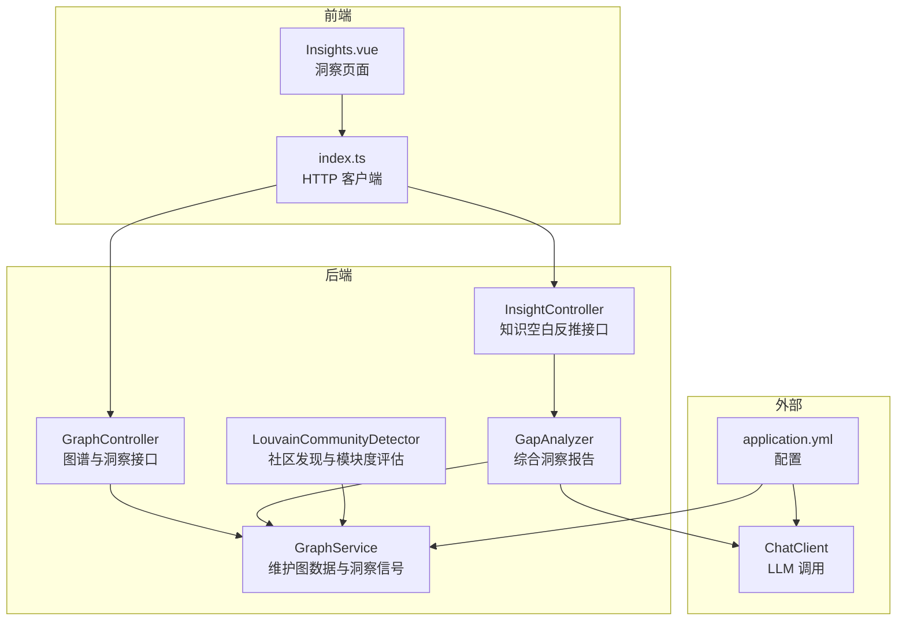
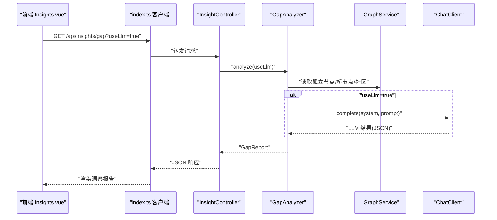
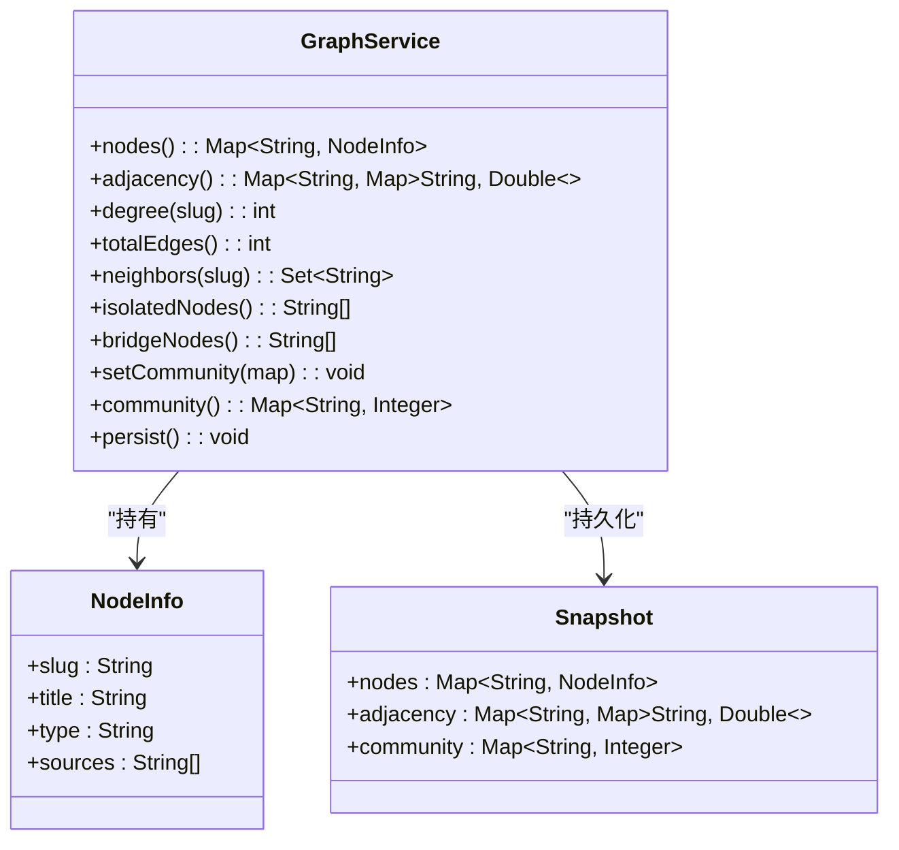
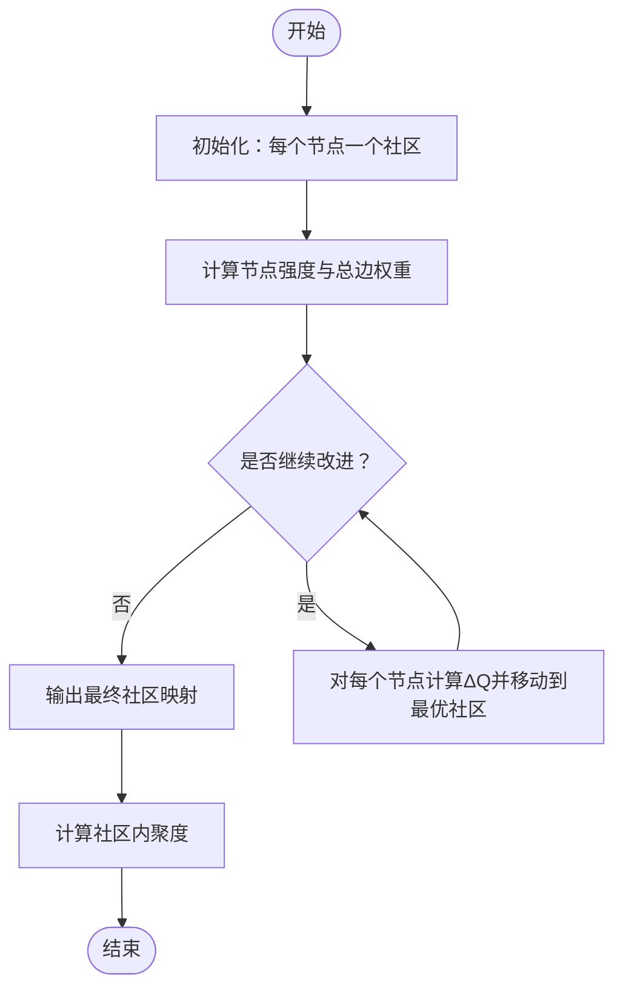
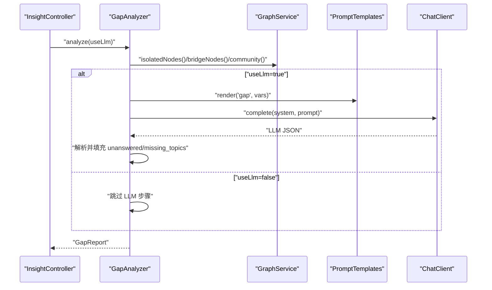
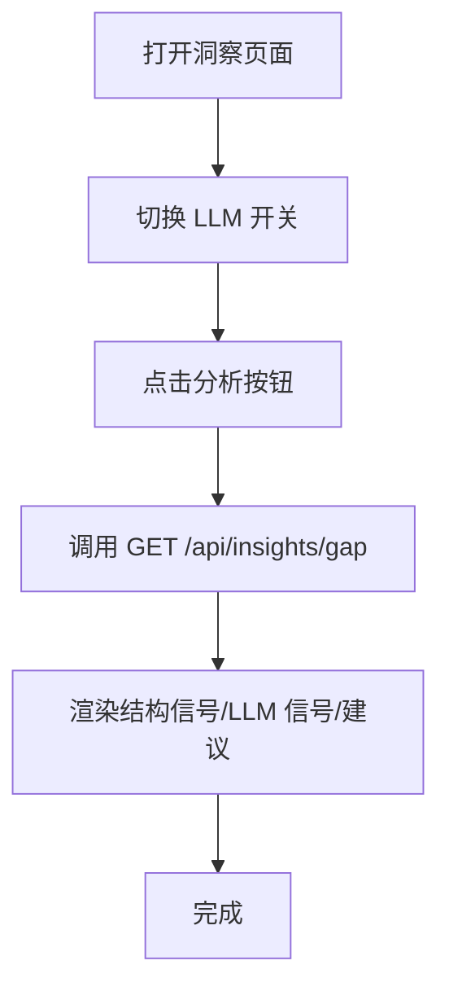
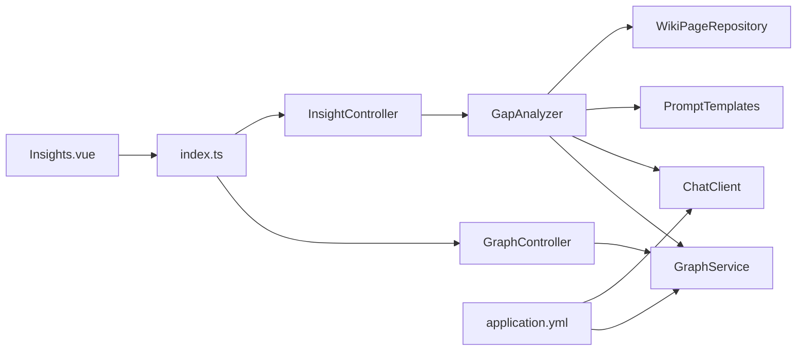

# 图谱洞察分析

<cite>
**本文引用的文件**
- [GraphService.java](file://src/main/java/com/example/llmwiki/graph/GraphService.java)
- [LouvainCommunityDetector.java](file://src/main/java/com/example/llmwiki/graph/LouvainCommunityDetector.java)
- [GapAnalyzer.java](file://src/main/java/com/example/llmwiki/insight/GapAnalyzer.java)
- [InsightController.java](file://src/main/java/com/example/llmwiki/api/InsightController.java)
- [GraphController.java](file://src/main/java/com/example/llmwiki/api/GraphController.java)
- [Insights.vue](file://web/src/views/Insights.vue)
- [index.ts](file://web/src/api/index.ts)
- [gap.md](file://src/main/resources/prompts/gap.md)
- [ChatClient.java](file://src/main/java/com/example/llmwiki/llm/ChatClient.java)
- [StorageProperties.java](file://src/main/java/com/example/llmwiki/config/StorageProperties.java)
- [application.yml](file://src/main/resources/application.yml)
</cite>

## 目录
1. [简介](#简介)
2. [项目结构](#项目结构)
3. [核心组件](#核心组件)
4. [架构总览](#架构总览)
5. [详细组件分析](#详细组件分析)
6. [依赖分析](#依赖分析)
7. [性能考虑](#性能考虑)
8. [故障排查指南](#故障排查指南)
9. [结论](#结论)
10. [附录](#附录)

## 简介
本技术文档围绕“图谱洞察分析”能力展开，聚焦于以下目标：
- 图谱洞察算法：节点中心性分析、路径分析、密度计算、聚类系数
- 孤立节点检测：孤立实体识别、断开链接分析、网络完整性评估
- 桥接节点识别：关键连接点发现、网络脆弱性分析、信息传播路径
- 社区质量评估：社区密度计算、模块度分析、社区稳定性评估
- 洞察可视化：图谱洞察图表、交互式分析界面、动态展示效果
- 洞察指标：网络效率、连通性、冗余度、重要性权重
- 洞察维护：算法优化、性能监控、结果验证
- 洞察API：图谱分析接口、批量洞察接口、实时分析接口
- 洞察应用：网络优化建议、关键节点识别、知识传播分析

在当前代码库中，已实现“知识空白反推”的综合洞察报告，涵盖结构信号（孤立节点、稀疏社区、桥节点）与语义信号（LLM 审计），并提供前端可视化界面与后端 REST 接口。

## 项目结构
后端采用 Spring Boot，核心模块包括：
- 图谱服务：维护节点、邻接表、社区划分与持久化
- 社区发现：基于简化 Louvain 的模块度优化
- 洞察分析：综合结构与语义信号生成报告
- API 控制器：对外暴露图谱与洞察接口
- 前端 Vue：提供洞察页面与交互

**图表来源**
- [GraphService.java:34-196](file://src/main/java/com/example/llmwiki/graph/GraphService.java#L34-L196)
- [LouvainCommunityDetector.java:24-142](file://src/main/java/com/example/llmwiki/graph/LouvainCommunityDetector.java#L24-L142)
- [GapAnalyzer.java:33-228](file://src/main/java/com/example/llmwiki/insight/GapAnalyzer.java#L33-L228)
- [GraphController.java:21-85](file://src/main/java/com/example/llmwiki/api/GraphController.java#L21-L85)
- [InsightController.java:16-30](file://src/main/java/com/example/llmwiki/api/InsightController.java#L16-L30)
- [Insights.vue:1-60](file://web/src/views/Insights.vue#L1-L60)
- [index.ts:33-44](file://web/src/api/index.ts#L33-L44)
- [application.yml:31-57](file://src/main/resources/application.yml#L31-L57)

**章节来源**
- [GraphService.java:34-196](file://src/main/java/com/example/llmwiki/graph/GraphService.java#L34-L196)
- [LouvainCommunityDetector.java:24-142](file://src/main/java/com/example/llmwiki/graph/LouvainCommunityDetector.java#L24-L142)
- [GapAnalyzer.java:33-228](file://src/main/java/com/example/llmwiki/insight/GapAnalyzer.java#L33-L228)
- [GraphController.java:21-85](file://src/main/java/com/example/llmwiki/api/GraphController.java#L21-L85)
- [InsightController.java:16-30](file://src/main/java/com/example/llmwiki/api/InsightController.java#L16-L30)
- [Insights.vue:1-60](file://web/src/views/Insights.vue#L1-L60)
- [index.ts:33-44](file://web/src/api/index.ts#L33-L44)
- [application.yml:31-57](file://src/main/resources/application.yml#L31-L57)

## 核心组件
- 图谱服务（GraphService）
  - 维护节点元信息、邻接表、社区映射
  - 提供孤立节点、桥节点、总边数、度数等基础洞察信号
  - 支持图谱快照持久化与加载
- 社区发现（LouvainCommunityDetector）
  - 单层贪心模块度优化，适合中小规模图谱
  - 输出社区密度评估方法
- 知识空白反推（GapAnalyzer）
  - 结合结构信号与 LLM 语义信号生成综合报告
  - 输出未答题、缺失主题、建议等
- API 控制器
  - GraphController：返回适配前端可视化的图数据与洞察汇总
  - InsightController：知识空白反推接口
- 前端洞察页面（Insights.vue）
  - 展示结构信号、LLM 语义信号、建议与通用建议
  - 提供开关控制是否启用 LLM 审计

**章节来源**
- [GraphService.java:34-196](file://src/main/java/com/example/llmwiki/graph/GraphService.java#L34-L196)
- [LouvainCommunityDetector.java:24-142](file://src/main/java/com/example/llmwiki/graph/LouvainCommunityDetector.java#L24-L142)
- [GapAnalyzer.java:33-228](file://src/main/java/com/example/llmwiki/insight/GapAnalyzer.java#L33-L228)
- [GraphController.java:21-85](file://src/main/java/com/example/llmwiki/api/GraphController.java#L21-L85)
- [InsightController.java:16-30](file://src/main/java/com/example/llmwiki/api/InsightController.java#L16-L30)
- [Insights.vue:1-60](file://web/src/views/Insights.vue#L1-L60)

## 架构总览
下图展示了从前端请求到后端处理与 LLM 调用的整体流程：

**图表来源**
- [Insights.vue:52-59](file://web/src/views/Insights.vue#L52-L59)
- [index.ts:43-44](file://web/src/api/index.ts#L43-L44)
- [InsightController.java:23-29](file://src/main/java/com/example/llmwiki/api/InsightController.java#L23-L29)
- [GapAnalyzer.java:51-74](file://src/main/java/com/example/llmwiki/insight/GapAnalyzer.java#L51-L74)
- [GraphService.java:144-167](file://src/main/java/com/example/llmwiki/graph/GraphService.java#L144-L167)
- [ChatClient.java:37-86](file://src/main/java/com/example/llmwiki/llm/ChatClient.java#L37-L86)

## 详细组件分析

### 图谱服务（GraphService）
- 职责
  - 维护节点信息（slug、标题、类型、来源）、邻接表（带权）
  - 提供孤立节点、桥节点、度数、总边数等基础统计
  - 支持社区映射与持久化
- 关键算法与数据结构
  - 邻接表：Map<String, Map<String, Double>>
  - 孤立节点：度数 ≤ 1
  - 桥节点：连接 ≥ 3 个不同社区
  - 持久化：Snapshot（nodes、adjacency、community）
- 复杂度
  - 度数查询：O(1)
  - 孤立节点筛选：O(n)
  - 桥节点筛选：O(n·k)，k 为平均度
- 错误处理
  - 加载/保存失败记录日志
  - 边界情况（空图、无社区）安全返回

**图表来源**
- [GraphService.java:34-196](file://src/main/java/com/example/llmwiki/graph/GraphService.java#L34-L196)

**章节来源**
- [GraphService.java:34-196](file://src/main/java/com/example/llmwiki/graph/GraphService.java#L34-L196)

### 社区发现（LouvainCommunityDetector）
- 职责
  - 对图谱执行单层贪心模块度优化，得到社区划分
  - 提供社区内聚度（实际边/可能边）评估
- 算法要点
  - 初始化：每个节点自成社区
  - 循环：对每个节点尝试移动至使 ΔQ 最大的邻居社区
  - 压缩编号：重映射社区 ID
- 复杂度
  - 每轮遍历 O(n·k)，最多迭代若干次
- 模块度评估
  - cohesion(graph, members)：用于社区质量评估

**图表来源**
- [LouvainCommunityDetector.java:34-113](file://src/main/java/com/example/llmwiki/graph/LouvainCommunityDetector.java#L34-L113)
- [LouvainCommunityDetector.java:118-133](file://src/main/java/com/example/llmwiki/graph/LouvainCommunityDetector.java#L118-L133)

**章节来源**
- [LouvainCommunityDetector.java:24-142](file://src/main/java/com/example/llmwiki/graph/LouvainCommunityDetector.java#L24-L142)

### 知识空白反推（GapAnalyzer）
- 职责
  - 结合结构信号（孤立节点、稀疏社区、桥节点）与语义信号（LLM 审计）生成综合报告
  - 输出未答题、缺失主题、建议与错误信息
- 输入输出
  - 输入：useLlm 开关
  - 输出：GapReport（结构信号 + 语义信号 + 建议）
- LLM 审计流程
  - 读取 overview 与 purpose 页面内容
  - 渲染 prompt（gap.md）
  - 调用 ChatClient 完成多轮对话
  - 解析 JSON 结果，提取 unanswered 与 missing_topics
- 通用建议
  - 基于结构信号生成可操作建议

**图表来源**
- [InsightController.java:23-29](file://src/main/java/com/example/llmwiki/api/InsightController.java#L23-L29)
- [GapAnalyzer.java:51-74](file://src/main/java/com/example/llmwiki/insight/GapAnalyzer.java#L51-L74)
- [GapAnalyzer.java:99-135](file://src/main/java/com/example/llmwiki/insight/GapAnalyzer.java#L99-L135)
- [gap.md:1-22](file://src/main/resources/prompts/gap.md#L1-L22)
- [ChatClient.java:37-86](file://src/main/java/com/example/llmwiki/llm/ChatClient.java#L37-L86)

**章节来源**
- [GapAnalyzer.java:33-228](file://src/main/java/com/example/llmwiki/insight/GapAnalyzer.java#L33-L228)
- [gap.md:1-22](file://src/main/resources/prompts/gap.md#L1-L22)
- [ChatClient.java:25-108](file://src/main/java/com/example/llmwiki/llm/ChatClient.java#L25-L108)

### 前端洞察页面（Insights.vue）
- 功能
  - 展示结构信号（孤立节点、桥节点、稀疏社区）
  - 展示 LLM 语义信号（未答问题、缺失主题）
  - 展示通用建议
  - 提供开关控制是否启用 LLM
- 交互
  - 点击“分析”触发 GET /api/insights/gap 请求
  - 使用 El-Plus 组件渲染标签与列表

**图表来源**
- [Insights.vue:3-59](file://web/src/views/Insights.vue#L3-L59)
- [index.ts:43-44](file://web/src/api/index.ts#L43-L44)

**章节来源**
- [Insights.vue:1-60](file://web/src/views/Insights.vue#L1-L60)
- [index.ts:43-44](file://web/src/api/index.ts#L43-L44)

## 依赖分析
- 组件耦合
  - GapAnalyzer 依赖 GraphService、ChatClient、PromptTemplates、WikiPageRepository
  - GraphController 依赖 GraphService
  - InsightController 依赖 GapAnalyzer
- 外部依赖
  - LLM：通过 ChatClient 调用 OpenAI 兼容接口
  - 配置：application.yml 提供存储与 LLM 参数
  - 前端：Vue + Element Plus + Axios 封装的 http.ts

**图表来源**
- [GapAnalyzer.java:40-44](file://src/main/java/com/example/llmwiki/insight/GapAnalyzer.java#L40-L44)
- [GraphController.java:26-26](file://src/main/java/com/example/llmwiki/api/GraphController.java#L26-L26)
- [InsightController.java:21-21](file://src/main/java/com/example/llmwiki/api/InsightController.java#L21-L21)
- [Insights.vue:52-59](file://web/src/views/Insights.vue#L52-L59)
- [index.ts:33-44](file://web/src/api/index.ts#L33-L44)
- [application.yml:31-57](file://src/main/resources/application.yml#L31-L57)

**章节来源**
- [GapAnalyzer.java:40-44](file://src/main/java/com/example/llmwiki/insight/GapAnalyzer.java#L40-L44)
- [GraphController.java:21-85](file://src/main/java/com/example/llmwiki/api/GraphController.java#L21-L85)
- [InsightController.java:16-30](file://src/main/java/com/example/llmwiki/api/InsightController.java#L16-L30)
- [application.yml:31-57](file://src/main/resources/application.yml#L31-L57)

## 性能考虑
- 图谱规模
  - Louvain 算法适合中小规模（节点 < 5k），迭代上限为 30 轮
- 时间复杂度
  - 度数/孤立节点/桥节点：O(n·k)
  - 社区发现：O(iter·n·k)
  - 社区内聚度：O(members^2)
- I/O 与缓存
  - 图谱快照持久化于磁盘，启动时自动加载
  - 建议在高并发场景下引入缓存与异步更新策略
- LLM 调用
  - ChatClient 支持超时与异常处理，建议在网关层限流与熔断

[本节为通用指导，不直接分析具体文件]

## 故障排查指南
- LLM 未配置或不可用
  - 现象：调用 ChatClient 抛出未配置异常
  - 处理：检查 application.yml 中 llm.chat.api-key/base-url/model
- LLM 返回格式异常
  - 现象：解析 JSON 失败，记录警告日志
  - 处理：确认 prompt 输出格式与模型一致性
- 图谱为空或社区未生成
  - 现象：孤立节点/桥节点为空，社区数量为 0
  - 处理：确认数据导入与社区发现流程已执行
- 前端无法显示洞察
  - 现象：点击分析无响应或报错
  - 处理：检查 /api/insights/gap 与 /api/graph 接口可用性

**章节来源**
- [ChatClient.java:52-54](file://src/main/java/com/example/llmwiki/llm/ChatClient.java#L52-L54)
- [ChatClient.java:76-85](file://src/main/java/com/example/llmwiki/llm/ChatClient.java#L76-L85)
- [GapAnalyzer.java:65-69](file://src/main/java/com/example/llmwiki/insight/GapAnalyzer.java#L65-L69)
- [application.yml:39-57](file://src/main/resources/application.yml#L39-L57)

## 结论
当前实现提供了“知识空白反推”的完整闭环：结构信号（孤立节点、稀疏社区、桥节点）与语义信号（LLM 审计）相结合，形成可操作的建议与报告。前端通过直观界面展示洞察结果，后端通过 REST 接口支撑可视化与交互。后续可在以下方面扩展：
- 引入更丰富的图算法（中心性、路径、密度、聚类系数）
- 增强社区稳定性与模块度评估
- 提供批量与实时分析接口
- 加强性能监控与结果验证机制

[本节为总结性内容，不直接分析具体文件]

## 附录

### 洞察指标定义与计算
- 孤立节点检测
  - 定义：度数 ≤ 1 的节点
  - 用途：识别断开链接、网络完整性评估
- 桥接节点识别
  - 定义：连接 ≥ 3 个不同社区的节点
  - 用途：网络脆弱性分析、信息传播关键路径
- 社区质量评估
  - 密度：社区内实际边数 / 可能边数
  - 模块度：Louvain 算法增量优化指标
  - 稳定性：社区内聚度与跨社区边比例
- 网络效率、连通性、冗余度、重要性权重
  - 可基于路径长度分布、边权重聚合、节点中介中心性等扩展计算

[本节为概念性说明，不直接分析具体文件]

### API 规范
- 获取图谱（适配前端可视化）
  - 方法：GET /api/graph
  - 查询参数：minWeight（最小边权重）
  - 返回：nodes、edges、communityCount
- 获取图谱洞察汇总
  - 方法：GET /api/graph/insights
  - 返回：isolated、bridges、totalNodes、totalEdges
- 知识空白反推
  - 方法：GET /api/insights/gap
  - 查询参数：useLlm（是否启用 LLM）
  - 返回：结构信号 + 语义信号 + 建议

**章节来源**
- [GraphController.java:31-84](file://src/main/java/com/example/llmwiki/api/GraphController.java#L31-L84)
- [InsightController.java:23-29](file://src/main/java/com/example/llmwiki/api/InsightController.java#L23-L29)
- [index.ts:33-44](file://web/src/api/index.ts#L33-L44)

### 配置项参考
- 存储路径
  - llm-wiki.storage.graph-dir：图谱持久化目录
- LLM 参数
  - llm-wiki.llm.chat.base-url、api-key、model、temperature、timeout-seconds

**章节来源**
- [StorageProperties.java:16-28](file://src/main/java/com/example/llmwiki/config/StorageProperties.java#L16-L28)
- [application.yml:31-57](file://src/main/resources/application.yml#L31-L57)