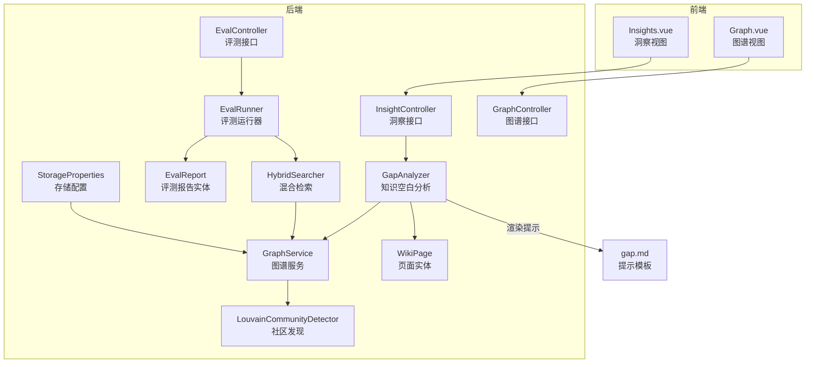
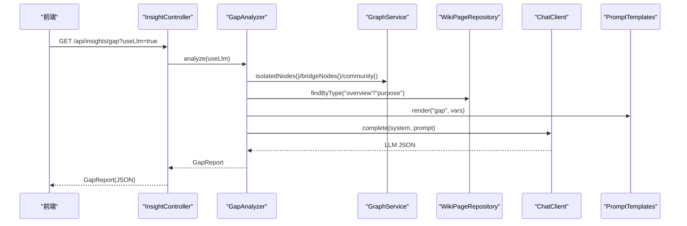
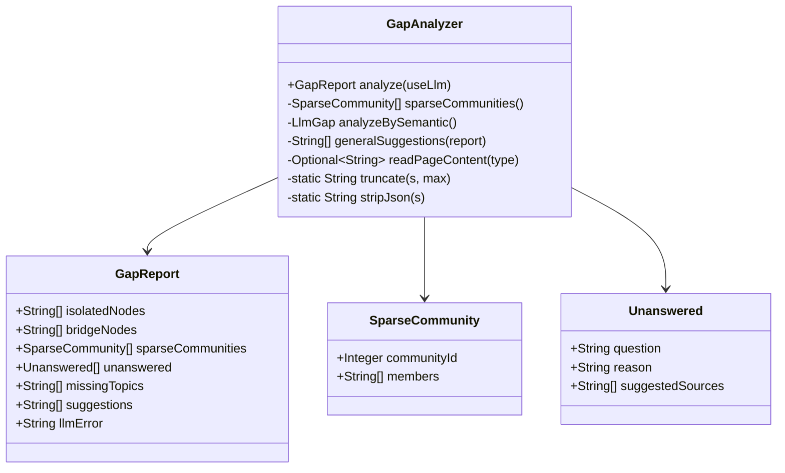
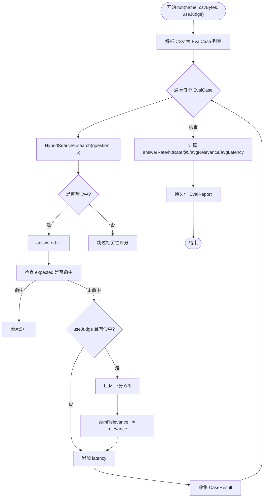
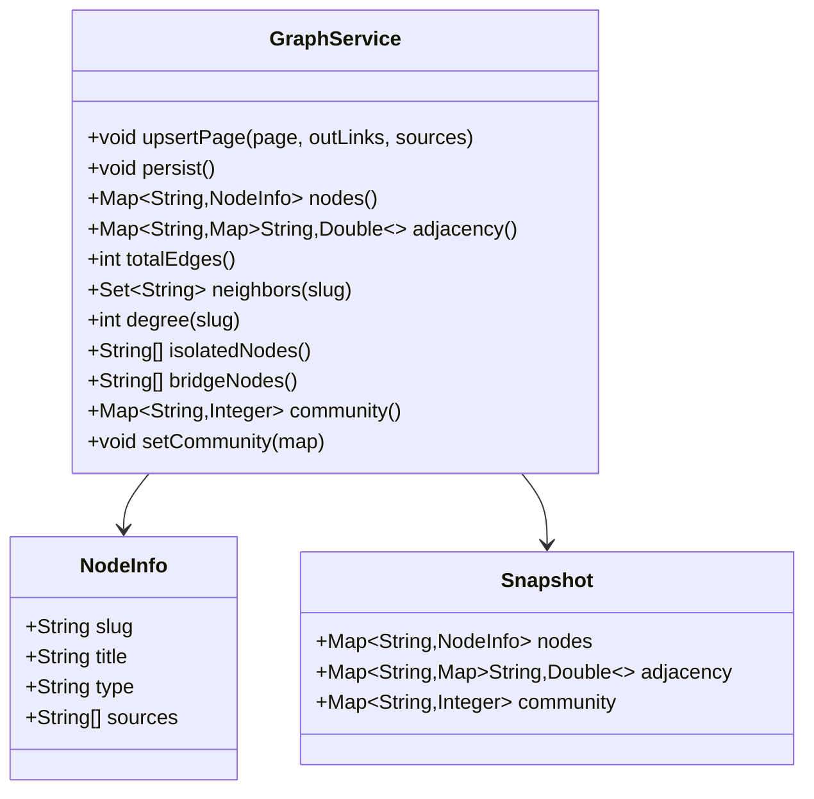
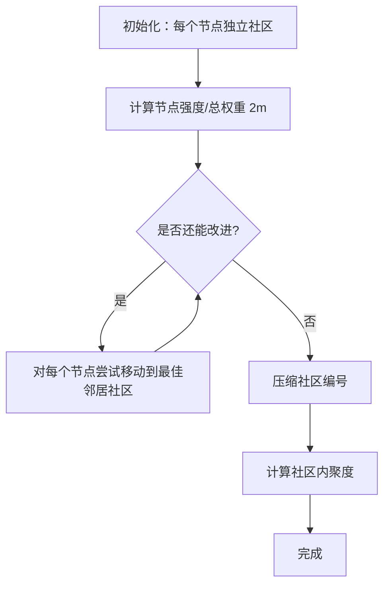
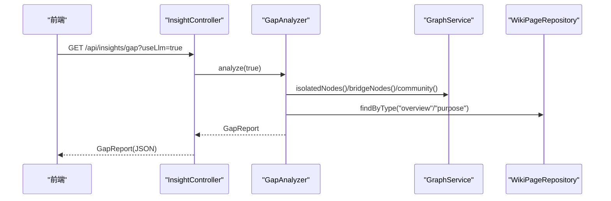
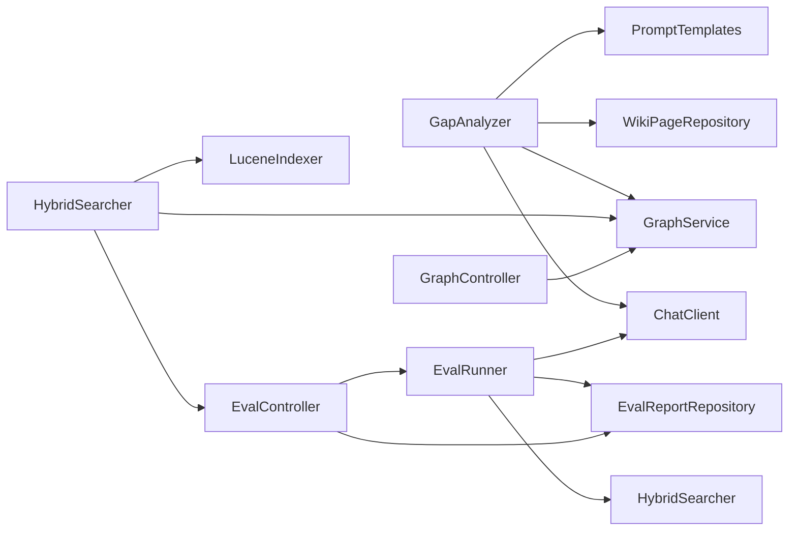

# 知识洞察系统

<cite>
**本文引用的文件**
- [GapAnalyzer.java](file://src/main/java/com/example/llmwiki/insight/GapAnalyzer.java)
- [EvalRunner.java](file://src/main/java/com/example/llmwiki/eval/EvalRunner.java)
- [EvalReport.java](file://src/main/java/com/example/llmwiki/domain/EvalReport.java)
- [GraphService.java](file://src/main/java/com/example/llmwiki/graph/GraphService.java)
- [LouvainCommunityDetector.java](file://src/main/java/com/example/llmwiki/graph/LouvainCommunityDetector.java)
- [InsightController.java](file://src/main/java/com/example/llmwiki/api/InsightController.java)
- [EvalController.java](file://src/main/java/com/example/llmwiki/api/EvalController.java)
- [GraphController.java](file://src/main/java/com/example/llmwiki/api/GraphController.java)
- [HybridSearcher.java](file://src/main/java/com/example/llmwiki/retrieval/HybridSearcher.java)
- [WikiPage.java](file://src/main/java/com/example/llmwiki/domain/WikiPage.java)
- [StorageProperties.java](file://src/main/java/com/example/llmwiki/config/StorageProperties.java)
- [TextUtils.java](file://src/main/java/com/example/llmwiki/util/TextUtils.java)
- [application.yml](file://src/main/resources/application.yml)
- [gap.md](file://src/main/resources/prompts/gap.md)
- [Insights.vue](file://web/src/views/Insights.vue)
- [Graph.vue](file://web/src/views/Graph.vue)
</cite>

## 目录
1. [简介](#简介)
2. [项目结构](#项目结构)
3. [核心组件](#核心组件)
4. [架构总览](#架构总览)
5. [详细组件分析](#详细组件分析)
6. [依赖关系分析](#依赖关系分析)
7. [性能考量](#性能考量)
8. [故障排查指南](#故障排查指南)
9. [结论](#结论)
10. [附录](#附录)

## 简介
本系统围绕“知识洞察”目标，提供从知识图谱到语义审计的闭环能力：通过结构信号（孤立节点、稀疏社区、桥节点）与语义信号（LLM 审计）双通道识别知识空白；基于混合检索与社区发现进行洞察分析；以评估报告量化质量指标；并通过前后端可视化界面呈现洞察结果与交互式图谱。

## 项目结构
- 后端采用 Spring Boot，按功能域组织包：
  - insight：知识空白分析（GapAnalyzer）
  - eval：评测运行（EvalRunner）与报告（EvalReport）
  - graph：图谱服务（GraphService）、社区发现（LouvainCommunityDetector）
  - retrieval：混合检索（HybridSearcher）
  - api：REST 控制器（InsightController、EvalController、GraphController 等）
  - domain/repository/config/util：领域模型、仓库、配置与工具
- 前端使用 Vue3 + Element Plus + AntV G6，提供洞察面板与图谱可视化

**图表来源**
- [InsightController.java:16-30](file://src/main/java/com/example/llmwiki/api/InsightController.java#L16-L30)
- [EvalController.java:26-53](file://src/main/java/com/example/llmwiki/api/EvalController.java#L26-L53)
- [GraphController.java:21-85](file://src/main/java/com/example/llmwiki/api/GraphController.java#L21-L85)
- [GapAnalyzer.java:33-74](file://src/main/java/com/example/llmwiki/insight/GapAnalyzer.java#L33-L74)
- [EvalRunner.java:43-135](file://src/main/java/com/example/llmwiki/eval/EvalRunner.java#L43-L135)
- [GraphService.java:34-196](file://src/main/java/com/example/llmwiki/graph/GraphService.java#L34-L196)
- [LouvainCommunityDetector.java:24-142](file://src/main/java/com/example/llmwiki/graph/LouvainCommunityDetector.java#L24-L142)
- [HybridSearcher.java:31-136](file://src/main/java/com/example/llmwiki/retrieval/HybridSearcher.java#L31-L136)
- [WikiPage.java:23-71](file://src/main/java/com/example/llmwiki/domain/WikiPage.java#L23-L71)
- [StorageProperties.java:13-28](file://src/main/java/com/example/llmwiki/config/StorageProperties.java#L13-L28)
- [gap.md:1-22](file://src/main/resources/prompts/gap.md#L1-L22)
- [Insights.vue:1-60](file://web/src/views/Insights.vue#L1-L60)
- [Graph.vue:1-75](file://web/src/views/Graph.vue#L1-L75)

**章节来源**
- [application.yml:1-84](file://src/main/resources/application.yml#L1-L84)

## 核心组件
- GapAnalyzer：综合结构与语义信号生成知识空白报告，包含孤立节点、桥节点、稀疏社区、未答题、缺失主题与通用建议
- EvalRunner：CSV 评测驱动，计算命中率、平均相关性、平均延迟等指标，并持久化报告
- GraphService：内存图谱 + JSON 持久化，提供节点/邻接/社区、孤立节点/桥节点检测、度数/边数统计
- LouvainCommunityDetector：简化版 Louvain 社区发现，计算社区内聚度
- HybridSearcher：BM25 + 向量 KNN + 图谱 Boost 的混合检索
- API 控制器：统一对外暴露洞察、评测、图谱接口
- 前端视图：Insights.vue（洞察面板）、Graph.vue（交互式图谱）

**章节来源**
- [GapAnalyzer.java:33-228](file://src/main/java/com/example/llmwiki/insight/GapAnalyzer.java#L33-L228)
- [EvalRunner.java:43-242](file://src/main/java/com/example/llmwiki/eval/EvalRunner.java#L43-L242)
- [GraphService.java:34-196](file://src/main/java/com/example/llmwiki/graph/GraphService.java#L34-L196)
- [LouvainCommunityDetector.java:24-142](file://src/main/java/com/example/llmwiki/graph/LouvainCommunityDetector.java#L24-L142)
- [HybridSearcher.java:31-136](file://src/main/java/com/example/llmwiki/retrieval/HybridSearcher.java#L31-L136)
- [InsightController.java:16-30](file://src/main/java/com/example/llmwiki/api/InsightController.java#L16-L30)
- [EvalController.java:26-53](file://src/main/java/com/example/llmwiki/api/EvalController.java#L26-L53)
- [GraphController.java:21-85](file://src/main/java/com/example/llmwiki/api/GraphController.java#L21-L85)
- [Insights.vue:1-60](file://web/src/views/Insights.vue#L1-L60)
- [Graph.vue:1-75](file://web/src/views/Graph.vue#L1-L75)

## 架构总览
系统采用“数据面 + 算法面 + 服务面 + 展示面”的分层设计：
- 数据面：WikiPage 实体承载页面元信息与链接；GraphService 维护图谱快照；StorageProperties 管理持久化目录
- 算法面：GapAnalyzer（结构+语义）、LouvainCommunityDetector（社区发现）、HybridSearcher（检索融合）
- 服务面：InsightController、EvalController、GraphController 提供 REST 接口
- 展示面：Insights.vue 与 Graph.vue 呈现洞察与图谱

**图表来源**
- [InsightController.java:23-29](file://src/main/java/com/example/llmwiki/api/InsightController.java#L23-L29)
- [GapAnalyzer.java:51-74](file://src/main/java/com/example/llmwiki/insight/GapAnalyzer.java#L51-L74)
- [GraphService.java:144-176](file://src/main/java/com/example/llmwiki/graph/GraphService.java#L144-L176)
- [WikiPage.java:23-71](file://src/main/java/com/example/llmwiki/domain/WikiPage.java#L23-L71)
- [gap.md:1-22](file://src/main/resources/prompts/gap.md#L1-L22)

## 详细组件分析

### GapAnalyzer：知识空白分析与智能推荐
- 输入：useLlm 开关；overview/purpose 页面内容；图谱结构信号
- 输出：GapReport（孤立节点、桥节点、稀疏社区、未答题、缺失主题、建议、错误信息）
- 算法要点
  - 结构信号：孤立节点（度≤1）、桥节点（连接≥3个不同社区）、稀疏社区（社区成员≤3）
  - 语义信号：拼装 overview/purpose 文本，渲染 gap 模板，调用 LLM 返回 JSON，解析未答题与缺失主题
  - 通用建议：根据结构信号汇总生成可操作建议
- 错误处理：LLM 解析失败或调用异常记录日志并写入 llmError

**图表来源**
- [GapAnalyzer.java:33-228](file://src/main/java/com/example/llmwiki/insight/GapAnalyzer.java#L33-L228)

**章节来源**
- [GapAnalyzer.java:46-155](file://src/main/java/com/example/llmwiki/insight/GapAnalyzer.java#L46-L155)
- [gap.md:1-22](file://src/main/resources/prompts/gap.md#L1-L22)

### EvalRunner：评测流程与质量指标
- 输入：CSV 字节流（question, expected_slugs），是否启用 LLM 评分
- 流程：逐条执行混合检索，统计命中、相关性、延迟；聚合指标并生成 EvalReport
- 指标
  - answerRate = answered/total
  - hitRate@5 = 命中条数/total（Top-5）
  - avgRelevance = 仅对命中的样本求平均（0-5）
  - avgLatencyMs = 平均耗时
- 细节：CSV 支持分号/逗号分隔多期望；judge 使用严格评分指令

**图表来源**
- [EvalRunner.java:63-135](file://src/main/java/com/example/llmwiki/eval/EvalRunner.java#L63-L135)
- [HybridSearcher.java:42-111](file://src/main/java/com/example/llmwiki/retrieval/HybridSearcher.java#L42-L111)

**章节来源**
- [EvalRunner.java:56-135](file://src/main/java/com/example/llmwiki/eval/EvalRunner.java#L56-L135)
- [EvalReport.java:17-50](file://src/main/java/com/example/llmwiki/domain/EvalReport.java#L17-L50)

### GraphService：图谱建模与洞察信号
- 数据结构：节点 Map、邻接表 Map、社区 Map；支持 JSON 快照持久化
- 洞察信号
  - 孤立节点：度≤1
  - 桥节点：邻居属于≥3 个不同社区
  - 边数统计：无向图按半统计
- 权重策略：外链权重 3.0；共享来源权重 4.0×重叠数；图谱邻接做 Boost

**图表来源**
- [GraphService.java:34-196](file://src/main/java/com/example/llmwiki/graph/GraphService.java#L34-L196)

**章节来源**
- [GraphService.java:71-176](file://src/main/java/com/example/llmwiki/graph/GraphService.java#L71-L176)

### LouvainCommunityDetector：社区质量评估
- 算法：初始每个节点一社区，循环将节点移动至使模块度增量最大化的邻居社区，直至无法改进
- 输出：压缩后的社区映射与按社区分组的结果
- 质量指标：社区内聚度 = 实际边数 / 可能边数（无向图）

**图表来源**
- [LouvainCommunityDetector.java:34-113](file://src/main/java/com/example/llmwiki/graph/LouvainCommunityDetector.java#L34-L113)
- [LouvainCommunityDetector.java:118-133](file://src/main/java/com/example/llmwiki/graph/LouvainCommunityDetector.java#L118-L133)

**章节来源**
- [LouvainCommunityDetector.java:29-113](file://src/main/java/com/example/llmwiki/graph/LouvainCommunityDetector.java#L29-L113)

### 洞察可视化：前端展示与交互
- 洞察面板（Insights.vue）
  - 开关 useLlm，点击“分析”触发 /api/insights/gap
  - 展示未答题、缺失主题、结构信号、通用建议
- 图谱视图（Graph.vue）
  - 滑条调节最小权重，刷新按钮获取 /api/graph
  - AntV G6 渲染节点大小与颜色表示度数与社区

**图表来源**
- [InsightController.java:23-29](file://src/main/java/com/example/llmwiki/api/InsightController.java#L23-L29)
- [Insights.vue:52-59](file://web/src/views/Insights.vue#L52-L59)

**章节来源**
- [Insights.vue:1-60](file://web/src/views/Insights.vue#L1-L60)
- [Graph.vue:1-75](file://web/src/views/Graph.vue#L1-L75)
- [GraphController.java:31-84](file://src/main/java/com/example/llmwiki/api/GraphController.java#L31-L84)

## 依赖关系分析
- 组件耦合
  - GapAnalyzer 依赖 GraphService、WikiPageRepository、ChatClient、PromptTemplates
  - EvalRunner 依赖 HybridSearcher、ChatClient、EvalReportRepository
  - GraphController 依赖 GraphService
  - EvalController 依赖 EvalRunner、EvalReportRepository
- 外部依赖
  - LLM API（OpenAI）：聊天、嵌入、视觉（可禁用）
  - Lucene：全文检索与向量检索
  - H2：评测报告持久化
  - AntV G6：图谱渲染

**图表来源**
- [GapAnalyzer.java:40-44](file://src/main/java/com/example/llmwiki/insight/GapAnalyzer.java#L40-L44)
- [EvalRunner.java:51-54](file://src/main/java/com/example/llmwiki/eval/EvalRunner.java#L51-L54)
- [HybridSearcher.java:38-40](file://src/main/java/com/example/llmwiki/retrieval/HybridSearcher.java#L38-L40)
- [GraphController.java:26-27](file://src/main/java/com/example/llmwiki/api/GraphController.java#L26-L27)
- [EvalController.java:32-33](file://src/main/java/com/example/llmwiki/api/EvalController.java#L32-L33)

**章节来源**
- [application.yml:39-76](file://src/main/resources/application.yml#L39-L76)

## 性能考量
- 检索性能
  - HybridSearcher 使用 BM25 与 KNN 双通道，RRF 融合，Top-K 限制，避免全量扫描
  - 图谱 Boost 对邻居节点进行微幅加权，降低 O(N) 邻接遍历成本
- 社区发现
  - Louvain 在个人规模（<5k 节点）下复杂度可接受，迭代上限 30
- 图谱持久化
  - GraphService 初始化时从 JSON 加载，更新后异步持久化，减少 IO 频次
- 建议
  - 大规模数据时考虑分片索引与缓存热点节点
  - LLM 调用增加超时与重试策略，避免阻塞主线程

[本节为通用性能建议，无需特定文件来源]

## 故障排查指南
- LLM 相关
  - GapAnalyzer：解析 LLM 输出失败会记录警告并写入 llmError
  - EvalRunner：judgeRelevance 对 LLM 异常进行兜底（返回 0）
- CSV 解析
  - EvalRunner：CSV 解析忽略空行，支持分号/逗号分隔；解析异常记录日志
- 图谱加载
  - GraphService：init 加载失败记录警告，不影响后续运行
- 前端请求
  - Insights.vue：useLlm 可切换是否启用 LLM 语义审计；Graph.vue：minWeight 过滤边权重

**章节来源**
- [GapAnalyzer.java:65-68](file://src/main/java/com/example/llmwiki/insight/GapAnalyzer.java#L65-L68)
- [EvalRunner.java:156-162](file://src/main/java/com/example/llmwiki/eval/EvalRunner.java#L156-L162)
- [EvalRunner.java:197-199](file://src/main/java/com/example/llmwiki/eval/EvalRunner.java#L197-L199)
- [GraphService.java:65-67](file://src/main/java/com/example/llmwiki/graph/GraphService.java#L65-L67)
- [Insights.vue:52-59](file://web/src/views/Insights.vue#L52-L59)
- [Graph.vue:30-37](file://web/src/views/Graph.vue#L30-L37)

## 结论
本系统通过“结构+语义”双通道实现知识空白识别与智能推荐，结合社区发现与混合检索形成可解释的洞察体系，并以可视化界面直观呈现。评测模块提供可复现的质量度量，便于持续优化。

[本节为总结性内容，无需特定文件来源]

## 附录

### API 定义概览
- 洞察接口
  - GET /api/insights/gap?useLlm=true → GapReport
- 评测接口
  - POST /api/eval/run?name=&useJudge= → EvalReport
  - GET /api/eval/reports → List[EvalReport]
  - GET /api/eval/reports/{id} → EvalReport 或 404
- 图谱接口
  - GET /api/graph?minWeight= → nodes/edges/communityCount
  - GET /api/graph/insights → isolated/bridges/totalNodes/totalEdges

**章节来源**
- [InsightController.java:23-29](file://src/main/java/com/example/llmwiki/api/InsightController.java#L23-L29)
- [EvalController.java:35-52](file://src/main/java/com/example/llmwiki/api/EvalController.java#L35-L52)
- [GraphController.java:31-84](file://src/main/java/com/example/llmwiki/api/GraphController.java#L31-L84)

### 配置要点
- 存储目录：llm-wiki.storage.graph-dir、index-dir、wiki-dir、raw-dir
- LLM：chat.base-url/chat.api-key/model/temperature/timeout；embedding 同理
- 调度：scheduler.enabled 与 cron

**章节来源**
- [application.yml:31-76](file://src/main/resources/application.yml#L31-L76)
- [StorageProperties.java:15-28](file://src/main/java/com/example/llmwiki/config/StorageProperties.java#L15-L28)