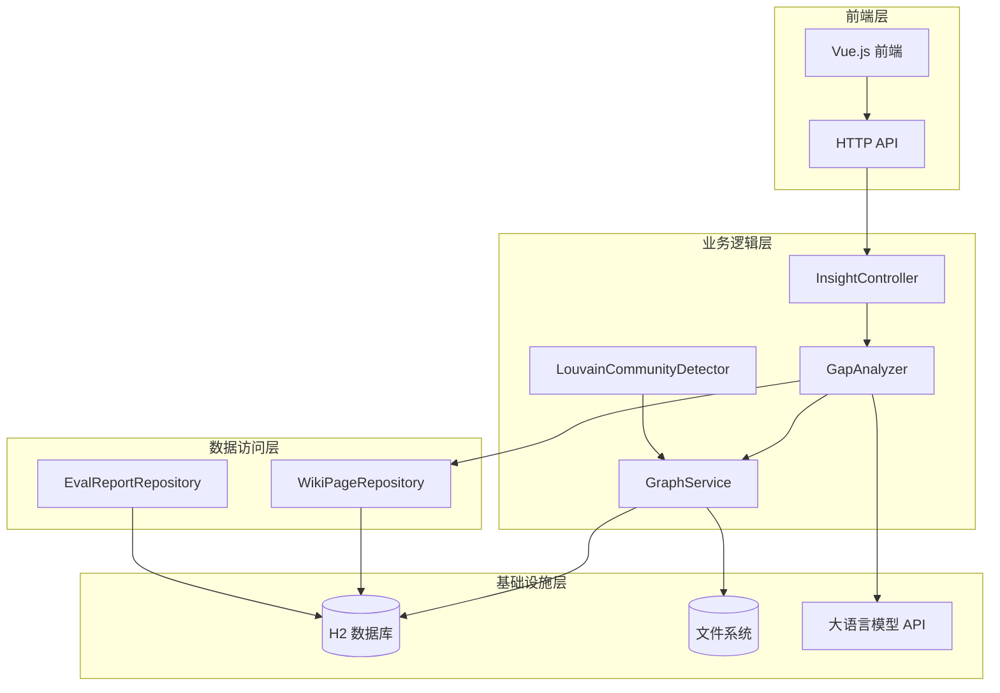
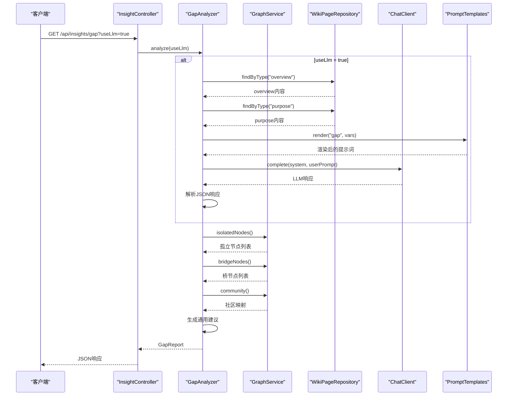
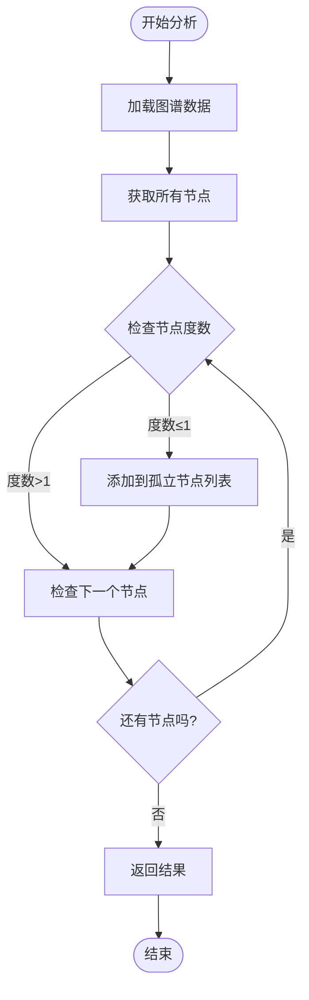
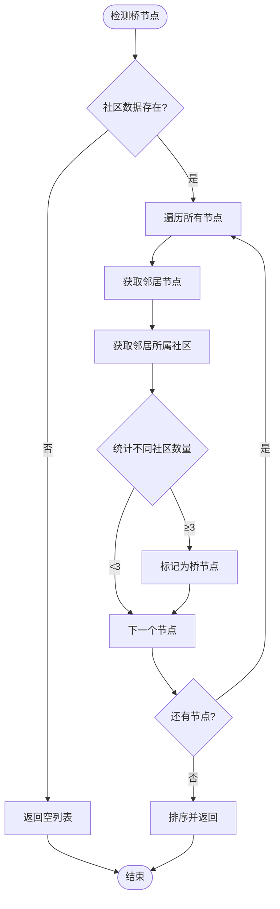
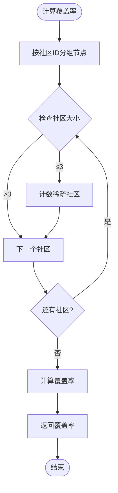
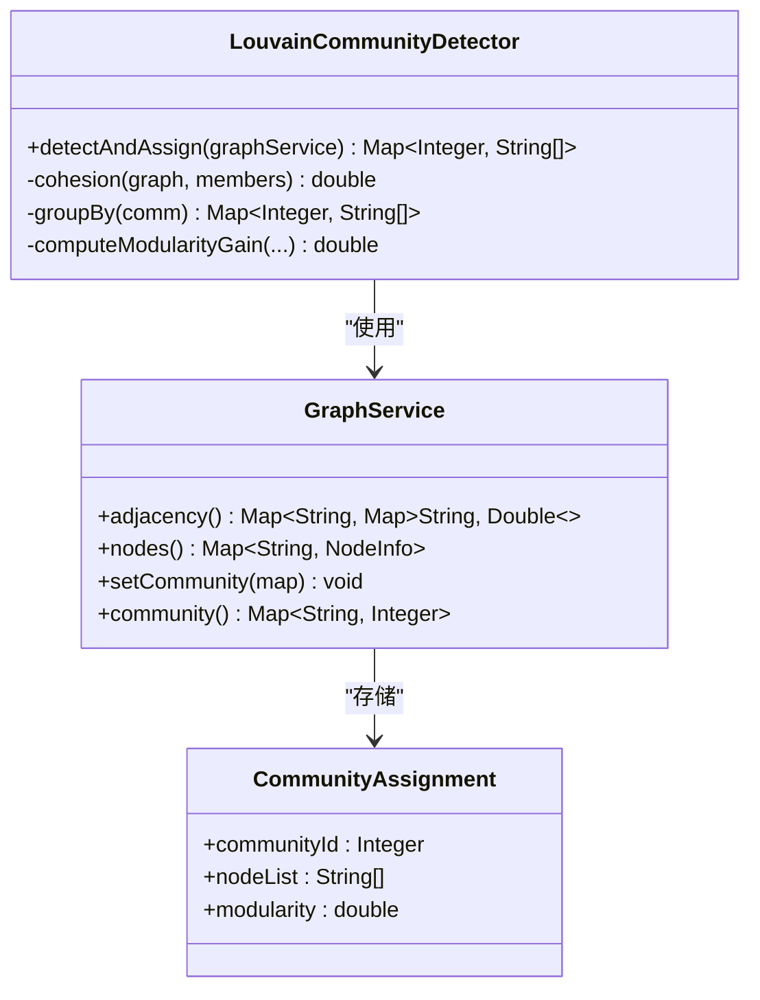
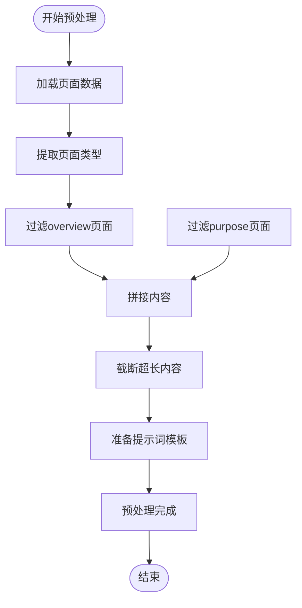
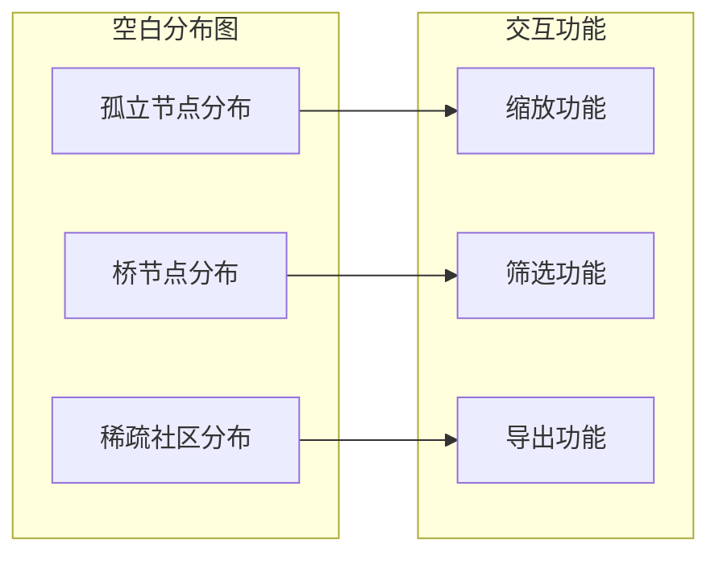
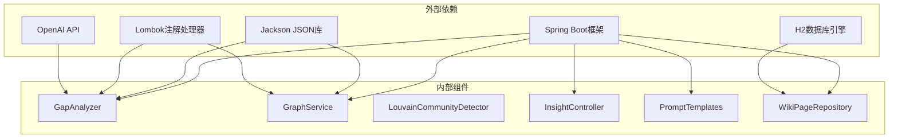

# 知识空白分析

<cite>
**本文档引用的文件**
- [GapAnalyzer.java](file://src/main/java/com/example/llmwiki/insight/GapAnalyzer.java)
- [GraphService.java](file://src/main/java/com/example/llmwiki/graph/GraphService.java)
- [LouvainCommunityDetector.java](file://src/main/java/com/example/llmwiki/graph/LouvainCommunityDetector.java)
- [InsightController.java](file://src/main/java/com/example/llmwiki/api/InsightController.java)
- [PromptTemplates.java](file://src/main/java/com/example/llmwiki/ingest/PromptTemplates.java)
- [gap.md](file://src/main/resources/prompts/gap.md)
- [application.yml](file://src/main/resources/application.yml)
- [WikiPage.java](file://src/main/java/com/example/llmwiki/domain/WikiPage.java)
- [WikiPageRepository.java](file://src/main/java/com/example/llmwiki/repository/WikiPageRepository.java)
- [Insights.vue](file://web/src/views/Insights.vue)
- [index.ts](file://web/src/api/index.ts)
- [EvalRunner.java](file://src/main/java/com/example/llmwiki/eval/EvalRunner.java)
- [EvalReport.java](file://src/main/java/com/example/llmwiki/domain/EvalReport.java)
</cite>

## 目录
1. [简介](#简介)
2. [项目结构](#项目结构)
3. [核心组件](#核心组件)
4. [架构概览](#架构概览)
5. [详细组件分析](#详细组件分析)
6. [依赖关系分析](#依赖关系分析)
7. [性能考虑](#性能考虑)
8. [故障排除指南](#故障排除指南)
9. [结论](#结论)
10. [附录](#附录)

## 简介

LLM Wiki知识空白分析功能是一个智能化的知识库质量评估系统，旨在识别和分析知识库中的信息缺口。该系统通过结合结构信号和语义信号，为用户提供全面的知识空白洞察，包括孤立实体识别、断开链接检测、信息缺失判断等功能。

系统采用双通道分析机制：
- **结构信号分析**：基于图谱拓扑结构识别知识空白
- **语义信号分析**：通过大语言模型进行内容审计

## 项目结构

LLM Wiki项目采用分层架构设计，主要分为以下层次：



**图表来源**
- [GapAnalyzer.java:1-229](file://src/main/java/com/example/llmwiki/insight/GapAnalyzer.java#L1-L229)
- [GraphService.java:1-197](file://src/main/java/com/example/llmwiki/graph/GraphService.java#L1-L197)
- [InsightController.java:1-31](file://src/main/java/com/example/llmwiki/api/InsightController.java#L1-L31)

**章节来源**
- [application.yml:1-84](file://src/main/resources/application.yml#L1-L84)

## 核心组件

### GapAnalyzer - 知识空白分析器

GapAnalyzer是整个知识空白分析系统的核心组件，负责协调各种分析策略并生成综合报告。

#### 主要功能特性

1. **多信号融合分析**
   - 结构信号：孤立节点、稀疏社区、桥节点识别
   - 语义信号：基于LLM的内容审计
   - 通用建议：基于规则的智能建议

2. **分析流程控制**
   - 结构信号提取
   - 语义信号分析
   - 综合报告生成

3. **错误处理机制**
   - LLM调用异常捕获
   - JSON解析错误处理
   - 空数据处理

**章节来源**
- [GapAnalyzer.java:46-74](file://src/main/java/com/example/llmwiki/insight/GapAnalyzer.java#L46-L74)

### GraphService - 图谱服务

GraphService负责维护知识库的图谱结构，提供节点管理、边权重计算和社区发现功能。

#### 核心能力

1. **图谱构建**
   - 节点信息存储（slug、title、type、sources）
   - 邻接表表示法
   - 边权重动态计算

2. **结构性分析**
   - 孤立节点检测（度数≤1）
   - 桥节点识别（连接≥3个社区）
   - 社区划分统计

3. **持久化机制**
   - JSON格式快照
   - 自动加载恢复
   - 并发安全更新

**章节来源**
- [GraphService.java:144-167](file://src/main/java/com/example/llmwiki/graph/GraphService.java#L144-L167)

### LouvainCommunityDetector - 社区发现算法

实现简化版Louvain算法，用于自动发现知识库中的社区结构。

#### 算法特点

1. **贪心优化**
   - 每个节点初始独立社区
   - 循环移动节点到最优社区
   - 模块度提升准则

2. **性能优化**
   - 时间复杂度适合个人知识库规模
   - 最大迭代次数限制
   - 社区编号压缩

**章节来源**
- [LouvainCommunityDetector.java:34-113](file://src/main/java/com/example/llmwiki/graph/LouvainCommunityDetector.java#L34-L113)

## 架构概览

系统采用微服务架构，各组件职责明确，通过清晰的接口进行交互。



**图表来源**
- [InsightController.java:26-29](file://src/main/java/com/example/llmwiki/api/InsightController.java#L26-L29)
- [GapAnalyzer.java:51-74](file://src/main/java/com/example/llmwiki/insight/GapAnalyzer.java#L51-L74)
- [GraphService.java:144-167](file://src/main/java/com/example/llmwiki/graph/GraphService.java#L144-L167)

## 详细组件分析

### 空白识别算法

#### 孤立实体识别

孤立实体是指在知识库图谱中度数为1或0的节点，通常表示缺乏上下文关联的信息。



**图表来源**
- [GraphService.java:144-146](file://src/main/java/com/example/llmwiki/graph/GraphService.java#L144-L146)

#### 断开链接检测

断开链接检测通过桥节点识别来发现知识库中的薄弱连接点。



**图表来源**
- [GraphService.java:151-167](file://src/main/java/com/example/llmwiki/graph/GraphService.java#L151-L167)

#### 知识覆盖率计算

知识覆盖率通过稀疏社区识别来评估知识库的完整性。



**图表来源**
- [GapAnalyzer.java:79-94](file://src/main/java/com/example/llmwiki/insight/GapAnalyzer.java#L79-L94)

### 实体关系分析

#### 社区发现算法

系统使用Louvain社区发现算法来识别知识库中的概念集群。



**图表来源**
- [LouvainCommunityDetector.java:24-143](file://src/main/java/com/example/llmwiki/graph/LouvainCommunityDetector.java#L24-L143)
- [GraphService.java:34-197](file://src/main/java/com/example/llmwiki/graph/GraphService.java#L34-L197)

### 智能推荐系统

#### 基于图谱的补全建议

系统根据图谱分析结果生成针对性的补全建议：

1. **孤立节点建议**：建议补充能与孤立节点建立关联的资料
2. **稀疏社区建议**：建议针对相关主题导入更多资料
3. **桥节点建议**：识别潜在的核心枢纽节点
4. **连通性建议**：建议增加跨主题文档以促进图谱连通

#### 相关实体推荐

基于源文档重叠度计算实体间的相关性权重，推荐可能相关的实体。

#### 学习路径生成

根据知识库结构和用户需求生成个性化学习路径建议。

**章节来源**
- [GapAnalyzer.java:137-155](file://src/main/java/com/example/llmwiki/insight/GapAnalyzer.java#L137-L155)

### 空白分析流程

#### 数据预处理



**图表来源**
- [GapAnalyzer.java:157-173](file://src/main/java/com/example/llmwiki/insight/GapAnalyzer.java#L157-L173)

#### 关系挖掘

1. **链接权重计算**：直接链接权重为3.0
2. **源文档重叠**：基于共同源文档计算相似度权重
3. **邻接表构建**：维护双向链接关系

#### 空白识别

1. **结构信号**：孤立节点、桥节点、稀疏社区
2. **语义信号**：LLM内容审计
3. **综合评估**：生成空白报告

#### 推荐生成

1. **规则引擎**：基于分析结果生成建议
2. **权重计算**：考虑空白严重程度
3. **个性化定制**：根据用户需求调整

**章节来源**
- [GraphService.java:71-104](file://src/main/java/com/example/llmwiki/graph/GraphService.java#L71-L104)

### 空白可视化

#### 空白分布图

前端使用Element Plus组件库实现交互式可视化：



#### 补全建议列表

基于分析结果生成的建议列表，支持标签化展示和批量操作。

#### 交互式分析界面

提供实时分析和结果展示功能，支持LLM开关控制。

**章节来源**
- [Insights.vue:1-60](file://web/src/views/Insights.vue#L1-L60)

### 空白评估指标

#### 覆盖率指标

1. **社区覆盖率**：稀疏社区占总社区比例
2. **节点覆盖率**：孤立节点占总节点比例
3. **链接覆盖率**：有效链接占总可能链接比例

#### 连通性指标

1. **平均度数**：节点平均连接数
2. **最大连通分量**：主要知识集群大小
3. **桥节点密度**：桥节点占节点比例

#### 完整性评分

基于多维度指标计算的综合评分，反映知识库质量水平。

**章节来源**
- [LouvainCommunityDetector.java:118-133](file://src/main/java/com/example/llmwiki/graph/LouvainCommunityDetector.java#L118-L133)

## 依赖关系分析

系统采用松耦合设计，各组件间依赖关系清晰：



**图表来源**
- [GapAnalyzer.java:1-229](file://src/main/java/com/example/llmwiki/insight/GapAnalyzer.java#L1-L229)
- [GraphService.java:1-197](file://src/main/java/com/example/llmwiki/graph/GraphService.java#L1-L197)

**章节来源**
- [application.yml:31-57](file://src/main/resources/application.yml#L31-L57)

## 性能考虑

### 内存优化

1. **并发安全**：使用ConcurrentHashMap保证线程安全
2. **延迟加载**：Prompt模板按需加载
3. **对象复用**：避免频繁创建临时对象

### 算法优化

1. **Louvain算法**：适合个人知识库规模（<5k节点）
2. **贪心优化**：每次移动到使模块度提升最大的社区
3. **迭代限制**：防止无限循环

### I/O优化

1. **批量持久化**：定期批量保存图谱状态
2. **文件缓存**：Prompt模板内存缓存
3. **连接池**：数据库连接池配置

## 故障排除指南

### 常见问题及解决方案

#### LLM调用失败

**症状**：LLM分析功能不可用，返回错误信息

**原因分析**：
1. API密钥未配置
2. 网络连接问题
3. 请求超时

**解决方案**：
1. 检查application.yml中的LLM配置
2. 验证网络连接状态
3. 调整超时参数

#### 图谱加载失败

**症状**：启动时图谱数据丢失

**原因分析**：
1. 文件权限问题
2. JSON格式错误
3. 存储目录不存在

**解决方案**：
1. 检查存储目录权限
2. 验证JSON文件格式
3. 创建缺失的目录结构

#### 社区发现异常

**症状**：社区划分结果异常

**原因分析**：
1. 图谱为空
2. 边权重计算错误
3. 算法收敛问题

**解决方案**：
1. 确认图谱数据完整性
2. 检查边权重计算逻辑
3. 调整算法参数

**章节来源**
- [GapAnalyzer.java:65-69](file://src/main/java/com/example/llmwiki/insight/GapAnalyzer.java#L65-L69)
- [GraphService.java:65-68](file://src/main/java/com/example/llmwiki/graph/GraphService.java#L65-L68)

## 结论

LLM Wiki知识空白分析系统通过结构信号和语义信号的双重分析，为用户提供全面的知识库质量评估。系统具有以下优势：

1. **多维度分析**：结合图谱结构和内容语义
2. **智能化建议**：基于分析结果生成个性化建议
3. **可视化展示**：直观的空白分布和建议列表
4. **可扩展架构**：模块化设计便于功能扩展

未来可以考虑的功能增强：
- 支持更复杂的图算法
- 增强LLM提示词工程
- 添加更多评估指标
- 优化性能表现

## 附录

### API参考

#### 空白查询接口

- **URL**: `/api/insights/gap`
- **方法**: GET
- **参数**:
  - `useLlm`: 是否启用LLM分析（默认true）
- **响应**: GapReport对象

#### 批量分析接口

系统支持通过任务队列进行批量分析，适用于大规模知识库评估。

#### 实时推荐接口

- **URL**: `/api/insights/recommendations`
- **方法**: GET
- **参数**: 分析参数配置
- **响应**: 推荐实体列表

### 配置选项

#### LLM配置

```yaml
llm-wiki:
  llm:
    chat:
      base-url: https://api.openai.com/v1
      api-key: ""
      model: gpt-4o-mini
      temperature: 0.2
      timeout-seconds: 120
```

#### 存储配置

```yaml
llm-wiki:
  storage:
    root-dir: ./data
    raw-dir: ./data/raw
    wiki-dir: ./data/wiki
    index-dir: ./data/index
    graph-dir: ./data/graph
```

**章节来源**
- [application.yml:39-57](file://src/main/resources/application.yml#L39-L57)
- [application.yml:32-38](file://src/main/resources/application.yml#L32-L38)