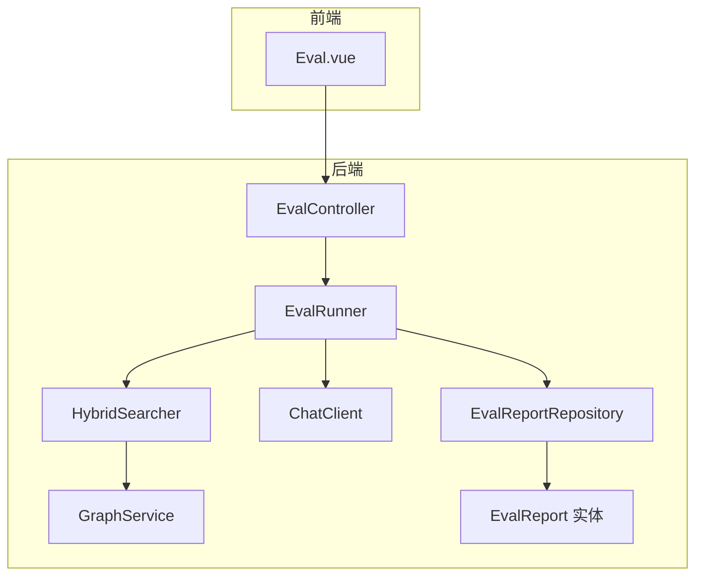
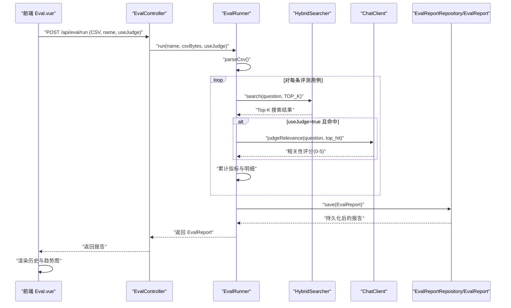
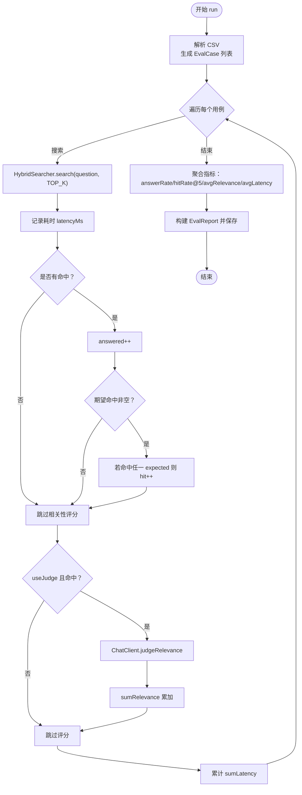
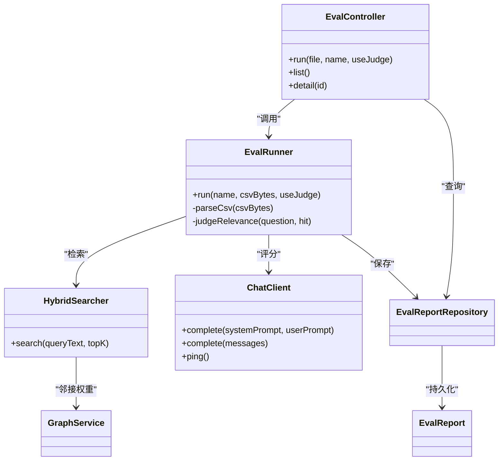

# 评估报告系统

<cite>
**本文引用的文件**
- [EvalRunner.java](file://src/main/java/com/example/llmwiki/eval/EvalRunner.java)
- [EvalReport.java](file://src/main/java/com/example/llmwiki/domain/EvalReport.java)
- [EvalController.java](file://src/main/java/com/example/llmwiki/api/EvalController.java)
- [EvalReportRepository.java](file://src/main/java/com/example/llmwiki/repository/EvalReportRepository.java)
- [HybridSearcher.java](file://src/main/java/com/example/llmwiki/retrieval/HybridSearcher.java)
- [ChatClient.java](file://src/main/java/com/example/llmwiki/llm/ChatClient.java)
- [application.yml](file://src/main/resources/application.yml)
- [LlmProperties.java](file://src/main/java/com/example/llmwiki/config/LlmProperties.java)
- [GraphService.java](file://src/main/java/com/example/llmwiki/graph/GraphService.java)
- [GapAnalyzer.java](file://src/main/java/com/example/llmwiki/insight/GapAnalyzer.java)
- [Eval.vue](file://web/src/views/Eval.vue)
</cite>

## 目录
1. [简介](#简介)
2. [项目结构](#项目结构)
3. [核心组件](#核心组件)
4. [架构总览](#架构总览)
5. [详细组件分析](#详细组件分析)
6. [依赖关系分析](#依赖关系分析)
7. [性能考量](#性能考量)
8. [故障排查指南](#故障排查指南)
9. [结论](#结论)
10. [附录](#附录)

## 简介
本文件面向“LLM Wiki 评估报告系统”，聚焦于评估流程、指标体系、数据结构、算法实现与可视化呈现，帮助读者快速理解并高效使用该系统的评估能力。系统支持从 CSV 评测任务的上传与调度，到检索与相关性评分、指标聚合与报告落库，再到前端可视化与历史报告管理的完整闭环。

## 项目结构
后端采用 Spring Boot + JPA + H2 数据库存储，前端基于 Vue + Element Plus + ECharts 构建。评估相关模块主要分布在以下包：
- eval：评估运行器与控制器
- domain：实体模型（含评估报告）
- repository：JPA 存储库
- retrieval：混合检索器（BM25 + 向量 KNN + 图谱增强）
- llm：统一的 LLM 客户端（兼容多种 OpenAI 兼容服务）
- graph：知识图谱服务（孤立节点、桥节点、稀疏社区等结构信号）
- insight：知识缺口分析（与评估互补）
- api：REST 控制器（评估、仪表盘、图谱、洞察等）

图表来源
- [Eval.vue:1-108](file://web/src/views/Eval.vue#L1-L108)
- [EvalController.java:1-54](file://src/main/java/com/example/llmwiki/api/EvalController.java#L1-L54)
- [EvalRunner.java:1-243](file://src/main/java/com/example/llmwiki/eval/EvalRunner.java#L1-L243)
- [HybridSearcher.java:1-137](file://src/main/java/com/example/llmwiki/retrieval/HybridSearcher.java#L1-L137)
- [ChatClient.java:1-108](file://src/main/java/com/example/llmwiki/llm/ChatClient.java#L1-L108)
- [GraphService.java:1-197](file://src/main/java/com/example/llmwiki/graph/GraphService.java#L1-L197)
- [EvalReportRepository.java:1-12](file://src/main/java/com/example/llmwiki/repository/EvalReportRepository.java#L1-L12)
- [EvalReport.java:1-51](file://src/main/java/com/example/llmwiki/domain/EvalReport.java#L1-L51)

章节来源
- [application.yml:1-84](file://src/main/resources/application.yml#L1-L84)

## 核心组件
- 评估运行器（EvalRunner）：负责 CSV 解析、逐条评测、指标聚合、报告落库与可选的 LLM 相关性评分。
- 评估报告（EvalReport）：JPA 实体，承载评估指标与明细 JSON。
- 评估控制器（EvalController）：提供评测启动、报告列表与详情查询的 REST 接口。
- 混合检索器（HybridSearcher）：BM25 + 向量 KNN + 图谱邻接权重融合，RRF 排序。
- LLM 客户端（ChatClient）：OpenAI 兼容的聊天补全客户端，支持多厂商适配。
- 图谱服务（GraphService）：提供孤立节点、桥节点、稀疏社区等结构信号，辅助相关性评分与知识缺口分析。
- 存储配置（LlmProperties）：统一管理 LLM Chat/Embedding/Vision 的基础配置。
- 前端视图（Eval.vue）：CSV 上传、评测开关、历史报告展示与指标趋势图。

章节来源
- [EvalRunner.java:1-243](file://src/main/java/com/example/llmwiki/eval/EvalRunner.java#L1-L243)
- [EvalReport.java:1-51](file://src/main/java/com/example/llmwiki/domain/EvalReport.java#L1-L51)
- [EvalController.java:1-54](file://src/main/java/com/example/llmwiki/api/EvalController.java#L1-L54)
- [HybridSearcher.java:1-137](file://src/main/java/com/example/llmwiki/retrieval/HybridSearcher.java#L1-L137)
- [ChatClient.java:1-108](file://src/main/java/com/example/llmwiki/llm/ChatClient.java#L1-L108)
- [GraphService.java:1-197](file://src/main/java/com/example/llmwiki/graph/GraphService.java#L1-L197)
- [LlmProperties.java:1-63](file://src/main/java/com/example/llmwiki/config/LlmProperties.java#L1-L63)
- [Eval.vue:1-108](file://web/src/views/Eval.vue#L1-L108)

## 架构总览
评估系统采用“前端上传 CSV → 后端解析与评测 → 检索与评分 → 指标聚合 → 报告落库 → 前端可视化”的流水线式架构。关键特性包括：
- 检索层：BM25 与向量 KNN 双通道，图谱邻接权重作为结构增强，最终通过 RRF 融合排序。
- 评分层：可选 LLM 相关性评分（0-5），严格限制输出格式，确保稳定性。
- 报告层：聚合指标（回答率、命中率@5、平均相关性、平均延迟）与明细 JSON，便于回放与二次分析。
- 可视化层：前端基于 ECharts 展示指标趋势与明细表格。

图表来源
- [Eval.vue:75-84](file://web/src/views/Eval.vue#L75-L84)
- [EvalController.java:35-41](file://src/main/java/com/example/llmwiki/api/EvalController.java#L35-L41)
- [EvalRunner.java:63-135](file://src/main/java/com/example/llmwiki/eval/EvalRunner.java#L63-L135)
- [HybridSearcher.java:42-111](file://src/main/java/com/example/llmwiki/retrieval/HybridSearcher.java#L42-L111)
- [ChatClient.java:37-86](file://src/main/java/com/example/llmwiki/llm/ChatClient.java#L37-L86)
- [EvalReportRepository.java:1-12](file://src/main/java/com/example/llmwiki/repository/EvalReportRepository.java#L1-L12)
- [EvalReport.java:29-50](file://src/main/java/com/example/llmwiki/domain/EvalReport.java#L29-L50)

## 详细组件分析

### 评估运行器（EvalRunner）
职责与流程
- 输入：CSV 字节流（UTF-8，首行 header），报告名，是否启用 LLM 评分。
- 处理：逐条解析问题与期望命中 slug；对每个问题执行混合检索；统计回答数、命中数、相关性与延迟；可选地调用 LLM 对最佳命中进行 0-5 评分。
- 输出：构建 EvalReport 并持久化，同时将明细 JSON 写入 details 字段。

关键指标
- 回答率（answerRate）：answered / total
- 命中率@5（hitRateAt5）：命中 top-5 的比例
- 平均相关性（avgRelevance）：仅对 answered 的样本求平均
- 平均延迟（avgLatencyMs）：所有样本的平均检索耗时

CSV 规范
- 表头：question,expected_slugs
- expected_slugs 支持分号或中文逗号分隔，命中任一即视为命中

错误处理
- 单条评测异常会被记录在明细 error 字段，不影响整体流程。

图表来源
- [EvalRunner.java:63-135](file://src/main/java/com/example/llmwiki/eval/EvalRunner.java#L63-L135)
- [HybridSearcher.java:42-111](file://src/main/java/com/example/llmwiki/retrieval/HybridSearcher.java#L42-L111)
- [ChatClient.java:140-163](file://src/main/java/com/example/llmwiki/llm/ChatClient.java#L140-L163)

章节来源
- [EvalRunner.java:28-135](file://src/main/java/com/example/llmwiki/eval/EvalRunner.java#L28-L135)

### 评估报告数据结构（EvalReport）
实体字段
- id：自增主键
- name：报告名称
- total：总样本数
- answered：回答数
- answerRate：回答率
- hitRateAt5：命中率@5
- avgRelevance：平均相关性（0-5）
- avgLatencyMs：平均延迟（毫秒）
- details：明细 JSON（包含每条用例的命中、相关性、延迟、错误等）
- createdAt：创建时间

持久化
- 使用 JPA 注解映射至数据库表 eval_report，details 字段为大对象存储。

章节来源
- [EvalReport.java:29-50](file://src/main/java/com/example/llmwiki/domain/EvalReport.java#L29-L50)
- [EvalReportRepository.java:10-11](file://src/main/java/com/example/llmwiki/repository/EvalReportRepository.java#L10-L11)

### 评估控制器（EvalController）
接口定义
- POST /api/eval/run：上传 CSV，启动评测，支持参数 name 与 useJudge
- GET /api/eval/reports：列出所有评估报告
- GET /api/eval/reports/{id}：获取指定报告详情

章节来源
- [EvalController.java:35-52](file://src/main/java/com/example/llmwiki/api/EvalController.java#L35-L52)

### 混合检索器（HybridSearcher）
检索策略
- BM25：基于 Lucene 的文本检索，使用 RRF 融合
- 向量 KNN：使用 EmbeddingClient 获取查询向量，Lucene KNN 查询
- 图谱增强：根据 GraphService 的邻接权重对命中节点进行微调加权
- 融合：RRF（Reciprocal Rank Fusion）对同一 slug 的多个来源得分进行融合，取前 K

降级策略
- 当向量不可用时，自动降级为仅 BM25 检索

章节来源
- [HybridSearcher.java:42-111](file://src/main/java/com/example/llmwiki/retrieval/HybridSearcher.java#L42-L111)
- [GraphService.java:144-167](file://src/main/java/com/example/llmwiki/graph/GraphService.java#L144-L167)

### LLM 客户端（ChatClient）
功能
- 单轮或多轮对话调用，遵循 OpenAI Chat 协议
- 自动注入 Authorization 头与请求体
- 提供健康检查 ping 方法
- 异常统一包装为 LlmException

配置
- 通过 LlmProperties 读取 base-url、api-key、model、temperature、timeout 等参数

章节来源
- [ChatClient.java:37-86](file://src/main/java/com/example/llmwiki/llm/ChatClient.java#L37-L86)
- [LlmProperties.java:31-42](file://src/main/java/com/example/llmwiki/config/LlmProperties.java#L31-L42)

### 前端评估视图（Eval.vue）
功能
- 上传 CSV、设置报告名、开关 useJudge
- 展示历史报告与指标（回答率、命中率@5、平均相关性、平均延迟）
- 加载选定报告的明细 JSON，渲染 ECharts 指标趋势图（answered/hit/relevance）

章节来源
- [Eval.vue:1-108](file://web/src/views/Eval.vue#L1-L108)

## 依赖关系分析
- EvalController 依赖 EvalRunner 与 EvalReportRepository
- EvalRunner 依赖 HybridSearcher、ChatClient、EvalReportRepository
- HybridSearcher 依赖 LuceneIndexer、EmbeddingClient、GraphService
- ChatClient 依赖 LlmProperties 与 Rest 客户端
- EvalReportRepository 依赖 EvalReport 实体
- 前端 Eval.vue 依赖后端评估 API

图表来源
- [EvalController.java:32-33](file://src/main/java/com/example/llmwiki/api/EvalController.java#L32-L33)
- [EvalRunner.java:51-54](file://src/main/java/com/example/llmwiki/eval/EvalRunner.java#L51-L54)
- [HybridSearcher.java:38-40](file://src/main/java/com/example/llmwiki/retrieval/HybridSearcher.java#L38-L40)
- [ChatClient.java:30-32](file://src/main/java/com/example/llmwiki/llm/ChatClient.java#L30-L32)
- [EvalReportRepository.java:10-11](file://src/main/java/com/example/llmwiki/repository/EvalReportRepository.java#L10-L11)
- [EvalReport.java:29-50](file://src/main/java/com/example/llmwiki/domain/EvalReport.java#L29-L50)
- [GraphService.java:40-47](file://src/main/java/com/example/llmwiki/graph/GraphService.java#L40-L47)

## 性能考量
- 检索性能
  - BM25 与向量 KNN 双通道并行，RRF 融合减少重复计算
  - 图谱邻接权重仅对命中节点做增量加权，复杂度可控
- 评分成本
  - useJudge 仅对命中样本调用 LLM，避免不必要的外部调用
  - 严格限制 LLM 输出格式，减少解析开销
- 存储与序列化
  - 明细 JSON 采用大字段存储，便于后续分析但需注意查询性能
- 并发与资源
  - LlmProperties 支持热更新，可在运行时调整模型与超时
  - Quartz 任务配置可用于定时触发评估或图谱更新（见 application.yml）

章节来源
- [HybridSearcher.java:42-111](file://src/main/java/com/example/llmwiki/retrieval/HybridSearcher.java#L42-L111)
- [EvalRunner.java:101-104](file://src/main/java/com/example/llmwiki/eval/EvalRunner.java#L101-L104)
- [application.yml:26-29](file://src/main/resources/application.yml#L26-L29)

## 故障排查指南
常见问题与定位
- LLM API Key 未配置
  - 现象：调用 ChatClient 抛出 LlmException
  - 处理：在设置页面填写 llm.chat.api-key 或通过配置文件设置
- LLM 评分失败
  - 现象：相关性评分为 0，日志出现警告
  - 处理：检查网络连通性、模型可用性与响应格式
- 检索失败
  - 现象：某条用例 error 字段记录异常
  - 处理：查看日志，确认索引状态与向量服务可用性
- CSV 解析异常
  - 现象：解析失败日志
  - 处理：确认 CSV 编码为 UTF-8，表头与分隔符符合预期

章节来源
- [ChatClient.java:52-54](file://src/main/java/com/example/llmwiki/llm/ChatClient.java#L52-L54)
- [EvalRunner.java:197-199](file://src/main/java/com/example/llmwiki/eval/EvalRunner.java#L197-L199)
- [HybridSearcher.java:68-86](file://src/main/java/com/example/llmwiki/retrieval/HybridSearcher.java#L68-L86)

## 结论
评估报告系统以“CSV 评测任务 + 混合检索 + 可选 LLM 评分”为核心，实现了从任务调度、指标计算到报告生成与可视化的完整链路。其设计兼顾了性能与可扩展性：检索层采用 BM25 与向量双通道并融合图谱增强；评分层通过严格的输出约束保障稳定性；报告层以实体与明细 JSON 双轨存储，满足历史回放与二次分析需求。前端通过 ECharts 提供直观的趋势与对比展示，便于持续监控与优化。

## 附录

### 评估指标定义与计算
- 回答率（answerRate）：answered / total
- 命中率@5（hitRateAt5）：命中 top-5 的比例
- 平均相关性（avgRelevance）：answered 样本的平均相关性（0-5）
- 平均延迟（avgLatencyMs）：所有样本的平均检索耗时

章节来源
- [EvalRunner.java:114-117](file://src/main/java/com/example/llmwiki/eval/EvalRunner.java#L114-L117)

### 报告格式规范
- 报告字段：id、name、total、answered、answerRate、hitRateAt5、avgRelevance、avgLatencyMs、details、createdAt
- 明细 JSON：每条用例包含 question、expected、hits、answered、hit、relevance、latencyMs、error

章节来源
- [EvalReport.java:35-49](file://src/main/java/com/example/llmwiki/domain/EvalReport.java#L35-L49)
- [EvalRunner.java:232-241](file://src/main/java/com/example/llmwiki/eval/EvalRunner.java#L232-L241)

### 评估算法与规则
- 检索融合：BM25 + 向量 KNN + 图谱邻接权重，RRF 融合
- 相关性评分：严格系统提示词，仅接受 0-5 数字输出
- 命中判定：expected_slugs 任一命中即为命中
- 降级策略：向量不可用时降级为 BM25

章节来源
- [HybridSearcher.java:42-111](file://src/main/java/com/example/llmwiki/retrieval/HybridSearcher.java#L42-L111)
- [EvalRunner.java:140-163](file://src/main/java/com/example/llmwiki/eval/EvalRunner.java#L140-L163)

### 评估可视化
- 历史报告：展示回答率、命中率@5、平均相关性、平均延迟与创建时间
- 指标趋势：ECharts 展示 answered/hit/relevance 的趋势
- 明细表格：显示每条用例的命中、相关性、延迟与错误

章节来源
- [Eval.vue:22-51](file://web/src/views/Eval.vue#L22-L51)
- [Eval.vue:90-104](file://web/src/views/Eval.vue#L90-L104)

### 评估维护与优化
- 指标权重：可通过调整 useJudge 开关与阈值策略间接影响相关性权重
- 算法优化：可引入更丰富的图谱信号（如 PageRank、中心性）与更精细的 RRF 参数
- 性能监控：结合 avgLatencyMs 与命中率趋势，识别检索与评分瓶颈
- 配置热更新：通过 LlmProperties 动态调整模型与超时

章节来源
- [application.yml:31-57](file://src/main/resources/application.yml#L31-L57)
- [LlmProperties.java:31-42](file://src/main/java/com/example/llmwiki/config/LlmProperties.java#L31-L42)

### 评估 API
- 评测启动
  - 方法：POST
  - 路径：/api/eval/run
  - 参数：file（CSV）、name（报告名，默认 report）、useJudge（是否启用 LLM 评分）
- 历史报告
  - 方法：GET
  - 路径：/api/eval/reports
- 报告详情
  - 方法：GET
  - 路径：/api/eval/reports/{id}

章节来源
- [EvalController.java:35-52](file://src/main/java/com/example/llmwiki/api/EvalController.java#L35-L52)

### 评估应用
- 知识库质量监控：通过回答率与命中率趋势判断检索质量变化
- 改进方向指导：结合图谱结构信号（孤立节点、桥节点、稀疏社区）与 LLM 语义审计，定位缺失主题与薄弱链接
- 性能优化建议：基于 avgLatencyMs 与命中率的联动分析，优化索引与向量模型

章节来源
- [GapAnalyzer.java:51-74](file://src/main/java/com/example/llmwiki/insight/GapAnalyzer.java#L51-L74)
- [GraphService.java:144-167](file://src/main/java/com/example/llmwiki/graph/GraphService.java#L144-L167)