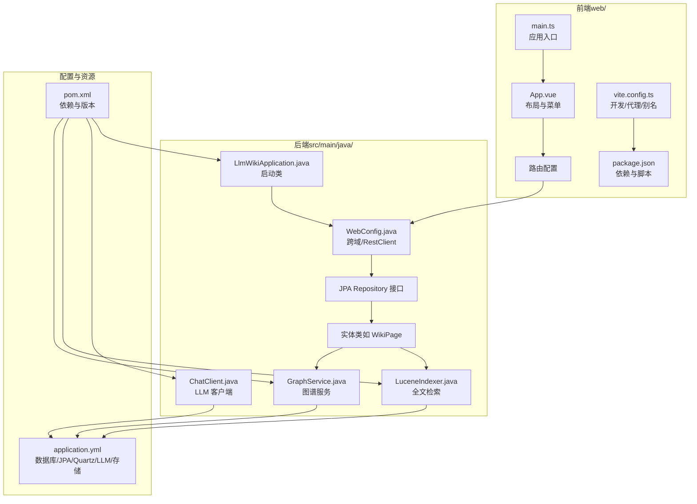
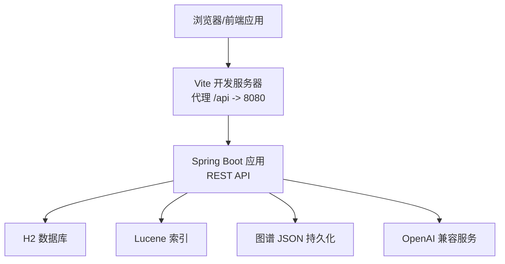
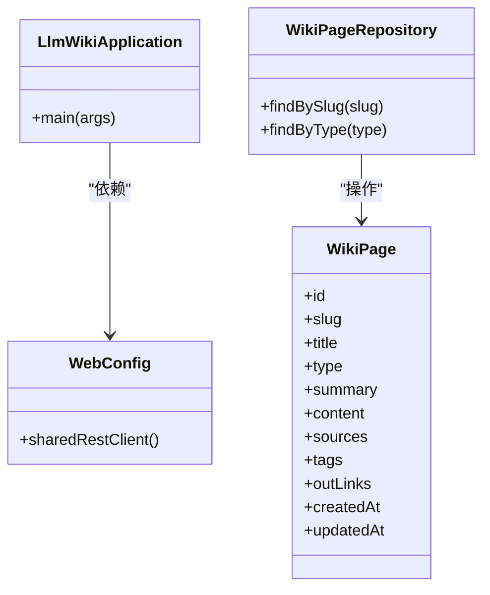
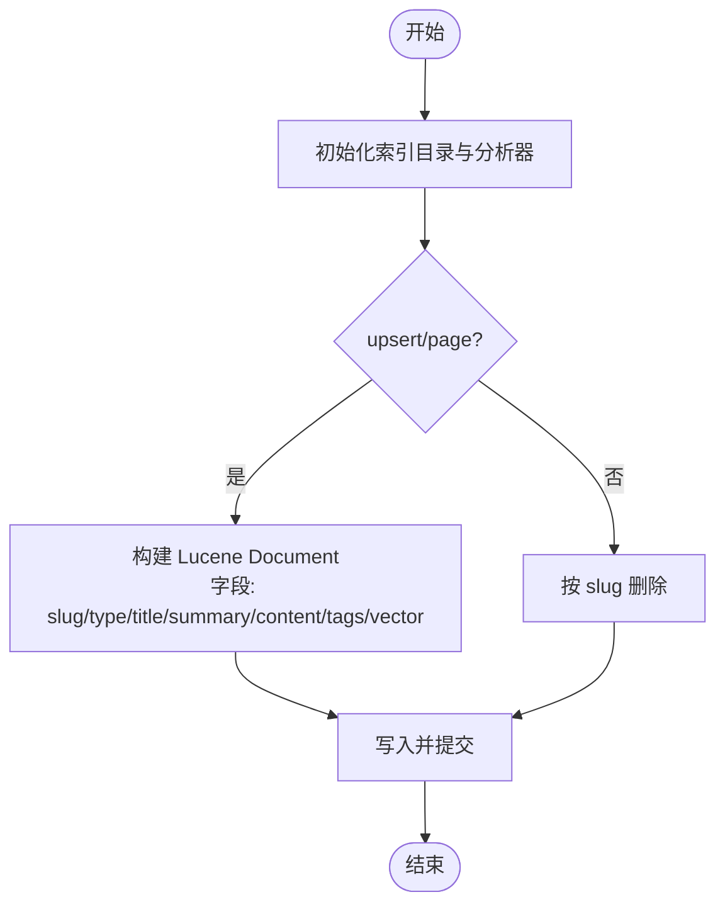
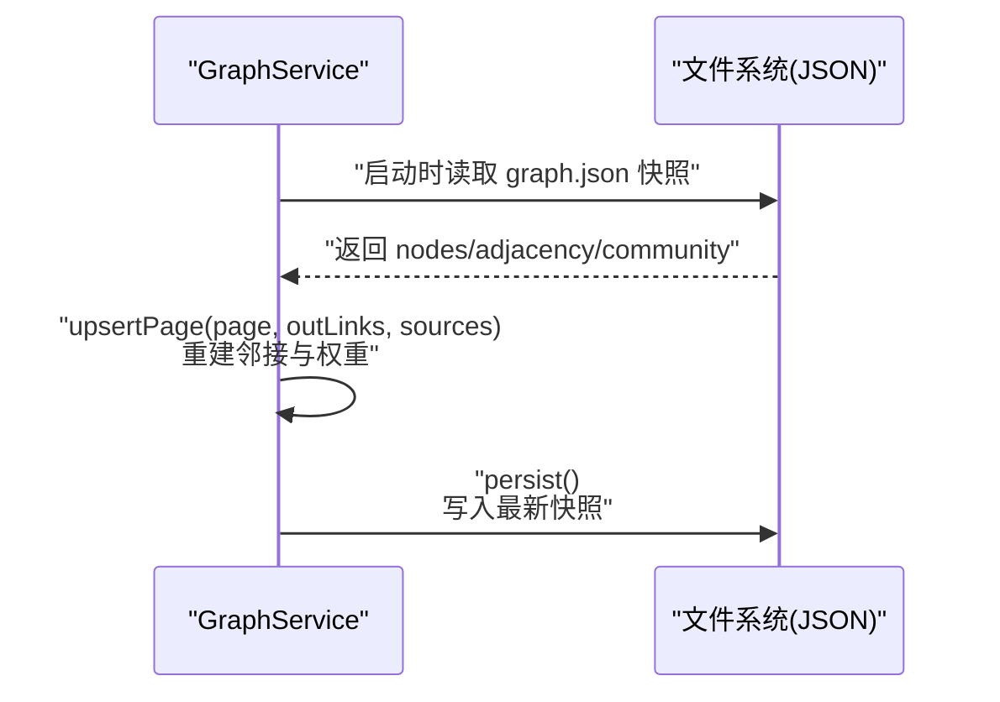
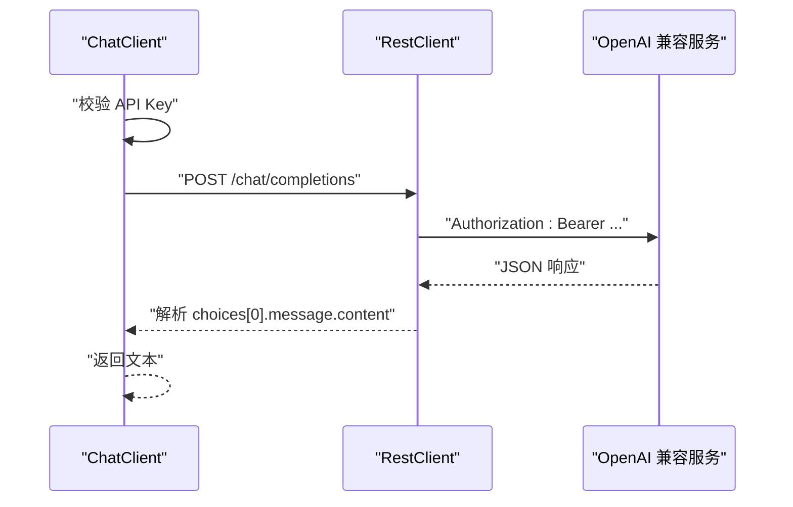
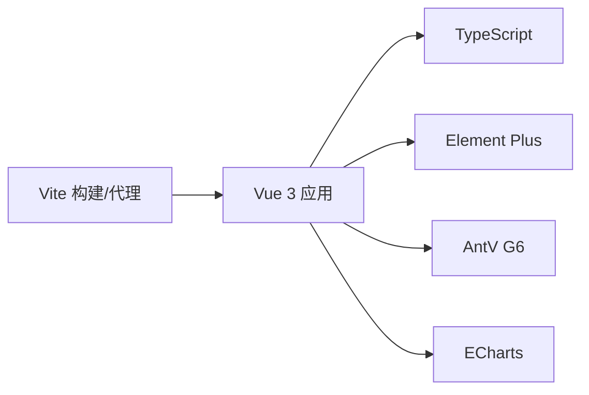
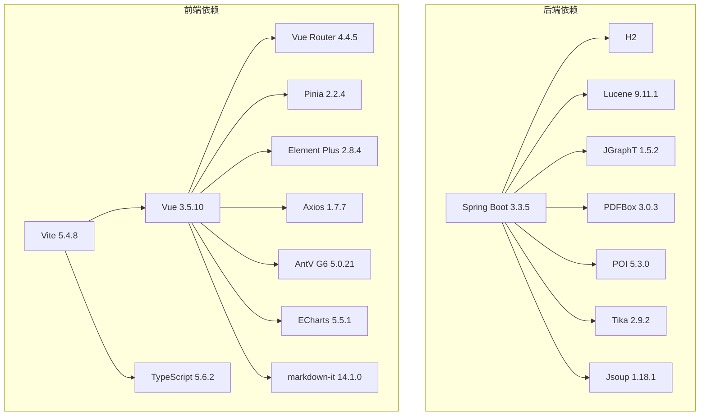

# 技术栈选型

<cite>
**本文引用的文件**
- [pom.xml](file://pom.xml)
- [application.yml](file://src/main/resources/application.yml)
- [LlmWikiApplication.java](file://src/main/java/com/example/llmwiki/LlmWikiApplication.java)
- [WebConfig.java](file://src/main/java/com/example/llmwiki/config/WebConfig.java)
- [LlmProperties.java](file://src/main/java/com/example/llmwiki/config/LlmProperties.java)
- [StorageProperties.java](file://src/main/java/com/example/llmwiki/config/StorageProperties.java)
- [IngestProperties.java](file://src/main/java/com/example/llmwiki/config/IngestProperties.java)
- [WikiPage.java](file://src/main/java/com/example/llmwiki/domain/WikiPage.java)
- [WikiPageRepository.java](file://src/main/java/com/example/llmwiki/repository/WikiPageRepository.java)
- [LuceneIndexer.java](file://src/main/java/com/example/llmwiki/retrieval/LuceneIndexer.java)
- [GraphService.java](file://src/main/java/com/example/llmwiki/graph/GraphService.java)
- [ChatClient.java](file://src/main/java/com/example/llmwiki/llm/ChatClient.java)
- [package.json](file://web/package.json)
- [vite.config.ts](file://web/vite.config.ts)
- [main.ts](file://web/src/main.ts)
- [App.vue](file://web/src/App.vue)
- [tsconfig.json](file://web/tsconfig.json)
</cite>

## 目录
1. [简介](#简介)
2. [项目结构](#项目结构)
3. [核心组件](#核心组件)
4. [架构总览](#架构总览)
5. [详细组件分析](#详细组件分析)
6. [依赖分析](#依赖分析)
7. [性能考虑](#性能考虑)
8. [故障排查指南](#故障排查指南)
9. [结论](#结论)
10. [附录](#附录)

## 简介
本文件面向 LLM Wiki 项目的“技术栈选型”目标，系统梳理并解释后端与前端技术栈选择、核心依赖库与第三方服务集成、版本兼容性与技术债务考量，并给出技术演进路线与替代方案对比建议。内容基于仓库中实际代码与配置进行归纳总结，确保可追溯与可落地。

## 项目结构
项目采用前后端分离架构：
- 后端：Spring Boot 3.x 应用，使用 JPA/Hibernate 进行数据访问，集成 H2 作为嵌入式数据库，提供 REST API。
- 前端：Vue 3 + TypeScript + Vite 工程，使用 Element Plus 提供 UI 组件，AntV G6/ECharts 用于可视化，Pinia/Vue Router 实现状态与路由管理。
- 核心能力：全文检索（Apache Lucene）、图算法（JGraphT）、LLM 对接（OpenAI API 兼容）、文件解析（PDFBox/Tika/POI/Jsoup）。

图表来源
- [LlmWikiApplication.java:1-29](file://src/main/java/com/example/llmwiki/LlmWikiApplication.java#L1-L29)
- [WebConfig.java:1-35](file://src/main/java/com/example/llmwiki/config/WebConfig.java#L1-L35)
- [WikiPage.java:1-72](file://src/main/java/com/example/llmwiki/domain/WikiPage.java#L1-L72)
- [LuceneIndexer.java:1-118](file://src/main/java/com/example/llmwiki/retrieval/LuceneIndexer.java#L1-L118)
- [GraphService.java:1-197](file://src/main/java/com/example/llmwiki/graph/GraphService.java#L1-L197)
- [ChatClient.java:1-108](file://src/main/java/com/example/llmwiki/llm/ChatClient.java#L1-L108)
- [application.yml:1-84](file://src/main/resources/application.yml#L1-L84)
- [pom.xml:1-171](file://pom.xml#L1-L171)
- [main.ts:1-14](file://web/src/main.ts#L1-L14)
- [App.vue:1-38](file://web/src/App.vue#L1-L38)
- [vite.config.ts:1-23](file://web/vite.config.ts#L1-L23)
- [package.json:1-31](file://web/package.json#L1-L31)

章节来源
- [pom.xml:1-171](file://pom.xml#L1-L171)
- [application.yml:1-84](file://src/main/resources/application.yml#L1-L84)
- [LlmWikiApplication.java:1-29](file://src/main/java/com/example/llmwiki/LlmWikiApplication.java#L1-L29)
- [WebConfig.java:1-35](file://src/main/java/com/example/llmwiki/config/WebConfig.java#L1-L35)
- [main.ts:1-14](file://web/src/main.ts#L1-L14)
- [App.vue:1-38](file://web/src/App.vue#L1-L38)
- [vite.config.ts:1-23](file://web/vite.config.ts#L1-L23)
- [package.json:1-31](file://web/package.json#L1-L31)

## 核心组件
- 后端框架与运行时
  - Spring Boot 3.x：提供自动配置、Starter 依赖与生产就绪特性。
  - Java 17+：获得更好的性能、安全性与长期支持。
- ORM 与数据库
  - JPA + Hibernate：声明式数据访问与实体映射，结合 H2 嵌入式数据库。
- 搜索与检索
  - Apache Lucene：全文检索与向量检索（KNN）能力，支撑 BM25 与语义相似度。
- 图算法与知识图谱
  - JGraphT：提供图算法基础能力；项目内实现内存图谱与持久化。
- LLM 能力
  - OpenAI API 兼容：统一 Chat/Embedding/Vision 客户端，支持多厂商适配。
- 文件解析与抓取
  - PDFBox、POI、Tika、Jsoup：覆盖多格式文档解析与网页抓取。
- 前端技术栈
  - Vue 3 + 组合式 API：组件化与响应式能力。
  - TypeScript：类型安全与工程化。
  - Vite：快速冷启、热更新与构建优化。
  - Element Plus：丰富的 UI 组件生态。
  - AntV G6/ECharts：知识图谱与统计图表可视化。

章节来源
- [pom.xml:29-35](file://pom.xml#L29-L35)
- [application.yml:11-30](file://src/main/resources/application.yml#L11-L30)
- [LlmProperties.java:1-63](file://src/main/java/com/example/llmwiki/config/LlmProperties.java#L1-L63)
- [ChatClient.java:1-108](file://src/main/java/com/example/llmwiki/llm/ChatClient.java#L1-L108)
- [LuceneIndexer.java:1-118](file://src/main/java/com/example/llmwiki/retrieval/LuceneIndexer.java#L1-L118)
- [GraphService.java:1-197](file://src/main/java/com/example/llmwiki/graph/GraphService.java#L1-L197)
- [package.json:1-31](file://web/package.json#L1-L31)
- [vite.config.ts:1-23](file://web/vite.config.ts#L1-L23)
- [main.ts:1-14](file://web/src/main.ts#L1-L14)

## 架构总览
下图展示后端与前端在运行时的关键交互：前端通过 Vite 开发服务器代理请求到后端 Spring Boot；后端使用 H2 存储实体数据，使用 Lucene 构建全文/向量索引，使用 JGraphT 进行图计算并持久化为 JSON；LLM 客户端对接 OpenAI 兼容服务。

图表来源
- [vite.config.ts:13-21](file://web/vite.config.ts#L13-L21)
- [application.yml:11-30](file://src/main/resources/application.yml#L11-L30)
- [LuceneIndexer.java:48-73](file://src/main/java/com/example/llmwiki/retrieval/LuceneIndexer.java#L48-L73)
- [GraphService.java:106-118](file://src/main/java/com/example/llmwiki/graph/GraphService.java#L106-L118)
- [ChatClient.java:66-86](file://src/main/java/com/example/llmwiki/llm/ChatClient.java#L66-L86)

## 详细组件分析

### 后端技术栈与现代化特性
- Spring Boot 3.x
  - 自动配置与 Starter：简化 Web、JPA、Validation、Quartz 等模块接入。
  - 异步与调度：启用异步与任务调度，支撑后台摄取与定时任务。
- Java 17+
  - 性能与稳定性：获得长期支持与持续性能改进。
- JPA/Hibernate
  - 实体与仓库：通过注解定义实体与查询方法，降低样板代码。
  - JPA 配置：H2 方言、DDL 自动更新、open-in-view 关闭等策略。
- Web 层
  - 跨域配置：开放 CORS，便于前端本地开发。
  - 共享 RestClient：减少重复客户端实例，统一网络层。

图表来源
- [LlmWikiApplication.java:19-26](file://src/main/java/com/example/llmwiki/LlmWikiApplication.java#L19-L26)
- [WebConfig.java:30-33](file://src/main/java/com/example/llmwiki/config/WebConfig.java#L30-L33)
- [WikiPage.java:23-71](file://src/main/java/com/example/llmwiki/domain/WikiPage.java#L23-L71)
- [WikiPageRepository.java:13-18](file://src/main/java/com/example/llmwiki/repository/WikiPageRepository.java#L13-L18)

章节来源
- [LlmWikiApplication.java:1-29](file://src/main/java/com/example/llmwiki/LlmWikiApplication.java#L1-L29)
- [WebConfig.java:1-35](file://src/main/java/com/example/llmwiki/config/WebConfig.java#L1-L35)
- [WikiPage.java:1-72](file://src/main/java/com/example/llmwiki/domain/WikiPage.java#L1-L72)
- [WikiPageRepository.java:1-18](file://src/main/java/com/example/llmwiki/repository/WikiPageRepository.java#L1-L18)
- [application.yml:20-28](file://src/main/resources/application.yml#L20-L28)

### 全文检索与向量检索（Apache Lucene）
- 能力概述
  - 支持中文分词与多语言分析器，构建 BM25 全文检索。
  - 使用 KNN 向量字段与余弦相似度，实现向量检索。
- 关键点
  - 索引目录由存储配置决定，启动时自动创建或追加。
  - upsert/delete 提供幂等更新与删除，commit 保证一致性。
  - 向量维度与 LLM 配置保持一致，不一致时进行长度对齐。

图表来源
- [LuceneIndexer.java:48-73](file://src/main/java/com/example/llmwiki/retrieval/LuceneIndexer.java#L48-L73)
- [LuceneIndexer.java:78-99](file://src/main/java/com/example/llmwiki/retrieval/LuceneIndexer.java#L78-L99)
- [LuceneIndexer.java:101-104](file://src/main/java/com/example/llmwiki/retrieval/LuceneIndexer.java#L101-L104)
- [LlmProperties.java:45-52](file://src/main/java/com/example/llmwiki/config/LlmProperties.java#L45-L52)

章节来源
- [LuceneIndexer.java:1-118](file://src/main/java/com/example/llmwiki/retrieval/LuceneIndexer.java#L1-L118)
- [LlmProperties.java:1-63](file://src/main/java/com/example/llmwiki/config/LlmProperties.java#L1-L63)
- [StorageProperties.java:1-29](file://src/main/java/com/example/llmwiki/config/StorageProperties.java#L1-L29)

### 图算法与知识图谱（JGraphT + 内存图谱）
- 能力概述
  - 内存图谱：节点、邻接表、社区划分，支持桥节点检测与孤立节点识别。
  - JSON 持久化：启动时加载快照，运行时更新，退出时保存。
- 关键点
  - 边权重：直链权重固定，来源重叠权重按交集数量计算。
  - 社区划分：外部算法结果注入，支持跨社区桥节点识别。

图表来源
- [GraphService.java:49-69](file://src/main/java/com/example/llmwiki/graph/GraphService.java#L49-L69)
- [GraphService.java:71-104](file://src/main/java/com/example/llmwiki/graph/GraphService.java#L71-L104)
- [GraphService.java:106-118](file://src/main/java/com/example/llmwiki/graph/GraphService.java#L106-L118)

章节来源
- [GraphService.java:1-197](file://src/main/java/com/example/llmwiki/graph/GraphService.java#L1-L197)
- [StorageProperties.java:1-29](file://src/main/java/com/example/llmwiki/config/StorageProperties.java#L1-L29)

### LLM 能力与 OpenAI 兼容集成
- 能力概述
  - Chat 客户端：统一 OpenAI 兼容协议，支持多厂商适配。
  - 配置驱动：通过配置文件设置 base-url、api-key、model、temperature、超时等。
- 关键点
  - 错误处理：空返回、鉴权缺失、网络异常均有明确异常抛出。
  - ping 探活：最小化提示验证连通性。

图表来源
- [ChatClient.java:50-86](file://src/main/java/com/example/llmwiki/llm/ChatClient.java#L50-L86)
- [LlmProperties.java:30-42](file://src/main/java/com/example/llmwiki/config/LlmProperties.java#L30-L42)
- [WebConfig.java:30-33](file://src/main/java/com/example/llmwiki/config/WebConfig.java#L30-L33)

章节来源
- [ChatClient.java:1-108](file://src/main/java/com/example/llmwiki/llm/ChatClient.java#L1-L108)
- [LlmProperties.java:1-63](file://src/main/java/com/example/llmwiki/config/LlmProperties.java#L1-L63)
- [application.yml:39-57](file://src/main/resources/application.yml#L39-L57)

### 前端技术栈与构建优化
- Vue 3 + 组合式 API：组件化与响应式能力，提升开发体验。
- TypeScript：类型安全与工程化，配合严格模式配置。
- Vite：快速冷启动、热更新与构建优化，代理配置指向后端。
- Element Plus：提供丰富 UI 组件，统一主题样式。
- 可视化：AntV G6（知识图谱）、ECharts（统计图表）。

图表来源
- [main.ts:1-14](file://web/src/main.ts#L1-L14)
- [App.vue:1-38](file://web/src/App.vue#L1-L38)
- [package.json:12-21](file://web/package.json#L12-L21)
- [vite.config.ts:13-21](file://web/vite.config.ts#L13-L21)
- [tsconfig.json:2-18](file://web/tsconfig.json#L2-L18)

章节来源
- [main.ts:1-14](file://web/src/main.ts#L1-L14)
- [App.vue:1-38](file://web/src/App.vue#L1-L38)
- [package.json:1-31](file://web/package.json#L1-L31)
- [vite.config.ts:1-23](file://web/vite.config.ts#L1-L23)
- [tsconfig.json:1-21](file://web/tsconfig.json#L1-L21)

## 依赖分析
- 后端核心依赖
  - Spring Boot：Web、JPA、Validation、Quartz。
  - 数据库：H2（运行时）。
  - 搜索：Lucene 核心、查询解析、中文分析、智能中文分词。
  - 图算法：JGraphT。
  - 文件解析：PDFBox、POI、Tika、Jsoup。
  - YAML/CSV：Jackson Dataformat。
  - Lombok：减少样板代码。
- 前端核心依赖
  - Vue 3、Vue Router、Pinia。
  - Element Plus、Axios。
  - AntV G6、ECharts、markdown-it。
  - Vite、TypeScript、自动导入与组件解析插件。

图表来源
- [pom.xml:36-159](file://pom.xml#L36-L159)
- [package.json:12-29](file://web/package.json#L12-L29)

章节来源
- [pom.xml:1-171](file://pom.xml#L1-L171)
- [package.json:1-31](file://web/package.json#L1-L31)

## 性能考虑
- 后端
  - Java 17+：获得更好的 JIT 编译与 GC 表现。
  - Lucene：批量写入与 commit 控制、向量维度与相似度函数选择影响检索性能。
  - H2：嵌入式数据库适合单机与演示场景，生产环境建议迁移到 PostgreSQL/MySQL。
  - Quartz：内存 JobStore 适合轻量场景，生产建议使用 JDBC Store。
- 前端
  - Vite：快速冷启动与按需打包，开发体验与构建速度优秀。
  - Element Plus：按需引入与 Tree Shaking 可进一步优化包体积。
  - 图表库：按需加载与懒加载策略，避免首屏阻塞。

## 故障排查指南
- LLM 调用失败
  - 检查 API Key 是否配置、URL 是否正确、网络连通性。
  - 观察日志输出，定位空响应或异常堆栈。
- Lucene 索引异常
  - 确认索引目录可写、权限正常、未被其他进程占用。
  - 发生异常时查看关闭流程日志，避免未提交导致的数据丢失。
- 图谱持久化失败
  - 检查存储目录权限与磁盘空间，确认 JSON 写入异常。
- 前端代理无效
  - 确认 Vite 代理配置与后端端口一致，浏览器控制台检查跨域与 404。

章节来源
- [ChatClient.java:50-86](file://src/main/java/com/example/llmwiki/llm/ChatClient.java#L50-L86)
- [LuceneIndexer.java:61-73](file://src/main/java/com/example/llmwiki/retrieval/LuceneIndexer.java#L61-L73)
- [GraphService.java:106-118](file://src/main/java/com/example/llmwiki/graph/GraphService.java#L106-L118)
- [vite.config.ts:13-21](file://web/vite.config.ts#L13-L21)

## 结论
本项目在技术栈选择上体现了“现代、实用、可扩展”的原则：后端以 Spring Boot 3.x 与 Java 17+ 为基础，结合 JPA/Hibernate、H2、Lucene、JGraphT 与 OpenAI 兼容 LLM，形成从数据到检索再到图谱与 AI 的完整闭环；前端以 Vue 3 + TypeScript + Vite 为核心，搭配 Element Plus 与可视化库，提供良好的开发体验与交互效果。当前版本满足个人知识库的自举与增量维护需求，后续可在数据库、调度与 LLM 供应商方面按需演进。

## 附录

### 版本兼容性矩阵
- Spring Boot 3.3.5
  - Java 17+
  - JPA/Hibernate（H2Dialect）
- Apache Lucene 9.11.1
  - 与 Spring Data JPA 解析器解耦，独立使用
- JGraphT 1.5.2
  - 纯 Java 图算法库，无额外运行时要求
- OpenAI 兼容服务
  - Chat/Embedding/Vision 接口统一，支持多厂商
- 前端
  - Vue 3.5.10 + TypeScript 5.6.2 + Vite 5.4.8

章节来源
- [pom.xml:7-8](file://pom.xml#L7-L8)
- [pom.xml:29-35](file://pom.xml#L29-L35)
- [application.yml:11-28](file://src/main/resources/application.yml#L11-L28)
- [package.json:12-29](file://web/package.json#L12-L29)

### 技术债务考量
- 数据库
  - H2 为嵌入式，适合演示与单机，生产建议迁移至关系型数据库。
- 调度
  - Quartz 内存 JobStore 仅适合轻量场景，建议迁移到 JDBC Store 或使用云调度服务。
- 搜索
  - Lucene 与向量检索已满足需求，若需要分布式检索可考虑 Elasticsearch/OpenSearch。
- 图算法
  - 当前为内存图谱，建议引入图数据库（如 Neo4j）以支持更大规模与高可用。

### 技术演进路线图与替代方案对比
- 后端
  - 数据库：H2 → PostgreSQL/MySQL（事务、备份、扩展性）
  - 调度：Quartz 内存 → Quartz JDBC Store/云调度（可靠性、弹性）
  - 搜索：Lucene → Elasticsearch（分布式、近实时、运维复杂度上升）
- 前端
  - UI：Element Plus → Naive UI/Arco Design（风格差异、生态差异）
  - 构建：Vite → Webpack（成熟生态但启动较慢）
  - 状态：Pinia → Redux Toolkit（复杂度与团队偏好）