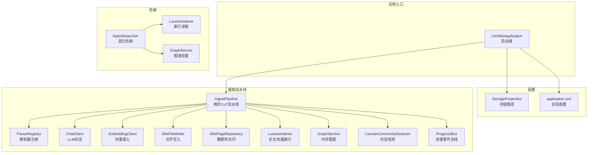
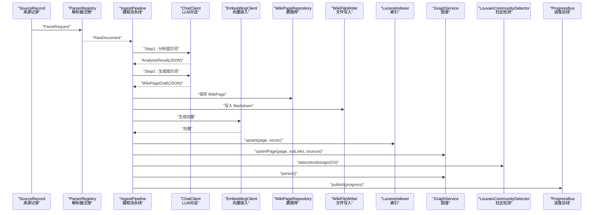
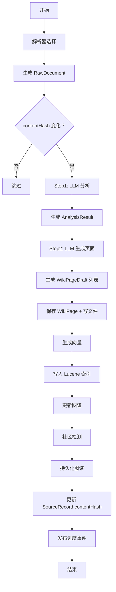
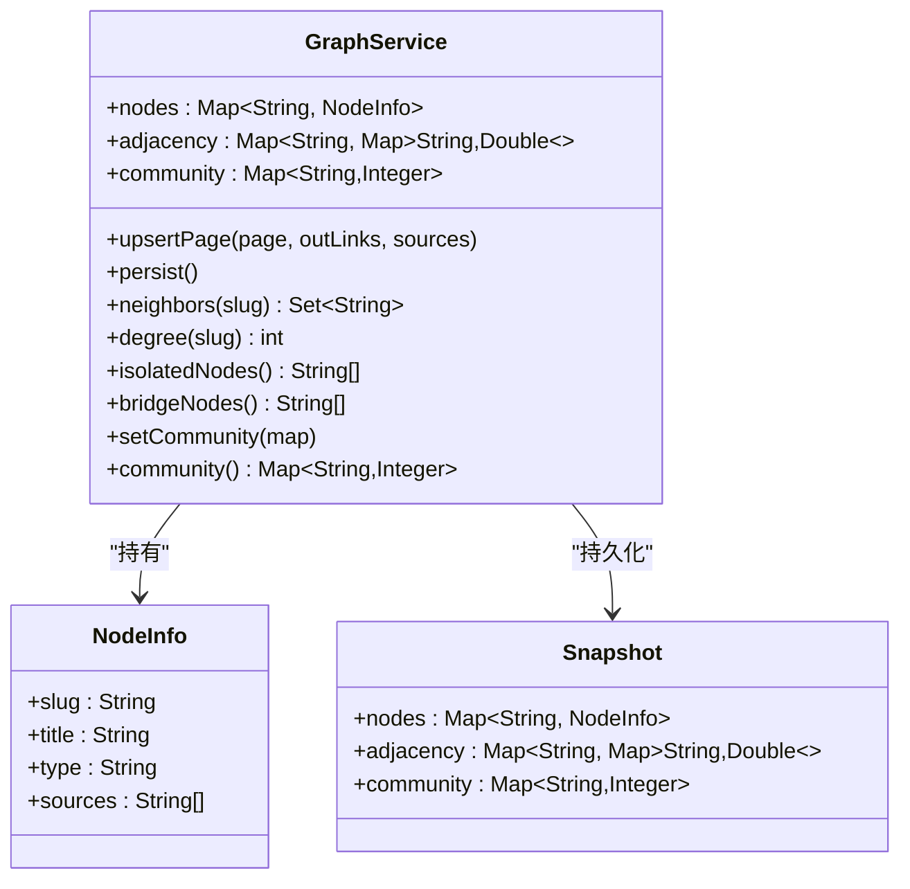
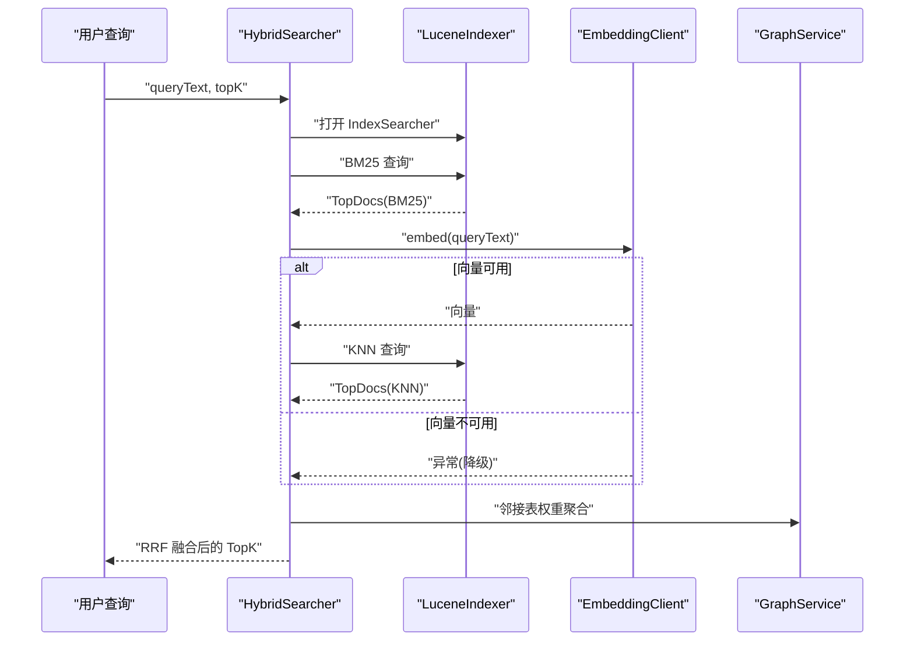
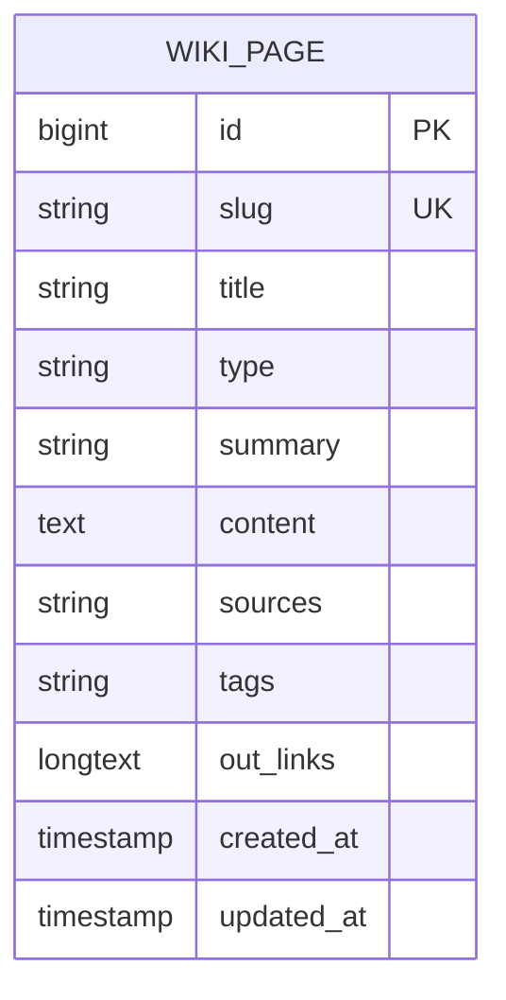
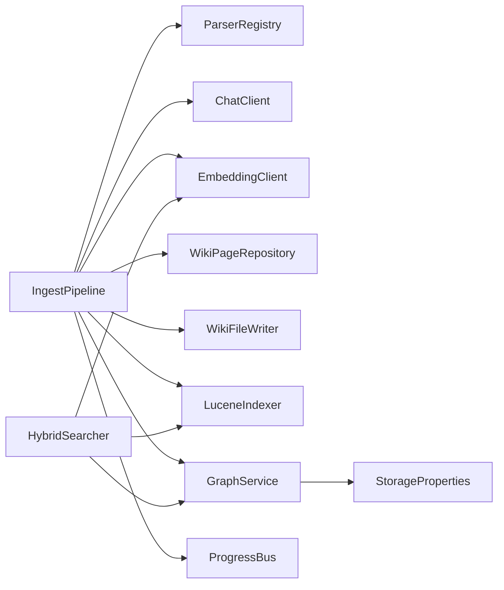

# 数据流设计

<cite>
**本文引用的文件**
- [LlmWikiApplication.java](file://src/main/java/com/example/llmwiki/LlmWikiApplication.java)
- [IngestPipeline.java](file://src/main/java/com/example/llmwiki/ingest/IngestPipeline.java)
- [ParserRegistry.java](file://src/main/java/com/example/llmwiki/parser/ParserRegistry.java)
- [ChatClient.java](file://src/main/java/com/example/llmwiki/llm/ChatClient.java)
- [EmbeddingClient.java](file://src/main/java/com/example/llmwiki/llm/EmbeddingClient.java)
- [RawDocument.java](file://src/main/java/com/example/llmwiki/domain/RawDocument.java)
- [AnalysisResult.java](file://src/main/java/com/example/llmwiki/domain/AnalysisResult.java)
- [WikiPageDraft.java](file://src/main/java/com/example/llmwiki/domain/WikiPageDraft.java)
- [WikiPage.java](file://src/main/java/com/example/llmwiki/domain/WikiPage.java)
- [WikiPageRepository.java](file://src/main/java/com/example/llmwiki/repository/WikiPageRepository.java)
- [WikiFileWriter.java](file://src/main/java/com/example/llmwiki/ingest/WikiFileWriter.java)
- [LuceneIndexer.java](file://src/main/java/com/example/llmwiki/retrieval/LuceneIndexer.java)
- [HybridSearcher.java](file://src/main/java/com/example/llmwiki/retrieval/HybridSearcher.java)
- [GraphService.java](file://src/main/java/com/example/llmwiki/graph/GraphService.java)
- [LouvainCommunityDetector.java](file://src/main/java/com/example/llmwiki/graph/LouvainCommunityDetector.java)
- [ProgressBus.java](file://src/main/java/com/example/llmwiki/progress/ProgressBus.java)
- [StorageProperties.java](file://src/main/java/com/example/llmwiki/config/StorageProperties.java)
- [application.yml](file://src/main/resources/application.yml)
</cite>

## 目录
1. [简介](#简介)
2. [项目结构](#项目结构)
3. [核心组件](#核心组件)
4. [架构总览](#架构总览)
5. [详细组件分析](#详细组件分析)
6. [依赖分析](#依赖分析)
7. [性能考虑](#性能考虑)
8. [故障排查指南](#故障排查指南)
9. [结论](#结论)
10. [附录](#附录)

## 简介
本文件面向 LLM Wiki 的数据流设计，围绕三大核心数据流路径进行系统化梳理：
- 文档摄取流水线：从原始文档到结构化数据再到最终存储的完整链路
- 知识图谱构建：节点关系建立与社区检测的动态过程
- 搜索检索：查询处理流程与 BM25/KNN 向量融合检索

文档还涵盖数据格式标准化、缓存策略、一致性保障与并发控制，并通过多种图示展示数据在系统中的动态变化。

## 项目结构
后端采用 Spring Boot 结构，按功能域分层组织：
- api：对外接口控制器
- ingest：文档摄取流水线
- parser：多源解析器注册与实现
- llm：大模型客户端封装
- retrieval：检索模块（Lucene + 向量）
- graph：知识图谱服务与社区检测
- repository：JPA 数据访问层
- progress：进度事件总线（SSE）
- config：配置类（存储路径、LLM 参数等）

图表来源
- [LlmWikiApplication.java:19-26](file://src/main/java/com/example/llmwiki/LlmWikiApplication.java#L19-L26)
- [StorageProperties.java:15-28](file://src/main/java/com/example/llmwiki/config/StorageProperties.java#L15-L28)
- [application.yml:31-84](file://src/main/resources/application.yml#L31-L84)
- [IngestPipeline.java:48-109](file://src/main/java/com/example/llmwiki/ingest/IngestPipeline.java#L48-L109)
- [ParserRegistry.java:27-35](file://src/main/java/com/example/llmwiki/parser/ParserRegistry.java#L27-L35)
- [ChatClient.java:50-86](file://src/main/java/com/example/llmwiki/llm/ChatClient.java#L50-L86)
- [EmbeddingClient.java](file://src/main/java/com/example/llmwiki/llm/EmbeddingClient.java)
- [WikiPageRepository.java:13-18](file://src/main/java/com/example/llmwiki/repository/WikiPageRepository.java#L13-L18)
- [WikiFileWriter.java](file://src/main/java/com/example/llmwiki/ingest/WikiFileWriter.java)
- [LuceneIndexer.java:78-99](file://src/main/java/com/example/llmwiki/retrieval/LuceneIndexer.java#L78-L99)
- [GraphService.java:71-118](file://src/main/java/com/example/llmwiki/graph/GraphService.java#L71-L118)
- [LouvainCommunityDetector.java](file://src/main/java/com/example/llmwiki/graph/LouvainCommunityDetector.java)
- [ProgressBus.java:43-55](file://src/main/java/com/example/llmwiki/progress/ProgressBus.java#L43-L55)
- [HybridSearcher.java:42-111](file://src/main/java/com/example/llmwiki/retrieval/HybridSearcher.java#L42-L111)

章节来源
- [LlmWikiApplication.java:19-26](file://src/main/java/com/example/llmwiki/LlmWikiApplication.java#L19-L26)
- [application.yml:31-84](file://src/main/resources/application.yml#L31-L84)

## 核心组件
- 摄取流水线（两步式 CoT）：解析 → 分析 → 生成 → 落库/索引/图谱
- 解析器注册：按请求类型选择首个支持的解析器
- LLM 客户端：统一的 Chat Completions 调用封装
- 向量客户端：统一的 Embedding 调用封装
- Wiki 页面模型：结构化存储与 Markdown 文件输出
- 索引器：Lucene 全文与向量双模索引
- 图谱服务：内存邻接表 + JSON 持久化
- 混合检索器：BM25 + KNN 向量 + RRF 融合
- 进度总线：SSE 实时广播摄取进度

章节来源
- [IngestPipeline.java:33-44](file://src/main/java/com/example/llmwiki/ingest/IngestPipeline.java#L33-L44)
- [ParserRegistry.java:27-35](file://src/main/java/com/example/llmwiki/parser/ParserRegistry.java#L27-L35)
- [ChatClient.java:37-86](file://src/main/java/com/example/llmwiki/llm/ChatClient.java#L37-L86)
- [EmbeddingClient.java](file://src/main/java/com/example/llmwiki/llm/EmbeddingClient.java)
- [WikiPage.java:29-71](file://src/main/java/com/example/llmwiki/domain/WikiPage.java#L29-L71)
- [LuceneIndexer.java:78-108](file://src/main/java/com/example/llmwiki/retrieval/LuceneIndexer.java#L78-L108)
- [GraphService.java:71-118](file://src/main/java/com/example/llmwiki/graph/GraphService.java#L71-L118)
- [HybridSearcher.java:42-111](file://src/main/java/com/example/llmwiki/retrieval/HybridSearcher.java#L42-L111)
- [ProgressBus.java:43-55](file://src/main/java/com/example/llmwiki/progress/ProgressBus.java#L43-L55)

## 架构总览
下图展示从“原始文档”到“知识图谱”的全链路数据流，包括解析、LLM 分析与生成、落库与索引、图谱更新与社区检测。

图表来源
- [IngestPipeline.java:65-109](file://src/main/java/com/example/llmwiki/ingest/IngestPipeline.java#L65-L109)
- [ParserRegistry.java:27-35](file://src/main/java/com/example/llmwiki/parser/ParserRegistry.java#L27-L35)
- [ChatClient.java:50-86](file://src/main/java/com/example/llmwiki/llm/ChatClient.java#L50-L86)
- [EmbeddingClient.java](file://src/main/java/com/example/llmwiki/llm/EmbeddingClient.java)
- [WikiPageRepository.java:13-18](file://src/main/java/com/example/llmwiki/repository/WikiPageRepository.java#L13-L18)
- [WikiFileWriter.java](file://src/main/java/com/example/llmwiki/ingest/WikiFileWriter.java)
- [LuceneIndexer.java:78-99](file://src/main/java/com/example/llmwiki/retrieval/LuceneIndexer.java#L78-L99)
- [GraphService.java:71-118](file://src/main/java/com/example/llmwiki/graph/GraphService.java#L71-L118)
- [LouvainCommunityDetector.java](file://src/main/java/com/example/llmwiki/graph/LouvainCommunityDetector.java)
- [ProgressBus.java:43-55](file://src/main/java/com/example/llmwiki/progress/ProgressBus.java#L43-L55)

## 详细组件分析

### 文档摄取流水线（两步式 CoT）
- 输入：SourceRecord + 字节流 + MIME
- 流程：
  - 解析阶段：根据来源类型选择解析器，产出 RawDocument
  - 增量缓存：比较 contentHash，相同则跳过
  - 分析阶段：LLM 输出 AnalysisResult（实体、概念、连接、矛盾、推荐结构）
  - 生成阶段：基于 AnalysisResult 与原文生成 WikiPageDraft 列表
  - 落库阶段：合并更新 WikiPage，写入 Markdown 文件
  - 索引阶段：同步生成向量并写入 Lucene
  - 图谱阶段：更新节点与边，执行社区检测，持久化图谱
  - 进度广播：发布阶段性事件
- 关键数据模型：RawDocument、AnalysisResult、WikiPageDraft、WikiPage

图表来源
- [IngestPipeline.java:65-109](file://src/main/java/com/example/llmwiki/ingest/IngestPipeline.java#L65-L109)
- [IngestPipeline.java:111-177](file://src/main/java/com/example/llmwiki/ingest/IngestPipeline.java#L111-L177)
- [IngestPipeline.java:179-209](file://src/main/java/com/example/llmwiki/ingest/IngestPipeline.java#L179-L209)
- [IngestPipeline.java:245-249](file://src/main/java/com/example/llmwiki/ingest/IngestPipeline.java#L245-L249)

章节来源
- [IngestPipeline.java:33-44](file://src/main/java/com/example/llmwiki/ingest/IngestPipeline.java#L33-L44)
- [RawDocument.java:20-51](file://src/main/java/com/example/llmwiki/domain/RawDocument.java#L20-L51)
- [AnalysisResult.java:21-55](file://src/main/java/com/example/llmwiki/domain/AnalysisResult.java#L21-L55)
- [WikiPageDraft.java:21-49](file://src/main/java/com/example/llmwiki/domain/WikiPageDraft.java#L21-L49)
- [WikiPage.java:29-71](file://src/main/java/com/example/llmwiki/domain/WikiPage.java#L29-L71)

### 知识图谱构建（节点关系与社区检测）
- 内存图谱：ConcurrentHashMap 维护节点信息、邻接表、社区映射
- 节点更新：基于 outLinks 重建出边，基于 sources 计算跨源重叠权重
- 边权规则：直接链接权重固定，跨源重叠权重随重叠数量增长
- 社区检测：Louvain 算法，检测后写回社区映射
- 持久化：JSON 文件快照，重启恢复

图表来源
- [GraphService.java:37-197](file://src/main/java/com/example/llmwiki/graph/GraphService.java#L37-L197)

章节来源
- [GraphService.java:71-118](file://src/main/java/com/example/llmwiki/graph/GraphService.java#L71-L118)
- [GraphService.java:144-167](file://src/main/java/com/example/llmwiki/graph/GraphService.java#L144-L167)
- [GraphService.java:169-176](file://src/main/java/com/example/llmwiki/graph/GraphService.java#L169-L176)

### 搜索检索（BM25 + 向量 + 图谱增强）
- 查询处理：先 BM25，再 KNN（若可用），最后使用 RRF 融合
- 图谱增强：对命中节点的邻居按边权加成，提升跨节点关联度高条目的分数
- 返回结构：包含 slug、title、type、summary、source、score

图表来源
- [HybridSearcher.java:42-111](file://src/main/java/com/example/llmwiki/retrieval/HybridSearcher.java#L42-L111)
- [LuceneIndexer.java:106-108](file://src/main/java/com/example/llmwiki/retrieval/LuceneIndexer.java#L106-L108)
- [EmbeddingClient.java](file://src/main/java/com/example/llmwiki/llm/EmbeddingClient.java)
- [GraphService.java:136-142](file://src/main/java/com/example/llmwiki/graph/GraphService.java#L136-L142)

章节来源
- [HybridSearcher.java:42-111](file://src/main/java/com/example/llmwiki/retrieval/HybridSearcher.java#L42-L111)

### 数据模型与序列化
- RawDocument：标准化的原始文档 DTO，统一解析器输出
- AnalysisResult：Step1/Step2 间传递的结构化分析结果
- WikiPageDraft：Step2 生成的页面草稿
- WikiPage：持久化实体，含 slug、title、type、summary、content、sources、tags、outLinks、时间戳
- JSON 序列化：Jackson ObjectMapper 用于 LLM 输出清洗与对象映射

图表来源
- [WikiPage.java:29-71](file://src/main/java/com/example/llmwiki/domain/WikiPage.java#L29-L71)

章节来源
- [RawDocument.java:20-51](file://src/main/java/com/example/llmwiki/domain/RawDocument.java#L20-L51)
- [AnalysisResult.java:21-55](file://src/main/java/com/example/llmwiki/domain/AnalysisResult.java#L21-L55)
- [WikiPageDraft.java:21-49](file://src/main/java/com/example/llmwiki/domain/WikiPageDraft.java#L21-L49)
- [WikiPage.java:29-71](file://src/main/java/com/example/llmwiki/domain/WikiPage.java#L29-L71)

### 缓存策略
- 增量缓存：基于 contentHash 的内容去重，避免重复处理
- 内存缓存：GraphService 使用 ConcurrentHashMap 存储节点、邻接表与社区映射
- 文件缓存：图谱 JSON 快照持久化，应用启动时加载

章节来源
- [IngestPipeline.java:76-80](file://src/main/java/com/example/llmwiki/ingest/IngestPipeline.java#L76-L80)
- [GraphService.java:43-47](file://src/main/java/com/example/llmwiki/graph/GraphService.java#L43-L47)
- [GraphService.java:50-68](file://src/main/java/com/example/llmwiki/graph/GraphService.java#L50-L68)

### 数据一致性与并发控制
- 事务管理：JPA Repository 默认在单请求内保证操作一致性
- 并发控制：
  - 摄取流水线与索引写入：使用 synchronized 方法确保同一时间只有一条文档写入
  - 图谱更新：使用 synchronized 方法保护 upsertPage/persist
  - 进度总线：使用 CopyOnWriteArrayList 与并发队列保证事件广播线程安全
- 重启恢复：图谱 JSON 快照，避免丢失

章节来源
- [LuceneIndexer.java:78-99](file://src/main/java/com/example/llmwiki/retrieval/LuceneIndexer.java#L78-L99)
- [GraphService.java:71-118](file://src/main/java/com/example/llmwiki/graph/GraphService.java#L71-L118)
- [ProgressBus.java:21-60](file://src/main/java/com/example/llmwiki/progress/ProgressBus.java#L21-L60)

## 依赖分析
- 组件耦合：
  - IngestPipeline 依赖解析器、LLM、向量、仓库、索引、图谱、进度总线
  - HybridSearcher 依赖索引读取器、向量客户端、图谱服务
  - GraphService 依赖存储配置与 Jackson
- 外部依赖：
  - Spring Boot（Web、Data JPA、Quartz）
  - Apache Lucene（全文检索与向量检索）
  - Rest 客户端（调用 LLM API）

图表来源
- [IngestPipeline.java:52-62](file://src/main/java/com/example/llmwiki/ingest/IngestPipeline.java#L52-L62)
- [HybridSearcher.java:38-40](file://src/main/java/com/example/llmwiki/retrieval/HybridSearcher.java#L38-L40)
- [GraphService.java:39-40](file://src/main/java/com/example/llmwiki/graph/GraphService.java#L39-L40)

章节来源
- [IngestPipeline.java:52-62](file://src/main/java/com/example/llmwiki/ingest/IngestPipeline.java#L52-L62)
- [HybridSearcher.java:38-40](file://src/main/java/com/example/llmwiki/retrieval/HybridSearcher.java#L38-L40)
- [GraphService.java:39-40](file://src/main/java/com/example/llmwiki/graph/GraphService.java#L39-L40)

## 性能考虑
- 向量维度与对齐：索引写入前对齐维度，避免不一致导致检索失败
- RRF 融合参数：K 值影响融合效果，需结合业务调优
- 索引提交：每次 upsert 提交一次，兼顾一致性与吞吐
- 图谱邻接表：使用并发容器，减少锁粒度；批量更新时注意同步块范围
- LLM 调用：统一超时与错误处理，必要时引入重试与熔断

## 故障排查指南
- LLM 未配置或返回为空：检查 Chat API Key 与模型配置
- 向量不可用：EmbeddingClient 异常时回退为 BM25
- 解析器未匹配：确认 ParseRequest.kind 与解析器支持集合
- 图谱持久化失败：检查存储目录权限与磁盘空间
- 进度事件丢失：确认 SSE 连接状态与最近事件队列大小

章节来源
- [ChatClient.java:52-85](file://src/main/java/com/example/llmwiki/llm/ChatClient.java#L52-L85)
- [HybridSearcher.java:82-86](file://src/main/java/com/example/llmwiki/retrieval/HybridSearcher.java#L82-L86)
- [ParserRegistry.java:34](file://src/main/java/com/example/llmwiki/parser/ParserRegistry.java#L34)
- [GraphService.java:106-118](file://src/main/java/com/example/llmwiki/graph/GraphService.java#L106-L118)
- [ProgressBus.java:26-41](file://src/main/java/com/example/llmwiki/progress/ProgressBus.java#L26-L41)

## 结论
本设计以“标准化数据模型 + 统一序列化 + 分层职责 + 明确一致性边界”为核心，实现了从多源异构文档到结构化 Wiki、向量索引与知识图谱的闭环数据流。通过增量缓存、并发安全与 SSE 进度广播，系统在可扩展性与可观测性方面具备良好基础。

## 附录
- 配置要点：存储根目录、索引/图谱/Markdown 输出路径、LLM 与嵌入模型参数
- 状态转换：摄取任务的阶段推进（PARSE → ANALYZE → GENERATE → INDEX → GRAPH → DONE）

章节来源
- [application.yml:31-84](file://src/main/resources/application.yml#L31-L84)
- [IngestPipeline.java:245-249](file://src/main/java/com/example/llmwiki/ingest/IngestPipeline.java#L245-L249)