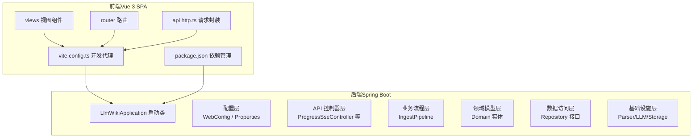
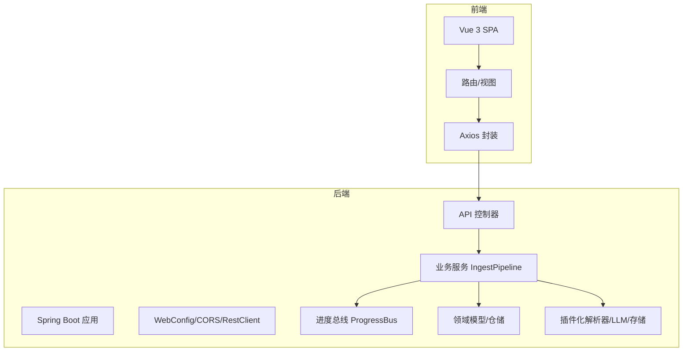
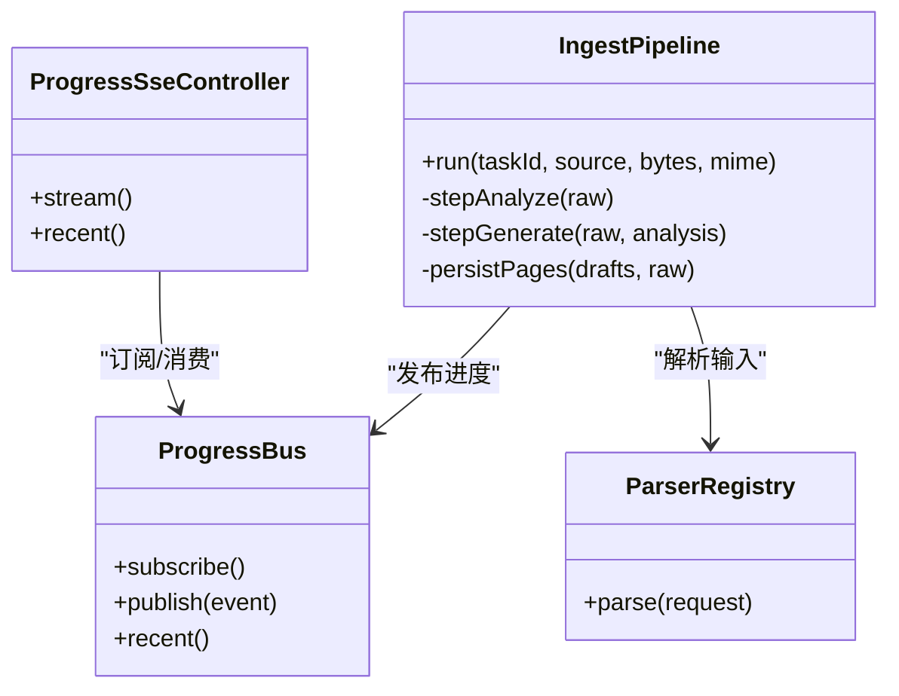
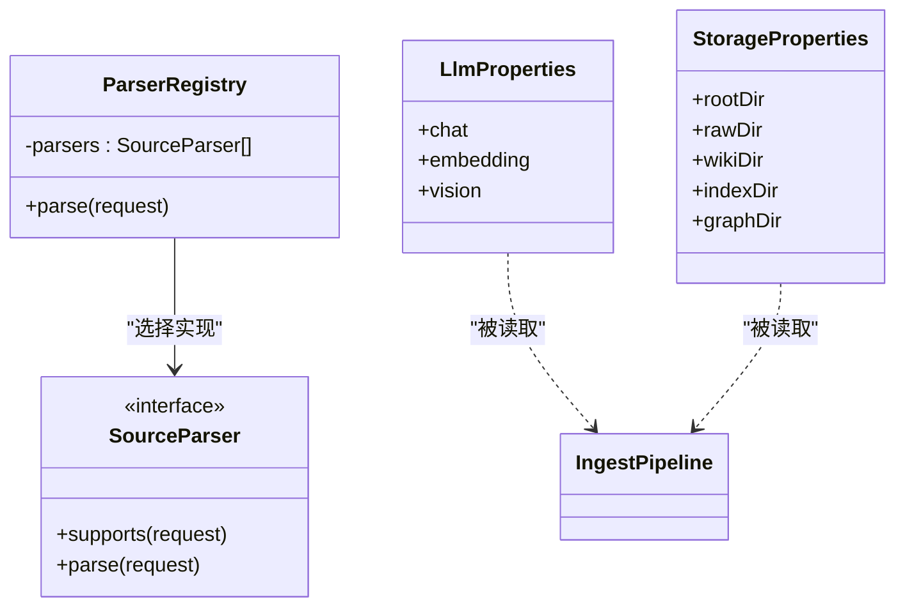
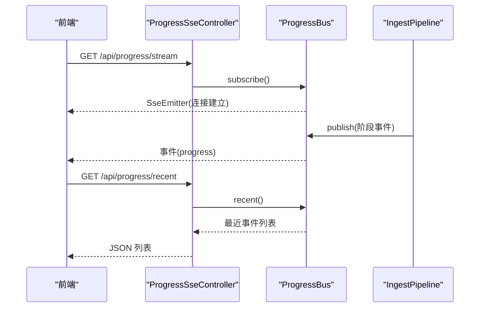
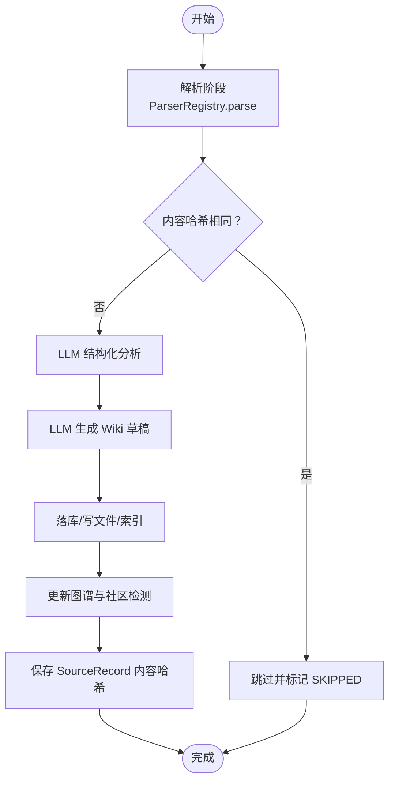
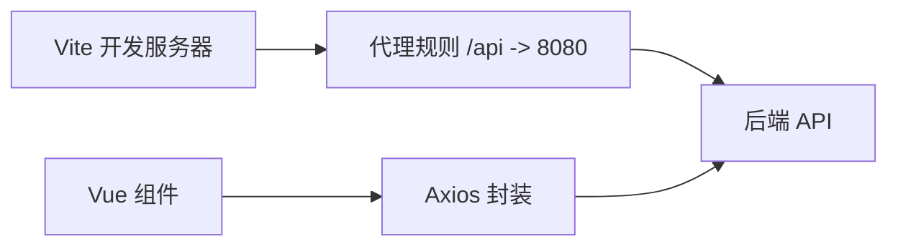
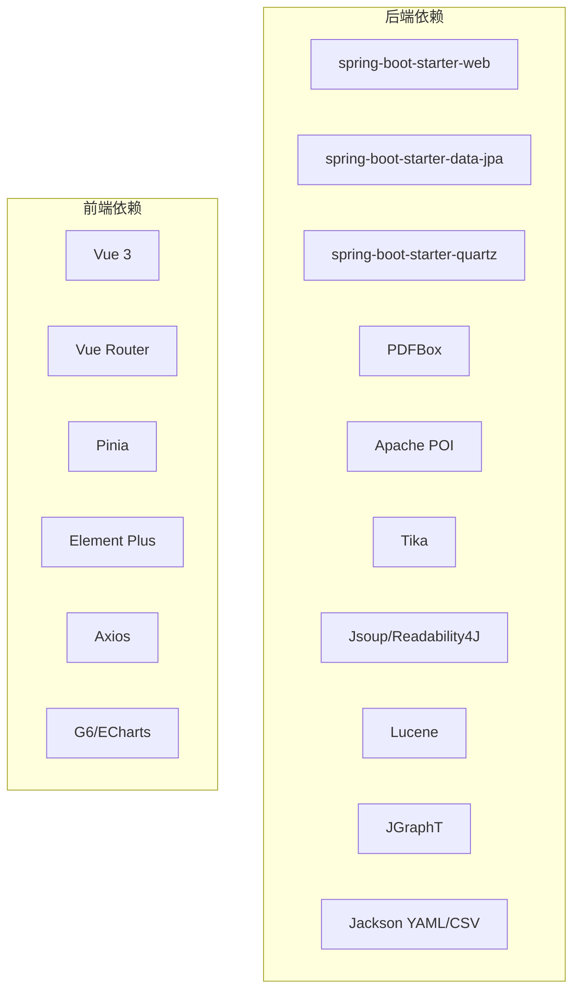

# 整体架构概览

<cite>
**本文档引用的文件**
- [LlmWikiApplication.java](file://src/main/java/com/example/llmwiki/LlmWikiApplication.java)
- [pom.xml](file://pom.xml)
- [application.yml](file://src/main/resources/application.yml)
- [WebConfig.java](file://src/main/java/com/example/llmwiki/config/WebConfig.java)
- [IngestProperties.java](file://src/main/java/com/example/llmwiki/config/IngestProperties.java)
- [LlmProperties.java](file://src/main/java/com/example/llmwiki/config/LlmProperties.java)
- [ParserProperties.java](file://src/main/java/com/example/llmwiki/config/ParserProperties.java)
- [StorageProperties.java](file://src/main/java/com/example/llmwiki/config/StorageProperties.java)
- [ProgressSseController.java](file://src/main/java/com/example/llmwiki/api/ProgressSseController.java)
- [ProgressBus.java](file://src/main/java/com/example/llmwiki/progress/ProgressBus.java)
- [ProgressEvent.java](file://src/main/java/com/example/llmwiki/progress/ProgressEvent.java)
- [IngestPipeline.java](file://src/main/java/com/example/llmwiki/ingest/IngestPipeline.java)
- [ParserRegistry.java](file://src/main/java/com/example/llmwiki/parser/ParserRegistry.java)
- [package.json](file://web/package.json)
- [vite.config.ts](file://web/vite.config.ts)
</cite>

## 目录
1. [简介](#简介)
2. [项目结构](#项目结构)
3. [核心组件](#核心组件)
4. [架构总览](#架构总览)
5. [详细组件分析](#详细组件分析)
6. [依赖关系分析](#依赖关系分析)
7. [性能考量](#性能考量)
8. [故障排查指南](#故障排查指南)
9. [结论](#结论)
10. [附录](#附录)

## 简介
本项目旨在构建一个“自成长”的个人知识库系统，通过将异构来源（PDF、Word、Excel、图片、网页、飞书、钉钉等）增量编译为带交叉引用的 Wiki，并自动构建知识图谱、识别知识空白、定时刷新与可量化评估。后端采用基于 Spring Boot 3.x 的微服务风格单体应用，前端采用 Vue 3 + TypeScript 的 SPA 架构，结合事件驱动的 SSE 实时进度推送，形成统一的现代化技术栈。

## 项目结构
项目采用前后端分离的多模块布局：
- 后端：Spring Boot 应用，位于 src/main/java，资源位于 src/main/resources
- 前端：Vue 3 应用，位于 web/，通过 Vite 构建与开发代理

图表来源
- [LlmWikiApplication.java:1-29](file://src/main/java/com/example/llmwiki/LlmWikiApplication.java#L1-L29)
- [WebConfig.java:1-35](file://src/main/java/com/example/llmwiki/config/WebConfig.java#L1-L35)
- [ProgressSseController.java:1-37](file://src/main/java/com/example/llmwiki/api/ProgressSseController.java#L1-L37)
- [IngestPipeline.java:1-251](file://src/main/java/com/example/llmwiki/ingest/IngestPipeline.java#L1-L251)
- [vite.config.ts:1-23](file://web/vite.config.ts#L1-L23)
- [package.json:1-31](file://web/package.json#L1-L31)

章节来源
- [LlmWikiApplication.java:1-29](file://src/main/java/com/example/llmwiki/LlmWikiApplication.java#L1-L29)
- [pom.xml:1-171](file://pom.xml#L1-L171)
- [application.yml:1-84](file://src/main/resources/application.yml#L1-L84)
- [vite.config.ts:1-23](file://web/vite.config.ts#L1-L23)
- [package.json:1-31](file://web/package.json#L1-L31)

## 核心组件
- 启动与装配
  - 应用入口启用异步与调度能力，支撑后台任务与并发处理
- 配置体系
  - WebConfig 提供 CORS 与共享 RestClient
  - 多个 Properties 类分别管理 LLM、解析器、存储与摄取调度参数
- SSE 进度总线
  - ProgressSseController 对外暴露进度流接口
  - ProgressBus 维护订阅者集合与最近事件回放
- 摄入流水线
  - IngestPipeline 实现两阶段思维链（CoT）：解析 → 结构化分析 → 生成 Wiki → 落库/索引/图谱
- 插件化解析器
  - ParserRegistry 依据请求类型选择首个支持的 SourceParser 实现

章节来源
- [LlmWikiApplication.java:19-26](file://src/main/java/com/example/llmwiki/LlmWikiApplication.java#L19-L26)
- [WebConfig.java:18-33](file://src/main/java/com/example/llmwiki/config/WebConfig.java#L18-L33)
- [LlmProperties.java:16-62](file://src/main/java/com/example/llmwiki/config/LlmProperties.java#L16-L62)
- [ParserProperties.java:13-45](file://src/main/java/com/example/llmwiki/config/ParserProperties.java#L13-L45)
- [StorageProperties.java:13-28](file://src/main/java/com/example/llmwiki/config/StorageProperties.java#L13-L28)
- [IngestProperties.java:13-32](file://src/main/java/com/example/llmwiki/config/IngestProperties.java#L13-L32)
- [ProgressSseController.java:20-36](file://src/main/java/com/example/llmwiki/api/ProgressSseController.java#L20-L36)
- [ProgressBus.java:17-60](file://src/main/java/com/example/llmwiki/progress/ProgressBus.java#L17-L60)
- [IngestPipeline.java:33-109](file://src/main/java/com/example/llmwiki/ingest/IngestPipeline.java#L33-L109)
- [ParserRegistry.java:16-36](file://src/main/java/com/example/llmwiki/parser/ParserRegistry.java#L16-L36)

## 架构总览
系统采用清晰的分层架构与插件化扩展设计：
- 分层架构：Controller → Service → Repository → Domain
- 插件化：解析器、LLM 客户端、存储后端均可替换与扩展
- 事件驱动：基于 SSE 的实时进度推送
- 技术栈：Java 17+、Spring Boot 3.x、Vue 3 + TypeScript、Vite

图表来源
- [WebConfig.java:15-34](file://src/main/java/com/example/llmwiki/config/WebConfig.java#L15-L34)
- [ProgressSseController.java:20-36](file://src/main/java/com/example/llmwiki/api/ProgressSseController.java#L20-L36)
- [IngestPipeline.java:45-63](file://src/main/java/com/example/llmwiki/ingest/IngestPipeline.java#L45-L63)
- [ProgressBus.java:17-60](file://src/main/java/com/example/llmwiki/progress/ProgressBus.java#L17-L60)

## 详细组件分析

### 分层架构：Controller → Service → Repository → Domain
- 控制器层：对外暴露 REST 接口，负责请求接入与响应封装
- 服务层：编排业务流程，协调解析器、LLM 客户端、索引与图谱服务
- 仓储层：抽象数据访问接口，屏蔽具体存储实现
- 领域层：承载实体与值对象，表达业务语义

图表来源
- [ProgressSseController.java:20-36](file://src/main/java/com/example/llmwiki/api/ProgressSseController.java#L20-L36)
- [IngestPipeline.java:45-109](file://src/main/java/com/example/llmwiki/ingest/IngestPipeline.java#L45-L109)
- [ProgressBus.java:17-60](file://src/main/java/com/example/llmwiki/progress/ProgressBus.java#L17-L60)
- [ParserRegistry.java:16-36](file://src/main/java/com/example/llmwiki/parser/ParserRegistry.java#L16-L36)

章节来源
- [ProgressSseController.java:14-36](file://src/main/java/com/example/llmwiki/api/ProgressSseController.java#L14-L36)
- [IngestPipeline.java:33-251](file://src/main/java/com/example/llmwiki/ingest/IngestPipeline.java#L33-L251)
- [ProgressBus.java:11-60](file://src/main/java/com/example/llmwiki/progress/ProgressBus.java#L11-L60)
- [ParserRegistry.java:10-36](file://src/main/java/com/example/llmwiki/parser/ParserRegistry.java#L10-L36)

### 插件化架构：解析器、LLM 客户端、存储后端
- 解析器注册表：根据请求类型选择首个支持的实现，便于新增解析器而无需修改调用方
- LLM 客户端：通过配置属性动态控制模型、超时与兼容协议
- 存储后端：统一的存储路径配置，便于切换或扩展

图表来源
- [ParserRegistry.java:16-36](file://src/main/java/com/example/llmwiki/parser/ParserRegistry.java#L16-L36)
- [LlmProperties.java:16-62](file://src/main/java/com/example/llmwiki/config/LlmProperties.java#L16-L62)
- [StorageProperties.java:13-28](file://src/main/java/com/example/llmwiki/config/StorageProperties.java#L13-L28)
- [IngestPipeline.java:52-63](file://src/main/java/com/example/llmwiki/ingest/IngestPipeline.java#L52-L63)

章节来源
- [ParserRegistry.java:10-36](file://src/main/java/com/example/llmwiki/parser/ParserRegistry.java#L10-L36)
- [LlmProperties.java:7-62](file://src/main/java/com/example/llmwiki/config/LlmProperties.java#L7-L62)
- [StorageProperties.java:7-28](file://src/main/java/com/example/llmwiki/config/StorageProperties.java#L7-L28)
- [IngestPipeline.java:33-109](file://src/main/java/com/example/llmwiki/ingest/IngestPipeline.java#L33-L109)

### 事件驱动架构：基于 SSE 的实时进度推送
- SSE 控制器：提供进度流与最近事件查询
- 进度总线：维护订阅者列表与最近事件队列，支持回放
- 流水线：在每个阶段发布进度事件，前端实时渲染

图表来源
- [ProgressSseController.java:20-36](file://src/main/java/com/example/llmwiki/api/ProgressSseController.java#L20-L36)
- [ProgressBus.java:26-55](file://src/main/java/com/example/llmwiki/progress/ProgressBus.java#L26-L55)
- [IngestPipeline.java:245-249](file://src/main/java/com/example/llmwiki/ingest/IngestPipeline.java#L245-L249)

章节来源
- [ProgressSseController.java:14-36](file://src/main/java/com/example/llmwiki/api/ProgressSseController.java#L14-L36)
- [ProgressBus.java:11-60](file://src/main/java/com/example/llmwiki/progress/ProgressBus.java#L11-L60)
- [ProgressEvent.java:10-43](file://src/main/java/com/example/llmwiki/progress/ProgressEvent.java#L10-L43)
- [IngestPipeline.java:245-249](file://src/main/java/com/example/llmwiki/ingest/IngestPipeline.java#L245-L249)

### 摄入流水线：两步式思维链（CoT）
- 阶段一：解析原始内容为结构化文本与元信息
- 阶段二：LLM 结构化分析 → 生成多页 Wiki 草稿 → 落库/写文件/索引/图谱
- 增量缓存：基于内容哈希判断是否跳过
- 错误处理：对 JSON 解析失败与空结果进行异常抛出

图表来源
- [IngestPipeline.java:65-109](file://src/main/java/com/example/llmwiki/ingest/IngestPipeline.java#L65-L109)
- [IngestPipeline.java:111-177](file://src/main/java/com/example/llmwiki/ingest/IngestPipeline.java#L111-L177)
- [IngestPipeline.java:179-209](file://src/main/java/com/example/llmwiki/ingest/IngestPipeline.java#L179-L209)

章节来源
- [IngestPipeline.java:33-251](file://src/main/java/com/example/llmwiki/ingest/IngestPipeline.java#L33-L251)

### 前端 SPA 架构与集成
- 依赖与脚手架：Vue 3、TypeScript、Vite、Element Plus、AntV G6、ECharts
- 开发代理：将 /api 前缀转发到后端 8080 端口
- 视图与路由：按功能模块划分视图组件与路由配置

图表来源
- [vite.config.ts:13-21](file://web/vite.config.ts#L13-L21)
- [package.json:12-29](file://web/package.json#L12-L29)

章节来源
- [vite.config.ts:1-23](file://web/vite.config.ts#L1-L23)
- [package.json:1-31](file://web/package.json#L1-L31)

## 依赖关系分析
- 后端依赖
  - Spring 生态：Web、JPA、Validation、Quartz
  - 文件解析：PDFBox、POI、Tika
  - 网络爬虫：Jsoup、Readability4J
  - 搜索引擎：Lucene
  - 图算法：JGraphT
  - YAML/CSV：Jackson Dataformat
- 前端依赖
  - Vue 3、Vue Router、Pinia、Element Plus、Axios、Markdown-it、G6、ECharts

图表来源
- [pom.xml:36-159](file://pom.xml#L36-L159)
- [package.json:12-29](file://web/package.json#L12-L29)

章节来源
- [pom.xml:1-171](file://pom.xml#L1-L171)
- [package.json:1-31](file://web/package.json#L1-L31)

## 性能考量
- 并发与调度
  - Quartz 内存 JobStore 适合开发/小规模场景；生产建议持久化存储
  - 摄取工作线程数与最大重试次数可通过配置调整
- I/O 与缓存
  - 增量哈希校验避免重复处理
  - 近期事件回放减少前端等待时间
- 索引与检索
  - Lucene 索引与向量嵌入同步更新，平衡 BM25 与向量检索
- 前端体验
  - Vite 快速冷启动与热更新；代理降低跨域与联调成本

## 故障排查指南
- 进度无推送
  - 检查 SSE 订阅接口是否正常建立，确认订阅者列表与最近事件队列状态
- LLM 返回格式异常
  - 关注 JSON 解析与三段式提示词输出规范，必要时开启日志定位
- 解析器不生效
  - 确认请求类型与 supports 判定逻辑，检查注册表中实现顺序
- 文件解析失败
  - 检查 MIME 类型、字节流与解析器实现；关注 PDFBox/POI/Tika 版本兼容性
- 配置未生效
  - 确认配置前缀与属性映射，必要时通过设置界面热更新

章节来源
- [ProgressBus.java:26-55](file://src/main/java/com/example/llmwiki/progress/ProgressBus.java#L26-L55)
- [IngestPipeline.java:111-139](file://src/main/java/com/example/llmwiki/ingest/IngestPipeline.java#L111-L139)
- [ParserRegistry.java:24-35](file://src/main/java/com/example/llmwiki/parser/ParserRegistry.java#L24-L35)
- [application.yml:31-77](file://src/main/resources/application.yml#L31-L77)

## 结论
该系统以清晰的分层与插件化设计实现了从多源异构数据到结构化 Wiki 的自动化编译，结合 SSE 实时进度与可配置的 LLM/存储策略，满足个人知识库的增量演进需求。前后端技术栈现代且互补，具备良好的可维护性与扩展性。

## 附录
- 系统边界
  - 内部：后端应用、数据库（H2）、本地文件系统（./data）
  - 外部：OpenAI 兼容 LLM 服务、飞书/钉钉 API（可选）、OCR 引擎（可选）
- 架构决策与权衡
  - 单体应用 vs 微服务：简化部署与运维，适合中小规模；未来可按领域拆分
  - SSE vs WebSocket：轻量事件推送，易于实现与浏览器兼容
  - Quartz 内存存储：开发友好；生产建议持久化以保证作业可靠性
  - LLM 模型与向量维度：需与远端模型一致，避免检索偏差