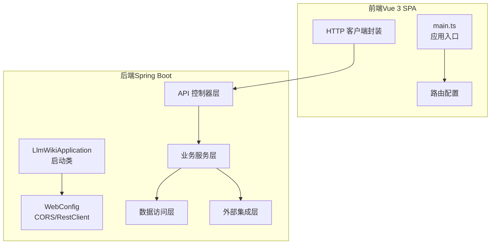
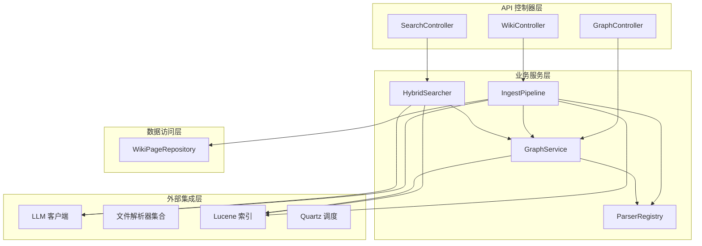
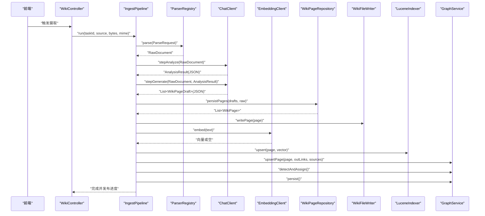
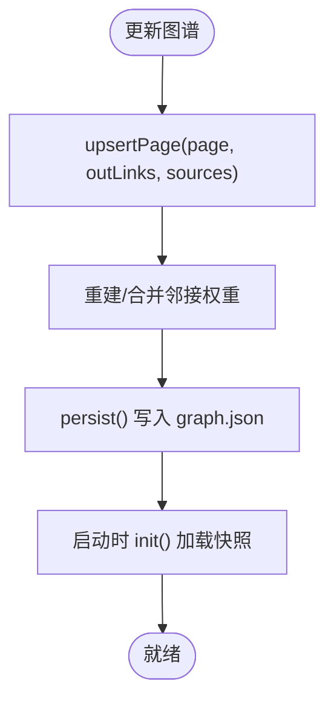
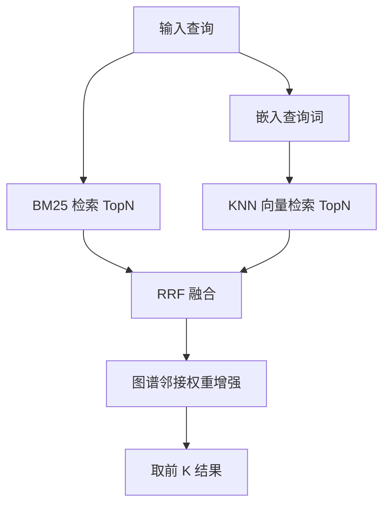
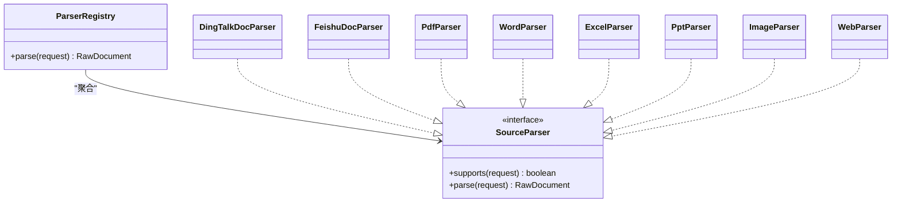
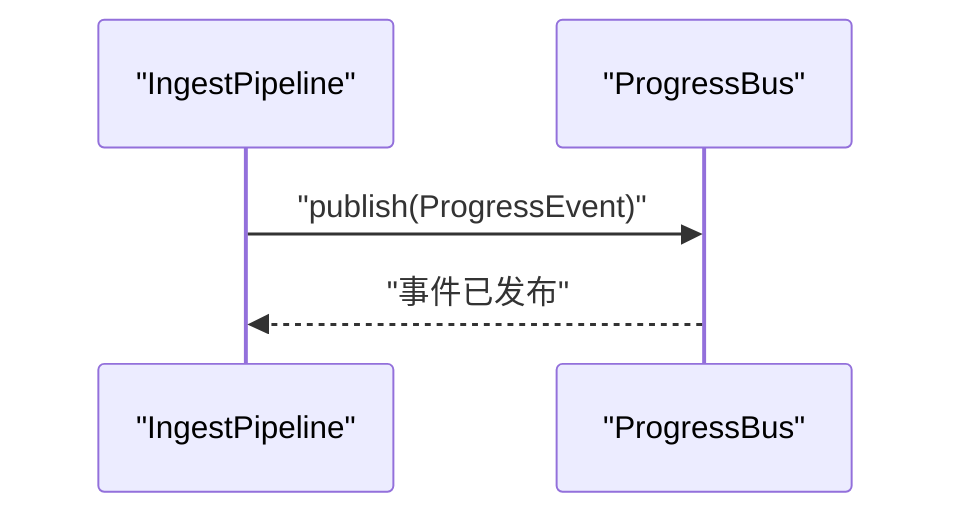
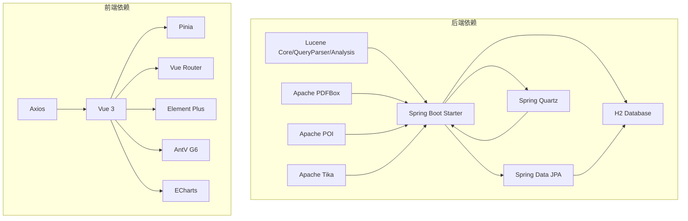
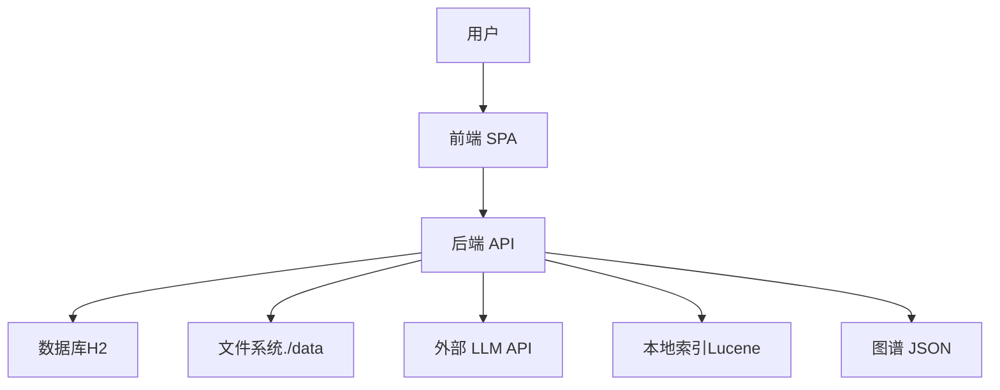

# 系统架构设计

<cite>
**本文档引用的文件**
- [LlmWikiApplication.java](file://src/main/java/com/example/llmwiki/LlmWikiApplication.java)
- [application.yml](file://src/main/resources/application.yml)
- [pom.xml](file://pom.xml)
- [WebConfig.java](file://src/main/java/com/example/llmwiki/config/WebConfig.java)
- [WikiController.java](file://src/main/java/com/example/llmwiki/api/WikiController.java)
- [SearchController.java](file://src/main/java/com/example/llmwiki/api/SearchController.java)
- [GraphController.java](file://src/main/java/com/example/llmwiki/api/GraphController.java)
- [IngestPipeline.java](file://src/main/java/com/example/llmwiki/ingest/IngestPipeline.java)
- [HybridSearcher.java](file://src/main/java/com/example/llmwiki/retrieval/HybridSearcher.java)
- [ParserRegistry.java](file://src/main/java/com/example/llmwiki/parser/ParserRegistry.java)
- [GraphService.java](file://src/main/java/com/example/llmwiki/graph/GraphService.java)
- [WikiPageRepository.java](file://src/main/java/com/example/llmwiki/repository/WikiPageRepository.java)
- [package.json](file://web/package.json)
- [vite.config.ts](file://web/vite.config.ts)
- [main.ts](file://web/src/main.ts)
</cite>

## 目录
1. [简介](#简介)
2. [项目结构](#项目结构)
3. [核心组件](#核心组件)
4. [架构总览](#架构总览)
5. [详细组件分析](#详细组件分析)
6. [依赖关系分析](#依赖关系分析)
7. [性能考量](#性能考量)
8. [故障排查指南](#故障排查指南)
9. [结论](#结论)
10. [附录](#附录)

## 简介
本系统是一个“自构建”的个人知识库平台，采用前后端分离架构：后端基于 Spring Boot 的微服务风格应用，前端采用 Vue 3 SPA。系统通过多模态解析器将异构来源（PDF、Word、Excel、图片、网页、飞书、钉钉等）增量编译为带交叉引用的 Wiki，并自动构建知识图谱、识别知识空白、定时刷新与可量化评估。

## 项目结构
系统采用分层架构与模块化组织：
- 后端（Spring Boot）
  - 控制器层：API 控制器负责对外暴露 REST 接口
  - 业务服务层：领域服务与流程编排（如摄取流水线、检索器、图谱服务）
  - 数据访问层：JPA Repository 提供数据持久化
  - 外部集成层：LLM 客户端、文件解析器、搜索引擎、调度器
- 前端（Vue 3 SPA）
  - 使用 Pinia 状态管理、Vue Router 路由、Element Plus UI 组件库
  - 通过代理将 /api 请求转发到后端

图表来源
- [main.ts:1-14](file://web/src/main.ts#L1-L14)
- [LlmWikiApplication.java:1-29](file://src/main/java/com/example/llmwiki/LlmWikiApplication.java#L1-L29)
- [WebConfig.java:1-35](file://src/main/java/com/example/llmwiki/config/WebConfig.java#L1-L35)

章节来源
- [pom.xml:1-171](file://pom.xml#L1-L171)
- [application.yml:1-84](file://src/main/resources/application.yml#L1-L84)
- [package.json:1-31](file://web/package.json#L1-L31)

## 核心组件
- 启动类与配置
  - 启动类启用异步与定时任务，统一装配各模块
  - 应用配置定义数据库、文件存储根目录、LLM 参数、调度参数、日志级别等
- API 控制器层
  - WikiController：提供 Wiki 页面列表、详情、统计
  - SearchController：提供混合检索接口（BM25 + 向量）
  - GraphController：提供知识图谱数据与洞察
- 业务服务层
  - IngestPipeline：两步式链路（分析 → 生成），并落库、索引、图谱更新
  - HybridSearcher：BM25 与向量检索融合（RRF），并结合图谱权重增强
  - GraphService：内存图谱 + JSON 持久化，支持社区检测与结构性洞察
  - ParserRegistry：插件化解析器注册与选择
- 数据访问层
  - WikiPageRepository：基于 JPA 的 Wiki 页面数据访问
- 外部集成层
  - LLM 客户端（聊天、嵌入、视觉）
  - 文件解析器（PDF、Word、Excel、PPT、图片、网页等）
  - 搜索引擎（Lucene）
  - 调度器（Quartz）

章节来源
- [LlmWikiApplication.java:1-29](file://src/main/java/com/example/llmwiki/LlmWikiApplication.java#L1-L29)
- [application.yml:1-84](file://src/main/resources/application.yml#L1-L84)
- [WikiController.java:1-51](file://src/main/java/com/example/llmwiki/api/WikiController.java#L1-L51)
- [SearchController.java:1-32](file://src/main/java/com/example/llmwiki/api/SearchController.java#L1-L32)
- [GraphController.java:1-86](file://src/main/java/com/example/llmwiki/api/GraphController.java#L1-L86)
- [IngestPipeline.java:1-251](file://src/main/java/com/example/llmwiki/ingest/IngestPipeline.java#L1-L251)
- [HybridSearcher.java:1-137](file://src/main/java/com/example/llmwiki/retrieval/HybridSearcher.java#L1-L137)
- [GraphService.java:1-197](file://src/main/java/com/example/llmwiki/graph/GraphService.java#L1-L197)
- [ParserRegistry.java:1-37](file://src/main/java/com/example/llmwiki/parser/ParserRegistry.java#L1-L37)
- [WikiPageRepository.java:1-19](file://src/main/java/com/example/llmwiki/repository/WikiPageRepository.java#L1-L19)

## 架构总览
系统采用分层架构（Controller → Service → Repository → Domain）与插件化设计，结合事件驱动（进度事件）、工厂/策略模式（解析器注册表）。数据流贯穿文档摄取、知识图谱构建、搜索检索三大流程。

图表来源
- [WikiController.java:1-51](file://src/main/java/com/example/llmwiki/api/WikiController.java#L1-L51)
- [SearchController.java:1-32](file://src/main/java/com/example/llmwiki/api/SearchController.java#L1-L32)
- [GraphController.java:1-86](file://src/main/java/com/example/llmwiki/api/GraphController.java#L1-L86)
- [IngestPipeline.java:1-251](file://src/main/java/com/example/llmwiki/ingest/IngestPipeline.java#L1-L251)
- [HybridSearcher.java:1-137](file://src/main/java/com/example/llmwiki/retrieval/HybridSearcher.java#L1-L137)
- [GraphService.java:1-197](file://src/main/java/com/example/llmwiki/graph/GraphService.java#L1-L197)
- [ParserRegistry.java:1-37](file://src/main/java/com/example/llmwiki/parser/ParserRegistry.java#L1-L37)
- [WikiPageRepository.java:1-19](file://src/main/java/com/example/llmwiki/repository/WikiPageRepository.java#L1-L19)

## 详细组件分析

### 文档摄取流程（两步式 CoT）
- 流程概述
  - 解析阶段：根据来源类型选择解析器，提取文本、图像说明、元信息
  - 分析阶段：LLM 结构化分析，抽取实体、概念、连接、矛盾与建议大纲
  - 生成阶段：LLM 生成多页 Wiki 草稿（类型、标题、摘要、正文、标签、外链）
  - 落库与索引：保存 Wiki 页面，写入文件，同步嵌入到 Lucene，更新图谱并检测社区
- 关键特性
  - 内容去重：基于内容哈希增量跳过
  - 进度事件：发布阶段性状态，便于前端 SSE 实时反馈
  - 容错：嵌入失败时降级为纯 BM25 索引
- 时序图

图表来源
- [IngestPipeline.java:65-109](file://src/main/java/com/example/llmwiki/ingest/IngestPipeline.java#L65-L109)
- [ParserRegistry.java:27-35](file://src/main/java/com/example/llmwiki/parser/ParserRegistry.java#L27-L35)
- [WikiPageRepository.java:13-18](file://src/main/java/com/example/llmwiki/repository/WikiPageRepository.java#L13-L18)
- [GraphService.java:71-104](file://src/main/java/com/example/llmwiki/graph/GraphService.java#L71-L104)

章节来源
- [IngestPipeline.java:1-251](file://src/main/java/com/example/llmwiki/ingest/IngestPipeline.java#L1-L251)
- [ParserRegistry.java:1-37](file://src/main/java/com/example/llmwiki/parser/ParserRegistry.java#L1-L37)

### 知识图谱构建流程
- 内存图谱：节点（slug/title/type/sources）、邻接表（权重）、社区映射
- 更新策略：以 Wiki 外链与共同来源为依据建立边，权重融合
- 持久化：定期序列化为 JSON 文件，启动时加载
- 洞察指标：孤立节点、桥节点、度数、社区数量

图表来源
- [GraphService.java:71-118](file://src/main/java/com/example/llmwiki/graph/GraphService.java#L71-L118)
- [GraphService.java:49-69](file://src/main/java/com/example/llmwiki/graph/GraphService.java#L49-L69)

章节来源
- [GraphService.java:1-197](file://src/main/java/com/example/llmwiki/graph/GraphService.java#L1-L197)

### 搜索检索流程（BM25 + 向量 + 图谱增强）
- 检索策略
  - BM25：基于 Lucene 文本字段检索
  - 向量：查询词嵌入 + KNN 检索
  - 融合：RRF（Reciprocal Rank Fusion）
  - 增强：根据图谱邻接权重对命中结果进行加权
- 降级策略：嵌入不可用时退化为 BM25 单通

图表来源
- [HybridSearcher.java:42-111](file://src/main/java/com/example/llmwiki/retrieval/HybridSearcher.java#L42-L111)

章节来源
- [HybridSearcher.java:1-137](file://src/main/java/com/example/llmwiki/retrieval/HybridSearcher.java#L1-L137)

### 插件化设计（解析器注册表）
- 设计要点
  - 注册表收集所有 SourceParser 实现
  - 按 supports(request) 顺序匹配首个可用解析器
  - 支持扩展新解析器而无需修改核心逻辑
- 适用场景
  - PDF/Word/Excel/PPT/图片/网页/飞书/钉钉等多格式

图表来源
- [ParserRegistry.java:1-37](file://src/main/java/com/example/llmwiki/parser/ParserRegistry.java#L1-L37)

章节来源
- [ParserRegistry.java:1-37](file://src/main/java/com/example/llmwiki/parser/ParserRegistry.java#L1-L37)

### 事件驱动与进度通知
- 进度总线：在摄取流程中发布阶段性事件（阶段、百分比、状态、消息）
- 前端订阅：通过 SSE 或轮询获取进度，提升用户体验

图表来源
- [IngestPipeline.java:245-249](file://src/main/java/com/example/llmwiki/ingest/IngestPipeline.java#L245-L249)

章节来源
- [IngestPipeline.java:245-249](file://src/main/java/com/example/llmwiki/ingest/IngestPipeline.java#L245-L249)

## 依赖关系分析
- 技术栈与版本
  - 后端：Spring Boot 3.3.5、JPA、Quartz、Lucene 9.11.1、PDFBox 3.0.3、POI 5.3.0、Tika 2.9.2、H2 数据库
  - 前端：Vue 3.5.10、Vite 5.4.8、Element Plus 2.8.4、AntV G6 5.0.21、ECharts 5.5.1
- 依赖关系图

图表来源
- [pom.xml:36-159](file://pom.xml#L36-L159)
- [package.json:12-21](file://web/package.json#L12-L21)

章节来源
- [pom.xml:1-171](file://pom.xml#L1-L171)
- [package.json:1-31](file://web/package.json#L1-L31)

## 性能考量
- 摄取性能
  - 增量缓存：基于内容哈希避免重复处理
  - 并发控制：可配置工作线程数与最大重试次数
- 检索性能
  - BM25 与向量双通检索，RRF 融合兼顾语义与关键词
  - 图谱邻接权重增强，减少二次检索
- 存储与索引
  - Lucene 索引与向量嵌入同步更新
  - 图谱 JSON 快照持久化，启动时加载
- 前端体验
  - CORS 开放，代理统一转发 /api 请求，降低跨域复杂度

## 故障排查指南
- 常见问题定位
  - LLM 嵌入异常：检查 LLM 基础地址、API Key、模型与超时设置
  - 文件解析失败：确认 MIME 类型与对应解析器是否启用
  - 检索无结果：确认索引是否建立、向量维度与模型一致
  - 图谱为空：确认持久化文件是否存在、权限是否正确
- 日志与监控
  - 应用日志级别：root/INFO、模块 DEBUG
  - 第三方组件日志：PDFBox、POI 降噪
- 错误处理
  - 解析器未匹配：抛出解析异常，提示缺少对应解析器
  - LLM JSON 解析失败：抛出摄取异常，包含具体原因
  - 嵌入不可用：降级为 BM25 单通继续检索

章节来源
- [application.yml:78-84](file://src/main/resources/application.yml#L78-L84)
- [IngestPipeline.java:136-138](file://src/main/java/com/example/llmwiki/ingest/IngestPipeline.java#L136-L138)
- [HybridSearcher.java:82-86](file://src/main/java/com/example/llmwiki/retrieval/HybridSearcher.java#L82-L86)

## 结论
该系统通过清晰的分层架构与插件化设计，实现了从多模态文档到结构化 Wiki 与知识图谱的自动化流水线。结合混合检索与图谱增强，提供了高质量的知识检索体验。前后端分离与统一代理简化了部署与开发协作。建议后续在生产环境引入更完善的监控告警、缓存优化与安全加固。

## 附录
- 系统上下文图（概念性）

- 基础设施与配置要点
  - 数据库：H2 文件数据库，JPA 自动建模
  - 缓存：内存图谱 + JSON 快照；可扩展 Redis
  - 文件存储：统一根目录 ./data 下 raw/wiki/index/graph 子目录
  - 外部 API：OpenAI 文生图/嵌入/视觉接口
  - 调度：Quartz 内存作业存储，支持 Cron 定时刷新

章节来源
- [application.yml:11-39](file://src/main/resources/application.yml#L11-L39)
- [WebConfig.java:18-25](file://src/main/java/com/example/llmwiki/config/WebConfig.java#L18-L25)