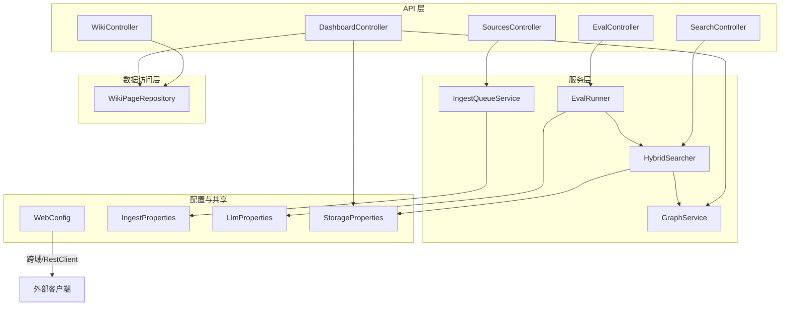
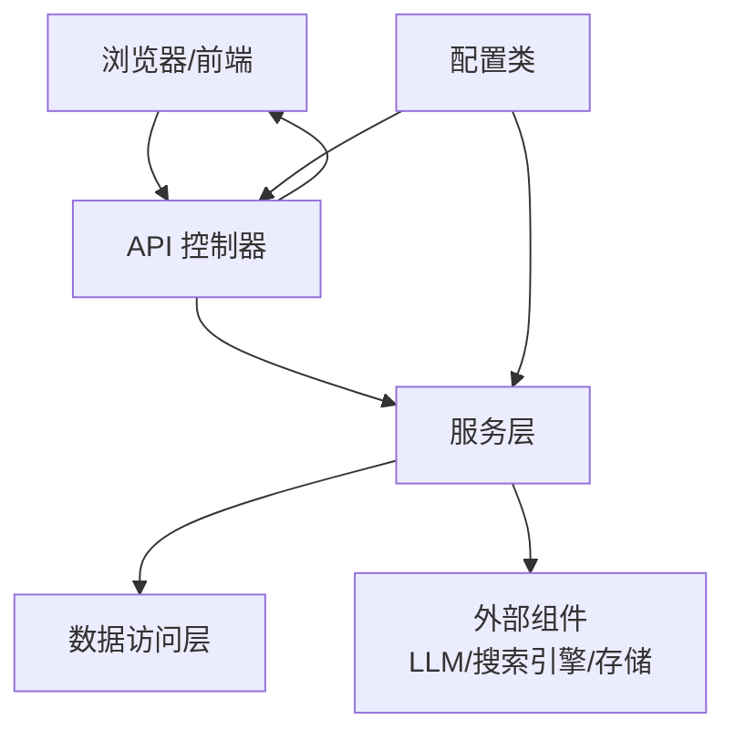
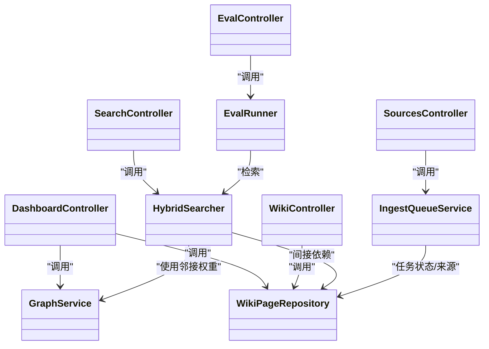
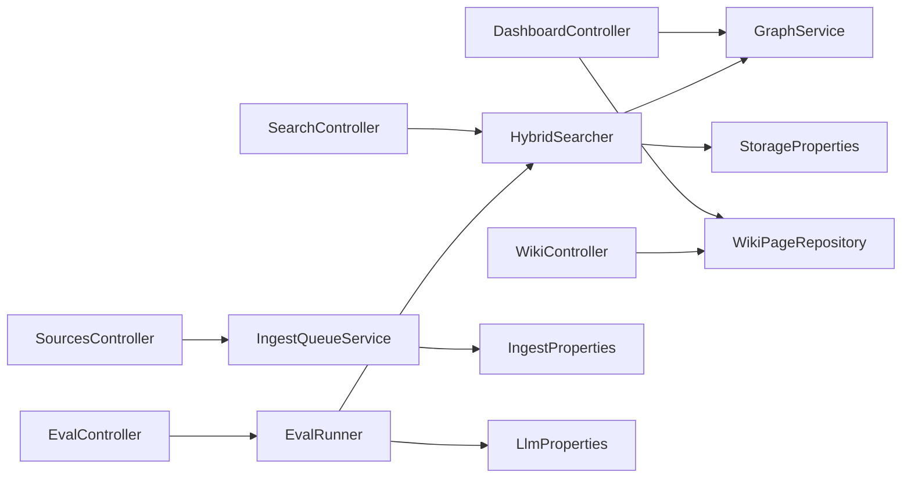
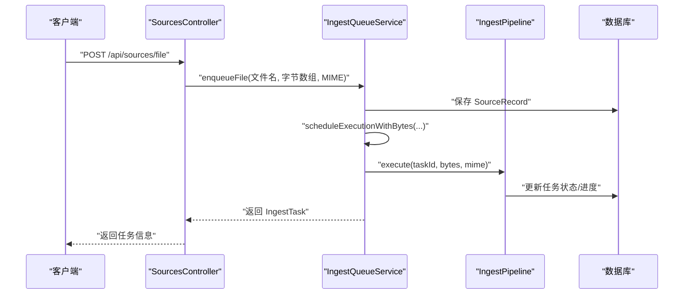

# 组件交互设计

<cite>
**本文引用的文件**
- [LlmWikiApplication.java](file://src/main/java/com/example/llmwiki/LlmWikiApplication.java)
- [WebConfig.java](file://src/main/java/com/example/llmwiki/config/WebConfig.java)
- [IngestProperties.java](file://src/main/java/com/example/llmwiki/config/IngestProperties.java)
- [LlmProperties.java](file://src/main/java/com/example/llmwiki/config/LlmProperties.java)
- [StorageProperties.java](file://src/main/java/com/example/llmwiki/config/StorageProperties.java)
- [DashboardController.java](file://src/main/java/com/example/llmwiki/api/DashboardController.java)
- [WikiController.java](file://src/main/java/com/example/llmwiki/api/WikiController.java)
- [SearchController.java](file://src/main/java/com/example/llmwiki/api/SearchController.java)
- [SourcesController.java](file://src/main/java/com/example/llmwiki/api/SourcesController.java)
- [EvalController.java](file://src/main/java/com/example/llmwiki/api/EvalController.java)
- [GraphService.java](file://src/main/java/com/example/llmwiki/graph/GraphService.java)
- [HybridSearcher.java](file://src/main/java/com/example/llmwiki/retrieval/HybridSearcher.java)
- [WikiPageRepository.java](file://src/main/java/com/example/llmwiki/repository/WikiPageRepository.java)
- [IngestQueueService.java](file://src/main/java/com/example/llmwiki/queue/IngestQueueService.java)
- [EvalRunner.java](file://src/main/java/com/example/llmwiki/eval/EvalRunner.java)
</cite>

## 目录
1. [简介](#简介)
2. [项目结构](#项目结构)
3. [核心组件](#核心组件)
4. [架构总览](#架构总览)
5. [详细组件分析](#详细组件分析)
6. [依赖分析](#依赖分析)
7. [性能考虑](#性能考虑)
8. [故障排查指南](#故障排查指南)
9. [结论](#结论)
10. [附录](#附录)

## 简介
本设计文档聚焦于 LLM Wiki 的组件交互设计，系统性阐述三层架构中的组件协作关系：API 控制器如何协调业务服务、服务层如何调用数据访问层、以及外部组件（如 LLM、搜索引擎、存储）的集成方式。文档还覆盖数据传递规范（请求参数校验、响应封装、异常传播）、依赖注入与控制反转在 Spring 容器中的应用、异步处理机制（@Async 使用场景与线程池配置）、组件接口设计原则（职责分离与最小接口暴露），并提供关键流程的时序图与调用链路图。

## 项目结构
项目采用按功能域分层的组织方式：
- api 层：对外 HTTP 接口，负责请求接收与响应封装
- service 层：业务逻辑编排，协调数据访问与外部组件
- repository 层：数据访问抽象，基于 Spring Data JPA
- config 层：配置类与共享 Bean（如跨域、RestClient）
- domain 层：领域模型
- 其他子模块：graph、retrieval、ingest、eval、queue、progress、scheduler、util 等

图表来源
- [DashboardController.java:1-48](file://src/main/java/com/example/llmwiki/api/DashboardController.java#L1-L48)
- [WikiController.java:1-51](file://src/main/java/com/example/llmwiki/api/WikiController.java#L1-L51)
- [SearchController.java:1-32](file://src/main/java/com/example/llmwiki/api/SearchController.java#L1-L32)
- [SourcesController.java:1-102](file://src/main/java/com/example/llmwiki/api/SourcesController.java#L1-L102)
- [EvalController.java:1-54](file://src/main/java/com/example/llmwiki/api/EvalController.java#L1-L54)
- [GraphService.java:1-197](file://src/main/java/com/example/llmwiki/graph/GraphService.java#L1-L197)
- [HybridSearcher.java:1-137](file://src/main/java/com/example/llmwiki/retrieval/HybridSearcher.java#L1-L137)
- [WikiPageRepository.java:1-19](file://src/main/java/com/example/llmwiki/repository/WikiPageRepository.java#L1-L19)
- [IngestQueueService.java:1-214](file://src/main/java/com/example/llmwiki/queue/IngestQueueService.java#L1-L214)
- [EvalRunner.java:1-243](file://src/main/java/com/example/llmwiki/eval/EvalRunner.java#L1-L243)
- [WebConfig.java:1-35](file://src/main/java/com/example/llmwiki/config/WebConfig.java#L1-L35)
- [IngestProperties.java:1-33](file://src/main/java/com/example/llmwiki/config/IngestProperties.java#L1-L33)
- [LlmProperties.java:1-63](file://src/main/java/com/example/llmwiki/config/LlmProperties.java#L1-L63)
- [StorageProperties.java:1-29](file://src/main/java/com/example/llmwiki/config/StorageProperties.java#L1-L29)

章节来源
- [LlmWikiApplication.java:1-29](file://src/main/java/com/example/llmwiki/LlmWikiApplication.java#L1-L29)
- [WebConfig.java:1-35](file://src/main/java/com/example/llmwiki/config/WebConfig.java#L1-L35)

## 核心组件
- API 控制器：统一对外接口，负责参数接收、简单校验、响应封装与异常传播
- 服务层：编排业务流程，协调外部组件与数据访问
- 数据访问层：JPA Repository 提供 CRUD 与查询能力
- 配置与共享：跨域、RestClient、模型与存储路径等配置

章节来源
- [DashboardController.java:1-48](file://src/main/java/com/example/llmwiki/api/DashboardController.java#L1-L48)
- [WikiController.java:1-51](file://src/main/java/com/example/llmwiki/api/WikiController.java#L1-L51)
- [SearchController.java:1-32](file://src/main/java/com/example/llmwiki/api/SearchController.java#L1-L32)
- [SourcesController.java:1-102](file://src/main/java/com/example/llmwiki/api/SourcesController.java#L1-L102)
- [EvalController.java:1-54](file://src/main/java/com/example/llmwiki/api/EvalController.java#L1-L54)
- [GraphService.java:1-197](file://src/main/java/com/example/llmwiki/graph/GraphService.java#L1-L197)
- [HybridSearcher.java:1-137](file://src/main/java/com/example/llmwiki/retrieval/HybridSearcher.java#L1-L137)
- [WikiPageRepository.java:1-19](file://src/main/java/com/example/llmwiki/repository/WikiPageRepository.java#L1-L19)
- [IngestQueueService.java:1-214](file://src/main/java/com/example/llmwiki/queue/IngestQueueService.java#L1-L214)
- [EvalRunner.java:1-243](file://src/main/java/com/example/llmwiki/eval/EvalRunner.java#L1-L243)
- [WebConfig.java:1-35](file://src/main/java/com/example/llmwiki/config/WebConfig.java#L1-L35)
- [IngestProperties.java:1-33](file://src/main/java/com/example/llmwiki/config/IngestProperties.java#L1-L33)
- [LlmProperties.java:1-63](file://src/main/java/com/example/llmwiki/config/LlmProperties.java#L1-L63)
- [StorageProperties.java:1-29](file://src/main/java/com/example/llmwiki/config/StorageProperties.java#L1-L29)

## 架构总览
系统采用“控制器-服务-数据访问”三层架构，配合配置驱动与事件总线，实现可扩展、可观测的组件交互。

图表来源
- [LlmWikiApplication.java:1-29](file://src/main/java/com/example/llmwiki/LlmWikiApplication.java#L1-L29)
- [WebConfig.java:1-35](file://src/main/java/com/example/llmwiki/config/WebConfig.java#L1-L35)
- [IngestProperties.java:1-33](file://src/main/java/com/example/llmwiki/config/IngestProperties.java#L1-L33)
- [LlmProperties.java:1-63](file://src/main/java/com/example/llmwiki/config/LlmProperties.java#L1-L63)
- [StorageProperties.java:1-29](file://src/main/java/com/example/llmwiki/config/StorageProperties.java#L1-L29)

## 详细组件分析

### API 控制器层
- DashboardController：聚合统计，调用多个仓库与图谱服务，返回聚合指标
- WikiController：提供 Wiki 页面列表、详情与类型统计
- SearchController：调用混合检索器执行检索
- SourcesController：文件上传、URL/远程源注册、任务管理（取消/重试）、删除来源
- EvalController：评测运行、报告列表与详情

章节来源
- [DashboardController.java:1-48](file://src/main/java/com/example/llmwiki/api/DashboardController.java#L1-L48)
- [WikiController.java:1-51](file://src/main/java/com/example/llmwiki/api/WikiController.java#L1-L51)
- [SearchController.java:1-32](file://src/main/java/com/example/llmwiki/api/SearchController.java#L1-L32)
- [SourcesController.java:1-102](file://src/main/java/com/example/llmwiki/api/SourcesController.java#L1-L102)
- [EvalController.java:1-54](file://src/main/java/com/example/llmwiki/api/EvalController.java#L1-L54)

### 服务层
- GraphService：内存图谱 + JSON 持久化，提供节点、邻接、社区、结构性洞察等能力
- HybridSearcher：BM25 + 向量 KNN 混合检索，RRF 融合，并结合图谱权重进行增强
- IngestQueueService：摄取队列，单线程串行执行，支持取消、重试、失败回退与进度事件发布
- EvalRunner：评测运行器，CSV 解析、混合检索、指标计算与报告落库

章节来源
- [GraphService.java:1-197](file://src/main/java/com/example/llmwiki/graph/GraphService.java#L1-L197)
- [HybridSearcher.java:1-137](file://src/main/java/com/example/llmwiki/retrieval/HybridSearcher.java#L1-L137)
- [IngestQueueService.java:1-214](file://src/main/java/com/example/llmwiki/queue/IngestQueueService.java#L1-L214)
- [EvalRunner.java:1-243](file://src/main/java/com/example/llmwiki/eval/EvalRunner.java#L1-L243)

### 数据访问层
- WikiPageRepository：基于 JPA 的 Wiki 页面数据访问

章节来源
- [WikiPageRepository.java:1-19](file://src/main/java/com/example/llmwiki/repository/WikiPageRepository.java#L1-L19)

### 配置与共享
- WebConfig：跨域配置与共享 RestClient Bean
- IngestProperties：摄取与调度配置（最大重试次数、worker 线程数、调度开关与 Cron）
- LlmProperties：LLM 模型配置（Chat/Embedding/Vision，OpenAI 兼容协议）
- StorageProperties：存储路径配置（数据根目录、原始资料、Wiki、索引、图谱）

章节来源
- [WebConfig.java:1-35](file://src/main/java/com/example/llmwiki/config/WebConfig.java#L1-L35)
- [IngestProperties.java:1-33](file://src/main/java/com/example/llmwiki/config/IngestProperties.java#L1-L33)
- [LlmProperties.java:1-63](file://src/main/java/com/example/llmwiki/config/LlmProperties.java#L1-L63)
- [StorageProperties.java:1-29](file://src/main/java/com/example/llmwiki/config/StorageProperties.java#L1-L29)

### 组件类图（代码级）

图表来源
- [DashboardController.java:1-48](file://src/main/java/com/example/llmwiki/api/DashboardController.java#L1-L48)
- [WikiController.java:1-51](file://src/main/java/com/example/llmwiki/api/WikiController.java#L1-L51)
- [SearchController.java:1-32](file://src/main/java/com/example/llmwiki/api/SearchController.java#L1-L32)
- [SourcesController.java:1-102](file://src/main/java/com/example/llmwiki/api/SourcesController.java#L1-L102)
- [EvalController.java:1-54](file://src/main/java/com/example/llmwiki/api/EvalController.java#L1-L54)
- [GraphService.java:1-197](file://src/main/java/com/example/llmwiki/graph/GraphService.java#L1-L197)
- [HybridSearcher.java:1-137](file://src/main/java/com/example/llmwiki/retrieval/HybridSearcher.java#L1-L137)
- [WikiPageRepository.java:1-19](file://src/main/java/com/example/llmwiki/repository/WikiPageRepository.java#L1-L19)
- [IngestQueueService.java:1-214](file://src/main/java/com/example/llmwiki/queue/IngestQueueService.java#L1-L214)
- [EvalRunner.java:1-243](file://src/main/java/com/example/llmwiki/eval/EvalRunner.java#L1-L243)

## 依赖分析
- 控制器依赖服务：API 控制器通过构造器注入服务，服务之间通过接口或直接依赖协作
- 服务依赖配置：服务通过配置类读取运行参数（如摄取重试、LLM 超时、存储路径）
- 服务依赖数据访问：服务通过 Repository 进行数据持久化与查询
- 外部组件集成：服务通过共享 RestClient、EmbeddingClient、ChatClient 等与外部系统交互

图表来源
- [DashboardController.java:1-48](file://src/main/java/com/example/llmwiki/api/DashboardController.java#L1-L48)
- [WikiController.java:1-51](file://src/main/java/com/example/llmwiki/api/WikiController.java#L1-L51)
- [SearchController.java:1-32](file://src/main/java/com/example/llmwiki/api/SearchController.java#L1-L32)
- [SourcesController.java:1-102](file://src/main/java/com/example/llmwiki/api/SourcesController.java#L1-L102)
- [EvalController.java:1-54](file://src/main/java/com/example/llmwiki/api/EvalController.java#L1-L54)
- [GraphService.java:1-197](file://src/main/java/com/example/llmwiki/graph/GraphService.java#L1-L197)
- [HybridSearcher.java:1-137](file://src/main/java/com/example/llmwiki/retrieval/HybridSearcher.java#L1-L137)
- [WikiPageRepository.java:1-19](file://src/main/java/com/example/llmwiki/repository/WikiPageRepository.java#L1-L19)
- [IngestQueueService.java:1-214](file://src/main/java/com/example/llmwiki/queue/IngestQueueService.java#L1-L214)
- [EvalRunner.java:1-243](file://src/main/java/com/example/llmwiki/eval/EvalRunner.java#L1-L243)
- [StorageProperties.java:1-29](file://src/main/java/com/example/llmwiki/config/StorageProperties.java#L1-L29)
- [IngestProperties.java:1-33](file://src/main/java/com/example/llmwiki/config/IngestProperties.java#L1-L33)
- [LlmProperties.java:1-63](file://src/main/java/com/example/llmwiki/config/LlmProperties.java#L1-L63)

## 性能考虑
- 混合检索：BM25 与向量 KNN 并行尝试，失败时降级，减少端到端延迟
- 图谱增强：利用邻接权重对命中结果进行微调，提升相关性排序质量
- 摄取队列：单线程串行执行避免资源竞争，结合取消与重试策略保证可靠性
- 缓存与持久化：图谱内存结构 + JSON 快照，启动时加载，降低冷启动成本
- 资源复用：共享 RestClient，减少连接开销

## 故障排查指南
- 异常传播：控制器层捕获并转换为标准响应；服务层抛出受控异常，由上层统一处理
- 日志记录：服务层广泛使用日志记录错误与降级路径，便于定位问题
- 评测异常：CSV 解析与 LLM 调用异常均被记录并跳过当前条目，不影响整体评测
- 摄取失败：超过最大重试次数后标记失败并发布进度事件，便于前端感知

章节来源
- [EvalRunner.java:1-243](file://src/main/java/com/example/llmwiki/eval/EvalRunner.java#L1-L243)
- [IngestQueueService.java:1-214](file://src/main/java/com/example/llmwiki/queue/IngestQueueService.java#L1-L214)

## 结论
本设计以清晰的分层与最小接口暴露为核心，通过 Spring 容器完成依赖注入与生命周期管理，结合配置驱动与事件总线，实现了可扩展、可观测且易维护的组件交互体系。API 控制器专注于契约与封装，服务层承担编排与集成，数据访问层提供稳定的数据能力，整体满足检索、摄取、评测与可视化等核心需求。

## 附录

### 组件接口设计原则
- 职责分离：控制器仅负责请求/响应；服务负责业务编排；仓库负责数据存取
- 最小接口暴露：控制器仅暴露必要字段，内部通过服务聚合复杂逻辑
- 明确边界：服务与外部组件通过客户端与配置类解耦

### 数据传递规范
- 请求参数验证：控制器层进行基础校验（如必填、默认值），复杂规则由服务层处理
- 响应数据封装：统一返回结构，错误时携带明确消息
- 异常传播：异常向上抛出，由全局异常处理或控制器捕获转换为标准响应

### 依赖注入与控制反转
- Spring 容器管理组件生命周期与依赖关系
- 构造器注入确保不可变依赖与空值保护
- 配置类与共享 Bean（RestClient、属性对象）集中管理

### 异步处理机制
- 应用启用异步与调度：@EnableAsync、@EnableScheduling
- 摄取队列使用单线程执行器串行处理，保证幂等与一致性
- 评测与检索等耗时操作建议在服务层按需异步化（如使用 @Async），并结合线程池配置优化吞吐

图表来源
- [SourcesController.java:1-102](file://src/main/java/com/example/llmwiki/api/SourcesController.java#L1-L102)
- [IngestQueueService.java:1-214](file://src/main/java/com/example/llmwiki/queue/IngestQueueService.java#L1-L214)