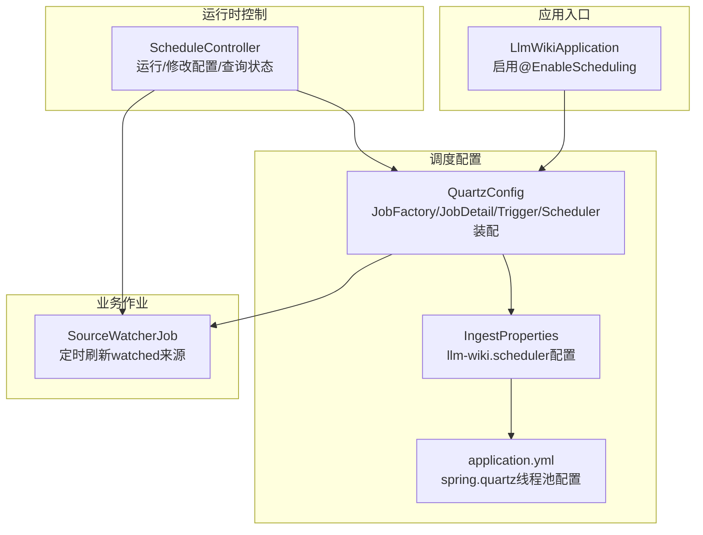
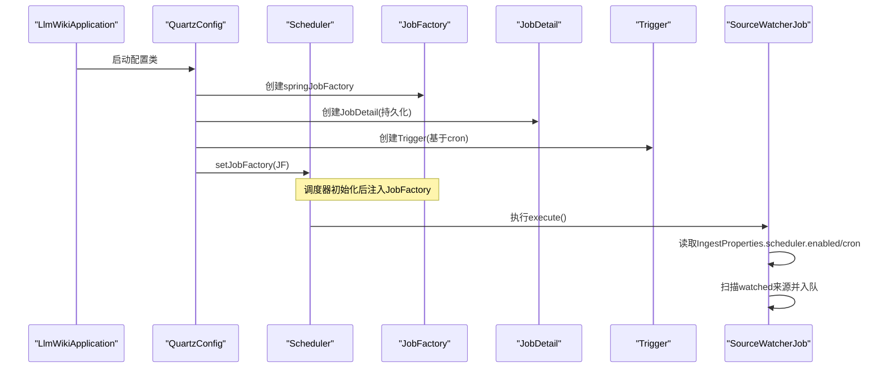
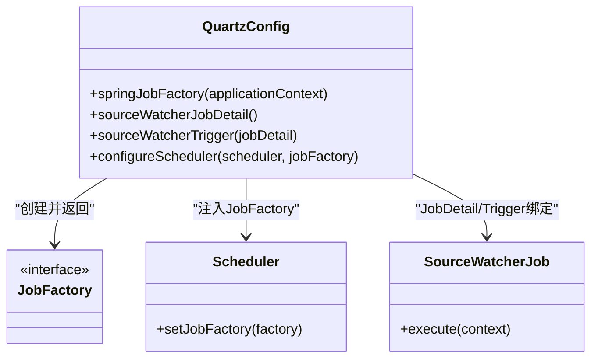
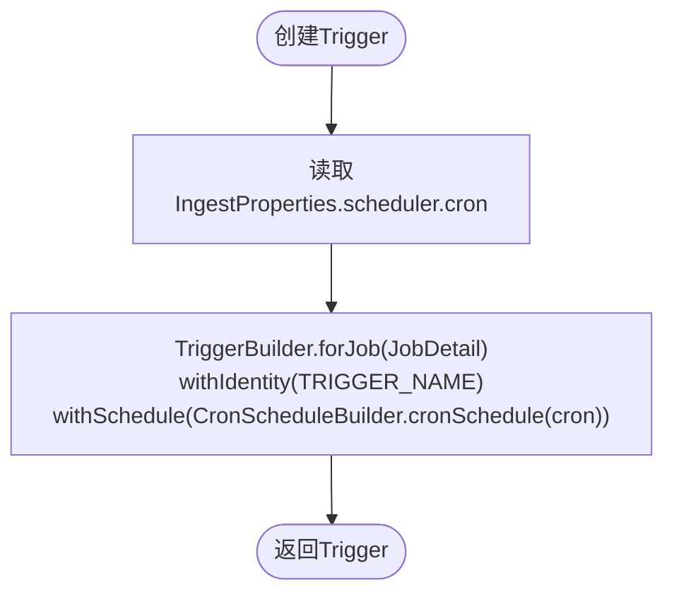
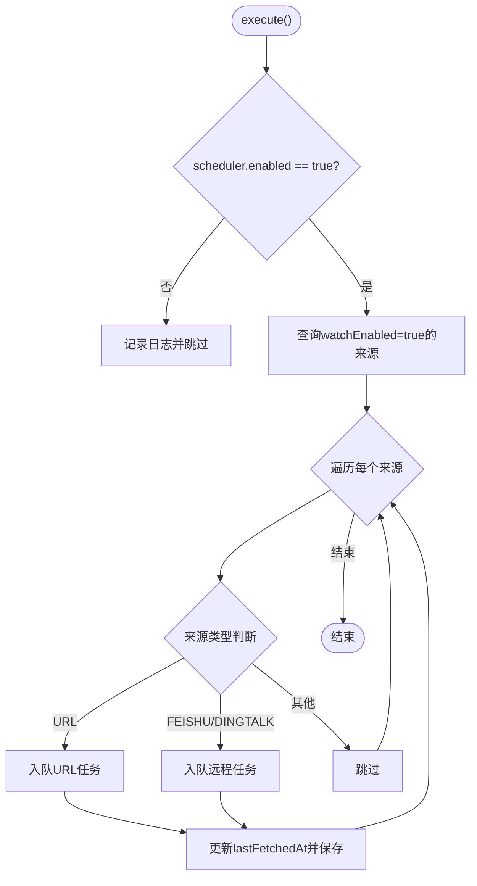
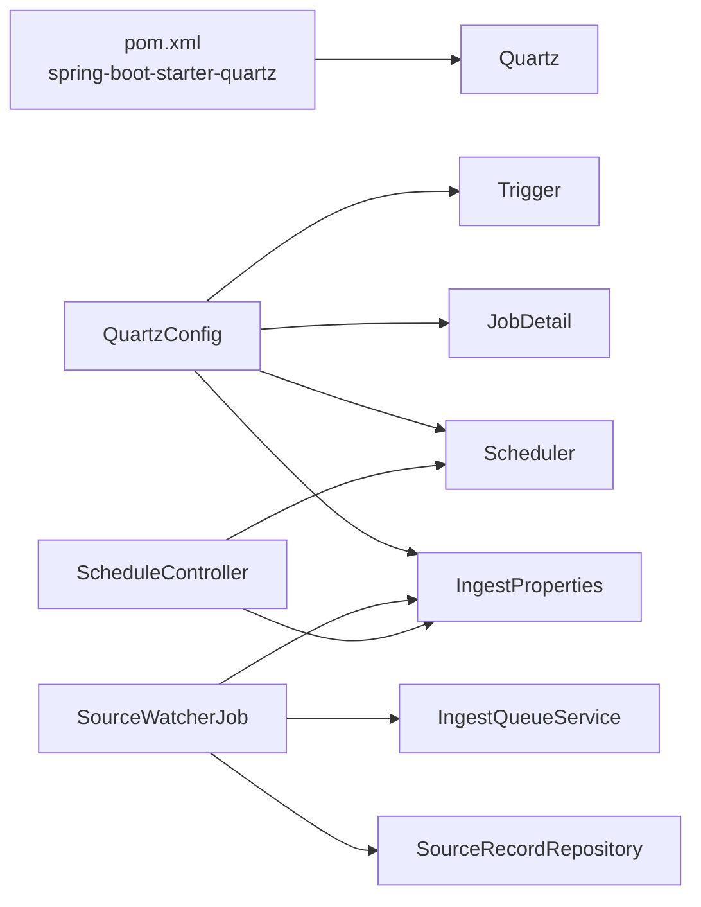

# Quartz调度器配置

<cite>
**本文引用的文件**
- [QuartzConfig.java](file://src/main/java/com/example/llmwiki/scheduler/QuartzConfig.java)
- [SourceWatcherJob.java](file://src/main/java/com/example/llmwiki/scheduler/SourceWatcherJob.java)
- [application.yml](file://src/main/resources/application.yml)
- [IngestProperties.java](file://src/main/java/com/example/llmwiki/config/IngestProperties.java)
- [ScheduleController.java](file://src/main/java/com/example/llmwiki/api/ScheduleController.java)
- [LlmWikiApplication.java](file://src/main/java/com/example/llmwiki/LlmWikiApplication.java)
- [pom.xml](file://pom.xml)
</cite>

## 目录
1. [简介](#简介)
2. [项目结构](#项目结构)
3. [核心组件](#核心组件)
4. [架构总览](#架构总览)
5. [详细组件分析](#详细组件分析)
6. [依赖关系分析](#依赖关系分析)
7. [性能考虑](#性能考虑)
8. [故障排查指南](#故障排查指南)
9. [结论](#结论)
10. [附录](#附录)

## 简介
本文件面向LLM Wiki项目的Quartz调度器配置，系统性阐述以下主题：
- QuartzConfig配置类的实现：JobFactory配置、Spring容器集成、依赖注入机制
- 调度器初始化过程：Scheduler实例创建、JobDetail配置、Trigger配置
- Cron表达式配置：cron属性读取、调度周期设置、时间规则定义
- 调度器生命周期管理：启动流程、停止流程、异常处理
- 配置最佳实践：性能调优、内存管理、线程池配置
- 调度器监控：执行状态监控、日志记录、故障诊断
- 调度器扩展：自定义JobFactory、动态任务注册、调度策略调整

## 项目结构
Quartz调度器相关代码位于scheduler包，配合配置类IngestProperties与API控制器ScheduleController共同完成调度配置、运行与控制。

图表来源
- [LlmWikiApplication.java:19-26](file://src/main/java/com/example/llmwiki/LlmWikiApplication.java#L19-L26)
- [QuartzConfig.java:31-88](file://src/main/java/com/example/llmwiki/scheduler/QuartzConfig.java#L31-L88)
- [IngestProperties.java:16-31](file://src/main/java/com/example/llmwiki/config/IngestProperties.java#L16-L31)
- [application.yml:26-29](file://src/main/resources/application.yml#L26-L29)
- [SourceWatcherJob.java:31-66](file://src/main/java/com/example/llmwiki/scheduler/SourceWatcherJob.java#L31-L66)
- [ScheduleController.java:31-77](file://src/main/java/com/example/llmwiki/api/ScheduleController.java#L31-L77)

章节来源
- [LlmWikiApplication.java:19-26](file://src/main/java/com/example/llmwiki/LlmWikiApplication.java#L19-L26)
- [QuartzConfig.java:31-88](file://src/main/java/com/example/llmwiki/scheduler/QuartzConfig.java#L31-L88)
- [IngestProperties.java:16-31](file://src/main/java/com/example/llmwiki/config/IngestProperties.java#L16-L31)
- [application.yml:26-29](file://src/main/resources/application.yml#L26-L29)
- [SourceWatcherJob.java:31-66](file://src/main/java/com/example/llmwiki/scheduler/SourceWatcherJob.java#L31-L66)
- [ScheduleController.java:31-77](file://src/main/java/com/example/llmwiki/api/ScheduleController.java#L31-L77)

## 核心组件
- QuartzConfig：负责装配Quartz的JobFactory、JobDetail、Trigger，并在调度器初始化后注入JobFactory。
- SourceWatcherJob：具体执行的定时任务，扫描watchEnabled=true的来源并重新入队。
- IngestProperties：承载llm-wiki.scheduler.enabled与cron配置项。
- application.yml：提供spring.quartz.job-store-type与线程池数量配置。
- ScheduleController：对外提供查询/更新调度配置、立即触发任务等接口。

章节来源
- [QuartzConfig.java:31-88](file://src/main/java/com/example/llmwiki/scheduler/QuartzConfig.java#L31-L88)
- [SourceWatcherJob.java:31-66](file://src/main/java/com/example/llmwiki/scheduler/SourceWatcherJob.java#L31-L66)
- [IngestProperties.java:16-31](file://src/main/java/com/example/llmwiki/config/IngestProperties.java#L16-L31)
- [application.yml:26-29](file://src/main/resources/application.yml#L26-L29)
- [ScheduleController.java:31-77](file://src/main/java/com/example/llmwiki/api/ScheduleController.java#L31-L77)

## 架构总览
下图展示从应用启动到调度器运行的关键交互路径。

图表来源
- [LlmWikiApplication.java:19-26](file://src/main/java/com/example/llmwiki/LlmWikiApplication.java#L19-L26)
- [QuartzConfig.java:41-88](file://src/main/java/com/example/llmwiki/scheduler/QuartzConfig.java#L41-L88)
- [SourceWatcherJob.java:38-66](file://src/main/java/com/example/llmwiki/scheduler/SourceWatcherJob.java#L38-L66)

## 详细组件分析

### QuartzConfig配置类
- JobFactory配置
  - 通过springJobFactory创建自定义JobFactory，使用ApplicationContext的AutowireCapableBeanFactory对Job实例进行依赖注入与初始化，确保Job能使用Spring管理的组件。
- Spring容器集成
  - 在QuartzConfig中声明@Bean方法，由Spring容器统一管理JobFactory、JobDetail、Trigger的生命周期。
- 依赖注入机制
  - JobFactory在每次创建Job实例时，先通过无参构造创建对象，再调用autowireBean与initializeBean完成依赖注入与Spring生命周期回调。
- 调度器初始化
  - 使用@Autowired注入Scheduler，并在configureScheduler中设置JobFactory，使调度器在执行Job时能从Spring容器获取实例并注入依赖。

图表来源
- [QuartzConfig.java:41-88](file://src/main/java/com/example/llmwiki/scheduler/QuartzConfig.java#L41-L88)
- [SourceWatcherJob.java:31-66](file://src/main/java/com/example/llmwiki/scheduler/SourceWatcherJob.java#L31-L66)

章节来源
- [QuartzConfig.java:31-88](file://src/main/java/com/example/llmwiki/scheduler/QuartzConfig.java#L31-L88)

### JobDetail与Trigger配置
- JobDetail
  - 使用JobBuilder创建JobDetail，指定Job类为SourceWatcherJob，设置唯一标识并storeDurably，确保即使没有Trigger也保持在调度器中。
- Trigger
  - 使用TriggerBuilder创建Trigger，绑定JobDetail，设置唯一标识，并通过CronScheduleBuilder.cronSchedule(cron)应用Cron表达式。
- Cron表达式来源
  - cron来自IngestProperties.scheduler.cron，最终来源于application.yml中的llm-wiki.scheduler.cron，默认值为每日凌晨三点。

图表来源
- [QuartzConfig.java:64-80](file://src/main/java/com/example/llmwiki/scheduler/QuartzConfig.java#L64-L80)
- [IngestProperties.java:28-31](file://src/main/java/com/example/llmwiki/config/IngestProperties.java#L28-L31)
- [application.yml:71-73](file://src/main/resources/application.yml#L71-L73)

章节来源
- [QuartzConfig.java:64-80](file://src/main/java/com/example/llmwiki/scheduler/QuartzConfig.java#L64-L80)
- [IngestProperties.java:28-31](file://src/main/java/com/example/llmwiki/config/IngestProperties.java#L28-L31)
- [application.yml:71-73](file://src/main/resources/application.yml#L71-L73)

### SourceWatcherJob执行逻辑
- 并发控制
  - 使用@DisallowConcurrentExecution注解避免同一Job并发执行，保证数据一致性。
- 执行条件
  - 若IngestProperties.scheduler.enabled为false，则直接跳过本轮执行。
- 执行内容
  - 查询watchEnabled=true的来源列表，根据来源类型分别入队URL或远程来源任务，并更新最后抓取时间。
- 异常处理
  - 对单个来源刷新失败进行日志告警，不中断整体执行流程。

图表来源
- [SourceWatcherJob.java:38-66](file://src/main/java/com/example/llmwiki/scheduler/SourceWatcherJob.java#L38-L66)

章节来源
- [SourceWatcherJob.java:31-66](file://src/main/java/com/example/llmwiki/scheduler/SourceWatcherJob.java#L31-L66)

### 调度器生命周期管理
- 启动流程
  - 应用启动时，Spring Boot加载Quartz自动配置与QuartzConfig，创建并装配JobFactory、JobDetail、Trigger，随后注入到Scheduler。
- 停止流程
  - 项目未显式提供Scheduler.stop()的调用点；通常在应用优雅停机时由Spring容器负责销毁，Quartz会尝试终止正在运行的任务。
- 异常处理
  - Job执行期间的异常会被捕获并记录日志，不影响其他来源的刷新；QuartzConfig的JobFactory在实例化阶段若发生反射异常会抛出RuntimeException。

章节来源
- [LlmWikiApplication.java:19-26](file://src/main/java/com/example/llmwiki/LlmWikiApplication.java#L19-L26)
- [QuartzConfig.java:41-62](file://src/main/java/com/example/llmwiki/scheduler/QuartzConfig.java#L41-L62)
- [SourceWatcherJob.java:38-66](file://src/main/java/com/example/llmwiki/scheduler/SourceWatcherJob.java#L38-L66)

### Cron表达式配置
- 属性读取
  - 通过IngestProperties.scheduler.cron读取配置，该配置映射至application.yml中的llm-wiki.scheduler.cron。
- 调度周期设置
  - 默认值为“每日凌晨三点”，可通过ScheduleController的POST /api/schedule/config动态更新。
- 时间规则定义
  - Cron表达式遵循Quartz语法，支持秒、分、时、日、月、周几等字段组合，满足复杂时间规则需求。

章节来源
- [IngestProperties.java:28-31](file://src/main/java/com/example/llmwiki/config/IngestProperties.java#L28-L31)
- [application.yml:71-73](file://src/main/resources/application.yml#L71-L73)
- [ScheduleController.java:42-51](file://src/main/java/com/example/llmwiki/api/ScheduleController.java#L42-L51)

### 运行时控制与监控
- 立即执行
  - 通过ScheduleController.POST /api/schedule/run-now触发当前Job立即执行。
- 配置查询与更新
  - GET /api/schedule/config返回当前调度配置；POST /api/schedule/config支持更新cron与enabled。
- 监控与日志
  - SourceWatcherJob在执行前后记录日志，便于观察刷新行为；应用日志级别在application.yml中配置。

章节来源
- [ScheduleController.java:37-77](file://src/main/java/com/example/llmwiki/api/ScheduleController.java#L37-L77)
- [application.yml:78-84](file://src/main/resources/application.yml#L78-L84)

### 扩展与定制
- 自定义JobFactory
  - 可替换QuartzConfig.springJobFactory以实现更复杂的实例化与注入策略（例如基于注解的条件注入）。
- 动态任务注册
  - 可在运行时通过Scheduler注册新的JobDetail与Trigger，结合IngestProperties动态更新实现灵活调度。
- 调度策略调整
  - 通过修改application.yml中的spring.quartz.threadPool.threadCount与job-store-type，平衡吞吐与资源占用。

章节来源
- [QuartzConfig.java:41-62](file://src/main/java/com/example/llmwiki/scheduler/QuartzConfig.java#L41-L62)
- [application.yml:26-29](file://src/main/resources/application.yml#L26-L29)

## 依赖关系分析
- 外部依赖
  - spring-boot-starter-quartz提供Quartz自动配置与调度器能力。
- 内部依赖
  - QuartzConfig依赖IngestProperties读取调度配置；SourceWatcherJob依赖Repository与QueueService执行业务逻辑；ScheduleController依赖Scheduler与IngestProperties提供运行时控制。

图表来源
- [pom.xml:52-53](file://pom.xml#L52-L53)
- [QuartzConfig.java:36-88](file://src/main/java/com/example/llmwiki/scheduler/QuartzConfig.java#L36-L88)
- [IngestProperties.java:16-31](file://src/main/java/com/example/llmwiki/config/IngestProperties.java#L16-L31)
- [SourceWatcherJob.java:33-35](file://src/main/java/com/example/llmwiki/scheduler/SourceWatcherJob.java#L33-L35)
- [ScheduleController.java:33-35](file://src/main/java/com/example/llmwiki/api/ScheduleController.java#L33-L35)

章节来源
- [pom.xml:52-53](file://pom.xml#L52-L53)
- [QuartzConfig.java:36-88](file://src/main/java/com/example/llmwiki/scheduler/QuartzConfig.java#L36-L88)
- [IngestProperties.java:16-31](file://src/main/java/com/example/llmwiki/config/IngestProperties.java#L16-L31)
- [SourceWatcherJob.java:33-35](file://src/main/java/com/example/llmwiki/scheduler/SourceWatcherJob.java#L33-L35)
- [ScheduleController.java:33-35](file://src/main/java/com/example/llmwiki/api/ScheduleController.java#L33-L35)

## 性能考虑
- 线程池配置
  - application.yml中spring.quartz.threadPool.threadCount=2，建议根据CPU核数与I/O密集程度适度提升，避免过多线程导致上下文切换开销。
- 存储类型
  - job-store-type=memory，适合开发与小规模场景；生产环境可考虑持久化存储以提升重启后的任务恢复能力。
- 并发控制
  - SourceWatcherJob使用@DisallowConcurrentExecution避免重复执行，降低数据库写入冲突风险。
- I/O与队列
  - 入队操作可能涉及网络请求与文件IO，建议结合IngestProperties.ingest.workerThreads与业务队列容量进行压测与调优。

章节来源
- [application.yml:26-29](file://src/main/resources/application.yml#L26-L29)
- [application.yml:76-76](file://src/main/resources/application.yml#L76-L76)
- [SourceWatcherJob.java:30-30](file://src/main/java/com/example/llmwiki/scheduler/SourceWatcherJob.java#L30-L30)

## 故障排查指南
- 调度未生效
  - 检查llm-wiki.scheduler.enabled是否为true；确认application.yml中cron格式正确且符合Quartz语法。
- 依赖注入失败
  - 确认QuartzConfig.springJobFactory已成功注入到Scheduler；检查Job类是否有无参构造函数。
- 执行异常
  - 查看日志中SourceWatcherJob的警告信息，定位具体来源ID与错误描述；必要时临时禁用部分来源以隔离问题。
- 线程池不足
  - 观察任务积压情况，适当提高spring.quartz.threadPool.threadCount；同时评估业务队列与外部服务限流策略。

章节来源
- [application.yml:71-73](file://src/main/resources/application.yml#L71-L73)
- [QuartzConfig.java:41-62](file://src/main/java/com/example/llmwiki/scheduler/QuartzConfig.java#L41-L62)
- [SourceWatcherJob.java:62-64](file://src/main/java/com/example/llmwiki/scheduler/SourceWatcherJob.java#L62-L64)
- [application.yml:29-29](file://src/main/resources/application.yml#L29-L29)

## 结论
本项目通过QuartzConfig实现了Spring与Quartz的无缝集成，借助自定义JobFactory完成依赖注入，结合IngestProperties与application.yml完成调度配置与运行时控制。SourceWatcherJob承担了定时刷新watched来源的核心职责，并通过日志与异常处理保障稳定性。建议在生产环境中结合业务负载对线程池与存储类型进行优化，并通过ScheduleController提供的接口实现灵活的调度策略调整。

## 附录
- 关键配置项
  - llm-wiki.scheduler.enabled：是否启用调度
  - llm-wiki.scheduler.cron：Cron表达式
  - spring.quartz.job-store-type：任务存储类型
  - spring.quartz.threadPool.threadCount：线程池大小
- 接口清单
  - GET /api/schedule/config：查询调度配置
  - POST /api/schedule/config：更新调度配置
  - GET /api/schedule/watched：查询watched来源
  - POST /api/schedule/sources/{id}/toggle：切换watch标志
  - POST /api/schedule/run-now：立即执行一次

章节来源
- [application.yml:71-73](file://src/main/resources/application.yml#L71-L73)
- [application.yml:26-29](file://src/main/resources/application.yml#L26-L29)
- [ScheduleController.java:37-77](file://src/main/java/com/example/llmwiki/api/ScheduleController.java#L37-L77)