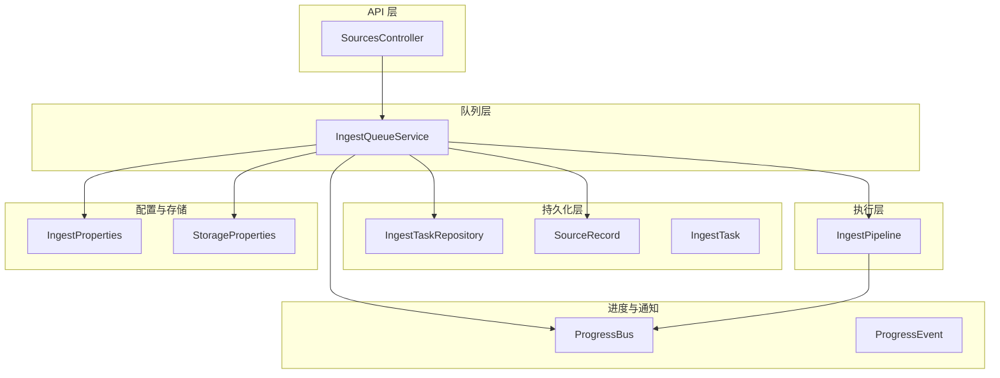
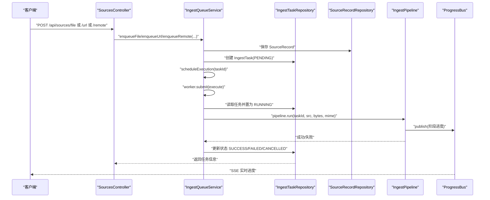
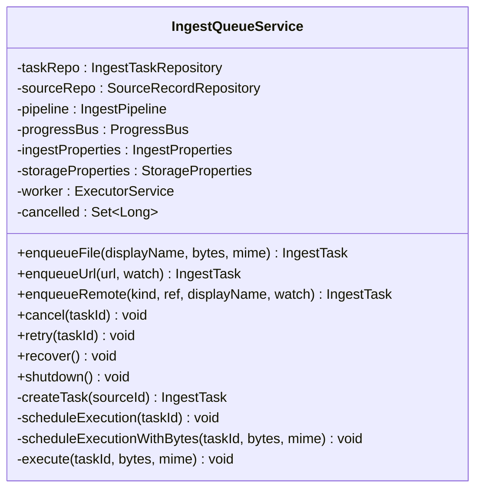
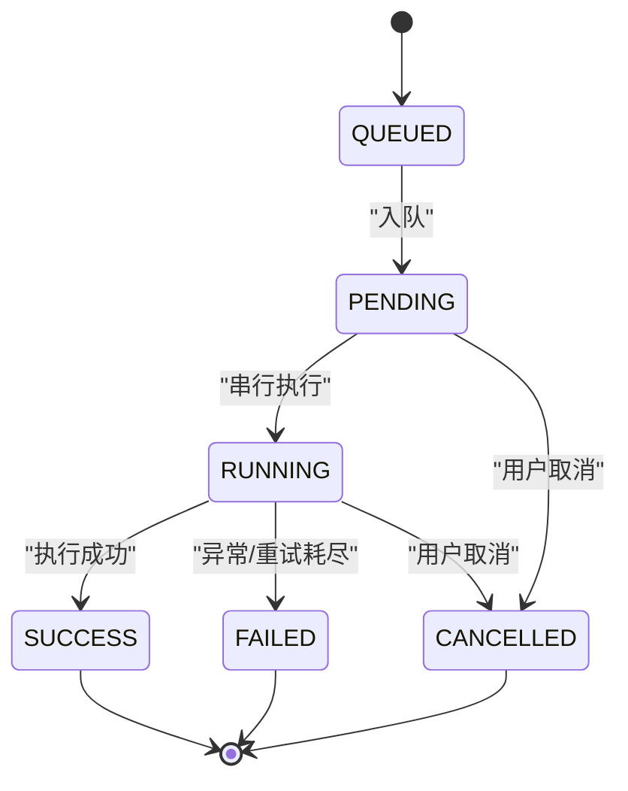
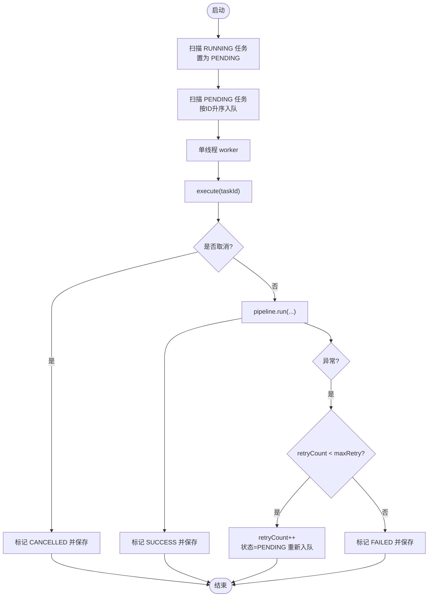
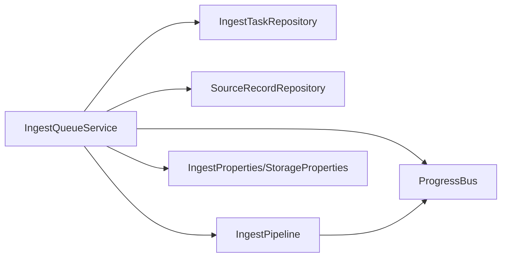
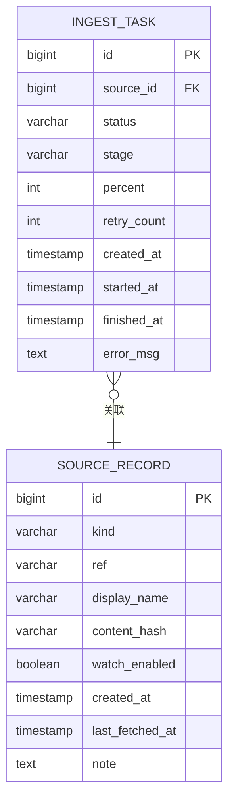

# 任务队列管理

<cite>
**本文引用的文件**
- [IngestQueueService.java](file://src/main/java/com/example/llmwiki/queue/IngestQueueService.java)
- [IngestTask.java](file://src/main/java/com/example/llmwiki/domain/IngestTask.java)
- [SourceRecord.java](file://src/main/java/com/example/llmwiki/domain/SourceRecord.java)
- [IngestProperties.java](file://src/main/java/com/example/llmwiki/config/IngestProperties.java)
- [StorageProperties.java](file://src/main/java/com/example/llmwiki/config/StorageProperties.java)
- [application.yml](file://src/main/resources/application.yml)
- [IngestTaskRepository.java](file://src/main/java/com/example/llmwiki/repository/IngestTaskRepository.java)
- [ProgressBus.java](file://src/main/java/com/example/llmwiki/progress/ProgressBus.java)
- [ProgressEvent.java](file://src/main/java/com/example/llmwiki/progress/ProgressEvent.java)
- [IngestPipeline.java](file://src/main/java/com/example/llmwiki/ingest/IngestPipeline.java)
- [SourcesController.java](file://src/main/java/com/example/llmwiki/api/SourcesController.java)
</cite>

## 目录
1. [简介](#简介)
2. [项目结构](#项目结构)
3. [核心组件](#核心组件)
4. [架构总览](#架构总览)
5. [详细组件分析](#详细组件分析)
6. [依赖分析](#依赖分析)
7. [性能考量](#性能考量)
8. [故障排查指南](#故障排查指南)
9. [结论](#结论)
10. [附录](#附录)

## 简介
本文件面向 LLM Wiki 的“任务队列管理”子系统，聚焦于 IngestQueueService 的实现与使用，系统性阐述以下主题：
- 队列管理机制与任务排队策略
- 优先级控制与调度策略
- 并发处理机制与资源分配
- 任务状态管理与生命周期
- 队列监控与性能指标
- 队列优化与扩展方案
- 配置与运维实践

## 项目结构
围绕任务队列管理的相关模块分布如下：
- 队列服务：IngestQueueService 负责注册来源、入队、执行、取消与重试
- 领域模型：IngestTask、SourceRecord 提供任务与来源的持久化结构
- 配置：IngestProperties、StorageProperties 提供队列与存储参数
- 仓库：IngestTaskRepository 提供任务查询与排序能力
- 进度总线：ProgressBus/ProgressEvent 提供 SSE 实时进度广播
- 管道：IngestPipeline 执行解析、分析、生成、索引与图谱构建
- 控制器：SourcesController 对外暴露入队与控制接口

图表来源
- [SourcesController.java:1-102](file://src/main/java/com/example/llmwiki/api/SourcesController.java#L1-L102)
- [IngestQueueService.java:1-214](file://src/main/java/com/example/llmwiki/queue/IngestQueueService.java#L1-L214)
- [IngestTaskRepository.java:1-18](file://src/main/java/com/example/llmwiki/repository/IngestTaskRepository.java#L1-L18)
- [IngestTask.java:1-62](file://src/main/java/com/example/llmwiki/domain/IngestTask.java#L1-L62)
- [SourceRecord.java:1-64](file://src/main/java/com/example/llmwiki/domain/SourceRecord.java#L1-L64)
- [IngestPipeline.java:1-251](file://src/main/java/com/example/llmwiki/ingest/IngestPipeline.java#L1-L251)
- [ProgressBus.java:1-61](file://src/main/java/com/example/llmwiki/progress/ProgressBus.java#L1-L61)
- [ProgressEvent.java:1-43](file://src/main/java/com/example/llmwiki/progress/ProgressEvent.java#L1-L43)
- [IngestProperties.java:1-33](file://src/main/java/com/example/llmwiki/config/IngestProperties.java#L1-L33)
- [StorageProperties.java:1-29](file://src/main/java/com/example/llmwiki/config/StorageProperties.java#L1-L29)

章节来源
- [SourcesController.java:1-102](file://src/main/java/com/example/llmwiki/api/SourcesController.java#L1-L102)
- [IngestQueueService.java:1-214](file://src/main/java/com/example/llmwiki/queue/IngestQueueService.java#L1-L214)
- [IngestTaskRepository.java:1-18](file://src/main/java/com/example/llmwiki/repository/IngestTaskRepository.java#L1-L18)
- [IngestTask.java:1-62](file://src/main/java/com/example/llmwiki/domain/IngestTask.java#L1-L62)
- [SourceRecord.java:1-64](file://src/main/java/com/example/llmwiki/domain/SourceRecord.java#L1-L64)
- [IngestPipeline.java:1-251](file://src/main/java/com/example/llmwiki/ingest/IngestPipeline.java#L1-L251)
- [ProgressBus.java:1-61](file://src/main/java/com/example/llmwiki/progress/ProgressBus.java#L1-L61)
- [ProgressEvent.java:1-43](file://src/main/java/com/example/llmwiki/progress/ProgressEvent.java#L1-L43)
- [IngestProperties.java:1-33](file://src/main/java/com/example/llmwiki/config/IngestProperties.java#L1-L33)
- [StorageProperties.java:1-29](file://src/main/java/com/example/llmwiki/config/StorageProperties.java#L1-L29)

## 核心组件
- IngestQueueService：单线程串行执行器 + DB 持久化 + 取消标志 + 失败重试
- IngestTask/SourceRecord：任务与来源的实体模型
- IngestProperties/StorageProperties：队列与存储配置
- IngestTaskRepository：任务查询与排序
- ProgressBus/ProgressEvent：SSE 实时进度广播
- IngestPipeline：两步式 CoT 流水线（解析→分析→生成→索引/图谱）

章节来源
- [IngestQueueService.java:1-214](file://src/main/java/com/example/llmwiki/queue/IngestQueueService.java#L1-L214)
- [IngestTask.java:1-62](file://src/main/java/com/example/llmwiki/domain/IngestTask.java#L1-L62)
- [SourceRecord.java:1-64](file://src/main/java/com/example/llmwiki/domain/SourceRecord.java#L1-L64)
- [IngestProperties.java:1-33](file://src/main/java/com/example/llmwiki/config/IngestProperties.java#L1-L33)
- [StorageProperties.java:1-29](file://src/main/java/com/example/llmwiki/config/StorageProperties.java#L1-L29)
- [IngestTaskRepository.java:1-18](file://src/main/java/com/example/llmwiki/repository/IngestTaskRepository.java#L1-L18)
- [ProgressBus.java:1-61](file://src/main/java/com/example/llmwiki/progress/ProgressBus.java#L1-L61)
- [ProgressEvent.java:1-43](file://src/main/java/com/example/llmwiki/progress/ProgressEvent.java#L1-L43)
- [IngestPipeline.java:1-251](file://src/main/java/com/example/llmwiki/ingest/IngestPipeline.java#L1-L251)

## 架构总览
下图展示了从 API 到队列、持久化、执行与进度广播的整体流程。

图表来源
- [SourcesController.java:45-78](file://src/main/java/com/example/llmwiki/api/SourcesController.java#L45-L78)
- [IngestQueueService.java:73-134](file://src/main/java/com/example/llmwiki/queue/IngestQueueService.java#L73-L134)
- [IngestPipeline.java:65-109](file://src/main/java/com/example/llmwiki/ingest/IngestPipeline.java#L65-L109)
- [ProgressBus.java:43-55](file://src/main/java/com/example/llmwiki/progress/ProgressBus.java#L43-L55)

## 详细组件分析

### IngestQueueService：队列管理与执行
- 单线程串行 worker：通过单线程池保证任务串行执行，避免并发冲突与资源竞争
- DB 持久化：任务状态与进度持久化至数据库，支持重启恢复
- 取消机制：通过并发集合记录取消任务 ID，在执行前检查并更新状态
- 失败重试：基于配置的最大重试次数，超过阈值则标记失败并停止重试
- 恢复逻辑：启动时将 RUNNING 任务重置为 PENDING 并重新入队，确保不丢失任务
- 进度广播：在关键阶段发布 ProgressEvent，前端通过 SSE 订阅

图表来源
- [IngestQueueService.java:36-214](file://src/main/java/com/example/llmwiki/queue/IngestQueueService.java#L36-L214)

章节来源
- [IngestQueueService.java:27-68](file://src/main/java/com/example/llmwiki/queue/IngestQueueService.java#L27-L68)
- [IngestQueueService.java:73-134](file://src/main/java/com/example/llmwiki/queue/IngestQueueService.java#L73-L134)
- [IngestQueueService.java:159-212](file://src/main/java/com/example/llmwiki/queue/IngestQueueService.java#L159-L212)

### 任务状态管理与生命周期
- 状态枚举：PENDING、RUNNING、SUCCESS、FAILED、CANCELLED、SKIPPED
- 生命周期：QUEUED → PENDING → RUNNING → SUCCESS/FAILED/CANCELLED
- 阶段：PARSE、ANALYZE、GENERATE、INDEX、GRAPH、DONE
- 进度：0-100，结合阶段与消息实时广播
- 恢复：应用重启后将 RUNNING 任务重置为 PENDING 并重新入队

图表来源
- [IngestTask.java:38-47](file://src/main/java/com/example/llmwiki/domain/IngestTask.java#L38-L47)
- [ProgressEvent.java:28-38](file://src/main/java/com/example/llmwiki/progress/ProgressEvent.java#L28-L38)
- [IngestPipeline.java:65-109](file://src/main/java/com/example/llmwiki/ingest/IngestPipeline.java#L65-L109)

章节来源
- [IngestTask.java:38-60](file://src/main/java/com/example/llmwiki/domain/IngestTask.java#L38-L60)
- [ProgressEvent.java:28-38](file://src/main/java/com/example/llmwiki/progress/ProgressEvent.java#L28-L38)
- [IngestPipeline.java:65-109](file://src/main/java/com/example/llmwiki/ingest/IngestPipeline.java#L65-L109)

### 任务调度策略与排队机制
- FIFO 排队：按任务 ID 升序取出 RUNNING/PENDING 任务，保证公平性
- 串行执行：单线程 worker 串行执行，避免资源争用
- 无显式优先级：当前实现未对不同来源或任务类型设置优先级权重
- 负载均衡：单 worker，无跨节点分发；可通过扩展为多 worker 实现并行化（见扩展建议）

图表来源
- [IngestQueueService.java:53-63](file://src/main/java/com/example/llmwiki/queue/IngestQueueService.java#L53-L63)
- [IngestQueueService.java:159-212](file://src/main/java/com/example/llmwiki/queue/IngestQueueService.java#L159-L212)
- [IngestTaskRepository.java:16](file://src/main/java/com/example/llmwiki/repository/IngestTaskRepository.java#L16)

章节来源
- [IngestQueueService.java:53-63](file://src/main/java/com/example/llmwiki/queue/IngestQueueService.java#L53-L63)
- [IngestTaskRepository.java:16](file://src/main/java/com/example/llmwiki/repository/IngestTaskRepository.java#L16)

### 并发处理机制与资源分配
- 线程池：单线程 executor，守护线程，名称为 ingest-worker
- 并发数量：当前为 1，避免并发写入与资源竞争
- 资源分配：I/O 与 LLM 调用由 IngestPipeline 承担，队列层仅负责串行编排
- 取消与重试：通过内存集合与数据库状态协同控制

章节来源
- [IngestQueueService.java:45-49](file://src/main/java/com/example/llmwiki/queue/IngestQueueService.java#L45-L49)
- [IngestQueueService.java:115-134](file://src/main/java/com/example/llmwiki/queue/IngestQueueService.java#L115-L134)

### 队列监控与性能指标
- 进度事件：通过 ProgressBus 发布阶段、百分比、状态与消息
- SSE 订阅：前端通过 subscribe 获取最近 50 条事件，实现实时进度
- 任务列表：SourcesController 提供最近 50 条任务查询接口
- 性能指标建议：可扩展采集执行耗时、吞吐量、错误率等（见优化建议）

章节来源
- [ProgressBus.java:26-60](file://src/main/java/com/example/llmwiki/progress/ProgressBus.java#L26-L60)
- [SourcesController.java:63-66](file://src/main/java/com/example/llmwiki/api/SourcesController.java#L63-L66)
- [IngestPipeline.java:245-249](file://src/main/java/com/example/llmwiki/ingest/IngestPipeline.java#L245-L249)

### 队列优化与扩展
- 队列扩容：将单 worker 替换为固定大小线程池，按 CPU/IO 特性调整线程数
- 性能调优：引入任务优先级队列（如按来源类型、大小、紧急度），实现多级调度
- 内存管理：限制单任务最大内容大小，避免内存峰值；对大文件采用流式处理
- 异常处理：增强异常分类与退避策略；增加熔断与隔离
- 故障恢复：扩展恢复策略，支持部分失败重试与幂等处理
- 配置化：将重试间隔、超时、队列深度等参数化，支持动态调整

章节来源
- [IngestProperties.java:22-25](file://src/main/java/com/example/llmwiki/config/IngestProperties.java#L22-L25)
- [application.yml:75-76](file://src/main/resources/application.yml#L75-L76)

### 队列维护与运维
- 启动恢复：自动将 RUNNING 任务重置为 PENDING 并重新入队
- 关闭清理：销毁 worker 线程池，确保优雅停机
- 任务控制：支持取消与重试，便于人工干预
- 日志与告警：结合进度事件与错误信息，建立统一日志与告警通道

章节来源
- [IngestQueueService.java:53-68](file://src/main/java/com/example/llmwiki/queue/IngestQueueService.java#L53-L68)
- [IngestQueueService.java:115-134](file://src/main/java/com/example/llmwiki/queue/IngestQueueService.java#L115-L134)

### 队列配置
- 队列大小：当前未显式限制队列长度，建议通过数据库分页与限流控制
- 超时配置：任务执行超时由上游 IngestPipeline 与 LLM 客户端控制
- 重试机制：最大重试次数由 IngestProperties 配置，默认 3 次
- 存储路径：raw 目录用于持久化原始文件，便于失败重试与审计

章节来源
- [IngestProperties.java:22-25](file://src/main/java/com/example/llmwiki/config/IngestProperties.java#L22-L25)
- [application.yml:75-76](file://src/main/resources/application.yml#L75-L76)
- [StorageProperties.java:20-21](file://src/main/java/com/example/llmwiki/config/StorageProperties.java#L20-L21)

### 队列扩展与插件化
- 自定义队列策略：可替换为优先级队列、多级队列或多 worker 并行
- 插件化设计：将解析器、LLM 客户端、索引器抽象为 SPI，便于替换与扩展
- 第三方集成：通过 SourceRecord.kind 支持飞书、钉钉等远程来源，未来可扩展更多来源类型

章节来源
- [SourceRecord.java:35-37](file://src/main/java/com/example/llmwiki/domain/SourceRecord.java#L35-L37)
- [SourcesController.java:55-61](file://src/main/java/com/example/llmwiki/api/SourcesController.java#L55-L61)

## 依赖分析
- 组件耦合：IngestQueueService 依赖仓库、管道、进度总线与配置，职责清晰
- 外部依赖：JPA/H2 数据库、Spring 线程池、SSE
- 循环依赖：未发现循环依赖
- 可能风险：单 worker 在高并发场景可能成为瓶颈，需评估并行化

图表来源
- [IngestQueueService.java:38-43](file://src/main/java/com/example/llmwiki/queue/IngestQueueService.java#L38-L43)
- [IngestPipeline.java:62](file://src/main/java/com/example/llmwiki/ingest/IngestPipeline.java#L62)

章节来源
- [IngestQueueService.java:38-43](file://src/main/java/com/example/llmwiki/queue/IngestQueueService.java#L38-L43)
- [IngestPipeline.java:62](file://src/main/java/com/example/llmwiki/ingest/IngestPipeline.java#L62)

## 性能考量
- 单线程串行：简单可靠，但吞吐受限；适合中小规模数据
- I/O 与 LLM：瓶颈通常在外部服务与磁盘 I/O，队列层串行有利于稳定性
- 建议优化：引入多 worker、任务优先级、批量处理与背压控制

[本节为通用指导，无需特定文件引用]

## 故障排查指南
- 任务卡住：检查 RUNNING 任务是否被意外保留，确认恢复逻辑是否执行
- 取消无效：确认 cancelled 集合是否正确添加，以及执行前检查逻辑
- 重试过多：核对最大重试配置与异常原因，必要时降低重试次数
- 进度不更新：检查 ProgressBus 订阅与 SSE 连接状态

章节来源
- [IngestQueueService.java:53-63](file://src/main/java/com/example/llmwiki/queue/IngestQueueService.java#L53-L63)
- [IngestQueueService.java:115-134](file://src/main/java/com/example/llmwiki/queue/IngestQueueService.java#L115-L134)
- [ProgressBus.java:26-60](file://src/main/java/com/example/llmwiki/progress/ProgressBus.java#L26-L60)

## 结论
IngestQueueService 以“DB 持久化 + 单线程串行 worker + 取消标志 + 失败重试”的简洁设计，实现了稳定可靠的任务队列管理。当前实现强调一致性与可恢复性，适合中小规模与对顺序敏感的场景。若业务增长带来高并发需求，可在保持一致性的前提下引入多 worker、优先级队列与更丰富的监控指标，以实现性能与可靠性之间的平衡。

[本节为总结性内容，无需特定文件引用]

## 附录

### 数据模型

图表来源
- [IngestTask.java:31-60](file://src/main/java/com/example/llmwiki/domain/IngestTask.java#L31-L60)
- [SourceRecord.java:31-62](file://src/main/java/com/example/llmwiki/domain/SourceRecord.java#L31-L62)

### API 使用要点
- 文件入队：POST /api/sources/file
- URL 入队：POST /api/sources/url
- 远程来源入队：POST /api/sources/remote
- 任务列表：GET /api/sources/tasks
- 取消任务：POST /api/sources/tasks/{id}/cancel
- 重试任务：POST /api/sources/tasks/{id}/retry

章节来源
- [SourcesController.java:45-78](file://src/main/java/com/example/llmwiki/api/SourcesController.java#L45-L78)
- [SourcesController.java:63-78](file://src/main/java/com/example/llmwiki/api/SourcesController.java#L63-L78)