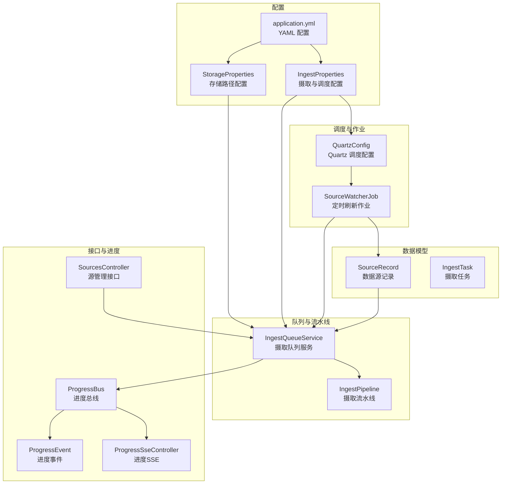
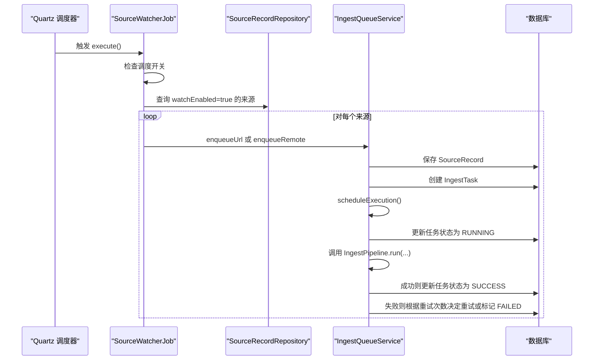
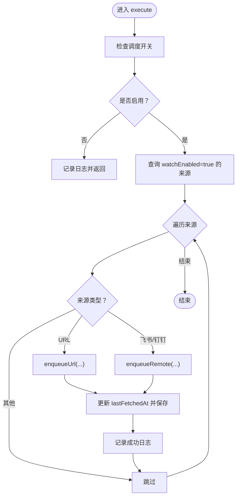
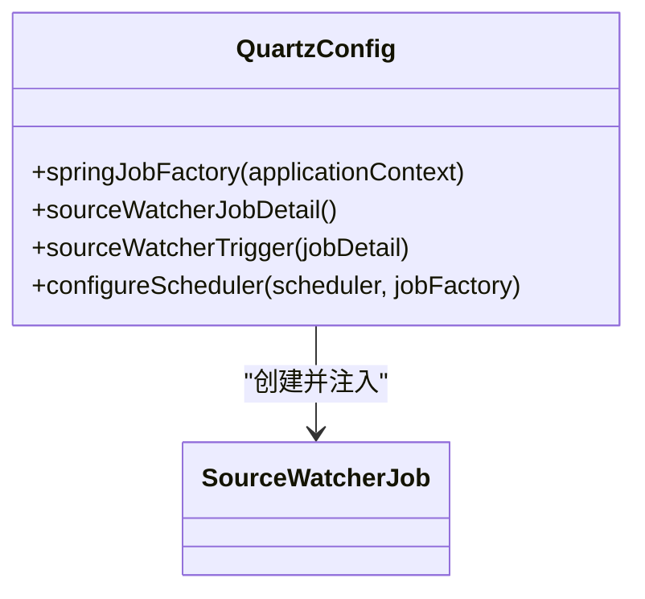
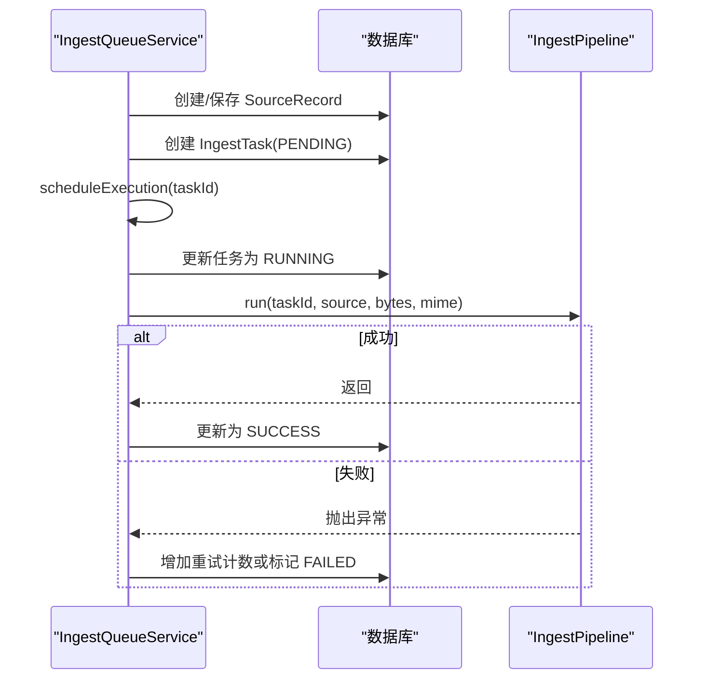
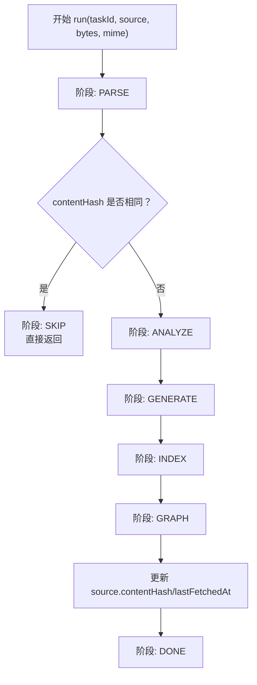
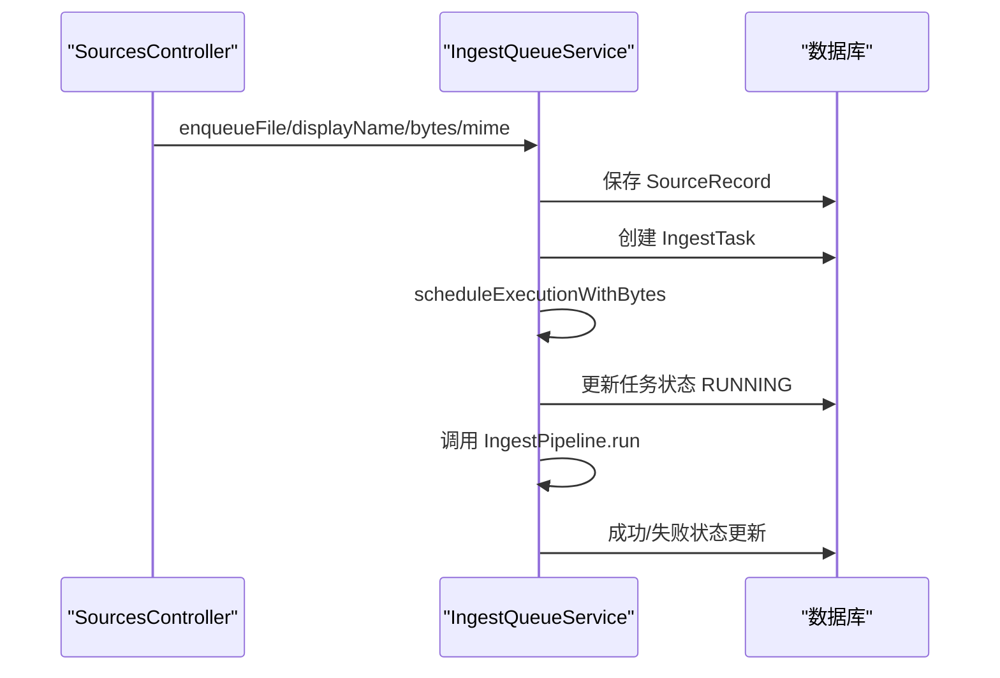
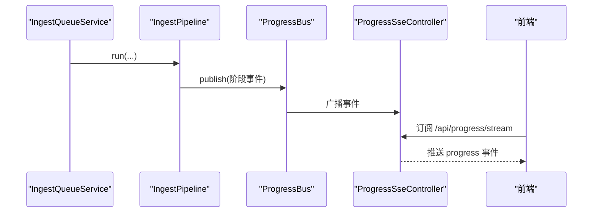
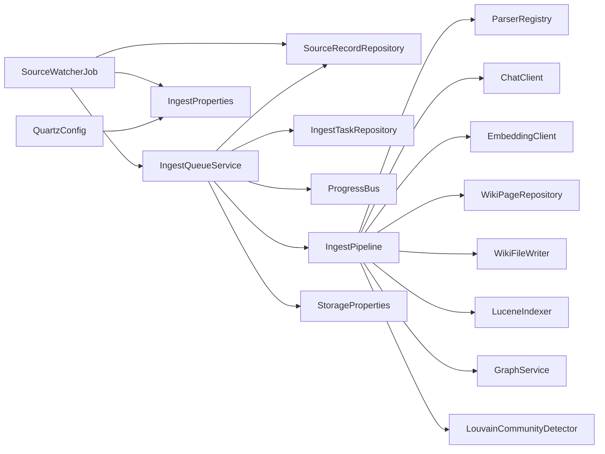

# 源文件监控作业

<cite>
**本文引用的文件**
- [SourceWatcherJob.java](file://src/main/java/com/example/llmwiki/scheduler/SourceWatcherJob.java)
- [QuartzConfig.java](file://src/main/java/com/example/llmwiki/scheduler/QuartzConfig.java)
- [IngestProperties.java](file://src/main/java/com/example/llmwiki/config/IngestProperties.java)
- [StorageProperties.java](file://src/main/java/com/example/llmwiki/config/StorageProperties.java)
- [SourceRecordRepository.java](file://src/main/java/com/example/llmwiki/repository/SourceRecordRepository.java)
- [SourceRecord.java](file://src/main/java/com/example/llmwiki/domain/SourceRecord.java)
- [IngestTask.java](file://src/main/java/com/example/llmwiki/domain/IngestTask.java)
- [IngestQueueService.java](file://src/main/java/com/example/llmwiki/queue/IngestQueueService.java)
- [IngestPipeline.java](file://src/main/java/com/example/llmwiki/ingest/IngestPipeline.java)
- [SourcesController.java](file://src/main/java/com/example/llmwiki/api/SourcesController.java)
- [ProgressSseController.java](file://src/main/java/com/example/llmwiki/api/ProgressSseController.java)
- [ProgressBus.java](file://src/main/java/com/example/llmwiki/progress/ProgressBus.java)
- [ProgressEvent.java](file://src/main/java/com/example/llmwiki/progress/ProgressEvent.java)
- [application.yml](file://src/main/resources/application.yml)
</cite>

## 目录
1. [简介](#简介)
2. [项目结构](#项目结构)
3. [核心组件](#核心组件)
4. [架构总览](#架构总览)
5. [详细组件分析](#详细组件分析)
6. [依赖分析](#依赖分析)
7. [性能考虑](#性能考虑)
8. [故障排查指南](#故障排查指南)
9. [结论](#结论)
10. [附录](#附录)

## 简介
本文件面向“源文件监控作业”的技术文档，聚焦于 SourceWatcherJob 的实现与运行机制，涵盖以下主题：
- 作业执行逻辑与控制流
- 文件系统监控策略与变化检测机制
- 自动触发处理流程：文件上传检测、摄取任务创建、队列调度
- 监控配置：调度间隔、开关与 Cron 设置
- 监控优化：吞吐、内存与 I/O 优化建议
- 监控日志：执行记录、错误日志与调试信息
- 监控维护：状态检查、异常恢复、配置更新
- 监控 API：状态查询、手动触发、批量处理能力

需要特别说明的是：当前代码库中，SourceWatcherJob 仅针对“远程来源”（URL、飞书、钉钉）进行定时刷新，并不直接监听本地文件系统变化。对于本地文件的“上传即摄取”，由 SourcesController 提供上传接口，经 IngestQueueService 入队并交由 IngestPipeline 处理。

## 项目结构
围绕“源文件监控作业”，涉及的关键模块如下：
- 调度与作业层：QuartzConfig、SourceWatcherJob
- 配置层：IngestProperties、StorageProperties、application.yml
- 数据模型层：SourceRecord、IngestTask
- 队列与流水线：IngestQueueService、IngestPipeline
- 控制器与进度推送：SourcesController、ProgressSseController、ProgressBus、ProgressEvent

**图表来源**
- [QuartzConfig.java:1-90](file://src/main/java/com/example/llmwiki/scheduler/QuartzConfig.java#L1-L90)
- [SourceWatcherJob.java:1-68](file://src/main/java/com/example/llmwiki/scheduler/SourceWatcherJob.java#L1-L68)
- [IngestProperties.java:1-33](file://src/main/java/com/example/llmwiki/config/IngestProperties.java#L1-L33)
- [StorageProperties.java:1-29](file://src/main/java/com/example/llmwiki/config/StorageProperties.java#L1-L29)
- [SourceRecord.java:1-64](file://src/main/java/com/example/llmwiki/domain/SourceRecord.java#L1-L64)
- [IngestTask.java:1-62](file://src/main/java/com/example/llmwiki/domain/IngestTask.java#L1-L62)
- [IngestQueueService.java:1-214](file://src/main/java/com/example/llmwiki/queue/IngestQueueService.java#L1-L214)
- [IngestPipeline.java:1-251](file://src/main/java/com/example/llmwiki/ingest/IngestPipeline.java#L1-L251)
- [SourcesController.java:1-102](file://src/main/java/com/example/llmwiki/api/SourcesController.java#L1-L102)
- [ProgressSseController.java:1-36](file://src/main/java/com/example/llmwiki/api/ProgressSseController.java#L1-L36)
- [ProgressBus.java:1-60](file://src/main/java/com/example/llmwiki/progress/ProgressBus.java#L1-L60)
- [ProgressEvent.java:1-42](file://src/main/java/com/example/llmwiki/progress/ProgressEvent.java#L1-L42)
- [application.yml:1-84](file://src/main/resources/application.yml#L1-L84)

**章节来源**
- [QuartzConfig.java:1-90](file://src/main/java/com/example/llmwiki/scheduler/QuartzConfig.java#L1-L90)
- [SourceWatcherJob.java:1-68](file://src/main/java/com/example/llmwiki/scheduler/SourceWatcherJob.java#L1-L68)
- [application.yml:1-84](file://src/main/resources/application.yml#L1-L84)

## 核心组件
- SourceWatcherJob：基于 Quartz 的定时作业，扫描 watchEnabled=true 的远程来源（URL、飞书、钉钉），为其创建摄取任务并入队，同时更新 lastFetchedAt。
- QuartzConfig：配置 Quartz 调度器，注入 Spring Bean，按 IngestProperties 中的 cron 表达式启动 SourceWatcherJob。
- IngestProperties：定义调度开关与 Cron 表达式，以及摄取最大重试次数与工作线程数等。
- IngestQueueService：负责将来源注册为 SourceRecord，创建 IngestTask，调度执行，支持取消与重试，单线程串行执行以保证顺序一致性。
- IngestPipeline：两阶段处理（解析→分析→生成→索引/图谱），支持增量跳过（基于 contentHash）。
- SourcesController：提供文件上传、URL/远程来源提交接口，用于“上传即摄取”的场景。
- ProgressSseController/ProgressBus/ProgressEvent：提供进度事件的 SSE 推送与历史保留，便于前端实时查看。

**章节来源**
- [SourceWatcherJob.java:18-66](file://src/main/java/com/example/llmwiki/scheduler/SourceWatcherJob.java#L18-L66)
- [QuartzConfig.java:36-88](file://src/main/java/com/example/llmwiki/scheduler/QuartzConfig.java#L36-L88)
- [IngestProperties.java:21-31](file://src/main/java/com/example/llmwiki/config/IngestProperties.java#L21-L31)
- [IngestQueueService.java:36-214](file://src/main/java/com/example/llmwiki/queue/IngestQueueService.java#L36-L214)
- [IngestPipeline.java:45-109](file://src/main/java/com/example/llmwiki/ingest/IngestPipeline.java#L45-L109)
- [SourcesController.java:40-84](file://src/main/java/com/example/llmwiki/api/SourcesController.java#L40-L84)
- [ProgressSseController.java:20-36](file://src/main/java/com/example/llmwiki/api/ProgressSseController.java#L20-L36)
- [ProgressBus.java:17-60](file://src/main/java/com/example/llmwiki/progress/ProgressBus.java#L17-L60)
- [ProgressEvent.java:16-42](file://src/main/java/com/example/llmwiki/progress/ProgressEvent.java#L16-L42)

## 架构总览
下图展示了 SourceWatcherJob 的执行路径与关键交互点：

**图表来源**
- [SourceWatcherJob.java:37-66](file://src/main/java/com/example/llmwiki/scheduler/SourceWatcherJob.java#L37-L66)
- [SourceRecordRepository.java:13-20](file://src/main/java/com/example/llmwiki/repository/SourceRecordRepository.java#L13-L20)
- [IngestQueueService.java:93-113](file://src/main/java/com/example/llmwiki/queue/IngestQueueService.java#L93-L113)
- [IngestPipeline.java:65-109](file://src/main/java/com/example/llmwiki/ingest/IngestPipeline.java#L65-L109)

## 详细组件分析

### SourceWatcherJob 组件分析
- 执行入口：execute(JobExecutionContext)，在调度器触发时运行。
- 开关控制：读取 IngestProperties.scheduler.enabled，若关闭则跳过本轮。
- 来源筛选：通过 SourceRecordRepository.findByWatchEnabledTrue() 获取所有启用定时刷新的来源。
- 类型分派：根据 kind 字段区分 URL、飞书、钉钉三类远程来源，分别调用 enqueueUrl 或 enqueueRemote。
- 任务创建与更新：调用 IngestQueueService 创建 IngestTask，并更新 SourceRecord.lastFetchedAt。
- 错误处理：捕获异常并记录告警日志，不影响其他来源的处理。

**图表来源**
- [SourceWatcherJob.java:37-66](file://src/main/java/com/example/llmwiki/scheduler/SourceWatcherJob.java#L37-L66)
- [SourceRecordRepository.java:19](file://src/main/java/com/example/llmwiki/repository/SourceRecordRepository.java#L19)
- [IngestQueueService.java:93-113](file://src/main/java/com/example/llmwiki/queue/IngestQueueService.java#L93-L113)

**章节来源**
- [SourceWatcherJob.java:18-66](file://src/main/java/com/example/llmwiki/scheduler/SourceWatcherJob.java#L18-L66)

### QuartzConfig 组件分析
- JobFactory：通过 Spring 容器实例化 Quartz Job，确保依赖注入可用。
- JobDetail：定义 SourceWatcherJob 的 JobDetail，storeDurably 以便持久化。
- Trigger：基于 IngestProperties.scheduler.cron 构建 CronTrigger。
- 调度器装配：在容器启动后注入 JobFactory，使 Quartz 能正确解析 Spring Bean。

**图表来源**
- [QuartzConfig.java:36-88](file://src/main/java/com/example/llmwiki/scheduler/QuartzConfig.java#L36-L88)
- [SourceWatcherJob.java:31](file://src/main/java/com/example/llmwiki/scheduler/SourceWatcherJob.java#L31)

**章节来源**
- [QuartzConfig.java:22-88](file://src/main/java/com/example/llmwiki/scheduler/QuartzConfig.java#L22-L88)

### IngestQueueService 组件分析
- 单线程串行执行：使用单线程 ExecutorService，避免并发冲突，保证任务顺序。
- 恢复机制：应用启动时将 RUNNING 任务重置为 PENDING 并重新调度，确保未完成任务得以继续。
- 入队与执行：enqueueFile/enqueueUrl/enqueueRemote 创建 SourceRecord 与 IngestTask，并通过 scheduleExecution 调度执行。
- 执行流程：设置 RUNNING、调用 IngestPipeline.run、根据结果更新状态或重试。
- 取消与重试：支持取消 PENDING 任务、重置 FAILED 任务为 PENDING 并清空错误信息后重新入队。

**图表来源**
- [IngestQueueService.java:53-63](file://src/main/java/com/example/llmwiki/queue/IngestQueueService.java#L53-L63)
- [IngestQueueService.java:159-212](file://src/main/java/com/example/llmwiki/queue/IngestQueueService.java#L159-L212)
- [IngestPipeline.java:65-109](file://src/main/java/com/example/llmwiki/ingest/IngestPipeline.java#L65-L109)

**章节来源**
- [IngestQueueService.java:36-214](file://src/main/java/com/example/llmwiki/queue/IngestQueueService.java#L36-L214)

### IngestPipeline 组件分析
- 增量跳过：比较 SourceRecord.contentHash 与解析后的 RawDocument.contentHash，一致则跳过后续步骤。
- 两阶段处理：解析 → 分析 → 生成 → 索引/图谱，期间发布 ProgressEvent。
- 结果落库：持久化 WikiPage，写入 Markdown 文件，同步向量嵌入至 Lucene 索引。
- 图谱更新：更新图谱节点与边，执行社区检测并持久化。

**图表来源**
- [IngestPipeline.java:65-109](file://src/main/java/com/example/llmwiki/ingest/IngestPipeline.java#L65-L109)

**章节来源**
- [IngestPipeline.java:45-109](file://src/main/java/com/example/llmwiki/ingest/IngestPipeline.java#L45-L109)

### SourcesController 与上传即摄取
- 文件上传：接收 MultipartFile，调用 IngestQueueService.enqueueFile，创建任务并异步执行。
- URL/远程来源：支持提交 URL 与飞书/钉钉来源，可选择是否启用 watchEnabled。
- 任务管理：提供取消与重试接口，配合 IngestQueueService 的取消/重试逻辑。

**图表来源**
- [SourcesController.java:45-61](file://src/main/java/com/example/llmwiki/api/SourcesController.java#L45-L61)
- [IngestQueueService.java:73-91](file://src/main/java/com/example/llmwiki/queue/IngestQueueService.java#L73-L91)

**章节来源**
- [SourcesController.java:40-84](file://src/main/java/com/example/llmwiki/api/SourcesController.java#L40-L84)
- [IngestQueueService.java:70-113](file://src/main/java/com/example/llmwiki/queue/IngestQueueService.java#L70-L113)

### 进度推送与前端集成
- ProgressBus：维护 SSE 订阅者列表，广播 ProgressEvent，并保留最近 50 条事件。
- ProgressSseController：提供 /api/progress/stream 与 /api/progress/recent 接口。
- 前端通过 EventSource 订阅进度流，实时显示任务状态与阶段。

**图表来源**
- [IngestPipeline.java:245-249](file://src/main/java/com/example/llmwiki/ingest/IngestPipeline.java#L245-L249)
- [ProgressBus.java:43-55](file://src/main/java/com/example/llmwiki/progress/ProgressBus.java#L43-L55)
- [ProgressSseController.java:27-35](file://src/main/java/com/example/llmwiki/api/ProgressSseController.java#L27-L35)

**章节来源**
- [ProgressBus.java:17-60](file://src/main/java/com/example/llmwiki/progress/ProgressBus.java#L17-L60)
- [ProgressSseController.java:20-36](file://src/main/java/com/example/llmwiki/api/ProgressSseController.java#L20-L36)
- [ProgressEvent.java:16-42](file://src/main/java/com/example/llmwiki/progress/ProgressEvent.java#L16-L42)

## 依赖分析
- SourceWatcherJob 依赖：
  - SourceRecordRepository：查询 watchEnabled=true 的来源
  - IngestQueueService：创建摄取任务并入队
  - IngestProperties：读取调度开关与 Cron
- QuartzConfig 依赖：
  - IngestProperties：读取 cron 配置
  - Spring ApplicationContext：注入 JobFactory
- IngestQueueService 依赖：
  - IngestTaskRepository、SourceRecordRepository、ProgressBus、IngestPipeline、StorageProperties
- IngestPipeline 依赖：
  - ParserRegistry、ChatClient、EmbeddingClient、PromptTemplates、WikiPageRepository、WikiFileWriter、LuceneIndexer、GraphService、LouvainCommunityDetector、ProgressBus

**图表来源**
- [SourceWatcherJob.java:33-35](file://src/main/java/com/example/llmwiki/scheduler/SourceWatcherJob.java#L33-L35)
- [QuartzConfig.java:36](file://src/main/java/com/example/llmwiki/scheduler/QuartzConfig.java#L36)
- [IngestQueueService.java:38-43](file://src/main/java/com/example/llmwiki/queue/IngestQueueService.java#L38-L43)
- [IngestPipeline.java:52-62](file://src/main/java/com/example/llmwiki/ingest/IngestPipeline.java#L52-L62)

**章节来源**
- [SourceWatcherJob.java:33-35](file://src/main/java/com/example/llmwiki/scheduler/SourceWatcherJob.java#L33-L35)
- [QuartzConfig.java:36](file://src/main/java/com/example/llmwiki/scheduler/QuartzConfig.java#L36)
- [IngestQueueService.java:38-43](file://src/main/java/com/example/llmwiki/queue/IngestQueueService.java#L38-L43)
- [IngestPipeline.java:52-62](file://src/main/java/com/example/llmwiki/ingest/IngestPipeline.java#L52-L62)

## 性能考虑
- 单线程串行执行：IngestQueueService 使用单线程 worker，避免并发竞争，但吞吐受限。可通过调整 worker-threads 参数提升并发（注意与业务一致性权衡）。
- 增量跳过：IngestPipeline 基于 contentHash 实现内容未变时的快速跳过，显著降低重复处理成本。
- I/O 优化：原始文件写入 raw 目录，建议确保磁盘具备足够吞吐与低延迟；对大文件建议限制大小或采用流式处理。
- 内存使用：ProgressBus 仅保留最近 50 条事件，避免长期积累导致内存膨胀；建议结合前端订阅生命周期管理。
- 重试策略：最大重试次数由 IngestProperties.ingest.maxRetry 控制，默认 3 次，避免无限重试造成资源占用。

[本节为通用性能建议，无需特定文件引用]

## 故障排查指南
- 调度未执行
  - 检查 IngestProperties.scheduler.enabled 是否为 true
  - 检查 application.yml 中 scheduler.cron 配置是否正确
  - 查看 QuartzConfig 是否成功注入 JobFactory
- 任务状态异常
  - 应用重启后 RUNNING 任务会自动恢复为 PENDING 并重新调度
  - 若任务长时间处于 PENDING，检查 worker 线程池与任务执行耗时
- 远程来源刷新失败
  - 查看 SourceWatcherJob 日志中的警告信息，定位具体来源与错误原因
  - 确认 URL/飞书/钉钉来源的可用性与鉴权配置
- 增量跳过问题
  - 若内容已更新但未重新处理，确认 contentHash 是否正确计算与保存
- 进度未推送
  - 确认 ProgressSseController 路径与前端 EventSource 订阅是否正常
  - 检查 ProgressBus 的订阅者数量与 SSE 连接状态

**章节来源**
- [IngestProperties.java:28-31](file://src/main/java/com/example/llmwiki/config/IngestProperties.java#L28-L31)
- [application.yml:71-76](file://src/main/resources/application.yml#L71-L76)
- [QuartzConfig.java:85-88](file://src/main/java/com/example/llmwiki/scheduler/QuartzConfig.java#L85-L88)
- [IngestQueueService.java:53-63](file://src/main/java/com/example/llmwiki/queue/IngestQueueService.java#L53-L63)
- [SourceWatcherJob.java:62-64](file://src/main/java/com/example/llmwiki/scheduler/SourceWatcherJob.java#L62-L64)
- [IngestPipeline.java:76-80](file://src/main/java/com/example/llmwiki/ingest/IngestPipeline.java#L76-L80)
- [ProgressSseController.java:27-35](file://src/main/java/com/example/llmwiki/api/ProgressSseController.java#L27-L35)
- [ProgressBus.java:26-55](file://src/main/java/com/example/llmwiki/progress/ProgressBus.java#L26-L55)

## 结论
- SourceWatcherJob 专注于“远程来源”的定时刷新，不直接监听本地文件系统变化。
- “上传即摄取”由 SourcesController 与 IngestQueueService 协同完成，适合本地文件与远程链接的即时处理。
- 增量跳过与单线程串行执行在保证一致性的同时限制了吞吐，需结合业务场景调整并发与重试策略。
- 通过 QuartzConfig 与 IngestProperties 实现灵活的调度配置，配合 ProgressBus 提供良好的可观测性。

[本节为总结性内容，无需特定文件引用]

## 附录

### 监控配置清单
- 调度开关与 Cron
  - 配置项：llm-wiki.scheduler.enabled、llm-wiki.scheduler.cron
  - 默认值：enabled=true、cron=每日凌晨三点
  - 生效方式：修改后需重启以应用新的 Cron
- 摄取参数
  - llm-wiki.ingest.max-retry：默认 3
  - llm-wiki.ingest.worker-threads：默认 1（单线程）
- 存储路径
  - llm-wiki.storage.raw-dir：原始文件存放目录
  - llm-wiki.storage.wiki-dir：生成的 Markdown 输出目录
  - llm-wiki.storage.index-dir：Lucene 索引目录
  - llm-wiki.storage.graph-dir：图谱持久化目录

**章节来源**
- [application.yml:71-76](file://src/main/resources/application.yml#L71-L76)
- [IngestProperties.java:21-31](file://src/main/java/com/example/llmwiki/config/IngestProperties.java#L21-L31)
- [StorageProperties.java:18-27](file://src/main/java/com/example/llmwiki/config/StorageProperties.java#L18-L27)

### 监控 API 一览
- 列表与提交
  - GET /api/sources：列出所有来源
  - POST /api/sources/file：上传文件并入队
  - POST /api/sources/url：提交 URL 并可选启用 watch
  - POST /api/sources/remote：提交飞书/钉钉来源并可选启用 watch
- 任务管理
  - GET /api/sources/tasks：最近任务列表
  - POST /api/sources/tasks/{id}/cancel：取消任务
  - POST /api/sources/tasks/{id}/retry：重试任务
  - DELETE /api/sources/{id}：删除来源
- 进度推送
  - GET /api/progress/stream：SSE 实时进度流
  - GET /api/progress/recent：最近 50 条进度事件

**章节来源**
- [SourcesController.java:40-84](file://src/main/java/com/example/llmwiki/api/SourcesController.java#L40-L84)
- [ProgressSseController.java:27-35](file://src/main/java/com/example/llmwiki/api/ProgressSseController.java#L27-L35)