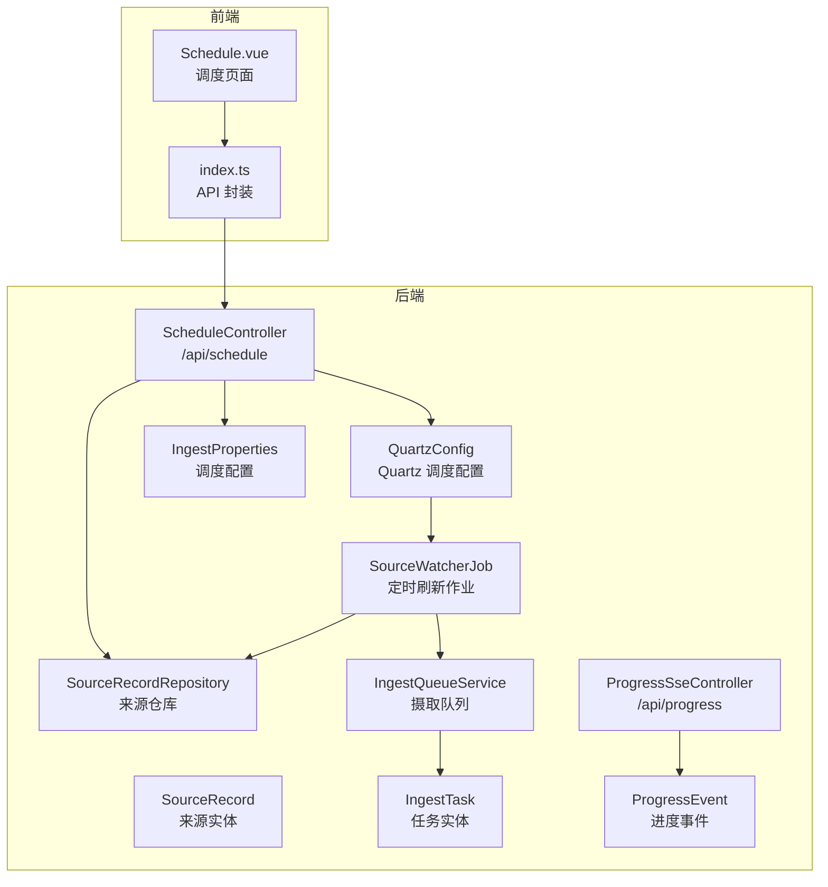
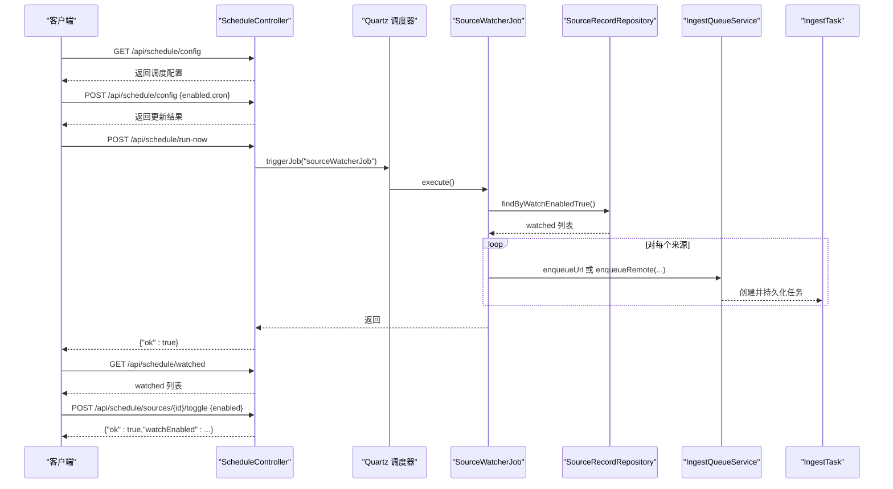
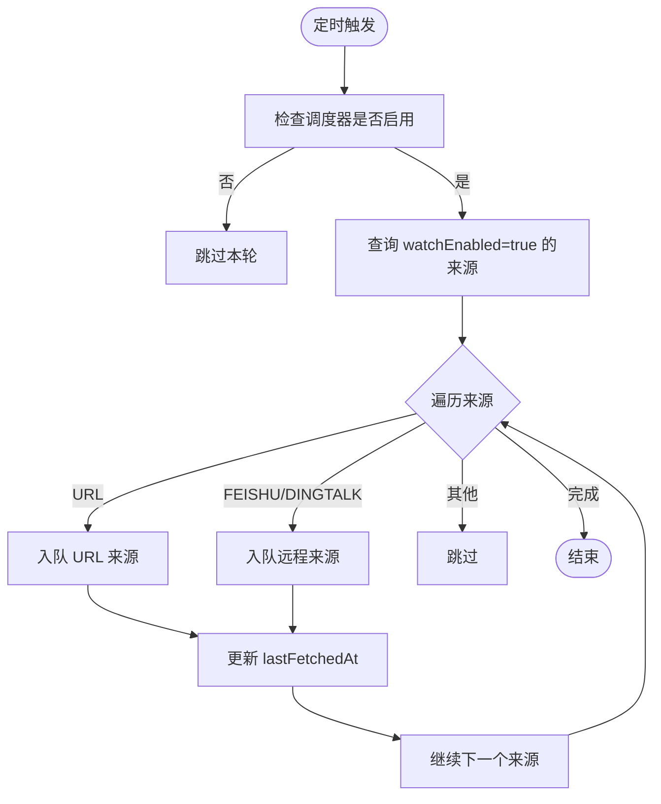
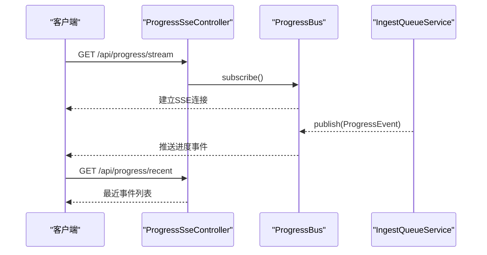
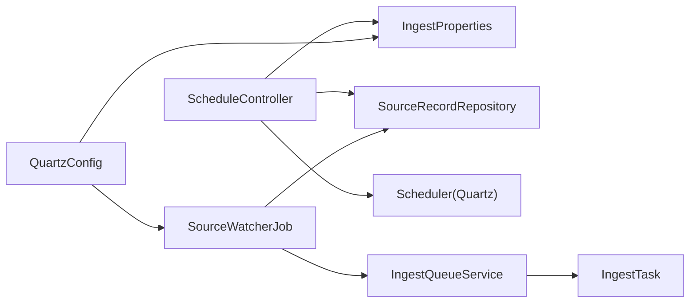
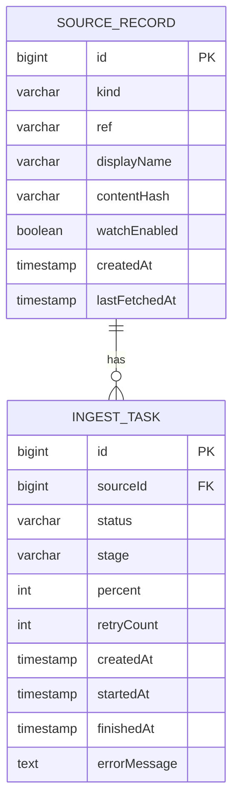

# 调度API接口

<cite>
**本文引用的文件**
- [ScheduleController.java](file://src/main/java/com/example/llmwiki/api/ScheduleController.java)
- [QuartzConfig.java](file://src/main/java/com/example/llmwiki/scheduler/QuartzConfig.java)
- [SourceWatcherJob.java](file://src/main/java/com/example/llmwiki/scheduler/SourceWatcherJob.java)
- [IngestProperties.java](file://src/main/java/com/example/llmwiki/config/IngestProperties.java)
- [SourceRecordRepository.java](file://src/main/java/com/example/llmwiki/repository/SourceRecordRepository.java)
- [SourceRecord.java](file://src/main/java/com/example/llmwiki/domain/SourceRecord.java)
- [IngestTask.java](file://src/main/java/com/example/llmwiki/domain/IngestTask.java)
- [application.yml](file://src/main/resources/application.yml)
- [Schedule.vue](file://web/src/views/Schedule.vue)
- [index.ts](file://web/src/api/index.ts)
- [ProgressSseController.java](file://src/main/java/com/example/llmwiki/api/ProgressSseController.java)
- [ProgressEvent.java](file://src/main/java/com/example/llmwiki/progress/ProgressEvent.java)
- [IngestQueueService.java](file://src/main/java/com/example/llmwiki/queue/IngestQueueService.java)
</cite>

## 目录
1. [简介](#简介)
2. [项目结构](#项目结构)
3. [核心组件](#核心组件)
4. [架构总览](#架构总览)
5. [详细组件分析](#详细组件分析)
6. [依赖分析](#依赖分析)
7. [性能考虑](#性能考虑)
8. [故障排查指南](#故障排查指南)
9. [结论](#结论)
10. [附录](#附录)

## 简介
本文件为 LLM Wiki 的调度 API 接口文档，聚焦于 ScheduleController 的 RESTful 设计与实际实现，覆盖以下主题：
- 调度任务管理接口：任务创建、删除、暂停、恢复
- 执行状态查询：任务状态获取、执行历史查询、进度跟踪
- 调度控制接口：手动触发、批量操作、调度参数配置
- 请求/响应格式：JSON 结构、字段定义、数据类型
- 认证与授权：当前实现的安全配置与访问限制
- 错误处理：错误码、异常响应、故障恢复策略
- 使用示例：curl 命令、SDK/前端集成、客户端实现要点

## 项目结构
调度相关代码主要分布在后端 Java 控制层、调度配置与作业、领域模型与仓库、以及前端 Vue 组件与 API 封装中。

**图表来源**
- [ScheduleController.java:27-79](file://src/main/java/com/example/llmwiki/api/ScheduleController.java#L27-L79)
- [QuartzConfig.java:28-89](file://src/main/java/com/example/llmwiki/scheduler/QuartzConfig.java#L28-L89)
- [SourceWatcherJob.java:27-67](file://src/main/java/com/example/llmwiki/scheduler/SourceWatcherJob.java#L27-L67)
- [IngestProperties.java:13-32](file://src/main/java/com/example/llmwiki/config/IngestProperties.java#L13-L32)
- [SourceRecordRepository.java:13-20](file://src/main/java/com/example/llmwiki/repository/SourceRecordRepository.java#L13-L20)
- [SourceRecord.java:23-63](file://src/main/java/com/example/llmwiki/domain/SourceRecord.java#L23-L63)
- [IngestTask.java:23-61](file://src/main/java/com/example/llmwiki/domain/IngestTask.java#L23-L61)
- [ProgressSseController.java:20-36](file://src/main/java/com/example/llmwiki/api/ProgressSseController.java#L20-L36)
- [ProgressEvent.java:16-42](file://src/main/java/com/example/llmwiki/progress/ProgressEvent.java#L16-L42)
- [Schedule.vue:37-49](file://web/src/views/Schedule.vue#L37-L49)
- [index.ts:46-53](file://web/src/api/index.ts#L46-L53)

**章节来源**
- [ScheduleController.java:27-79](file://src/main/java/com/example/llmwiki/api/ScheduleController.java#L27-L79)
- [QuartzConfig.java:28-89](file://src/main/java/com/example/llmwiki/scheduler/QuartzConfig.java#L28-L89)
- [SourceWatcherJob.java:27-67](file://src/main/java/com/example/llmwiki/scheduler/SourceWatcherJob.java#L27-L67)
- [application.yml:26-30](file://src/main/resources/application.yml#L26-L30)
- [Schedule.vue:37-49](file://web/src/views/Schedule.vue#L37-L49)
- [index.ts:46-53](file://web/src/api/index.ts#L46-L53)

## 核心组件
- ScheduleController：提供调度配置读取与更新、来源 watch 切换、手动触发等接口，路径前缀为 /api/schedule。
- QuartzConfig：基于 Quartz 的调度配置，注册 Job、Trigger，并注入 Spring JobFactory。
- SourceWatcherJob：定时扫描 watchEnabled=true 的来源，重新入队进行摄取。
- IngestProperties：读取配置文件中的调度开关与 cron 表达式。
- SourceRecordRepository：来源记录的仓储，提供按 watchEnabled 查询。
- IngestTask：摄取任务实体，包含状态、阶段、进度、错误信息等。
- ProgressSseController：提供进度事件的 SSE 流与最近事件列表。
- 前端 Schedule.vue 与 index.ts：封装调度相关 API 并在页面中展示与交互。

**章节来源**
- [ScheduleController.java:27-79](file://src/main/java/com/example/llmwiki/api/ScheduleController.java#L27-L79)
- [QuartzConfig.java:28-89](file://src/main/java/com/example/llmwiki/scheduler/QuartzConfig.java#L28-L89)
- [SourceWatcherJob.java:27-67](file://src/main/java/com/example/llmwiki/scheduler/SourceWatcherJob.java#L27-L67)
- [IngestProperties.java:13-32](file://src/main/java/com/example/llmwiki/config/IngestProperties.java#L13-L32)
- [SourceRecordRepository.java:13-20](file://src/main/java/com/example/llmwiki/repository/SourceRecordRepository.java#L13-L20)
- [IngestTask.java:23-61](file://src/main/java/com/example/llmwiki/domain/IngestTask.java#L23-L61)
- [ProgressSseController.java:20-36](file://src/main/java/com/example/llmwiki/api/ProgressSseController.java#L20-L36)

## 架构总览
调度系统采用“配置驱动 + 定时作业 + 摄取队列”的模式：
- 应用启动时，QuartzConfig 依据 IngestProperties 中的 scheduler.enabled 与 cron 初始化 JobDetail 与 Trigger。
- Quartz 调度器按 cron 触发 SourceWatcherJob。
- SourceWatcherJob 在调度器禁用或异常时进行保护性判断；启用时扫描 watchEnabled 的来源，调用 IngestQueueService 入队对应任务。
- 前端通过 ScheduleController 读取/更新调度配置、切换来源 watch、手动触发一次作业；通过 ProgressSseController 实时接收进度事件。

**图表来源**
- [ScheduleController.java:37-77](file://src/main/java/com/example/llmwiki/api/ScheduleController.java#L37-L77)
- [QuartzConfig.java:64-80](file://src/main/java/com/example/llmwiki/scheduler/QuartzConfig.java#L64-L80)
- [SourceWatcherJob.java:37-66](file://src/main/java/com/example/llmwiki/scheduler/SourceWatcherJob.java#L37-L66)
- [SourceRecordRepository.java:19-19](file://src/main/java/com/example/llmwiki/repository/SourceRecordRepository.java#L19-L19)
- [IngestQueueService.java:93-113](file://src/main/java/com/example/llmwiki/queue/IngestQueueService.java#L93-L113)

## 详细组件分析

### RESTful API 规范与路径规则
- 基础路径：/api/schedule
- 方法与路径：
  - GET /api/schedule/config：读取调度配置（enabled、cron）
  - POST /api/schedule/config：更新调度配置（可部分更新）
  - GET /api/schedule/watched：列出所有 watchEnabled=true 的来源
  - POST /api/schedule/sources/{id}/toggle：切换指定来源的 watchEnabled
  - POST /api/schedule/run-now：手动触发一次 SourceWatcherJob

**章节来源**
- [ScheduleController.java:37-77](file://src/main/java/com/example/llmwiki/api/ScheduleController.java#L37-L77)

### 调度任务管理接口
- 任务创建
  - 通过 SourceWatcherJob 自动扫描 watchEnabled 的来源并入队，不提供显式的“创建任务”接口。
  - 入队逻辑由 IngestQueueService 提供，支持 URL、飞书、钉钉等来源类型。
- 任务删除
  - 未提供直接删除任务的接口。可通过取消任务或重试机制间接影响任务生命周期。
- 任务暂停/恢复
  - 未提供直接暂停/恢复任务的接口。可通过禁用调度器或切换来源 watchEnabled 达到类似效果。

**图表来源**
- [SourceWatcherJob.java:37-66](file://src/main/java/com/example/llmwiki/scheduler/SourceWatcherJob.java#L37-L66)
- [IngestQueueService.java:93-113](file://src/main/java/com/example/llmwiki/queue/IngestQueueService.java#L93-L113)

**章节来源**
- [SourceWatcherJob.java:37-66](file://src/main/java/com/example/llmwiki/scheduler/SourceWatcherJob.java#L37-L66)
- [IngestQueueService.java:93-113](file://src/main/java/com/example/llmwiki/queue/IngestQueueService.java#L93-L113)

### 执行状态查询
- 任务状态获取
  - 未提供直接按任务 ID 查询状态的接口。建议结合进度事件与任务列表进行状态跟踪。
- 执行历史查询
  - 未提供专门的历史查询接口。可通过任务实体 IngestTask 的状态与时间戳字段进行筛选。
- 进度跟踪
  - 通过 /api/progress/stream 接收 SSE 事件流，实时获取任务进度。
  - 通过 /api/progress/recent 获取最近事件列表。

**图表来源**
- [ProgressSseController.java:27-35](file://src/main/java/com/example/llmwiki/api/ProgressSseController.java#L27-L35)
- [ProgressEvent.java:20-42](file://src/main/java/com/example/llmwiki/progress/ProgressEvent.java#L20-L42)
- [IngestQueueService.java:146-148](file://src/main/java/com/example/llmwiki/queue/IngestQueueService.java#L146-L148)

**章节来源**
- [ProgressSseController.java:27-35](file://src/main/java/com/example/llmwiki/api/ProgressSseController.java#L27-L35)
- [ProgressEvent.java:20-42](file://src/main/java/com/example/llmwiki/progress/ProgressEvent.java#L20-L42)
- [IngestQueueService.java:146-148](file://src/main/java/com/example/llmwiki/queue/IngestQueueService.java#L146-L148)

### 调度控制接口
- 手动触发
  - POST /api/schedule/run-now：立即触发一次 SourceWatcherJob。
- 批量操作
  - 未提供批量切换 watch 的接口。可通过循环调用 /api/schedule/sources/{id}/toggle 实现。
- 调度参数配置
  - GET /api/schedule/config：读取当前调度配置（enabled、cron）。
  - POST /api/schedule/config：更新配置（支持部分更新 enabled 与 cron）。

**章节来源**
- [ScheduleController.java:37-51](file://src/main/java/com/example/llmwiki/api/ScheduleController.java#L37-L51)
- [ScheduleController.java:73-77](file://src/main/java/com/example/llmwiki/api/ScheduleController.java#L73-L77)

### 接口请求/响应格式
- 通用响应结构
  - 成功响应通常包含 ok 字段与业务数据；失败时返回包含 error 字段的对象。
- GET /api/schedule/config
  - 响应体：调度配置对象（enabled、cron）。
- POST /api/schedule/config
  - 请求体：调度配置对象（可仅包含要更新的字段）。
  - 响应体：包含 ok 与 scheduler 字段的对象。
- GET /api/schedule/watched
  - 响应体：SourceRecord 数组。
- POST /api/schedule/sources/{id}/toggle
  - 请求体：包含 enabled 字段的对象。
  - 响应体：包含 ok、watchEnabled 或 error 的对象。
- POST /api/schedule/run-now
  - 请求体：无。
  - 响应体：包含 ok 字段的对象。

**章节来源**
- [ScheduleController.java:37-77](file://src/main/java/com/example/llmwiki/api/ScheduleController.java#L37-L77)
- [SourceRecord.java:23-63](file://src/main/java/com/example/llmwiki/domain/SourceRecord.java#L23-L63)
- [IngestProperties.java:27-31](file://src/main/java/com/example/llmwiki/config/IngestProperties.java#L27-L31)

### 认证与授权
- 当前实现未包含任何认证与授权逻辑，接口默认开放访问。
- 若需启用安全控制，可在 Spring Security 中添加过滤链、拦截器或基于注解的权限控制。

**章节来源**
- [ScheduleController.java:27-31](file://src/main/java/com/example/llmwiki/api/ScheduleController.java#L27-L31)

### 错误处理
- 通用错误响应
  - 当资源不存在时，/api/schedule/sources/{id}/toggle 返回包含 error 字段的对象。
- 调度器异常
  - 手动触发 /api/schedule/run-now 可能抛出 SchedulerException，需在客户端捕获并提示。
- 作业执行异常
  - SourceWatcherJob 内部对单个来源刷新失败会记录警告日志，不影响其他来源。

**章节来源**
- [ScheduleController.java:62-68](file://src/main/java/com/example/llmwiki/api/ScheduleController.java#L62-L68)
- [SourceWatcherJob.java:62-64](file://src/main/java/com/example/llmwiki/scheduler/SourceWatcherJob.java#L62-L64)

### 使用示例
- curl 命令示例
  - 读取调度配置：curl -X GET http://localhost:8080/api/schedule/config
  - 更新调度配置：curl -X POST http://localhost:8080/api/schedule/config -H "Content-Type: application/json" -d '{"enabled":true,"cron":"0 0 3 * * ?"}'
  - 列出 watch 来源：curl -X GET http://localhost:8080/api/schedule/watched
  - 切换 watch：curl -X POST http://localhost:8080/api/schedule/sources/1/toggle -H "Content-Type: application/json" -d '{"enabled":false}'
  - 手动触发：curl -X POST http://localhost:8080/api/schedule/run-now
- 前端集成
  - 前端通过 index.ts 中的 getScheduleConfig、updateScheduleConfig、listWatched、toggleWatch、runScheduleNow 等方法调用后端接口。
  - Schedule.vue 页面负责展示与交互，包括开关、输入框、表格与按钮。

**章节来源**
- [index.ts:46-53](file://web/src/api/index.ts#L46-L53)
- [Schedule.vue:37-49](file://web/src/views/Schedule.vue#L37-L49)

## 依赖分析
- 组件耦合
  - ScheduleController 依赖 IngestProperties、SourceRecordRepository、Scheduler（Quartz）。
  - QuartzConfig 依赖 IngestProperties，并向 Quartz 注入 JobFactory。
  - SourceWatcherJob 依赖 SourceRecordRepository、IngestQueueService、IngestProperties。
  - IngestQueueService 依赖任务与来源仓库、进度总线、存储配置与摄取管线。
- 外部依赖
  - Quartz 调度框架；Spring MVC；Spring Data JPA；H2 数据库。

**图表来源**
- [ScheduleController.java:33-35](file://src/main/java/com/example/llmwiki/api/ScheduleController.java#L33-L35)
- [QuartzConfig.java:36-88](file://src/main/java/com/example/llmwiki/scheduler/QuartzConfig.java#L36-L88)
- [SourceWatcherJob.java:33-35](file://src/main/java/com/example/llmwiki/scheduler/SourceWatcherJob.java#L33-L35)
- [IngestQueueService.java:38-43](file://src/main/java/com/example/llmwiki/queue/IngestQueueService.java#L38-L43)

**章节来源**
- [ScheduleController.java:33-35](file://src/main/java/com/example/llmwiki/api/ScheduleController.java#L33-L35)
- [QuartzConfig.java:36-88](file://src/main/java/com/example/llmwiki/scheduler/QuartzConfig.java#L36-L88)
- [SourceWatcherJob.java:33-35](file://src/main/java/com/example/llmwiki/scheduler/SourceWatcherJob.java#L33-L35)
- [IngestQueueService.java:38-43](file://src/main/java/com/example/llmwiki/queue/IngestQueueService.java#L38-L43)

## 性能考虑
- 调度频率与并发
  - Quartz 线程池大小在配置文件中定义，默认线程数为 2；可根据负载调整。
- 任务执行串行化
  - 摄取队列采用单线程串行执行，避免资源竞争；高并发场景下可考虑增加 worker 线程数与数据库连接池。
- 日志与可观测性
  - 作业执行与失败均有日志输出，便于定位问题；建议结合进度事件与最近事件进行监控。

**章节来源**
- [application.yml:26-30](file://src/main/resources/application.yml#L26-L30)
- [IngestQueueService.java:45-49](file://src/main/java/com/example/llmwiki/queue/IngestQueueService.java#L45-L49)

## 故障排查指南
- 调度未生效
  - 检查 scheduler.enabled 是否为 true；确认 cron 表达式正确；查看 Quartz 配置与日志。
- 手动触发失败
  - 捕获 SchedulerException 并检查作业键是否正确（固定名为 sourceWatcherJob）。
- 来源未刷新
  - 确认 SourceRecord.watchEnabled 已设置为 true；检查 SourceWatcherJob 的来源类型支持范围。
- 进度无更新
  - 确认 SSE 连接建立成功；检查 ProgressBus 的订阅与发布流程。

**章节来源**
- [ScheduleController.java:73-77](file://src/main/java/com/example/llmwiki/api/ScheduleController.java#L73-L77)
- [SourceWatcherJob.java:37-66](file://src/main/java/com/example/llmwiki/scheduler/SourceWatcherJob.java#L37-L66)
- [ProgressSseController.java:27-35](file://src/main/java/com/example/llmwiki/api/ProgressSseController.java#L27-L35)

## 结论
本调度 API 以 Quartz 为核心，围绕“来源 watch 切换 + 定时刷新 + 摄取队列”的闭环实现。当前接口简洁明确，覆盖了调度配置、来源管理与手动触发等核心能力；进度跟踪通过 SSE 提供实时反馈。若需扩展，可考虑增加任务状态查询、任务取消/重试、批量操作等接口，并引入认证授权与更细粒度的权限控制。

## 附录

### 数据模型概览

**图表来源**
- [SourceRecord.java:23-63](file://src/main/java/com/example/llmwiki/domain/SourceRecord.java#L23-L63)
- [IngestTask.java:23-61](file://src/main/java/com/example/llmwiki/domain/IngestTask.java#L23-L61)