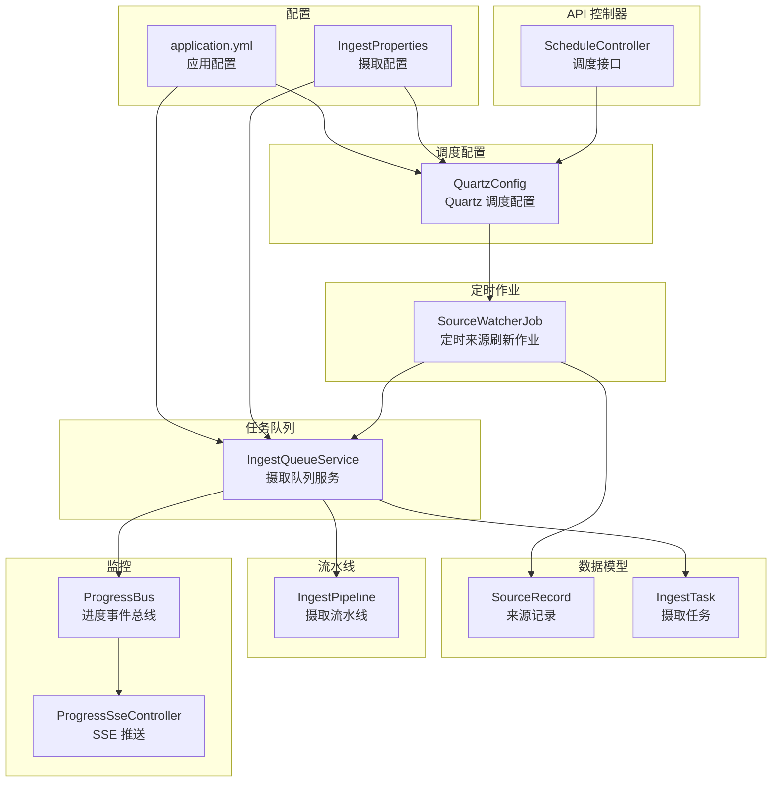
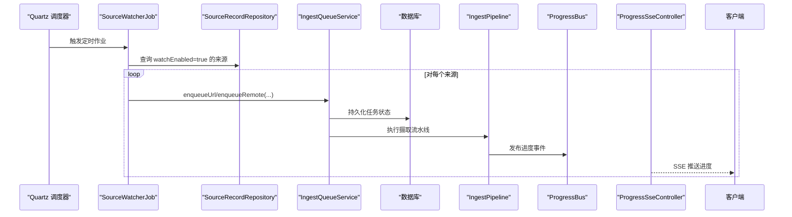
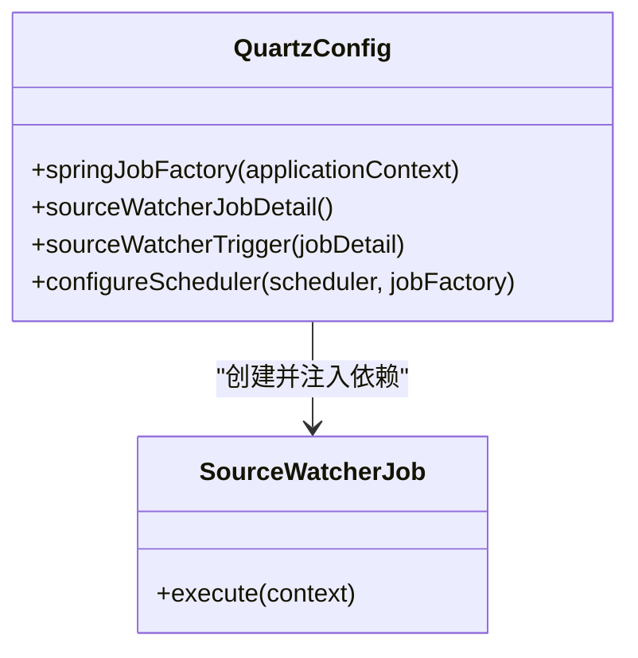
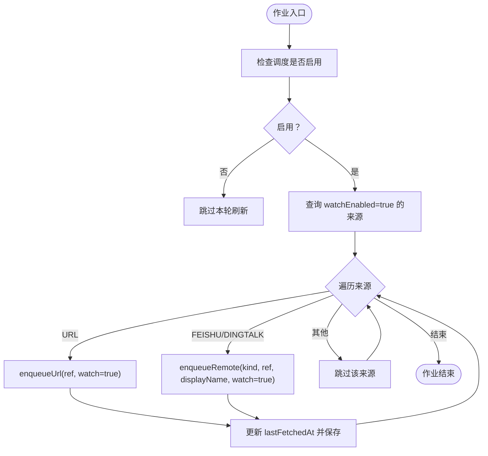
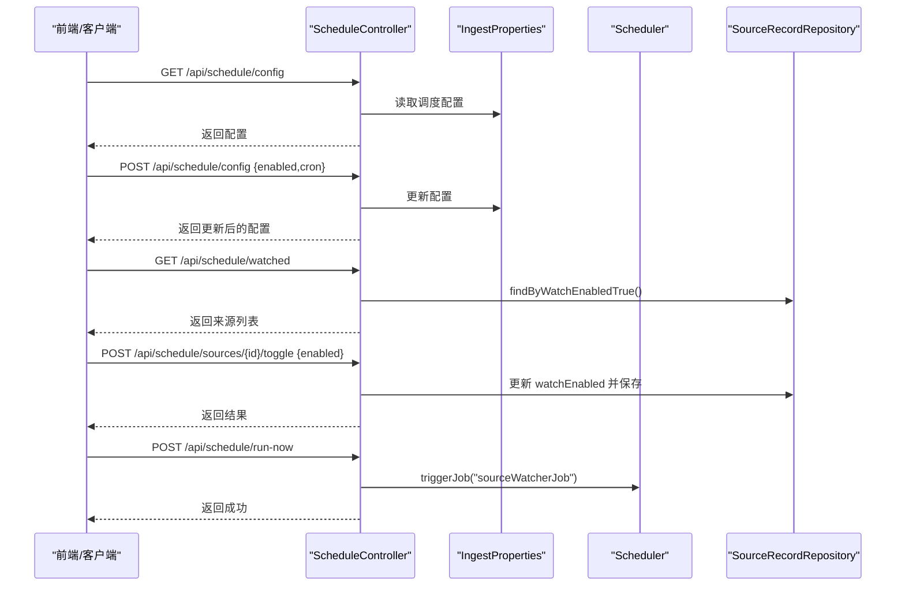
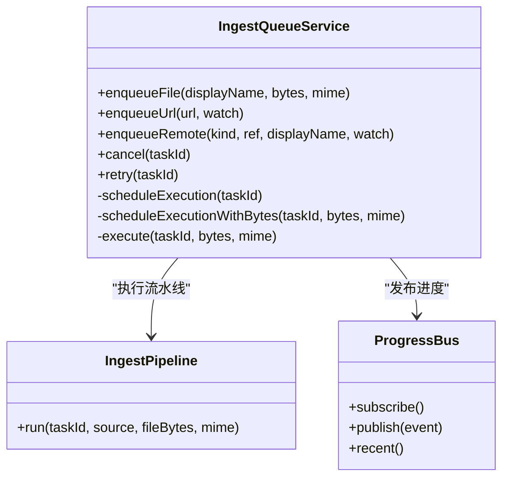
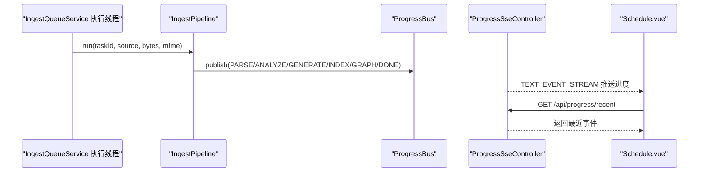
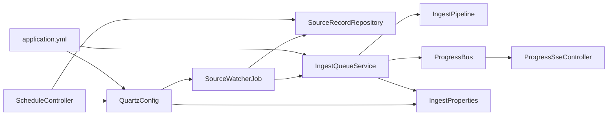
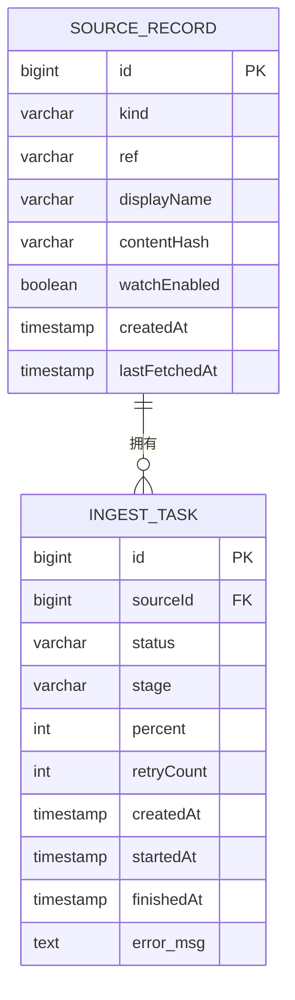

# 调度管理系统

<cite>
**本文引用的文件**
- [QuartzConfig.java](file://src/main/java/com/example/llmwiki/scheduler/QuartzConfig.java)
- [SourceWatcherJob.java](file://src/main/java/com/example/llmwiki/scheduler/SourceWatcherJob.java)
- [ScheduleController.java](file://src/main/java/com/example/llmwiki/api/ScheduleController.java)
- [IngestQueueService.java](file://src/main/java/com/example/llmwiki/queue/IngestQueueService.java)
- [IngestProperties.java](file://src/main/java/com/example/llmwiki/config/IngestProperties.java)
- [application.yml](file://src/main/resources/application.yml)
- [SourceRecord.java](file://src/main/java/com/example/llmwiki/domain/SourceRecord.java)
- [IngestTask.java](file://src/main/java/com/example/llmwiki/domain/IngestTask.java)
- [SourceRecordRepository.java](file://src/main/java/com/example/llmwiki/repository/SourceRecordRepository.java)
- [IngestPipeline.java](file://src/main/java/com/example/llmwiki/ingest/IngestPipeline.java)
- [ProgressBus.java](file://src/main/java/com/example/llmwiki/progress/ProgressBus.java)
- [ProgressSseController.java](file://src/main/java/com/example/llmwiki/api/ProgressSseController.java)
- [Schedule.vue](file://web/src/views/Schedule.vue)
</cite>

## 目录
1. [简介](#简介)
2. [项目结构](#项目结构)
3. [核心组件](#核心组件)
4. [架构概览](#架构概览)
5. [详细组件分析](#详细组件分析)
6. [依赖关系分析](#依赖关系分析)
7. [性能考虑](#性能考虑)
8. [故障排查指南](#故障排查指南)
9. [结论](#结论)
10. [附录](#附录)

## 简介
本文件为 LLM Wiki 调度管理系统的技术文档，涵盖 Quartz 调度器配置、作业生命周期管理、Cron 表达式说明、SourceWatcherJob 实现、调度 API 设计、任务队列管理、调度监控、调度优化与维护等。系统通过 Quartz 定时扫描启用“定时刷新”的远程来源，自动将新的摄取任务入队至 IngestQueueService，后者以单线程串行方式执行摄取流水线，支持取消、重试与进度事件推送。

## 项目结构
调度相关模块主要分布在以下包：
- scheduler：Quartz 配置与定时作业
- api：调度控制器接口
- queue：摄取任务队列服务
- config：配置属性定义
- domain：数据模型
- ingest：摄取流水线
- progress：进度事件总线与 SSE 推送
- repository：数据访问层
- web：前端调度界面

图表来源
- [QuartzConfig.java:1-90](file://src/main/java/com/example/llmwiki/scheduler/QuartzConfig.java#L1-L90)
- [SourceWatcherJob.java:1-68](file://src/main/java/com/example/llmwiki/scheduler/SourceWatcherJob.java#L1-L68)
- [ScheduleController.java:1-79](file://src/main/java/com/example/llmwiki/api/ScheduleController.java#L1-L79)
- [IngestQueueService.java:1-214](file://src/main/java/com/example/llmwiki/queue/IngestQueueService.java#L1-L214)
- [IngestPipeline.java:1-251](file://src/main/java/com/example/llmwiki/ingest/IngestPipeline.java#L1-L251)
- [ProgressBus.java:1-61](file://src/main/java/com/example/llmwiki/progress/ProgressBus.java#L1-L61)
- [ProgressSseController.java:1-37](file://src/main/java/com/example/llmwiki/api/ProgressSseController.java#L1-L37)
- [application.yml:1-84](file://src/main/resources/application.yml#L1-L84)
- [IngestProperties.java:1-33](file://src/main/java/com/example/llmwiki/config/IngestProperties.java#L1-L33)
- [SourceRecord.java:1-64](file://src/main/java/com/example/llmwiki/domain/SourceRecord.java#L1-L64)
- [IngestTask.java:1-62](file://src/main/java/com/example/llmwiki/domain/IngestTask.java#L1-L62)

章节来源
- [QuartzConfig.java:1-90](file://src/main/java/com/example/llmwiki/scheduler/QuartzConfig.java#L1-L90)
- [application.yml:1-84](file://src/main/resources/application.yml#L1-L84)

## 核心组件
- QuartzConfig：配置 Quartz 调度器，注入 Spring 管理的 Job，按 Cron 表达式启动 SourceWatcherJob。
- SourceWatcherJob：定时扫描启用 watchEnabled 的来源，根据来源类型入队相应任务，并更新 lastFetchedAt。
- ScheduleController：提供调度配置读取/更新、列出 watched 来源、切换 watchEnabled、立即触发作业等接口。
- IngestQueueService：DB 持久化 + 单线程串行 worker + 取消标志 + 失败重试，负责任务创建、调度执行与状态管理。
- IngestPipeline：两步式 CoT 摄取流水线，包含解析、分析、生成、索引与图谱构建。
- ProgressBus/ProgressSseController：进度事件总线与 SSE 推送，用于实时展示摄取进度。
- IngestProperties：摄取与调度配置属性，包括 cron、enabled、maxRetry、workerThreads 等。
- SourceRecord/IngestTask：来源记录与摄取任务的数据模型。

章节来源
- [QuartzConfig.java:1-90](file://src/main/java/com/example/llmwiki/scheduler/QuartzConfig.java#L1-L90)
- [SourceWatcherJob.java:1-68](file://src/main/java/com/example/llmwiki/scheduler/SourceWatcherJob.java#L1-L68)
- [ScheduleController.java:1-79](file://src/main/java/com/example/llmwiki/api/ScheduleController.java#L1-L79)
- [IngestQueueService.java:1-214](file://src/main/java/com/example/llmwiki/queue/IngestQueueService.java#L1-L214)
- [IngestPipeline.java:1-251](file://src/main/java/com/example/llmwiki/ingest/IngestPipeline.java#L1-L251)
- [ProgressBus.java:1-61](file://src/main/java/com/example/llmwiki/progress/ProgressBus.java#L1-L61)
- [ProgressSseController.java:1-37](file://src/main/java/com/example/llmwiki/api/ProgressSseController.java#L1-L37)
- [IngestProperties.java:1-33](file://src/main/java/com/example/llmwiki/config/IngestProperties.java#L1-L33)
- [SourceRecord.java:1-64](file://src/main/java/com/example/llmwiki/domain/SourceRecord.java#L1-L64)
- [IngestTask.java:1-62](file://src/main/java/com/example/llmwiki/domain/IngestTask.java#L1-L62)

## 架构概览
调度系统采用“定时扫描 + 串行队列执行”的模式。Quartz 按配置的 Cron 表达式周期性触发 SourceWatcherJob，后者从数据库筛选启用定时刷新的来源，根据来源类型选择 enqueueUrl 或 enqueueRemote 入队任务。IngestQueueService 使用单线程 worker 串行执行任务，执行过程中通过 ProgressBus 发布进度事件，前端通过 SSE 实时接收。

图表来源
- [QuartzConfig.java:72-80](file://src/main/java/com/example/llmwiki/scheduler/QuartzConfig.java#L72-L80)
- [SourceWatcherJob.java:37-66](file://src/main/java/com/example/llmwiki/scheduler/SourceWatcherJob.java#L37-L66)
- [SourceRecordRepository.java:19-19](file://src/main/java/com/example/llmwiki/repository/SourceRecordRepository.java#L19-L19)
- [IngestQueueService.java:93-113](file://src/main/java/com/example/llmwiki/queue/IngestQueueService.java#L93-L113)
- [IngestPipeline.java:65-109](file://src/main/java/com/example/llmwiki/ingest/IngestPipeline.java#L65-L109)
- [ProgressBus.java:43-55](file://src/main/java/com/example/llmwiki/progress/ProgressBus.java#L43-L55)
- [ProgressSseController.java:27-35](file://src/main/java/com/example/llmwiki/api/ProgressSseController.java#L27-L35)

## 详细组件分析

### Quartz 调度配置
- JobFactory 注入：通过自定义 JobFactory 让 Quartz 使用 Spring 容器实例化 Job，从而支持依赖注入。
- JobDetail：定义 durable 的 SourceWatcherJob，确保应用重启后仍保留作业定义。
- Trigger：基于 IngestProperties 中的 cron 字符串创建 CronTrigger。
- 调度器装配：在配置完成后设置 JobFactory，使 Quartz 能够正确创建作业实例。

图表来源
- [QuartzConfig.java:42-62](file://src/main/java/com/example/llmwiki/scheduler/QuartzConfig.java#L42-L62)
- [QuartzConfig.java:65-80](file://src/main/java/com/example/llmwiki/scheduler/QuartzConfig.java#L65-L80)
- [SourceWatcherJob.java:31-31](file://src/main/java/com/example/llmwiki/scheduler/SourceWatcherJob.java#L31-L31)

章节来源
- [QuartzConfig.java:1-90](file://src/main/java/com/example/llmwiki/scheduler/QuartzConfig.java#L1-L90)
- [IngestProperties.java:28-31](file://src/main/java/com/example/llmwiki/config/IngestProperties.java#L28-L31)
- [application.yml:26-29](file://src/main/resources/application.yml#L26-L29)

### SourceWatcherJob 实现
- 功能：扫描 watchEnabled=true 的来源，按来源类型入队任务，并更新 lastFetchedAt。
- 支持来源类型：URL、FEISHU、DINGTALK 等远程动态来源；文件来源不参与定时刷新。
- 并发控制：使用 @DisallowConcurrentExecution 防止并发执行。
- 异常处理：捕获并记录异常，不影响其他来源的处理。

图表来源
- [SourceWatcherJob.java:37-66](file://src/main/java/com/example/llmwiki/scheduler/SourceWatcherJob.java#L37-L66)
- [SourceRecordRepository.java:19-19](file://src/main/java/com/example/llmwiki/repository/SourceRecordRepository.java#L19-L19)
- [IngestQueueService.java:93-113](file://src/main/java/com/example/llmwiki/queue/IngestQueueService.java#L93-L113)

章节来源
- [SourceWatcherJob.java:1-68](file://src/main/java/com/example/llmwiki/scheduler/SourceWatcherJob.java#L1-L68)
- [SourceRecordRepository.java:1-21](file://src/main/java/com/example/llmwiki/repository/SourceRecordRepository.java#L1-L21)

### 调度 API 设计
- 接口规范：
  - GET /api/schedule/config：返回当前调度配置（enabled、cron）
  - POST /api/schedule/config：更新调度配置（支持部分字段更新）
  - GET /api/schedule/watched：列出所有启用定时刷新的来源
  - POST /api/schedule/sources/{id}/toggle：切换某来源的 watchEnabled
  - POST /api/schedule/run-now：立即触发一次 SourceWatcherJob
- 控制器职责：读取/更新 IngestProperties，调用 Quartz Scheduler 触发作业，访问 SourceRecordRepository 获取来源列表。

图表来源
- [ScheduleController.java:37-77](file://src/main/java/com/example/llmwiki/api/ScheduleController.java#L37-L77)
- [IngestProperties.java:28-31](file://src/main/java/com/example/llmwiki/config/IngestProperties.java#L28-L31)
- [SourceRecordRepository.java:19-19](file://src/main/java/com/example/llmwiki/repository/SourceRecordRepository.java#L19-L19)

章节来源
- [ScheduleController.java:1-79](file://src/main/java/com/example/llmwiki/api/ScheduleController.java#L1-L79)
- [application.yml:71-76](file://src/main/resources/application.yml#L71-L76)

### 任务队列管理
- 恢复机制：应用启动时将 RUNNING 任务标记为 PENDING 并重新入队，保证任务不丢失。
- 入队方法：
  - enqueueFile：注册 FILE 类型来源，持久化原始文件，创建任务并执行
  - enqueueUrl：注册 URL 类型来源，创建任务并执行
  - enqueueRemote：注册 FEISHU/DINGTALK 等远程来源，创建任务并执行
- 执行策略：单线程串行 worker，支持取消标志与失败重试；每次执行前检查取消状态。
- 状态管理：任务状态包括 PENDING/RUNNING/SUCCESS/FAILED/CANCELLED/SKIPPED；失败时根据最大重试次数决定重试或标记失败。
- 进度事件：通过 ProgressBus 发布进度事件，前端通过 SSE 实时接收。

图表来源
- [IngestQueueService.java:73-134](file://src/main/java/com/example/llmwiki/queue/IngestQueueService.java#L73-L134)
- [IngestQueueService.java:159-212](file://src/main/java/com/example/llmwiki/queue/IngestQueueService.java#L159-L212)
- [IngestPipeline.java:65-109](file://src/main/java/com/example/llmwiki/ingest/IngestPipeline.java#L65-L109)
- [ProgressBus.java:26-55](file://src/main/java/com/example/llmwiki/progress/ProgressBus.java#L26-L55)

章节来源
- [IngestQueueService.java:1-214](file://src/main/java/com/example/llmwiki/queue/IngestQueueService.java#L1-L214)
- [IngestPipeline.java:1-251](file://src/main/java/com/example/llmwiki/ingest/IngestPipeline.java#L1-L251)
- [ProgressBus.java:1-61](file://src/main/java/com/example/llmwiki/progress/ProgressBus.java#L1-L61)

### 调度监控
- 进度事件总线：维护订阅者列表，广播 ProgressEvent；最近 50 条事件用于新订阅者回放。
- SSE 推送：/api/progress/stream 提供事件流，/api/progress/recent 返回最近事件。
- 前端集成：Schedule.vue 页面通过开关与输入框控制调度配置，点击“立即执行”触发 run-now 接口。

图表来源
- [IngestPipeline.java:245-249](file://src/main/java/com/example/llmwiki/ingest/IngestPipeline.java#L245-L249)
- [ProgressBus.java:43-55](file://src/main/java/com/example/llmwiki/progress/ProgressBus.java#L43-L55)
- [ProgressSseController.java:27-35](file://src/main/java/com/example/llmwiki/api/ProgressSseController.java#L27-L35)
- [Schedule.vue:37-49](file://web/src/views/Schedule.vue#L37-L49)

章节来源
- [ProgressBus.java:1-61](file://src/main/java/com/example/llmwiki/progress/ProgressBus.java#L1-L61)
- [ProgressSseController.java:1-37](file://src/main/java/com/example/llmwiki/api/ProgressSseController.java#L1-L37)
- [Schedule.vue:1-50](file://web/src/views/Schedule.vue#L1-L50)

## 依赖关系分析
- QuartzConfig 依赖 IngestProperties 读取 cron 配置，依赖 ApplicationContext 注入 JobFactory。
- SourceWatcherJob 依赖 SourceRecordRepository 查询来源，依赖 IngestQueueService 入队任务，依赖 IngestProperties 控制开关。
- ScheduleController 依赖 IngestProperties、SourceRecordRepository、Quartz Scheduler。
- IngestQueueService 依赖 IngestTaskRepository、SourceRecordRepository、IngestPipeline、ProgressBus、StorageProperties。
- IngestPipeline 依赖多个组件完成解析、分析、生成、索引与图谱构建。
- ProgressBus/ProgressSseController 与前端通过 SSE 交互。

图表来源
- [QuartzConfig.java:36-88](file://src/main/java/com/example/llmwiki/scheduler/QuartzConfig.java#L36-L88)
- [SourceWatcherJob.java:33-35](file://src/main/java/com/example/llmwiki/scheduler/SourceWatcherJob.java#L33-L35)
- [ScheduleController.java:33-35](file://src/main/java/com/example/llmwiki/api/ScheduleController.java#L33-L35)
- [IngestQueueService.java:38-43](file://src/main/java/com/example/llmwiki/queue/IngestQueueService.java#L38-L43)
- [IngestPipeline.java:52-62](file://src/main/java/com/example/llmwiki/ingest/IngestPipeline.java#L52-L62)
- [ProgressBus.java:21-21](file://src/main/java/com/example/llmwiki/progress/ProgressBus.java#L21-L21)
- [ProgressSseController.java:25-25](file://src/main/java/com/example/llmwiki/api/ProgressSseController.java#L25-L25)
- [application.yml:26-30](file://src/main/resources/application.yml#L26-L30)
- [IngestProperties.java:18-31](file://src/main/java/com/example/llmwiki/config/IngestProperties.java#L18-L31)

章节来源
- [QuartzConfig.java:1-90](file://src/main/java/com/example/llmwiki/scheduler/QuartzConfig.java#L1-L90)
- [IngestQueueService.java:1-214](file://src/main/java/com/example/llmwiki/queue/IngestQueueService.java#L1-L214)
- [IngestPipeline.java:1-251](file://src/main/java/com/example/llmwiki/ingest/IngestPipeline.java#L1-L251)

## 性能考虑
- 单线程串行执行：IngestQueueService 使用单线程 worker，避免并发竞争，但吞吐受限。可通过增加 worker-threads 提升并发能力（需评估资源与一致性）。
- 重试策略：默认最大重试次数为 3，失败后进入 PENDING 再入队，避免一次性失败导致任务丢失。
- 进度事件：最近 50 条事件回放，减少新订阅者等待时间。
- Quartz 线程池：application.yml 中配置 org.quartz.threadPool.threadCount=2，可按需调整以平衡调度与执行压力。
- 资源分配：建议将摄取任务与其它高并发业务分离，避免资源争用。

[本节为通用性能讨论，无需特定文件引用]

## 故障排查指南
- 调度未生效
  - 检查 IngestProperties.scheduler.enabled 是否为 true
  - 检查 cron 表达式格式是否正确
  - 检查 Quartz 线程池配置是否合理
- 任务未执行
  - 检查任务状态是否为 RUNNING/PENDING
  - 查看 IngestQueueService 日志中的异常堆栈
  - 确认取消集合中是否存在该任务 ID
- 进度不更新
  - 检查 ProgressBus 是否正常发布事件
  - 确认前端是否正确连接 /api/progress/stream
- 来源未刷新
  - 确认 SourceRecord.watchEnabled 是否为 true
  - 检查 SourceWatcherJob 的来源类型分支逻辑

章节来源
- [IngestProperties.java:28-31](file://src/main/java/com/example/llmwiki/config/IngestProperties.java#L28-L31)
- [application.yml:26-29](file://src/main/resources/application.yml#L26-L29)
- [IngestQueueService.java:194-211](file://src/main/java/com/example/llmwiki/queue/IngestQueueService.java#L194-L211)
- [ProgressBus.java:43-55](file://src/main/java/com/example/llmwiki/progress/ProgressBus.java#L43-L55)
- [SourceRecordRepository.java:19-19](file://src/main/java/com/example/llmwiki/repository/SourceRecordRepository.java#L19-L19)

## 结论
本调度系统通过 Quartz 定时扫描与 IngestQueueService 串行执行相结合，实现了对远程来源的自动化摄取。系统具备完善的配置管理、任务状态跟踪与进度事件推送能力。通过合理的重试与恢复机制，保障了任务的可靠性与连续性。建议在生产环境中根据业务负载调整并发与线程池参数，并结合监控与告警体系进一步提升稳定性。

[本节为总结性内容，无需特定文件引用]

## 附录

### Cron 表达式说明
- 默认值：每天凌晨 3 点执行
- 表达式格式：秒 分 时 日 月 周 年
- 示例：0 0 3 * * ? 表示每天 3:00:00 执行
- 在线验证：可使用 Quartz Cron 表达式在线工具验证语法与预期执行时间

章节来源
- [IngestProperties.java:28-31](file://src/main/java/com/example/llmwiki/config/IngestProperties.java#L28-L31)
- [application.yml:71-76](file://src/main/resources/application.yml#L71-L76)

### 调度 API 接口清单
- GET /api/schedule/config：获取调度配置
- POST /api/schedule/config：更新调度配置（支持部分字段）
- GET /api/schedule/watched：列出启用定时刷新的来源
- POST /api/schedule/sources/{id}/toggle：切换来源 watchEnabled
- POST /api/schedule/run-now：立即触发 SourceWatcherJob

章节来源
- [ScheduleController.java:37-77](file://src/main/java/com/example/llmwiki/api/ScheduleController.java#L37-L77)

### 任务状态与阶段
- 任务状态：PENDING、RUNNING、SUCCESS、FAILED、CANCELLED、SKIPPED
- 阶段：PARSE、ANALYZE、GENERATE、INDEX、GRAPH、DONE
- 进度百分比：0-100

章节来源
- [IngestTask.java:38-47](file://src/main/java/com/example/llmwiki/domain/IngestTask.java#L38-L47)
- [IngestPipeline.java:82-108](file://src/main/java/com/example/llmwiki/ingest/IngestPipeline.java#L82-L108)

### 数据模型关系

图表来源
- [SourceRecord.java:31-58](file://src/main/java/com/example/llmwiki/domain/SourceRecord.java#L31-L58)
- [IngestTask.java:31-60](file://src/main/java/com/example/llmwiki/domain/IngestTask.java#L31-L60)