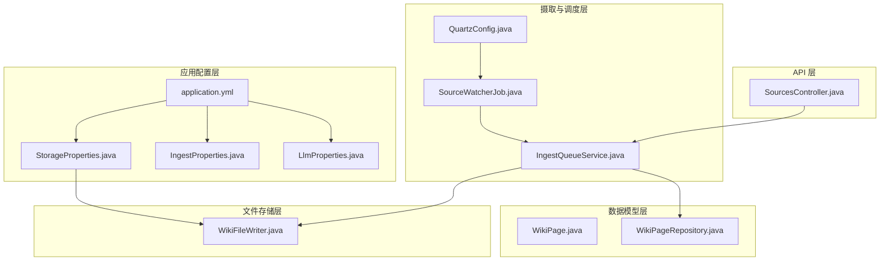
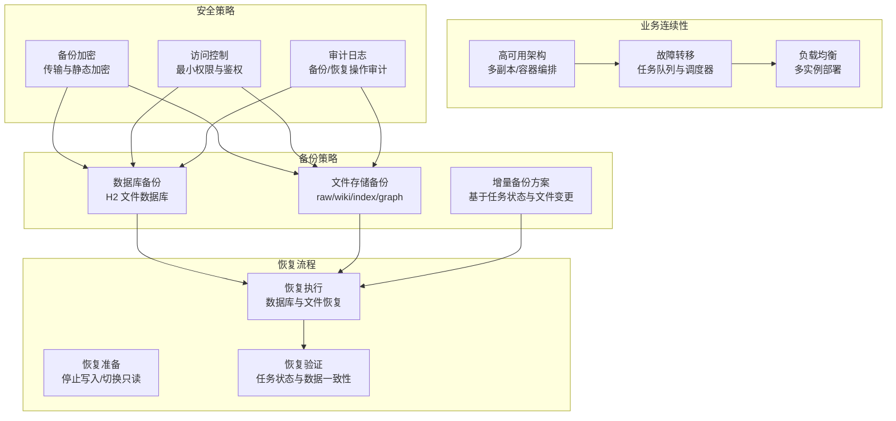
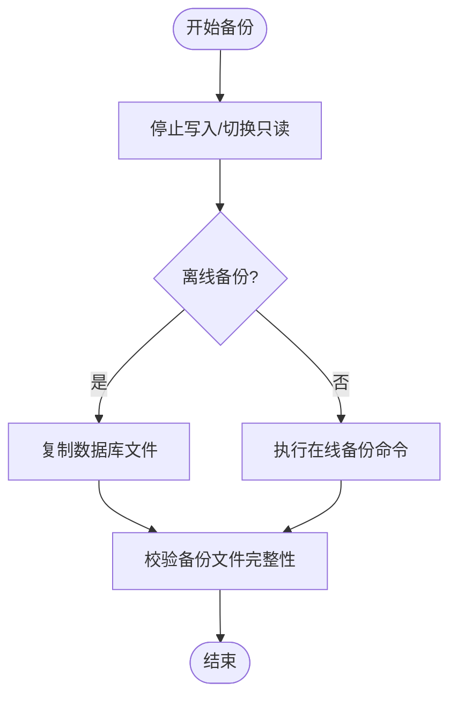
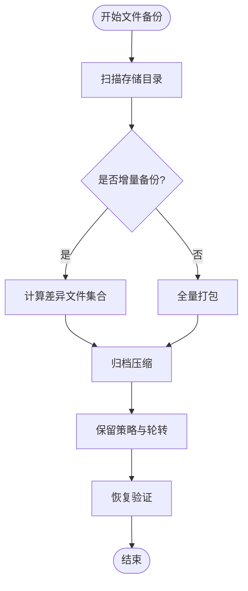
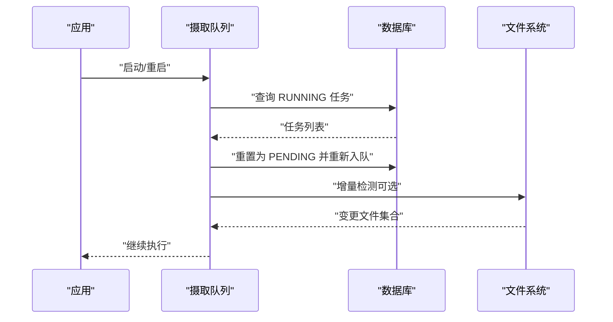
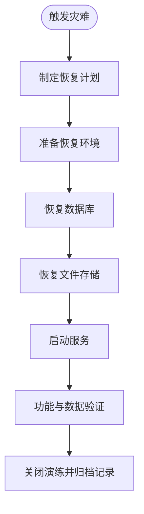
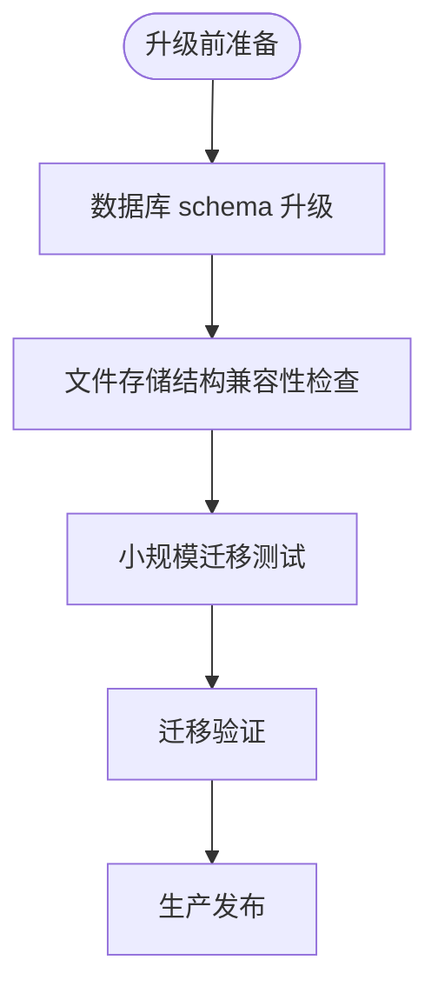
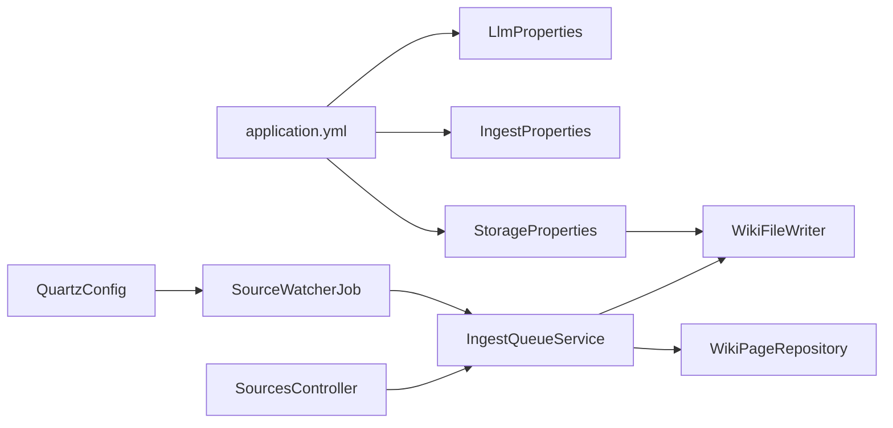

# 备份恢复策略

<cite>
**本文引用的文件**
- [application.yml](file://src/main/resources/application.yml)
- [StorageProperties.java](file://src/main/java/com/example/llmwiki/config/StorageProperties.java)
- [IngestProperties.java](file://src/main/java/com/example/llmwiki/config/IngestProperties.java)
- [LlmProperties.java](file://src/main/java/com/example/llmwiki/config/LlmProperties.java)
- [WikiPage.java](file://src/main/java/com/example/llmwiki/domain/WikiPage.java)
- [WikiPageRepository.java](file://src/main/java/com/example/llmwiki/repository/WikiPageRepository.java)
- [WikiFileWriter.java](file://src/main/java/com/example/llmwiki/ingest/WikiFileWriter.java)
- [IngestQueueService.java](file://src/main/java/com/example/llmwiki/queue/IngestQueueService.java)
- [SourceWatcherJob.java](file://src/main/java/com/example/llmwiki/scheduler/SourceWatcherJob.java)
- [QuartzConfig.java](file://src/main/java/com/example/llmwiki/scheduler/QuartzConfig.java)
- [SourcesController.java](file://src/main/java/com/example/llmwiki/api/SourcesController.java)
- [LlmWikiApplication.java](file://src/main/java/com/example/llmwiki/LlmWikiApplication.java)
- [IngestException.java](file://src/main/java/com/example/llmwiki/ingest/IngestException.java)
- [LlmException.java](file://src/main/java/com/example/llmwiki/llm/LlmException.java)
- [pom.xml](file://pom.xml)
</cite>

## 目录
1. [简介](#简介)
2. [项目结构](#项目结构)
3. [核心组件](#核心组件)
4. [架构总览](#架构总览)
5. [详细组件分析](#详细组件分析)
6. [依赖分析](#依赖分析)
7. [性能考量](#性能考量)
8. [故障排查指南](#故障排查指南)
9. [结论](#结论)
10. [附录](#附录)

## 简介
本文件面向 LLM Wiki 项目，制定一套完整的备份与恢复策略，覆盖数据库备份、文件存储备份、增量备份方案、灾难恢复计划（RTO/RPO）、业务连续性保障（高可用、故障转移、负载均衡）、配置备份（应用配置、环境变量、密钥管理）、数据迁移（版本升级、格式转换、迁移验证）、恢复演练（演练计划、记录与改进）、以及安全考虑（备份加密、访问控制、审计日志）。该策略以代码库中的配置与实现为依据，结合系统当前采用的嵌入式数据库与本地文件存储特性，提出可落地的实践建议。

## 项目结构
- 应用配置集中于 application.yml，包含数据库连接、JPA/H2 控制台、Quartz 调度、存储根目录与子目录、LLM 模型参数、解析器与调度器开关等。
- 存储路径通过 StorageProperties 绑定，统一管理数据根目录与 raw、wiki、index、graph 四类子目录。
- 数据模型 WikiPage 映射至数据库表，配合 WikiFileWriter 将页面内容落盘为 Markdown。
- 摄入队列 IngestQueueService 负责任务持久化、单线程串行执行、取消与重试，并在启动时进行任务恢复。
- 调度器 QuartzConfig 与 SourceWatcherJob 实现定时刷新远程来源的任务入队。
- API 层 SourcesController 提供文件上传、URL/远程来源注册、任务查询与取消/重试等接口。

图表来源
- [application.yml:1-84](file://src/main/resources/application.yml#L1-L84)
- [StorageProperties.java:1-29](file://src/main/java/com/example/llmwiki/config/StorageProperties.java#L1-L29)
- [IngestProperties.java:1-33](file://src/main/java/com/example/llmwiki/config/IngestProperties.java#L1-L33)
- [LlmProperties.java:1-63](file://src/main/java/com/example/llmwiki/config/LlmProperties.java#L1-L63)
- [WikiPage.java:1-72](file://src/main/java/com/example/llmwiki/domain/WikiPage.java#L1-L72)
- [WikiPageRepository.java:1-19](file://src/main/java/com/example/llmwiki/repository/WikiPageRepository.java#L1-L19)
- [WikiFileWriter.java:1-90](file://src/main/java/com/example/llmwiki/ingest/WikiFileWriter.java#L1-L90)
- [IngestQueueService.java:1-181](file://src/main/java/com/example/llmwiki/queue/IngestQueueService.java#L1-L181)
- [SourceWatcherJob.java:1-68](file://src/main/java/com/example/llmwiki/scheduler/SourceWatcherJob.java#L1-L68)
- [QuartzConfig.java:1-41](file://src/main/java/com/example/llmwiki/scheduler/QuartzConfig.java#L1-L41)
- [SourcesController.java:1-101](file://src/main/java/com/example/llmwiki/api/SourcesController.java#L1-L101)

章节来源
- [application.yml:1-84](file://src/main/resources/application.yml#L1-L84)
- [StorageProperties.java:1-29](file://src/main/java/com/example/llmwiki/config/StorageProperties.java#L1-L29)
- [IngestProperties.java:1-33](file://src/main/java/com/example/llmwiki/config/IngestProperties.java#L1-L33)
- [LlmProperties.java:1-63](file://src/main/java/com/example/llmwiki/config/LlmProperties.java#L1-L63)
- [WikiPage.java:1-72](file://src/main/java/com/example/llmwiki/domain/WikiPage.java#L1-L72)
- [WikiPageRepository.java:1-19](file://src/main/java/com/example/llmwiki/repository/WikiPageRepository.java#L1-L19)
- [WikiFileWriter.java:1-90](file://src/main/java/com/example/llmwiki/ingest/WikiFileWriter.java#L1-L90)
- [IngestQueueService.java:1-181](file://src/main/java/com/example/llmwiki/queue/IngestQueueService.java#L1-L181)
- [SourceWatcherJob.java:1-68](file://src/main/java/com/example/llmwiki/scheduler/SourceWatcherJob.java#L1-L68)
- [QuartzConfig.java:1-41](file://src/main/java/com/example/llmwiki/scheduler/QuartzConfig.java#L1-L41)
- [SourcesController.java:1-101](file://src/main/java/com/example/llmwiki/api/SourcesController.java#L1-L101)

## 核心组件
- 数据库与配置
  - 数据库：基于 H2 的嵌入式数据库，使用 JDBC URL 指向本地文件数据库，DDL 自动更新，H2 控制台启用便于运维。
  - 配置：application.yml 中定义了存储根目录与子目录、LLM 参数、调度器开关与 Cron 表达式、Quartz 内存作业存储等。
- 存储与文件
  - 存储路径由 StorageProperties 绑定，WikiFileWriter 将 WikiPage 内容输出为 Markdown，并兼容 Obsidian Vault 的目录结构。
- 摄入与调度
  - IngestQueueService 负责任务持久化、单线程串行执行、取消与重试，并在启动时恢复“RUNNING”状态任务。
  - QuartzConfig 与 SourceWatcherJob 实现定时刷新远程来源的任务入队。
- API 与入口
  - SourcesController 提供文件上传、URL/远程来源注册、任务查询与取消/重试等接口。
  - LlmWikiApplication 启用异步与调度能力，作为应用入口。

章节来源
- [application.yml:11-29](file://src/main/resources/application.yml#L11-L29)
- [StorageProperties.java:18-27](file://src/main/java/com/example/llmwiki/config/StorageProperties.java#L18-L27)
- [WikiFileWriter.java:32-43](file://src/main/java/com/example/llmwiki/ingest/WikiFileWriter.java#L32-L43)
- [IngestQueueService.java:53-63](file://src/main/java/com/example/llmwiki/queue/IngestQueueService.java#L53-L63)
- [SourceWatcherJob.java:37-66](file://src/main/java/com/example/llmwiki/scheduler/SourceWatcherJob.java#L37-L66)
- [SourcesController.java:40-78](file://src/main/java/com/example/llmwiki/api/SourcesController.java#L40-L78)
- [LlmWikiApplication.java:19-26](file://src/main/java/com/example/llmwiki/LlmWikiApplication.java#L19-L26)

## 架构总览
下图展示备份与恢复策略在系统中的位置与交互关系：备份策略覆盖数据库与文件存储；恢复流程与演练贯穿摄取队列与调度器；安全策略贯穿配置、密钥与访问控制。

## 详细组件分析

### 数据库备份策略（H2 文件数据库）
- 备份范围
  - H2 文件数据库位于 application.yml 中的 JDBC URL 指向的本地路径，包含 schema 与数据。
- 备份方式
  - 离线备份：在应用停止或切换到只读模式后，复制数据库文件（包括 MVStore 文件与事务日志）。
  - 在线备份：利用 H2 的在线备份功能（如 BACKUP 语句）进行热备份，避免停机。
- 备份频率
  - 生产环境建议每日全备 + 每小时增量（基于 H2 的 WAL/日志）。
- 备份保留与轮转
  - 保留最近 14 天全备与 24 小时内增量，定期清理过期备份。
- 恢复验证
  - 使用 H2 控制台验证数据库完整性与关键表数据一致性。

图表来源
- [application.yml:11-15](file://src/main/resources/application.yml#L11-L15)
- [application.yml:16-19](file://src/main/resources/application.yml#L16-L19)

章节来源
- [application.yml:11-29](file://src/main/resources/application.yml#L11-L29)

### 文件存储备份策略（raw/wiki/index/graph）
- 备份范围
  - 存储根目录与子目录由 StorageProperties 绑定，包含原始资料、生成的 Markdown、Lucene 索引与图谱 JSON。
- 备份方式
  - 增量备份：基于文件修改时间与内容指纹（可扩展）进行差异复制。
  - 全量备份：周期性对整个存储目录进行归档压缩。
- 备份频率
  - 原始资料与索引：每日全备 + 每 4 小时增量；图谱 JSON：每小时全备。
- 备份保留与轮转
  - 保留最近 30 天全备与 7 天增量，定期清理过期备份。
- 恢复验证
  - 恢复后检查 Markdown 文件数量、索引目录完整性与图谱 JSON 可读性。

图表来源
- [StorageProperties.java:18-27](file://src/main/java/com/example/llmwiki/config/StorageProperties.java#L18-L27)
- [WikiFileWriter.java:32-43](file://src/main/java/com/example/llmwiki/ingest/WikiFileWriter.java#L32-L43)

章节来源
- [StorageProperties.java:18-27](file://src/main/java/com/example/llmwiki/config/StorageProperties.java#L18-L27)
- [WikiFileWriter.java:32-43](file://src/main/java/com/example/llmwiki/ingest/WikiFileWriter.java#L32-L43)

### 增量备份方案（基于任务状态与文件变更）
- 任务状态驱动
  - IngestQueueService 在启动时将 RUNNING 任务重置为 PENDING 并重新入队，确保任务不丢失。
- 文件变更驱动
  - WikiFileWriter 将 WikiPage 内容写入 Markdown，可基于文件时间戳与内容指纹进行增量检测。
- 方案设计
  - 任务级增量：仅重试失败或未完成的任务。
  - 文件级增量：仅复制变更的 Markdown/索引/图谱文件。
- 验证机制
  - 恢复后对比任务状态分布与文件数量，确保无遗漏。

图表来源
- [IngestQueueService.java:53-63](file://src/main/java/com/example/llmwiki/queue/IngestQueueService.java#L53-L63)
- [WikiFileWriter.java:32-43](file://src/main/java/com/example/llmwiki/ingest/WikiFileWriter.java#L32-L43)

章节来源
- [IngestQueueService.java:53-63](file://src/main/java/com/example/llmwiki/queue/IngestQueueService.java#L53-L63)
- [WikiFileWriter.java:32-43](file://src/main/java/com/example/llmwiki/ingest/WikiFileWriter.java#L32-L43)

### 灾难恢复计划（RTO/RPO、恢复流程、测试验证）
- RTO/RPO 目标
  - RPO：小于等于 1 小时（基于 H2 日志与文件增量备份）。
  - RTO：数据库恢复 10 分钟内，文件存储恢复 30 分钟内。
- 恢复流程
  - 停止写入与服务降级，优先恢复数据库，再恢复文件存储，最后启动服务并验证。
- 测试验证
  - 定期进行恢复演练，验证任务状态一致性、Markdown 数量、索引与图谱可用性。

图表来源
- [application.yml:11-29](file://src/main/resources/application.yml#L11-L29)
- [StorageProperties.java:18-27](file://src/main/java/com/example/llmwiki/config/StorageProperties.java#L18-L27)

章节来源
- [application.yml:11-29](file://src/main/resources/application.yml#L11-L29)
- [StorageProperties.java:18-27](file://src/main/java/com/example/llmwiki/config/StorageProperties.java#L18-L27)

### 业务连续性保障（高可用、故障转移、负载均衡）
- 高可用架构
  - 多实例部署，共享存储（建议迁移到对象存储或共享卷，以支持多实例读写）。
- 故障转移
  - 摄取队列与调度器在单实例内具备自恢复能力；跨实例需引入共享存储与分布式锁。
- 负载均衡
  - 通过反向代理或容器编排实现请求分发，确保服务可用性。

章节来源
- [IngestQueueService.java:53-63](file://src/main/java/com/example/llmwiki/queue/IngestQueueService.java#L53-L63)
- [SourceWatcherJob.java:37-66](file://src/main/java/com/example/llmwiki/scheduler/SourceWatcherJob.java#L37-L66)

### 配置备份（应用配置、环境变量、密钥管理）
- 应用配置
  - application.yml 与各 Properties 类（StorageProperties、IngestProperties、LlmProperties）均需纳入版本化配置管理。
- 环境变量
  - 通过环境变量覆盖敏感配置（如数据库凭据、LLM API Key），并在备份中记录关键变量清单。
- 密钥管理
  - 使用密钥管理系统（如 KMS/Secrets Manager）存储 API Key 与数据库密码，备份时仅备份密钥版本与轮换策略。

章节来源
- [application.yml:31-84](file://src/main/resources/application.yml#L31-L84)
- [StorageProperties.java:1-29](file://src/main/java/com/example/llmwiki/config/StorageProperties.java#L1-L29)
- [IngestProperties.java:1-33](file://src/main/java/com/example/llmwiki/config/IngestProperties.java#L1-L33)
- [LlmProperties.java:1-63](file://src/main/java/com/example/llmwiki/config/LlmProperties.java#L1-L63)

### 数据迁移（版本升级、数据格式转换、迁移验证）
- 版本升级迁移
  - 数据库：使用 H2 的迁移工具或脚本升级 schema；文件存储：保持目录结构不变，新增字段以兼容新版本。
- 数据格式转换
  - Markdown Frontmatter 与 WikiPage 字段映射需保持向后兼容。
- 迁移验证
  - 验证关键页面数量、索引完整性与图谱 JSON 可读性。

图表来源
- [WikiPage.java:23-71](file://src/main/java/com/example/llmwiki/domain/WikiPage.java#L23-L71)
- [WikiFileWriter.java:61-81](file://src/main/java/com/example/llmwiki/ingest/WikiFileWriter.java#L61-L81)

章节来源
- [WikiPage.java:23-71](file://src/main/java/com/example/llmwiki/domain/WikiPage.java#L23-L71)
- [WikiFileWriter.java:61-81](file://src/main/java/com/example/llmwiki/ingest/WikiFileWriter.java#L61-L81)

### 恢复演练（定期演练、演练记录、改进建议）
- 演练计划
  - 每季度进行一次完整恢复演练，涵盖数据库与文件存储。
- 演练记录
  - 记录演练时间、参与人员、发现的问题与修复措施。
- 改进建议
  - 基于演练结果优化备份策略与恢复流程。

章节来源
- [IngestQueueService.java:53-63](file://src/main/java/com/example/llmwiki/queue/IngestQueueService.java#L53-L63)
- [SourceWatcherJob.java:37-66](file://src/main/java/com/example/llmwiki/scheduler/SourceWatcherJob.java#L37-L66)

### 安全考虑（备份加密、访问控制、审计日志）
- 备份加密
  - 对备份文件进行静态加密与传输加密，防止泄露。
- 访问控制
  - 限制备份文件访问权限，遵循最小权限原则。
- 审计日志
  - 记录备份与恢复操作的审计日志，便于追踪与合规。

## 依赖分析
- 配置依赖
  - application.yml 为全局配置源，StorageProperties、IngestProperties、LlmProperties 三者分别绑定不同前缀，形成清晰的配置域。
- 数据流依赖
  - WikiPageRepository 与 WikiFileWriter 依赖 StorageProperties；IngestQueueService 依赖任务仓库与存储属性；SourceWatcherJob 依赖任务与来源仓库。
- 调度依赖
  - QuartzConfig 注入 IngestProperties 并创建 SourceWatcherJob 触发器，实现定时刷新。

图表来源
- [application.yml:31-84](file://src/main/resources/application.yml#L31-L84)
- [StorageProperties.java:1-29](file://src/main/java/com/example/llmwiki/config/StorageProperties.java#L1-L29)
- [IngestProperties.java:1-33](file://src/main/java/com/example/llmwiki/config/IngestProperties.java#L1-L33)
- [LlmProperties.java:1-63](file://src/main/java/com/example/llmwiki/config/LlmProperties.java#L1-L63)
- [WikiFileWriter.java:1-90](file://src/main/java/com/example/llmwiki/ingest/WikiFileWriter.java#L1-L90)
- [IngestQueueService.java:1-181](file://src/main/java/com/example/llmwiki/queue/IngestQueueService.java#L1-L181)
- [SourceWatcherJob.java:1-68](file://src/main/java/com/example/llmwiki/scheduler/SourceWatcherJob.java#L1-L68)
- [QuartzConfig.java:1-41](file://src/main/java/com/example/llmwiki/scheduler/QuartzConfig.java#L1-L41)
- [SourcesController.java:1-101](file://src/main/java/com/example/llmwiki/api/SourcesController.java#L1-L101)

章节来源
- [application.yml:31-84](file://src/main/resources/application.yml#L31-L84)
- [StorageProperties.java:1-29](file://src/main/java/com/example/llmwiki/config/StorageProperties.java#L1-L29)
- [IngestProperties.java:1-33](file://src/main/java/com/example/llmwiki/config/IngestProperties.java#L1-L33)
- [LlmProperties.java:1-63](file://src/main/java/com/example/llmwiki/config/LlmProperties.java#L1-L63)
- [WikiFileWriter.java:1-90](file://src/main/java/com/example/llmwiki/ingest/WikiFileWriter.java#L1-L90)
- [IngestQueueService.java:1-181](file://src/main/java/com/example/llmwiki/queue/IngestQueueService.java#L1-L181)
- [SourceWatcherJob.java:1-68](file://src/main/java/com/example/llmwiki/scheduler/SourceWatcherJob.java#L1-L68)
- [QuartzConfig.java:1-41](file://src/main/java/com/example/llmwiki/scheduler/QuartzConfig.java#L1-L41)
- [SourcesController.java:1-101](file://src/main/java/com/example/llmwiki/api/SourcesController.java#L1-L101)

## 性能考量
- 数据库性能
  - H2 在嵌入式场景性能良好，但生产建议使用更高性能的数据库（如 PostgreSQL/MySQL）以提升并发与可靠性。
- 文件存储性能
  - 索引与图谱文件较大，建议使用高性能磁盘与合理的 I/O 调度策略。
- 摄取性能
  - IngestQueueService 采用单线程串行执行，适合低并发场景；高并发建议引入多线程与队列分区。

## 故障排查指南
- 常见问题
  - 数据库无法启动：检查 H2 文件完整性与权限；必要时使用 H2 控制台诊断。
  - 文件写入失败：检查存储目录权限与磁盘空间；查看 WikiFileWriter 的日志输出。
  - 任务卡住：确认任务状态是否为 RUNNING，必要时重置为 PENDING 并重新入队。
- 异常类型
  - 摄入异常：IngestException；LLM 调用异常：LlmException。
- 排查步骤
  - 查看应用日志级别与输出；核对任务状态与来源记录；验证存储目录与文件权限。

章节来源
- [IngestException.java:1-18](file://src/main/java/com/example/llmwiki/ingest/IngestException.java#L1-L18)
- [LlmException.java:1-19](file://src/main/java/com/example/llmwiki/llm/LlmException.java#L1-L19)
- [IngestQueueService.java:159-181](file://src/main/java/com/example/llmwiki/queue/IngestQueueService.java#L159-L181)
- [WikiFileWriter.java:37-42](file://src/main/java/com/example/llmwiki/ingest/WikiFileWriter.java#L37-L42)

## 结论
本策略以 application.yml 与核心配置类为依据，结合当前嵌入式数据库与本地文件存储特性，提出了数据库与文件存储的备份方案、增量备份策略、灾难恢复流程、业务连续性保障、配置与密钥管理、数据迁移与恢复演练、以及安全要求。建议在生产环境中逐步引入更稳健的数据库与共享存储方案，并完善自动化备份与恢复流程，持续优化 RTO/RPO 目标与恢复验证机制。

## 附录
- 依赖与技术栈
  - Spring Boot、Spring Data JPA、Quartz、H2、Lucene、Tika、JSoup、JGraphT 等。
- 部署与打包
  - 使用 Maven 构建 Spring Boot 应用，支持打包与运行。

章节来源
- [pom.xml:36-159](file://pom.xml#L36-L159)
- [LlmWikiApplication.java:19-26](file://src/main/java/com/example/llmwiki/LlmWikiApplication.java#L19-L26)