# 开发环境搭建

<cite>
**本文档引用的文件**
- [pom.xml](file://pom.xml)
- [README.md](file://README.md)
- [application.yml](file://src/main/resources/application.yml)
- [mvnw.cmd](file://mvnw.cmd)
- [.mvn/wrapper/maven-wrapper.properties](file://.mvn/wrapper/maven-wrapper.properties)
- [package.json](file://web/package.json)
- [vite.config.ts](file://web/vite.config.ts)
- [tsconfig.json](file://web/tsconfig.json)
- [LlmWikiApplication.java](file://src/main/java/com/example/llmwiki/LlmWikiApplication.java)
</cite>

## 目录
1. [简介](#简介)
2. [项目结构](#项目结构)
3. [环境要求](#环境要求)
4. [依赖安装](#依赖安装)
5. [项目克隆与启动](#项目克隆与启动)
6. [常见问题排查](#常见问题排查)
7. [开发工具推荐](#开发工具推荐)
8. [性能考虑](#性能考虑)
9. [故障排除指南](#故障排除指南)
10. [结论](#结论)

## 简介

LLM Wiki 是一个基于 Java 17 + Spring Boot 3.3 + Vue 3 的自构建个人知识库系统。该项目实现了大模型自动写 Wiki 的核心思想，具备多源导入、可视化进度、知识图谱、知识空白反推、定时更新、评测能力等六大企业级特性。系统采用前后端分离架构，后端使用 Spring Boot 提供 REST API，前端使用 Vue 3 + Vite 构建现代化的用户界面。

## 项目结构

LLM Wiki 采用典型的 Spring Boot + Vue 3 项目结构，主要分为两个核心部分：

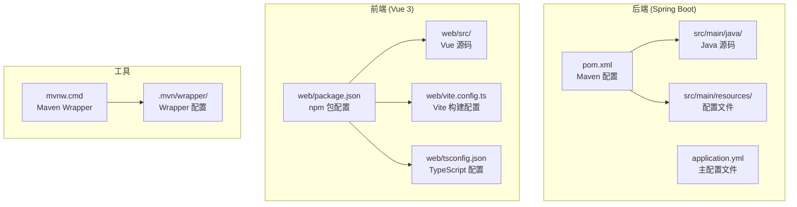

**图表来源**
- [pom.xml:1-171](file://pom.xml#L1-L171)
- [README.md:77-113](file://README.md#L77-L113)

**章节来源**
- [README.md:77-113](file://README.md#L77-L113)
- [pom.xml:1-171](file://pom.xml#L1-L171)

## 环境要求

### Java 环境要求

项目要求使用 Java 17 或更高版本，推荐使用 Eclipse Temurin 17 发行版：

- **最低要求**: Java 17+
- **推荐版本**: Java 17 或 Java 21
- **发行版**: Eclipse Temurin 17（官方推荐）
- **验证命令**: `java -version`

### Node.js 环境要求

前端开发需要 Node.js 环境，推荐使用 18+ 版本：

- **最低要求**: Node.js 18+
- **推荐版本**: Node.js 20 LTS
- **验证命令**: `node -v`
- **包管理器**: npm（随 Node.js 一起安装）

### Git 工具

项目使用 Git 进行版本控制：

- **最低要求**: Git 2.0+
- **验证命令**: `git --version`

**章节来源**
- [README.md:119-122](file://README.md#L119-L122)
- [pom.xml:29-35](file://pom.xml#L29-L35)

## 依赖安装

### Maven 依赖下载

项目使用 Maven 3.9.15 作为构建工具，支持 Maven Wrapper 自动下载：

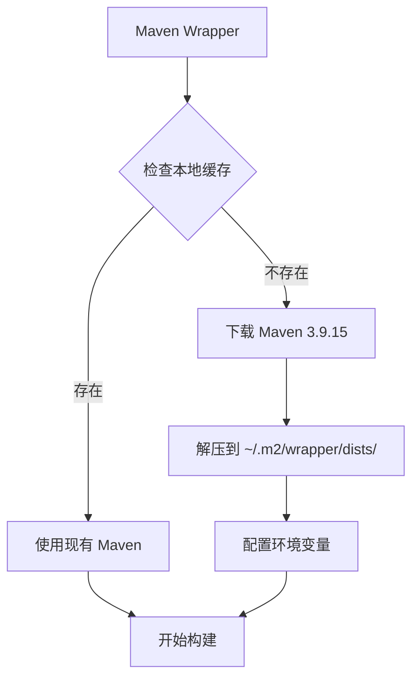

**图表来源**
- [.mvn/wrapper/maven-wrapper.properties:1-4](file://.mvn/wrapper/maven-wrapper.properties#L1-L4)
- [mvnw.cmd:125-147](file://mvnw.cmd#L125-L147)

### npm 依赖安装

前端依赖通过 npm 管理，包含以下主要依赖：

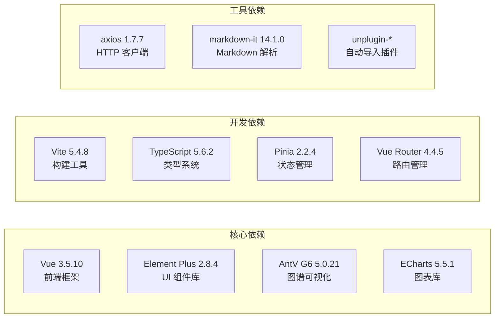

**图表来源**
- [package.json:12-30](file://package.json#L12-L30)

### IDE 配置建议

#### IntelliJ IDEA 配置

1. **项目导入**: File → Open → 选择 pom.xml
2. **JDK 配置**: Project Structure → SDKs → 添加 JDK 17+
3. **Maven 配置**: Build Tools → Maven → 使用 Wrapper
4. **插件推荐**: Lombok、Spring Boot、Vue.js

#### VS Code 配置

1. **扩展推荐**:
   - Java Extension Pack
   - Vue Language Features (Volar)
   - ESLint
   - Prettier
   - Spring Boot Extension Pack

2. **工作区配置**:
   ```json
   {
       "java.home": "/path/to/jdk-17",
       "typescript.preferences.importModuleSpecifier": "relative",
       "eslint.validate": ["javascript", "vue"]
   }
   ```

**章节来源**
- [package.json:12-30](file://package.json#L12-L30)
- [tsconfig.json:1-21](file://tsconfig.json#L1-L21)

## 项目克隆与启动

### Git 仓库克隆

```bash
# 克隆项目
git clone https://github.com/your-repository/llm-wiki.git
cd llm-wiki

# 验证 Git 状态
git status
```

### 后端启动流程

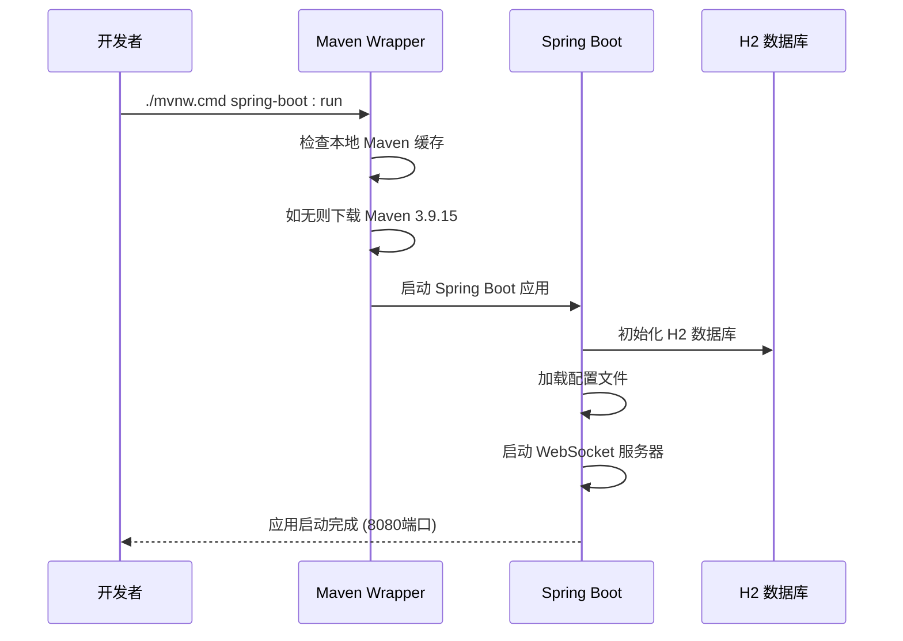

**图表来源**
- [mvnw.cmd:125-147](file://mvnw.cmd#L125-L147)
- [application.yml:1-84](file://application.yml#L1-L84)

### 前端启动流程

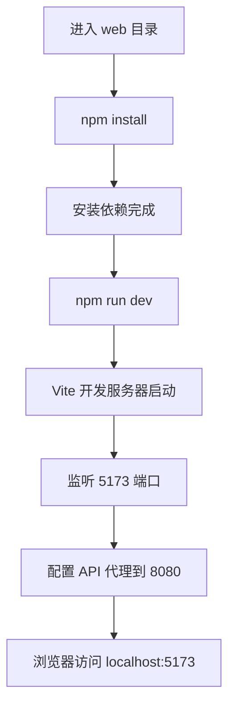

**图表来源**
- [README.md:136-144](file://README.md#L136-L144)
- [vite.config.ts:13-21](file://vite.config.ts#L13-L21)

### 启动验证

1. **后端验证**:
   - 访问: `http://localhost:8080`
   - H2 控制台: `http://localhost:8080/h2-console`
   - API 文档: `http://localhost:8080/swagger-ui.html`

2. **前端验证**:
   - 访问: `http://localhost:5173`
   - 确认 API 代理正常工作

**章节来源**
- [README.md:124-144](file://README.md#L124-L144)
- [application.yml:1-84](file://application.yml#L1-L84)

## 常见问题排查

### 端口冲突解决

| 端口 | 用途 | 冲突解决方案 |
|------|------|-------------|
| 8080 | Spring Boot 后端 | 修改 application.yml 中的 server.port |
| 5173 | Vite 前端开发 | 修改 vite.config.ts 中的 server.port |
| 1521 | H2 控制台 | 修改 H2 控制台端口或关闭其他实例 |

**配置修改示例**:
```yaml
# application.yml
server:
  port: 8081  # 修改后端端口

# vite.config.ts
server: {
  port: 5174,  # 修改前端端口
}
```

### 内存不足处理

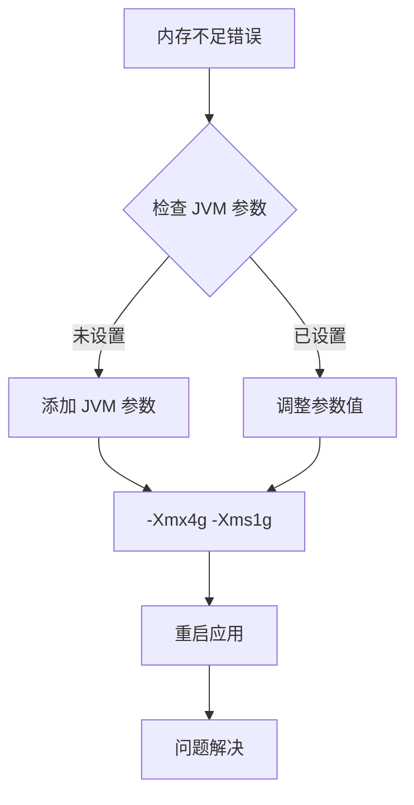

**JVM 参数配置**:
```bash
# 在启动脚本中添加
export JAVA_OPTS="-Xmx4g -Xms1g -XX:+UseG1GC"
```

### 网络代理配置

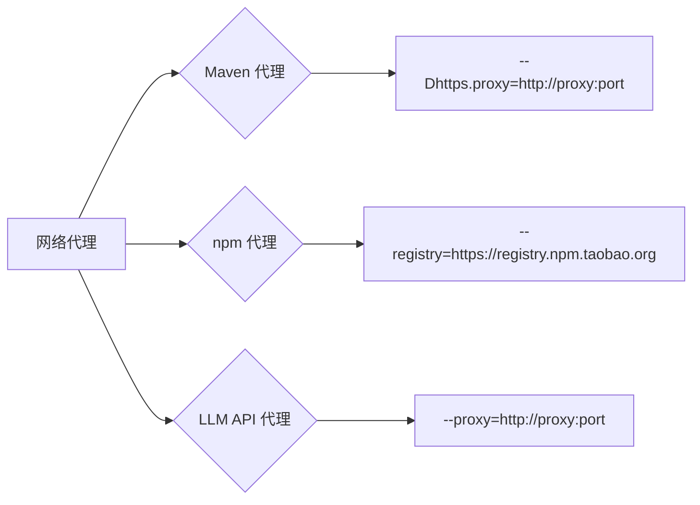

**代理配置示例**:
```bash
# Maven 代理
mvn -Dhttps.proxyHost=proxy -Dhttps.proxyPort=8080

# npm 代理
npm config set registry https://registry.npm.taobao.org/

# Git 代理
git config --global http.proxy http://proxy:port
```

### 数据库连接问题

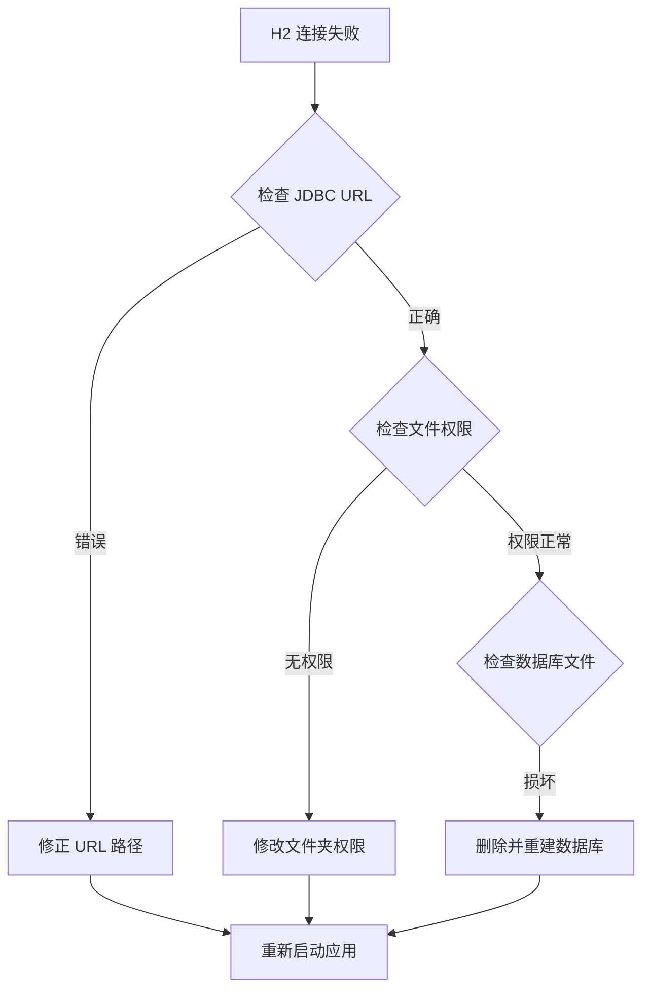

**H2 配置检查**:
```yaml
# application.yml
spring:
  datasource:
    url: jdbc:h2:file:./data/db/llmwiki;AUTO_SERVER=TRUE;DB_CLOSE_DELAY=-1
    driver-class-name: org.h2.Driver
```

**章节来源**
- [application.yml:11-29](file://application.yml#L11-L29)
- [README.md:228-238](file://README.md#L228-L238)

## 开发工具推荐

### 代码格式化

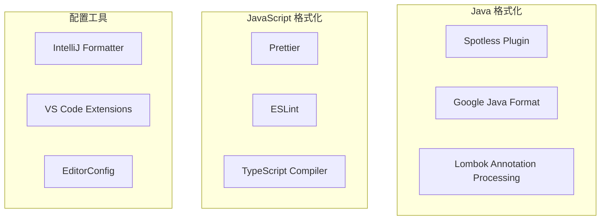

**推荐配置**:
- **Java**: Google Java Style + Spotless 插件
- **JavaScript**: Prettier + ESLint + TypeScript
- **统一配置**: .editorconfig + .prettierrc

### 调试配置

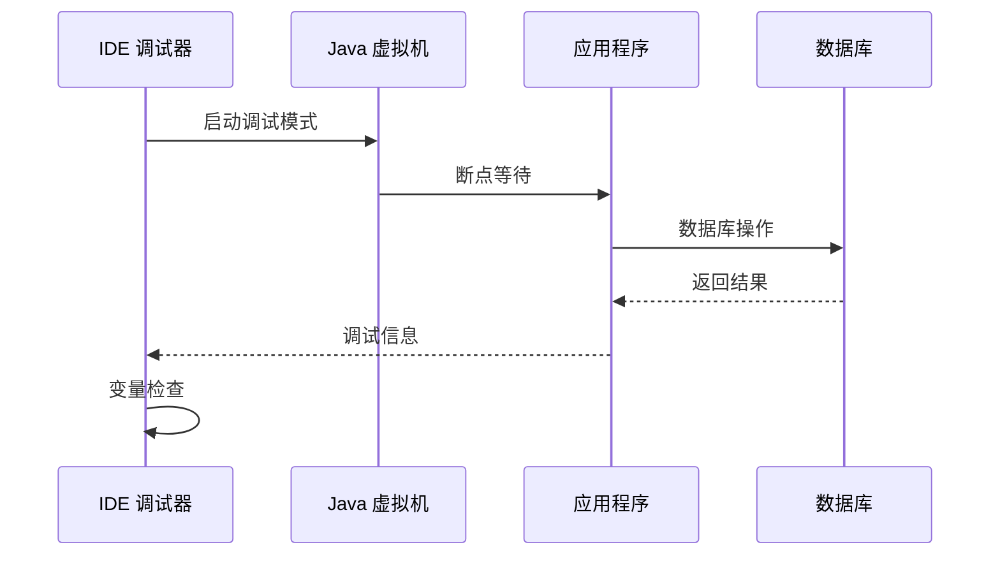

**调试配置建议**:
- **断点设置**: 关键业务逻辑入口
- **条件断点**: 特定参数或异常情况
- **日志断点**: 非阻塞调试方式
- **远程调试**: Docker 容器内调试

### 热部署设置

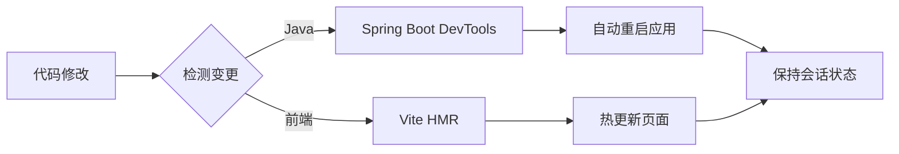

**热部署配置**:
```yaml
# application.yml
spring:
  devtools:
    restart:
      enabled: true
    livereload:
      enabled: true
  thymeleaf:
    cache: false
```

**章节来源**
- [README.md:216-225](file://README.md#L216-L225)

## 性能考虑

### 内存优化

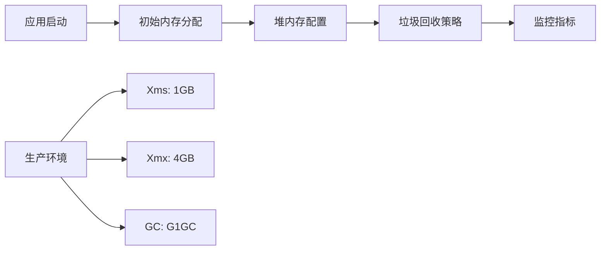

**内存配置建议**:
- **开发环境**: `-Xms512m -Xmx2g`
- **测试环境**: `-Xms1g -Xmx4g`
- **生产环境**: `-Xms2g -Xmx8g`

### 并发处理

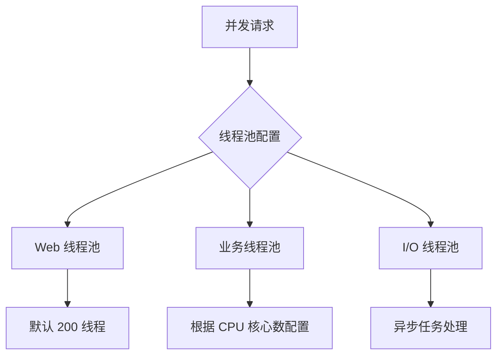

**线程池配置**:
```yaml
# application.yml
spring:
  task:
    scheduling:
      pool:
        size: 10
    execution:
      pool:
        max-size: 20
        queue-capacity: 100
```

## 故障排除指南

### 启动失败诊断

```mermaid
flowchart TD
A[应用启动失败] --> B{检查端口占用}
A --> C{检查依赖下载}
A --> D{检查配置文件}
B --> E[netstat -ano | findstr :8080]
C --> F[mvnw.cmd clean install]
D --> G[检查 application.yml]
E --> H[释放端口或修改配置]
F --> I[重新下载依赖]
G --> J[修复配置错误]
```

### 依赖问题解决

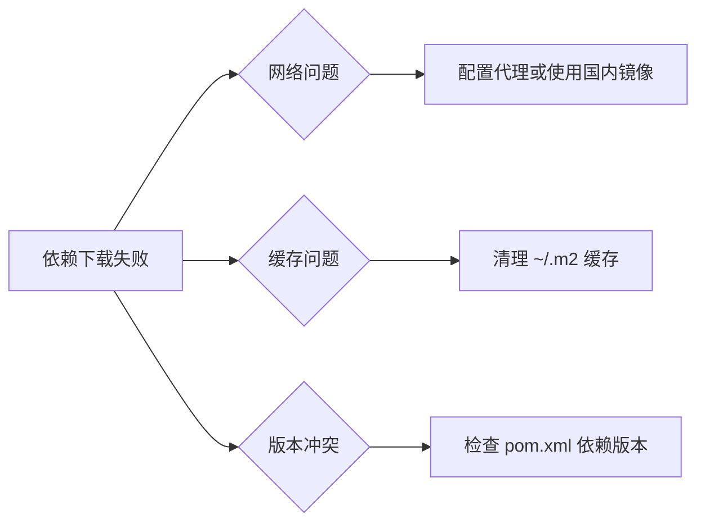

**依赖清理命令**:
```bash
# 清理 Maven 缓存
rm -rf ~/.m2/repository/com/example/llm-wiki

# 清理 npm 缓存
npm cache clean --force

# 重新安装依赖
npm install
```

### 数据库问题处理

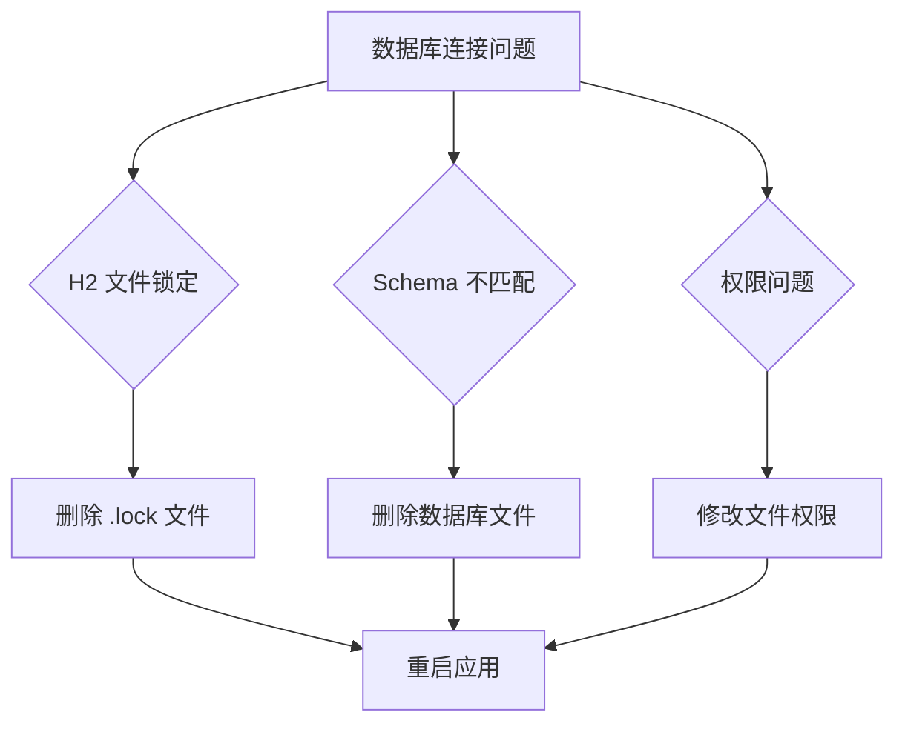

**数据库重置步骤**:
```bash
# 删除 H2 数据库文件
rm -rf ./data/db/*

# 删除 Lucene 索引
rm -rf ./data/index/*

# 重新启动应用
./mvnw.cmd spring-boot:run
```

**章节来源**
- [README.md:228-249](file://README.md#L228-L249)

## 结论

LLM Wiki 项目提供了完整的企业级知识库解决方案，具有清晰的架构设计和完善的开发工具链。通过遵循本文档的环境搭建指南，开发者可以快速建立开发环境并开始项目开发。

### 关键要点总结

1. **环境要求**: Java 17+、Node.js 18+、Git 工具是开发的基础要求
2. **依赖管理**: Maven Wrapper 和 npm 包管理器确保依赖的一致性
3. **启动流程**: 后端 8080 端口 + 前端 5173 端口的双端启动模式
4. **问题排查**: 端口冲突、内存不足、网络代理是常见问题
5. **开发工具**: IDE 配置、代码格式化、调试和热部署提升开发效率

### 后续步骤建议

1. 完成环境搭建后，先运行简单的功能测试
2. 熟悉项目目录结构和核心模块
3. 配置 LLM API 密钥进行功能验证
4. 参考编码规范进行代码贡献
5. 探索项目的设计模式和最佳实践

通过系统性的环境搭建和配置，开发者可以充分利用 LLM Wiki 的强大功能，构建自己的智能知识库系统。