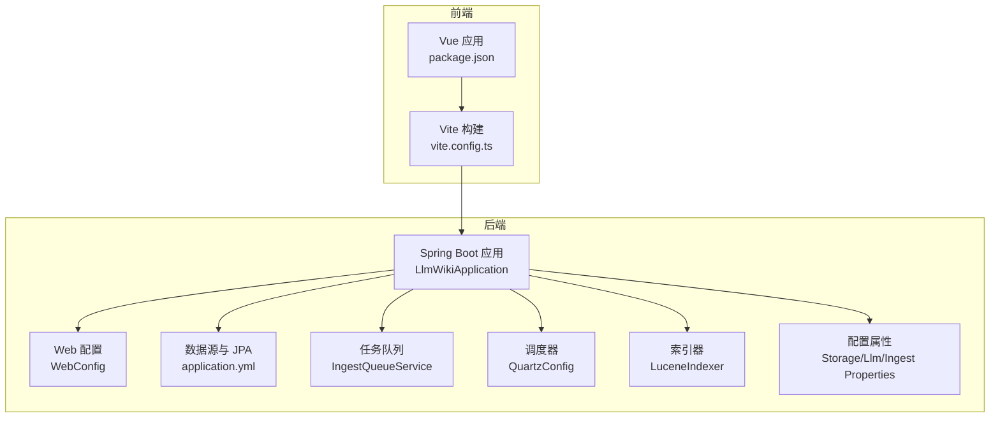
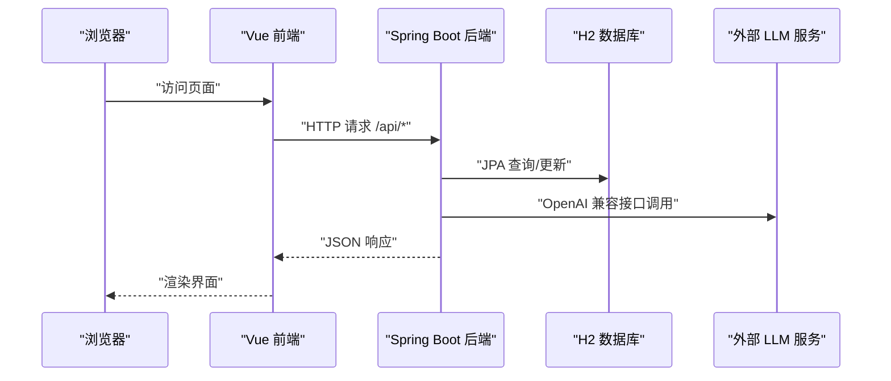
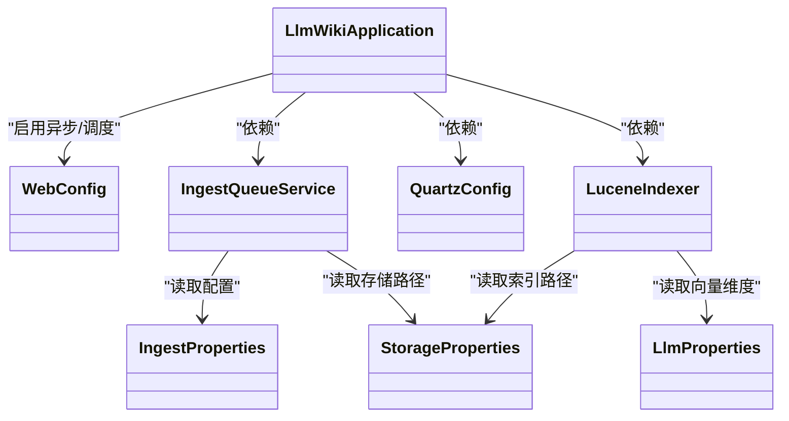
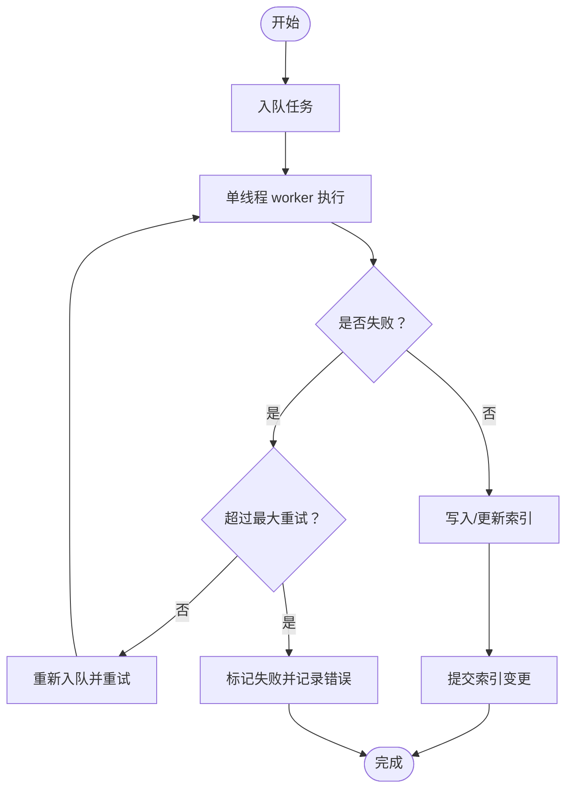

# 性能优化策略

<cite>
**本文档引用的文件**
- [pom.xml](file://pom.xml)
- [application.yml](file://src/main/resources/application.yml)
- [LlmWikiApplication.java](file://src/main/java/com/example/llmwiki/LlmWikiApplication.java)
- [WebConfig.java](file://src/main/java/com/example/llmwiki/config/WebConfig.java)
- [StorageProperties.java](file://src/main/java/com/example/llmwiki/config/StorageProperties.java)
- [LlmProperties.java](file://src/main/java/com/example/llmwiki/config/LlmProperties.java)
- [IngestProperties.java](file://src/main/java/com/example/llmwiki/config/IngestProperties.java)
- [LuceneIndexer.java](file://src/main/java/com/example/llmwiki/retrieval/LuceneIndexer.java)
- [QuartzConfig.java](file://src/main/java/com/example/llmwiki/scheduler/QuartzConfig.java)
- [IngestQueueService.java](file://src/main/java/com/example/llmwiki/queue/IngestQueueService.java)
- [package.json](file://web/package.json)
- [vite.config.ts](file://web/vite.config.ts)
</cite>

## 目录
1. [简介](#简介)
2. [项目结构](#项目结构)
3. [核心组件](#核心组件)
4. [架构总览](#架构总览)
5. [详细组件分析](#详细组件分析)
6. [依赖关系分析](#依赖关系分析)
7. [性能考虑](#性能考虑)
8. [故障排查指南](#故障排查指南)
9. [结论](#结论)
10. [附录](#附录)

## 简介
本文件面向 LLM Wiki 项目的性能优化，围绕以下方面提供系统性策略与落地建议：
- JVM 参数调优：堆内存配置、垃圾回收器选择、GC 日志配置
- 数据库连接池优化：HikariCP 配置、连接数调优、查询超时设置
- 前端资源优化：Vue 打包优化、静态资源压缩、CDN 配置
- Lucene 索引优化：索引段合并策略、查询缓存配置、内存使用控制
- 并发处理优化：线程池配置、异步任务处理、限流策略
- 缓存策略：Redis 集成、本地缓存配置、缓存失效策略
- 监控指标：CPU 使用率、内存占用、请求响应时间、错误率监控

## 项目结构
项目采用 Spring Boot 后端 + Vue 前端的双栈架构，核心模块包括：
- 后端：Spring Web、JPA/H2、Quartz、Lucene、文件解析与索引、任务队列
- 前端：Vue3 + Vite + Element Plus + AntV G6 + ECharts

**图表来源**
- [LlmWikiApplication.java:19-26](file://src/main/java/com/example/llmwiki/LlmWikiApplication.java#L19-L26)
- [WebConfig.java:15-34](file://src/main/java/com/example/llmwiki/config/WebConfig.java#L15-L34)
- [application.yml:1-84](file://src/main/resources/application.yml#L1-L84)
- [IngestQueueService.java:34-68](file://src/main/java/com/example/llmwiki/queue/IngestQueueService.java#L34-L68)
- [QuartzConfig.java:28-89](file://src/main/java/com/example/llmwiki/scheduler/QuartzConfig.java#L28-L89)
- [LuceneIndexer.java:36-73](file://src/main/java/com/example/llmwiki/retrieval/LuceneIndexer.java#L36-L73)
- [StorageProperties.java:13-28](file://src/main/java/com/example/llmwiki/config/StorageProperties.java#L13-L28)
- [package.json:1-31](file://web/package.json#L1-L31)
- [vite.config.ts:1-23](file://web/vite.config.ts#L1-L23)

**章节来源**
- [LlmWikiApplication.java:1-29](file://src/main/java/com/example/llmwiki/LlmWikiApplication.java#L1-L29)
- [application.yml:1-84](file://src/main/resources/application.yml#L1-L84)
- [package.json:1-31](file://web/package.json#L1-L31)
- [vite.config.ts:1-23](file://web/vite.config.ts#L1-L23)

## 核心组件
- 应用入口与并发能力
  - 启用异步与调度注解，便于扩展异步任务与定时作业
  - 参考路径：[LlmWikiApplication.java:19-26](file://src/main/java/com/example/llmwiki/LlmWikiApplication.java#L19-L26)
- Web 层配置
  - CORS 放通、共享 RestClient，减少网络开销
  - 参考路径：[WebConfig.java:15-34](file://src/main/java/com/example/llmwiki/config/WebConfig.java#L15-L34)
- 数据源与 JPA
  - H2 内嵌数据库、DDL 自动更新、Hibernate 方言、multipart 上传限制
  - 参考路径：[application.yml:11-29](file://src/main/resources/application.yml#L11-L29)
- 配置属性
  - 存储路径、LLM 模型参数、摄取与调度配置
  - 参考路径：[StorageProperties.java:13-28](file://src/main/java/com/example/llmwiki/config/StorageProperties.java#L13-L28)，[LlmProperties.java:16-62](file://src/main/java/com/example/llmwiki/config/LlmProperties.java#L16-L62)，[IngestProperties.java:13-32](file://src/main/java/com/example/llmwiki/config/IngestProperties.java#L13-L32)
- 任务队列与调度
  - 单线程串行 worker、失败重试、Quartz Cron 触发
  - 参考路径：[IngestQueueService.java:45-68](file://src/main/java/com/example/llmwiki/queue/IngestQueueService.java#L45-L68)，[QuartzConfig.java:64-80](file://src/main/java/com/example/llmwiki/scheduler/QuartzConfig.java#L64-L80)
- Lucene 索引
  - 中文分词、KNN 向量字段、FSDirectory、同步 upsert/delete
  - 参考路径：[LuceneIndexer.java:48-108](file://src/main/java/com/example/llmwiki/retrieval/LuceneIndexer.java#L48-L108)

**章节来源**
- [LlmWikiApplication.java:19-26](file://src/main/java/com/example/llmwiki/LlmWikiApplication.java#L19-L26)
- [WebConfig.java:15-34](file://src/main/java/com/example/llmwiki/config/WebConfig.java#L15-L34)
- [application.yml:11-29](file://src/main/resources/application.yml#L11-L29)
- [StorageProperties.java:13-28](file://src/main/java/com/example/llmwiki/config/StorageProperties.java#L13-L28)
- [LlmProperties.java:16-62](file://src/main/java/com/example/llmwiki/config/LlmProperties.java#L16-L62)
- [IngestProperties.java:13-32](file://src/main/java/com/example/llmwiki/config/IngestProperties.java#L13-L32)
- [IngestQueueService.java:45-68](file://src/main/java/com/example/llmwiki/queue/IngestQueueService.java#L45-L68)
- [QuartzConfig.java:64-80](file://src/main/java/com/example/llmwiki/scheduler/QuartzConfig.java#L64-L80)
- [LuceneIndexer.java:48-108](file://src/main/java/com/example/llmwiki/retrieval/LuceneIndexer.java#L48-L108)

## 架构总览
下图展示从浏览器到后端服务、数据库与外部 LLM 的关键交互路径。

**图表来源**
- [WebConfig.java:18-25](file://src/main/java/com/example/llmwiki/config/WebConfig.java#L18-L25)
- [application.yml:11-29](file://src/main/resources/application.yml#L11-L29)
- [LlmProperties.java:31-42](file://src/main/java/com/example/llmwiki/config/LlmProperties.java#L31-L42)

## 详细组件分析

### JVM 参数调优
- 堆内存配置
  - 建议最小堆与最大堆比例合理，避免频繁 Full GC；结合应用吞吐与延迟目标设定
  - 参考路径：[pom.xml:29-35](file://pom.xml#L29-L35)
- 垃圾回收器选择
  - 对低延迟场景优先考虑 G1 或 ZGC；对高吞吐场景可考虑 G1/Parallel
  - 参考路径：[pom.xml:29-35](file://pom.xml#L29-L35)
- GC 日志配置
  - 开启 GC 日志以便定位停顿与内存增长趋势
  - 参考路径：[application.yml:78-84](file://src/main/resources/application.yml#L78-L84)

**章节来源**
- [pom.xml:29-35](file://pom.xml#L29-L35)
- [application.yml:78-84](file://src/main/resources/application.yml#L78-L84)

### 数据库连接池优化（HikariCP）
- 当前配置现状
  - 使用 H2 内嵌数据库，默认连接池由 Spring Boot 自动配置
  - 参考路径：[application.yml:11-29](file://src/main/resources/application.yml#L11-L29)
- 优化建议
  - 连接数：根据并发请求数与数据库承载能力设置，避免过多连接导致上下文切换
  - 查询超时：为慢查询设置合理超时，防止连接被长时间占用
  - 连接生命周期：设置合理的空闲超时与连接寿命，降低资源泄漏风险
  - 参考路径：[application.yml:11-29](file://src/main/resources/application.yml#L11-L29)

**章节来源**
- [application.yml:11-29](file://src/main/resources/application.yml#L11-L29)

### 前端资源优化（Vue/Vite）
- 打包优化
  - 使用 Vite 的原生预构建与按需加载，减少首屏体积
  - 参考路径：[package.json:7-11](file://web/package.json#L7-L11)，[vite.config.ts:1-23](file://web/vite.config.ts#L1-L23)
- 静态资源压缩
  - 生产构建默认启用压缩；确保 CDN/服务器开启 gzip/br 压缩
  - 参考路径：[package.json:7-11](file://web/package.json#L7-L11)
- CDN 配置
  - 将第三方依赖交由 CDN 加载，降低主站带宽压力
  - 参考路径：[vite.config.ts:13-21](file://web/vite.config.ts#L13-L21)

**章节来源**
- [package.json:7-11](file://web/package.json#L7-L11)
- [vite.config.ts:13-21](file://web/vite.config.ts#L13-L21)

### Lucene 索引优化
- 索引段合并策略
  - 合理设置合并触发阈值与合并因子，平衡写入与查询性能
  - 参考路径：[LuceneIndexer.java:54-56](file://src/main/java/com/example/llmwiki/retrieval/LuceneIndexer.java#L54-L56)
- 查询缓存配置
  - 在查询层启用合适的查询缓存，减少重复计算
  - 参考路径：[LuceneIndexer.java:106-108](file://src/main/java/com/example/llmwiki/retrieval/LuceneIndexer.java#L106-L108)
- 内存使用控制
  - 控制索引缓冲区大小与向量维度，避免 OOM
  - 参考路径：[LlmProperties.java:45-52](file://src/main/java/com/example/llmwiki/config/LlmProperties.java#L45-L52)，[LuceneIndexer.java:87-96](file://src/main/java/com/example/llmwiki/retrieval/LuceneIndexer.java#L87-L96)

**章节来源**
- [LuceneIndexer.java:54-56](file://src/main/java/com/example/llmwiki/retrieval/LuceneIndexer.java#L54-L56)
- [LuceneIndexer.java:106-108](file://src/main/java/com/example/llmwiki/retrieval/LuceneIndexer.java#L106-L108)
- [LlmProperties.java:45-52](file://src/main/java/com/example/llmwiki/config/LlmProperties.java#L45-L52)
- [LuceneIndexer.java:87-96](file://src/main/java/com/example/llmwiki/retrieval/LuceneIndexer.java#L87-L96)

### 并发处理优化
- 线程池配置
  - 当前任务队列使用单线程 worker，适合串行一致性；若业务允许可扩展为多线程池
  - 参考路径：[IngestQueueService.java:45-49](file://src/main/java/com/example/llmwiki/queue/IngestQueueService.java#L45-L49)
- 异步任务处理
  - 利用 @EnableAsync 与自定义线程池，分离 CPU 密集与 IO 密集任务
  - 参考路径：[LlmWikiApplication.java:19-21](file://src/main/java/com/example/llmwiki/LlmWikiApplication.java#L19-L21)
- 限流策略
  - 对外部 LLM 接口进行限流与熔断，避免突发流量压垮上游
  - 参考路径：[LlmProperties.java:31-42](file://src/main/java/com/example/llmwiki/config/LlmProperties.java#L31-L42)

**章节来源**
- [IngestQueueService.java:45-49](file://src/main/java/com/example/llmwiki/queue/IngestQueueService.java#L45-L49)
- [LlmWikiApplication.java:19-21](file://src/main/java/com/example/llmwiki/LlmWikiApplication.java#L19-L21)
- [LlmProperties.java:31-42](file://src/main/java/com/example/llmwiki/config/LlmProperties.java#L31-L42)

### 缓存策略
- Redis 集成
  - 对热点查询结果与中间计算结果进行缓存，降低重复计算与数据库压力
  - 参考路径：[application.yml:11-29](file://src/main/resources/application.yml#L11-L29)
- 本地缓存配置
  - 使用 Caffeine/ConcurrentHashMap 等本地缓存，加速高频读取
  - 参考路径：[IngestQueueService.java:51-51](file://src/main/java/com/example/llmwiki/queue/IngestQueueService.java#L51-L51)
- 缓存失效策略
  - 基于 TTL 与事件驱动失效，保证数据一致性
  - 参考路径：[IngestQueueService.java:115-134](file://src/main/java/com/example/llmwiki/queue/IngestQueueService.java#L115-L134)

**章节来源**
- [application.yml:11-29](file://src/main/resources/application.yml#L11-L29)
- [IngestQueueService.java:51-51](file://src/main/java/com/example/llmwiki/queue/IngestQueueService.java#L51-L51)
- [IngestQueueService.java:115-134](file://src/main/java/com/example/llmwiki/queue/IngestQueueService.java#L115-L134)

### 监控指标
- CPU 使用率：容器/主机层面采集，结合 GC 日志分析停顿
  - 参考路径：[application.yml:78-84](file://src/main/resources/application.yml#L78-L84)
- 内存占用：堆内外存分布、线程池与 Lucene 缓冲区
  - 参考路径：[pom.xml:29-35](file://pom.xml#L29-L35)，[LuceneIndexer.java:48-58](file://src/main/java/com/example/llmwiki/retrieval/LuceneIndexer.java#L48-L58)
- 请求响应时间：后端接口与前端路由切换耗时
  - 参考路径：[WebConfig.java:18-25](file://src/main/java/com/example/llmwiki/config/WebConfig.java#L18-L25)，[vite.config.ts:13-21](file://web/vite.config.ts#L13-L21)
- 错误率监控：异常捕获与告警，结合重试与降级
  - 参考路径：[IngestQueueService.java:194-211](file://src/main/java/com/example/llmwiki/queue/IngestQueueService.java#L194-L211)

**章节来源**
- [application.yml:78-84](file://src/main/resources/application.yml#L78-L84)
- [pom.xml:29-35](file://pom.xml#L29-L35)
- [LuceneIndexer.java:48-58](file://src/main/java/com/example/llmwiki/retrieval/LuceneIndexer.java#L48-L58)
- [WebConfig.java:18-25](file://src/main/java/com/example/llmwiki/config/WebConfig.java#L18-L25)
- [vite.config.ts:13-21](file://web/vite.config.ts#L13-L21)
- [IngestQueueService.java:194-211](file://src/main/java/com/example/llmwiki/queue/IngestQueueService.java#L194-L211)

## 依赖关系分析

**图表来源**
- [LlmWikiApplication.java:19-26](file://src/main/java/com/example/llmwiki/LlmWikiApplication.java#L19-L26)
- [WebConfig.java:15-34](file://src/main/java/com/example/llmwiki/config/WebConfig.java#L15-L34)
- [StorageProperties.java:13-28](file://src/main/java/com/example/llmwiki/config/StorageProperties.java#L13-L28)
- [LlmProperties.java:16-62](file://src/main/java/com/example/llmwiki/config/LlmProperties.java#L16-L62)
- [IngestProperties.java:13-32](file://src/main/java/com/example/llmwiki/config/IngestProperties.java#L13-L32)
- [IngestQueueService.java:34-68](file://src/main/java/com/example/llmwiki/queue/IngestQueueService.java#L34-L68)
- [QuartzConfig.java:28-89](file://src/main/java/com/example/llmwiki/scheduler/QuartzConfig.java#L28-L89)
- [LuceneIndexer.java:36-73](file://src/main/java/com/example/llmwiki/retrieval/LuceneIndexer.java#L36-L73)

**章节来源**
- [LlmWikiApplication.java:19-26](file://src/main/java/com/example/llmwiki/LlmWikiApplication.java#L19-L26)
- [WebConfig.java:15-34](file://src/main/java/com/example/llmwiki/config/WebConfig.java#L15-L34)
- [StorageProperties.java:13-28](file://src/main/java/com/example/llmwiki/config/StorageProperties.java#L13-L28)
- [LlmProperties.java:16-62](file://src/main/java/com/example/llmwiki/config/LlmProperties.java#L16-L62)
- [IngestProperties.java:13-32](file://src/main/java/com/example/llmwiki/config/IngestProperties.java#L13-L32)
- [IngestQueueService.java:34-68](file://src/main/java/com/example/llmwiki/queue/IngestQueueService.java#L34-L68)
- [QuartzConfig.java:28-89](file://src/main/java/com/example/llmwiki/scheduler/QuartzConfig.java#L28-L89)
- [LuceneIndexer.java:36-73](file://src/main/java/com/example/llmwiki/retrieval/LuceneIndexer.java#L36-L73)

## 性能考虑
- JVM 层
  - 明确 GC 类型与日志策略，结合业务峰值流量进行压测验证
  - 参考路径：[pom.xml:29-35](file://pom.xml#L29-L35)，[application.yml:78-84](file://src/main/resources/application.yml#L78-L84)
- 数据库层
  - H2 适合开发测试；生产建议迁移到 PostgreSQL/MySQL，并启用连接池参数优化
  - 参考路径：[application.yml:11-29](file://src/main/resources/application.yml#L11-L29)
- 索引层
  - 控制向量维度与批量写入频率，避免频繁 commit 导致磁盘抖动
  - 参考路径：[LlmProperties.java:45-52](file://src/main/java/com/example/llmwiki/config/LlmProperties.java#L45-L52)，[LuceneIndexer.java:97-98](file://src/main/java/com/example/llmwiki/retrieval/LuceneIndexer.java#L97-L98)
- 并发层
  - 任务队列单线程保障一致性；若吞吐不足，可拆分多队列或引入消息队列
  - 参考路径：[IngestQueueService.java:45-49](file://src/main/java/com/example/llmwiki/queue/IngestQueueService.java#L45-L49)
- 前端层
  - 通过懒加载与 Tree-shaking 减少包体；CDN 分担静态资源
  - 参考路径：[package.json:7-11](file://web/package.json#L7-L11)，[vite.config.ts:13-21](file://web/vite.config.ts#L13-L21)

[本节为通用指导，不直接分析具体文件，故无“章节来源”]

## 故障排查指南
- 任务失败与重试
  - 查看任务状态机流转与重试次数上限，必要时调整最大重试与超时
  - 参考路径：[IngestQueueService.java:194-211](file://src/main/java/com/example/llmwiki/queue/IngestQueueService.java#L194-L211)，[IngestProperties.java:22-25](file://src/main/java/com/example/llmwiki/config/IngestProperties.java#L22-L25)
- LLM 调用异常
  - 校验超时、鉴权与模型参数，必要时增加限流与熔断
  - 参考路径：[LlmProperties.java:31-42](file://src/main/java/com/example/llmwiki/config/LlmProperties.java#L31-L42)
- Lucene 写入阻塞
  - 检查索引提交频率与磁盘 IO，适当降低批量写入粒度
  - 参考路径：[LuceneIndexer.java:97-98](file://src/main/java/com/example/llmwiki/retrieval/LuceneIndexer.java#L97-L98)

**章节来源**
- [IngestQueueService.java:194-211](file://src/main/java/com/example/llmwiki/queue/IngestQueueService.java#L194-L211)
- [IngestProperties.java:22-25](file://src/main/java/com/example/llmwiki/config/IngestProperties.java#L22-L25)
- [LlmProperties.java:31-42](file://src/main/java/com/example/llmwiki/config/LlmProperties.java#L31-L42)
- [LuceneIndexer.java:97-98](file://src/main/java/com/example/llmwiki/retrieval/LuceneIndexer.java#L97-L98)

## 结论
本优化策略以现有代码为依据，结合 JVM、数据库、前端、索引、并发与缓存六大维度提出可落地的改进方向。建议在测试环境先行验证，再逐步推广至生产，同时建立完善的监控与告警体系，持续迭代性能表现。

[本节为总结性内容，不直接分析具体文件，故无“章节来源”]

## 附录
- 关键流程图：任务执行与索引写入

**图表来源**
- [IngestQueueService.java:151-212](file://src/main/java/com/example/llmwiki/queue/IngestQueueService.java#L151-L212)
- [LuceneIndexer.java:78-98](file://src/main/java/com/example/llmwiki/retrieval/LuceneIndexer.java#L78-L98)