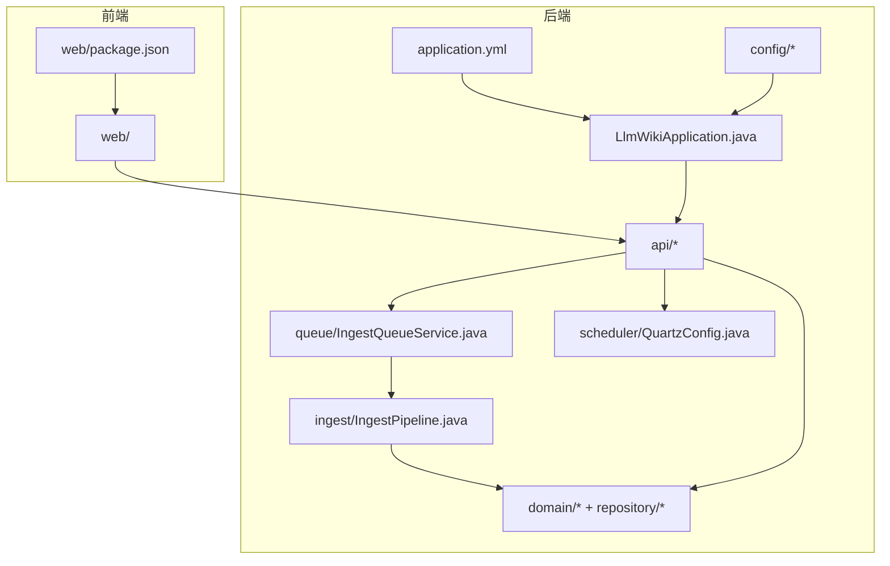
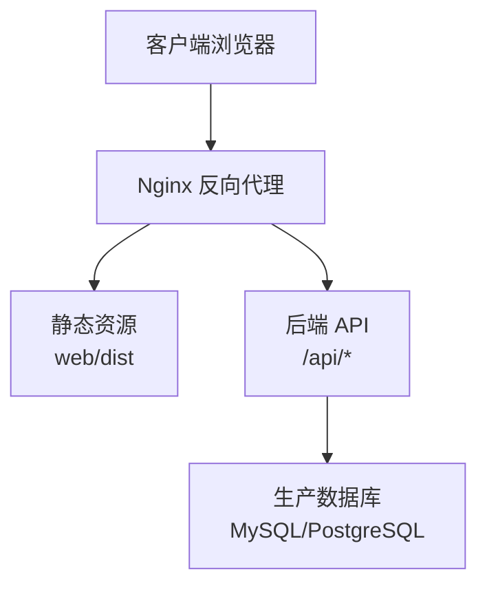
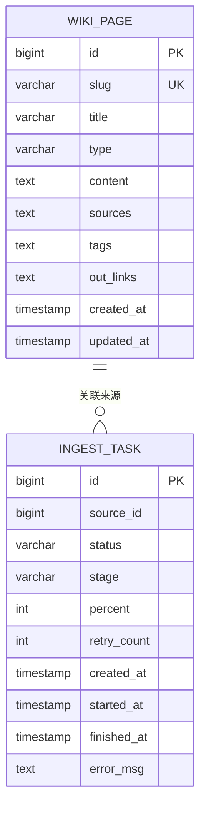
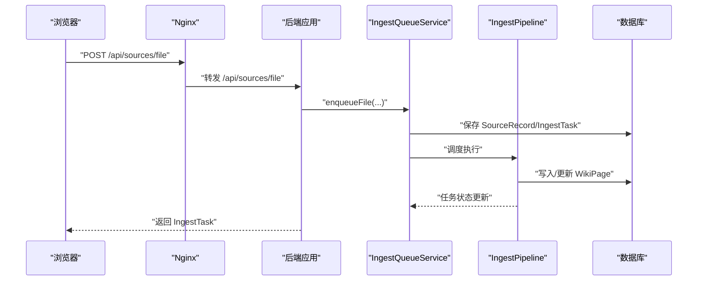
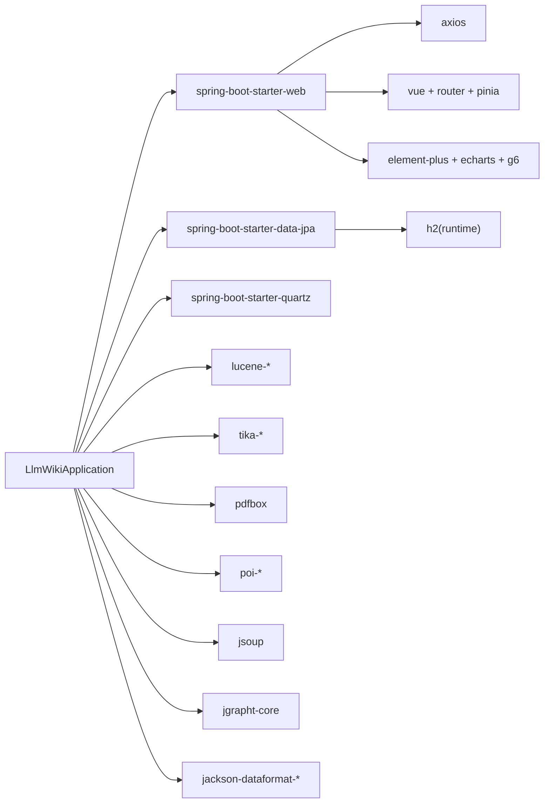

# 生产部署配置

<cite>
**本文档引用的文件**
- [pom.xml](file://pom.xml)
- [application.yml](file://src/main/resources/application.yml)
- [LlmWikiApplication.java](file://src/main/java/com/example/llmwiki/LlmWikiApplication.java)
- [WebConfig.java](file://src/main/java/com/example/llmwiki/config/WebConfig.java)
- [StorageProperties.java](file://src/main/java/com/example/llmwiki/config/StorageProperties.java)
- [LlmProperties.java](file://src/main/java/com/example/llmwiki/config/LlmProperties.java)
- [ParserProperties.java](file://src/main/java/com/example/llmwiki/config/ParserProperties.java)
- [IngestProperties.java](file://src/main/java/com/example/llmwiki/config/IngestProperties.java)
- [SettingsController.java](file://src/main/java/com/example/llmwiki/api/SettingsController.java)
- [SourcesController.java](file://src/main/java/com/example/llmwiki/api/SourcesController.java)
- [ScheduleController.java](file://src/main/java/com/example/llmwiki/api/ScheduleController.java)
- [IngestQueueService.java](file://src/main/java/com/example/llmwiki/queue/IngestQueueService.java)
- [IngestPipeline.java](file://src/main/java/com/example/llmwiki/ingest/IngestPipeline.java)
- [WikiPage.java](file://src/main/java/com/example/llmwiki/domain/WikiPage.java)
- [IngestTask.java](file://src/main/java/com/example/llmwiki/domain/IngestTask.java)
- [SourceRecordRepository.java](file://src/main/java/com/example/llmwiki/repository/SourceRecordRepository.java)
- [QuartzConfig.java](file://src/main/java/com/example/llmwiki/scheduler/QuartzConfig.java)
- [package.json](file://web/package.json)
- [index.ts](file://web/src/api/index.ts)
- [Settings.vue](file://web/src/views/Settings.vue)
</cite>

## 目录
1. [简介](#简介)
2. [项目结构](#项目结构)
3. [核心组件](#核心组件)
4. [架构总览](#架构总览)
5. [详细组件分析](#详细组件分析)
6. [依赖分析](#依赖分析)
7. [性能考虑](#性能考虑)
8. [故障排查指南](#故障排查指南)
9. [结论](#结论)
10. [附录](#附录)

## 简介
本文件面向生产环境，提供 LLM Wiki 的完整部署配置方案，涵盖容器化（Docker）、反向代理（Nginx）、SSL 证书（Let's Encrypt）、应用配置管理、数据库迁移与连接池、以及自动化部署与回滚策略。文档以仓库现有代码为基础，结合 Spring Boot、JPA/Hibernate、Quartz 调度、Vue3 前端等技术栈进行说明。

## 项目结构
- 后端采用 Spring Boot 3.3.5 + Java 17，使用 Maven 构建。
- 默认使用嵌入式 H2 数据库，生产环境建议替换为 MySQL/PostgreSQL。
- 前端基于 Vue3 + Vite，提供静态资源构建能力。
- 应用通过 application.yml 提供默认配置，支持通过环境变量覆盖。

图表来源
- [LlmWikiApplication.java:1-29](file://src/main/java/com/example/llmwiki/LlmWikiApplication.java#L1-L29)
- [application.yml:1-84](file://src/main/resources/application.yml#L1-L84)
- [WebConfig.java:1-35](file://src/main/java/com/example/llmwiki/config/WebConfig.java#L1-L35)
- [SourcesController.java:34-70](file://src/main/java/com/example/llmwiki/api/SourcesController.java#L34-L70)
- [IngestQueueService.java:105-144](file://src/main/java/com/example/llmwiki/queue/IngestQueueService.java#L105-L144)
- [IngestPipeline.java:66-93](file://src/main/java/com/example/llmwiki/ingest/IngestPipeline.java#L66-L93)
- [WikiPage.java:1-71](file://src/main/java/com/example/llmwiki/domain/WikiPage.java#L1-L71)
- [IngestTask.java:1-61](file://src/main/java/com/example/llmwiki/domain/IngestTask.java#L1-L61)
- [QuartzConfig.java:37-72](file://src/main/java/com/example/llmwiki/scheduler/QuartzConfig.java#L37-L72)

章节来源
- [pom.xml:1-171](file://pom.xml#L1-L171)
- [application.yml:1-84](file://src/main/resources/application.yml#L1-L84)
- [package.json:1-31](file://web/package.json#L1-L31)

## 核心组件
- 应用入口与启动：Spring Boot 启动类启用异步与调度。
- 配置体系：application.yml 提供默认值；通过 @ConfigurationProperties 绑定到 Java 对象，支持运行时热更新。
- 数据访问：JPA/Hibernate + H2（开发）；生产建议 MySQL/PostgreSQL。
- 调度系统：Quartz 内存存储，适合单实例；生产建议使用 JDBC 存储或外部调度平台。
- 前后端交互：前端通过 axios 发起 REST 请求，后端提供统一 API 前缀。

章节来源
- [LlmWikiApplication.java:19-26](file://src/main/java/com/example/llmwiki/LlmWikiApplication.java#L19-L26)
- [application.yml:11-30](file://src/main/resources/application.yml#L11-L30)
- [WebConfig.java:18-33](file://src/main/java/com/example/llmwiki/config/WebConfig.java#L18-L33)
- [SettingsController.java:24-70](file://src/main/java/com/example/llmwiki/api/SettingsController.java#L24-L70)

## 架构总览
下图展示生产部署的关键组件与数据流：Nginx 作为反向代理，承载静态资源与 API 转发；后端应用处理业务逻辑并访问数据库；前端通过 API 与后端交互。

图表来源
- [index.ts:25-55](file://web/src/api/index.ts#L25-L55)
- [application.yml:1-3](file://src/main/resources/application.yml#L1-L3)

## 详细组件分析

### Docker 容器化部署
- 基础镜像选择：建议使用官方 OpenJDK 17 或 21 的 slim 镜像，确保体积最小化与安全基线。
- 多阶段构建：前端使用 Node.js 构建静态资源，后端使用 Maven 打包 JAR；最终镜像仅包含运行时产物。
- 容器运行参数：
  - 端口映射：将容器内 8080 映射到宿主机端口（如 8080）。
  - 环境变量：通过 -e SPRING_PROFILES_ACTIVE=prod、SPRING_DATASOURCE_URL 等覆盖配置。
  - 卷挂载：挂载持久化目录至应用数据根目录（对应 storage.root-dir），避免容器重启丢失数据。
  - 健康检查：暴露 /actuator/health（如启用）或自定义探针。
- 优势：隔离性强、便于横向扩展与 CI/CD 集成。

章节来源
- [application.yml:11-39](file://src/main/resources/application.yml#L11-L39)
- [StorageProperties.java:18-28](file://src/main/java/com/example/llmwiki/config/StorageProperties.java#L18-L28)
- [pom.xml:36-159](file://pom.xml#L36-L159)

### Nginx 反向代理配置
- 静态资源代理：将 / 前缀映射到 web/dist，开启 gzip/缓存与 expires。
- API 转发：将 /api/* 转发至后端应用（如 http://localhost:8080）。
- 负载均衡：多实例部署时，使用 upstream + server 节点实现轮询或加权。
- 安全增强：限制请求体大小、超时、日志记录、HTTP/2/3。
- 建议：与 Let's Encrypt 结合实现 HTTPS，强制 HTTPS 重定向。

章节来源
- [index.ts:25-55](file://web/src/api/index.ts#L25-L55)
- [WebConfig.java:18-25](file://src/main/java/com/example/llmwiki/config/WebConfig.java#L18-L25)

### SSL 证书配置（Let's Encrypt）
- 申请流程：使用 certbot 获取证书，自动续期。
- Nginx 配置：在 https 块中配置 ssl_certificate、ssl_certificate_key、ssl_trusted_certificate。
- HTTPS 强制：将 80 端口重定向至 443，并开启 HSTS。
- 证书轮换：确保定时任务与证书链完整性校验。

章节来源
- [index.ts:25-55](file://web/src/api/index.ts#L25-L55)

### 应用配置管理
- 生产环境配置要点：
  - 数据源：替换 H2 为 MySQL/PostgreSQL，设置连接池参数（最大连接数、空闲超时、连接生命周期）。
  - 日志级别：root/INFO，业务包/第三方按需调整。
  - 文件上传：根据实际容量调整 multipart 限制。
  - LLM 配置：通过 /api/settings 接口热更新（运行时生效）。
- 环境变量优先级：通过 SPRING_APPLICATION_JSON 或 -e 覆盖 application.yml 中敏感字段。
- 配置文件加密：建议使用 Spring Cloud Vault/KMS 或密钥管理服务，对数据库密码、LLM API Key 加密存储。

章节来源
- [application.yml:11-84](file://src/main/resources/application.yml#L11-L84)
- [LlmProperties.java:16-45](file://src/main/java/com/example/llmwiki/config/LlmProperties.java#L16-L45)
- [SettingsController.java:34-70](file://src/main/java/com/example/llmwiki/api/SettingsController.java#L34-L70)

### 数据库部署与迁移
- 从 H2 切换到 MySQL/PostgreSQL：
  - 移除 H2 依赖或设置为 runtime 作用域，引入 MySQL 或 PostgreSQL 驱动。
  - 在 application.yml 中配置 spring.datasource.url、username、password。
  - 将 hibernate.dialect 切换为对应方言（如 MySQL 8 使用相应方言）。
- 连接池：推荐 HikariCP，设置连接超时、空闲超时、最大池大小、最小空闲等。
- 迁移策略：
  - 开发期：使用 Hibernate ddl-auto=update（不适用于生产）。
  - 生产期：使用 Flyway/Liquibase 管理迁移脚本，确保版本演进与回滚。
- 表结构：参考 domain 实体（WikiPage、IngestTask 等）生成对应表，注意索引与外键约束。

图表来源
- [WikiPage.java:23-71](file://src/main/java/com/example/llmwiki/domain/WikiPage.java#L23-L71)
- [IngestTask.java:23-61](file://src/main/java/com/example/llmwiki/domain/IngestTask.java#L23-L61)

章节来源
- [application.yml:11-29](file://src/main/resources/application.yml#L11-L29)
- [WikiPage.java:23-71](file://src/main/java/com/example/llmwiki/domain/WikiPage.java#L23-L71)
- [IngestTask.java:23-61](file://src/main/java/com/example/llmwiki/domain/IngestTask.java#L23-L61)

### 自动化部署脚本与回滚策略
- 自动化部署建议：
  - 构建：Maven 打包后端 JAR，Vite 构建前端静态资源。
  - 镜像：多阶段 Dockerfile，产出最小镜像。
  - 编排：使用 Docker Compose 或 Kubernetes，声明式管理服务与卷。
  - 流水线：GitOps（如 ArgoCD）+ Helm Charts，实现版本化发布。
- 回滚策略：
  - 快速回滚：保留上一个稳定镜像标签，一键切换。
  - 数据回滚：针对数据库迁移，使用 Liquibase/Flyway 的回滚脚本。
  - 前端：版本化静态资源（如 dist-v1、dist-v2），回滚时切换软链接。
- 版本管理：语义化版本 + Git 标签，配合发布说明与变更日志。

章节来源
- [pom.xml:161-168](file://pom.xml#L161-L168)
- [package.json:7-11](file://web/package.json#L7-L11)

### API 工作流（摄取任务）
以下序列图展示从前端提交到后端执行的完整流程，体现生产环境中的关键节点与错误处理。

图表来源
- [SourcesController.java:45-48](file://src/main/java/com/example/llmwiki/api/SourcesController.java#L45-L48)
- [IngestQueueService.java:105-144](file://src/main/java/com/example/llmwiki/queue/IngestQueueService.java#L105-L144)
- [IngestPipeline.java:66-93](file://src/main/java/com/example/llmwiki/ingest/IngestPipeline.java#L66-L93)
- [WikiPage.java:23-71](file://src/main/java/com/example/llmwiki/domain/WikiPage.java#L23-L71)

## 依赖分析
- 后端依赖：Spring Web、JPA、Quartz、H2、Lucene、Tika、PDFBox、POI、Jsoup、JGraphT、Jackson YAML/CSV、Lombok。
- 前端依赖：Vue3、Element Plus、AntV G6、ECharts、Axios、Pinia、Vue Router。
- 构建插件：spring-boot-maven-plugin。

图表来源
- [pom.xml:36-159](file://pom.xml#L36-L159)
- [package.json:12-29](file://web/package.json#L12-L29)

章节来源
- [pom.xml:36-159](file://pom.xml#L36-L159)
- [package.json:12-29](file://web/package.json#L12-L29)

## 性能考虑
- 连接池：合理设置最大连接数、空闲超时、获取超时，避免连接泄漏。
- 索引与查询：为高频查询字段建立索引，优化分页查询与排序。
- 缓存：对只读数据与热点接口增加缓存层（本地/分布式），降低数据库压力。
- 并发与限流：对上传与 LLM 调用增加限流与熔断，防止雪崩。
- 前端静态资源：开启 gzip/压缩与 CDN，合理设置缓存头。

## 故障排查指南
- 健康检查：通过 /api/settings/llm/ping 验证 LLM 服务连通性与可用性。
- 任务状态：查看 /api/sources/tasks 获取最近任务状态与错误信息。
- 日志定位：关注 com.example.llmwiki 包的日志级别，结合异常堆栈快速定位。
- 数据一致性：核对 IngestTask 状态机（PENDING/RUNNING/SUCCESS/FAILED/CANCELLED/SKIPPED）与错误消息字段。
- 配置验证：确认 llm-wiki.*、storage.*、parser.*、scheduler.* 等配置是否正确加载。

章节来源
- [SettingsController.java:53-69](file://src/main/java/com/example/llmwiki/api/SettingsController.java#L53-L69)
- [SourcesController.java:63-66](file://src/main/java/com/example/llmwiki/api/SourcesController.java#L63-L66)
- [IngestTask.java:38-60](file://src/main/java/com/example/llmwiki/domain/IngestTask.java#L38-L60)

## 结论
本文档基于仓库现有代码，给出了 LLM Wiki 在生产环境的部署蓝图：容器化、反向代理、SSL、配置管理、数据库迁移与连接池、以及自动化部署与回滚策略。建议在上线前完成数据库迁移脚本演练、监控告警与备份策略，并对 LLM 凭据与数据库凭据进行加密管理。

## 附录
- 前端构建：使用 Vite 构建静态资源，输出目录用于 Nginx 静态托管。
- API 前缀：统一为 /api/*，便于反向代理与网关集成。
- 调度：Quartz 内存模式适合单实例；多实例需切换 JDBC JobStore 或使用外部调度平台。

章节来源
- [package.json:7-11](file://web/package.json#L7-L11)
- [index.ts:25-55](file://web/src/api/index.ts#L25-L55)
- [QuartzConfig.java:64-72](file://src/main/java/com/example/llmwiki/scheduler/QuartzConfig.java#L64-L72)