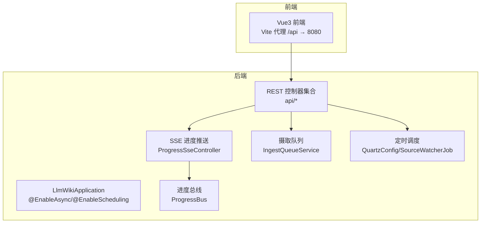
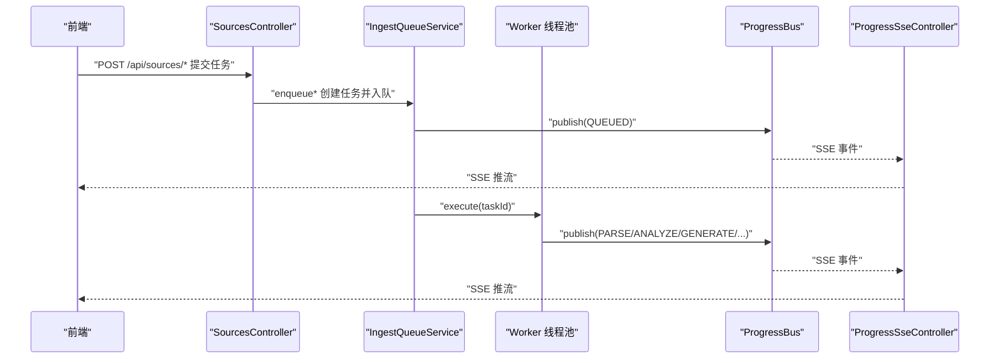
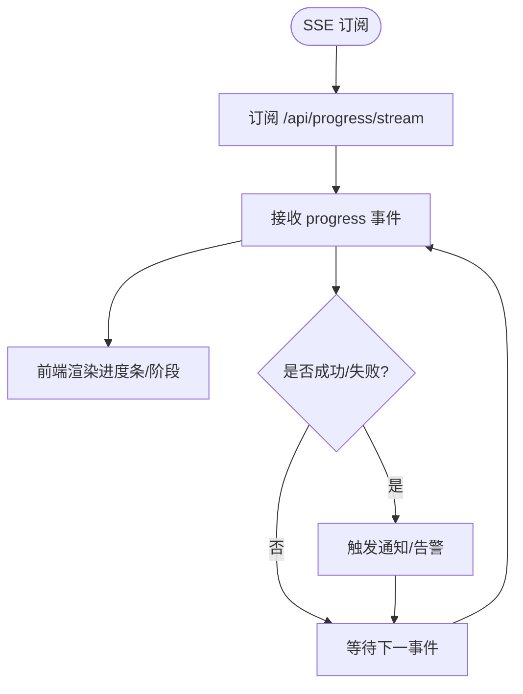
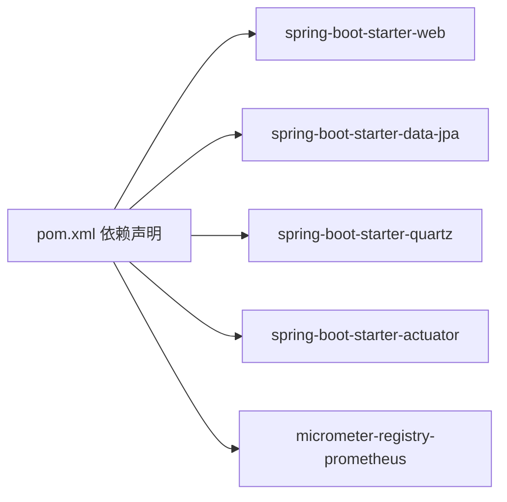

# 监控告警系统

<cite>
**本文引用的文件**
- [pom.xml](file://pom.xml)
- [application.yml](file://src/main/resources/application.yml)
- [LlmWikiApplication.java](file://src/main/java/com/example/llmwiki/LlmWikiApplication.java)
- [ProgressSseController.java](file://src/main/java/com/example/llmwiki/api/ProgressSseController.java)
- [ProgressBus.java](file://src/main/java/com/example/llmwiki/progress/ProgressBus.java)
- [ProgressEvent.java](file://src/main/java/com/example/llmwiki/progress/ProgressEvent.java)
- [IngestQueueService.java](file://src/main/java/com/example/llmwiki/queue/IngestQueueService.java)
- [QuartzConfig.java](file://src/main/java/com/example/llmwiki/scheduler/QuartzConfig.java)
- [SourceWatcherJob.java](file://src/main/java/com/example/llmwiki/scheduler/SourceWatcherJob.java)
- [ScheduleController.java](file://src/main/java/com/example/llmwiki/api/ScheduleController.java)
- [IngestProperties.java](file://src/main/java/com/example/llmwiki/config/IngestProperties.java)
- [README.md](file://README.md)
</cite>

## 目录
1. [简介](#简介)
2. [项目结构](#项目结构)
3. [核心组件](#核心组件)
4. [架构总览](#架构总览)
5. [详细组件分析](#详细组件分析)
6. [依赖关系分析](#依赖关系分析)
7. [性能考量](#性能考量)
8. [故障排查指南](#故障排查指南)
9. [结论](#结论)
10. [附录](#附录)

## 简介
本文件面向 LLM Wiki 项目的监控与告警体系建设，结合现有代码实现，给出可落地的健康检查、性能指标、异常告警、实时进度、日志管理与运维工具建议。当前项目未内置 Spring Boot Actuator、Prometheus、Grafana、ELK Stack 等监控栈依赖，亦未实现邮件/微信/钉钉告警通道。本文在不改变现有实现的前提下，提供“开箱即用”的集成方案与最佳实践，帮助团队快速建立完善的可观测性体系。

## 项目结构
- 后端采用 Spring Boot 3.3.5 + Java 17，核心入口启用异步与定时任务。
- 前后端分离，前端通过 /api 代理访问后端 8080 端口。
- 进度推送基于 SSE（Server-Sent Events），由 ProgressSseController 暴露 /api/progress/stream。
- 定时任务基于 Quartz，支持动态修改 cron 与立即触发。

图表来源
- [LlmWikiApplication.java:19-26](file://src/main/java/com/example/llmwiki/LlmWikiApplication.java#L19-L26)
- [ProgressSseController.java:20-36](file://src/main/java/com/example/llmwiki/api/ProgressSseController.java#L20-L36)
- [ProgressBus.java:17-60](file://src/main/java/com/example/llmwiki/progress/ProgressBus.java#L17-L60)
- [IngestQueueService.java:136-157](file://src/main/java/com/example/llmwiki/queue/IngestQueueService.java#L136-L157)
- [QuartzConfig.java:28-89](file://src/main/java/com/example/llmwiki/scheduler/QuartzConfig.java#L28-L89)

章节来源
- [README.md:21-56](file://README.md#L21-L56)
- [application.yml:1-84](file://src/main/resources/application.yml#L1-L84)
- [LlmWikiApplication.java:19-26](file://src/main/java/com/example/llmwiki/LlmWikiApplication.java#L19-L26)

## 核心组件
- 应用健康检查：当前未引入 Actuator，建议新增健康检查与指标暴露。
- 性能指标监控：建议集成 Micrometer + Prometheus，采集 JVM、业务队列长度、任务耗时等。
- 异常告警：建议完善日志与错误统计，结合外部告警通道。
- 实时进度监控：SSE 已实现，建议增强事件结构与前端订阅策略。
- 日志管理：当前日志级别与路径已配置，建议接入 ELK 进行集中存储与检索。
- 运维工具：提供监控脚本与故障排查清单。

章节来源
- [pom.xml:36-158](file://pom.xml#L36-L158)
- [application.yml:78-84](file://src/main/resources/application.yml#L78-L84)

## 架构总览
下图展示从任务提交到进度推送的关键流程，以及与监控系统的潜在集成点。

图表来源
- [SourcesController.java:45-61](file://src/main/java/com/example/llmwiki/api/SourcesController.java#L45-L61)
- [IngestQueueService.java:136-157](file://src/main/java/com/example/llmwiki/queue/IngestQueueService.java#L136-L157)
- [ProgressBus.java:43-55](file://src/main/java/com/example/llmwiki/progress/ProgressBus.java#L43-L55)
- [ProgressSseController.java:27-35](file://src/main/java/com/example/llmwiki/api/ProgressSseController.java#L27-L35)

## 详细组件分析

### 应用健康检查与自定义健康检查器
- 当前未引入 Spring Boot Actuator，无法通过 /actuator/health 获取健康状态。
- 建议新增 actuator 依赖与健康检查扩展，例如：
  - 数据库连接健康检查
  - LLM 服务可用性检查（Ping）
  - 存储目录可用性检查
  - Quartz 调度器状态检查
- 健康指标建议：
  - /actuator/health 显示应用整体状态
  - /actuator/info 暴露版本、构建信息
  - /actuator/metrics 暴露 JVM 与业务指标

章节来源
- [pom.xml:36-158](file://pom.xml#L36-L158)
- [application.yml:11-29](file://src/main/resources/application.yml#L11-L29)

### 性能指标监控（Prometheus + Grafana）
- Prometheus 集成
  - 引入 micrometer-registry-prometheus 依赖
  - 配置暴露端点（默认 /actuator/prometheus）
- 关键指标建议
  - 业务队列长度：queue.size
  - 任务处理耗时：histogram_seconds{job="ingest.execute"}
  - 任务状态分布：ingest_task_status_total{status}
  - SSE 连接数：gauge_sse_connections
  - Quartz 触发次数：counter_quartz_triggers_total
- Grafana 仪表板
  - 队列积压趋势
  - 任务成功率与失败率
  - SSE 推送延迟
  - LLM 调用耗时与错误率

章节来源
- [pom.xml:36-158](file://pom.xml#L36-L158)
- [IngestQueueService.java:159-181](file://src/main/java/com/example/llmwiki/queue/IngestQueueService.java#L159-L181)

### 异常告警配置（日志聚合、错误统计、告警规则）
- 日志聚合
  - 使用 Logback/Log4j2 输出 JSON 格式日志
  - 集成 ELK（Elasticsearch/Filebeat/Logstash/Kibana）或 Loki/Grafana-Agent
- 错误统计
  - 统计异常类型与频率（如解析失败、嵌入失败、SSE 断连）
  - 通过 /actuator/metrics 暴露错误计数器
- 告警规则示例
  - 任务失败率 > 5% 持续 5 分钟
  - 队列积压 > 100 且持续 10 分钟
  - SSE 连接断流超过阈值
  - LLM Ping 失败连续 3 次

章节来源
- [application.yml:78-84](file://src/main/resources/application.yml#L78-L84)
- [README.md:169-176](file://README.md#L169-L176)

### 实时进度监控（SSE 事件监控、任务状态跟踪、用户通知）
- SSE 事件结构
  - 当前事件包含：taskId、stage、percent、status、message、timestamp
  - 建议增加：sourceRef、sourceKind、nodeCount、edgeCount 等上下文
- 任务状态跟踪
  - 阶段枚举：QUEUED、PARSE、ANALYZE、GENERATE、INDEX、GRAPH、DONE、FAIL、SKIP
  - 百分比与状态需与前端保持一致
- 用户通知
  - 成功/失败事件可映射为站内消息或邮件通知
  - 前端 EventSource 订阅 /api/progress/stream

图表来源
- [ProgressSseController.java:27-35](file://src/main/java/com/example/llmwiki/api/ProgressSseController.java#L27-L35)
- [ProgressBus.java:26-41](file://src/main/java/com/example/llmwiki/progress/ProgressBus.java#L26-L41)
- [ProgressEvent.java:20-42](file://src/main/java/com/example/llmwiki/progress/ProgressEvent.java#L20-L42)

章节来源
- [ProgressSseController.java:20-36](file://src/main/java/com/example/llmwiki/api/ProgressSseController.java#L20-L36)
- [ProgressBus.java:17-60](file://src/main/java/com/example/llmwiki/progress/ProgressBus.java#L17-L60)
- [ProgressEvent.java:16-42](file://src/main/java/com/example/llmwiki/progress/ProgressEvent.java#L16-L42)

### 日志管理（ELK 集成、日志级别、轮转策略）
- 当前日志级别
  - root/INFO，com.example.llmwiki/DEBUG，第三方组件/WARN
- 建议
  - 输出 JSON 格式日志，便于 ELK 解析
  - 配置按天/大小轮转，保留 30 天
  - 将关键业务事件（任务开始/结束、SSE 断连、Quartz 触发）标记为 INFO 或 WARN

章节来源
- [application.yml:78-84](file://src/main/resources/application.yml#L78-L84)

### 运维工具（监控脚本、维护工具、故障排查）
- 监控脚本
  - 健康检查：curl /actuator/health
  - 指标导出：curl /actuator/prometheus
  - 任务统计：查询数据库 ingest_task 统计
- 维护工具
  - 清理过期任务与日志
  - 重建索引/图谱（根据需要）
- 故障排查
  - LLM 连通性：/api/settings/llm/ping
  - SSE 断流：检查 ProgressBus 订阅数与最近事件
  - Quartz 未触发：核对 cron 与 enabled 状态

章节来源
- [README.md:161-176](file://README.md#L161-L176)
- [ScheduleController.java:37-51](file://src/main/java/com/example/llmwiki/api/ScheduleController.java#L37-L51)

### 告警渠道配置（邮件、微信、钉钉）
- 建议方案
  - 邮件：通过 SMTP 或第三方邮件网关
  - 微信：企业微信/飞书机器人
  - 钉钉：钉钉群机器人 Webhook
- 集成方式
  - 在告警平台（如 AlertManager/自研告警中心）中配置上述通道
  - 将 Prometheus 告警规则与通道绑定

章节来源
- [README.md:169-176](file://README.md#L169-L176)

## 依赖关系分析
- 运行时依赖
  - Spring Web、JPA、Quartz、H2、Lucene、Tika、Jsoup、JGraphT、Jackson
- 监控相关依赖（建议新增）
  - spring-boot-starter-actuator
  - micrometer-registry-prometheus
  - logback-layout（JSON 输出）

图表来源
- [pom.xml:36-158](file://pom.xml#L36-L158)

章节来源
- [pom.xml:36-158](file://pom.xml#L36-L158)

## 性能考量
- 队列与并发
  - 任务执行线程数与最大重试次数需与资源匹配，避免阻塞
- SSE 连接
  - 注意连接超时与断线重连，避免内存泄漏
- 指标采集
  - 避免高频直方图/计数器导致 CPU 占用过高
- 日志
  - JSON 格式与轮转策略影响磁盘 IO 与网络带宽

## 故障排查指南
- SSE 无事件
  - 检查 ProgressBus 订阅列表与最近事件缓存
  - 核对 /api/progress/stream 是否可达
- 任务不执行
  - 检查 IngestQueueService 是否入队
  - 核对 Worker 线程池状态
- 定时任务未触发
  - 检查 QuartzConfig 的 cron 与 enabled
  - 通过 /api/schedule/run-now 触发一次测试

章节来源
- [ProgressBus.java:26-41](file://src/main/java/com/example/llmwiki/progress/ProgressBus.java#L26-L41)
- [IngestQueueService.java:159-181](file://src/main/java/com/example/llmwiki/queue/IngestQueueService.java#L159-L181)
- [QuartzConfig.java:74-80](file://src/main/java/com/example/llmwiki/scheduler/QuartzConfig.java#L74-L80)
- [ScheduleController.java:73-77](file://src/main/java/com/example/llmwiki/api/ScheduleController.java#L73-L77)

## 结论
LLM Wiki 已具备 SSE 实时进度与 Quartz 定时任务的基础能力。建议按以下优先级落地监控体系：
1) 新增 Actuator 与基础健康检查
2) 集成 Micrometer + Prometheus + Grafana
3) 完善日志 JSON 输出与 ELK 集成
4) 建立异常告警与通知通道
5) 优化 SSE 事件结构与前端订阅策略

## 附录
- 快速清单
  - 引入 actuator 与 prometheus 依赖
  - 配置 /actuator/* 安全访问
  - 部署 Prometheus 与 Grafana
  - 配置 ELK 或 Loki 收集日志
  - 编写告警规则与通知通道
  - 优化 SSE 事件与前端订阅