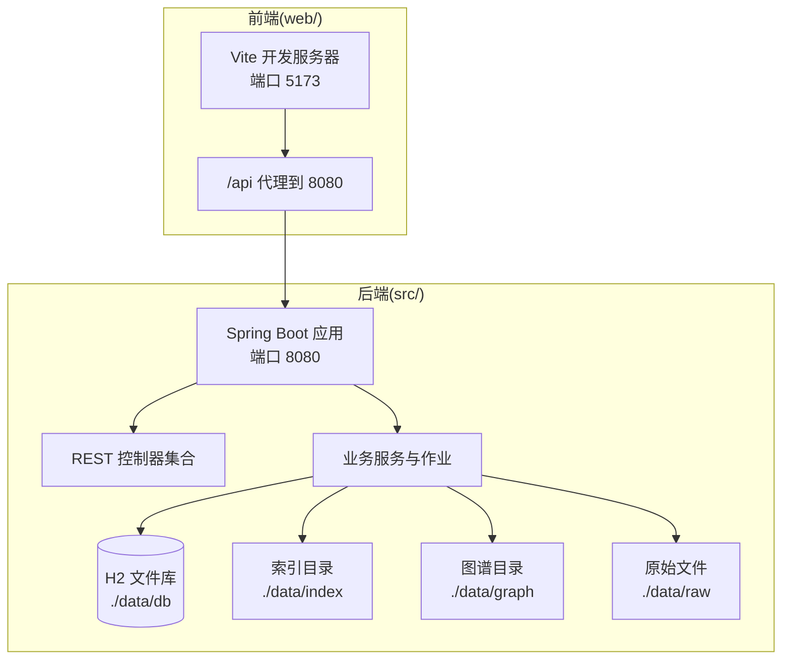
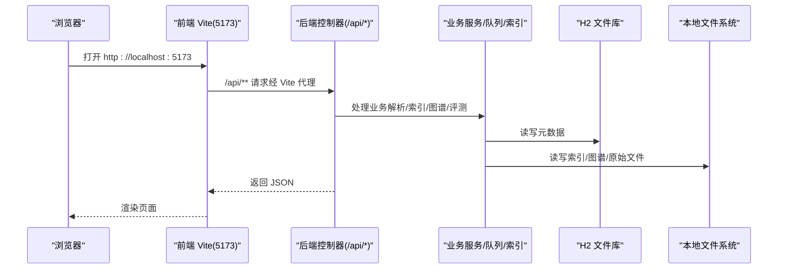
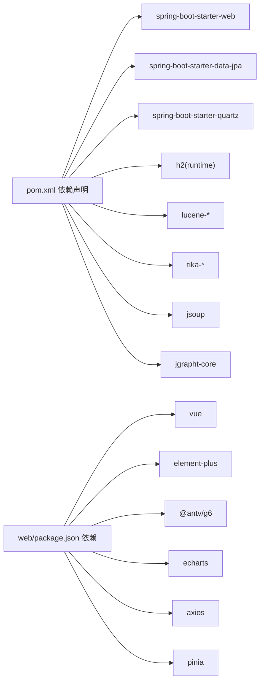

# 部署与运维

<cite>
**本文引用的文件**
- [pom.xml](file://pom.xml)
- [README.md](file://README.md)
- [HELP.md](file://HELP.md)
- [LlmWikiApplication.java](file://src/main/java/com/example/llmwiki/LlmWikiApplication.java)
- [application.yml](file://src/main/resources/application.yml)
- [package.json](file://web/package.json)
- [vite.config.ts](file://web/vite.config.ts)
- [tsconfig.json](file://web/tsconfig.json)
- [mvnw.cmd](file://mvnw.cmd)
- [IngestProperties.java](file://src/main/java/com/example/llmwiki/config/IngestProperties.java)
- [ParserProperties.java](file://src/main/java/com/example/llmwiki/config/ParserProperties.java)
- [StorageProperties.java](file://src/main/java/com/example/llmwiki/config/StorageProperties.java)
- [QuartzConfig.java](file://src/main/java/com/example/llmwiki/scheduler/QuartzConfig.java)
- [ScheduleController.java](file://src/main/java/com/example/llmwiki/api/ScheduleController.java)
- [DashboardController.java](file://src/main/java/com/example/llmwiki/api/DashboardController.java)
- [WikiFileWriter.java](file://src/main/java/com/example/llmwiki/ingest/WikiFileWriter.java)
</cite>

## 目录
1. [简介](#简介)
2. [项目结构](#项目结构)
3. [核心组件](#核心组件)
4. [架构总览](#架构总览)
5. [详细组件分析](#详细组件分析)
6. [依赖关系分析](#依赖关系分析)
7. [性能考虑](#性能考虑)
8. [故障排查指南](#故障排查指南)
9. [结论](#结论)
10. [附录](#附录)

## 简介
本文件面向运维与平台工程团队，提供 LLM Wiki 的全生命周期部署与运维实践指南。内容覆盖开发环境搭建、生产部署方案、配置管理、性能优化、监控告警、日志管理、备份恢复、运维工具以及扩展性设计建议。目标是帮助团队在不同环境中稳定、高效地交付与运营该系统。

## 项目结构
- 后端采用 Spring Boot 3.3.5（Java 17），使用 Maven 构建。
- 前端采用 Vue 3 + Vite，通过 /api 代理访问后端。
- 默认端口：后端 8080，前端 5173。
- 数据存储：内置 H2 文件数据库（开发/演示场景），索引与图谱数据位于本地文件系统。

图表来源
- [README.md:77-113](file://README.md#L77-L113)
- [vite.config.ts:13-21](file://web/vite.config.ts#L13-L21)
- [application.yml:1-84](file://src/main/resources/application.yml#L1-L84)

章节来源
- [README.md:77-113](file://README.md#L77-L113)
- [pom.xml:29-35](file://pom.xml#L29-L35)
- [application.yml:1-84](file://src/main/resources/application.yml#L1-L84)
- [vite.config.ts:13-21](file://web/vite.config.ts#L13-L21)

## 核心组件
- 应用入口与启动：Spring Boot 启动类启用异步与定时任务。
- 配置体系：application.yml 为主配置，结合 Spring Boot 配置属性类实现类型安全读取。
- 定时调度：基于 Quartz，支持动态调整 Cron 与开关。
- 前后端交互：前端通过 /api 代理访问后端，避免跨域问题。
- 数据与文件：H2 文件库 + 本地文件系统目录（raw、wiki、index、graph）。

章节来源
- [LlmWikiApplication.java:19-26](file://src/main/java/com/example/llmwiki/LlmWikiApplication.java#L19-L26)
- [application.yml:1-84](file://src/main/resources/application.yml#L1-L84)
- [QuartzConfig.java:36-80](file://src/main/java/com/example/llmwiki/scheduler/QuartzConfig.java#L36-L80)
- [vite.config.ts:13-21](file://web/vite.config.ts#L13-L21)

## 架构总览
下图展示从浏览器到后端控制器、再到数据与文件系统的整体调用链与数据流。

图表来源
- [README.md:58-73](file://README.md#L58-L73)
- [vite.config.ts:13-21](file://web/vite.config.ts#L13-L21)
- [DashboardController.java:33-46](file://src/main/java/com/example/llmwiki/api/DashboardController.java#L33-L46)

## 详细组件分析

### 开发环境搭建
- 环境要求
  - JDK 17+（推荐 Eclipse Temurin 17）
  - Node.js 18+（推荐 20 LTS）
  - Git
- 依赖安装
  - 后端：使用 Maven Wrapper，无需全局安装 Maven。
  - 前端：在 web 目录执行依赖安装。
- IDE 建议
  - 使用支持 Spring Boot 的 IDE（如 IntelliJ IDEA），开启 Lombok 插件。
  - 前端建议启用 TypeScript/Vue 插件与 Vite 预览功能。

章节来源
- [README.md:119-144](file://README.md#L119-L144)
- [mvnw.cmd:1-190](file://mvnw.cmd#L1-L190)
- [package.json:1-31](file://web/package.json#L1-L31)

### 生产部署配置
- 容器化部署（建议）
  - 基于官方镜像构建：选择合适的基础镜像，打包后端 jar 与前端静态产物，暴露 8080（后端）与 80（可选 Nginx）。
  - 前端产物构建：在 web 目录执行构建，将 dist 或静态产物挂载至 Nginx。
  - 数据持久化：将 ./data 目录映射为持久卷，确保 H2 文件库、索引、图谱与原始文件不丢失。
- Nginx 反向代理
  - 将 /api 前缀转发至后端 8080；静态资源由 Nginx 提供。
  - 建议开启 gzip、缓存静态资源、设置合理的超时与限流。
- SSL 证书
  - 使用 Nginx 配置 HTTPS，证书可通过 Let’s Encrypt 自动续期。
  - 如需内网访问，可使用自签证书并正确配置信任链。

章节来源
- [README.md:119-144](file://README.md#L119-L144)
- [vite.config.ts:13-21](file://web/vite.config.ts#L13-L21)
- [application.yml:1-84](file://src/main/resources/application.yml#L1-L84)

### 应用配置管理
- application.yml
  - 服务器端口、文件上传大小限制、H2 数据源、JPA 方言、Quartz 线程数与存储类型。
  - llm-wiki.storage：根目录与子目录（raw、wiki、index、graph）。
  - llm-wiki.llm：聊天、嵌入、视觉模型的基础地址、模型名、温度、超时。
  - llm-wiki.parser：飞书、钉钉、OCR 的开关与凭据。
  - llm-wiki.scheduler：是否启用、Cron 表达式。
  - llm-wiki.ingest：最大重试次数、工作线程数。
  - logging：根日志级别与包级别。
- 配置属性类
  - StorageProperties：读取 storage.* 配置。
  - ParserProperties：读取 parser.* 配置。
  - IngestProperties：读取 ingest 与 scheduler 配置。
- 环境变量
  - 可通过环境变量覆盖 application.yml 中的敏感项（如 LLM API Key、数据库密码）。
- 配置热更新
  - README 明确：所有 LLM 配置可在前端 Settings 页面修改并热生效，无需重启。

章节来源
- [application.yml:1-84](file://src/main/resources/application.yml#L1-L84)
- [StorageProperties.java:13-28](file://src/main/java/com/example/llmwiki/config/StorageProperties.java#L13-L28)
- [ParserProperties.java:13-45](file://src/main/java/com/example/llmwiki/config/ParserProperties.java#L13-L45)
- [IngestProperties.java:13-32](file://src/main/java/com/example/llmwiki/config/IngestProperties.java#L13-L32)
- [README.md:212-212](file://README.md#L212-L212)

### 性能优化建议
- JVM 参数调优
  - 堆内存：根据数据规模与并发设定初始与最大堆；结合 GC 日志分析吞吐与停顿。
  - GC：优先使用 G1/ZGC（取决于 JDK 版本），结合大对象与元空间配置。
  - JIT：保持默认，避免过度内联导致 TLAB 竞争。
- 数据库连接池优化
  - H2 为文件型数据库，适合小规模场景；生产建议迁移到 PostgreSQL/MySQL 并启用连接池（HikariCP）。
  - 调整连接池大小、空闲超时、最大生命周期，配合慢查询日志定位瓶颈。
- 前端资源优化
  - 构建产物开启压缩与缓存；拆分第三方库与业务代码；合理使用懒加载与预加载。
  - Nginx 层面启用 gzip、HTTP/2、CDN 加速与缓存头。

章节来源
- [application.yml:11-29](file://src/main/resources/application.yml#L11-L29)
- [README.md:119-144](file://README.md#L119-L144)

### 监控告警
- 健康检查
  - Spring Boot Actuator：暴露 /actuator/health 与 /actuator/prometheus（如引入）。
  - 自定义健康指示器：检查数据库连通性、索引目录可用性、LLM 服务可达性。
- 性能指标
  - 指标采集：Prometheus + Grafana；关注请求延迟、错误率、线程池饱和度、文件系统 IO。
  - 前端：ECharts 展示评测指标（answerRate、hitRate@K、平均相关度、平均延迟）。
- 异常告警
  - 基于日志与指标阈值触发告警；对 LLM 调用失败、索引重建异常、磁盘空间不足进行分级告警。

章节来源
- [README.md:159-177](file://README.md#L159-L177)
- [web/src/views/Eval.vue:27-57](file://web/src/views/Eval.vue#L27-L57)

### 日志管理
- 日志级别
  - application.yml 中已配置根级别与特定包级别（如 PDFBox、POI 警告级别）。
- 日志轮转
  - 建议使用 logback/log4j2 的滚动策略，按大小与时间切分，保留周期与归档。
- 日志分析
  - 结合 ELK/EFK 或 Loki + Promtail，对错误堆栈、慢查询、LLM 调用耗时进行检索与聚合。

章节来源
- [application.yml:78-84](file://src/main/resources/application.yml#L78-L84)

### 备份恢复与业务连续性
- 数据备份策略
  - H2 文件库：定期复制 ./data/db 目录；建议在应用停止或 H2 AUTO_SERVER 关闭状态下进行快照。
  - 索引与图谱：定期复制 ./data/index 与 ./data/graph。
  - 原始文件：定期备份 ./data/raw。
- 灾难恢复计划
  - 快速恢复：准备最小可用环境（容器/虚拟机），恢复数据目录后启动应用。
  - 业务连续性：多副本部署 + 健康检查 + 自动故障转移；对 LLM 服务采用多供应商与降级策略。
- 评测与验证
  - 恢复后执行关键查询与图谱校验，确保检索与可视化正常。

章节来源
- [application.yml:34-38](file://src/main/resources/application.yml#L34-L38)
- [README.md:131-135](file://README.md#L131-L135)

### 运维工具
- 部署脚本
  - Docker Compose：封装后端、Nginx、持久卷与网络；支持多环境变量切换。
  - Shell 脚本：一键构建前端、打包后端、推送镜像、拉起容器。
- 监控脚本
  - Prometheus Exporter：采集 JVM、文件系统、进程指标；结合告警规则。
- 维护工具
  - 数据迁移：H2 → PostgreSQL 的迁移工具与脚本。
  - 索引重建：提供命令行入口，清理旧索引并触发重建。

章节来源
- [README.md:119-144](file://README.md#L119-L144)

### 扩展性设计
- 水平扩展
  - 无状态后端：通过负载均衡横向扩展；共享存储（NFS/S3）存放 ./data 目录。
  - 前端：静态资源 CDN 分发，减少后端压力。
- 垂直扩展
  - 单机提升 CPU/内存/IO；对 H2 迁移至 PostgreSQL 并启用主从复制。
- 微服务治理
  - 服务注册与发现：Consul/Nacos；配置中心：Apollo/Nacos。
  - API 网关：限流、鉴权、熔断；链路追踪：SkyWalking/Zipkin。

章节来源
- [README.md:119-144](file://README.md#L119-L144)

## 依赖关系分析
- 后端依赖
  - Spring Boot Starter Web、Data JPA、Validation、Quartz。
  - H2（运行时）、Lucene（全文检索与向量）、Tika（文件解析）、Jsoup（网页抓取）、JGraphT（图算法）。
- 前端依赖
  - Vue 3、Element Plus、AntV G6、ECharts、Axios、Pinia、markdown-it。
- 构建与打包
  - Maven Wrapper；Spring Boot Maven Plugin；OCI 镜像构建参考 HELP 文档。

图表来源
- [pom.xml:36-159](file://pom.xml#L36-L159)
- [package.json:12-29](file://web/package.json#L12-L29)

章节来源
- [pom.xml:36-159](file://pom.xml#L36-L159)
- [package.json:12-29](file://web/package.json#L12-L29)
- [HELP.md:6-8](file://HELP.md#L6-L8)

## 性能考虑
- 端到端延迟
  - 前端代理与后端处理时间；对大文件上传与 LLM 调用设置超时与重试。
- 索引与检索
  - Lucene 索引合并策略与段大小；BM25 + 向量融合的 RRF 调参。
- 并发与线程
  - Quartz 线程数与 ingest 工作线程数；避免过多并发导致磁盘与网络拥塞。
- 存储与 IO
  - 将 ./data 目录置于高性能磁盘；对索引与图谱启用 SSD 缓存。

章节来源
- [application.yml:26-29](file://src/main/resources/application.yml#L26-L29)
- [application.yml:74-76](file://src/main/resources/application.yml#L74-L76)

## 故障排查指南
- 启动报错
  - 端口占用：确认 8080/5173 未被占用；修改 application.yml 与 vite.config.ts 对应端口。
  - 依赖缺失：确保 JDK 17+、Node.js 18+；使用 mvnw.cmd 与 npm install。
- LLM 相关
  - 连接失败：检查 Settings 中的 base-url 与 api-key；确认网络可达与超时设置合理。
  - 维度不匹配：更换 embedding 模型后删除 ./data/index 并重建。
- 飞书/钉钉
  - 401：在 application.yml 中启用对应解析器并填写凭据；仅启用 watcher 不会自动鉴权。
- 定时任务
  - 未执行：检查 scheduler.enabled 与 cron；通过 /api/schedule/config 更新配置并触发 /api/schedule/run-now。
- 日志与诊断
  - 查看 application.yml 中的日志级别；必要时临时提升到 DEBUG；结合健康检查与指标定位问题。

章节来源
- [README.md:228-248](file://README.md#L228-L248)
- [ScheduleController.java:38-78](file://src/main/java/com/example/llmwiki/api/ScheduleController.java#L38-L78)
- [QuartzConfig.java:74-80](file://src/main/java/com/example/llmwiki/scheduler/QuartzConfig.java#L74-L80)
- [application.yml:78-84](file://src/main/resources/application.yml#L78-L84)

## 结论
通过明确的开发环境、生产部署、配置管理、性能优化、监控告警、日志与备份恢复、运维工具与扩展性设计，LLM Wiki 可在不同规模与复杂度的环境中稳定运行。建议在生产中逐步替换 H2 为关系型数据库，强化容器化与多副本部署，并建立完善的 CI/CD 与变更管理流程。

## 附录
- 关键 API 速查
  - /api/settings/llm、/api/sources/file、/api/sources/url、/api/sources/feishu、/api/sources/dingtalk、/api/sources/tasks、/api/progress/stream、/api/wiki/pages、/api/wiki/page/{slug}、/api/graph/data、/api/search、/api/insights/gap、/api/schedule/run-now、/api/eval/run、/api/dashboard/summary。
- 前端构建与预览
  - 在 web 目录执行 npm run build 生成静态产物；使用 npm run preview 预览本地构建结果。

章节来源
- [README.md:159-177](file://README.md#L159-L177)
- [package.json:7-10](file://web/package.json#L7-L10)