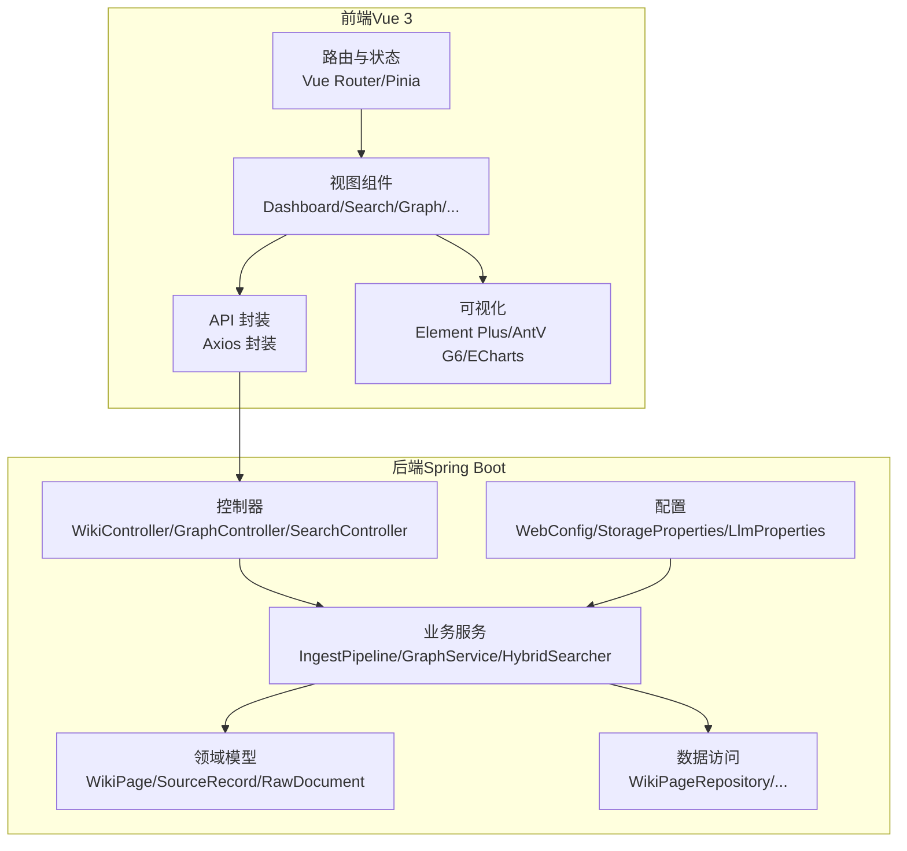
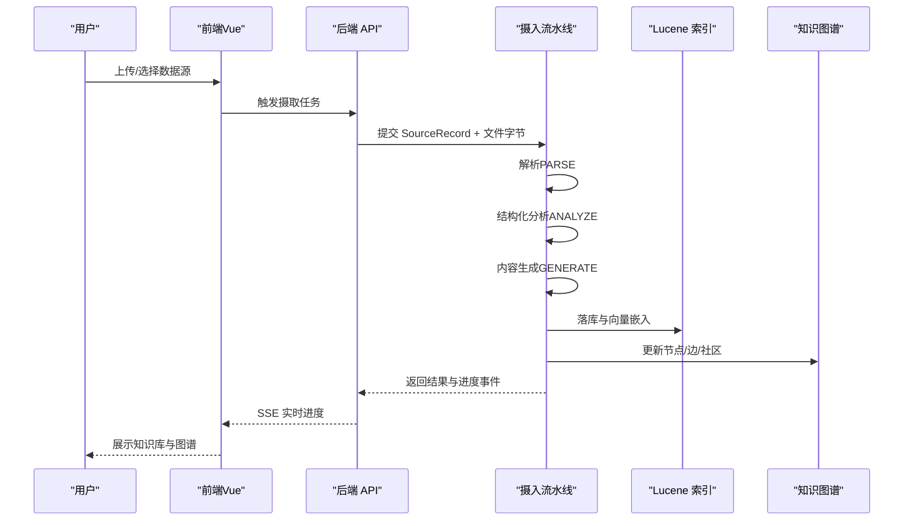
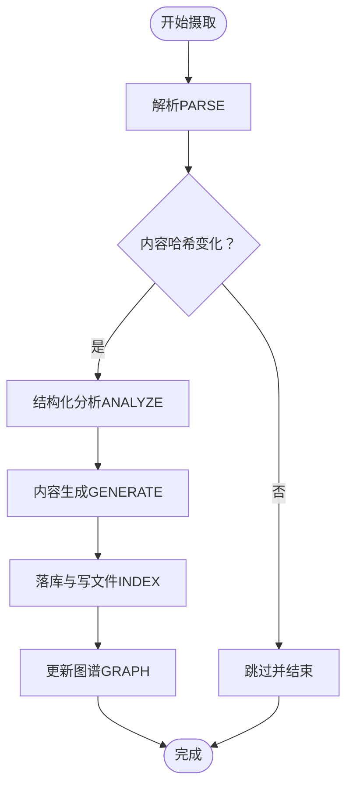
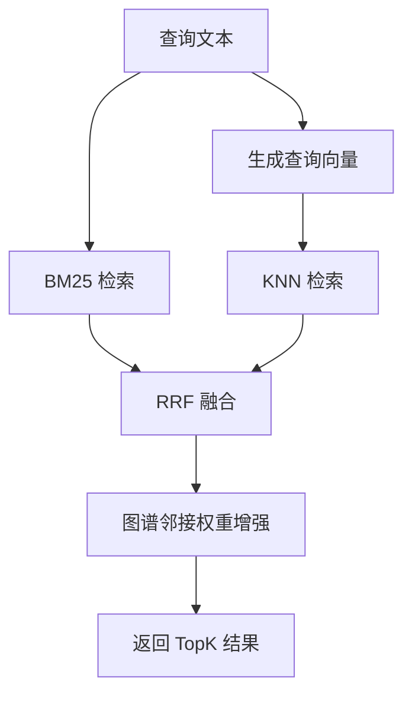
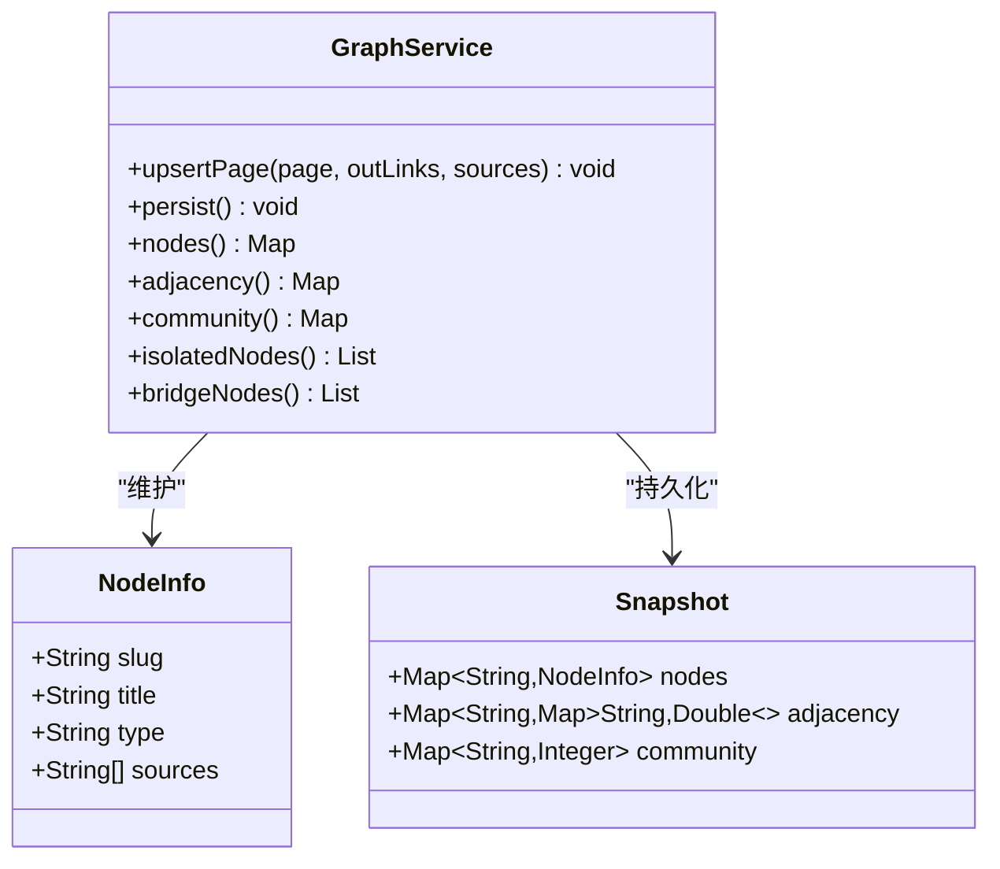
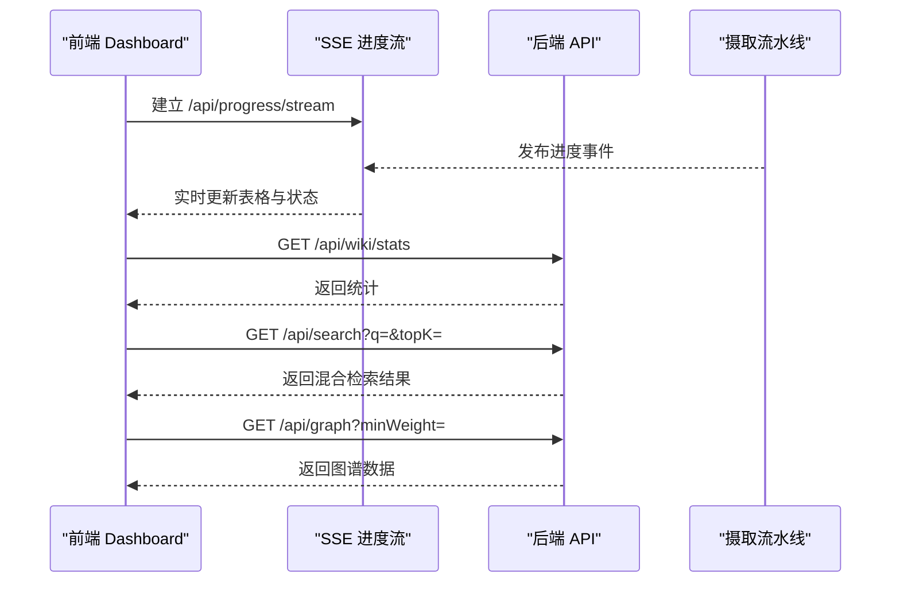
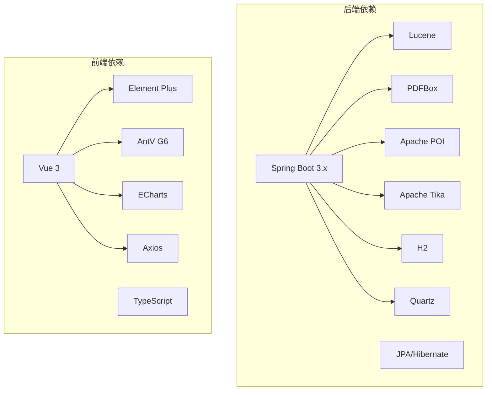

# 项目概述

<cite>
**本文档引用的文件**
- [LlmWikiApplication.java](file://src/main/java/com/example/llmwiki/LlmWikiApplication.java)
- [application.yml](file://src/main/resources/application.yml)
- [pom.xml](file://pom.xml)
- [WebConfig.java](file://src/main/java/com/example/llmwiki/config/WebConfig.java)
- [IngestPipeline.java](file://src/main/java/com/example/llmwiki/ingest/IngestPipeline.java)
- [HybridSearcher.java](file://src/main/java/com/example/llmwiki/retrieval/HybridSearcher.java)
- [GraphService.java](file://src/main/java/com/example/llmwiki/graph/GraphService.java)
- [WikiController.java](file://src/main/java/com/example/llmwiki/api/WikiController.java)
- [SearchController.java](file://src/main/java/com/example/llmwiki/api/SearchController.java)
- [GraphController.java](file://src/main/java/com/example/llmwiki/api/GraphController.java)
- [WikiPage.java](file://src/main/java/com/example/llmwiki/domain/WikiPage.java)
- [main.ts](file://web/src/main.ts)
- [package.json](file://web/package.json)
- [App.vue](file://web/src/App.vue)
- [Dashboard.vue](file://web/src/views/Dashboard.vue)
</cite>

## 目录
1. [简介](#简介)
2. [项目结构](#项目结构)
3. [核心组件](#核心组件)
4. [架构总览](#架构总览)
5. [详细组件分析](#详细组件分析)
6. [依赖关系分析](#依赖关系分析)
7. [性能考虑](#性能考虑)
8. [故障排查指南](#故障排查指南)
9. [结论](#结论)
10. [附录](#附录)

## 简介
LLM Wiki 是一个基于人工智能的自构建个人知识库系统，灵感源自 Andrej Karpathy 的 llm-wiki 模式。其核心价值主张是将大型语言模型（LLM）作为知识库的“长期记忆维护者”，将来自多种异构来源（PDF、Word、Excel、图片、网页、飞书、钉钉等）的增量数据编译为带有交叉引用的维基百科式知识库，并自动构建知识图谱、识别知识空白、定时刷新与可量化评估。

该系统采用 Spring Boot + Vue.js 的全栈分离架构，后端通过 Spring Boot 提供 REST API 与任务调度能力，前端使用 Vue 3 + TypeScript 构建现代化的用户界面，支持实时进度展示、交互式知识图谱与可视化分析。

## 项目结构
项目采用典型的分层与按功能域划分的组织方式：
- 后端模块（Spring Boot）
  - 控制器层：API 接口定义（Wiki、Search、Graph、Schedule 等）
  - 领域层：实体与数据模型（WikiPage、SourceRecord、RawDocument 等）
  - 服务层：业务流程（IngestPipeline、GraphService、HybridSearcher 等）
  - 配置层：Web、存储、LLM、解析器等配置
  - 数据访问：JPA Repository
  - 进度与事件：SSE 进度总线
- 前端模块（Vue 3）
  - 视图层：Dashboard、Search、Graph、Insights、Schedule、Settings 等
  - API 层：HTTP 客户端封装
  - 路由与状态：Vue Router + Pinia
  - 可视化：Element Plus、AntV G6、ECharts

图表来源
- [LlmWikiApplication.java:19-26](file://src/main/java/com/example/llmwiki/LlmWikiApplication.java#L19-L26)
- [WebConfig.java:15-34](file://src/main/java/com/example/llmwiki/config/WebConfig.java#L15-L34)
- [IngestPipeline.java:45-109](file://src/main/java/com/example/llmwiki/ingest/IngestPipeline.java#L45-L109)
- [GraphService.java:34-69](file://src/main/java/com/example/llmwiki/graph/GraphService.java#L34-L69)
- [HybridSearcher.java:31-41](file://src/main/java/com/example/llmwiki/retrieval/HybridSearcher.java#L31-L41)
- [WikiController.java:22-50](file://src/main/java/com/example/llmwiki/api/WikiController.java#L22-L50)
- [main.ts:1-14](file://web/src/main.ts#L1-L14)

章节来源
- [LlmWikiApplication.java:8-26](file://src/main/java/com/example/llmwiki/LlmWikiApplication.java#L8-L26)
- [application.yml:1-84](file://src/main/resources/application.yml#L1-L84)
- [pom.xml:29-159](file://pom.xml#L29-L159)
- [WebConfig.java:9-34](file://src/main/java/com/example/llmwiki/config/WebConfig.java#L9-L34)
- [main.ts:1-14](file://web/src/main.ts#L1-L14)
- [package.json:1-31](file://web/package.json#L1-L31)

## 核心组件
- 摄入流水线（IngestPipeline）
  - 两步式链路：解析（PARSE）→ 结构化分析（ANALYZE）→ 内容生成（GENERATE）→ 落库/索引/图谱（INDEX/GRAPH）
  - 支持增量缓存（基于内容哈希），避免重复处理
  - 与进度总线集成，提供实时进度反馈
- 混合检索（HybridSearcher）
  - BM25 文本检索 + 向量 KNN 检索，使用 RRF 融合策略
  - 支持图谱邻接权重增强，提升相关性
- 知识图谱（GraphService）
  - 内存图 + JSON 持久化，支持节点属性、邻接表、社区划分
  - 提供孤立节点、桥节点等结构性洞察
- 控制器与 API
  - WikiController：页面列表、详情、统计
  - SearchController：混合检索接口
  - GraphController：图谱数据与洞察接口
- 前端控制台（Dashboard）
  - 实时进度（SSE）、任务概览、页面类型分布（饼图）

章节来源
- [IngestPipeline.java:33-109](file://src/main/java/com/example/llmwiki/ingest/IngestPipeline.java#L33-L109)
- [HybridSearcher.java:25-111](file://src/main/java/com/example/llmwiki/retrieval/HybridSearcher.java#L25-L111)
- [GraphService.java:24-197](file://src/main/java/com/example/llmwiki/graph/GraphService.java#L24-L197)
- [WikiController.java:16-50](file://src/main/java/com/example/llmwiki/api/WikiController.java#L16-L50)
- [SearchController.java:12-31](file://src/main/java/com/example/llmwiki/api/SearchController.java#L12-L31)
- [GraphController.java:15-85](file://src/main/java/com/example/llmwiki/api/GraphController.java#L15-L85)
- [Dashboard.vue:1-119](file://web/src/views/Dashboard.vue#L1-L119)

## 架构总览
系统采用“解析-分析-生成-索引-图谱”的闭环架构，结合 Spring Boot 的异步与调度能力，以及 Vue 3 的响应式 UI，形成从数据摄取到知识呈现的一体化体验。

图表来源
- [IngestPipeline.java:65-109](file://src/main/java/com/example/llmwiki/ingest/IngestPipeline.java#L65-L109)
- [HybridSearcher.java:42-111](file://src/main/java/com/example/llmwiki/retrieval/HybridSearcher.java#L42-L111)
- [GraphService.java:71-104](file://src/main/java/com/example/llmwiki/graph/GraphService.java#L71-L104)
- [Dashboard.vue:95-108](file://web/src/views/Dashboard.vue#L95-L108)

## 详细组件分析

### 摄入流水线（IngestPipeline）
- 流程阶段
  - PARSE：根据来源类型选择解析器，产出 RawDocument
  - ANALYZE：LLM 生成结构化分析（摘要、实体、概念、连接、矛盾、推荐大纲）
  - GENERATE：LLM 生成多页 Wiki 草稿（含类型、标题、slug、摘要、正文、标签、外链）
  - INDEX/GRAPH：持久化页面、写入 Markdown、建立 Lucene 索引、更新图谱并检测社区
- 增量机制
  - 基于内容哈希判断是否跳过
  - 更新 SourceRecord 的哈希与抓取时间
- 进度上报
  - 通过 ProgressBus 发布阶段、百分比、状态与消息

图表来源
- [IngestPipeline.java:65-109](file://src/main/java/com/example/llmwiki/ingest/IngestPipeline.java#L65-L109)
- [IngestPipeline.java:111-177](file://src/main/java/com/example/llmwiki/ingest/IngestPipeline.java#L111-L177)
- [IngestPipeline.java:179-209](file://src/main/java/com/example/llmwiki/ingest/IngestPipeline.java#L179-L209)

章节来源
- [IngestPipeline.java:33-251](file://src/main/java/com/example/llmwiki/ingest/IngestPipeline.java#L33-L251)

### 混合检索（HybridSearcher）
- 检索策略
  - BM25：基于 Lucene 的全文检索
  - KNN：基于嵌入向量的相似度检索
  - 融合：RRF（Reciprocal Rank Fusion）
  - 图谱增强：对命中节点的邻居进行加权
- 异常降级
  - 当嵌入不可用时，回退至 BM25 单通

图表来源
- [HybridSearcher.java:42-111](file://src/main/java/com/example/llmwiki/retrieval/HybridSearcher.java#L42-L111)

章节来源
- [HybridSearcher.java:25-137](file://src/main/java/com/example/llmwiki/retrieval/HybridSearcher.java#L25-L137)

### 知识图谱（GraphService）
- 数据结构
  - 节点：slug → NodeInfo（标题、类型、来源、标签）
  - 邻接：slug → {邻接 slug → 权重}
  - 社区：slug → communityId
- 更新策略
  - upsertPage：基于 out_links 建立直接链接权重，基于 source overlap 建立共享来源权重
  - persist：JSON 快照持久化
- 洞察计算
  - 孤立节点：度 ≤ 1
  - 桥节点：连接 ≥ 3 个不同社区

图表来源
- [GraphService.java:34-197](file://src/main/java/com/example/llmwiki/graph/GraphService.java#L34-L197)

章节来源
- [GraphService.java:24-197](file://src/main/java/com/example/llmwiki/graph/GraphService.java#L24-L197)

### API 与前端集成
- 后端 API
  - WikiController：页面列表、详情、统计
  - SearchController：混合检索
  - GraphController：图谱数据与洞察
- 前端控制台
  - Dashboard：核心指标、实时进度（SSE）、任务与类型分布
  - 使用 Element Plus、AntV G6、ECharts 进行可视化

图表来源
- [Dashboard.vue:95-108](file://web/src/views/Dashboard.vue#L95-L108)
- [WikiController.java:41-49](file://src/main/java/com/example/llmwiki/api/WikiController.java#L41-L49)
- [SearchController.java:25-30](file://src/main/java/com/example/llmwiki/api/SearchController.java#L25-L30)
- [GraphController.java:31-74](file://src/main/java/com/example/llmwiki/api/GraphController.java#L31-L74)

章节来源
- [WikiController.java:16-50](file://src/main/java/com/example/llmwiki/api/WikiController.java#L16-L50)
- [SearchController.java:12-31](file://src/main/java/com/example/llmwiki/api/SearchController.java#L12-L31)
- [GraphController.java:15-85](file://src/main/java/com/example/llmwiki/api/GraphController.java#L15-L85)
- [Dashboard.vue:1-119](file://web/src/views/Dashboard.vue#L1-L119)

## 依赖关系分析
- 技术栈概览
  - 后端：Java 17+、Spring Boot 3.x、JPA、Quartz、Lucene、Apache PDFBox/Tika/Poi、H2、Lombok
  - 前端：Vue 3、TypeScript、Element Plus、AntV G6、ECharts、Axios、Pinia、Vue Router
- 关键依赖
  - 解析：PDFBox、POI、Tika、Jsoup、Readability4j
  - 搜索：Lucene（BM25 + 向量 KNN）
  - 图谱：JGraphT（Louvain 社区检测）
  - 配置：YAML（frontmatter）、CSV（评估）

图表来源
- [pom.xml:36-159](file://pom.xml#L36-L159)
- [package.json:12-30](file://web/package.json#L12-L30)

章节来源
- [pom.xml:29-171](file://pom.xml#L29-L171)
- [package.json:1-31](file://web/package.json#L1-L31)

## 性能考虑
- 摄入性能
  - 增量缓存：基于内容哈希避免重复处理
  - 工作线程与重试：可配置的 worker 数与最大重试次数
- 检索性能
  - BM25 + 向量 KNN 双通道融合，RRF 提升排序稳定性
  - 图谱邻接权重在融合阶段进行，减少二次扫描
- 存储与索引
  - Lucene 索引按 slug 建立，向量维度可配置
  - H2 内嵌数据库适合本地开发与演示场景
- 前端渲染
  - ECharts 饼图按需渲染，SSE 流式更新表格，避免全量刷新

## 故障排查指南
- 常见问题定位
  - LLM 嵌入失败：检查 LLM 配置（base-url、api-key、model、超时），查看日志降级提示
  - 解析异常：确认解析器启用状态（飞书、钉钉、OCR），检查文件格式与大小限制
  - 检索无结果：确认索引是否建立，或临时回退至 BM25 单通
  - 图谱为空：确认是否完成至少一次摄取，检查持久化 JSON 是否存在
- 日志与监控
  - application.yml 中设置日志级别，关注 com.example.llmwiki 包的日志
  - Dashboard 的 SSE 连接状态与进度事件可用于实时观测

章节来源
- [application.yml:78-84](file://src/main/resources/application.yml#L78-L84)
- [HybridSearcher.java:82-86](file://src/main/java/com/example/llmwiki/retrieval/HybridSearcher.java#L82-L86)
- [GraphService.java:106-118](file://src/main/java/com/example/llmwiki/graph/GraphService.java#L106-L118)

## 结论
LLM Wiki 通过“解析-分析-生成-索引-图谱”的闭环设计，将异构数据转化为结构化的知识库，并提供智能检索与可视化洞察。其 Spring Boot + Vue.js 的全栈分离架构既保证了后端的可扩展性，也提供了现代化的前端体验。对于初学者，系统提供了直观的仪表盘与实时进度；对于有经验的开发者，系统具备清晰的模块边界、可配置的 LLM 与解析器、以及完善的日志与监控能力，便于二次开发与定制。

## 附录
- 配置参考
  - 存储目录：raw、wiki、index、graph 根目录与子目录
  - LLM：聊天、嵌入、视觉模型配置与超时
  - 解析器：飞书、钉钉、OCR 开关与参数
  - 调度：开关与 Cron 表达式
- 前端运行
  - 依赖安装与启动脚本位于 package.json
  - 应用入口在 main.ts，UI 主框架在 App.vue

章节来源
- [application.yml:31-77](file://src/main/resources/application.yml#L31-L77)
- [package.json:7-11](file://web/package.json#L7-L11)
- [main.ts:1-14](file://web/src/main.ts#L1-L14)
- [App.vue:1-38](file://web/src/App.vue#L1-L38)